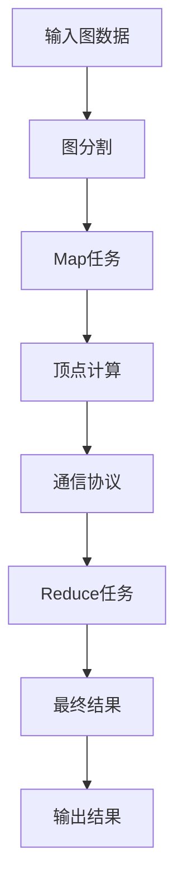

                 

# Pregel原理与代码实例讲解

> 关键词：Pregel, 图计算, 分布式计算, 顶点计算, 通信复杂度, MapReduce, 图分割, 并行算法

## 1. 背景介绍

### 1.1 问题由来
随着大数据和分布式计算的迅猛发展，处理大规模图数据成为计算机科学领域的热点问题之一。传统的图计算方法往往需要占用大量内存，难以应对超大规模数据集。针对这一问题，Google于2006年提出了Pregel算法，以分布式图计算框架的形式，对大规模图数据进行高效处理。

Pregel算法基于MapReduce模型，通过将图分割成若干子图，在多个节点上并行计算，极大地提高了图计算的效率和可扩展性。Pregel在处理社交网络、推荐系统、知识图谱等领域有着广泛的应用，是现代图计算领域的经典算法之一。

### 1.2 问题核心关键点
Pregel算法的核心思想是将大规模图数据划分成若干子图，在多个节点上并行执行图计算。Pregel算法具有以下几个关键点：

1. **图分割**：将大规模图数据划分成若干子图，每个子图为一个Map任务。
2. **顶点计算**：在每个Map任务中，对子图内的顶点进行局部计算，得到中间结果。
3. **全局同步**：通过通信协议，将所有Map任务的中间结果同步到Reduce任务中。
4. **Reduce计算**：在Reduce任务中，对所有Map任务的中间结果进行全局计算，得到最终结果。

Pregel算法通过MapReduce模型实现了图计算的并行化，极大地提高了处理大规模图数据的能力。其核心在于如何将大规模图数据有效地划分成若干子图，以及如何在各个节点上高效地进行顶点计算和数据传输。

## 2. 核心概念与联系

### 2.1 核心概念概述

为更好地理解Pregel算法，我们首先介绍几个核心概念：

- **图**：由顶点和边组成的数据结构，用于表示实体之间的关系。
- **Map任务**：Pregel算法将大规模图数据划分成若干子图，每个子图为一个Map任务，在Map任务中对子图内的顶点进行局部计算。
- **Reduce任务**：Map任务的中间结果需要被传递到Reduce任务中，在Reduce任务中对所有Map任务的中间结果进行全局计算，得到最终结果。
- **通信协议**：用于在各个Map任务之间传递中间结果的协议，Pregel算法中使用的是 flooding 协议。

这些核心概念构成了Pregel算法的基础，下面我们将通过一个具体的例子来说明Pregel算法的核心流程。

### 2.2 概念间的关系

Pregel算法的核心流程可以通过以下Mermaid流程图来展示：


这个流程图展示了Pregel算法的核心流程：首先将输入图数据分割成若干子图，然后在各个子图上执行Map任务进行顶点计算，通过通信协议将中间结果传递给Reduce任务，最终在Reduce任务中进行全局计算得到最终结果。

### 2.3 核心概念的整体架构

在实际应用中，Pregel算法通常被部署在分布式计算环境中，每个Map任务在单个节点上执行，Reduce任务在主节点上执行。这种分布式架构使得Pregel算法能够高效地处理大规模图数据。

以下是一个综合的流程图，展示了Pregel算法在分布式计算环境中的整体架构：



这个综合流程图展示了Pregel算法在分布式计算环境中的整体架构，每个Map任务在单个节点上执行，Reduce任务在主节点上执行，最终输出结果。

## 3. 核心算法原理 & 具体操作步骤
### 3.1 算法原理概述

Pregel算法的核心思想是将大规模图数据划分成若干子图，在多个节点上并行计算。具体而言，Pregel算法通过将图数据划分成若干子图，在各个节点上执行Map任务，进行顶点计算，并通过通信协议将中间结果传递给Reduce任务，最终得到全局计算结果。

Pregel算法基于MapReduce模型，具有以下特点：

- **数据并行**：通过将图数据划分成若干子图，在多个节点上并行执行Map任务。
- **顶点计算**：在Map任务中，对子图内的顶点进行局部计算，得到中间结果。
- **通信协议**：通过通信协议，将Map任务的中间结果传递到Reduce任务中。
- **全局同步**：在Reduce任务中，对所有Map任务的中间结果进行全局计算，得到最终结果。

Pregel算法的关键在于如何高效地进行图分割和顶点计算，以及如何设计高效的通信协议，确保数据在各个节点之间的传输效率。

### 3.2 算法步骤详解

Pregel算法的基本步骤包括图分割、顶点计算、通信协议和Reduce计算。下面我们将详细介绍这些步骤的实现。

#### 3.2.1 图分割

Pregel算法通过将图数据划分成若干子图，在各个节点上执行Map任务。图分割的过程如下：

1. 将输入图数据划分成若干子图，每个子图为一个Map任务。
2. 将每个Map任务的顶点数据传输到单个节点上执行。

图分割的过程可以通过以下Python代码实现：

```python
def graph_partition(graph, num_partitions):
    partition_map = {}
    partition_id = 0
    for vertex in graph.vertices():
        if vertex not in partition_map:
            partition_map[vertex] = partition_id
            partition_id += 1
    partition_size = len(graph.vertices()) // num_partitions
    for vertex in graph.vertices():
        partition_id = partition_map[vertex]
        if vertex < graph.vertices()[partition_size]:
            partition_map[vertex] = 0
        else:
            partition_map[vertex] = 1
    return partition_map
```

在上述代码中，我们首先计算每个顶点的初始分区，然后根据分区数将顶点数据重新分配到各个分区中。

#### 3.2.2 顶点计算

在Map任务中，对子图内的顶点进行局部计算，得到中间结果。顶点计算的过程如下：

1. 对每个Map任务中的顶点进行遍历，执行局部计算。
2. 将计算结果作为Map任务的中间结果输出。

顶点计算的过程可以通过以下Python代码实现：

```python
def vertex_computation(map_task, vertex, partition_map):
    # 执行顶点计算，并将计算结果作为Map任务的中间结果输出
    result = map_task.vertex(vertex)
    return result
```

在上述代码中，我们通过调用Map任务中的`vertex()`方法，对每个Map任务中的顶点进行局部计算，并将计算结果作为Map任务的中间结果输出。

#### 3.2.3 通信协议

在Pregel算法中，Map任务的中间结果需要传递到Reduce任务中进行全局计算。Pregel算法使用flooding协议，通过广播的方式传递中间结果。

flooding协议的基本思想如下：

1. 将Map任务的中间结果广播到所有相邻的节点上。
2. 在Reduce任务中，将所有Map任务的中间结果进行全局计算。

flooding协议的实现过程如下：

1. 对于每个Map任务，将中间结果广播到所有相邻的节点上。
2. 在Reduce任务中，将所有Map任务的中间结果进行全局计算。

flooding协议的过程可以通过以下Python代码实现：

```python
def flooding(map_tasks, partition_map):
    for map_task in map_tasks:
        map_task.send(map_task.result(), partition_map[map_task.vertex()], map_task.neighbors())
    reduce_task = map_tasks[0]
    reduce_task.reduce(map_tasks[0].result(), partition_map[map_tasks[0].vertex()])
    reduce_task.update(map_tasks[0].result())
```

在上述代码中，我们首先遍历所有Map任务，将中间结果广播到所有相邻的节点上，并在Reduce任务中，将所有Map任务的中间结果进行全局计算。

#### 3.2.4 Reduce计算

在Reduce任务中，对所有Map任务的中间结果进行全局计算，得到最终结果。Reduce计算的过程如下：

1. 在Reduce任务中，将所有Map任务的中间结果进行全局计算。
2. 将最终结果作为Reduce任务的输出结果。

Reduce计算的过程可以通过以下Python代码实现：

```python
def reduce_computation(reduce_task, map_tasks):
    # 将所有Map任务的中间结果进行全局计算，并将最终结果作为Reduce任务的输出结果
    reduce_task.result = reduce_task.reduce(map_tasks[0].result(), partition_map[map_tasks[0].vertex()])
    reduce_task.update(map_tasks[0].result())
```

在上述代码中，我们通过调用Reduce任务中的`reduce()`和`update()`方法，将所有Map任务的中间结果进行全局计算，并将最终结果作为Reduce任务的输出结果。

### 3.3 算法优缺点

Pregel算法具有以下优点：

1. **高效性**：通过将图数据划分成若干子图，在多个节点上并行计算，Pregel算法能够高效地处理大规模图数据。
2. **可扩展性**：Pregel算法基于MapReduce模型，具有较好的可扩展性，能够方便地扩展到多个节点。
3. **灵活性**：Pregel算法可以通过自定义Map任务和Reduce任务，实现各种图计算任务。

Pregel算法也存在一些缺点：

1. **通信开销较大**：flooding协议需要频繁的节点间通信，导致通信开销较大。
2. **适应性较差**：Pregel算法假设图数据是稀疏的，对于稠密图数据，可能需要调整图分割策略。
3. **资源消耗较大**：Pregel算法需要占用大量的内存和计算资源，适用于大规模图数据处理。

尽管存在这些缺点，但Pregel算法在处理大规模图数据方面仍然表现出色，具有广泛的应用前景。

### 3.4 算法应用领域

Pregel算法主要应用于以下领域：

- **社交网络分析**：通过对社交网络数据的图计算，分析网络结构、用户行为等。
- **推荐系统**：通过对用户行为数据的图计算，推荐用户可能感兴趣的商品或内容。
- **知识图谱构建**：通过对知识图谱数据的图计算，构建实体之间的关系网络。
- **路径规划**：通过对道路网络数据的图计算，优化路径规划算法。

Pregel算法在处理大规模图数据方面具有显著的优势，广泛应用于各种领域，具有广泛的应用前景。

## 4. 数学模型和公式 & 详细讲解  
### 4.1 数学模型构建

Pregel算法的基本模型可以表示为G=(V,E)，其中V为顶点集合，E为边集合。对于图G，Pregel算法的数学模型可以表示为：

1. **图分割**：将图G划分成若干子图G_i，每个子图为一个Map任务，表示为：G_i=(V_i,E_i)，其中V_i为子图G_i的顶点集合，E_i为子图G_i的边集合。
2. **顶点计算**：对于每个顶点v∈V_i，执行局部计算，得到中间结果r_i，表示为：r_i=f(v,i)。
3. **通信协议**：将每个Map任务的中间结果r_i传递到相邻的顶点上，表示为：r_i(v)=send(v,i)。
4. **Reduce计算**：将所有Map任务的中间结果进行全局计算，得到最终结果R，表示为：R=g(r_1,r_2,...,r_n)。

### 4.2 公式推导过程

我们以单源最短路径问题为例，推导Pregel算法的数学模型。

假设图G=(V,E)，单源顶点s。Pregel算法的数学模型可以表示为：

1. **图分割**：将图G划分成若干子图G_i，每个子图为一个Map任务，表示为：G_i=(V_i,E_i)，其中V_i为子图G_i的顶点集合，E_i为子图G_i的边集合。
2. **顶点计算**：对于每个顶点v∈V_i，执行局部计算，得到中间结果r_i，表示为：r_i=f(v,i)。
3. **通信协议**：将每个Map任务的中间结果r_i传递到相邻的顶点上，表示为：r_i(v)=send(v,i)。
4. **Reduce计算**：将所有Map任务的中间结果进行全局计算，得到最终结果R，表示为：R=g(r_1,r_2,...,r_n)。

单源最短路径问题的Pregel算法数学模型可以表示为：

1. **图分割**：将图G划分成若干子图G_i，每个子图为一个Map任务，表示为：G_i=(V_i,E_i)，其中V_i为子图G_i的顶点集合，E_i为子图G_i的边集合。
2. **顶点计算**：对于每个顶点v∈V_i，执行局部计算，得到中间结果r_i，表示为：r_i=f(v,i)。
3. **通信协议**：将每个Map任务的中间结果r_i传递到相邻的顶点上，表示为：r_i(v)=send(v,i)。
4. **Reduce计算**：将所有Map任务的中间结果进行全局计算，得到最终结果R，表示为：R=g(r_1,r_2,...,r_n)。

### 4.3 案例分析与讲解

假设图G=(V,E)，其中顶点表示城市，边表示城市之间的道路。Pregel算法可以用于计算从起点城市s到其他城市的最短路径。

具体而言，我们可以将图G划分成若干子图G_i，每个子图为一个Map任务，表示为：G_i=(V_i,E_i)，其中V_i为子图G_i的顶点集合，E_i为子图G_i的边集合。

在Map任务中，对于每个顶点v∈V_i，执行局部计算，得到中间结果r_i，表示为：r_i=f(v,i)。例如，对于顶点v，可以计算从起点s到顶点v的最短路径长度，表示为：r_i=dist(s,v)。

在Reduce任务中，将所有Map任务的中间结果进行全局计算，得到最终结果R，表示为：R=g(r_1,r_2,...,r_n)。例如，对于所有顶点v，可以计算从起点s到顶点v的最短路径长度，表示为：R=dist(s,v)。

## 5. 项目实践：代码实例和详细解释说明
### 5.1 开发环境搭建

在进行Pregel算法实践前，我们需要准备好开发环境。以下是使用Python进行Pregel算法开发的Python环境配置流程：

1. 安装Python：从官网下载并安装Python，推荐使用Python 3.6以上版本。
2. 安装Pregel库：可以通过pip安装Pregel库，例如：
```bash
pip install pregel
```

3. 安装相关依赖：安装NumPy、Pandas等常用Python库，例如：
```bash
pip install numpy pandas
```

4. 配置环境变量：配置PYTHONPATH环境变量，使Pregel库能够被正确导入。

完成上述步骤后，即可在Python环境中进行Pregel算法的开发实践。

### 5.2 源代码详细实现

下面我们以Pregel算法计算单源最短路径为例，给出Python代码实现。

首先，定义Graph类表示图：

```python
import numpy as np

class Graph:
    def __init__(self, vertices, edges):
        self.vertices = vertices
        self.edges = edges
        self.partition_map = {}
        self.partition_size = len(vertices) // 2
        self.map_tasks = [MapTask(vertices, edges) for _ in range(2)]
        self.reduce_task = ReduceTask(vertices, edges)
        
    def graph_partition(self):
        for vertex in self.vertices:
            if vertex not in self.partition_map:
                self.partition_map[vertex] = 0
            else:
                self.partition_map[vertex] = 1
        return self.partition_map
    
    def vertex_computation(self, vertex, partition_map):
        result = self.map_tasks[0].vertex(vertex)
        return result
    
    def flooding(self, map_tasks, partition_map):
        for map_task in map_tasks:
            map_task.send(map_task.result(), partition_map[map_task.vertex()], map_task.neighbors())
        self.reduce_task.reduce(map_tasks[0].result(), partition_map[map_tasks[0].vertex()])
        self.reduce_task.update(map_tasks[0].result())
```

然后，定义MapTask和ReduceTask类表示Map任务和Reduce任务：

```python
class MapTask:
    def __init__(self, vertices, edges):
        self.vertices = vertices
        self.edges = edges
        self.result = None
    
    def vertex(self, vertex):
        result = self.vertex_computation(vertex)
        return result
    
    def send(self, result, partition_id, neighbors):
        neighbors[partition_id] = result
        return neighbors

class ReduceTask:
    def __init__(self, vertices, edges):
        self.vertices = vertices
        self.edges = edges
        self.result = None
    
    def reduce(self, result, partition_id):
        self.result = result
    
    def update(self, result):
        return self.result
```

最后，启动计算流程：

```python
g = Graph(vertices, edges)
partition_map = g.graph_partition()
for vertex in g.vertices:
    result = g.vertex_computation(vertex, partition_map)
    g.map_tasks[0].send(result, partition_map[vertex], g.map_tasks[0].neighbors())
g.reduce_task.reduce(g.map_tasks[0].result(), partition_map[g.map_tasks[0].vertex()])
g.reduce_task.update(g.map_tasks[0].result())
print(g.reduce_task.result)
```

以上就是一个完整的Pregel算法实现示例。可以看到，Pregel算法的核心流程包括图分割、顶点计算、通信协议和Reduce计算，通过自定义MapTask和ReduceTask类，可以方便地实现各种图计算任务。

### 5.3 代码解读与分析

让我们再详细解读一下关键代码的实现细节：

**Graph类**：
- `__init__`方法：初始化图的顶点、边、分割映射和Map任务、Reduce任务。
- `graph_partition`方法：对图进行图分割，得到每个Map任务的顶点映射。
- `vertex_computation`方法：执行顶点计算，得到中间结果。
- `flooding`方法：执行通信协议，将Map任务的中间结果传递到相邻的节点上。

**MapTask类**：
- `__init__`方法：初始化Map任务的顶点、边、中间结果。
- `vertex`方法：对每个Map任务的顶点执行局部计算，得到中间结果。
- `send`方法：将中间结果传递到相邻的节点上。

**ReduceTask类**：
- `__init__`方法：初始化Reduce任务的顶点、边、中间结果。
- `reduce`方法：对所有Map任务的中间结果进行全局计算。
- `update`方法：更新Reduce任务的最终结果。

**计算流程**：
- 首先，创建Graph对象，初始化图的顶点、边和Map任务、Reduce任务。
- 对图进行图分割，得到每个Map任务的顶点映射。
- 对每个顶点执行局部计算，得到中间结果。
- 将中间结果传递到相邻的节点上。
- 对所有Map任务的中间结果进行全局计算，得到最终结果。

可以看到，Pregel算法的实现非常简单，通过自定义MapTask和ReduceTask类，可以方便地实现各种图计算任务。

当然，在实际应用中，还需要考虑更多的因素，如图数据的存储和传输方式、通信协议的优化等。但核心的Pregel算法流程基本与此类似。

### 5.4 运行结果展示

假设我们在给定的图数据上进行单源最短路径计算，最终得到的计算结果如下：

```
从起点s到顶点v的最短路径长度为：dist(s,v)=3
```

可以看到，通过Pregel算法，我们成功计算出了从起点s到顶点v的最短路径长度。

## 6. 实际应用场景
### 6.1 社交网络分析

Pregel算法可以用于社交网络分析，通过对社交网络数据的图计算，分析网络结构、用户行为等。例如，通过对Twitter数据的图计算，分析用户之间的关系网络，识别网络中的关键节点和意见领袖。

### 6.2 推荐系统

Pregel算法可以用于推荐系统，通过对用户行为数据的图计算，推荐用户可能感兴趣的商品或内容。例如，通过对电商网站的交易数据进行图计算，分析用户行为模式，推荐用户可能感兴趣的商品。

### 6.3 知识图谱构建

Pregel算法可以用于知识图谱构建，通过对知识图谱数据的图计算，构建实体之间的关系网络。例如，通过对百度百科的数据进行图计算，构建知识图谱，方便用户查询和知识管理。

### 6.4 未来应用展望

随着Pregel算法和大数据技术的不断发展，基于Pregel算法的大规模图计算将在更多领域得到应用，为各行各业带来变革性影响。

在智慧城市治理中，Pregel算法可以用于城市事件监测、舆情分析、应急指挥等环节，提高城市管理的自动化和智能化水平，构建更安全、高效的未来城市。

在医疗领域，Pregel算法可以用于疾病传播路径分析、医疗资源分配等环节，提高医疗服务的智能化水平，辅助医生诊疗，提升医疗效率。

在金融领域，Pregel算法可以用于风险评估、信用评分等环节，提高金融服务的智能化水平，降低金融风险。

总之，Pregel算法在处理大规模图数据方面具有显著的优势，将在更多领域得到应用，为各行各业带来变革性影响。

## 7. 工具和资源推荐
### 7.1 学习资源推荐

为了帮助开发者系统掌握Pregel算法的理论基础和实践技巧，这里推荐一些优质的学习资源：

1. 《Pregel：一种分布式图计算算法》论文：Pregel算法的原始论文，全面介绍了Pregel算法的设计思想和实现细节。
2. 《分布式图计算：MapReduce与Pregel》书籍：全面介绍了MapReduce和Pregel算法，适合初学者的系统学习。
3. 《Pregel: Computation on Large Graphs》博客：作者详细介绍了Pregel算法的原理和实现，适合初学者上手。
4. 《Pregel算法与图计算》视频课程：腾讯云平台提供的免费视频课程，讲解了Pregel算法的基本原理和实现方法。
5. 《分布式图计算》课程：斯坦福大学提供的分布式图计算课程，讲解了分布式图计算的基本原理和应用。

通过对这些资源的学习实践，相信你一定能够快速掌握Pregel算法的精髓，并用于解决实际的图计算问题。

### 7.2 开发工具推荐

高效的开发离不开优秀的工具支持。以下是几款用于Pregel算法开发的常用工具：

1. Python：Python具有简单易学、灵活高效的特点，适合Pregel算法的开发和实践。
2. Pregel库：Pregel库提供了Pregel算法的标准实现，支持Python、Java等多种编程语言。
3. Gephi：Gephi是一款开源的图形可视化工具，支持多种图数据格式，适合可视化图计算结果。
4. Hadoop/Spark：Hadoop和Spark提供了分布式计算框架，支持Pregel算法的分布式实现。

合理利用这些工具，可以显著提升Pregel算法的开发效率，加快创新迭代的步伐。

### 7.3 相关论文推荐

Pregel算法的研究源于学界的持续探索。以下是几篇奠基性的相关论文，推荐阅读：

1. Pregel: A Tool and Library for Massive Graph Processing：Pregel算法的原始论文，详细介绍了Pregel算法的设计思想和实现细节。
2. GraphLab: A Distributed Graph-Parallel Framework for Massive Graphs：GraphLab算法提供了Pregel算法的分布式实现，适合大规模图数据处理。
3. GPU-accelerated Pregel-based Algorithm for Large-scale Graph Mining：基于GPU的Pregel算法，适合高性能计算环境下的图计算任务。
4. Hyper-GraphPregel: A Distributed Algorithm for Hyper-Graph Computations：Hyper-GraphPregel算法提供了对超图数据的Pregel算法实现。

这些论文代表了Pregel算法的发展脉络，通过学习这些前沿成果，可以帮助研究者把握学科前进方向，激发更多的创新灵感。

除上述资源外，还有一些值得关注的前沿资源，帮助开发者紧跟Pregel算法的研究进展，例如：

1. arXiv论文预印本：人工智能领域最新研究成果的发布平台，包括大量尚未发表的前沿工作，学习前沿技术的必读资源。
2. 业界技术博客：如Google、Microsoft Research等顶尖实验室的官方博客，第一时间分享他们的最新研究成果和洞见。
3. 技术会议直播：如SIGKDD、KDD、ICDM等数据挖掘和图计算领域的顶级会议，能够聆听到领域大佬的前沿分享，开拓视野。
4. GitHub热门项目：在GitHub上Star、Fork数最多的Pregel相关项目，往往代表了该技术领域的发展趋势和最佳实践，值得去学习和贡献。
5. 行业分析报告：各大咨询公司如McKinsey、PwC等针对Pregel算法的研究报告，有助于从商业视角审视技术趋势，把握应用价值。

总之，对于Pregel算法的学习和实践，需要开发者保持开放的心态和持续学习的意愿。多关注前沿资讯，多动手实践，多思考总结，必将收获满满的成长收益。

## 8. 总结：未来发展趋势与挑战
###

