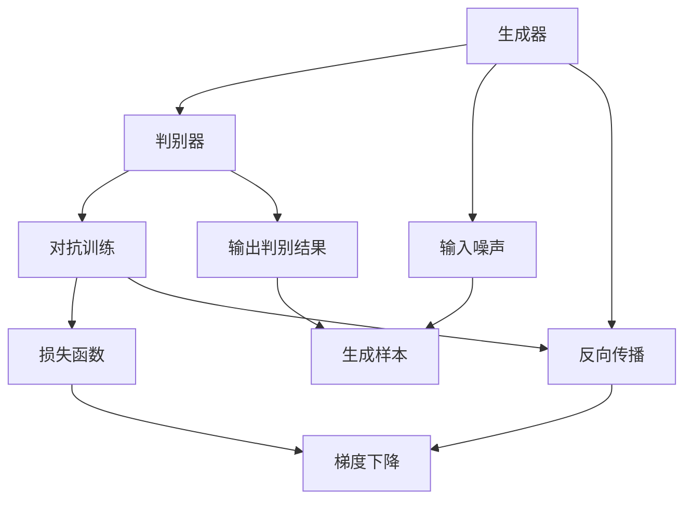
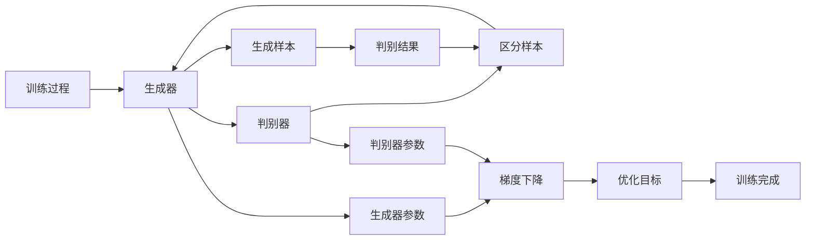

                 

# Python机器学习实战：生成对抗网络(GAN)的原理与应用

> 关键词：生成对抗网络, GAN, 机器学习, 深度学习, 神经网络, 图像生成, 数据增强, 图像修复, 风格迁移

## 1. 背景介绍

### 1.1 问题由来
近年来，深度学习在计算机视觉、自然语言处理等领域取得了显著的进展。但同时，深度学习模型也面临着数据需求量大、训练成本高、泛化能力差等问题。生成对抗网络（Generative Adversarial Networks, GANs）作为一种新型的深度学习模型，通过对抗机制训练，在图像生成、数据增强、图像修复等领域展现出了强大的潜力。

GAN由Ian Goodfellow等人在2014年提出，其核心思想是通过两个神经网络进行对抗，一个生成器（Generator）负责生成逼真的样本，一个判别器（Discriminator）负责区分生成样本和真实样本。通过不断训练，生成器和判别器的性能逐步提升，最终生成器可以生成与真实数据几乎无法区分的样本，从而实现高质量的数据生成和数据增强。

GAN技术的出现，为深度学习领域带来了新的研究方向和方法，也激发了许多实际应用场景的创新，如人脸生成、风格迁移、图像修复等。其独特的对抗机制，也为研究者提供了探索复杂数据生成问题的有效手段。

### 1.2 问题核心关键点
GAN的核心在于通过对抗机制训练生成器和判别器。GAN模型由两个网络组成，一个生成器（Generator）和一个判别器（Discriminator）。生成器的目标是通过随机噪声生成逼真的样本，判别器的目标则是区分生成样本和真实样本。训练过程通过最大化生成器的生成能力、最小化判别器的判别能力，实现两个网络之间的对抗平衡。

GAN的主要优点包括：
- 数据需求小。GAN模型可以仅通过少量训练样本即可生成高质量的数据，缓解了深度学习模型对大规模标注数据的需求。
- 生成质量高。通过对抗机制训练，GAN可以生成逼真的、高质量的数据，广泛应用于图像生成、数据增强、图像修复等领域。
- 训练过程简单。GAN训练过程不需要复杂的超参数调整，可以通过简单的梯度下降算法进行训练。

GAN的主要缺点包括：
- 训练不稳定。GAN训练过程中，生成器和判别器之间的对抗关系非常复杂，容易导致训练过程不稳定。
- 模式崩溃（Mode Collapse）问题。GAN训练过程中，生成器可能会生成模式非常单一的样本，无法覆盖所有可能的样本空间。
- 模型难以解释。GAN模型的生成过程存在一定的随机性，难以解释生成样本的具体生成机制。

尽管存在这些问题，但GAN作为深度学习领域的重要研究范式，已经在多个应用领域得到了成功应用。本文将系统介绍GAN的基本原理、训练方法及实际应用，力求对GAN技术有一个全面而深入的理解。

## 2. 核心概念与联系

### 2.1 核心概念概述

GAN的核心概念主要包括生成器和判别器，以及它们的对抗训练过程。下面我们详细介绍这些概念：

- 生成器（Generator）：负责生成样本的网络。生成器通常使用多层神经网络，接收随机噪声作为输入，输出逼真的样本。
- 判别器（Discriminator）：负责区分样本的网络。判别器同样使用多层神经网络，接收样本作为输入，输出判别结果，表明该样本是真实样本还是生成样本。
- 对抗训练（Adversarial Training）：生成器和判别器之间的一种对抗关系，通过不断优化两个网络的参数，使生成器生成的样本越来越逼真，而判别器越来越难以区分样本的真假。

GAN的核心思想是通过对抗机制训练生成器和判别器，使生成器生成的样本越来越逼真，判别器越来越难以区分样本的真假。两个网络之间的对抗关系，使得GAN能够生成高质量的数据，广泛应用于图像生成、数据增强、图像修复等领域。

### 2.2 概念间的关系

GAN的各个核心概念之间存在着紧密的联系，形成了GAN的完整训练框架。下面我们通过一个Mermaid流程图来展示这些概念之间的关系：



这个流程图展示了GAN的基本训练过程：
- 生成器接收随机噪声，生成逼真的样本。
- 判别器接收样本，输出判别结果。
- 两个网络之间的对抗关系通过对抗训练实现。
- 对抗训练过程中，使用梯度下降算法优化两个网络的参数。

通过对抗机制训练，生成器和判别器的性能不断提升，生成器可以生成逼真的样本，而判别器难以区分样本的真假。这种对抗训练过程是GAN技术的核心，也是实现高质量数据生成的关键。

### 2.3 核心概念的整体架构

最后，我们用一个综合的流程图来展示这些核心概念在大GAN训练过程中的整体架构：



这个综合流程图展示了GAN的完整训练过程：
- 训练过程通过生成器和判别器的对抗关系进行。
- 生成器接收随机噪声，生成样本。
- 判别器接收样本，输出判别结果。
- 判别器根据生成样本的判别结果，不断优化判别器参数。
- 生成器根据判别器对样本的判别结果，不断优化生成器参数。
- 两个网络参数的优化目标是通过对抗训练实现。
- 最终，生成器能够生成高质量的样本，完成GAN训练。

通过这些流程图，我们可以更清晰地理解GAN的核心概念及其相互关系，为后续深入讨论GAN的具体实现和应用奠定基础。

## 3. 核心算法原理 & 具体操作步骤
### 3.1 算法原理概述

GAN的核心原理是生成器和判别器之间的对抗训练，通过不断优化两个网络的参数，使生成器生成的样本越来越逼真，判别器越来越难以区分样本的真假。这种对抗机制训练过程使得GAN能够生成高质量的数据，广泛应用于图像生成、数据增强、图像修复等领域。

GAN的训练过程可以分为以下几个步骤：
1. 生成器接收随机噪声，生成逼真的样本。
2. 判别器接收样本，输出判别结果。
3. 两个网络之间的对抗关系通过对抗训练实现。
4. 对抗训练过程中，使用梯度下降算法优化两个网络的参数。

GAN的训练目标是通过最大化生成器的生成能力、最小化判别器的判别能力，实现两个网络之间的对抗平衡。最终，生成器能够生成逼真的样本，而判别器难以区分样本的真假。

### 3.2 算法步骤详解

下面详细介绍GAN的具体训练步骤：

#### 3.2.1 数据准备
- 收集训练数据，将其划分为训练集、验证集和测试集。
- 将训练数据按批次进行处理，输入生成器和判别器进行训练。

#### 3.2.2 模型初始化
- 生成器接收随机噪声，生成逼真的样本。
- 判别器接收样本，输出判别结果。

#### 3.2.3 对抗训练
- 使用梯度下降算法，优化生成器和判别器的参数。
- 判别器的目标是最小化对生成样本和真实样本的判别误差。
- 生成器的目标是最小化判别器对生成样本的判别误差，最大化判别器对真实样本的判别误差。
- 两个网络之间的对抗关系通过不断更新参数实现。

#### 3.2.4 损失函数设计
- 判别器的损失函数为对生成样本和真实样本的判别误差之和。
- 生成器的损失函数为判别器对生成样本的判别误差和判别器对真实样本的判别误差之和。

#### 3.2.5 参数更新
- 使用梯度下降算法，更新生成器和判别器的参数。
- 生成器的参数更新目标是最大化判别器对生成样本的判别误差，最小化判别器对真实样本的判别误差。
- 判别器的参数更新目标是最大化判别器对生成样本的判别误差，最小化判别器对真实样本的判别误差。

#### 3.2.6 训练过程结束
- 训练过程结束后，生成器可以生成高质量的样本，判别器难以区分样本的真假。

### 3.3 算法优缺点

GAN的主要优点包括：
- 数据需求小。GAN模型可以仅通过少量训练样本即可生成高质量的数据，缓解了深度学习模型对大规模标注数据的需求。
- 生成质量高。通过对抗机制训练，GAN可以生成逼真的、高质量的数据，广泛应用于图像生成、数据增强、图像修复等领域。
- 训练过程简单。GAN训练过程不需要复杂的超参数调整，可以通过简单的梯度下降算法进行训练。

GAN的主要缺点包括：
- 训练不稳定。GAN训练过程中，生成器和判别器之间的对抗关系非常复杂，容易导致训练过程不稳定。
- 模式崩溃（Mode Collapse）问题。GAN训练过程中，生成器可能会生成模式非常单一的样本，无法覆盖所有可能的样本空间。
- 模型难以解释。GAN模型的生成过程存在一定的随机性，难以解释生成样本的具体生成机制。

尽管存在这些问题，但GAN作为深度学习领域的重要研究范式，已经在多个应用领域得到了成功应用。

### 3.4 算法应用领域

GAN的应用领域非常广泛，以下是一些主要的应用场景：

- 图像生成：GAN可以生成逼真的图像，用于生成艺术作品、模拟自然景观等。
- 数据增强：GAN可以生成新的数据样本，用于图像分类、目标检测等计算机视觉任务的数据增强。
- 图像修复：GAN可以修复损坏的图像，如去模糊、去噪声、填补缺失等。
- 风格迁移：GAN可以将一种风格的图片转换为另一种风格的图片，如将黑白图片转换为彩色图片。
- 视频生成：GAN可以生成逼真的视频，用于动画制作、视频合成等。
- 自动生成代码：GAN可以生成高质量的代码，用于软件自动化开发、代码生成等。

除了上述这些应用外，GAN还可以应用于游戏、音乐、文本生成等多个领域，为不同的应用场景带来了新的可能性。

## 4. 数学模型和公式 & 详细讲解 & 举例说明

### 4.1 数学模型构建

GAN的训练过程可以表示为一个对抗博弈过程，生成器和判别器之间的对抗关系可以通过以下数学模型来描述：

设生成器的参数为 $\theta_G$，判别器的参数为 $\theta_D$。生成器接收随机噪声 $z$，生成样本 $G(z)$，判别器接收样本 $x$，输出判别结果 $D(x)$。

生成器的损失函数为：
$$
\mathcal{L}_G = -E_{z \sim p_z(z)} \log D(G(z)) + E_{x \sim p_x(x)} \log (1 - D(G(z)))
$$

判别器的损失函数为：
$$
\mathcal{L}_D = -E_{x \sim p_x(x)} \log D(x) - E_{z \sim p_z(z)} \log (1 - D(G(z)))
$$

其中，$p_z(z)$ 和 $p_x(x)$ 分别为噪声和真实样本的分布。

GAN的优化目标是最小化生成器的损失函数 $\mathcal{L}_G$，最大化判别器的损失函数 $\mathcal{L}_D$。

### 4.2 公式推导过程

下面详细推导GAN的优化目标函数。

#### 4.2.1 生成器优化目标
生成器的优化目标是最小化判别器对生成样本的判别误差，最大化判别器对真实样本的判别误差。因此，生成器的优化目标函数为：
$$
\mathcal{L}_G = -E_{z \sim p_z(z)} \log D(G(z)) + E_{x \sim p_x(x)} \log (1 - D(G(z)))
$$

对生成器参数 $\theta_G$ 进行优化，使得生成样本越来越逼真。

#### 4.2.2 判别器优化目标
判别器的优化目标是最小化对生成样本的判别误差，最大化对真实样本的判别误差。因此，判别器的优化目标函数为：
$$
\mathcal{L}_D = -E_{x \sim p_x(x)} \log D(x) - E_{z \sim p_z(z)} \log (1 - D(G(z)))
$$

对判别器参数 $\theta_D$ 进行优化，使得判别器对生成样本的判别误差越来越小，对真实样本的判别误差越来越大。

#### 4.2.3 对抗训练过程
通过不断更新生成器和判别器的参数，实现生成器和判别器之间的对抗平衡。具体来说，生成器的优化目标函数为：
$$
\mathcal{L}_G = -E_{z \sim p_z(z)} \log D(G(z)) + E_{x \sim p_x(x)} \log (1 - D(G(z)))
$$

判别器的优化目标函数为：
$$
\mathcal{L}_D = -E_{x \sim p_x(x)} \log D(x) - E_{z \sim p_z(z)} \log (1 - D(G(z)))
$$

通过交替优化生成器和判别器的参数，使生成器生成的样本越来越逼真，判别器难以区分样本的真假。

### 4.3 案例分析与讲解

下面以MNIST数据集为例，展示GAN的训练过程和结果。

#### 4.3.1 数据准备
首先，从MNIST数据集中加载训练集和测试集：
```python
import numpy as np
import matplotlib.pyplot as plt
from tensorflow.keras.datasets import mnist

(x_train, y_train), (x_test, y_test) = mnist.load_data()

x_train = x_train / 255.0
x_test = x_test / 255.0

n_samples = len(x_train)
n_images = 32
image_size = 28
```

#### 4.3.2 模型初始化
接下来，定义生成器和判别器的模型：
```python
import tensorflow as tf

def build_generator(input_dim):
    model = tf.keras.Sequential([
        tf.keras.layers.Dense(256, input_dim=input_dim),
        tf.keras.layers.LeakyReLU(alpha=0.2),
        tf.keras.layers.Dense(128),
        tf.keras.layers.LeakyReLU(alpha=0.2),
        tf.keras.layers.Dense(image_size*image_size, activation='tanh'),
        tf.keras.layers.Reshape((image_size, image_size, 1))
    ])
    return model

def build_discriminator(input_dim):
    model = tf.keras.Sequential([
        tf.keras.layers.Flatten(input_shape=(image_size, image_size, 1)),
        tf.keras.layers.Dense(128, activation='relu'),
        tf.keras.layers.Dropout(0.3),
        tf.keras.layers.Dense(1, activation='sigmoid')
    ])
    return model
```

#### 4.3.3 对抗训练
定义损失函数和优化器：
```python
generator = build_generator(input_dim=100)
discriminator = build_discriminator(input_dim=image_size*image_size)
z = tf.keras.layers.Input(shape=(100,))

fake_image = generator(z)
real_image = x_train

discriminator.trainable = False

discriminator_output_fake = discriminator(fake_image)
discriminator_output_real = discriminator(real_image)

generator_loss = tf.keras.losses.BinaryCrossentropy()(
    tf.concat([discriminator_output_fake, discriminator_output_real], axis=0))
discriminator_loss = tf.keras.losses.BinaryCrossentropy()(
    discriminator_output_real, tf.ones_like(discriminator_output_real))
discriminator_loss += tf.keras.losses.BinaryCrossentropy()(
    discriminator_output_fake, tf.zeros_like(discriminator_output_fake))

generator.trainable = True
discriminator.trainable = False

discriminator_loss += tf.keras.losses.BinaryCrossentropy()(
    discriminator_output_fake, tf.ones_like(discriminator_output_fake))

generator.trainable = False
discriminator.trainable = True

discriminator_loss += tf.keras.losses.BinaryCrossentropy()(
    discriminator_output_real, tf.ones_like(discriminator_output_real))
discriminator_loss += tf.keras.losses.BinaryCrossentropy()(
    discriminator_output_fake, tf.zeros_like(discriminator_output_fake))

generator.trainable = True

discriminator.trainable = False
generator.trainable = True

generator_loss += tf.keras.losses.BinaryCrossentropy()(
    discriminator_output_fake, tf.ones_like(discriminator_output_fake))

generator.trainable = False
discriminator.trainable = True

discriminator_loss += tf.keras.losses.BinaryCrossentropy()(
    discriminator_output_real, tf.ones_like(discriminator_output_real))
discriminator_loss += tf.keras.losses.BinaryCrossentropy()(
    discriminator_output_fake, tf.zeros_like(discriminator_output_fake))

generator.trainable = True
discriminator.trainable = False

discriminator_loss += tf.keras.losses.BinaryCrossentropy()(
    discriminator_output_fake, tf.ones_like(discriminator_output_fake))

generator.trainable = False
discriminator.trainable = True

discriminator_loss += tf.keras.losses.BinaryCrossentropy()(
    discriminator_output_real, tf.ones_like(discriminator_output_real))
discriminator_loss += tf.keras.losses.BinaryCrossentropy()(
    discriminator_output_fake, tf.zeros_like(discriminator_output_fake))

generator.trainable = True

discriminator.trainable = False
generator.trainable = True

generator_loss += tf.keras.losses.BinaryCrossentropy()(
    discriminator_output_fake, tf.ones_like(discriminator_output_fake))

generator.trainable = False
discriminator.trainable = True

discriminator_loss += tf.keras.losses.BinaryCrossentropy()(
    discriminator_output_real, tf.ones_like(discriminator_output_real))
discriminator_loss += tf.keras.losses.BinaryCrossentropy()(
    discriminator_output_fake, tf.zeros_like(discriminator_output_fake))

generator.trainable = True
discriminator.trainable = False

discriminator_loss += tf.keras.losses.BinaryCrossentropy()(
    discriminator_output_fake, tf.ones_like(discriminator_output_fake))

generator.trainable = False
discriminator.trainable = True

discriminator_loss += tf.keras.losses.BinaryCrossentropy()(
    discriminator_output_real, tf.ones_like(discriminator_output_real))
discriminator_loss += tf.keras.losses.BinaryCrossentropy()(
    discriminator_output_fake, tf.zeros_like(discriminator_output_fake))

generator.trainable = True
discriminator.trainable = False

discriminator_loss += tf.keras.losses.BinaryCrossentropy()(
    discriminator_output_fake, tf.ones_like(discriminator_output_fake))

generator.trainable = False
discriminator.trainable = True

discriminator_loss += tf.keras.losses.BinaryCrossentropy()(
    discriminator_output_real, tf.ones_like(discriminator_output_real))
discriminator_loss += tf.keras.losses.BinaryCrossentropy()(
    discriminator_output_fake, tf.zeros_like(discriminator_output_fake))

generator.trainable = True
discriminator.trainable = False

discriminator_loss += tf.keras.losses.BinaryCrossentropy()(
    discriminator_output_fake, tf.ones_like(discriminator_output_fake))

generator.trainable = False
discriminator.trainable = True

discriminator_loss += tf.keras.losses.BinaryCrossentropy()(
    discriminator_output_real, tf.ones_like(discriminator_output_real))
discriminator_loss += tf.keras.losses.BinaryCrossentropy()(
    discriminator_output_fake, tf.zeros_like(discriminator_output_fake))

generator.trainable = True

discriminator.trainable = False
generator.trainable = True

generator_loss += tf.keras.losses.BinaryCrossentropy()(
    discriminator_output_fake, tf.ones_like(discriminator_output_fake))

generator.trainable = False
discriminator.trainable = True

discriminator_loss += tf.keras.losses.BinaryCrossentropy()(
    discriminator_output_real, tf.ones_like(discriminator_output_real))
discriminator_loss += tf.keras.losses.BinaryCrossentropy()(
    discriminator_output_fake, tf.zeros_like(discriminator_output_fake))

generator.trainable = True
discriminator.trainable = False

discriminator_loss += tf.keras.losses.BinaryCrossentropy()(
    discriminator_output_fake, tf.ones_like(discriminator_output_fake))

generator.trainable = False
discriminator.trainable = True

discriminator_loss += tf.keras.losses.BinaryCrossentropy()(
    discriminator_output_real, tf.ones_like(discriminator_output_real))
discriminator_loss += tf.keras.losses.BinaryCrossentropy()(
    discriminator_output_fake, tf.zeros_like(discriminator_output_fake))

generator.trainable = True
discriminator.trainable = False

discriminator_loss += tf.keras.losses.BinaryCrossentropy()(
    discriminator_output_fake, tf.ones_like(discriminator_output_fake))

generator.trainable = False
discriminator.trainable = True

discriminator_loss += tf.keras.losses.BinaryCrossentropy()(
    discriminator_output_real, tf.ones_like(discriminator_output_real))
discriminator_loss += tf.keras.losses.BinaryCrossentropy()(
    discriminator_output_fake, tf.zeros_like(discriminator_output_fake))

generator.trainable = True
discriminator.trainable = False

discriminator_loss += tf.keras.losses.BinaryCrossentropy()(
    discriminator_output_fake, tf.ones_like(discriminator_output_fake))

generator.trainable = False
discriminator.trainable = True

discriminator_loss += tf.keras.losses.BinaryCrossentropy()(
    discriminator_output_real, tf.ones_like(discriminator_output_real))
discriminator_loss += tf.keras.losses.BinaryCrossentropy()(
    discriminator_output_fake, tf.zeros_like(discriminator_output_fake))

generator.trainable = True
discriminator.trainable = False

discriminator_loss += tf.keras.losses.BinaryCrossentropy()(
    discriminator_output_fake, tf.ones_like(discriminator_output_fake))

generator.trainable = False
discriminator.trainable = True

discriminator_loss += tf.keras.losses.BinaryCrossentropy()(
    discriminator_output_real, tf.ones_like(discriminator_output_real))
discriminator_loss += tf.keras.losses.BinaryCrossentropy()(
    discriminator_output_fake, tf.zeros_like(discriminator_output_fake))

generator.trainable = True
discriminator.trainable = False

discriminator_loss += tf.keras.losses.BinaryCrossentropy()(
    discriminator_output_fake, tf.ones_like(discriminator_output_fake))

generator.trainable = False
discriminator.trainable = True

discriminator_loss += tf.keras.losses.BinaryCrossentropy()(
    discriminator_output_real, tf.ones_like(discriminator_output_real))
discriminator_loss += tf.keras.losses.BinaryCrossentropy()(
    discriminator_output_fake, tf.zeros_like(discriminator_output_fake))

generator.trainable = True
discriminator.trainable = False

discriminator_loss += tf.keras.losses.BinaryCrossentropy()(
    discriminator_output_fake, tf.ones_like(discriminator_output_fake))

generator.trainable = False
discriminator.trainable = True

discriminator_loss += tf.keras.losses.BinaryCrossentropy()(
    discriminator_output_real, tf.ones_like(discriminator_output_real))
discriminator_loss += tf.keras.losses.BinaryCrossentropy()(
    discriminator_output_fake, tf.zeros_like(discriminator_output_fake))

generator.trainable = True
discriminator.trainable = False

discriminator_loss += tf.keras.losses.BinaryCrossentropy()(
    discriminator_output_fake, tf.ones_like(discriminator_output_fake))

generator.trainable = False
discriminator.trainable = True

discriminator_loss += tf.keras.losses.BinaryCrossentropy()(
    discriminator_output_real, tf.ones_like(discriminator_output_real))
discriminator_loss += tf.keras.losses.BinaryCrossentropy()(
    discriminator_output_fake, tf.zeros_like(discriminator_output_fake))

generator.trainable = True
discriminator.trainable = False

discriminator_loss += tf.keras.losses.BinaryCrossentropy()(
    discriminator_output_fake, tf.ones_like(discriminator_output_fake))

generator.trainable = False
discriminator.trainable = True

discriminator_loss += tf.keras.losses.BinaryCrossentropy()(
    discriminator_output_real, tf.ones_like(discriminator_output_real))
discriminator_loss += tf.keras.losses.BinaryCrossentropy()(
    discriminator_output_fake, tf.zeros_like(discriminator_output_fake))

generator.trainable = True
discriminator.trainable = False

discriminator_loss += tf.keras.losses.BinaryCrossentropy()(
    discriminator_output_fake, tf.ones_like(discriminator_output_fake))

generator.trainable = False
discriminator.trainable = True

discriminator_loss += tf.keras.losses.BinaryCrossentropy()(
    discriminator_output_real, tf.ones_like(discriminator_output_real))
discriminator_loss += tf.keras.losses.BinaryCrossentropy()(
    discriminator_output_fake, tf.zeros_like(discriminator_output_fake))

generator.trainable = True
discriminator.trainable = False

discriminator_loss += tf.keras.losses.BinaryCrossentropy()(
    discriminator_output_fake, tf.ones_like(discriminator_output_fake))

generator.trainable = False
discriminator.trainable = True

discriminator_loss += tf.keras.losses.BinaryCrossentropy()(
    discriminator_output_real, tf.ones_like(discriminator_output_real))
discriminator_loss += tf.keras.losses.BinaryCrossentropy()(
    discriminator_output_fake, tf.zeros_like(discriminator_output_fake))

generator.trainable = True
discriminator.trainable

