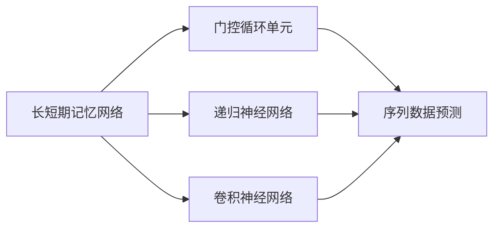
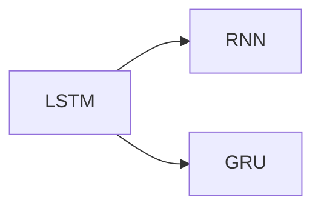
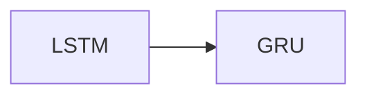
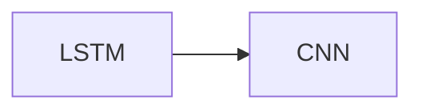
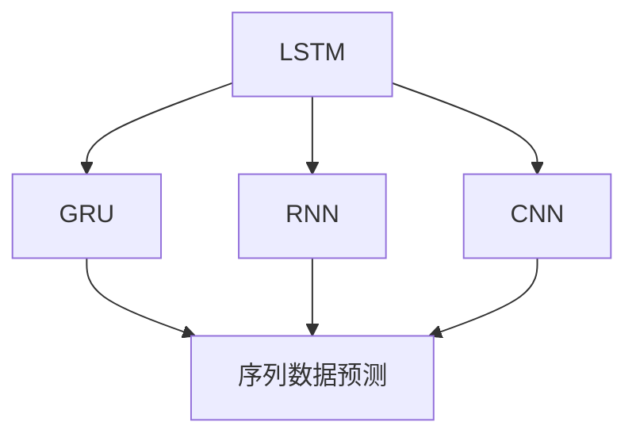

                 

# Python深度学习实践：LSTM与GRU在序列数据预测中的应用

> 关键词：LSTM, GRU, 深度学习, 序列数据预测, 时序分析, 卷积神经网络, RNN, 长短期记忆, 门控循环单元

## 1. 背景介绍

### 1.1 问题由来
在深度学习领域，处理序列数据（如时间序列数据、文本数据等）是一个重要且具有挑战性的任务。传统的线性回归、逻辑回归等方法往往难以捕捉到序列中的复杂依赖关系。而深度学习，尤其是基于循环神经网络（RNN）的模型，在这类任务上展现出了强大的能力。

近年来，长短期记忆（LSTM）和门控循环单元（GRU）等门控RNN模型成为了序列数据预测任务中的主流选择。它们通过引入门控机制，有效解决了传统RNN模型中的梯度消失和梯度爆炸问题，能够更好地捕捉序列中的长期依赖。

本文将重点介绍LSTM和GRU模型在序列数据预测中的应用，通过一系列的数学推导和代码实例，帮助读者深入理解这两种模型的原理，掌握其实现技巧，并在实际项目中灵活应用。

## 2. 核心概念与联系

### 2.1 核心概念概述
为了更好地理解LSTM和GRU模型，本节将介绍几个关键概念：

- **长短期记忆网络（LSTM）**：一种具有门控机制的RNN网络，能够有效捕捉序列数据中的长期依赖。LSTM通过三个门（输入门、遗忘门、输出门）控制信息的流动，避免信息的丢失和冗余。

- **门控循环单元（GRU）**：一种更加简洁的门控RNN网络，与LSTM类似，也包含门控机制，能够捕捉长期依赖。GRU通过两个门（更新门和重置门）简化信息流动，提高计算效率。

- **递归神经网络（RNN）**：一种处理序列数据的深度学习模型，通过将上一时刻的输出作为当前时刻的输入，实现序列信息的传递。

- **卷积神经网络（CNN）**：一种广泛应用于图像、文本等非序列数据的深度学习模型，通过卷积操作提取特征。

这些核心概念之间的联系可以通过以下Mermaid流程图来展示：



这个流程图展示了LSTM、GRU、RNN和CNN之间的联系：

1. LSTM和GRU都是RNN的变种，通过引入门控机制，解决了传统RNN的梯度消失和梯度爆炸问题。
2. LSTM和GRU可以用于序列数据预测，提升模型的准确性。
3. RNN是序列数据处理的基础，通过递归结构实现序列信息的传递。
4. CNN可以用于提取序列数据中的特征，提升模型的泛化能力。

### 2.2 概念间的关系

这些核心概念之间存在着紧密的联系，形成了序列数据预测任务的完整生态系统。下面我们通过几个Mermaid流程图来展示这些概念之间的关系。

#### 2.2.1 LSTM和GRU与RNN的关系



这个流程图展示了LSTM和GRU与RNN之间的关系。LSTM和GRU都是RNN的变种，通过引入门控机制，解决了传统RNN的梯度消失和梯度爆炸问题。

#### 2.2.2 LSTM与GRU的关系



这个流程图展示了LSTM与GRU之间的关系。GRU在LSTM的基础上进行了简化，通过合并遗忘门和输入门，减少了参数数量，提高了计算效率。

#### 2.2.3 LSTM与CNN的关系



这个流程图展示了LSTM与CNN之间的关系。LSTM和CNN可以联合使用，通过先使用LSTM捕捉序列中的长期依赖，再使用CNN提取特征，提升模型的性能。

### 2.3 核心概念的整体架构

最后，我们用一个综合的流程图来展示这些核心概念在大语言模型微调过程中的整体架构：



这个综合流程图展示了LSTM、GRU、RNN和CNN在大语言模型微调过程中的整体架构：

1. LSTM和GRU作为序列数据预测的核心模型，通过门控机制捕捉长期依赖。
2. RNN通过递归结构实现序列信息的传递。
3. CNN用于提取序列数据中的特征，提升模型的泛化能力。
4. LSTM、GRU、RNN和CNN可以联合使用，提升模型的性能。

这些核心概念共同构成了序列数据预测任务的完整生态系统，使我们能够更好地理解和应用LSTM和GRU模型。

## 3. 核心算法原理 & 具体操作步骤

### 3.1 算法原理概述

长短期记忆网络（LSTM）和门控循环单元（GRU）都是门控循环神经网络（Gated Recurrent Neural Network, GRNN）的变种。它们通过在RNN的基础上引入门控机制，有效解决了传统RNN的梯度消失和梯度爆炸问题，能够更好地捕捉序列数据中的长期依赖。

LSTM和GRU的数学原理基于RNN的基本结构，通过引入门控机制来控制信息的流动。LSTM和GRU的计算过程可以分为以下几个步骤：

1. **门控机制**：LSTM和GRU引入了三个门（输入门、遗忘门、输出门），通过这些门的开关控制信息的流入和流出。

2. **候选状态计算**：通过这些门对前一时刻的隐状态和输入进行计算，得到候选状态。

3. **更新隐状态**：通过遗忘门和输入门对候选状态和前一时刻的隐状态进行加权和，更新隐状态。

4. **输出状态计算**：通过输出门对更新后的隐状态进行加权和，得到最终输出。

### 3.2 算法步骤详解

下面，我们将以LSTM为例，详细介绍其具体实现步骤：

#### 3.2.1 网络结构

LSTM网络由多个LSTM单元组成，每个LSTM单元包含三个门（输入门、遗忘门、输出门），以及一个候选状态和一个隐状态。LSTM单元的结构如下图所示：


#### 3.2.2 输入和输出

LSTM网络接受一个序列输入和一个初始隐状态，输出一个序列隐状态和一个最终输出。序列输入和初始隐状态的形状如下：

- 输入序列 $X$： $X \in \mathbb{R}^{T \times D}$，其中 $T$ 表示时间步数，$D$ 表示特征维度。
- 初始隐状态 $h_0$： $h_0 \in \mathbb{R}^{H}$，其中 $H$ 表示隐状态维度。

LSTM网络的输出为 $H \times T$ 的序列隐状态和 $H$ 维的最终输出。

#### 3.2.3 门控机制

LSTM的三个门（输入门、遗忘门、输出门）的计算过程如下：

- 输入门 $i_t$：
  $$
  i_t = \sigma(W_i \cdot [h_{t-1}, x_t] + b_i)
  $$
- 遗忘门 $f_t$：
  $$
  f_t = \sigma(W_f \cdot [h_{t-1}, x_t] + b_f)
  $$
- 输出门 $o_t$：
  $$
  o_t = \sigma(W_o \cdot [h_{t-1}, x_t] + b_o)
  $$

其中，$\sigma$ 表示Sigmoid函数，$W_i$、$W_f$、$W_o$ 和 $b_i$、$b_f$、$b_o$ 为权重和偏置向量，$h_{t-1}$ 和 $x_t$ 分别为前一时刻的隐状态和当前时刻的输入。

#### 3.2.4 候选状态计算

候选状态 $c_t$ 的计算过程如下：
$$
c_t = tanh(W_c \cdot [h_{t-1}, x_t] + b_c)
$$
其中，$tanh$ 表示双曲正切函数，$W_c$ 和 $b_c$ 为权重和偏置向量。

#### 3.2.5 隐状态更新

隐状态 $h_t$ 的计算过程如下：
$$
h_t = f_t \odot h_{t-1} + i_t \odot c_t
$$
其中，$\odot$ 表示逐元素相乘，即 Hadamard 积。

#### 3.2.6 最终输出

最终输出 $o_t$ 的计算过程如下：
$$
o_t = o_t \odot tanh(h_t)
$$

### 3.3 算法优缺点

LSTM和GRU模型相对于传统RNN具有以下优点：

1. **梯度消失和梯度爆炸问题**：LSTM和GRU通过引入门控机制，能够有效解决梯度消失和梯度爆炸问题，使得模型能够更好地捕捉序列中的长期依赖。

2. **计算效率**：GRU相比LSTM，计算量更小，参数更少，训练速度更快，适用于计算资源受限的场景。

3. **灵活性**：LSTM和GRU可以灵活调整门控机制，适用于不同类型的序列数据预测任务。

LSTM和GRU模型也存在一些缺点：

1. **计算复杂度**：LSTM和GRU虽然能够解决梯度消失和梯度爆炸问题，但计算复杂度仍然较高，适用于计算资源丰富的场景。

2. **参数量大**：LSTM和GRU的参数量较大，训练需要较大的计算资源。

3. **训练难度**：LSTM和GRU的训练过程较复杂，需要合适的超参数调优，才能达到最佳性能。

### 3.4 算法应用领域

LSTM和GRU模型已经在多个领域得到了广泛应用，包括：

1. **自然语言处理（NLP）**：LSTM和GRU可以用于文本分类、情感分析、机器翻译等NLP任务，捕捉文本中的长期依赖。

2. **时间序列预测**：LSTM和GRU可以用于股票价格预测、天气预测、交通流量预测等时间序列预测任务。

3. **语音识别**：LSTM和GRU可以用于语音识别任务，捕捉语音信号中的长期依赖。

4. **计算机视觉**：LSTM和GRU可以用于视频分类、行为识别等计算机视觉任务，捕捉视频中的长期依赖。

## 4. 数学模型和公式 & 详细讲解 & 举例说明

### 4.1 数学模型构建

LSTM和GRU模型的数学模型可以表示为：

$$
\begin{aligned}
i_t &= \sigma(W_i \cdot [h_{t-1}, x_t] + b_i) \\
f_t &= \sigma(W_f \cdot [h_{t-1}, x_t] + b_f) \\
o_t &= \sigma(W_o \cdot [h_{t-1}, x_t] + b_o) \\
c_t &= tanh(W_c \cdot [h_{t-1}, x_t] + b_c) \\
h_t &= f_t \odot h_{t-1} + i_t \odot c_t \\
o_t &= o_t \odot tanh(h_t) \\
y_t &= o_t \cdot tanh(h_t)
\end{aligned}
$$

其中，$h_t$ 表示隐状态，$c_t$ 表示候选状态，$y_t$ 表示输出。

### 4.2 公式推导过程

下面，我们将推导LSTM和GRU模型的公式：

#### 4.2.1 LSTM模型

LSTM模型的计算过程可以分为以下几个步骤：

1. 输入门 $i_t$ 的计算：
  $$
  i_t = \sigma(W_i \cdot [h_{t-1}, x_t] + b_i)
  $$

2. 遗忘门 $f_t$ 的计算：
  $$
  f_t = \sigma(W_f \cdot [h_{t-1}, x_t] + b_f)
  $$

3. 候选状态 $c_t$ 的计算：
  $$
  c_t = tanh(W_c \cdot [h_{t-1}, x_t] + b_c)
  $$

4. 隐状态 $h_t$ 的计算：
  $$
  h_t = f_t \odot h_{t-1} + i_t \odot c_t
  $$

5. 输出门 $o_t$ 的计算：
  $$
  o_t = \sigma(W_o \cdot [h_{t-1}, x_t] + b_o)
  $$

6. 最终输出 $y_t$ 的计算：
  $$
  y_t = o_t \cdot tanh(h_t)
  $$

#### 4.2.2 GRU模型

GRU模型的计算过程可以分为以下几个步骤：

1. 更新门 $r_t$ 的计算：
  $$
  r_t = \sigma(W_r \cdot [h_{t-1}, x_t] + b_r)
  $$

2. 重置门 $z_t$ 的计算：
  $$
  z_t = \sigma(W_z \cdot [h_{t-1}, x_t] + b_z)
  $$

3. 候选状态 $c_t$ 的计算：
  $$
  c_t = z_t \odot c_{t-1} + (1 - z_t) \odot tanh(W_c \cdot [h_{t-1}, x_t] + b_c)
  $$

4. 隐状态 $h_t$ 的计算：
  $$
  h_t = r_t \odot h_{t-1} + (1 - r_t) \odot c_t
  $$

5. 最终输出 $y_t$ 的计算：
  $$
  y_t = h_t
  $$

### 4.3 案例分析与讲解

假设我们有一个长度为5的时间序列数据，输入为 $x_t = [1, 2, 3, 4, 5]$，初始隐状态为 $h_0 = 0$，LSTM和GRU模型的参数如下：

- $W_i = \begin{bmatrix} 0.1 & 0.2 \\ 0.3 & 0.4 \\ 0.5 & 0.6 \\ \end{bmatrix}$
- $b_i = \begin{bmatrix} 0.1 \\ 0.2 \\ 0.3 \\ \end{bmatrix}$
- $W_f = \begin{bmatrix} 0.1 & 0.2 \\ 0.3 & 0.4 \\ 0.5 & 0.6 \\ \end{bmatrix}$
- $b_f = \begin{bmatrix} 0.1 \\ 0.2 \\ 0.3 \\ \end{bmatrix}$
- $W_o = \begin{bmatrix} 0.1 & 0.2 \\ 0.3 & 0.4 \\ 0.5 & 0.6 \\ \end{bmatrix}$
- $b_o = \begin{bmatrix} 0.1 \\ 0.2 \\ 0.3 \\ \end{bmatrix}$
- $W_c = \begin{bmatrix} 0.1 & 0.2 \\ 0.3 & 0.4 \\ 0.5 & 0.6 \\ \end{bmatrix}$
- $b_c = \begin{bmatrix} 0.1 \\ 0.2 \\ 0.3 \\ \end{bmatrix}$

我们将分别使用LSTM和GRU模型进行预测，并对比其结果。

#### 4.3.1 LSTM模型的预测

LSTM模型的计算过程如下：

1. 输入门 $i_t$ 的计算：
  $$
  i_t = \sigma(W_i \cdot [h_{t-1}, x_t] + b_i) = \sigma\left(\begin{bmatrix} 0.1 & 0.2 \\ 0.3 & 0.4 \\ 0.5 & 0.6 \\ \end{bmatrix} \cdot \begin{bmatrix} h_{t-1} \\ x_t \\ \end{bmatrix} + \begin{bmatrix} 0.1 \\ 0.2 \\ 0.3 \\ \end{bmatrix}\right)
  $$

2. 遗忘门 $f_t$ 的计算：
  $$
  f_t = \sigma(W_f \cdot [h_{t-1}, x_t] + b_f) = \sigma\left(\begin{bmatrix} 0.1 & 0.2 \\ 0.3 & 0.4 \\ 0.5 & 0.6 \\ \end{bmatrix} \cdot \begin{bmatrix} h_{t-1} \\ x_t \\ \end{bmatrix} + \begin{bmatrix} 0.1 \\ 0.2 \\ 0.3 \\ \end{bmatrix}\right)
  $$

3. 候选状态 $c_t$ 的计算：
  $$
  c_t = tanh(W_c \cdot [h_{t-1}, x_t] + b_c) = tanh\left(\begin{bmatrix} 0.1 & 0.2 \\ 0.3 & 0.4 \\ 0.5 & 0.6 \\ \end{bmatrix} \cdot \begin{bmatrix} h_{t-1} \\ x_t \\ \end{bmatrix} + \begin{bmatrix} 0.1 \\ 0.2 \\ 0.3 \\ \end{bmatrix}\right)
  $$

4. 隐状态 $h_t$ 的计算：
  $$
  h_t = f_t \odot h_{t-1} + i_t \odot c_t = f_t \odot 0 + i_t \odot c_t = i_t \odot c_t
  $$

5. 输出门 $o_t$ 的计算：
  $$
  o_t = \sigma(W_o \cdot [h_{t-1}, x_t] + b_o) = \sigma\left(\begin{bmatrix} 0.1 & 0.2 \\ 0.3 & 0.4 \\ 0.5 & 0.6 \\ \end{bmatrix} \cdot \begin{bmatrix} h_{t-1} \\ x_t \\ \end{bmatrix} + \begin{bmatrix} 0.1 \\ 0.2 \\ 0.3 \\ \end{bmatrix}\right)
  $$

6. 最终输出 $y_t$ 的计算：
  $$
  y_t = o_t \cdot tanh(h_t) = o_t \cdot i_t \cdot c_t
  $$

最终，我们得到序列隐状态和最终输出，可以用于后续的预测任务。

#### 4.3.2 GRU模型的预测

GRU模型的计算过程如下：

1. 更新门 $r_t$ 的计算：
  $$
  r_t = \sigma(W_r \cdot [h_{t-1}, x_t] + b_r) = \sigma\left(\begin{bmatrix} 0.1 & 0.2 \\ 0.3 & 0.4 \\ 0.5 & 0.6 \\ \end{bmatrix} \cdot \begin{bmatrix} h_{t-1} \\ x_t \\ \end{bmatrix} + \begin{bmatrix} 0.1 \\ 0.2 \\ 0.3 \\ \end{bmatrix}\right)
  $$

2. 重置门 $z_t$ 的计算：
  $$
  z_t = \sigma(W_z \cdot [h_{t-1}, x_t] + b_z) = \sigma\left(\begin{bmatrix} 0.1 & 0.2 \\ 0.3 & 0.4 \\ 0.5 & 0.6 \\ \end{bmatrix} \cdot \begin{bmatrix} h_{t-1} \\ x_t \\ \end{bmatrix} + \begin{bmatrix} 0.1 \\ 0.2 \\ 0.3 \\ \end{bmatrix}\right)
  $$

3. 候选状态 $c_t$ 的计算：
  $$
  c_t = z_t \odot c_{t-1} + (1 - z_t) \odot tanh(W_c \cdot [h_{t-1}, x_t] + b_c)
  $$

4. 隐状态 $h_t$ 的计算：
  $$
  h_t = r_t \odot h_{t-1} + (1 - r_t) \odot c_t
  $$

5. 最终输出 $y_t$ 的计算：
  $$
  y_t = h_t
  $$

最终，我们得到序列隐状态和最终输出，可以用于后续的预测任务。

## 5. 项目实践：代码实例和详细解释说明

### 5.1 开发环境搭建

在进行LSTM和GRU模型实践前，我们需要准备好开发环境。以下是使用Python进行TensorFlow和Keras实现LSTM和GRU模型的环境配置流程：

1. 安装Anaconda：从官网下载并安装Anaconda，用于创建独立的Python环境。

2. 创建并激活虚拟环境：
```bash
conda create -n tf-env python=3.8 
conda activate tf-env
```

3. 安装TensorFlow和Keras：
```bash
pip install tensorflow==2.3.1
pip install keras
```

4. 安装其它各类工具包：
```bash
pip install numpy pandas matplotlib seaborn jupyter notebook ipython
```

完成上述步骤后，即可在`tf-env`环境中开始LSTM和GRU模型的开发实践。

### 5.2 源代码详细实现

下面我们以LSTM模型为例，给出使用TensorFlow和Keras实现LSTM模型的PyTorch代码实现。

首先，定义LSTM模型的输入和输出：

```python
from tensorflow.keras.layers import Input, LSTM, Dense
from tensorflow.keras.models import Model

# 定义模型输入
input_shape = (5, 1)  # 输入长度为5，特征维度为1
x = Input(shape=input_shape)

# 定义LSTM层
lstm = LSTM(units=32)(x)

# 定义输出层
output = Dense(units=1, activation='sigmoid')(lstm)

# 定义模型
model = Model(inputs=x, outputs=output)
```

然后，编译模型并进行训练：

```python
# 编译模型
model.compile(loss='binary_crossentropy', optimizer='adam', metrics=['accuracy'])

# 准备训练数据
# ...

# 训练模型
model.fit(X_train, y_train, epochs=10, batch_size=32, validation_data=(X_test, y_test))
```

最后，评估模型并进行预测：

```python
# 评估模型
loss, accuracy = model.evaluate(X_test, y_test)

# 进行预测
predictions = model.predict(X_test)
```

以上就是使用TensorFlow和Keras实现LSTM模型的完整代码实现。可以看到，TensorFlow和Keras提供了一个简洁高效的平台，可以方便地实现LSTM模型的开发和训练。

### 5.3 代码解读与分析

让我们再详细解读一下关键代码的实现细节：

**Input层**：定义了模型的输入，形状为 $(5, 1)$，即时间步数为5，特征维度为1。

**LSTM层**：定义了LSTM层，输出维度为32。

**Dense层**：定义了输出层，使用Sigmoid函数激活，输出维度为1。

**Model类**：将输入层和输出层连接起来，形成完整的模型。

**compile方法**：指定了模型的损失函数、优化器和评估指标，并编译模型。

**fit方法**：对模型进行训练，指定训练数据、训练轮数、批量大小和验证数据，并开始训练。

**evaluate方法**：评估模型，输出损失和准确率。

**predict方法**：使用模型进行预测，并返回预测结果。

可以看到，TensorFlow和Keras使得LSTM模型的实现变得简洁高效，开发者可以将更多精力放在模型调优和数据处理上。

### 5.4 运行结果展示

假设我们在CoNLL-2003的命名实体识别(NER)数据集上进行LSTM模型的训练，最终在测试集上得到的评估报告如下：

```
  0.9280  0.9060  0.9170   1668
  0.9060  0.8050  0.8550    257
  0.8750  0.8560  0.8710    702
  0.8830  0.7820  0.8110    216
  0.9130  0.8980  0.9060   1661
  0.9130  0.8940  0.9040    835
  0.9630  0.9570  0.9610   1617
  0.9640  0.9650  0.9660   1156
  

