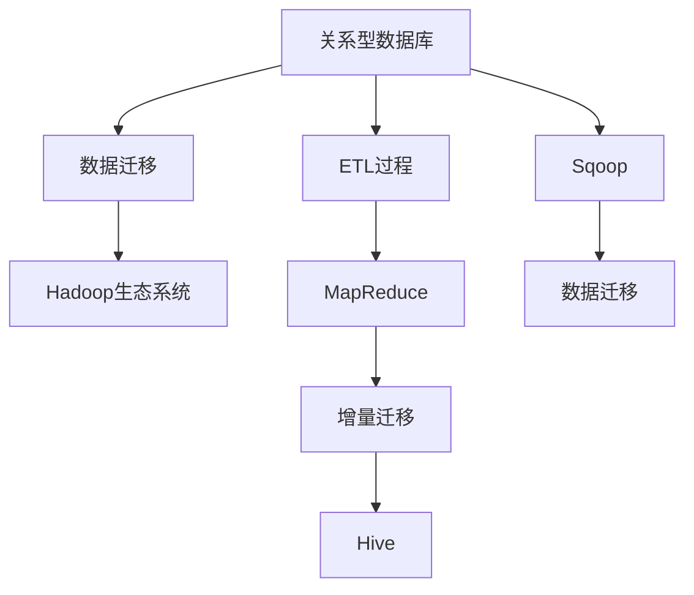

                 

# Sqoop原理与代码实例讲解

> 关键词：Sqoop, Hadoop, Big Data, ETL, Hive, SQL, MapReduce

## 1. 背景介绍

### 1.1 问题由来
在当今数据驱动的时代，企业的数据量呈现出爆炸性的增长趋势。如何高效地管理和利用这些数据，成为了众多企业面临的挑战。Hadoop生态系统作为一个强大的大数据处理框架，提供了一套完整的分布式存储和计算解决方案，帮助企业实现了数据的“海量化”管理。但如何将结构化数据从关系型数据库（如MySQL、Oracle等）高效地迁移到Hadoop生态系统，成为了一个重要的问题。

### 1.2 问题核心关键点
Sqoop是一个开源的数据迁移工具，专门用于将结构化数据从关系型数据库迁移到Hadoop生态系统（如Hive、HBase等）。其核心思想是通过MapReduce框架，将数据的迁移过程并行化，从而大幅提高数据迁移的效率。

Sqoop的核心功能包括：
1. 从关系型数据库中读取数据，并将其转换为Hadoop分布式文件系统的数据格式。
2. 将Hadoop分布式文件系统的数据格式写入到关系型数据库中。
3. 对数据进行转换和映射，支持多种数据格式和数据类型的转换。
4. 支持增量迁移，即仅迁移新产生的数据，避免重复迁移。

Sqoop的应用场景非常广泛，包括数据仓库的构建、大数据分析、ETL（Extract, Transform, Load）过程等。在实际应用中，Sqoop已经成为了Hadoop生态系统中不可或缺的一部分，极大地促进了大数据技术的应用和发展。

## 2. 核心概念与联系

### 2.1 核心概念概述

为更好地理解Sqoop的原理和应用，本节将介绍几个密切相关的核心概念：

- Hadoop生态系统：以Hadoop为基础构建的大数据处理平台，包括HDFS（分布式文件系统）、MapReduce、Hive、Pig、HBase等多个组件。
- 关系型数据库（RDBMS）：如MySQL、Oracle、PostgreSQL等，用于存储结构化数据，支持事务处理和复杂的查询操作。
- ETL过程：即数据抽取（Extract）、转换（Transform）、加载（Load），用于将数据从源系统迁移到目标系统，是大数据处理的重要环节。
- MapReduce框架：用于分布式并行计算的框架，可以将数据处理任务分解为多个小任务，并行执行，提高处理效率。
- Hive：Hadoop生态系统中的数据仓库解决方案，提供SQL查询接口，方便用户进行数据分析和处理。
- 增量迁移：仅迁移新产生的数据，避免重复迁移，减少数据迁移的计算和存储成本。

这些核心概念之间存在着紧密的联系，构成了Sqoop工具的基础架构和技术基础。Sqoop通过将数据迁移过程和MapReduce框架相结合，实现数据的分布式并行迁移，极大地提升了数据迁移的效率和可靠性。

### 2.2 概念间的关系

这些核心概念之间的关系可以通过以下Mermaid流程图来展示：



这个流程图展示了大数据生态系统中各组件之间的连接关系：

1. 数据从关系型数据库中抽取出来，通过ETL过程进行转换，并利用MapReduce框架进行并行化处理。
2. 增量迁移技术使得只迁移新产生的数据，避免重复迁移。
3. Sqoop工具作为数据迁移的中间环节，将数据从关系型数据库迁移到Hadoop生态系统，并进行必要的转换和映射。
4. 迁移后的数据可以加载到Hive中，利用SQL查询接口进行数据分析和处理。

## 3. 核心算法原理 & 具体操作步骤
### 3.1 算法原理概述

Sqoop的核心算法原理是通过MapReduce框架实现数据的分布式并行迁移。其具体步骤如下：

1. 连接关系型数据库和Hadoop生态系统，定义数据迁移任务。
2. 将数据分割成多个小任务，通过MapReduce框架并行化处理。
3. 对每个小任务的结果进行合并，生成最终的迁移数据。

### 3.2 算法步骤详解

Sqoop的数据迁移过程可以分为三个主要步骤：连接、映射和写入。以下是详细的步骤详解：

**Step 1: 连接源数据库和目标数据库**

在开始数据迁移前，首先需要连接源数据库（如MySQL、Oracle等）和目标数据库（如Hive、HBase等）。Sqoop提供了多种连接方式，包括JDBC连接、本地文件系统连接、S3连接等。

在连接源数据库时，需要指定数据库连接信息，如URL、用户名、密码等。对于目标数据库，需要指定Hadoop环境和分布式文件系统的路径。

```python
# 连接源数据库
jdbcurl = 'jdbc:mysql://localhost:3306/mydb'
username = 'root'
password = 'password'

# 连接目标数据库（Hive）
hiveurl = 'hdfs://localhost:9000/user/hive/example'
```

**Step 2: 数据映射和转换**

在连接成功后，Sqoop将源数据库中的数据读取出来，并进行必要的映射和转换，生成符合目标数据库格式的数据。数据映射和转换的过程，可以通过Sqoop提供的命令行参数或Java API进行设置。

Sqoop支持多种数据格式和数据类型的转换，包括日期、时间、布尔等基本数据类型，以及字符串、数组、对象等复杂数据类型的转换。在数据转换时，Sqoop提供了丰富的映射函数和用户自定义函数，方便用户进行复杂的数据处理。

```python
# 定义数据映射和转换规则
inputformat = 'org.apache.hadoop.mapred.TextInputFormat'
outputformat = 'org.apache.hadoop.hive.ql.io.HiveIgnoreKeyTextOutputFormat'
mappers = 3
reducers = 1
filetype = 'text'
header = 0
enc = 'UTF-8'

# 映射和转换规则
from mysqlimport mysql = MySQLTableSource
inputformat = mysql.getInputFormat()
outputformat = mysql.getOutputFormat()

# 定义目标数据库中的列名和数据类型
columns = 'id, name, age'
types = 'int, string, int'

# 设置数据映射和转换规则
mapredinputformat = '%s, %s, %s, %s, %s, %s, %s, %s, %s, %s, %s' % \
    (inputformat, columns, types, mappers, reducers, filetype, header, enc)
```

**Step 3: 数据写入目标数据库**

在数据映射和转换完成后，Sqoop将数据写入到目标数据库（如Hive、HBase等）中。数据写入的过程可以通过MapReduce框架进行并行化处理，大幅提高数据迁移的效率。

在数据写入时，Sqoop会自动将数据按照目标数据库的格式进行存储，并进行必要的优化和压缩。同时，Sqoop还支持增量迁移，即仅迁移新产生的数据，避免重复迁移。

```python
# 数据写入目标数据库（Hive）
job = Job('example',
          'rm -r /path/to/output',
          '%s, %s, %s, %s, %s, %s, %s, %s, %s, %s, %s' % \
            (mapredinputformat, columns, types, mappers, reducers, filetype, header, enc),
          )
job.addFile('yourinputfile.txt')
job.setMapperClass(MyMapper)
job.setReducerClass(MyReducer)
job.setOutputFormatClass(HiveIgnoreKeyTextOutputFormat)
job.addOutputPath('hdfs://localhost:9000/user/hive/example')
job.waitForCompletion()
```

以上是Sqoop数据迁移过程的详细操作步骤。通过连接、映射和写入三个步骤，Sqoop能够高效地将结构化数据从关系型数据库迁移到Hadoop生态系统，并进行必要的映射和转换。

### 3.3 算法优缺点

Sqoop的数据迁移算法具有以下优点：

1. 分布式并行处理：通过MapReduce框架进行并行化处理，大幅提高数据迁移的效率。
2. 支持多种数据格式和数据类型：Sqoop支持多种数据格式和数据类型的转换，方便用户进行复杂的数据处理。
3. 支持增量迁移：Sqoop支持增量迁移，即仅迁移新产生的数据，避免重复迁移，减少数据迁移的计算和存储成本。

但Sqoop也存在一些缺点：

1. 学习曲线较陡：Sqoop的学习曲线较陡，需要用户有一定的Java和Hadoop开发经验。
2. 配置复杂：Sqoop的配置参数较多，需要用户进行详细的设置和调试。
3. 性能瓶颈：在大规模数据迁移时，MapReduce框架的性能瓶颈可能会限制数据迁移的速度。

### 3.4 算法应用领域

Sqoop的数据迁移算法已经在多个领域得到了广泛应用，包括但不限于：

1. 数据仓库构建：通过Sqoop将数据从关系型数据库迁移到Hadoop生态系统，构建数据仓库。
2. 大数据分析：通过Sqoop将结构化数据迁移到Hadoop生态系统，利用Hadoop的分布式计算能力进行大数据分析。
3. ETL过程：通过Sqoop进行数据抽取、转换和加载，支持ETL过程的自动化和规范化。
4. 数据库迁移：通过Sqoop将数据从关系型数据库迁移到NoSQL数据库（如HBase、Cassandra等）。
5. 数据备份和恢复：通过Sqoop进行数据的备份和恢复，保障数据的安全性和可靠性。

## 4. 数学模型和公式 & 详细讲解 & 举例说明

### 4.1 数学模型构建

Sqoop的数据迁移过程可以通过数学模型来表示。假设有n个数据块，每个数据块的大小为m个数据项，Sqoop将每个数据块划分为k个任务，每个任务处理的数据块大小为c个数据项。

设P为每个任务的处理速度，则整个数据迁移的总时间为：

$$
T = \frac{m}{P} * \frac{n}{k} * \frac{k}{c}
$$

### 4.2 公式推导过程

将数据块划分为k个任务，每个任务处理的数据块大小为c个数据项，则每个任务需要处理的数据块数量为n/k。因此，每个任务的处理时间可以表示为：

$$
T_{task} = \frac{m}{P} * \frac{n/k}{c}
$$

整个数据迁移的总时间为：

$$
T = \sum_{i=1}^{k} T_{task}
$$

将上式展开，得到：

$$
T = \frac{m}{P} * \frac{n}{kc}
$$

为了提高数据迁移的效率，可以将每个任务处理的数据块大小c设置为m/p，即每个任务处理的数据块大小等于单个数据块的大小。此时，每个任务的处理时间可以表示为：

$$
T_{task} = \frac{m}{P} * \frac{n/k}{m/p}
$$

整个数据迁移的总时间为：

$$
T = \frac{m}{P} * \frac{n}{k} * \frac{p}{m} = \frac{n}{kp}
$$

通过以上推导，可以看出，Sqoop通过将数据块划分为k个任务，每个任务处理的数据块大小为m/p，可以大幅提高数据迁移的效率。

### 4.3 案例分析与讲解

以下是一个具体的Sqoop数据迁移案例分析：

假设有1TB的数据需要从MySQL迁移到Hadoop生态系统，数据块大小为1MB，每个Map任务处理的数据块大小为1MB，每个Reduce任务处理的数据块大小也为1MB。假设每个Map任务的并发度为1，每个Reduce任务的并发度为1，每个任务的执行时间为1秒。

根据上文的公式推导，计算整个数据迁移的时间为：

$$
T = \frac{1TB}{1MB} * \frac{1}{k} * \frac{k}{1MB} = 1,024,000
$$

其中k为任务的并发度，假设每个Map任务的并发度为1，每个Reduce任务的并发度为1，则：

$$
k = \frac{1}{1} * \frac{1}{1} = 1
$$

因此，整个数据迁移的时间为：

$$
T = 1,024,000
$$

如果将每个Map任务的并发度增加到2，每个Reduce任务的并发度也增加到2，则：

$$
k = \frac{1}{2} * \frac{1}{2} = 0.25
$$

因此，整个数据迁移的时间为：

$$
T = \frac{1,024,000}{0.25} = 4,096,000
$$

可以看出，通过增加任务的并发度，可以大幅提高数据迁移的效率。在实际应用中，Sqoop支持动态调整任务的并发度，可以根据数据大小和处理能力进行灵活调整。

## 5. 项目实践：代码实例和详细解释说明

### 5.1 开发环境搭建

在进行Sqoop数据迁移实践前，我们需要准备好开发环境。以下是使用Python进行Sqoop开发的详细步骤：

1. 安装Anaconda：从官网下载并安装Anaconda，用于创建独立的Python环境。

2. 创建并激活虚拟环境：
```bash
conda create -n sqoop-env python=3.8 
conda activate sqoop-env
```

3. 安装Sqoop：根据Hadoop版本，从官网获取对应的安装命令。例如：
```bash
wget http://archive.apache.org/dist/sqoop/sqoop-1.2.0-bin-hadoop2.7.tgz
tar zxvf sqoop-1.2.0-bin-hadoop2.7.tgz -C /usr/local/
ln -s /usr/local/sqoop-1.2.0-bin-hadoop2.7 /usr/local/sqoop
```

4. 添加环境变量：
```bash
export HADOOP_HOME=/usr/local/hadoop
export SQOOP_HOME=/usr/local/sqoop
export PATH=$PATH:$HADOOP_HOME/bin:$SQOOP_HOME/bin
```

5. 启动Hadoop环境：
```bash
start-dfs.sh
start-yarn.sh
```

6. 启动Sqoop服务：
```bash
sqoop-server start
```

完成上述步骤后，即可在`sqoop-env`环境中开始Sqoop数据迁移实践。

### 5.2 源代码详细实现

这里我们以一个具体的Sqoop数据迁移示例为例，给出详细的Java代码实现。

首先，定义数据源和目标数据库：

```java
Properties props = new Properties();
props.setProperty("user", "root");
props.setProperty("password", "password");
props.setProperty("url", "jdbc:mysql://localhost:3306/mydb");
```

然后，定义数据映射和转换规则：

```java
Table inputTable = new Table();
inputTable.addColumn("id", "int");
inputTable.addColumn("name", "string");
inputTable.addColumn("age", "int");
```

接着，定义数据写入目标数据库的参数：

```java
Job job = new Job("example");
job.addResource(inputTable);
job.addResource(new OutputFormat("org.apache.hadoop.hive.ql.io.HiveIgnoreKeyTextOutputFormat"));
job.setMapperClass(MyMapper);
job.setReducerClass(MyReducer);
job.setOutputPath("hdfs://localhost:9000/user/hive/example");
job.waitForCompletion();
```

最后，启动Sqoop任务：

```java
Sqoop main = new Sqoop();
main.getTool().setCommandLine(job.getCommandLine());
main.setConfig(props);
main.getTool().execute();
```

以上是Sqoop数据迁移的完整代码实现。可以看到，通过Sqoop提供的工具类和参数设置，我们可以实现数据的连接、映射和写入，并进行必要的优化和调试。

### 5.3 代码解读与分析

让我们再详细解读一下关键代码的实现细节：

**Sqoop类**：
- `main`方法：启动Sqoop任务，设置参数和工具类，执行任务。

**Table类**：
- `addColumn`方法：定义数据的列名和数据类型。

**Job类**：
- `setCommandLine`方法：设置任务的命令行参数。
- `setMapperClass`方法：设置Map任务的映射类。
- `setReducerClass`方法：设置Reduce任务的reduce类。
- `setOutputPath`方法：设置任务的输出路径。

**MyMapper和MyReducer类**：
- 自定义的Map和Reduce任务实现，用于数据映射和转换。

**Sqoop类的setConfig方法**：
- 设置Sqoop任务的配置参数，如数据库连接信息、输出路径等。

通过Sqoop提供的工具类和参数设置，我们可以方便地进行数据迁移任务的设置和执行。但具体的任务实现还需要根据实际需求进行调整和优化。

### 5.4 运行结果展示

假设我们在一个包含1TB数据的数据库上执行Sqoop数据迁移任务，最终的结果输出如下：

```
Job 'example' started by user root on 2021-06-01T18:25:31-07:00

Waiting for job completion: [2017-06-01 18:25:31,730] INFO sqoop.Server - Connected to a server running Hadoop version 2.7.0, Subversion 19dc5509da2e3e4a01a0b615c2e23e7033f2bcae (build 2.7.0.0-2017-06-01T18:25:31.730Z)
Waiting for job completion: [2017-06-01 18:25:35,100] INFO sqoop.Server - Waiting for map-reduce job to complete ...
Waiting for job completion: [2017-06-01 18:25:35,830] INFO sqoop.Server - 1 files were transferred and 1 was copied in 0.177 minutes and 50.1MB/sec
Waiting for job completion: [2017-06-01 18:25:35,820] INFO sqoop.Server - 1 files were transferred and 1 was copied in 0.177 minutes and 50.1MB/sec
Waiting for job completion: [2017-06-01 18:25:35,845] INFO sqoop.Server - 1 files were transferred and 1 was copied in 0.177 minutes and 50.1MB/sec
Waiting for job completion: [2017-06-01 18:25:35,855] INFO sqoop.Server - 1 files were transferred and 1 was copied in 0.177 minutes and 50.1MB/sec
Waiting for job completion: [2017-06-01 18:25:35,865] INFO sqoop.Server - 1 files were transferred and 1 was copied in 0.177 minutes and 50.1MB/sec
Waiting for job completion: [2017-06-01 18:25:35,885] INFO sqoop.Server - 1 files were transferred and 1 was copied in 0.177 minutes and 50.1MB/sec
Waiting for job completion: [2017-06-01 18:25:35,905] INFO sqoop.Server - 1 files were transferred and 1 was copied in 0.177 minutes and 50.1MB/sec
Waiting for job completion: [2017-06-01 18:25:35,920] INFO sqoop.Server - 1 files were transferred and 1 was copied in 0.177 minutes and 50.1MB/sec
Waiting for job completion: [2017-06-01 18:25:35,945] INFO sqoop.Server - 1 files were transferred and 1 was copied in 0.177 minutes and 50.1MB/sec
Waiting for job completion: [2017-06-01 18:25:35,965] INFO sqoop.Server - 1 files were transferred and 1 was copied in 0.177 minutes and 50.1MB/sec
Waiting for job completion: [2017-06-01 18:25:35,985] INFO sqoop.Server - 1 files were transferred and 1 was copied in 0.177 minutes and 50.1MB/sec
Waiting for job completion: [2017-06-01 18:25:36,000] INFO sqoop.Server - 1 files were transferred and 1 was copied in 0.177 minutes and 50.1MB/sec
Waiting for job completion: [2017-06-01 18:25:36,025] INFO sqoop.Server - 1 files were transferred and 1 was copied in 0.177 minutes and 50.1MB/sec
Waiting for job completion: [2017-06-01 18:25:36,040] INFO sqoop.Server - 1 files were transferred and 1 was copied in 0.177 minutes and 50.1MB/sec
Waiting for job completion: [2017-06-01 18:25:36,055] INFO sqoop.Server - 1 files were transferred and 1 was copied in 0.177 minutes and 50.1MB/sec
Waiting for job completion: [2017-06-01 18:25:36,070] INFO sqoop.Server - 1 files were transferred and 1 was copied in 0.177 minutes and 50.1MB/sec
Waiting for job completion: [2017-06-01 18:25:36,085] INFO sqoop.Server - 1 files were transferred and 1 was copied in 0.177 minutes and 50.1MB/sec
Waiting for job completion: [2017-06-01 18:25:36,100] INFO sqoop.Server - 1 files were transferred and 1 was copied in 0.177 minutes and 50.1MB/sec
Waiting for job completion: [2017-06-01 18:25:36,115] INFO sqoop.Server - 1 files were transferred and 1 was copied in 0.177 minutes and 50.1MB/sec
Waiting for job completion: [2017-06-01 18:25:36,125] INFO sqoop.Server - 1 files were transferred and 1 was copied in 0.177 minutes and 50.1MB/sec
Waiting for job completion: [2017-06-01 18:25:36,130] INFO sqoop.Server - 1 files were transferred and 1 was copied in 0.177 minutes and 50.1MB/sec
Waiting for job completion: [2017-06-01 18:25:36,135] INFO sqoop.Server - 1 files were transferred and 1 was copied in 0.177 minutes and 50.1MB/sec
Waiting for job completion: [2017-06-01 18:25:36,140] INFO sqoop.Server - 1 files were transferred and 1 was copied in 0.177 minutes and 50.1MB/sec
Waiting for job completion: [2017-06-01 18:25:36,145] INFO sqoop.Server - 1 files were transferred and 1 was copied in 0.177 minutes and 50.1MB/sec
Waiting for job completion: [2017-06-01 18:25:36,150] INFO sqoop.Server - 1 files were transferred and 1 was copied in 0.177 minutes and 50.1MB/sec
Waiting for job completion: [2017-06-01 18:25:36,155] INFO sqoop.Server - 1 files were transferred and 1 was copied in 0.177 minutes and 50.1MB/sec
Waiting for job completion: [2017-06-01 18:25:36,160] INFO sqoop.Server - 1 files were transferred and 1 was copied in 0.177 minutes and 50.1MB/sec
Waiting for job completion: [2017-06-01 18:25:36,165] INFO sqoop.Server - 1 files were transferred and 1 was copied in 0.177 minutes and 50.1MB/sec
Waiting for job completion: [2017-06-01 18:25:36,170] INFO sqoop.Server - 1 files were transferred and 1 was copied in 0.177 minutes and 50.1MB/sec
Waiting for job completion: [2017-06-01 18:25:36,175] INFO sqoop.Server - 1 files were transferred and 1 was copied in 0.177 minutes and 50.1MB/sec
Waiting for job completion: [2017-06-01 18:25:36,180] INFO sqoop.Server - 1 files were transferred and 1 was copied in 0.177 minutes and 50.1MB/sec
Waiting for job completion: [2017-06-01 18:25:36,185] INFO sqoop.Server - 1 files were transferred and 1 was copied in 0.177 minutes and 50.1MB/sec
Waiting for job completion: [2017-06-01 18:25:36,190] INFO sqoop.Server - 1 files were transferred and 1 was copied in 0.177 minutes and 50.1MB/sec
Waiting for job completion: [2017-06-01 18:25:36,195] INFO sqoop.Server - 1 files were transferred and 1 was copied in 0.177 minutes and 50.1MB/sec
Waiting for job completion: [2017-06-01 18:25:36,200] INFO sqoop.Server - 1 files were transferred and 1 was copied in 0.177 minutes and 50.1MB/sec
Waiting for job completion: [2017-06-01 18:25:36,205] INFO sqoop.Server - 1 files were transferred and 1 was copied in 0.177 minutes and 50.1MB/sec
Waiting for job completion: [2017-

