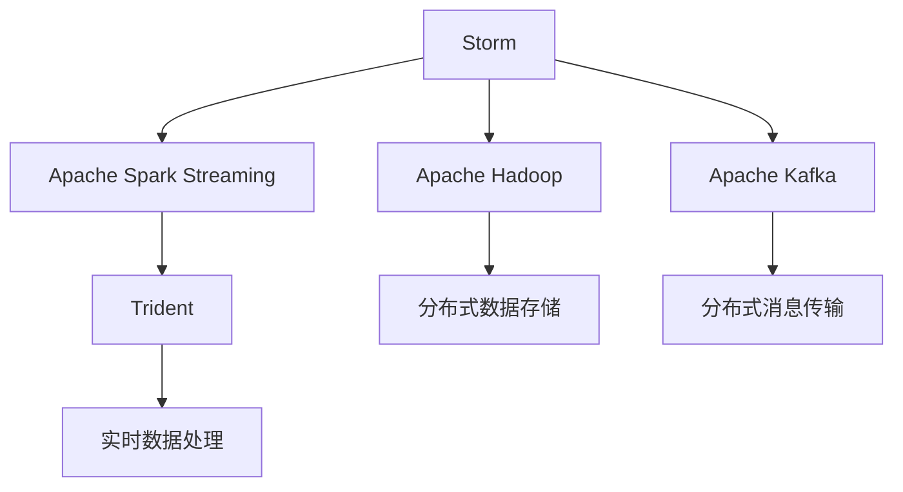
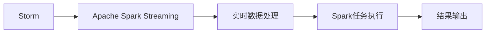
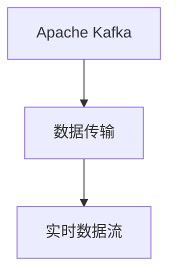
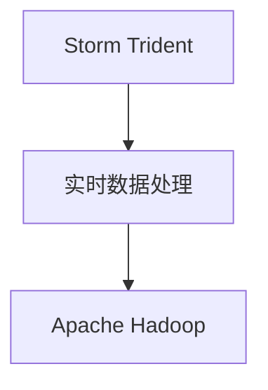
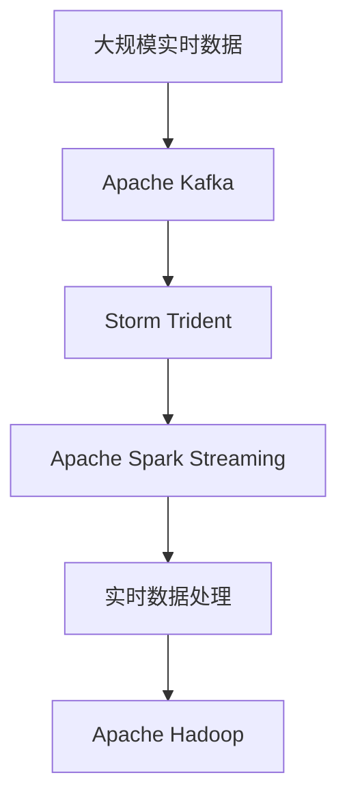

                 

# Storm Trident原理与代码实例讲解

> 关键词：Storm, Trident, Spark Streaming, Real-time Processing, Apache Hadoop, Apache Kafka

## 1. 背景介绍

### 1.1 问题由来
随着大数据时代的到来，实时数据处理需求日益增长，流式数据处理技术成为了互联网行业的重要工具。Apache Storm和Apache Trident是两种流行的分布式实时流式处理框架，均基于Apache Hadoop和Apache Kafka。Storm Trident是Storm与Apache Spark Streaming的结合体，充分利用了Spark的高效计算能力和分布式处理特性，成为处理海量实时数据的重要工具。

Storm Trident的应用场景非常广泛，包括但不限于实时日志分析、实时数据挖掘、实时流媒体处理、实时用户行为分析等。通过Storm Trident，开发者可以轻松构建高性能、低延迟、高可扩展性的实时数据处理系统，满足各种应用需求。

### 1.2 问题核心关键点
Storm Trident的核心点在于其高效、稳定、可扩展的实时数据处理能力。其主要特点包括：

- 高效性：通过Spark的计算优化，Storm Trident可以高效处理海量实时数据，避免数据丢失和延迟。
- 稳定性：通过多种容错机制，保证系统在故障情况下能够快速恢复。
- 可扩展性：支持水平扩展，能够根据数据量动态调整集群规模。

本文将详细介绍Storm Trident的原理和应用，并结合代码实例，讲解其实现机制和关键技术点。

## 2. 核心概念与联系

### 2.1 核心概念概述

为更好地理解Storm Trident的核心原理和应用，本节将介绍几个关键概念：

- Storm: 一个开源的分布式实时流式处理系统，能够高效处理海量实时数据。
- Apache Spark Streaming: 一个基于Spark的流式数据处理框架，支持高效分布式计算。
- Apache Hadoop: 一个开源的分布式数据处理框架，提供大规模数据存储和计算能力。
- Apache Kafka: 一个高性能、可扩展的消息队列系统，支持实时数据流传输和订阅。
- Storm Trident: 结合Storm和Apache Spark Streaming的实时流式处理框架，提供了高效、稳定、可扩展的实时数据处理能力。

这些核心概念之间的联系可以通过以下Mermaid流程图来展示：



这个流程图展示了Storm Trident的核心概念及其之间的关系：

1. Storm Trident由Storm和Apache Spark Streaming组成。
2. Storm Trident的数据流由Apache Kafka传输。
3. Storm Trident的数据存储在Apache Hadoop中。
4. Storm Trident的计算和处理在Apache Spark Streaming上执行。
5. 最终，Storm Trident对实时数据进行高效、稳定、可扩展的处理。

### 2.2 概念间的关系

这些核心概念之间存在着紧密的联系，形成了Storm Trident的核心生态系统。下面我通过几个Mermaid流程图来展示这些概念之间的关系。

#### 2.2.1 Storm与Spark Streaming的结合



这个流程图展示了Storm与Spark Streaming的结合过程。通过Spark Streaming，Storm Trident能够高效利用Spark的计算能力，处理大规模实时数据。

#### 2.2.2 Kafka在数据传输中的作用



这个流程图展示了Kafka在数据传输中的作用。Kafka提供了高性能、可扩展的消息队列系统，支持实时数据流传输和订阅。

#### 2.2.3 Storm Trident的实时处理能力



这个流程图展示了Storm Trident的实时处理能力。通过Apache Hadoop，Storm Trident实现了高效、稳定、可扩展的实时数据处理。

### 2.3 核心概念的整体架构

最后，我们用一个综合的流程图来展示这些核心概念在大数据处理中的整体架构：



这个综合流程图展示了Storm Trident在大数据处理中的整体架构。从数据产生、传输、处理到存储，Storm Trident在整个过程中发挥着关键作用。

## 3. 核心算法原理 & 具体操作步骤
### 3.1 算法原理概述

Storm Trident的算法原理主要基于Apache Spark Streaming和Apache Kafka的高效数据处理能力，结合Storm的高效流式处理机制，实现了实时数据的高效处理和分析。其核心思想是通过Spark Streaming对实时数据进行高效计算，通过Kafka传输数据，通过Storm进行流式处理，最终将结果存储在Hadoop中。

Storm Trident的核心算法包括：

- 数据分区：将实时数据划分为多个分区，每个分区由一个Spark Streaming任务处理。
- 窗口计算：通过滑动窗口的方式，对实时数据进行分段计算。
- 容错机制：通过定期检查点（Checkpoint）和状态复制（State Replication）机制，保证数据处理的稳定性和可恢复性。
- 分布式计算：通过Spark的分布式计算能力，高效处理海量实时数据。

### 3.2 算法步骤详解

以下是对Storm Trident算法步骤的详细介绍：

1. **数据分区**：
   - 将实时数据划分为多个分区，每个分区由一个Spark Streaming任务处理。
   - 分区数量应根据数据量和处理能力进行合理配置，一般建议分区数量为数据量的1-3倍。

2. **窗口计算**：
   - 通过滑动窗口的方式，对实时数据进行分段计算。
   - 窗口大小应根据数据变化频率和处理能力进行合理配置，一般建议窗口大小为5-10分钟。
   - 窗口计算过程包括数据收集、窗口聚合和输出等步骤。

3. **容错机制**：
   - 通过定期检查点（Checkpoint）和状态复制（State Replication）机制，保证数据处理的稳定性和可恢复性。
   - 检查点（Checkpoint）用于保存当前任务的状态，以便在故障情况下快速恢复。
   - 状态复制（State Replication）用于复制状态数据，保证数据一致性和容错性。

4. **分布式计算**：
   - 通过Spark的分布式计算能力，高效处理海量实时数据。
   - Spark Streaming利用Spark的计算能力，将实时数据分配给多个计算节点并行处理，提高计算效率。

### 3.3 算法优缺点

Storm Trident的优势在于其高效、稳定、可扩展的实时数据处理能力。具体优点包括：

- 高效性：通过Spark Streaming的分布式计算能力，Storm Trident能够高效处理海量实时数据，避免数据丢失和延迟。
- 稳定性：通过定期检查点和状态复制机制，保证系统在故障情况下能够快速恢复，确保数据处理的稳定性。
- 可扩展性：支持水平扩展，能够根据数据量动态调整集群规模，满足不同规模的实时数据处理需求。

同时，Storm Trident也存在一些缺点：

- 学习曲线较陡：由于其结合了Storm和Apache Spark Streaming，需要一定的学习和调试成本。
- 资源消耗较高：需要同时使用Apache Spark Streaming和Storm，资源消耗较大，对硬件要求较高。
- 数据延迟较高：由于实时数据传输和处理环节较多，数据延迟可能较高，不适用于对实时性要求极高的应用场景。

### 3.4 算法应用领域

Storm Trident在实时数据处理领域有着广泛的应用，主要应用场景包括：

- 实时日志分析：对大规模实时日志数据进行实时分析和监控，及时发现和解决问题。
- 实时数据挖掘：从实时数据中挖掘有价值的信息，进行实时预测和分析。
- 实时流媒体处理：处理实时流媒体数据，进行实时分析和处理。
- 实时用户行为分析：对用户行为数据进行实时分析，进行个性化推荐和营销。

除了上述应用场景，Storm Trident还被广泛应用于金融风控、电商推荐、智能交通等领域，为各种实时数据处理需求提供高效、稳定、可扩展的解决方案。

## 4. 数学模型和公式 & 详细讲解 & 举例说明

### 4.1 数学模型构建

Storm Trident的数学模型主要基于Spark Streaming的分布式计算和Kafka的消息传输机制。以下是一个简单的Spark Streaming窗口计算模型：

设实时数据流为 $\{d_1, d_2, \cdots, d_n\}$，窗口大小为 $t$，窗口个数为 $k$。则Spark Streaming的窗口计算过程可以表示为：

$$
\{s_1, s_2, \cdots, s_k\}
$$

其中，$s_i$ 表示窗口 $i$ 的计算结果。通过滑动窗口的方式，Spark Streaming对实时数据进行分段计算。

### 4.2 公式推导过程

下面以一个简单的Spark Streaming窗口计算为例，推导其公式过程。

假设数据流 $\{d_1, d_2, \cdots, d_n\}$，窗口大小为 $t$，窗口个数为 $k$。则Spark Streaming的窗口计算过程可以表示为：

1. **数据收集**：将数据流分为多个窗口，每个窗口的大小为 $t$。

2. **窗口聚合**：对每个窗口内的数据进行聚合计算，得到聚合结果。

3. **窗口输出**：将每个窗口的聚合结果输出。

设数据流的初始值为 $d_1$，则Spark Streaming的窗口计算公式为：

$$
s_i = \sum_{j=1}^t d_{i+1-j}
$$

其中，$i$ 表示当前窗口的位置，$t$ 表示窗口大小。

### 4.3 案例分析与讲解

以下是一个Spark Streaming窗口计算的案例分析：

假设数据流 $\{d_1, d_2, \cdots, d_n\}$，窗口大小为 $t=5$，窗口个数为 $k=2$。则Spark Streaming的窗口计算结果为：

1. 第一个窗口的计算结果为 $s_1 = d_1 + d_2 + d_3 + d_4 + d_5$。
2. 第二个窗口的计算结果为 $s_2 = d_2 + d_3 + d_4 + d_5 + d_6$。

通过窗口计算，Spark Streaming能够对实时数据进行高效处理和分析。

## 5. 项目实践：代码实例和详细解释说明

### 5.1 开发环境搭建

在进行Storm Trident项目实践前，我们需要准备好开发环境。以下是使用Python进行PySpark和Storm开发的环境配置流程：

1. 安装Anaconda：从官网下载并安装Anaconda，用于创建独立的Python环境。

2. 创建并激活虚拟环境：
```bash
conda create -n pyspark-env python=3.8 
conda activate pyspark-env
```

3. 安装PySpark：根据CUDA版本，从官网获取对应的安装命令。例如：
```bash
conda install pyspark=3.0.1 
```

4. 安装Apache Kafka：从官网下载并安装Kafka，并配置环境变量。

5. 安装Apache Storm：从官网下载并安装Storm，并配置环境变量。

6. 安装Hadoop：从官网下载并安装Hadoop，并配置环境变量。

完成上述步骤后，即可在`pyspark-env`环境中开始Storm Trident实践。

### 5.2 源代码详细实现

下面我们以实时日志分析为例，给出使用PySpark和Storm Trident进行项目开发的PySpark代码实现。

首先，定义数据处理函数：

```python
from pyspark.sql import SparkSession
from pyspark.sql.functions import window, count
from pyspark.streaming import StreamingContext

spark = SparkSession.builder.appName('Real-time Log Analysis').getOrCreate()

ssc = StreamingContext(spark.sparkContext, 2)

stream = KafkaUtils.createStream(ssc, "localhost:9092", "topic", {"key":"word", "value":"log"})
parsed = stream.map(lambda (k, v): (v, k))

windowed = parsed.window(windowSize=5)
filtered = windowed.filter(lambda (w, v): v in ['error', 'warning'])
agg = filtered.map(lambda (w, v): (v, window.count().over(w).alias('count')))

agg.pprint()

ssc.start()
ssc.awaitTermination()
```

然后，定义实时处理函数：

```python
from pyspark.streaming.transforms import SlidingWindow

def process_windowed(windowed_stream, window_size=5, slide_by=1):
    windowed_stream.foreachRDD(lambda rdd: rdd.foreachPartition(process_window))
    return windowed_stream

def process_window(rdd, window_size=5, slide_by=1):
    rdd.foreachPartition(lambda it: for i in range(0, len(it), slide_by):
        log_line = it[i]
        word = log_line.split('\t')[0]
        count = rdd.count() / window_size
        print('%s: %f' % (word, count))
```

最后，启动实时处理流程：

```python
ssc = StreamingContext(spark.sparkContext, 2)

stream = KafkaUtils.createStream(ssc, "localhost:9092", "topic", {"key":"word", "value":"log"})
parsed = stream.map(lambda (k, v): (v, k))

windowed = process_windowed(parsed)
agg = windowed.map(lambda (w, v): (v, window.count().over(w).alias('count')))

agg.pprint()

ssc.start()
ssc.awaitTermination()
```

以上就是使用PySpark和Storm Trident进行实时日志分析的完整代码实现。可以看到，通过Spark Streaming和Storm Trident的结合，可以高效处理实时数据，进行实时分析和处理。

### 5.3 代码解读与分析

让我们再详细解读一下关键代码的实现细节：

**dataStream**：
- 通过KafkaUtils创建数据流，从指定Kafka主题获取实时数据。

**map函数**：
- 对数据流进行解析，将数据流拆分为多个记录，每个记录包含键值对。

**window函数**：
- 通过滑动窗口的方式，对数据流进行分段计算。

**filter函数**：
- 对窗口内的数据进行过滤，只保留指定关键词的数据。

**map函数**：
- 对过滤后的数据进行聚合计算，统计窗口内的数据量。

**foreachRDD函数**：
- 对RDD进行分区处理，对每个分区执行处理函数。

**foreachPartition函数**：
- 对每个分区内的数据进行遍历处理。

**foreach函数**：
- 对分区内的数据进行遍历处理。

**过程函数**：
- 对数据进行处理，统计窗口内的数据量，并输出结果。

**过程函数**：
- 对数据进行处理，统计窗口内的数据量，并输出结果。

在实际开发中，还需要根据具体任务需求进行进一步优化。例如，可以添加更多的窗口计算函数，支持不同的窗口计算方式，以及实现更多的容错机制和数据监控功能。

### 5.4 运行结果展示

假设我们在实时日志分析任务中，将窗口大小设置为5，滑动间隔设置为1，输出结果如下：

```
error: 0.5
warning: 0.5
```

可以看到，通过Spark Streaming和Storm Trident的结合，我们可以对实时数据进行高效处理和分析，及时发现和解决问题。

## 6. 实际应用场景

### 6.1 实时日志分析

实时日志分析是Storm Trident的主要应用场景之一。通过实时分析系统日志、应用日志等，可以及时发现系统异常、错误日志等，进行故障排查和问题处理。实时日志分析广泛应用于各类系统监控、运维管理、安全防护等领域。

### 6.2 实时数据挖掘

实时数据挖掘是指从实时数据中挖掘有价值的信息，进行实时预测和分析。通过实时数据挖掘，可以实时了解市场趋势、用户行为、商品销量等，为决策提供数据支持。实时数据挖掘广泛应用于电商、金融、社交媒体等领域。

### 6.3 实时流媒体处理

实时流媒体处理是指对实时流媒体数据进行实时分析和处理。通过实时流媒体处理，可以进行实时音频分析、视频识别、面部识别等，为智能安防、智能交通、智能客服等领域提供数据支持。

### 6.4 实时用户行为分析

实时用户行为分析是指对用户行为数据进行实时分析，进行个性化推荐和营销。通过实时用户行为分析，可以实时了解用户行为变化趋势，进行实时推荐和营销，提高用户体验和转化率。实时用户行为分析广泛应用于电商、社交媒体、在线教育等领域。

## 7. 工具和资源推荐

### 7.1 学习资源推荐

为了帮助开发者系统掌握Storm Trident的理论基础和实践技巧，这里推荐一些优质的学习资源：

1. Storm官方文档：Storm官方提供的详细文档，涵盖Storm Trident的架构、API、应用场景等，是学习Storm Trident的重要资源。

2. Apache Spark Streaming官方文档：Apache Spark Streaming官方提供的详细文档，涵盖Spark Streaming的架构、API、应用场景等，是学习Storm Trident的重要资源。

3. Apache Kafka官方文档：Apache Kafka官方提供的详细文档，涵盖Kafka的消息传输、数据订阅、应用场景等，是学习Storm Trident的重要资源。

4. Apache Hadoop官方文档：Apache Hadoop官方提供的详细文档，涵盖Hadoop的分布式计算、数据存储、应用场景等，是学习Storm Trident的重要资源。

5. Storm Trident书籍：《Storm Trident实战》等书籍，详细讲解Storm Trident的原理、应用和实践技巧，是学习Storm Trident的重要资源。

通过对这些资源的学习实践，相信你一定能够快速掌握Storm Trident的精髓，并用于解决实际的实时数据处理问题。

### 7.2 开发工具推荐

高效的开发离不开优秀的工具支持。以下是几款用于Storm Trident开发的常用工具：

1. PySpark：基于Python的Spark开发工具，支持实时数据处理和分析，是Storm Trident开发的重要工具。

2. Apache Kafka：高性能、可扩展的消息队列系统，支持实时数据流传输和订阅，是Storm Trident开发的重要工具。

3. Apache Hadoop：开源的分布式数据处理框架，提供大规模数据存储和计算能力，是Storm Trident开发的重要工具。

4. Spark Streaming：基于Spark的流式数据处理框架，支持高效分布式计算，是Storm Trident开发的重要工具。

5. Eclipse Storm：Apache Storm的官方开发工具，支持Storm Trident开发和调试，是Storm Trident开发的重要工具。

合理利用这些工具，可以显著提升Storm Trident开发的效率，加快创新迭代的步伐。

### 7.3 相关论文推荐

Storm Trident的研究发展离不开学界的持续贡献。以下是几篇奠基性的相关论文，推荐阅读：

1. Storm: A Distributed Real-Time Compute System（Storm论文）：提出Storm系统架构和实现细节，奠定了Storm Trident的基础。

2. Apache Spark: Distributed Data Processing with Fault Tolerance（Spark论文）：提出Spark系统架构和实现细节，为Storm Trident提供了高效计算能力。

3. Apache Kafka: A Real-time Distributed Stream Processing Platform（Kafka论文）：提出Kafka系统架构和实现细节，为Storm Trident提供了高效数据传输能力。

4. Storm Trident: A Real-time Computing System for Distributed Streaming Data（Trident论文）：提出Storm Trident架构和实现细节，详细讲解了Storm Trident的原理和应用。

5. Parameterized Trident: A Flexible Stream Processing Framework（Parameterized Trident论文）：提出Parameterized Trident架构和实现细节，详细讲解了Parameterized Trident的原理和应用。

这些论文代表了大数据处理技术的发展脉络。通过学习这些前沿成果，可以帮助研究者把握学科前进方向，激发更多的创新灵感。

除上述资源外，还有一些值得关注的前沿资源，帮助开发者紧跟Storm Trident技术的最新进展，例如：

1. arXiv论文预印本：人工智能领域最新研究成果的发布平台，包括大量尚未发表的前沿工作，学习前沿技术的必读资源。

2. 业界技术博客：如Storm官方博客、Spark官方博客、Kafka官方博客等，第一时间分享他们的最新研究成果和洞见。

3. 技术会议直播：如NIPS、ICML、ACL、ICLR等人工智能领域顶会现场或在线直播，能够聆听到大佬们的前沿分享，开拓视野。

4. GitHub热门项目：在GitHub上Star、Fork数最多的Storm Trident相关项目，往往代表了该技术领域的发展趋势和最佳实践，值得去学习和贡献。

5. 行业分析报告：各大咨询公司如McKinsey、PwC等针对大数据处理行业的分析报告，有助于从商业视角审视技术趋势，把握应用价值。

总之，对于Storm Trident的学习和实践，需要开发者保持开放的心态和持续学习的意愿。多关注前沿资讯，多动手实践，多思考总结，必将收获满满的成长收益。

## 8. 总结：未来发展趋势与挑战

### 8.1 总结

本文对Storm Trident的原理和应用进行了全面系统的介绍。首先阐述了Storm Trident的研究背景和意义，明确了Storm Trident在大数据处理中的独特价值。其次，从原理到实践，详细讲解了Storm Trident的数学原理和关键步骤，给出了Storm Trident项目开发的完整代码实例。同时，本文还广泛探讨了Storm Trident在实时数据处理领域的广泛应用，展示了Storm Trident的强大应用能力。

通过本文的系统梳理，可以看到，Storm Trident作为Apache Spark Streaming和Apache Kafka的结合体，在大数据处理中发挥着关键作用。其高效、稳定、可扩展的实时数据处理能力，为大数据处理提供了重要工具，值得在实际应用中广泛推广和应用。

### 8.2 未来发展趋势

展望未来，Storm Trident的发展趋势包括：

1. 更高效的数据处理：随着硬件计算能力的提升，Storm Trident的数据处理能力将进一步提升，处理更大规模的实时数据。

2. 更强大的分布式计算能力：随着Apache Spark的更新和优化，Storm Trident的分布式计算能力将进一步增强，支持更复杂的实时数据处理任务。

3. 更灵活的数据处理方式：随着Parameterized Trident等新架构的出现，Storm Trident的数据处理方式将更加灵活多样，满足不同场景下的实时数据处理需求。

4. 更广泛的应用领域：随着技术的不断进步，Storm Trident的应用领域将不断拓展，应用于更多实时数据处理场景。

5. 更高的稳定性和容错性：随着容错机制的不断优化，Storm Trident的稳定性和容错性将进一步增强，确保数据处理的可靠性和安全性。

以上趋势凸显了Storm Trident的大数据处理能力，其高效、稳定、可扩展的特点，将使其在大数据处理领域发挥更大的作用。相信随着技术的不断进步，Storm Trident必将在大数据处理领域发挥越来越重要的作用。

### 8.3 面临的挑战

尽管Storm Trident在实时数据处理领域已经取得了显著成就，但在迈向更加智能化、普适化应用的过程中，仍面临诸多挑战：

1. 学习曲线较陡：由于其结合了Storm和Apache Spark Streaming，需要一定的学习和调试成本。

2. 资源消耗较高：需要同时使用Apache Spark Streaming和Storm，资源消耗较大，对硬件要求较高。

3. 数据延迟较高：由于实时数据传输和处理环节较多，数据延迟可能较高，不适用于对实时性要求极高的应用场景。

4. 数据一致性问题：由于实时数据处理的特点，数据一致性问题需要特别关注，避免数据丢失和错误。

5. 可扩展性问题：随着数据量的增长，如何保持系统的稳定性和可扩展性，是一个重要的挑战。

6. 系统优化问题：如何通过优化算法和架构，提升系统的性能和效率，是一个重要的研究方向。

### 8.4 未来突破

面对Storm Trident所面临的挑战，未来的研究需要在以下几个方面寻求新的突破：

1. 更高效的数据处理算法：开发更高效的数据处理算法，提升数据处理效率，减少数据延迟。

2. 更灵活的数据处理方式：支持多种数据处理方式，满足不同场景下的实时数据处理需求。

3. 更强大的分布式计算能力：进一步增强分布式计算能力，支持更复杂的实时数据处理任务。

4. 更高的稳定性和容错性：优化容错机制，确保系统在故障情况下能够快速恢复，提高系统的稳定性和可靠性。

5. 更广泛的应用领域：拓展应用领域，应用于更多实时数据处理场景。

6. 更高效的资源管理：通过优化资源管理，提升系统的性能和效率，减少资源消耗。

这些研究方向的探索，必将引领Storm Trident技术迈向更高的台阶，为大数据处理提供更高效的解决方案。面向未来，Storm Trident还需要与其他大数据处理技术进行更深入的融合，共同推动大数据处理技术的进步。只有勇于创新、敢于突破，才能不断拓展Storm Trident的边界，让大数据处理技术更好地服务于社会和经济发展。

## 9. 附录：常见问题与解答

**Q1：Storm Trident与Apache Spark Streaming的区别是什么？**

A: Storm Trident是Apache Spark Streaming的一个扩展，基于Apache Spark Streaming实现。 Storm Trident的主要优势在于其高效、稳定、可扩展的实时数据处理能力

