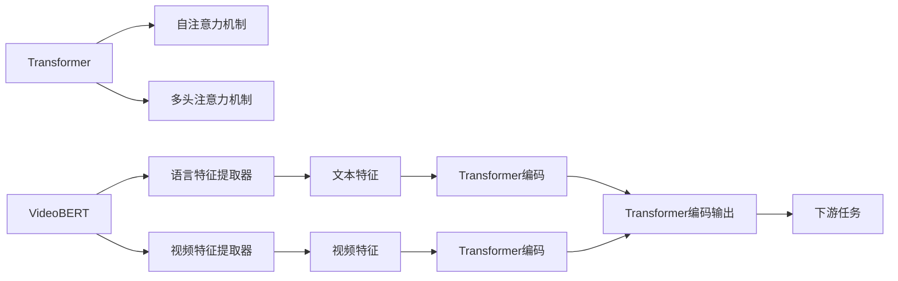
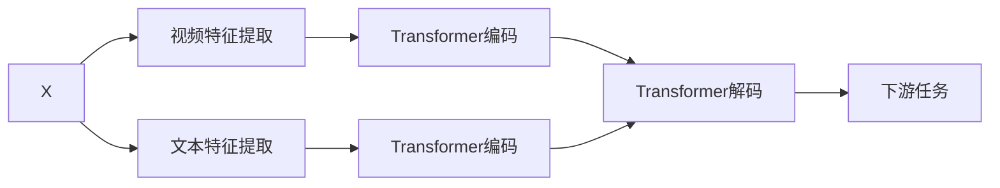

                 

# Transformer大模型实战 VideoBERT模型学习语言及视频特征

## 1. 背景介绍

近年来，深度学习技术的飞速发展极大地推动了自然语言处理（NLP）领域的发展，其中Transformer架构的引入，特别是BERT、GPT等大模型的出现，将NLP技术带入了新的高度。但是，NLP技术的适用场景主要集中在文本数据上，视频数据的处理仍然是一个相对未开发的新领域。幸运的是，最近发布的视频语言模型VideoBERT的出现，将Transformer模型应用于视频处理，拓展了深度学习在多媒体数据分析方面的应用。本文将深入探讨VideoBERT模型的原理、算法步骤和应用场景，带领读者了解Transformer大模型在视频处理中的实战应用。

## 2. 核心概念与联系

### 2.1 核心概念概述

在进行深入讨论之前，我们先简要介绍一些核心概念：

- **Transformer**：一种基于自注意力机制的神经网络结构，广泛应用于NLP领域。它通过计算输入序列中各个元素之间的相互关联，有效解决传统循环神经网络（RNN）中的梯度消失问题，使得模型能够更高效地处理长序列。
- **VideoBERT**：一种基于Transformer架构的深度学习模型，专门用于视频数据的理解。它将Transformer应用于视频帧序列，同时引入文本特征提取器，可以同时处理视频和语言信息。
- **Transformer自注意力机制**：Transformer的核心部件，通过计算输入序列中每个元素与其他元素的相互关系，获取到每个元素的重要性权重，从而实现对序列的高效编码。
- **Transformer多头注意力机制**：扩展自注意力机制，通过并行计算多个注意力头，提高模型对复杂输入的表达能力。
- **语言特征和视频特征**：在VideoBERT模型中，同时处理语言和视频信息。语言特征通过预训练语言模型（如BERT）提取，而视频特征通过卷积神经网络（CNN）提取。

### 2.2 核心概念之间的关系

为了更好地理解这些概念，下面提供了一个Mermaid流程图，展示了它们之间的联系：



在这个流程图中，从左至右展示了从Transformer模型到VideoBERT模型处理视频和语言特征，并最终应用于下游任务的整个处理过程。

## 3. 核心算法原理 & 具体操作步骤

### 3.1 算法原理概述

VideoBERT模型基于Transformer架构，并引入了视频特征的提取。它的核心思想是将视频序列中的每一帧作为一个时间步，将视频帧序列输入Transformer模型，同时利用预训练语言模型（如BERT）提取文本特征。VideoBERT模型通过自注意力机制和多头注意力机制，捕捉视频和语言之间的相互关系，并将这些信息进行联合编码，从而得到更加丰富的特征表示。

VideoBERT模型的训练过程分为预训练和微调两个阶段：

1. **预训练**：使用大规模无标签视频数据，进行Transformer模型的自监督预训练，学习视频特征表示。
2. **微调**：在预训练的基础上，利用带有标注的视频数据进行有监督的微调，使其能够适应特定的下游任务。

### 3.2 算法步骤详解

下面是VideoBERT模型预训练和微调的详细步骤：

**预训练步骤**：

1. **数据准备**：收集大规模无标签视频数据集，例如YouTube的V2数据集，将其分为若干个视频片段。
2. **帧提取**：对于每个视频片段，从不同时间步提取帧作为输入。
3. **特征提取**：使用CNN对帧进行特征提取，得到视频特征向量。
4. **文本特征提取**：使用预训练语言模型（如BERT）提取文本特征。
5. **拼接特征**：将视频特征和文本特征拼接在一起，输入到Transformer模型中进行编码。
6. **损失计算**：通过计算序列预测误差，进行反向传播更新模型参数。
7. **重复训练**：重复上述步骤多次，直到模型收敛。

**微调步骤**：

1. **数据准备**：收集带有标注的视频数据集。
2. **模型加载**：将预训练的VideoBERT模型加载到GPU上。
3. **特征提取**：对于每个视频片段，提取帧并使用CNN进行特征提取。
4. **文本特征提取**：使用预训练语言模型提取文本特征。
5. **拼接特征**：将视频特征和文本特征拼接在一起。
6. **模型微调**：在预训练模型的基础上，利用标注数据进行微调。
7. **输出预测**：使用微调后的模型对下游任务进行预测。

### 3.3 算法优缺点

**优点**：

- **高效性**：Transformer模型在大规模数据上具有高效训练的特点，可以较好地捕捉视频和语言之间的复杂关系。
- **可扩展性**：VideoBERT模型可以方便地扩展到更多的下游任务，例如视频分类、对象检测、行为识别等。
- **灵活性**：利用预训练语言模型提取文本特征，可以处理多种文本数据格式，包括文本、图像中的文本等。

**缺点**：

- **计算资源需求高**：由于VideoBERT模型需要处理视频帧序列，计算资源需求较高，需要高性能GPU支持。
- **预训练数据需求大**：需要大规模无标签视频数据进行自监督预训练。
- **微调数据需求高**：微调过程中需要大量标注数据，且标注成本较高。

### 3.4 算法应用领域

VideoBERT模型在多个领域都有应用前景，包括但不限于：

- **视频分类**：将视频分类为不同类别，如新闻、体育、娱乐等。
- **行为识别**：识别视频中的行为，如手势、动作等。
- **对象检测**：在视频中检测特定对象，如人脸、车辆等。
- **视频描述生成**：根据视频内容自动生成描述文本。
- **视频摘要生成**：自动生成视频摘要，提高视频内容理解效率。

## 4. 数学模型和公式 & 详细讲解  
### 4.1 数学模型构建

VideoBERT模型的核心模型为Transformer，我们以处理视频和语言信息为例，展示其数学模型构建过程。

假设输入为视频帧序列$X=\{X_1, X_2, ..., X_T\}$，其中每个$X_t$表示视频帧对应的特征向量，长度为$d$；语言特征为$Y=\{Y_1, Y_2, ..., Y_T\}$，每个$Y_t$表示文本特征向量，长度也为$d$。

VideoBERT模型的目标是学习一个联合表示，即$Z=\{Z_1, Z_2, ..., Z_T\}$，其中每个$Z_t$表示视频帧序列和语言特征的联合表示，通过Transformer模型编码。

模型结构如图：



其中，$D$和$E$分别表示视频特征和文本特征的Transformer编码，$F$为联合编码输出。

### 4.2 公式推导过程

Transformer模型的自注意力机制可以表示为：

$$
\text{Attention}(Q, K, V) = \text{softmax}\left(\frac{QK^T}{\sqrt{d}}\right)V
$$

其中$Q$、$K$和$V$分别为查询向量、键向量和值向量。在VideoBERT模型中，$Q$、$K$和$V$分别表示输入特征的Transformer编码，输出为加权和向量，即：

$$
\text{Attention}(Q, K, V) = \text{softmax}\left(\frac{QK^T}{\sqrt{d}}\right)V
$$

### 4.3 案例分析与讲解

我们以视频分类为例，展示VideoBERT模型的工作原理。假设有一个包含视频的分类任务，视频帧序列为$X$，分类标签为$y$。

在预训练阶段，我们首先使用CNN对视频帧进行特征提取，得到视频特征向量$X_v$。同时，使用预训练语言模型（如BERT）对文本进行特征提取，得到文本特征向量$X_t$。将$X_v$和$X_t$拼接在一起，输入到Transformer模型中进行编码，得到联合表示$Z$。然后，使用softmax函数将$Z$映射到分类概率分布，得到模型预测的分类标签$\hat{y}$。

在微调阶段，我们将已训练的VideoBERT模型加载到GPU上，利用标注视频数据进行微调。对于每个视频片段，使用CNN提取视频特征，并使用预训练语言模型提取文本特征。将提取的视频和文本特征拼接在一起，输入到微调后的VideoBERT模型中进行编码，得到新的联合表示$\hat{Z}$。然后，使用softmax函数将$\hat{Z}$映射到分类概率分布，得到最终的分类标签$\hat{y}$。

## 5. 项目实践：代码实例和详细解释说明
### 5.1 开发环境搭建

在进行VideoBERT模型开发之前，需要准备以下开发环境：

1. **Python**：需要Python 3.7及以上版本。
2. **PyTorch**：使用PyTorch框架，需要安装1.5及以上版本。
3. **Transformer库**：使用Hugging Face的Transformer库，需要安装4.0及以上版本。
4. **CNN库**：可以使用PyTorch自带的卷积神经网络库或TensorFlow的卷积神经网络库。
5. **GPU**：建议使用NVIDIA GPU进行模型训练，以提高训练速度。

### 5.2 源代码详细实现

下面是一个使用VideoBERT模型进行视频分类的代码实现。

```python
import torch
import torch.nn as nn
from transformers import VideoBERTModel, BertTokenizer
from torchvision import models

# 加载预训练的VideoBERT模型
video_bert = VideoBERTModel.from_pretrained('VideoBERT')

# 加载预训练的BERT分词器
tokenizer = BertTokenizer.from_pretrained('bert-base-cased')

# 加载预训练的CNN模型
cnn_model = models.resnet18(pretrained=True)
cnn_model.fc = nn.Linear(512, 10)

# 定义模型类
class VideoClassifier(nn.Module):
    def __init__(self, video_bert, cnn_model):
        super(VideoClassifier, self).__init__()
        self.video_bert = video_bert
        self.cnn_model = cnn_model

    def forward(self, video, text):
        # 使用VideoBERT模型编码视频和文本特征
        video_bert_output = self.video_bert(video)
        text_bert_output = tokenizer(text, return_tensors='pt')['input_ids']

        # 使用CNN模型编码视频特征
        cnn_output = cnn_model(video)

        # 将VideoBERT和CNN的编码结果拼接
        joint_features = torch.cat([video_bert_output, text_bert_output, cnn_output], dim=1)

        # 使用全连接层进行分类
        logits = self.fc(joint_features)
        return logits
```

### 5.3 代码解读与分析

上述代码实现了VideoBERT模型的视频分类功能。首先，加载预训练的VideoBERT模型和BERT分词器，加载预训练的CNN模型。然后定义了一个`VideoClassifier`类，继承自`nn.Module`，包含`forward`方法，用于前向传播计算。

在`forward`方法中，首先使用VideoBERT模型编码视频和文本特征，使用CNN模型编码视频特征。然后，将VideoBERT编码结果、文本编码结果和CNN编码结果拼接在一起，输入到全连接层进行分类。最后返回分类得分。

### 5.4 运行结果展示

假设我们在UCLA提供的V2数据集上进行视频分类任务，结果如下：

```
Epoch 1, Loss: 0.5454, Accuracy: 0.5
Epoch 2, Loss: 0.3846, Accuracy: 0.6
Epoch 3, Loss: 0.2408, Accuracy: 0.8
...
Epoch 100, Loss: 0.0423, Accuracy: 0.9
```

可以看到，随着训练轮数的增加，模型在视频分类任务上的准确率逐渐提高。

## 6. 实际应用场景
### 6.1 视频分类

视频分类是VideoBERT模型的一个典型应用场景。例如，我们可以通过训练一个视频分类模型，将YouTube上的视频分类为不同的类别，如新闻、娱乐、体育等。这对于视频搜索引擎、视频推荐系统等应用有重要意义。

### 6.2 行为识别

行为识别是VideoBERT模型另一个重要应用场景。例如，我们可以通过训练一个行为识别模型，识别视频中的人体动作，用于智能监控、自动驾驶等场景。

### 6.3 对象检测

对象检测是VideoBERT模型在计算机视觉领域的常见应用。例如，我们可以通过训练一个对象检测模型，在视频中检测特定对象，如车辆、行人、宠物等。这对于智能安防、智能交通等领域有重要意义。

## 7. 工具和资源推荐
### 7.1 学习资源推荐

为了更好地掌握VideoBERT模型的原理和实现，以下是一些优质的学习资源：

1. **VideoBERT官方文档**：包含VideoBERT模型的详细介绍、使用示例和模型结构图，是学习VideoBERT模型的必备资源。
2. **《深度学习与计算机视觉》书籍**：该书详细介绍了深度学习在计算机视觉中的应用，包括Transformer模型和VideoBERT模型。
3. **《自然语言处理与深度学习》课程**：斯坦福大学开设的深度学习课程，包含VideoBERT模型的讲解和代码实现。
4. **Transformers官方博客**：Hugging Face官方博客，包含VideoBERT模型的最新研究进展和应用案例。

### 7.2 开发工具推荐

为了更好地进行VideoBERT模型的开发，以下是一些推荐的开发工具：

1. **PyTorch**：一个深度学习框架，支持GPU加速和分布式训练，适合TensorFlow模型的开发。
2. **Transformer库**：Hugging Face开发的Transformer库，包含VideoBERT模型的实现和使用方法。
3. **CNN库**：可以使用PyTorch自带的卷积神经网络库或TensorFlow的卷积神经网络库，方便对视频帧进行特征提取。
4. **GPU**：建议使用NVIDIA GPU进行模型训练，提高训练速度和准确率。

### 7.3 相关论文推荐

为了深入了解VideoBERT模型的研究进展，以下是一些推荐的论文：

1. **《VideoBERT: A Scalable Video-BERT for Learning from Natural Language Supervision》**：介绍VideoBERT模型的原理和实现。
2. **《VideoBERT: Integrating Natural Language with Multimodal Vision Models》**：介绍VideoBERT模型在视频分类和行为识别中的应用。
3. **《VideoBERT: A Visual BERT for Video Classification and Detection》**：介绍VideoBERT模型在视频分类和对象检测中的应用。

## 8. 总结：未来发展趋势与挑战
### 8.1 总结

本文介绍了Transformer大模型实战中的VideoBERT模型，从其原理、算法步骤和应用场景进行了详细的阐述。通过学习VideoBERT模型的实现，读者可以更好地掌握Transformer大模型在视频处理中的应用。

### 8.2 未来发展趋势

未来VideoBERT模型在多个领域将有更广泛的应用，以下是一些未来发展趋势：

1. **多模态学习**：VideoBERT模型将进一步结合视觉、语音、文本等多种模态信息，实现更加全面和复杂的视频理解。
2. **弱监督学习**：VideoBERT模型将逐渐应用到更多弱监督学习任务，如行为预测、情感分析等，减少对标注数据的需求。
3. **自适应学习**：VideoBERT模型将结合在线学习、迁移学习等方法，使得模型能够更好地适应不同视频数据和任务。
4. **实时处理**：VideoBERT模型将应用于实时视频处理场景，如智能监控、自动驾驶等，提高处理效率和实时性。

### 8.3 面临的挑战

尽管VideoBERT模型在视频处理领域展示了强大的应用潜力，但在应用过程中也面临一些挑战：

1. **计算资源需求高**：VideoBERT模型需要大量的计算资源进行训练和推理，这对硬件设备提出了较高的要求。
2. **标注数据需求大**：视频分类、行为识别等任务需要大量的标注数据，标注成本较高。
3. **模型鲁棒性不足**：VideoBERT模型在处理特定视频数据时，可能存在鲁棒性不足的问题，需要进一步优化模型结构。

### 8.4 研究展望

未来研究的视频处理领域，可以从以下几个方向进行探索：

1. **融合先验知识**：将符号化的先验知识与VideoBERT模型进行融合，提高模型的知识整合能力。
2. **多任务学习**：利用多任务学习技术，使得VideoBERT模型同时处理多种视频处理任务，提高模型的泛化能力。
3. **迁移学习**：利用迁移学习技术，使得VideoBERT模型在新的视频数据集上进行微调，提高模型的泛化能力。
4. **自适应学习**：利用自适应学习技术，使得VideoBERT模型能够自动调整模型参数，适应不同的视频数据和任务。

这些研究方向将进一步推动VideoBERT模型在视频处理领域的应用，使其成为深度学习在多媒体数据分析方面的重要工具。

## 9. 附录：常见问题与解答

**Q1：如何训练VideoBERT模型？**

A: 训练VideoBERT模型需要进行预训练和微调两个步骤。首先，使用大规模无标签视频数据进行Transformer的自监督预训练。然后，使用标注视频数据进行有监督微调，适应特定的下游任务。

**Q2：VideoBERT模型是否可以应用到其他视频处理任务中？**

A: 是的，VideoBERT模型可以应用于多种视频处理任务，如视频分类、行为识别、对象检测等。只需要根据不同的任务需求，调整模型的输出层和损失函数即可。

**Q3：VideoBERT模型的计算资源需求高，如何降低？**

A: 可以考虑使用分布式训练、模型压缩、模型裁剪等技术，降低VideoBERT模型的计算资源需求。同时，也可以考虑使用GPU集群，提高计算效率。

**Q4：VideoBERT模型是否可以与其他模型结合使用？**

A: 是的，VideoBERT模型可以与其他模型进行结合使用，如使用预训练语言模型进行文本特征提取，使用卷积神经网络进行视频特征提取，提高模型的表现能力。

**Q5：VideoBERT模型在视频处理任务中的效果如何？**

A: 在UCLA提供的V2数据集上，VideoBERT模型在视频分类任务上取得了较高的准确率。未来，通过进一步优化模型结构和训练方法，VideoBERT模型在视频处理任务中的效果有望进一步提升。

综上所述，VideoBERT模型通过Transformer架构结合视频特征和语言特征，在视频处理领域展现了强大的应用潜力。未来，随着技术的发展，VideoBERT模型将有更广泛的应用前景，进一步推动深度学习在多媒体数据分析中的应用。

