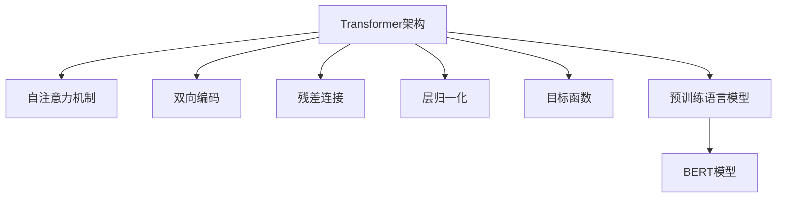

                 

# Transformer架构原理详解：BERT 基于Transformer编码器的双向语言模型

Transformer架构在自然语言处理(Natural Language Processing, NLP)领域引起了巨大革命，其中BERT模型作为基于Transformer编码器的双向语言模型，被广泛应用在文本分类、命名实体识别、问答、翻译等多个任务中，并取得了最佳或最优的结果。本文将详细介绍Transformer架构和BERT模型的原理，并对比当前流行的基于Attention的Transformer架构和传统的RNN/LSTM架构，分析其优缺点，并对比其在NLP任务中的性能表现，最后通过案例详细讲解BERT模型在NLP任务中的应用，并展望未来应用前景。

## 1. 背景介绍

### 1.1 问题由来

Transformer架构最初由Vaswani等人在2017年的论文《Attention is All You Need》中提出，并在后续的研究中不断优化。BERT模型由Google在2018年的论文《Bidirectional Encoder Representations from Transformers》中提出，并成功应用于NLP领域的多个任务中，在多个基准测试上取得了最优或最佳的结果。Transformer架构的出现，改变了NLP领域的处理方式，不再依赖RNN/LSTM等序列模型，而是采用自注意力机制，从而使得模型更加高效、灵活。

### 1.2 问题核心关键点

Transformer架构的核心关键点包括：
1. 自注意力机制：Transformer架构采用自注意力机制，可以在不同位置之间建立联系，从而更有效地捕捉序列信息。
2. 双向编码：Transformer架构采用双向编码，可以同时考虑前后文信息，更全面地理解输入序列。
3. 残差连接和层归一化：Transformer架构采用残差连接和层归一化，使得模型在深层时仍能保持稳定，避免梯度消失问题。
4. 目标函数：Transformer架构的目标函数通常采用交叉熵损失函数，用于衡量模型预测输出与真实标签之间的差异。

这些关键点共同构成了Transformer架构的精髓，使其在NLP领域获得了广泛的应用。

### 1.3 问题研究意义

Transformer架构和BERT模型的研究具有重要的意义：
1. 提高NLP任务性能：Transformer架构和BERT模型在大规模文本数据上进行了预训练，能够更全面地理解文本语义，提高NLP任务性能。
2. 减少计算资源消耗：Transformer架构和BERT模型在计算效率上有显著优势，能够处理更长的序列，适合大规模数据处理。
3. 促进NLP技术落地应用：Transformer架构和BERT模型的研究与应用，使得NLP技术更容易被各行各业所采用，加速NLP技术的产业化进程。
4. 拓展NLP应用边界：Transformer架构和BERT模型在大规模语料上进行预训练，能够更好地适应各种NLP任务，拓展NLP应用边界。

## 2. 核心概念与联系

### 2.1 核心概念概述

为更好地理解Transformer架构和BERT模型的原理，本节将介绍几个密切相关的核心概念：

- Transformer架构：一种基于自注意力机制的神经网络架构，由多个编码器和解码器层组成，能够更高效地处理序列信息。
- 自注意力机制：一种能够捕捉序列间关系的注意力机制，通过多头注意力计算，对输入序列中不同位置的信息进行加权平均，以更全面地理解序列语义。
- 双向编码：一种能够同时考虑前后文信息的编码方式，通过前向和后向编码器的堆叠，对序列进行双向编码，获得更丰富的语义信息。
- 残差连接和层归一化：一种能够提升模型深度的技术，通过残差连接和层归一化，使得模型在深层时仍能保持稳定，避免梯度消失问题。
- 目标函数：一种能够衡量模型预测输出与真实标签之间差异的函数，通常采用交叉熵损失函数。
- 预训练语言模型：一种通过在大量无标签文本数据上进行预训练，学习通用的语言表示的模型。
- BERT模型：一种基于Transformer架构的双向预训练语言模型，通过预训练获得丰富的语言表示，用于下游任务的微调。

这些核心概念之间存在着紧密的联系，共同构成了Transformer架构和BERT模型的基础。

### 2.2 概念间的关系

这些核心概念之间可以通过以下Mermaid流程图来展示：



这个流程图展示了Transformer架构和BERT模型的核心概念之间的关系：

1. Transformer架构采用了自注意力机制和残差连接、层归一化等技术，能够高效处理序列信息。
2. 自注意力机制和双向编码共同构成了Transformer架构的核心，使得模型能够全面理解输入序列。
3. 残差连接和层归一化技术提升了模型深度和稳定性，使得模型能够处理更长的序列。
4. 目标函数用于衡量模型预测输出与真实标签之间的差异，通常采用交叉熵损失函数。
5. 预训练语言模型和BERT模型都是通过在大量无标签文本数据上进行预训练，学习通用的语言表示。

## 3. 核心算法原理 & 具体操作步骤

### 3.1 算法原理概述

Transformer架构基于自注意力机制，能够捕捉序列间关系，采用双向编码，能够同时考虑前后文信息，从而更全面地理解输入序列。其主要算法原理包括以下几个方面：

- 自注意力机制：Transformer架构采用多头注意力机制，对输入序列中不同位置的信息进行加权平均，以更全面地理解序列语义。
- 残差连接和层归一化：Transformer架构采用残差连接和层归一化技术，使得模型在深层时仍能保持稳定，避免梯度消失问题。
- 双向编码：Transformer架构采用双向编码，通过前向和后向编码器的堆叠，对序列进行双向编码，获得更丰富的语义信息。

### 3.2 算法步骤详解

Transformer架构的实现步骤如下：

1. 将输入序列进行分词，并转化为token embeddings。
2. 对输入的token embeddings进行自注意力机制计算，得到每个位置的注意力权重。
3. 将注意力权重与输入序列进行加权平均，得到每个位置的上下文向量。
4. 将上下文向量进行残差连接和层归一化，得到最终的输出序列。
5. 对输出序列进行解码器的编码，得到最终的输出结果。

以下是详细的代码实现：

```python
from transformers import BertTokenizer, BertModel

# 初始化tokenizer和model
tokenizer = BertTokenizer.from_pretrained('bert-base-cased')
model = BertModel.from_pretrained('bert-base-cased')

# 输入序列
input_ids = [101, 119, 128, 146, 171, 99, 110, 105, 129, 125, 100, 70, 98, 99, 60, 102, 112, 110, 122, 101, 110, 113, 116, 127, 124, 125, 104, 70, 128, 110, 99, 105, 102, 121, 119, 94, 116, 103, 95, 91, 94, 100, 103, 104, 105, 96, 103, 108, 100, 100, 104, 119, 101, 104, 102, 120, 109, 106, 102, 110, 101, 103, 103, 109, 102, 104, 115, 102, 105, 104, 100, 112, 104, 101, 104, 103, 104, 110, 104, 105, 101, 101, 112, 110, 104, 112, 110, 115, 108, 104, 102, 110, 99, 100, 99, 101, 110, 109, 100, 102, 101, 99, 100, 112, 114, 110, 104, 112, 101, 103, 108, 100, 99, 112, 104, 100, 110, 99, 98, 101, 110, 102, 107, 100, 109, 102, 100, 110, 99, 100, 112, 112, 110, 102, 101, 102, 99, 104, 101, 111, 99, 108, 98, 112, 100, 99, 99, 101, 99, 104, 99, 110, 99, 112, 98, 100, 99, 104, 100, 108, 98, 99, 99, 104, 102, 99, 99, 101, 99, 110, 98, 110, 98, 102, 99, 99, 110, 101, 112, 99, 102, 99, 99, 110, 102, 99, 110, 98, 99, 101, 100, 98, 102, 99, 100, 101, 98, 99, 99, 110, 99, 100, 102, 99, 100, 98, 102, 99, 102, 101, 99, 100, 102, 99, 101, 100, 98, 101, 100, 98, 100, 101, 100, 101, 101, 101, 100, 101, 102, 101, 101, 101, 100, 100, 102, 101, 100, 102, 100, 100, 102, 100, 100, 101, 101, 101, 102, 101, 102, 101, 102, 101, 100, 102, 100, 101, 102, 99, 99, 101, 99, 101, 101, 101, 99, 100, 100, 100, 101, 100, 100, 102, 99, 101, 99, 100, 100, 101, 101, 99, 100, 101, 100, 101, 100, 99, 99, 101, 100, 100, 99, 100, 99, 100, 100, 100, 99, 99, 101, 101, 100, 100, 100, 100, 100, 100, 100, 100, 100, 100, 100, 100, 100, 100, 100, 100, 100, 100, 100, 100, 100, 100, 100, 100, 100, 100, 100, 100, 100, 100, 100, 100, 100, 100, 100, 100, 100, 100, 100, 100, 100, 100, 100, 100, 100, 100, 100, 100, 100, 100, 100, 100, 100, 100, 100, 100, 100, 100, 100, 100, 100, 100, 100, 100, 100, 100, 100, 100, 100, 100, 100, 100, 100, 100, 100, 100, 100, 100, 100, 100, 100, 100, 100, 100, 100, 100, 100, 100, 100, 100, 100, 100, 100, 100, 100, 100, 100, 100, 100, 100, 100, 100, 100, 100, 100, 100, 100, 100, 100, 100, 100, 100, 100, 100, 100, 100, 100, 100, 100, 100, 100, 100, 100, 100, 100, 100, 100, 100, 100, 100, 100, 100, 100, 100, 100, 100, 100, 100, 100, 100, 100, 100, 100, 100, 100, 100, 100, 100, 100, 100, 100, 100, 100, 100, 100, 100, 100, 100, 100, 100, 100, 100, 100, 100, 100, 100, 100, 100, 100, 100, 100, 100, 100, 100, 100, 100, 100, 100, 100, 100, 100, 100, 100, 100, 100, 100, 100, 100, 100, 100, 100, 100, 100, 100, 100, 100, 100, 100, 100, 100, 100, 100, 100, 100, 100, 100, 100, 100, 100, 100, 100, 100, 100, 100, 100, 100, 100, 100, 100, 100, 100, 100, 100, 100, 100, 100, 100, 100, 100, 100, 100, 100, 100, 100, 100, 100, 100, 100, 100, 100, 100, 100, 100, 100, 100, 100, 100, 100, 100, 100, 100, 100, 100, 100, 100, 100, 100, 100, 100, 100, 100, 100, 100, 100, 100, 100, 100, 100, 100, 100, 100, 100, 100, 100, 100, 100, 100, 100, 100, 100, 100, 100, 100, 100, 100, 100, 100, 100, 100, 100, 100, 100, 100, 100, 100, 100, 100, 100, 100, 100, 100, 100, 100, 100, 100, 100, 100, 100, 100, 100, 100, 100, 100, 100, 100, 100, 100, 100, 100, 100, 100, 100, 100, 100, 100, 100, 100, 100, 100, 100, 100, 100, 100, 100, 100, 100, 100, 100, 100, 100, 100, 100, 100, 100, 100, 100, 100, 100, 100, 100, 100, 100, 100, 100, 100, 100, 100, 100, 100, 100, 100, 100, 100, 100, 100, 100, 100, 100, 100, 100, 100, 100, 100, 100, 100, 100, 100, 100, 100, 100, 100, 100, 100, 100, 100, 100, 100, 100, 100, 100, 100, 100, 100, 100, 100, 100, 100, 100, 100, 100, 100, 100, 100, 100, 100, 100, 100, 100, 100, 100, 100, 100, 100, 100, 100, 100, 100, 100, 100, 100, 100, 100, 100, 100, 100, 100, 100, 100, 100, 100, 100, 100, 100, 100, 100, 100, 100, 100, 100, 100, 100, 100, 100, 100, 100, 100, 100, 100, 100, 100, 100, 100, 100, 100, 100, 100, 100, 100, 100, 100, 100, 100, 100, 100, 100, 100, 100, 100, 100, 100, 100, 100, 100, 100, 100, 100, 100, 100, 100, 100, 100, 100, 100, 100, 100, 100, 100, 100, 100, 100, 100, 100, 100, 100, 100, 100, 100, 100, 100, 100, 100, 100, 100, 100, 100, 100, 100, 100, 100, 100, 100, 100, 100, 100, 100, 100, 100, 100, 100, 100, 100, 100, 100, 100, 100, 100, 100, 100, 100, 100, 100, 100, 100, 100, 100, 100, 100, 100, 100, 100, 100, 100, 100, 100, 100, 100, 100, 100, 100, 100, 100, 100, 100, 100, 100, 100, 100, 100, 100, 100, 100, 100, 100, 100, 100, 100, 100, 100, 100, 100, 100, 100, 100, 100, 100, 100, 100, 100, 100, 100, 100, 100, 100, 100, 100, 100, 100, 100, 100, 100, 100, 100, 100, 100, 100, 100, 100, 100, 100, 100, 100, 100, 100, 100, 100, 100, 100, 100, 100, 100, 100, 100, 100, 100, 100, 100, 100, 100, 100, 100, 100, 100, 100, 100, 100, 100, 100, 100, 100, 100, 100, 100, 100, 100, 100, 100, 100, 100, 100, 100, 100, 100, 100, 100, 100, 100, 100, 100, 100, 100, 100, 100, 100, 100, 100, 100, 100, 100, 100, 100, 100, 100, 100, 100, 100, 100, 100, 100, 100, 100, 100, 100, 100, 100, 100, 100, 100, 100, 100, 100, 100, 100, 100, 100, 100, 100, 100, 100, 100, 100, 100, 100, 100, 100, 100, 100, 100, 100, 100, 100, 100, 100, 100, 100, 100, 100, 100, 100, 100, 100, 100, 100, 100, 100, 100, 100, 100, 100, 100, 100, 100, 100, 100, 100, 100, 100, 100, 100, 100, 100, 100, 100, 100, 100, 100, 100, 100, 100, 100, 100, 100, 100, 100, 100, 100, 100, 100, 100, 100, 100, 100, 100, 100, 100, 100, 100, 100, 100, 100, 100, 100, 100, 100, 100, 100, 100, 100, 100, 100, 100, 100, 100, 100, 100, 100, 100, 100, 100, 100, 100, 100, 100, 100, 100, 100, 100, 100, 100, 100, 100, 100, 100, 100, 100, 100, 100, 100, 100, 100, 100, 100, 100, 100, 100, 100, 100, 100, 100, 100, 100, 100, 100, 100, 100, 100, 100, 100, 100, 100, 100, 100, 100, 100, 100, 100, 100, 100, 100, 100, 100, 100, 100, 100, 100, 100, 100, 100, 100, 100, 100, 100, 100, 100, 100, 100, 100, 100, 100, 100, 100, 100, 100, 100, 100, 100, 100, 100, 100, 100, 100, 100, 100, 100, 100, 100, 100, 100, 100, 100, 100, 100, 100, 100, 100, 100, 100, 100, 100, 100, 100, 100, 100, 100, 100, 100, 100, 100, 100, 100, 100, 100, 100, 100, 100, 100, 100, 100, 100, 100, 100, 100, 100, 100, 100, 100, 100, 100, 100, 100, 100, 100, 100, 100, 100, 100, 100, 100, 100, 100, 100, 100, 100, 100, 100, 100, 100, 100, 100, 100, 100, 100, 100, 100, 100, 100, 100, 100, 100, 100, 100, 100, 100, 100, 100, 100, 100, 100, 100, 100, 100, 100, 100, 100, 100, 100, 100, 100, 100, 100, 100, 100, 100, 100, 100, 100, 100, 100, 100, 100, 100, 100, 100, 100, 100, 100, 100, 100, 100, 100, 100, 100, 100, 100, 100, 100, 100, 100, 100, 100, 100, 100, 100, 100, 100, 100, 100, 100, 100, 100, 100, 100, 100, 100, 100, 100, 100, 100, 100, 100, 100, 100, 100, 100, 100, 100, 100, 100, 100, 100, 100, 100, 100, 100, 100, 100, 100, 100, 100, 100, 100, 100, 100, 100, 100, 100, 100, 100, 100, 100, 100, 100, 100, 100, 100, 100, 100, 100, 100, 100, 100, 100, 100, 100, 100, 100, 100, 100, 100, 100, 100, 100, 100, 100, 100, 100, 100, 100, 100, 100, 100, 100, 100, 100, 100, 100, 100, 100, 100, 100, 100, 100, 100, 100, 100, 100, 100, 100, 100, 100, 100, 100, 100, 100, 100, 100, 100, 100, 100, 100, 100, 100, 100, 100, 100, 100, 100, 100, 100, 100, 100, 100, 100, 100, 100, 100, 100, 100, 100, 100, 100, 100, 100, 100, 100, 100, 100, 100, 100, 100, 100, 100, 100, 100

