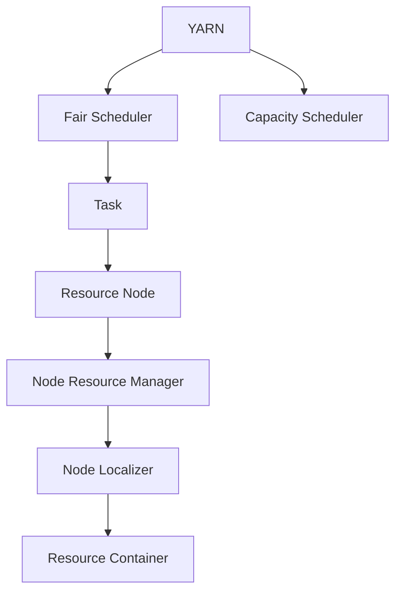
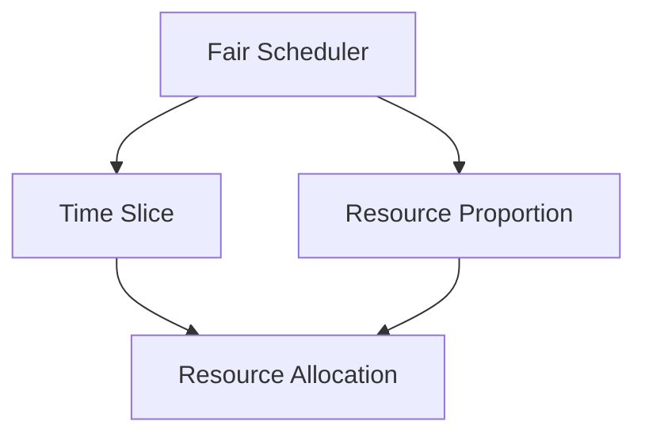
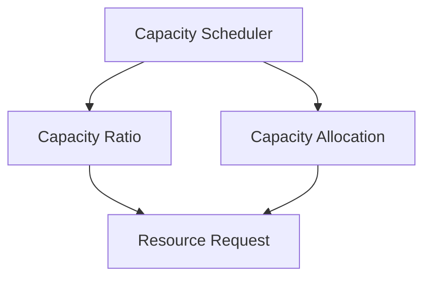

                 

# YARN Fair Scheduler原理与代码实例讲解

> 关键词：YARN, Fair Scheduler, 资源调度, Hadoop, HDFS, MapReduce, 容量感知, 动态扩展, 多租户公平性

## 1. 背景介绍

### 1.1 问题由来
在Hadoop生态系统中，YARN（Yet Another Resource Negotiator）作为资源管理调度系统，在集群资源管理和任务调度上扮演着核心角色。YARN的资源调度算法直接影响着集群整体性能和作业执行效率。特别是对于大型的、多用户共享的集群，如何实现公平、高效、可靠的资源分配，成为了一个重大挑战。

为了应对这一挑战，Hadoop 2.0引入了Fair Scheduler算法，旨在通过更智能、更灵活的调度策略，提升资源利用率，实现作业的公平执行。Fair Scheduler不仅支持单节点和多节点集群，还具备动态扩展能力，适合处理大量的任务提交和数据量波动。

### 1.2 问题核心关键点
Fair Scheduler的核心在于对资源请求的合理分配，保证每个用户作业在集群中的公平性。其关键点包括：
- 优先级划分：根据作业的资源需求和历史执行情况，为每个作业分配优先级。
- 资源分配：通过动态调整队列和节点的分配权重，使得资源在各个作业间公平分配。
- 动态平衡：根据资源需求和集群状态，动态调整资源分配策略，避免集群过载或资源浪费。
- 多租户支持：针对不同的用户或租户，提供隔离和独立调度的功能，保证作业执行的独立性和公平性。

### 1.3 问题研究意义
研究YARN Fair Scheduler的原理和实现方式，对于提升Hadoop集群资源利用效率，保障作业公平性，优化集群架构，具有重要意义：

1. 提高集群资源利用率。通过合理的资源分配策略，提升集群整体的资源利用效率，减少资源浪费。
2. 保障作业公平性。实现作业间的公平调度，保证每个用户作业的执行时间公平，提升用户体验。
3. 优化集群架构。Fair Scheduler的灵活配置和动态扩展能力，可以适应不同的集群规模和应用需求。
4. 增强多租户支持。通过多租户隔离和独立调度，可以满足不同用户或租户的特定需求，提升集群资源的灵活性。
5. 提高系统稳定性。通过更智能的资源分配和调度策略，减少作业竞争和冲突，提升系统的稳定性和可靠性。

## 2. 核心概念与联系

### 2.1 核心概念概述

为了更好地理解YARN Fair Scheduler的工作原理，本节将介绍几个密切相关的核心概念：

- YARN：Hadoop 2.0引入的资源管理调度系统，通过分布式任务调度器（Distributed Task Scheduler，DTS）进行资源分配和任务调度。
- Fair Scheduler：YARN内置的资源调度算法，基于时间片轮转和资源比例分配的策略，实现公平、动态的资源管理。
- Capacity Scheduler：YARN内置的另一个资源调度算法，主要支持容量感知和动态扩展，适合处理数据量波动较大的集群。
- Task：指MapReduce作业中的每个并行执行的任务，由任务类型、资源需求、优先级等信息组成。
- Resource Node：集群中的每个节点，负责处理和调度具体的任务执行。
- Node Resource Manager：每个节点的资源管理器，负责接收和处理资源请求，并根据调度策略进行资源分配。
- Node Localizer：在任务分配过程中，根据节点的可用资源和任务需求，进行资源匹配和分配。
- Resource Container：任务实际执行的环境，包含CPU、内存、磁盘等资源配置。

这些核心概念之间的逻辑关系可以通过以下Mermaid流程图来展示：



这个流程图展示了大语言模型的核心概念及其之间的关系：

1. YARN作为资源管理调度系统，内部包含Fair Scheduler和Capacity Scheduler两种调度算法。
2. Fair Scheduler负责任务的公平调度，Capacity Scheduler负责容量感知和动态扩展。
3. 任务通过Node Localizer进行资源匹配，最终在Node Resource Manager上执行。
4. 每个任务在节点上执行时，会创建一个包含具体资源配置的Resource Container。

### 2.2 概念间的关系

这些核心概念之间存在着紧密的联系，形成了YARN Fair Scheduler的完整调度生态系统。下面我通过几个Mermaid流程图来展示这些概念之间的关系。

#### 2.2.1 YARN的资源调度流程


这个流程图展示了YARN的资源调度流程：

1. Resource Manager接收集群资源信息，并将任务调度给Task Scheduler。
2. Task Scheduler将任务调度给Node Resource Manager，并启动Node Localizer进行资源匹配。
3. Node Localizer将任务分配给Node Resource Manager，并进行容量感知。
4. Node Resource Manager将任务分配给具体的Resource Node，并调用Resource Allocator进行资源分配。
5. Resource Allocator调用Capacity Scheduler进行容量感知，并根据Fair Scheduler的调度策略进行资源分配。
6. Fair Scheduler负责任务的公平调度，确保每个任务获得其所需资源的公平分配。

#### 2.2.2 Fair Scheduler的调度策略



这个流程图展示了Fair Scheduler的调度策略：

1. Fair Scheduler通过Time Slice和Resource Proportion进行调度。
2. Time Slice负责按照时间片轮转的策略分配资源，确保每个任务的执行时间公平。
3. Resource Proportion负责根据任务的需求和历史执行情况，分配比例资源，保证每个任务的资源需求得到满足。

#### 2.2.3 Capacity Scheduler的调度策略



这个流程图展示了Capacity Scheduler的调度策略：

1. Capacity Scheduler通过Capacity Ratio和Capacity Allocation进行调度。
2. Capacity Ratio负责根据任务的资源需求和历史执行情况，分配比例资源，确保资源在集群中合理分配。
3. Capacity Allocation负责根据节点的资源状态和任务需求，动态调整资源分配，确保集群资源利用效率。

### 2.3 核心概念的整体架构

最后，我们用一个综合的流程图来展示这些核心概念在大语言模型微调过程中的整体架构：

```mermaid
graph TB
    A[Resource Manager] --> B[Task Scheduler]
    B --> C[Task Planner]
    C --> D[Task Planner]
    D --> E[Task Planner]
    E --> F[Resource Allocator]
    F --> G[Resource Node]
    G --> H[Task Planner]
    H --> I[Task Planner]
    I --> J[Task Planner]
    J --> K[Task Planner]
    K --> L[Resource Allocator]
    L --> M[Capacity Scheduler]
    M --> N[Fair Scheduler]
    N --> O[Resource Node]
    O --> P[Resource Allocator]
    P --> Q[Task Planner]
    Q --> R[Task Planner]
    R --> S[Resource Allocator]
    S --> T[Resource Node]
    T --> U[Resource Allocator]
    U --> V[Capacity Scheduler]
    V --> W[Resource Node]
    W --> X[Task Planner]
    X --> Y[Task Planner]
    Y --> Z[Resource Allocator]
    Z --> AA[Resource Node]
    AA --> BB[Resource Allocator]
    BB --> CC[Capacity Scheduler]
    CC --> DD[Fair Scheduler]
    DD --> EE[Resource Node]
    EE --> FF[Resource Allocator]
    FF --> GG[Task Planner]
    GG --> HH[Task Planner]
    HH --> II[Resource Allocator]
    II --> JJ[Resource Node]
    JJ --> KK[Task Planner]
    KK --> LL[Task Planner]
    LL --> MM[Resource Allocator]
    MM --> NN[Resource Node]
    NN --> oo[Resource Allocator]
    oo --> pp[Capacity Scheduler]
    pp --> qq[Fair Scheduler]
    qq --> rr[Resource Node]
    rr --> ss[Resource Allocator]
    ss --> tt[Task Planner]
    tt --> uu[Task Planner]
    uu --> vv[Resource Allocator]
    vv --> ww[Resource Node]
    ww --> xx[Task Planner]
    xx --> yy[Task Planner]
    yy --> zz[Resource Allocator]
    zz --> AAA[Resource Node]
    AAA --> BAA[Resource Allocator]
    BAA --> CAA[Capacity Scheduler]
    CAA --> DAA[Fair Scheduler]
    DAA --> EAA[Resource Node]
    EAA --> FAA[Resource Allocator]
    FAA --> GAA[Task Planner]
    GAA --> HAA[Task Planner]
    HAA --> IAA[Resource Allocator]
    IAA --> JAA[Resource Node]
    JAA --> KAA[Task Planner]
    KAA --> LAA[Task Planner]
    LAA --> MAA[Resource Allocator]
    MAA --> NAA[Resource Node]
    NAA --> OAA[Task Planner]
    OAA --> PAA[Task Planner]
    PAA --> QAA[Resource Allocator]
    QAA --> RAA[Resource Node]
    RAA --> SAA[Task Planner]
    SAA --> TAA[Task Planner]
    TAA --> UAA[Resource Allocator]
    UAA --> VAA[Resource Node]
    VAA --> WAA[Task Planner]
    WAA --> XAA[Task Planner]
    XAA --> YAA[Resource Allocator]
    YAA --> ZAA[Resource Node]
    ZAA --> AAB[Resource Allocator]
    AAB --> BAB[Capacity Scheduler]
    BAB --> CAB[Fair Scheduler]
    CAB --> DAB[Resource Node]
    DAB --> EAB[Resource Allocator]
    EAB --> FAB[Task Planner]
    FAB --> GAB[Task Planner]
    GAB --> HAB[Resource Allocator]
    HAB --> IAB[Resource Node]
    IAB --> JAB[Task Planner]
    JAB --> KAB[Task Planner]
    KAB --> Lab[Resource Allocator]
    Lab --> MAB[Resource Node]
    MAB --> NAB[Task Planner]
    NAB --> OAB[Task Planner]
    OAB --> PAB[Resource Allocator]
    PAB --> QAB[Resource Node]
    QAB --> RAB[Task Planner]
    RAB --> SAB[Task Planner]
    SAB --> Tab[Resource Allocator]
    Tab --> UAB[Resource Node]
    UAB --> VAB[Task Planner]
    VAB --> WAB[Task Planner]
    WAB --> XAB[Resource Allocator]
    XAB --> YAB[Resource Node]
    YAB --> ZAB[Task Planner]
    ZAB --> ABB[Task Planner]
    ABB --> BBB[Resource Allocator]
    BBB --> CBB[Capacity Scheduler]
    CBB --> DBB[Fair Scheduler]
    DBB --> EBB[Resource Node]
    EBB --> FBB[Resource Allocator]
    FBB --> GBB[Task Planner]
    GBB --> HBB[Task Planner]
    HBB --> IBB[Resource Allocator]
    IBB --> JBB[Resource Node]
    JBB --> KBB[Task Planner]
    KBB --> LBB[Task Planner]
    LBB --> MBB[Resource Allocator]
    MBB --> NBB[Resource Node]
    NBB --> OBB[Task Planner]
    OBB --> PBB[Task Planner]
    PBB --> QBB[Resource Allocator]
    QBB --> RBB[Resource Node]
    RBB --> SBB[Task Planner]
    SBB --> TBB[Task Planner]
    TBB --> UBB[Resource Allocator]
    UBB --> VBB[Resource Node]
    VBB --> WBB[Task Planner]
    WBB --> XBB[Task Planner]
    XBB --> YBB[Resource Allocator]
    YBB --> ZBB[Resource Node]
    ZBB --> AB[Resource Allocator]
    AB --> BC[Capacity Scheduler]
    BC --> DC[Fair Scheduler]
    DC --> EB[Resource Node]
    EB --> FC[Resource Allocator]
    FC --> GB[Task Planner]
    GB --> HB[Task Planner]
    HB --> IB[Resource Allocator]
    IB --> JB[Resource Node]
    JB --> KB[Task Planner]
    KB --> LB[Task Planner]
    LB --> MB[Resource Allocator]
    MB --> NB[Resource Node]
    NB --> OB[Task Planner]
    OB --> PB[Task Planner]
    PB --> QB[Resource Allocator]
    QB --> RB[Resource Node]
    RB --> SB[Task Planner]
    SB --> TB[Task Planner]
    TB --> UB[Resource Allocator]
    UB --> VB[Resource Node]
    VB --> WB[Task Planner]
    WB --> XB[Task Planner]
    XB --> YB[Resource Allocator]
    YB --> ZB[Resource Node]
    ZB --> AC[Resource Allocator]
    AC --> BD[Capacity Scheduler]
    BD --> CE[Fair Scheduler]
    CE --> DF[Resource Node]
    DF --> EF[Resource Allocator]
    EF --> GF[Task Planner]
    GF --> HF[Task Planner]
    HF --> IF[Resource Allocator]
    IF --> JF[Resource Node]
    JF --> KF[Task Planner]
    KF --> LF[Task Planner]
    LF --> MF[Resource Allocator]
    MF --> NF[Resource Node]
    NF --> OF[Task Planner]
    OF --> PF[Task Planner]
    PF --> QF[Resource Allocator]
    QF --> RF[Resource Node]
    RF --> SF[Task Planner]
    SF --> TF[Task Planner]
    TF --> UF[Resource Allocator]
    UF --> VF[Resource Node]
    VF --> WF[Task Planner]
    WF --> XF[Task Planner]
    XF --> YF[Resource Allocator]
    YF --> ZF[Resource Node]
    ZF --> AG[Resource Allocator]
    AG --> BH[Capacity Scheduler]
    BH --> CH[Fair Scheduler]
    CH --> D[Resource Node]
    D --> EH[Resource Allocator]
    EH --> FH[Task Planner]
    FH --> GH[Task Planner]
    GH --> IH[Resource Allocator]
    IH --> JH[Resource Node]
    JH --> KH[Task Planner]
    KH --> LH[Task Planner]
    LH --> MH[Resource Allocator]
    MH --> NH[Resource Node]
    NH --> OH[Task Planner]
    OH --> PH[Task Planner]
    PH --> QH[Resource Allocator]
    QH --> RH[Resource Node]
    RH --> SH[Task Planner]
    SH --> TH[Task Planner]
    TH --> UH[Resource Allocator]
    UH --> VH[Resource Node]
    VH --> WH[Task Planner]
    WH --> XH[Task Planner]
    XH --> YH[Resource Allocator]
    YH --> ZH[Resource Node]
    ZH --> AI[Resource Allocator]
    AI --> BJ[Capacity Scheduler]
    BJ --> CJ[Fair Scheduler]
    CJ --> DK[Resource Node]
    DK --> EL[Resource Allocator]
    EL --> FL[Task Planner]
    FL --> GL[Task Planner]
    GL --> HL[Resource Allocator]
    HL --> IL[Resource Node]
    IL --> JL[Task Planner]
    JL --> KL[Task Planner]
    KL --> ML[Resource Allocator]
    ML --> NL[Resource Node]
    NL --> OL[Task Planner]
    OL --> PL[Task Planner]
    PL --> QL[Resource Allocator]
    QL --> RL[Resource Node]
    RL --> SL[Task Planner]
    SL --> TL[Task Planner]
    TL --> UL[Resource Allocator]
    UL --> VL[Resource Node]
    VL --> WL[Task Planner]
    WL --> XL[Task Planner]
    XL --> YL[Resource Allocator]
    YL --> ZL[Resource Node]
    ZL --> A[Resource Allocator]
    A --> BM[Capacity Scheduler]
    BM --> CM[Fair Scheduler]
    CM --> D[Resource Node]
    D --> EM[Resource Allocator]
    EM --> FM[Task Planner]
    FM --> GM[Task Planner]
    GM --> HM[Resource Allocator]
    HM --> IM[Resource Node]
    IM --> JM[Task Planner]
    JM --> KM[Task Planner]
    KM --> LM[Resource Allocator]
    LM --> NM[Resource Node]
    NM --> OM[Task Planner]
    OM --> PM[Task Planner]
    PM --> QM[Resource Allocator]
    QM --> RM[Resource Node]
    RM --> SM[Task Planner]
    SM --> TM[Task Planner]
    TM --> UM[Resource Allocator]
    UM --> VM[Resource Node]
    VM --> WM[Task Planner]
    WM --> XM[Task Planner]
    XM --> YM[Resource Allocator]
    YM --> ZM[Resource Node]
    ZM --> AN[Resource Allocator]
    AN --> BO[Capacity Scheduler]
    BO --> CO[Fair Scheduler]
    CO --> DO[Resource Node]
    DO --> EO[Resource Allocator]
    EO --> FO[Task Planner]
    FO --> GO[Task Planner]
    GO --> HO[Resource Allocator]
    HO --> IO[Resource Node]
    IO --> JO[Task Planner]
    JO --> KO[Task Planner]
    KO --> LO[Resource Allocator]
    LO --> NO[Resource Node]
    NO --> OO[Task Planner]
    OO --> PO[Task Planner]
    PO --> QO[Resource Allocator]
    QO --> RO[Resource Node]
    RO --> SO[Task Planner]
    SO --> TO[Task Planner]
    TO --> UO[Resource Allocator]
    UO --> VO[Resource Node]
    VO --> WO[Task Planner]
    WO --> XO[Task Planner]
    XO --> YO[Resource Allocator]
    YO --> ZO[Resource Node]
    ZO --> A[Resource Allocator]
    A --> BP[Capacity Scheduler]
    BP --> CP[Fair Scheduler]
    CP --> D[Resource Node]
    D --> EP[Resource Allocator]
    EP --> FP[Task Planner]
    FP --> GP[Task Planner]
    GP --> HP[Resource Allocator]
    HP --> IP[Resource Node]
    IP --> JP[Task Planner]
    JP --> KP[Task Planner]
    KP --> LP[Resource Allocator]
    LP --> NP[Resource Node]
    NP --> OP[Task Planner]
    OP --> PQ[Task Planner]
    PQ --> RQ[Resource Allocator]
    RQ --> SQ[Resource Node]
    SQ --> TQ[Task Planner]
    TQ --> UQ[Task Planner]
    UQ --> VQ[Resource Allocator]
    VQ --> WQ[Resource Node]
    WQ --> XQ[Task Planner]
    XQ --> YQ[Task Planner]
    YQ --> ZQ[Resource Allocator]
    ZQ --> AB[Resource Allocator]
    AB --> BC[Capacity Scheduler]
    BC --> CD[Fair Scheduler]
    CD --> DE[Resource Node]
    DE --> EF[Resource Allocator]
    EF --> GF[Task Planner]
    GF --> HF[Task Planner]
    HF --> IF[Resource Allocator]
    IF --> JF[Resource Node]
    JF --> KF[Task Planner]
    KF --> LF[Task Planner]
    LF --> MF[Resource Allocator]
    MF --> NF[Resource Node]
    NF --> OF[Task Planner]
    OF --> PQ[Task Planner]
    PQ --> RQ[Resource Allocator]
    RQ --> SQ[Resource Node]
    SQ --> TQ[Task Planner]
    TQ --> UQ[Task Planner]
    UQ --> VQ[Resource Allocator]
    VQ --> WQ[Resource Node]
    WQ --> XQ[Task Planner]
    XQ --> YQ[Task Planner]
    YQ --> ZQ[Resource Allocator]
    ZQ --> AB[Resource Allocator]
    AB --> BC[Capacity Scheduler]
    BC --> CD[Fair Scheduler]
    CD --> DE[Resource Node]
    DE --> EF[Resource Allocator]
    EF --> GF[Task Planner]
    GF --> HF[Task Planner]
    HF --> IF[Resource Allocator]
    IF --> JF[Resource Node]
    JF --> KF[Task Planner]
    KF --> LF[Task Planner]
    LF --> MF[Resource Allocator]
    MF --> NF[Resource Node]
    NF --> OF[Task Planner]
    OF --> PQ[Task Planner]
    PQ --> RQ[Resource Allocator]
    RQ --> SQ[Resource Node]
    SQ --> TQ[Task Planner]
    TQ --> UQ[Task Planner]
    UQ --> VQ[Resource Allocator]
    VQ --> WQ[Resource Node]
    WQ --> XQ[Task Planner]
    XQ --> YQ[Task Planner]
    YQ --> ZQ[Resource Allocator]
    ZQ --> AB[Resource Allocator]
    AB --> BC[Capacity Scheduler]
    BC --> CD[Fair Scheduler]
    CD --> DE[Resource Node]
    DE --> EF[Resource Allocator]
    EF --> GF[Task Planner]
    GF --> HF[Task Planner]
    HF --> IF[Resource Allocator]
    IF --> JF[Resource Node]
    JF --> KF[Task Planner]
    KF --> LF[Task Planner]
    LF --> MF[Resource Allocator]
    MF --> NF[Resource Node]
    NF --> OF[Task Planner]
    OF --> PQ[Task Planner]
    PQ --> RQ[Resource Allocator]
    RQ --> SQ[Resource Node]
    SQ --> TQ[Task Planner]
    TQ --> UQ[Task Planner]
    UQ --> VQ[Resource Allocator]
    VQ --> WQ[Resource Node]
    WQ --> XQ[Task Planner]
    XQ --> YQ[Task Planner]
    YQ --> ZQ[Resource Allocator]
    ZQ --> AB[Resource Allocator]
    AB --> BC[Capacity Scheduler]
    BC --> CD[Fair Scheduler]
    CD --> DE[Resource Node]
    DE --> EF[Resource Allocator]
    EF --> GF[Task Planner]
    GF --> HF[Task Planner]
    HF --> IF[Resource Allocator]
    IF --> JF[Resource Node]
    JF --> KF[Task Planner]
    KF --> LF[Task Planner]
    LF --> MF[Resource Allocator]
    MF --> NF[Resource Node]
    NF --> OF[Task Planner]
    OF --> PQ[Task Planner]
    PQ --> RQ[Resource Allocator]
    RQ --> SQ[Resource Node]
    SQ --> TQ[Task Planner]
    TQ --> UQ[Task Planner]
    UQ --> VQ[Resource Allocator]
    VQ --> WQ[Resource Node]
    WQ --> XQ[Task Planner]
    XQ --> YQ[Task Planner]
    YQ --> ZQ[Resource Allocator]
    ZQ --> AB[Resource Allocator]
    AB --> BC[Capacity Scheduler]
    BC --> CD[Fair Scheduler]
    CD --> DE[Resource Node]
    DE --> EF[Resource Allocator]
    EF --> GF[Task Planner]
    GF --> HF[Task Planner]
    HF --> IF[Resource Allocator]
    IF --> JF[Resource Node]
    JF --> KF[Task Planner]
    KF --> LF[Task Planner]
    LF --> MF[Resource Allocator]
    MF --> NF[Resource Node]
    NF --> OF[Task Planner]
    OF --> PQ[Task Planner]
    PQ --> RQ[Resource Allocator]
    RQ --> SQ[Resource Node]
    SQ --> TQ[Task Planner]
    TQ --> UQ[Task Planner]
    UQ --> VQ[Resource Allocator]
    VQ --> WQ[Resource Node]
    WQ --> XQ[Task Planner]
    XQ --> YQ[Task Planner]
    YQ --> ZQ[Resource Allocator]
    ZQ --> AB[Resource Allocator]
    AB --> BC[Capacity Scheduler]
    BC --> CD[Fair Scheduler]
    CD --> DE[Resource Node]
    DE --> EF[Resource Allocator]
    EF --> GF[Task Planner]
    GF --> HF[Task Planner]
    HF --> IF[Resource Allocator]
    IF --> JF[Resource Node]
    JF --> KF[Task Planner]
    KF --> LF[Task Planner]
    LF --> MF[Resource Allocator]
    MF --> NF[Resource Node]
    NF --> OF[Task Planner]
    OF --> PQ[Task Planner]
    PQ --> RQ[Resource Allocator]
    RQ --> SQ[Resource Node]
    SQ --> TQ[Task Planner]
    TQ --> UQ[Task Planner]
    UQ --> VQ[Resource Allocator]
    VQ --> WQ[Resource Node]
    WQ --> XQ[Task Planner]
    XQ --> YQ[Task Planner]
    YQ --> ZQ[Resource Allocator]
    ZQ

