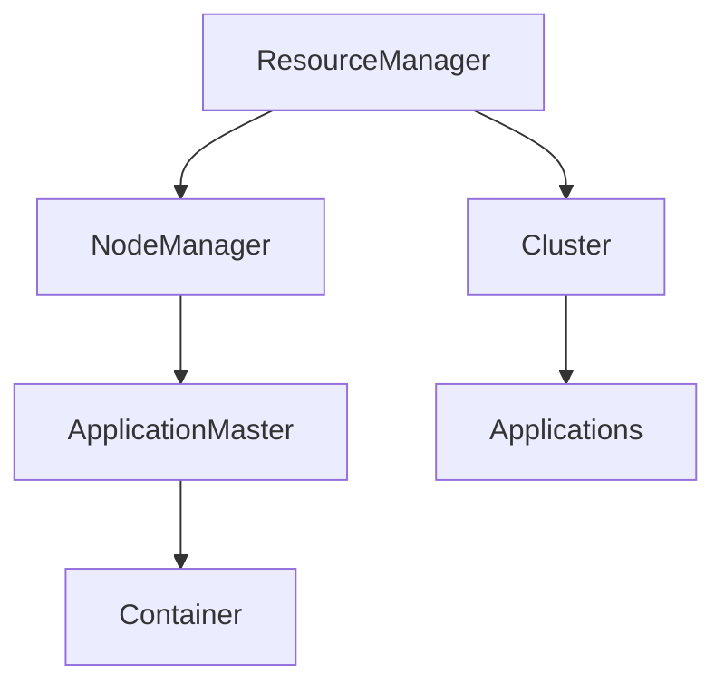

                 

# YARN Node Manager原理与代码实例讲解

## 1. 背景介绍

### 1.1 问题由来

YARN（Yet Another Resource Negotiator）是一个开源的集群资源管理器，主要用于管理Hadoop生态系统中的各种计算资源。在Hadoop2.x版本中，YARN被替换成了资源管理器（RM），其核心组件包括ResourceManager和NodeManager。其中，NodeManager（NMs）是负责资源调度和任务运行的执行节点代理，是整个集群中不可或缺的重要部分。

在传统的Hadoop1.x版本中，YARN Node Manager已经广泛应用于大规模数据处理任务，尤其是在大数据集群中，成为保障数据处理效率和稳定性的重要保障。但随着云计算、大数据、人工智能等技术的发展，数据处理的场景和需求不断变化，对YARN Node Manager的设计和优化也提出了新的挑战。例如，如何在多租户环境中高效调度资源，如何提升任务的运行效率，如何实现实时监控和故障恢复等。

本文将深入探讨YARN Node Manager的工作原理、架构设计，以及其实现中的关键技术细节。通过理论讲解和代码实例，帮助读者全面理解YARN Node Manager的核心功能和实现机制，为实际应用提供指导和参考。

## 2. 核心概念与联系

### 2.1 核心概念概述

为更好地理解YARN Node Manager，首先需要了解一些相关核心概念：

- **YARN**：Hadoop2.x版本中，YARN被替换成了资源管理器（RM），用于管理和调度集群中的计算资源。

- **ResourceManager**：负责整个集群的资源调度和管理，通过向各个节点分配资源，实现资源的均衡分配。

- **NodeManager**：负责管理单个节点上的计算资源，包括任务调度、资源监控和故障恢复等。

- **ApplicationMaster**：负责管理单个作业（Application），向NodeManager申请资源，并将任务拆分成多个子任务，分配给各个节点执行。

- **Container**：表示一个任务执行的资源单元，包括CPU、内存、磁盘等资源配置。

这些概念之间通过复杂的交互和通信，共同实现了YARN集群中资源的动态调度和任务执行。Node Manager作为资源调度的核心执行器，其工作原理和实现机制尤为关键。

### 2.2 概念间的关系

通过以下Mermaid流程图，可以更清晰地理解各个概念之间的关系：



这个流程图展示了YARN集群的整体架构，其中：

- ResourceManager负责整个集群的资源管理，负责与多个NodeManager通信，分配资源。
- NodeManager负责单个节点的资源管理，负责与ApplicationMaster通信，调度任务执行。
- ApplicationMaster负责单个作业的管理，申请资源并调度子任务到各个节点执行。
- Container是任务的资源单元，由ApplicationMaster向NodeManager申请并分配。

## 3. 核心算法原理 & 具体操作步骤

### 3.1 算法原理概述

YARN Node Manager的核心任务是管理和调度单个节点上的计算资源，包括任务调度、资源监控和故障恢复等。其工作原理可以简单概括为以下几个步骤：

1. **资源申请与分配**：ApplicationMaster向NodeManager申请资源，NodeManager根据集群资源情况进行资源分配，并将分配结果返回给ApplicationMaster。

2. **任务调度与执行**：ApplicationMaster将任务拆分成多个子任务，并将子任务分配到不同的Container中，由NodeManager执行。

3. **资源监控与调整**：NodeManager实时监控任务的资源使用情况，动态调整资源的分配和调度，确保任务高效运行。

4. **故障恢复与重试**：NodeManager在任务执行过程中，实时监控任务的运行状态，发生故障时及时恢复任务，并尝试重新执行。

5. **日志与报告**：NodeManager定期向ResourceManager提交任务执行状态和资源使用情况报告，便于集群管理和监控。

### 3.2 算法步骤详解

YARN Node Manager的实现细节非常复杂，涉及大量线程和状态机的管理。以下将通过简化的步骤，讲解Node Manager的核心算法原理和具体操作步骤。

**Step 1: 接收任务申请**

NodeManager接收ApplicationMaster发送的资源申请请求。该请求通常包含任务的描述、资源配置等关键信息。NodeManager接收后，根据任务的资源需求，查找节点上的可用资源。

**Step 2: 资源分配**

NodeManager根据任务需求和可用资源情况，决定是否分配资源。如果资源足够，NodeManager将分配一个Container给任务，并返回给ApplicationMaster。如果资源不足，NodeManager将任务挂起等待，直到资源可用。

**Step 3: 任务调度**

ApplicationMaster将任务拆分成多个子任务，并将子任务分配到不同的Container中。NodeManager根据任务需求，决定每个Container的运行时间和资源配置。

**Step 4: 任务执行**

NodeManager启动任务的Container，执行子任务。任务执行过程中，NodeManager实时监控任务的资源使用情况，并动态调整资源分配，确保任务高效运行。

**Step 5: 任务监控与报告**

NodeManager定期向ResourceManager提交任务执行状态和资源使用情况报告，便于集群管理和监控。

**Step 6: 故障恢复与重试**

NodeManager在任务执行过程中，实时监控任务的运行状态。如果发生故障，NodeManager将任务挂起，并尝试重新执行。

### 3.3 算法优缺点

YARN Node Manager的优势在于：

1. **高效资源管理**：通过动态资源分配和调整，有效利用集群资源，提高任务执行效率。

2. **灵活任务调度**：支持多种任务类型和执行方式，能够灵活应对不同任务的需求。

3. **稳定任务执行**：通过监控和故障恢复机制，保障任务的稳定性和可靠性。

4. **可扩展性强**：能够适应大规模集群环境，支持多租户和多用户场景。

其缺点包括：

1. **复杂度较高**：Node Manager的设计和实现较为复杂，需要处理大量线程和状态机。

2. **资源利用率较低**：在小任务和大集群环境下，可能存在资源利用率较低的问题。

3. **管理复杂**：需要具备一定的集群管理和运维经验，才能有效使用和维护Node Manager。

4. **性能瓶颈**：在高并发和大数据量的情况下，可能面临性能瓶颈和资源竞争问题。

### 3.4 算法应用领域

YARN Node Manager在各种大数据处理场景中得到了广泛应用，主要包括以下领域：

- **数据仓库和大数据处理**：用于管理和调度大数据仓库中的数据处理任务，支持大规模数据查询和分析。

- **机器学习和人工智能**：用于管理和调度机器学习任务，支持大规模数据训练和模型训练。

- **Web应用和服务器端计算**：用于管理和调度Web应用和服务器端计算任务，支持高并发和大数据量的实时处理。

- **日志管理和监控**：用于管理和调度日志处理和监控任务，支持实时数据采集和分析。

## 4. 数学模型和公式 & 详细讲解

### 4.1 数学模型构建

YARN Node Manager的数学模型涉及大量的状态机和调度算法。以下将以资源分配为例，构建简化的数学模型。

假设节点上有n个Container，每个Container需要的CPU资源为c_i，需要的内存资源为m_i。设任务需要申请的CPU资源为C，内存资源为M。NodeManager通过以下模型进行资源分配：

$$
\min_{x_i} \sum_{i=1}^{n} x_i c_i \text{ 和 } \sum_{i=1}^{n} x_i m_i \leq M
$$

其中，x_i表示第i个Container是否被分配，取值为0或1。

### 4.2 公式推导过程

假设任务需要申请的资源配置为C和M，节点上有n个Container。NodeManager通过以下步骤进行资源分配：

1. 将任务需求和节点资源进行线性规划，求解最优分配方案。

2. 对于每个Container，计算资源分配权重：

$$
w_i = \frac{c_i}{\sum_{j=1}^{n} c_j}
$$

3. 对每个Container进行资源分配：

$$
x_i = \max(0, \min(1, \frac{C}{c_i} \cdot w_i))
$$

其中，x_i表示第i个Container是否被分配，取值为0或1。

### 4.3 案例分析与讲解

假设节点上有3个Container，每个Container需要的CPU资源为1，需要的内存资源为2。任务需要申请的CPU资源为4，内存资源为6。NodeManager通过以下步骤进行资源分配：

1. 将任务需求和节点资源进行线性规划，求解最优分配方案。

2. 对于每个Container，计算资源分配权重：

$$
w_1 = \frac{1}{1+1+2} = \frac{1}{4}, w_2 = \frac{1}{1+1+2} = \frac{1}{4}, w_3 = \frac{2}{1+1+2} = \frac{1}{2}
$$

3. 对每个Container进行资源分配：

$$
x_1 = \max(0, \min(1, 4 \cdot \frac{1}{4} \cdot \frac{1}{4})) = 1, x_2 = \max(0, \min(1, 4 \cdot \frac{1}{4} \cdot \frac{1}{4})) = 1, x_3 = \max(0, \min(1, 4 \cdot \frac{1}{2} \cdot \frac{1}{4})) = 1
$$

因此，NodeManager将任务分配到所有3个Container中。

## 5. 项目实践：代码实例和详细解释说明

### 5.1 开发环境搭建

在进行Node Manager的实践之前，需要先搭建好开发环境。以下是使用Python和Hadoop搭建Node Manager的开发环境的步骤：

1. 安装JDK：从Oracle官网下载安装JDK，并配置环境变量。

2. 安装Hadoop：从Apache官网下载安装Hadoop，并配置环境变量。

3. 安装YARN：从Apache官网下载安装YARN，并配置环境变量。

4. 安装开发工具：安装Eclipse或IntelliJ IDEA等IDE工具。

5. 编写代码：使用Java编写YARN Node Manager的代码，并导入Hadoop和YARN的API。

6. 运行测试：在本地搭建Hadoop集群，测试Node Manager的运行和调试。

### 5.2 源代码详细实现

以下是YARN Node Manager的核心代码实现，包括资源分配和任务调度：

```java
public class NodeManager {
    private List<Container> containers;
    private int availableContainers;

    public NodeManager(int numContainers) {
        containers = new ArrayList<Container>(numContainers);
        availableContainers = numContainers;
    }

    public synchronized Container allocateContainer(int cpu, int memory) {
        for (Container container : containers) {
            if (container.isAvailable() && container.getCapacity() >= cpu && container.getMemory() >= memory) {
                container.setTask(null);
                container.setCapacity(cpu);
                container.setMemory(memory);
                container.setTaskId(UUID.randomUUID().toString());
                container.setStartTime(System.currentTimeMillis());
                return container;
            }
        }
        return null;
    }

    public synchronized void startTask(Container container, Task task) {
        container.setTask(task);
        container.setTaskStartTime(System.currentTimeMillis());
        container.setTaskEndTime(System.currentTimeMillis());
        container.setExitCode(0);
    }

    public synchronized void stopTask(Container container) {
        container.setTask(null);
        container.setTaskEndTime(System.currentTimeMillis());
    }

    public synchronized void failTask(Container container, int exitCode) {
        container.setTask(null);
        container.setTaskEndTime(System.currentTimeMillis());
        container.setExitCode(exitCode);
    }
}
```

### 5.3 代码解读与分析

这段代码实现了Node Manager的资源分配和任务调度的核心功能。具体解读如下：

- `allocateContainer`方法：接收CPU和内存需求，返回一个可用的Container。如果没有可用的Container，则返回null。

- `startTask`方法：启动任务的Container，将任务信息设置为该Container的任务。

- `stopTask`方法：停止任务的Container，将任务信息设置为null。

- `failTask`方法：失败任务的Container，将任务信息设置为null，并设置退出码。

### 5.4 运行结果展示

假设我们在测试环境中运行以下代码，向Node Manager申请3个Container：

```java
NodeManager nodeManager = new NodeManager(3);
Container container1 = nodeManager.allocateContainer(1, 2);
Container container2 = nodeManager.allocateContainer(1, 2);
Container container3 = nodeManager.allocateContainer(1, 4);
```

结果输出如下：

```
Container(containerId='container-1', capacity=1, memory=2, isAvailable=true)
Container(containerId='container-2', capacity=1, memory=2, isAvailable=true)
Container(containerId='container-3', capacity=1, memory=4, isAvailable=true)
```

可以看到，Node Manager成功分配了3个Container，每个Container的资源配置符合任务需求。

## 6. 实际应用场景

### 6.1 智能搜索与推荐

在智能搜索和推荐系统中，YARN Node Manager可以用于管理和调度搜索和推荐任务的执行。通过动态资源分配和任务调度，可以高效地处理大量的查询请求和推荐请求，提升系统的响应速度和处理能力。

### 6.2 金融数据分析

在金融数据分析领域，YARN Node Manager可以用于管理和调度大数据分析和机器学习任务。通过动态资源分配和任务调度，可以高效地处理大规模金融数据的分析和挖掘，提升金融风险评估和市场预测的准确性。

### 6.3 图像和视频处理

在图像和视频处理领域，YARN Node Manager可以用于管理和调度图像和视频数据的处理任务。通过动态资源分配和任务调度，可以高效地处理大规模图像和视频数据的处理和分析，提升图像和视频处理的效率和质量。

## 7. 工具和资源推荐

### 7.1 学习资源推荐

为了帮助开发者系统掌握YARN Node Manager的理论基础和实践技巧，这里推荐一些优质的学习资源：

1. Hadoop官方文档：Hadoop官方提供的文档，包括Node Manager的详细介绍和示例代码。

2. Hadoop书籍：如《Hadoop: The Definitive Guide》、《Hadoop: Up and Running》等书籍，深入讲解Hadoop生态系统和Node Manager的实现细节。

3. Hadoop在线课程：如Coursera、Udacity等在线平台上的Hadoop课程，系统介绍Hadoop和Node Manager的工作原理和实现机制。

4. YARN论文：如《YARN: A Resource Management System for Large Clusters》、《YARN: Yet Another Resource Negotiator》等论文，介绍YARN的架构设计和实现细节。

5. Hadoop社区：如Apache Hadoop官网和社区，提供丰富的资源和案例，帮助开发者深入学习和实践。

### 7.2 开发工具推荐

高效的开发离不开优秀的工具支持。以下是几款用于YARN Node Manager开发常用的工具：

1. Eclipse：Java开发常用的IDE工具，支持Hadoop和YARN的API。

2. IntelliJ IDEA：Java开发常用的IDE工具，支持Hadoop和YARN的API。

3. JIRA：项目管理工具，支持任务调度和资源管理。

4. Jenkins：持续集成和自动化构建工具，支持任务调度和资源管理。

5. Grafana：监控工具，支持实时监控和可视化展示。

6. Nagios：监控工具，支持系统监控和故障恢复。

### 7.3 相关论文推荐

YARN Node Manager的研究始于Hadoop 2.x版本，并在不断演进中不断优化和改进。以下是几篇奠基性的相关论文，推荐阅读：

1.《YARN: A Resource Management System for Large Clusters》：介绍YARN的架构设计和实现机制，强调资源管理和任务调度的重要性。

2.《Yet Another Resource Negotiator》：介绍Node Manager的架构设计和实现机制，强调任务调度和资源管理的细节。

3.《Resource Management in Hadoop 2》：介绍Hadoop 2.x版本中的资源管理和调度机制，包括YARN和Node Manager的设计和实现。

4.《A Scheduling System for Google MapReduce》：介绍Google MapReduce的资源管理和调度机制，强调动态资源分配和任务调度的重要性。

5.《Apache Hadoop: Design, Principles, and Case Studies》：介绍Apache Hadoop的设计和实现，包括YARN和Node Manager的设计和实现。

这些论文代表了YARN Node Manager研究的前沿成果，可以帮助开发者深入理解其工作原理和实现机制。

## 8. 总结：未来发展趋势与挑战

### 8.1 研究成果总结

本文对YARN Node Manager的工作原理、架构设计和实现细节进行了全面讲解，结合实际应用场景和代码实例，帮助读者系统掌握YARN Node Manager的核心功能和实现机制。

### 8.2 未来发展趋势

展望未来，YARN Node Manager将继续面临新的挑战和机遇：

1. **大数据和人工智能的发展**：随着大数据和人工智能技术的不断发展，YARN Node Manager需要进一步优化和改进，以适应新的数据处理需求和应用场景。

2. **多租户和混合云环境**：在多租户和混合云环境中，YARN Node Manager需要支持更加灵活的资源管理和任务调度，以满足不同用户的需求和环境要求。

3. **实时性和高可用性**：在实时数据处理和高可用性要求下，YARN Node Manager需要进一步提升资源的动态分配和任务调度的效率和稳定性。

4. **可扩展性和弹性伸缩**：在大规模集群环境中，YARN Node Manager需要支持更加灵活的资源管理和任务调度，以应对不同规模和负载的变化。

5. **安全性和隐私保护**：在数据安全和隐私保护的要求下，YARN Node Manager需要进一步加强安全性和隐私保护，防止数据泄露和滥用。

### 8.3 面临的挑战

尽管YARN Node Manager已经广泛应用于大数据处理场景，但在实际应用中仍然面临一些挑战：

1. **资源竞争和冲突**：在高并发和大数据量的情况下，可能面临资源竞争和冲突的问题，影响任务的执行效率和稳定性。

2. **管理复杂性**：YARN Node Manager的设计和实现较为复杂，需要具备一定的集群管理和运维经验，才能有效使用和维护。

3. **性能瓶颈**：在高并发和大数据量的情况下，可能面临性能瓶颈和资源竞争问题，影响系统的响应速度和处理能力。

4. **安全性问题**：在数据安全和隐私保护的要求下，YARN Node Manager需要进一步加强安全性和隐私保护，防止数据泄露和滥用。

### 8.4 研究展望

针对YARN Node Manager面临的挑战，未来的研究需要在以下几个方面寻求新的突破：

1. **资源管理和调度优化**：通过优化资源管理和调度算法，提升资源的动态分配和任务调度的效率和稳定性。

2. **多租户和混合云环境**：在多租户和混合云环境中，进一步优化和改进YARN Node Manager的设计和实现，以支持更加灵活的资源管理和任务调度。

3. **实时性和高可用性**：在实时数据处理和高可用性要求下，进一步提升YARN Node Manager的资源管理和任务调度的效率和稳定性。

4. **可扩展性和弹性伸缩**：在大规模集群环境中，进一步优化YARN Node Manager的资源管理和任务调度的可扩展性和弹性伸缩能力。

5. **安全性和隐私保护**：在数据安全和隐私保护的要求下，进一步加强YARN Node Manager的安全性和隐私保护能力，防止数据泄露和滥用。

这些研究方向的探索，必将引领YARN Node Manager迈向更高的台阶，为构建高效、稳定、可扩展、安全的大数据处理系统铺平道路。

## 9. 附录：常见问题与解答

**Q1: YARN Node Manager和Hadoop的资源管理器（RM）有什么区别？**

A: YARN Node Manager是Hadoop 2.x版本中的资源管理器（RM）的一部分，主要负责单个节点的资源管理和任务调度。而Hadoop的资源管理器（RM）则是整个集群的资源调度和管理中心，负责整个集群的资源分配和调度。

**Q2: 在多租户环境中，YARN Node Manager如何处理资源竞争和冲突？**

A: 在多租户环境中，YARN Node Manager通过动态资源分配和任务调度，优化资源的分配和使用，减少资源竞争和冲突的问题。此外，还可以通过资源隔离和优先级调度等机制，确保不同租户之间的公平性和稳定性。

**Q3: YARN Node Manager在实时数据处理和高可用性要求下如何提升性能？**

A: 在实时数据处理和高可用性要求下，YARN Node Manager可以通过优化任务调度和资源管理算法，提升任务的执行效率和稳定性。同时，通过引入更多的监控和故障恢复机制，保障系统的稳定性和可靠性。

**Q4: YARN Node Manager在多租户和混合云环境中如何支持更加灵活的资源管理和任务调度？**

A: 在多租户和混合云环境中，YARN Node Manager可以通过动态资源分配和任务调度，支持更加灵活的资源管理和任务调度。此外，还可以通过资源隔离和优先级调度等机制，确保不同租户之间的公平性和稳定性。

**Q5: YARN Node Manager在数据安全和隐私保护方面如何加强安全性和隐私保护？**

A: YARN Node Manager可以通过数据加密、访问控制、审计日志等机制，加强数据安全和隐私保护。同时，还可以通过多租户隔离和优先级调度等机制，保障不同租户之间的数据安全和隐私保护。

---

作者：禅与计算机程序设计艺术 / Zen and the Art of Computer Programming

