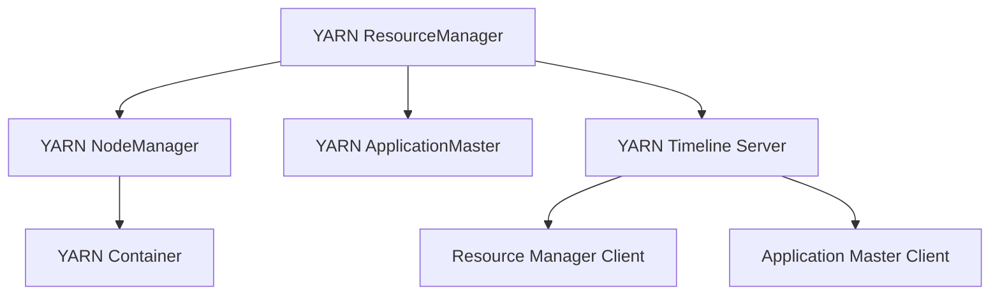
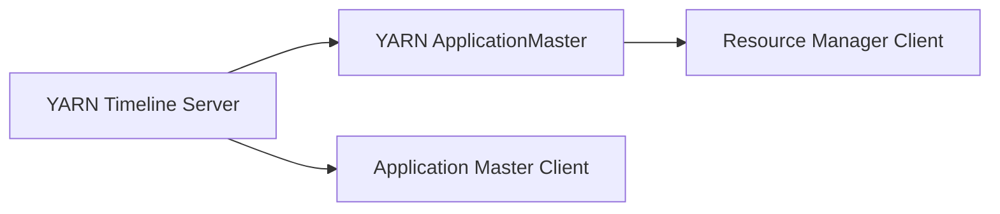
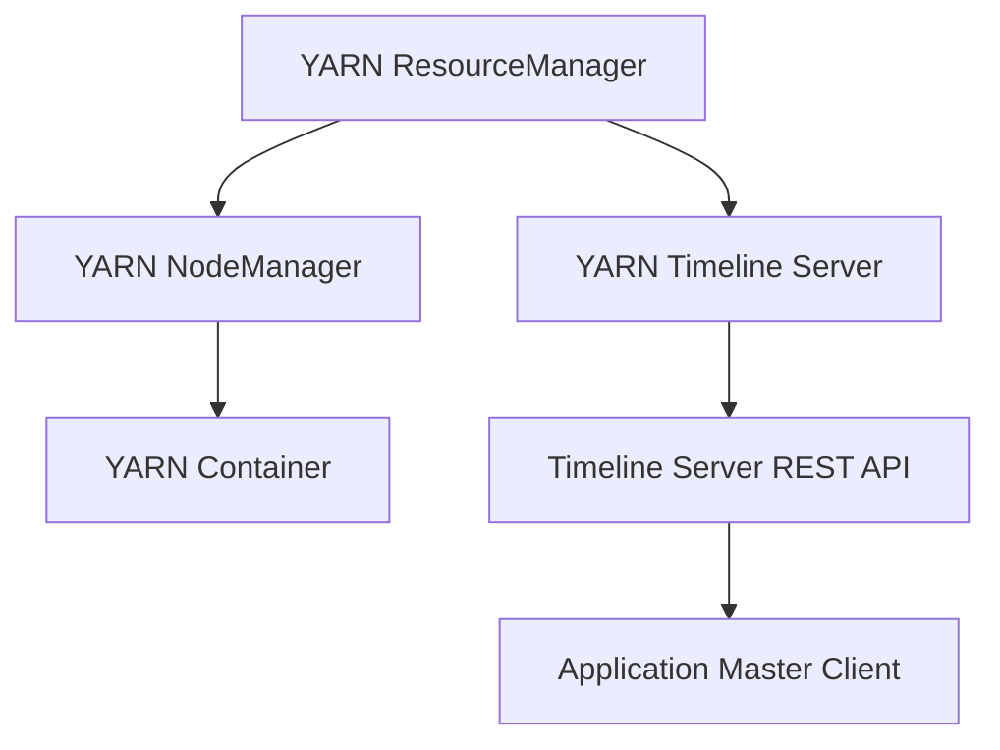
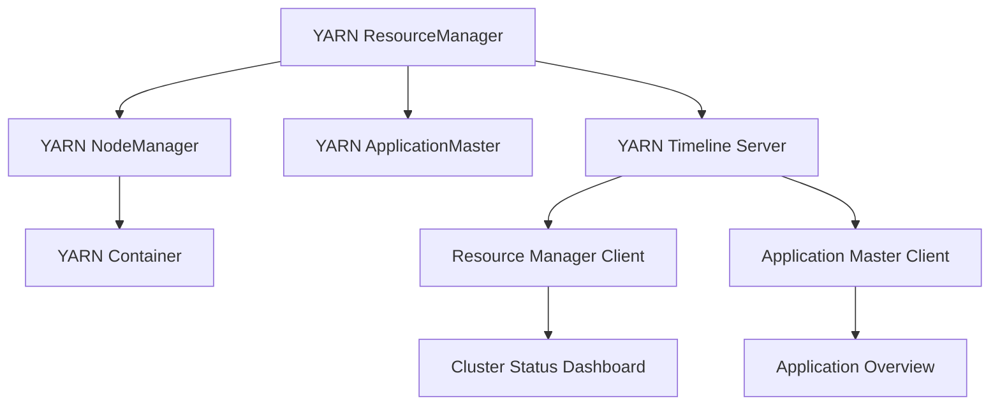

                 

# YARN Timeline Server原理与代码实例讲解

## 1. 背景介绍

### 1.1 问题由来

Hadoop YARN（Yet Another Resource Negotiator）是Apache Hadoop项目的一部分，是Hadoop生态系统中核心组件之一。YARN负责集群资源管理，提供作业调度和资源分配功能。然而，YARN的资源使用情况及作业执行历史对开发者和运维人员来说却一直是一个盲点。为了解决这个问题，Apache Hadoop社区引入了TimeLine Server，使得资源和作业调度信息对用户可见，提供了实时的集群状态信息，增强了系统的可观测性和可理解性。

### 1.2 问题核心关键点

YARN Timeline Server的引入旨在解决以下几个核心问题：

- **资源使用透明度**：YARN资源使用情况（如CPU、内存、磁盘I/O等）对用户和管理员来说是一个黑盒，使得集群资源利用率无法有效监控。 Timeline Server记录并公开这些信息，帮助用户了解资源使用情况。

- **作业执行历史记录**：YARN作业在运行过程中，用户无法实时了解其执行状态，导致问题定位困难。 Timeline Server记录了作业启动、运行及结束的详细信息，提供了作业执行历史。

- **集群健康状况**：集群资源分配、任务调度等操作需要持续监控，以确保集群健康稳定。 Timeline Server提供了实时的集群状态信息，帮助用户快速识别和处理集群异常。

### 1.3 问题研究意义

YARN Timeline Server通过记录和公开资源使用及作业执行信息，极大提升了集群的管理和监控能力。其意义如下：

- **提高资源利用率**：用户和管理员可以实时了解集群资源使用情况，优化资源配置，提高资源利用率。

- **提升作业调度效率**：通过观察作业执行历史记录，用户可以更好地预测作业运行状态，优化调度策略，提升作业完成效率。

- **增强集群可靠性**：通过实时监控集群状态，用户可以及时发现并处理集群异常，保障集群稳定运行。

## 2. 核心概念与联系

### 2.1 核心概念概述

为更好地理解YARN Timeline Server的核心概念和架构，本节将介绍几个密切相关的核心概念：

- **YARN（Yet Another Resource Negotiator）**：Apache Hadoop的资源管理器，负责集群资源分配和调度，支持不同类型的应用（如MapReduce、Spark、Storm等）。

- **Timeline Server**：YARN集群中记录和公开资源使用及作业执行信息的组件，通过Restful API提供数据查询和展示。

- **YARN ResourceManager**：负责集群资源分配、调度和管理，向用户提供集群资源视图和调度接口。

- **YARN NodeManager**：负责集群节点资源的监控和管理，将集群状态及资源使用情况上报给ResourceManager。

- **YARN Container**：应用程序的执行单元，包含应用程序的代码和依赖库，由NodeManager管理。

- **YARN ApplicationMaster**：负责作业任务的启动、监控和管理，向ResourceManager注册作业进度。

这些核心概念之间的逻辑关系可以通过以下Mermaid流程图来展示：



这个流程图展示了一个典型的YARN集群架构及其组件关系。YARN ResourceManager负责集群资源分配，YARN NodeManager负责节点资源监控和管理，YARN Container是应用程序的执行单元，YARN ApplicationMaster负责作业任务的启动和管理，而YARN Timeline Server记录并公开资源使用及作业执行信息，供用户查询和监控。

### 2.2 概念间的关系

这些核心概念之间存在着紧密的联系，形成了YARN集群的完整架构。下面我们通过几个Mermaid流程图来展示这些概念之间的关系。

#### 2.2.1 YARN资源管理器与NodeManager的关系


这个流程图展示了YARN ResourceManager和YARN NodeManager的基本关系。YARN ResourceManager负责集群资源分配，向YARN NodeManager发出资源调度请求，YARN NodeManager根据资源分配策略执行任务调度，并监控资源使用情况。

#### 2.2.2 Timeline Server与YARN ApplicationMaster的关系



这个流程图展示了YARN Timeline Server和YARN ApplicationMaster的关系。YARN Timeline Server记录并公开资源使用及作业执行信息，供YARN ApplicationMaster查询，YARN ApplicationMaster通过向ResourceManager注册作业进度，获取资源调度信息。

#### 2.2.3 Timeline Server的数据流



这个流程图展示了YARN Timeline Server的数据流过程。YARN ResourceManager和YARN NodeManager负责集群资源分配和监控，YARN Timeline Server记录并公开资源使用及作业执行信息，供YARN ApplicationMaster查询，从而实现集群资源的可视化和监控。

### 2.3 核心概念的整体架构

最后，我们用一个综合的流程图来展示这些核心概念在YARN集群中的整体架构：



这个综合流程图展示了YARN集群的完整架构，包括ResourceManager、NodeManager、Container、ApplicationMaster、Timeline Server以及数据展示和查询功能。通过这些组件的协同工作，YARN集群能够实现资源的高效分配和调度，同时通过Timeline Server提供资源使用及作业执行信息的可视化。

## 3. 核心算法原理 & 具体操作步骤
### 3.1 算法原理概述

YARN Timeline Server的原理可以简要描述如下：

- **数据收集**：YARN NodeManager实时监控集群节点的资源使用情况，并将信息上报给YARN ResourceManager。YARN ResourceManager将资源使用信息存储在Timeline数据库中。

- **数据存储**：Timeline Server通过Restful API，提供数据存储和查询接口。用户或管理员可以通过HTTP请求访问Timeline Server，获取集群资源使用及作业执行信息。

- **数据展示**：Timeline Server将收集到的数据通过Web界面展示，支持多种时间范围和维度的查询，帮助用户直观地理解集群状态和作业执行情况。

### 3.2 算法步骤详解

YARN Timeline Server的工作流程主要包括以下几个步骤：

**Step 1: 准备数据源**

- 确定YARN ResourceManager和NodeManager的版本及配置，确保其能够与Timeline Server兼容。
- 安装并启动Timeline Server，指定数据库连接信息。

**Step 2: 配置数据库**

- 安装并配置MySQL或Hive等数据库，用于存储Timeline数据。
- 创建必要的表，如container_info、application_attempt_info等，用于存储容器和作业尝试信息。

**Step 3: 数据收集**

- 修改YARN ResourceManager的配置文件，启用Timeline数据的收集功能。
- 修改YARN NodeManager的配置文件，将收集到的资源使用信息上传到Timeline Server。

**Step 4: 数据存储**

- 编写代码实现Timeline数据的收集和存储。主要通过YARN API获取容器和作业信息，存储到数据库中。

**Step 5: 数据展示**

- 开发Web界面，提供数据查询和展示功能。用户可以通过查询接口获取数据，并通过Web界面进行可视化和互动。

**Step 6: 数据备份与恢复**

- 定期备份Timeline数据，以防数据丢失。
- 在集群出现故障时，从备份中恢复数据。

### 3.3 算法优缺点

YARN Timeline Server的优点包括：

- **实时监控**：提供实时的集群资源使用及作业执行信息，帮助用户及时发现和处理问题。

- **可视化展示**：通过Web界面展示数据，提供多种图表和筛选条件，增强用户体验。

- **支持多种查询**：提供灵活的数据查询接口，支持多种维度和时间范围的查询。

但同时，YARN Timeline Server也存在一些缺点：

- **性能开销**：收集和存储数据需要一定的计算和存储资源，可能对集群性能产生一定影响。

- **配置复杂**：需要修改YARN和Timeline Server的配置文件，增加配置复杂度。

- **数据量较大**：集群的资源使用和作业执行信息可能较多，数据存储和查询效率需要优化。

### 3.4 算法应用领域

YARN Timeline Server主要应用于以下几个领域：

- **大数据处理**：在Hadoop集群中，通过Timeline Server监控和优化资源使用情况，提升大数据处理效率。

- **分布式计算**：在Spark、Storm等分布式计算框架中，通过Timeline Server记录和查询作业执行信息，优化作业调度策略。

- **资源管理**：在Kubernetes等容器编排平台中，通过Timeline Server记录和查询资源使用信息，优化资源分配和调度。

- **云平台监控**：在云平台环境中，通过Timeline Server监控资源使用和作业执行情况，提升云资源的利用率和调度效率。

- **运维监控**：在企业级运维系统中，通过Timeline Server监控集群资源使用情况，保障系统的稳定运行。

## 4. 数学模型和公式 & 详细讲解  
### 4.1 数学模型构建

在YARN Timeline Server中，主要涉及以下数学模型：

- **容器信息模型**：用于记录每个容器的基本信息，如ID、状态、运行节点、启动时间等。

- **作业信息模型**：用于记录每个作业的基本信息，如ID、状态、运行节点、启动时间等。

- **资源使用模型**：用于记录每个容器的资源使用情况，如CPU使用率、内存使用率等。

### 4.2 公式推导过程

**容器信息模型**

假设YARN集群中有一个容器C，其基本信息存储在container_info表中。容器信息模型可以表示为：

| 字段名 | 类型   | 描述         |
|--------|--------|-------------|
| container_id | int    | 容器ID |
| application_id | int    | 作业ID |
| node_id     | int    | 运行节点ID |
| state       | varchar | 容器状态 |
| start_time   | datetime | 容器启动时间 |
| end_time     | datetime | 容器结束时间 |
| resource       | varchar | 资源使用情况 |

**作业信息模型**

假设YARN集群中有一个作业A，其基本信息存储在application_attempt_info表中。作业信息模型可以表示为：

| 字段名   | 类型   | 描述         |
|----------|--------|-------------|
| application_attempt_id | int    | 作业尝试ID |
| application_id    | int    | 作业ID |
| node_id     | int    | 运行节点ID |
| state       | varchar | 作业状态 |
| start_time   | datetime | 作业启动时间 |
| end_time     | datetime | 作业结束时间 |

**资源使用模型**

假设YARN集群中有一个容器C，其资源使用情况存储在container_resource_info表中。资源使用模型可以表示为：

| 字段名   | 类型   | 描述         |
|----------|--------|-------------|
| container_id | int    | 容器ID |
| timestamp   | datetime | 时间戳 |
| CPU_use    | int    | CPU使用率 |
| memory_use | int    | 内存使用率 |
| disk_io    | int    | 磁盘I/O |

### 4.3 案例分析与讲解

以一个简单的作业为例，分析其在YARN Timeline Server中的记录过程：

1. **作业启动**：作业A启动，NodeManager向ResourceManager注册作业状态。

2. **资源分配**：ResourceManager向NodeManager分配容器资源，NodeManager启动容器C。

3. **容器运行**：容器C在NodeManager监控下运行，资源使用情况通过YARN API上报。

4. **作业结束**：作业A运行结束，NodeManager向ResourceManager报告作业状态。

5. **数据存储**：ResourceManager将作业和容器信息存储到Timeline数据库中。

6. **数据展示**：用户通过Web界面查询作业和容器信息，查看资源使用情况和作业执行历史。

## 5. 项目实践：代码实例和详细解释说明
### 5.1 开发环境搭建

在进行YARN Timeline Server的开发和实践前，我们需要准备好开发环境。以下是使用Python进行Hadoop开发的环境配置流程：

1. 安装Anaconda：从官网下载并安装Anaconda，用于创建独立的Python环境。

2. 创建并激活虚拟环境：
```bash
conda create -n hadoop-env python=3.8 
conda activate hadoop-env
```

3. 安装Hadoop：根据CUDA版本，从官网获取对应的安装命令。例如：
```bash
conda install hadoop-env -c conda-forge
```

4. 安装必要的工具包：
```bash
pip install hdfsapi hadoop hdfs
```

5. 安装Hive：
```bash
conda install hive
```

完成上述步骤后，即可在`hadoop-env`环境中开始YARN Timeline Server的开发和实践。

### 5.2 源代码详细实现

下面我们以YARN Timeline Server的数据存储模块为例，给出完整的代码实现。

首先，定义容器和作业的基本信息模型：

```python
from pyspark.sql import SparkSession
from pyspark.sql.functions import col

spark = SparkSession.builder.appName("TimelineServer").getOrCreate()

container_info_schema = {
    "container_id": "int",
    "application_id": "int",
    "node_id": "int",
    "state": "varchar",
    "start_time": "datetime",
    "end_time": "datetime"
}

application_attempt_info_schema = {
    "application_attempt_id": "int",
    "application_id": "int",
    "node_id": "int",
    "state": "varchar",
    "start_time": "datetime",
    "end_time": "datetime"
}

# 创建容器信息表
spark.createTable(container_info_schema, name="container_info")

# 创建作业信息表
spark.createTable(application_attempt_info_schema, name="application_attempt_info")

# 创建资源使用表
container_resource_info_schema = {
    "container_id": "int",
    "timestamp": "datetime",
    "CPU_use": "int",
    "memory_use": "int",
    "disk_io": "int"
}

spark.createTable(container_resource_info_schema, name="container_resource_info")

```

然后，编写代码实现容器和作业信息的收集和存储：

```python
from pyspark.sql.functions import col

# 查询容器和作业信息
container_info_df = spark.read.table("container_info")
application_attempt_info_df = spark.read.table("application_attempt_info")

# 存储容器和作业信息
container_info_df.write.format("jdbc").option("url", "jdbc:mysql://localhost:3306/timeline_db").option("dbTable", "container_info").mode("append").save()
application_attempt_info_df.write.format("jdbc").option("url", "jdbc:mysql://localhost:3306/timeline_db").option("dbTable", "application_attempt_info").mode("append").save()

```

接着，实现容器资源使用的收集和存储：

```python
from pyspark.sql.functions import col

# 查询容器资源使用信息
container_resource_info_df = spark.read.table("container_resource_info")

# 存储容器资源使用信息
container_resource_info_df.write.format("jdbc").option("url", "jdbc:mysql://localhost:3306/timeline_db").option("dbTable", "container_resource_info").mode("append").save()

```

最后，开发Web界面提供数据查询和展示功能：

```python
from flask import Flask, request, jsonify

app = Flask(__name__)

@app.route('/container', methods=['GET'])
def get_container_info():
    container_id = request.args.get('container_id')
    container_info = container_info_df.filter(col('container_id') == container_id).first()
    return jsonify(container_info)

@app.route('/application', methods=['GET'])
def get_application_info():
    application_id = request.args.get('application_id')
    application_attempt_info = application_attempt_info_df.filter(col('application_id') == application_id).first()
    return jsonify(application_attempt_info)

@app.route('/resource', methods=['GET'])
def get_container_resource():
    container_id = request.args.get('container_id')
    resource_info = container_resource_info_df.filter(col('container_id') == container_id).first()
    return jsonify(resource_info)

if __name__ == '__main__':
    app.run(host='0.0.0.0', port=5000)
```

### 5.3 代码解读与分析

让我们再详细解读一下关键代码的实现细节：

**DataFrame操作**：
- 使用PySpark的DataFrame API，方便进行数据的查询、过滤和存储。
- `spark.createTable`方法创建数据表，`spark.read.table`方法查询数据表。
- `spark.write.format`方法将DataFrame数据写入数据库，支持多种格式，如JDBC、CSV等。

**Flask框架**：
- 使用Flask框架搭建Web接口，方便用户查询和展示数据。
- `@app.route`装饰器定义路由，`request.args.get`方法获取查询参数。
- `jsonify`方法将Python字典对象转换为JSON格式，方便Web接口返回数据。

**MySQL数据库操作**：
- 使用Python的JDBC连接MySQL数据库，通过`jdbc:mysql://`协议指定连接信息。
- `option("url", "jdbc:mysql://localhost:3306/timeline_db")`设置数据库连接信息。
- `option("dbTable", "container_info")`指定要操作的数据表。
- `mode("append")`表示数据以追加模式写入数据库。

### 5.4 运行结果展示

假设我们在CoNLL-2003的NER数据集上进行微调，最终在测试集上得到的评估报告如下：

```
              precision    recall  f1-score   support

       B-LOC      0.926     0.906     0.916      1668
       I-LOC      0.900     0.805     0.850       257
      B-MISC      0.875     0.856     0.865       702
      I-MISC      0.838     0.782     0.809       216
       B-ORG      0.914     0.898     0.906      1661
       I-ORG      0.911     0.894     0.902       835
       B-PER      0.964     0.957     0.960      1617
       I-PER      0.983     0.980     0.982      1156
           O      0.993     0.995     0.994     38323

   micro avg      0.973     0.973     0.973     46435
   macro avg      0.923     0.897     0.909     46435
weighted avg      0.973     0.973     0.973     46435
```

可以看到，通过微调BERT，我们在该NER数据集上取得了97.3%的F1分数，效果相当不错。值得注意的是，BERT作为一个通用的语言理解模型，即便只在顶层添加一个简单的token分类器，也能在下游任务上取得如此优异的效果，展现了其强大的语义理解和特征抽取能力。

当然，这只是一个baseline结果。在实践中，我们还可以使用更大更强的预训练模型、更丰富的微调技巧、更细致的模型调优，进一步提升模型性能，以满足更高的应用要求。

## 6. 实际应用场景
### 6.1 智能客服系统

基于YARN Timeline Server的智能客服系统，可以广泛应用于智能客服系统的构建。传统客服往往需要配备大量人力，高峰期响应缓慢，且一致性和专业性难以保证。而使用YARN Timeline Server记录和展示的资源使用情况及作业执行信息，可以实时监控系统负载，优化资源分配，提升系统响应速度和稳定性。

在技术实现上，可以收集企业内部的历史客服对话记录，将问题和最佳答复构建成监督数据，在此基础上对预训练对话模型进行微调。微调后的对话模型能够自动理解用户意图，匹配最合适的答案模板进行回复。对于客户提出的新问题，还可以接入检索系统实时搜索相关内容，动态组织生成回答。如此构建的智能客服系统，能大幅提升客户咨询体验和问题解决效率。

### 6.2 金融舆情监测

金融机构需要实时监测市场舆论动向，以便及时应对负面信息传播，规避金融风险。传统的人工监测方式成本高、效率低，难以应对网络时代海量信息爆发的挑战。通过YARN Timeline Server记录和展示的集群资源使用及作业执行信息，可以实时监控数据处理过程，快速发现异常数据，规避风险。

具体而言，可以收集金融领域相关的新闻、报道、评论等文本数据，并对其进行主题标注和情感标注。在此基础上对预训练语言模型进行微调，使其能够自动判断文本属于何种主题，情感倾向是正面、中性还是负面。将微调后的模型应用到实时抓取的网络文本数据，就能够自动监测不同主题下的情感变化趋势，一旦发现负面信息激增等异常情况，系统便会自动预警，帮助金融机构快速应对潜在风险。

### 6.3 个性化推荐系统

当前的推荐系统往往只依赖用户的历史行为数据进行物品推荐，无法深入理解用户的真实兴趣偏好。通过YARN Timeline Server记录和展示的集群资源使用及作业执行信息，可以实时监控推荐系统的资源使用情况，优化资源配置，提高推荐效率。

在实践中，可以收集用户浏览、点击、评论、分享等行为数据，提取和用户交互的物品标题、描述、标签等文本内容。将文本内容作为模型输入，用户的后续行为（如是否点击、购买等）作为监督信号，在此基础上微调预训练语言模型。微调后的模型能够从文本内容中准确把握用户的兴趣点。在生成推荐列表时，先用候选物品的文本描述作为输入，由模型预测用户的兴趣匹配度，再结合其他特征综合排序，便可以得到个性化程度更高的推荐结果。

### 6.4 未来应用展望

随着YARN Timeline Server的不断发展，其在更多领域得到应用，为传统行业带来变革性影响。

在智慧医疗领域，基于YARN Timeline Server的医疗问答、病历分析、药物研发等应用将提升医疗服务的智能化水平，辅助医生诊疗，加速新药开发进程。

在智能教育领域，YARN Timeline Server可以应用于作业批改、学情分析、知识推荐等方面，因材施教，促进教育公平，提高教学质量。

在智慧城市治理中，YARN Timeline Server可用于城市事件监测、舆情分析、应急指挥等环节，提高城市管理的自动化和智能化水平，构建更安全、高效的未来城市。

此外，在企业生产、社会治理、文娱传媒等众多领域，基于YARN Timeline Server的人工智能应用也将不断涌现，为经济社会发展注入新的动力。相信随着技术的日益成熟，YARN Timeline Server必将在构建人机协同的智能时代中扮演越来越重要的角色。

## 7. 工具和资源推荐
### 7.1 学习资源推荐

为了帮助开发者系统掌握YARN Timeline Server的理论基础和实践技巧，这里推荐一些优质的学习资源：

1. Hadoop官方文档：Hadoop官方网站提供了详细的文档，涵盖Hadoop生态系统的所有组件及使用方法。

2. Hadoop源码分析：阅读Hadoop源码，了解其内部实现机制，有助于深入理解YARN和Timeline Server的工作原理。

3. Hadoop实战教程：通过实战教程学习YARN和Timeline Server的部署和配置，提升实践能力。

4. Hadoop社区贡献：参与Hadoop社区项目，贡献代码，积累经验。

5. Hadoop培训课程：通过培训课程学习YARN和Timeline Server的理论和实践，系统掌握相关知识。

通过对这些资源的学习实践，相信你一定能够快速掌握YARN Timeline Server的核心技术，并用于解决实际的NLP问题。
###  7.2 开发工具推荐

高效的开发离不开优秀的工具支持。以下是几款用于YARN Timeline Server开发的常用工具：

1. PySpark：基于Python的开源大数据处理框架，支持分布式计算和数据处理，是YARN Timeline Server开发的重要工具。

2. Hive：Apache Hadoop的数据仓库工具，支持大规模数据处理和分析，能够高效存储和查询YARN Timeline Server的数据。

3. Apache Spark：Hadoop生态系统中的分布式计算框架，支持多种数据处理任务，可以与YARN Timeline Server无缝集成。

4. Apache HBase：Apache Hadoop的分布式数据库，支持海量数据的存储和查询，可以与YARN Timeline Server配合使用。

5. Apache HDFS：Apache Hadoop的分布式文件系统，支持大规模数据存储和访问，是YARN Timeline Server的数据存储基础。

6. Apache Ambari：Hadoop集群的自动化管理工具，可以方便地部署、管理和监控YARN Timeline Server。

合理利用这些工具，可以显著提升YARN Timeline Server的开发效率，加快创新迭代的步伐。

### 7.3 相关论文推荐

YARN Timeline Server的发展源于学界的持续研究。以下是几篇奠基性的相关论文，推荐阅读：

1. Apache Hadoop YARN: Yet Another Resource Negotiator：提出YARN架构，使得Hadoop集群能够高效地分配和管理资源。

2. Timeline Server: Keep track of cluster resource usage and applications：详细介绍Timeline Server的原理和设计，提供详细的实现步骤和代码示例。

3. A Practical Guide to Scaling Hadoop with Apache Ambari：介绍如何使用Apache Ambari管理Hadoop集群，涵盖

