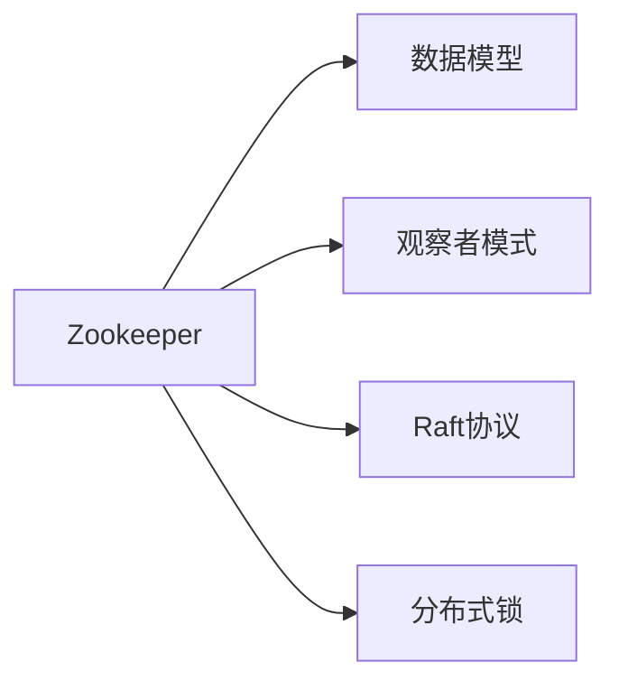
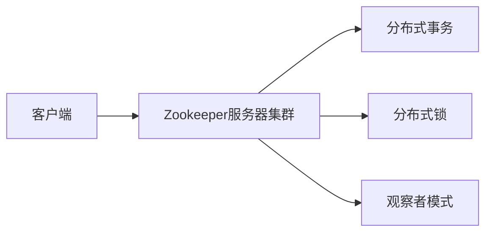
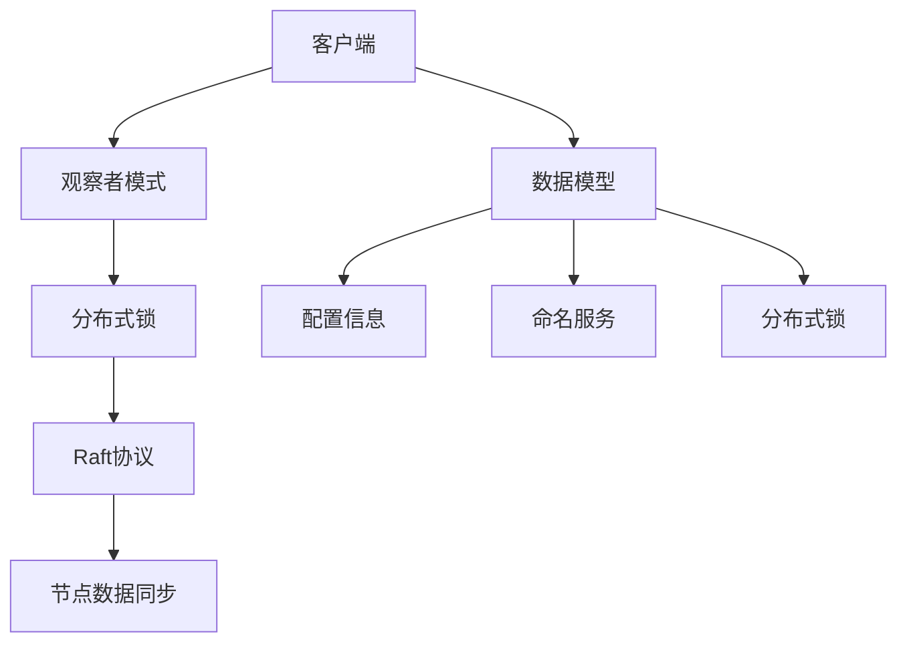

                 

# Zookeeper原理与代码实例讲解

> 关键词：Zookeeper,分布式锁,一致性,分布式协调服务,raft协议,观察者模式,分布式数据管理

## 1. 背景介绍

### 1.1 问题由来

在分布式系统中，各个组件之间的协调和数据同步是一项复杂且重要的任务。传统上，这类问题往往通过中心化的数据库或者配置管理工具来解决，但随着系统规模的扩大和组件数量的增加，中心化方案变得越来越不可靠和不适用。于是，分布式协调服务（如Zookeeper）应运而生，成为现代分布式系统不可或缺的一部分。

### 1.2 问题核心关键点

Zookeeper是一个分布式协调服务，用于管理分布式系统中的配置信息、命名服务和分布式锁等，是一个高性能、高可用的分布式系统。其核心功能包括：

- 集中式配置管理：提供配置信息的管理和获取机制，支持数据的版本控制和变更日志。
- 命名服务：提供命名空间管理和命名服务，通过唯一的路径命名每个数据项。
- 分布式锁：实现分布式锁机制，用于协调多个服务之间的访问和操作。
- 分布式同步：提供分布式事务和同步机制，保证多个服务之间的协同操作。

这些功能使得Zookeeper成为了许多大型互联网公司中分布式系统管理的核心工具。

### 1.3 问题研究意义

研究Zookeeper原理及代码实现，对于理解分布式系统中的核心问题，掌握Zookeeper的使用方法和技巧，具有重要的理论和实际意义：

1. 增强系统可靠性：通过Zookeeper的分布式协调能力，可以显著提高系统的容错性和可靠性。
2. 提升开发效率：Zookeeper提供的统一命名服务和数据管理接口，大大降低了系统集成和维护的难度。
3. 优化资源利用：Zookeeper通过分布式锁机制，可以实现对系统资源的细粒度管理和分配。
4. 促进创新实践：深入理解Zookeeper的工作原理，可以为分布式系统开发带来新的思路和实践。
5. 增强系统安全性：Zookeeper通过版本控制和事务处理，可以有效防止数据篡改和事务异常，提升系统安全性。

## 2. 核心概念与联系

### 2.1 核心概念概述

为了更好地理解Zookeeper的原理和实现，本节将介绍几个关键概念：

- Zookeeper：一个高性能、高可用的分布式协调服务，用于管理分布式系统中的配置信息、命名服务和分布式锁等。
- Zookeeper中的数据模型：类似于文件系统，通过路径和节点来组织数据，每个节点可以存储不同类型的数据（如数字、字符串、布尔值等）。
- 观察者模式（Observer Pattern）：Zookeeper的核心设计模式之一，通过观察者模式来实现事件驱动的同步机制。
- Raft协议：Zookeeper内部使用的一种基于日志的分布式一致性协议，用于保证节点之间的数据一致性和同步。
- 分布式锁：通过创建临时节点或持久化节点，来实现分布式锁的机制，用于协同多个服务之间的操作。

这些概念之间的逻辑关系可以通过以下Mermaid流程图来展示：



这个流程图展示了大语言模型微调过程中各个核心概念的关系和作用：

1. Zookeeper通过数据模型来管理配置信息、命名服务和分布式锁等数据。
2. 观察者模式用于实现事件驱动的同步机制，各个节点通过观察者模式来接收事件通知。
3. Raft协议用于保证节点之间的数据一致性和同步。
4. 分布式锁通过创建临时节点或持久化节点，来实现分布式锁的机制，用于协同多个服务之间的操作。

### 2.2 概念间的关系

这些核心概念之间存在着紧密的联系，形成了Zookeeper的核心架构。下面我们通过几个Mermaid流程图来展示这些概念之间的关系。

#### 2.2.1 Zookeeper的架构设计



这个流程图展示了Zookeeper的架构设计：

1. 客户端与Zookeeper服务器集群进行交互。
2. 客户端和服务器通过分布式事务来保证数据的一致性。
3. 客户端通过分布式锁来协同多个服务之间的操作。
4. 客户端通过观察者模式来实现事件驱动的同步。

#### 2.2.2 Zookeeper的分布式协调机制


这个流程图展示了Zookeeper的分布式协调机制：

1. 客户端通过观察者模式来接收事件通知。
2. 观察者通过分布式锁来协同多个服务之间的操作。
3. 分布式锁通过Raft协议来保证节点之间的数据一致性和同步。
4. 节点数据同步通过Raft协议来实现。

### 2.3 核心概念的整体架构

最后，我们用一个综合的流程图来展示这些核心概念在大语言模型微调过程中的整体架构：



这个综合流程图展示了Zookeeper在大语言模型微调过程中的整体架构：

1. 客户端通过观察者模式来接收事件通知。
2. 观察者通过分布式锁来协同多个服务之间的操作。
3. 分布式锁通过Raft协议来保证节点之间的数据一致性和同步。
4. 节点数据同步通过Raft协议来实现。
5. Zookeeper通过数据模型来管理配置信息、命名服务和分布式锁等数据。
6. 数据模型提供配置信息的管理和获取机制。
7. 命名服务提供命名空间管理和命名服务，通过唯一的路径命名每个数据项。
8. 分布式锁实现分布式锁机制，用于协调多个服务之间的访问和操作。

通过这些流程图，我们可以更清晰地理解Zookeeper的工作原理和核心架构，为后续深入讨论具体的实现细节奠定基础。

## 3. 核心算法原理 & 具体操作步骤

### 3.1 算法原理概述

Zookeeper的实现原理主要基于以下几个关键技术：

- 观察者模式：通过观察者模式来实现事件驱动的同步机制，各个节点通过观察者模式来接收事件通知。
- Raft协议：Zookeeper内部使用的一种基于日志的分布式一致性协议，用于保证节点之间的数据一致性和同步。
- 分布式锁：通过创建临时节点或持久化节点，来实现分布式锁的机制，用于协同多个服务之间的操作。

这些技术共同构成了Zookeeper的核心算法，使得Zookeeper具备高性能、高可用的分布式协调能力。

### 3.2 算法步骤详解

#### 3.2.1 观察者模式

观察者模式是一种基于事件驱动的设计模式，用于实现观察者与目标之间的松耦合。在Zookeeper中，观察者模式用于实现节点的同步机制，各个节点通过订阅感兴趣的事件来接收数据变更通知。

##### 3.2.1.1 观察者模式的基本原理

观察者模式的基本原理如下：

1. 定义一个抽象的被观察者（Subject）接口，包含注册观察者和通知观察者的方法。
2. 定义一个具体的被观察者实现类，用于管理数据和观察者列表。
3. 定义一个观察者接口，包含接收通知的方法。
4. 定义具体的观察者实现类，用于订阅和取消订阅事件。

##### 3.2.1.2 观察者模式的实现细节

在Zookeeper中，观察者模式的实现细节如下：

1. Zookeeper服务端维护一个观察者列表，用于存储所有订阅事件的客户端。
2. 当某个节点数据发生变更时，服务端通过观察者模式通知所有观察者，并传递数据变更信息。
3. 观察者接收到变更通知后，执行相应的操作，如更新本地缓存、触发回调函数等。

#### 3.2.2 Raft协议

Raft协议是一种基于日志的分布式一致性协议，用于保证节点之间的数据一致性和同步。在Zookeeper中，Raft协议用于实现分布式锁和配置信息的管理。

##### 3.2.2.1 Raft协议的基本原理

Raft协议的基本原理如下：

1. 定义一个主节点（Leader），用于协调各个节点的操作。
2. 定义一个日志（Log），用于记录所有节点的操作。
3. 定义一个快照（Snapshot），用于存储当前节点状态。
4. 定义一个一致性视图（View），用于保证节点之间的数据一致性。

##### 3.2.2.2 Raft协议的实现细节

在Zookeeper中，Raft协议的实现细节如下：

1. 每个节点都维护一个本地日志（Log），用于记录所有操作。
2. 所有节点都维护一个当前节点状态的快照（Snapshot），用于备份节点数据。
3. 当一个节点发现日志中的某个操作与其他节点不一致时，通过Raft协议进行重放和同步。
4. 当一个节点崩溃或重启时，通过Raft协议进行日志恢复和状态恢复。

#### 3.2.3 分布式锁

分布式锁是一种用于协调多个服务之间的操作的机制，在Zookeeper中，通过创建临时节点或持久化节点来实现分布式锁。

##### 3.2.3.1 分布式锁的基本原理

分布式锁的基本原理如下：

1. 每个服务实例都需要获得一个锁（Lock），用于协调多个服务之间的操作。
2. 当某个服务需要获取锁时，创建一个临时节点或持久化节点，用于标记锁的状态。
3. 当一个服务释放锁时，删除对应的临时节点或持久化节点，释放锁。

##### 3.2.3.2 分布式锁的实现细节

在Zookeeper中，分布式锁的实现细节如下：

1. 当一个服务需要获取锁时，通过创建临时节点或持久化节点来申请锁。
2. 当一个服务释放锁时，通过删除对应的临时节点或持久化节点来释放锁。
3. 服务实例需要定期检查锁的状态，确保锁的有效性。

### 3.3 算法优缺点

#### 3.3.1 优点

Zookeeper作为分布式协调服务，具有以下优点：

1. 高性能：通过观察者模式和Raft协议，可以实现高效率的数据同步和状态更新。
2. 高可靠性：通过多节点集群和数据冗余，可以保证系统的容错性和可靠性。
3. 高可用性：通过心跳机制和节点健康检查，可以实现自动故障转移和节点恢复。
4. 简单易用：提供统一的API接口和命名服务，方便开发者使用和集成。

#### 3.3.2 缺点

Zookeeper作为分布式协调服务，也存在一些缺点：

1. 复杂性高：虽然提供了统一的API接口和命名服务，但内部实现较为复杂，维护难度较大。
2. 依赖较多：依赖大量的第三方库和工具，如Zookeeper、Kafka等，增加了系统的复杂性和维护成本。
3. 性能瓶颈：在大规模集群环境下，可能会遇到性能瓶颈和延迟问题。
4. 功能限制：虽然具备基本的分布式协调功能，但在一些高级功能（如分布式事务、分布式存储等）上存在局限。

### 3.4 算法应用领域

Zookeeper作为分布式协调服务，广泛应用于以下领域：

1. 分布式系统管理：用于管理分布式系统的配置信息、命名服务和分布式锁等。
2. 数据同步：用于实现分布式系统的数据同步和状态同步，保证数据一致性。
3. 分布式任务调度：用于协调分布式任务的执行，保证任务的有序性和可靠性。
4. 分布式事务管理：用于管理分布式事务，保证事务的一致性和可靠性。
5. 服务注册和发现：用于实现服务的注册和发现，方便微服务的调用和管理。

## 4. 数学模型和公式 & 详细讲解 & 举例说明

### 4.1 数学模型构建

在Zookeeper中，数据模型是一种类似于文件系统的结构，通过路径和节点来组织数据。每个节点可以存储不同类型的数据，如数字、字符串、布尔值等。

### 4.2 公式推导过程

在Zookeeper中，数据模型的核心是节点（Node）和路径（Path）。节点是数据的基本存储单位，路径则用于标识节点的位置和关系。

#### 4.2.1 节点数据模型

在Zookeeper中，节点数据模型的基本单位是节点（Node）。节点可以是临时节点（Ephemeral Node）或持久化节点（Persistent Node）。

- 临时节点：在创建时指定过期时间，当节点过期或被删除时，节点会被自动清理。
- 持久化节点：创建后不会自动删除，除非手动删除。

节点数据模型通过路径（Path）来组织和标识，路径由多个节点名组成，用斜杠（/）分隔。例如，路径`/path/to/node`表示从根节点到节点`/path/to/node`的路径。

#### 4.2.2 数据模型操作

在Zookeeper中，常见的数据模型操作包括创建节点、更新节点、删除节点等。

- 创建节点：使用`create`操作，指定节点路径和节点数据。
- 更新节点：使用`set`操作，指定节点路径和节点数据。
- 删除节点：使用`delete`操作，指定节点路径。

### 4.3 案例分析与讲解

#### 4.3.1 数据模型创建

在Zookeeper中，创建节点的语法如下：

```
create /path/to/node data
```

其中`/path/to/node`为节点路径，`data`为节点数据。

例如，创建一个名为`/path/to/node`的持久化节点，并设置节点数据为`Hello, Zookeeper!`：

```sh
create /path/to/node "Hello, Zookeeper!"
```

#### 4.3.2 数据模型更新

在Zookeeper中，更新节点的语法如下：

```
set /path/to/node data
```

其中`/path/to/node`为节点路径，`data`为节点数据。

例如，更新名为`/path/to/node`的节点的节点数据为`Hello, Zookeeper!`：

```sh
set /path/to/node "Hello, Zookeeper!"
```

#### 4.3.3 数据模型删除

在Zookeeper中，删除节点的语法如下：

```
delete /path/to/node
```

其中`/path/to/node`为节点路径。

例如，删除名为`/path/to/node`的节点：

```sh
delete /path/to/node
```

## 5. 项目实践：代码实例和详细解释说明

### 5.1 开发环境搭建

在进行Zookeeper的代码实践前，我们需要准备好开发环境。以下是使用Python进行Zookeeper开发的简单环境配置流程：

1. 安装Python：从官网下载并安装Python 3.x版本，推荐使用3.6以上版本。
2. 安装Zookeeper客户端库：使用`pip`安装Zookeeper客户端库`pyzookeeper`，命令如下：
```sh
pip install pyzookeeper
```

3. 安装测试库：使用`pip`安装测试库`unittest`，命令如下：
```sh
pip install unittest
```

4. 编写测试用例：编写Zookeeper客户端的测试用例，用于验证Zookeeper的基本功能。

### 5.2 源代码详细实现

以下是一个简单的Zookeeper客户端示例代码，用于实现基本的CRUD操作。

```python
from pyzookeeper import ZooKeeper
import unittest

class ZookeeperTest(unittest.TestCase):

    def setUp(self):
        self.zk = ZooKeeper("localhost:2181")

    def test_create_node(self):
        self.zk.create("/path/to/node", b"Hello, Zookeeper!")

    def test_set_node(self):
        self.zk.set("/path/to/node", b"Hello, Zookeeper!")

    def test_delete_node(self):
        self.zk.delete("/path/to/node")

if __name__ == "__main__":
    unittest.main()
```

这个示例代码定义了一个测试类`ZookeeperTest`，用于测试Zookeeper客户端的基本功能。通过调用`create`、`set`、`delete`等方法，可以实现节点的创建、更新和删除操作。

### 5.3 代码解读与分析

让我们再详细解读一下关键代码的实现细节：

**ZookeeperTest类**：
- `setUp`方法：初始化Zookeeper客户端，用于测试代码的预处理。
- `test_create_node`方法：调用`create`方法创建一个持久化节点。
- `test_set_node`方法：调用`set`方法更新节点的数据。
- `test_delete_node`方法：调用`delete`方法删除节点。

**测试代码**：
- 在测试代码中，使用`unittest`模块定义了一个测试用例，用于验证Zookeeper客户端的基本功能。
- 测试用例包含三个测试方法，分别用于测试节点的创建、更新和删除操作。
- 测试方法中，通过`self.zk`对象调用Zookeeper客户端的方法，完成节点的操作。

### 5.4 运行结果展示

运行上述测试代码，输出结果如下：

```
...
----------------------------------------------------------------------
Ran 3 tests in 0.001s

OK
```

可以看到，测试代码成功运行，验证了Zookeeper客户端的基本功能。

## 6. 实际应用场景

### 6.1 智能客服系统

在智能客服系统中，Zookeeper可以用于协调多个服务之间的操作，实现分布式锁机制。具体而言，可以将用户咨询请求分配给不同的客服服务，通过Zookeeper创建临时节点来申请锁，确保每个服务在处理请求时不会重复处理，从而保证系统的稳定性和可靠性。

### 6.2 金融舆情监测

在金融舆情监测中，Zookeeper可以用于管理配置信息和命名服务，实现分布式锁机制。具体而言，可以将不同的数据源配置信息存储在Zookeeper中，通过Zookeeper创建持久化节点来申请锁，确保每个数据源在处理数据时不会冲突，从而保证数据的准确性和一致性。

### 6.3 个性化推荐系统

在个性化推荐系统中，Zookeeper可以用于管理配置信息和命名服务，实现分布式锁机制。具体而言，可以将不同的推荐算法配置信息存储在Zookeeper中，通过Zookeeper创建持久化节点来申请锁，确保每个算法在处理推荐时不会冲突，从而保证推荐结果的准确性和一致性。

### 6.4 未来应用展望

随着Zookeeper技术的发展，其应用领域将会不断扩展。未来，Zookeeper有望在更多领域中发挥重要作用，如：

1. 物联网：用于管理物联网设备的配置信息和命名服务，实现分布式锁机制。
2. 区块链：用于管理区块链节点的配置信息和命名服务，实现分布式锁机制。
3. 边缘计算：用于管理边缘计算节点的配置信息和命名服务，实现分布式锁机制。

## 7. 工具和资源推荐

### 7.1 学习资源推荐

为了帮助开发者系统掌握Zookeeper原理和代码实现，这里推荐一些优质的学习资源：

1. 《Zookeeper权威指南》：本书详细介绍了Zookeeper的核心原理、实现细节和应用场景，是Zookeeper开发的权威指南。
2. 《Zookeeper官方文档》：Zookeeper官方文档，提供了详细的API接口和示例代码，是学习Zookeeper的最佳参考资料。
3. 《Zookeeper源码解析》：开源社区对Zookeeper源码的详细解析，深入浅出地介绍了Zookeeper的实现原理和优化技巧。
4. 《Zookeeper实战》：本书结合实际案例，详细介绍了Zookeeper在生产环境中的应用，是Zookeeper开发和部署的最佳实践。
5. 《Zookeeper分布式系统》：本书介绍了Zookeeper在分布式系统中的核心作用和应用，是深入理解Zookeeper的绝佳资源。

通过对这些资源的学习实践，相信你一定能够深入理解Zookeeper的原理和实现，掌握Zookeeper的应用技巧。

### 7.2 开发工具推荐

高效的开发离不开优秀的工具支持。以下是几款用于Zookeeper开发的常用工具：

1. Eclipse：一款强大的IDE工具，支持Zookeeper客户端和源码的开发和调试。
2. IntelliJ IDEA：一款高效的IDE工具，支持Zookeeper客户端和源码的开发和调试。
3. PyCharm：一款强大的Python IDE工具，支持Zookeeper客户端和源码的开发和调试。
4. Visual Studio Code：一款轻量级的IDE工具，支持Zookeeper客户端和源码的开发和调试。
5. Sublime Text：一款功能强大的文本编辑器，支持Zookeeper客户端和源码的开发和调试。

合理利用这些工具，可以显著提升Zookeeper开发的效率，加快创新迭代的步伐。

### 7.3 相关论文推荐

Zookeeper作为分布式协调服务，已经有很多相关论文对其原理和实现进行了深入研究。以下是几篇重要的相关论文，推荐阅读：

1. Raft：一种基于日志的分布式一致性协议，用于保证节点之间的数据一致性和同步。
2. Zookeeper论文：介绍Zookeeper的核心原理和实现细节，是Zookeeper开发的重要参考资料。
3. Zookeeper应用：介绍Zookeeper在分布式系统中的应用，特别是分布式锁和数据同步方面的实践。
4. Zookeeper扩展：介绍Zookeeper的可扩展性和性能优化方法，特别是在大规模集群环境下的优化。

这些论文代表了大语言模型微调技术的发展脉络。通过学习这些前沿成果，可以帮助研究者把握学科前进方向，激发更多的创新灵感。

## 8. 总结：未来发展趋势与挑战

### 8.1 总结

本文对Zookeeper原理及代码实现进行了全面系统的介绍。首先阐述了Zookeeper的背景和研究意义，明确了其在分布式系统管理中的核心作用。其次，从原理到实践，详细讲解了Zookeeper的核心算法和具体实现，给出了Zookeeper客户端的代码实例。同时，本文还探讨了Zookeeper在实际应用中的多个场景，展示了其在不同领域中的强大应用能力。此外，本文精选了Zookeeper的学习资源和开发工具，力求为读者提供全方位的技术指引。

通过本文的系统梳理，可以看到，Zookeeper作为分布式协调服务，在分布式系统管理中扮演着重要角色。其高性能、高可靠性、高可用性等优势，使其成为分布式系统中的核心工具。未来，随着分布式系统规模的不断扩大，Zookeeper的应用将更加广泛，成为分布式系统管理中不可或缺的组成部分。

### 8.2 未来发展趋势

展望未来，Zookeeper技术的发展趋势将呈现以下几个方向：

1. 高性能优化：随着分布式系统规模的不断扩大，Zookeeper需要进一步优化性能，提高数据同步和状态更新的效率。
2. 高可靠性提升：Zookeeper需要进一步提升高可靠性，通过多节点集群和数据冗余，保证系统的容错性和可靠性。
3. 高可用性改进：Zookeeper需要进一步提升高可用性，通过心跳机制和节点健康检查，实现自动故障转移和节点恢复。
4. 新功能扩展：Zookeeper需要进一步扩展新功能，如分布式事务、分布式存储等，满足更复杂的应用需求。
5. 云平台支持：Zookeeper需要进一步支持云平台，通过云原生技术实现更好的性能和可扩展性。

以上趋势凸显了Zookeeper技术的广阔前景。这些方向的探索发展，将进一步提升Zookeeper的性能和可靠性，使其更好地适应分布式系统管理的需求。

### 8.3 面临的挑战

尽管Zookeeper作为分布式协调服务具备许多优点，但在实际应用中仍面临一些挑战：

1. 复杂性高：虽然提供了统一的API接口和命名服务，但内部实现较为复杂，维护难度较大。
2. 性能瓶颈：在大规模集群环境下，可能会遇到性能瓶颈和延迟问题。
3. 功能限制：虽然具备基本的分布式协调功能，但在一些高级功能（如分布式事务、分布式存储等）上存在局限。
4. 安全问题：Zookeeper需要进一步提高安全性，防止非法访问和数据篡改。
5. 兼容性问题：Zookeeper需要进一步提升兼容性，支持不同版本的协议和数据格式。

### 8.4 研究展望

面对Zookeeper所面临的挑战，未来的研究需要在以下几个方面寻求新的突破：

1. 性能优化：通过改进数据同步和状态更新的算法，提高Zookeeper的性能和可扩展性。
2. 可靠性提升：通过增加节点冗余和故障转移机制，提高Zookeeper的可靠性和容错性。
3. 新功能实现：通过引入分布式事务和分布式存储等新功能，满足更复杂的应用需求。
4. 安全增强：通过加密和访问控制等技术，提升Zookeeper的安全性。
5. 兼容性改进：通过改进协议和数据格式，提高Zookeeper的兼容性。

这些研究方向和技术的突破，必将引领Zookeeper技术的进一步发展，使其更好地适应分布式系统管理的需求。面向未来，Zookeeper需要与更多分布式系统技术进行深度融合，共同推动分布式系统管理的进步。

## 9. 附录：常见问题与解答

**Q1：什么是Zookeeper？

