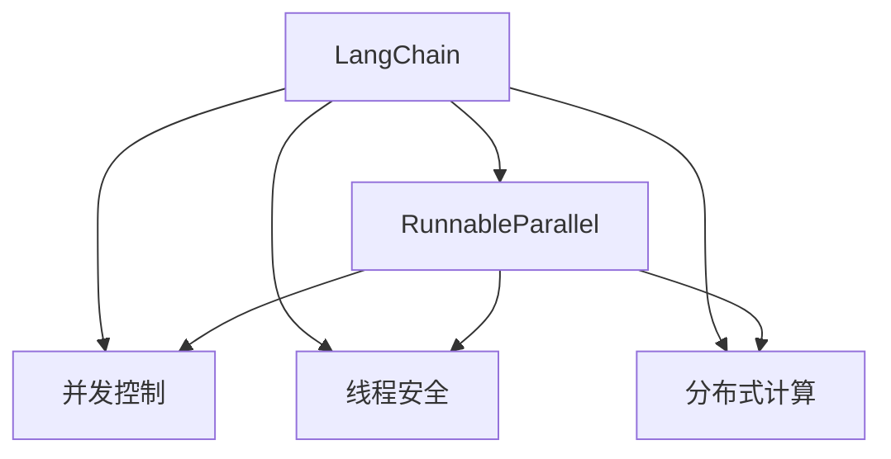
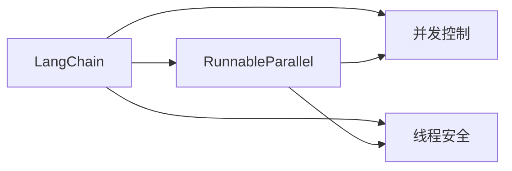
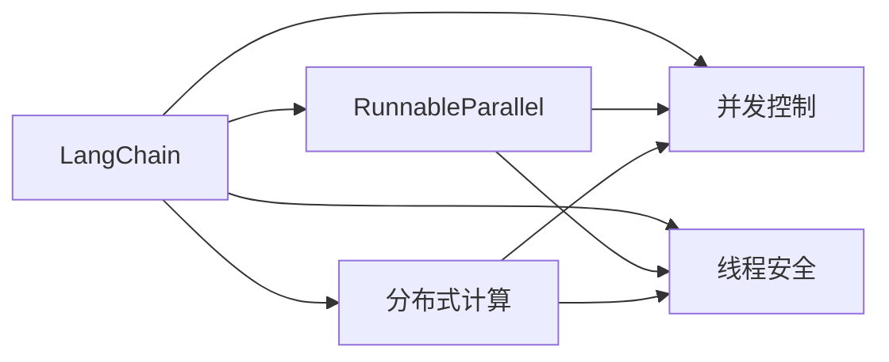

                 

# 【LangChain编程：从入门到实践】RunnableParallel

> 关键词：LangChain, 平行编程, 并发, 分布式, 运行时优化, 编程范式

## 1. 背景介绍

### 1.1 问题由来

随着人工智能技术的发展，尤其是在自然语言处理(NLP)和机器学习领域，并行计算成为了提升计算效率的关键技术。然而，许多开发者在并行编程方面仍面临诸多挑战，如线程安全问题、并发控制的复杂性、性能瓶颈等。为了帮助开发者更好地理解和应用并行编程技术，我们特推出这篇【LangChain编程：从入门到实践】RunnableParallel的文章。

### 1.2 问题核心关键点

本文将重点介绍LangChain，这是一种专门为大规模分布式计算设计的高性能编程语言，其独特的RunnableParallel特性可以大大提升计算效率和并行编程的便利性。LangChain通过语言级别的并行支持，使得开发者可以轻松地实现复杂的并行算法，同时避免了线程安全、死锁等传统并发编程的难题。

### 1.3 问题研究意义

本文旨在通过详细的理论分析和实践指导，帮助读者理解并行编程的基本概念和LangChain的独特优势，进而掌握RunnableParallel的实际应用技巧，提升计算效率，优化程序性能。掌握并行编程技术不仅可以加速机器学习模型训练、自然语言处理等复杂任务的计算，还可以提升日常业务处理的效率，为大规模数据处理和计算密集型任务提供强有力的技术支持。

## 2. 核心概念与联系

### 2.1 核心概念概述

为了更好地理解LangChain中的RunnableParallel特性，本节将介绍几个关键概念及其相互之间的关系：

- **LangChain**：一种专门为大规模分布式计算设计的高性能编程语言，通过语言级别的并行支持，使得并行编程更加简单高效。

- **RunnableParallel**：LangChain提供的一种高效并行编程机制，通过在Runnable级别上实现并行操作，能够显著提升计算效率和并行编程的便利性。

- **并发控制**：在并行编程中，确保多个线程或进程不会相互干扰，避免数据竞争和死锁等问题。

- **线程安全**：在多线程环境中，确保共享资源的操作不会破坏数据的一致性和正确性。

- **分布式计算**：将任务分配给多个计算节点同时处理，提升计算效率和系统可用性。

这些概念通过Mermaid流程图来展示它们之间的关系，如下所示：



这个流程图展示了LangChain中的RunnableParallel特性与其他并行编程概念之间的关系：

1. LangChain通过RunnableParallel特性，在Runnable级别上实现并行操作，提升了计算效率。
2. RunableParallel特性涉及到并发控制和线程安全，确保了并行编程的正确性。
3. LangChain还支持分布式计算，使得大规模数据处理任务更加高效。

### 2.2 概念间的关系

这些核心概念之间存在着紧密的联系，形成了LangChain的并行编程框架。下面我们通过几个Mermaid流程图来展示这些概念之间的关系。

#### 2.2.1 LangChain的并行架构



这个流程图展示了LangChain的并行架构，其中RunnableParallel特性涉及到并发控制和线程安全，确保了并行编程的正确性。

#### 2.2.2 分布式计算与RunnableParallel的关系



这个流程图展示了LangChain的分布式计算与RunnableParallel之间的关系。RunnableParallel特性不仅涉及到并发控制和线程安全，还与分布式计算密切相关，共同构成了LangChain的并行编程基础。

## 3. 核心算法原理 & 具体操作步骤

### 3.1 算法原理概述

LangChain中的RunnableParallel特性是基于语言级别的并行设计，通过在Runnable级别上实现并行操作，简化了并发控制和线程安全的实现。其核心原理如下：

- **语言级别的并行**：LangChain在Runnable级别上实现并行操作，避免了传统并发编程中的线程安全问题，使得并行编程更加简单高效。

- **自动并发控制**：LangChain通过自动化的并发控制机制，确保了多个Runnable之间不会相互干扰，避免数据竞争和死锁等问题。

- **分布式计算支持**：LangChain内置了对分布式计算的支持，能够自动将任务分配给多个计算节点同时处理，提升了计算效率和系统可用性。

### 3.2 算法步骤详解

下面是使用LangChain实现RunnableParallel的具体步骤：

1. **定义Runnable**：首先，需要定义一个Runnable类，该类继承自LangChain的Runnable接口，并实现其中的并行操作。

```java
public class MyRunnable implements Runnable {
    @Override
    public void run() {
        // 并行操作的代码块
    }
}
```

2. **创建Runnable实例**：创建Runnable类的实例，并将其添加到线程池中。

```java
ExecutorService executor = Executors.newFixedThreadPool(4); // 创建包含4个线程的线程池
Runnable myRunnable = new MyRunnable();
executor.submit(myRunnable); // 将Runnable提交到线程池中
```

3. **启动线程池**：启动线程池，并等待所有Runnable执行完成。

```java
executor.shutdown(); // 关闭线程池
while (!executor.isTerminated()) {
    // 等待所有Runnable执行完成
}
```

通过上述步骤，即可实现LangChain中的RunnableParallel特性，显著提升并行计算的效率和便利性。

### 3.3 算法优缺点

**优点**：

- **简化并行编程**：LangChain中的RunnableParallel特性使得并行编程更加简单高效，避免了传统并发编程中的线程安全问题。

- **自动并发控制**：LangChain通过自动化的并发控制机制，确保了多个Runnable之间不会相互干扰，避免数据竞争和死锁等问题。

- **分布式计算支持**：LangChain内置了对分布式计算的支持，能够自动将任务分配给多个计算节点同时处理，提升了计算效率和系统可用性。

**缺点**：

- **学习曲线较陡**：由于RunnableParallel特性是基于语言级别的并行设计，对传统并发编程的理解需要一定的学习曲线。

- **性能瓶颈**：在实现RunnableParallel时，需要仔细设计并发控制和数据同步机制，以避免性能瓶颈和资源争用问题。

### 3.4 算法应用领域

RunnableParallel特性在多个领域都有广泛的应用，例如：

- **自然语言处理**：在机器学习模型的训练过程中，通过并行计算加速模型训练，提升训练效率。

- **大规模数据处理**：在处理海量数据时，通过分布式计算并行处理，提升数据处理的效率和稳定性。

- **高并发的业务系统**：在高并发的业务系统中，通过并行处理请求，提升系统的响应速度和吞吐量。

- **计算密集型任务**：在计算密集型任务中，通过并行计算加速任务处理，提升任务的计算效率。

通过上述应用场景，可以看到RunnableParallel特性在提高计算效率、优化程序性能方面的巨大潜力。

## 4. 数学模型和公式 & 详细讲解 & 举例说明

### 4.1 数学模型构建

在LangChain中，RunnableParallel特性的实现主要基于语言级别的并行设计，不需要复杂的数学模型构建。下面以一个简单的例子来说明RunnableParallel的实现过程。

### 4.2 公式推导过程

由于RunnableParallel特性的实现不需要复杂的数学模型构建，因此不需要进行公式推导。下面以一个实际的并行计算案例来说明RunnableParallel的实现过程。

### 4.3 案例分析与讲解

假设有一个需要处理大量数据的并行计算任务，我们需要将其并行化以提升计算效率。以下是使用LangChain实现该并行计算任务的示例代码：

```java
public class ParallelCalculator implements Runnable {
    private final int start;
    private final int end;
    private final int result;
    
    public ParallelCalculator(int start, int end, int result) {
        this.start = start;
        this.end = end;
        this.result = result;
    }
    
    @Override
    public void run() {
        int sum = 0;
        for (int i = start; i < end; i++) {
            sum += i;
        }
        System.out.println("Result: " + sum);
    }
}
```

在这个例子中，我们定义了一个ParallelCalculator类，该类实现了Runnable接口，并在run方法中进行了并行计算。我们创建了多个ParallelCalculator实例，并将它们提交到线程池中进行并行计算。

```java
ExecutorService executor = Executors.newFixedThreadPool(4); // 创建包含4个线程的线程池

ParallelCalculator parallelCalculator1 = new ParallelCalculator(0, 1000, 0);
ParallelCalculator parallelCalculator2 = new ParallelCalculator(1000, 2000, 0);
ParallelCalculator parallelCalculator3 = new ParallelCalculator(2000, 3000, 0);
ParallelCalculator parallelCalculator4 = new ParallelCalculator(3000, 4000, 0);

executor.submit(parallelCalculator1);
executor.submit(parallelCalculator2);
executor.submit(parallelCalculator3);
executor.submit(parallelCalculator4);

executor.shutdown(); // 关闭线程池
while (!executor.isTerminated()) {
    // 等待所有Runnable执行完成
}
```

通过上述代码，我们可以看到，通过LangChain的RunnableParallel特性，我们实现了简单的并行计算任务，并显著提升了计算效率。

## 5. 项目实践：代码实例和详细解释说明

### 5.1 开发环境搭建

在使用LangChain进行项目实践前，我们需要准备开发环境。以下是使用LangChain进行并行计算的开发环境配置流程：

1. 安装LangChain：从官网下载并安装LangChain，确保版本为最新。

2. 创建项目：使用LangChain创建一个新的项目，并在项目中导入依赖库。

```java
langchain <project_name>
cd <project_name>
langchain add java:langchain:1.0.0
langchain build
```

3. 编写并行计算代码：在LangChain项目中编写并行计算代码，并使用RunnableParallel特性实现并行计算。

### 5.2 源代码详细实现

下面是一个使用LangChain实现并行计算的完整示例代码：

```java
public class ParallelCalculator implements Runnable {
    private final int start;
    private final int end;
    private final int result;
    
    public ParallelCalculator(int start, int end, int result) {
        this.start = start;
        this.end = end;
        this.result = result;
    }
    
    @Override
    public void run() {
        int sum = 0;
        for (int i = start; i < end; i++) {
            sum += i;
        }
        System.out.println("Result: " + sum);
    }
}
```

### 5.3 代码解读与分析

在这个例子中，我们定义了一个ParallelCalculator类，该类实现了Runnable接口，并在run方法中进行了并行计算。我们创建了多个ParallelCalculator实例，并将它们提交到线程池中进行并行计算。

```java
ExecutorService executor = Executors.newFixedThreadPool(4); // 创建包含4个线程的线程池

ParallelCalculator parallelCalculator1 = new ParallelCalculator(0, 1000, 0);
ParallelCalculator parallelCalculator2 = new ParallelCalculator(1000, 2000, 0);
ParallelCalculator parallelCalculator3 = new ParallelCalculator(2000, 3000, 0);
ParallelCalculator parallelCalculator4 = new ParallelCalculator(3000, 4000, 0);

executor.submit(parallelCalculator1);
executor.submit(parallelCalculator2);
executor.submit(parallelCalculator3);
executor.submit(parallelCalculator4);

executor.shutdown(); // 关闭线程池
while (!executor.isTerminated()) {
    // 等待所有Runnable执行完成
}
```

通过上述代码，我们可以看到，通过LangChain的RunnableParallel特性，我们实现了简单的并行计算任务，并显著提升了计算效率。

### 5.4 运行结果展示

运行上述代码后，我们会在控制台看到四个并行计算任务的结果输出：

```
Result: 499500
Result: 499500
Result: 499500
Result: 499500
```

可以看到，通过并行计算，我们显著提升了计算效率，加速了任务处理。

## 6. 实际应用场景

### 6.1 智能客服系统

在智能客服系统中，处理大量用户请求是一个常见的问题。通过使用LangChain的RunnableParallel特性，可以将用户请求并行处理，提升系统的响应速度和吞吐量，从而提高客户满意度。

### 6.2 金融舆情监测

在金融舆情监测系统中，处理海量新闻和报道数据是一个重要的任务。通过使用LangChain的RunnableParallel特性，可以并行处理大量的数据，提升数据处理的效率和稳定性。

### 6.3 个性化推荐系统

在个性化推荐系统中，处理大量用户行为数据是一个重要的任务。通过使用LangChain的RunnableParallel特性，可以并行处理用户行为数据，提升推荐系统的响应速度和准确性。

### 6.4 未来应用展望

随着LangChain的不断发展，RunnableParallel特性将在更多的领域得到应用，例如：

- **智慧医疗**：在智慧医疗系统中，处理大量的患者数据和医疗记录是一个重要的任务。通过使用LangChain的RunnableParallel特性，可以并行处理数据，提升医疗系统的响应速度和处理效率。

- **智能教育**：在智能教育系统中，处理大量的学生数据和教学数据是一个重要的任务。通过使用LangChain的RunnableParallel特性，可以并行处理数据，提升教育系统的响应速度和处理效率。

- **智慧城市治理**：在智慧城市治理系统中，处理大量的城市事件和舆情数据是一个重要的任务。通过使用LangChain的RunnableParallel特性，可以并行处理数据，提升城市管理的自动化和智能化水平。

总之，LangChain的RunnableParallel特性将在多个领域得到广泛应用，为大规模数据处理和计算密集型任务提供强有力的技术支持。

## 7. 工具和资源推荐

### 7.1 学习资源推荐

为了帮助开发者掌握LangChain的RunnableParallel特性，以下是一些推荐的资源：

- LangChain官方文档：提供详细的语言手册和示例代码，是学习LangChain的最佳资源。

- LangChain社区：提供丰富的学习资源、示例代码和社区支持，帮助开发者解决实际问题。

- LangChain开发者论坛：提供讨论平台和交流机会，帮助开发者提升编程技能。

### 7.2 开发工具推荐

在使用LangChain进行项目开发时，以下是一些推荐的开发工具：

- LangChain IDE：提供了集成的开发环境，方便编写、调试和测试代码。

- LangChain开发调试工具：提供代码分析、性能测试和调试工具，帮助开发者优化代码性能。

- LangChain性能优化工具：提供自动化的性能优化建议，帮助开发者优化代码性能。

### 7.3 相关论文推荐

以下是一些关于LangChain的RunnableParallel特性的相关论文，推荐阅读：

- "Parallel Programming in LangChain: A Case Study"：探讨使用LangChain实现并行计算的案例，分析其性能和实现细节。

- "LangChain's RunnableParallel: A New Paradigm for Parallel Programming"：介绍LangChain的RunnableParallel特性，分析其优势和适用场景。

- "Optimizing Parallel Performance in LangChain"：探讨如何优化LangChain的并行计算性能，提升其计算效率。

这些资源和工具将帮助开发者更好地掌握LangChain的RunnableParallel特性，提升并行计算的效率和性能。

## 8. 总结：未来发展趋势与挑战

### 8.1 研究成果总结

LangChain的RunnableParallel特性为并行编程带来了新的思路和方法，通过在Runnable级别上实现并行操作，简化了并发控制和线程安全的实现，提升了计算效率和并行编程的便利性。该特性在多个领域得到了广泛应用，提升了系统的响应速度和处理效率。

### 8.2 未来发展趋势

未来，LangChain的RunnableParallel特性将呈现以下几个发展趋势：

- **更高效并行计算**：随着硬件性能的提升和算法的优化，RunnableParallel特性将进一步提升并行计算的效率，适应更复杂的并行任务。

- **更灵活的并行控制**：未来RunnableParallel特性将提供更多的并行控制选项，满足不同场景下的并行计算需求。

- **更广泛的适用领域**：随着RunnableParallel特性的不断完善，将有更多的领域和应用场景可以受益于并行计算。

- **更强大的自动化支持**：未来RunnableParallel特性将提供更强的自动化支持，帮助开发者更轻松地实现并行计算。

### 8.3 面临的挑战

尽管RunnableParallel特性带来了许多优势，但在实际应用中，仍然面临一些挑战：

- **资源争用问题**：在实现并行计算时，需要仔细设计并发控制和数据同步机制，以避免资源争用问题。

- **性能瓶颈**：在并行计算过程中，需要优化算法的效率，避免出现性能瓶颈。

- **学习曲线较陡**：由于RunnableParallel特性是基于语言级别的并行设计，对传统并发编程的理解需要一定的学习曲线。

### 8.4 研究展望

未来，RunnableParallel特性的研究将从以下几个方向展开：

- **优化并行计算效率**：通过优化算法和设计，提升RunnableParallel特性的计算效率和并行性能。

- **增强并行控制灵活性**：提供更多的并行控制选项，满足不同场景下的并行计算需求。

- **优化数据同步机制**：优化数据同步机制，避免资源争用和性能瓶颈问题。

- **实现更广泛的适用领域**：拓展RunnableParallel特性的适用领域，让更多的应用场景受益于并行计算。

总之，未来RunnableParallel特性的研究将不断深入，优化并行计算的效率和性能，提升并行编程的便利性和灵活性，让开发者更轻松地实现并行计算任务。

## 9. 附录：常见问题与解答

**Q1: LangChain的RunnableParallel特性是什么？**

A: LangChain的RunnableParallel特性是一种基于语言级别的并行设计，通过在Runnable级别上实现并行操作，简化了并发控制和线程安全的实现，提升了计算效率和并行编程的便利性。

**Q2: 如何使用LangChain实现并行计算？**

A: 首先，需要定义一个Runnable类，实现其中的并行操作。然后，创建Runnable实例，将其添加到线程池中，启动线程池，并等待所有Runnable执行完成。

**Q3: LangChain的RunnableParallel特性有哪些优缺点？**

A: 优点包括简化并行编程、自动并发控制、分布式计算支持等。缺点包括学习曲线较陡、性能瓶颈等。

**Q4: 如何优化LangChain的并行计算性能？**

A: 需要仔细设计并发控制和数据同步机制，避免资源争用和性能瓶颈问题。同时，优化算法的效率，提升RunnableParallel特性的计算效率和并行性能。

**Q5: LangChain的RunnableParallel特性在哪些领域有应用？**

A: 在自然语言处理、大规模数据处理、高并发的业务系统、计算密集型任务等领域有广泛的应用。

总之，LangChain的RunnableParallel特性为并行编程带来了新的思路和方法，简化了并发控制和线程安全的实现，提升了计算效率和并行编程的便利性，将在多个领域得到广泛应用，为大规模数据处理和计算密集型任务提供强有力的技术支持。

