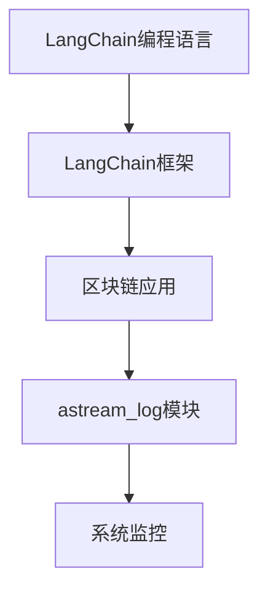
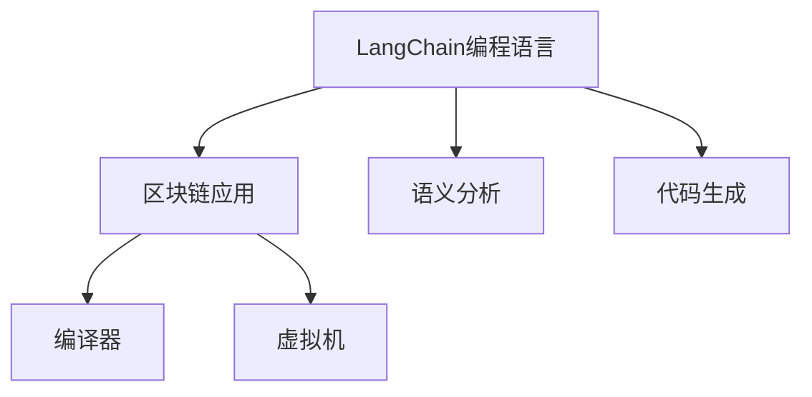
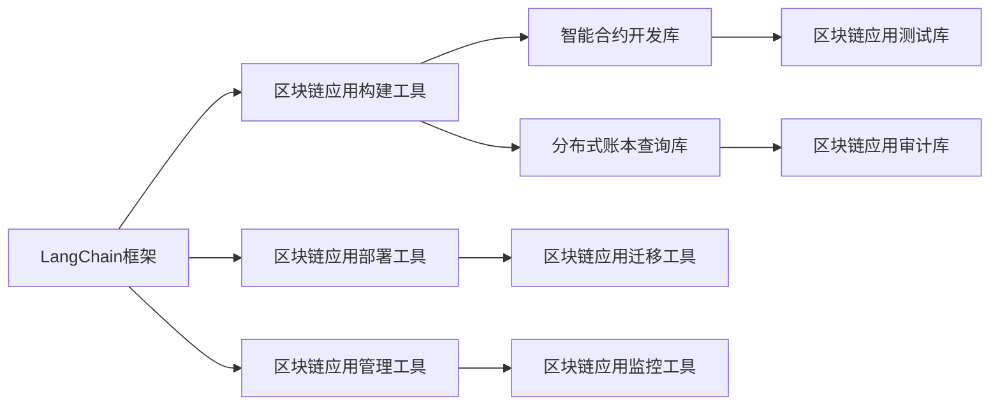
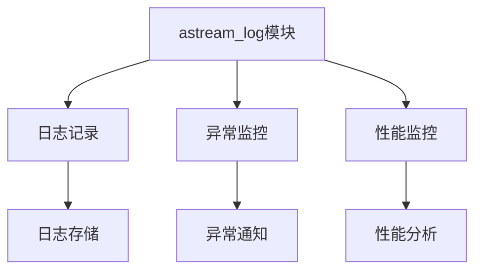
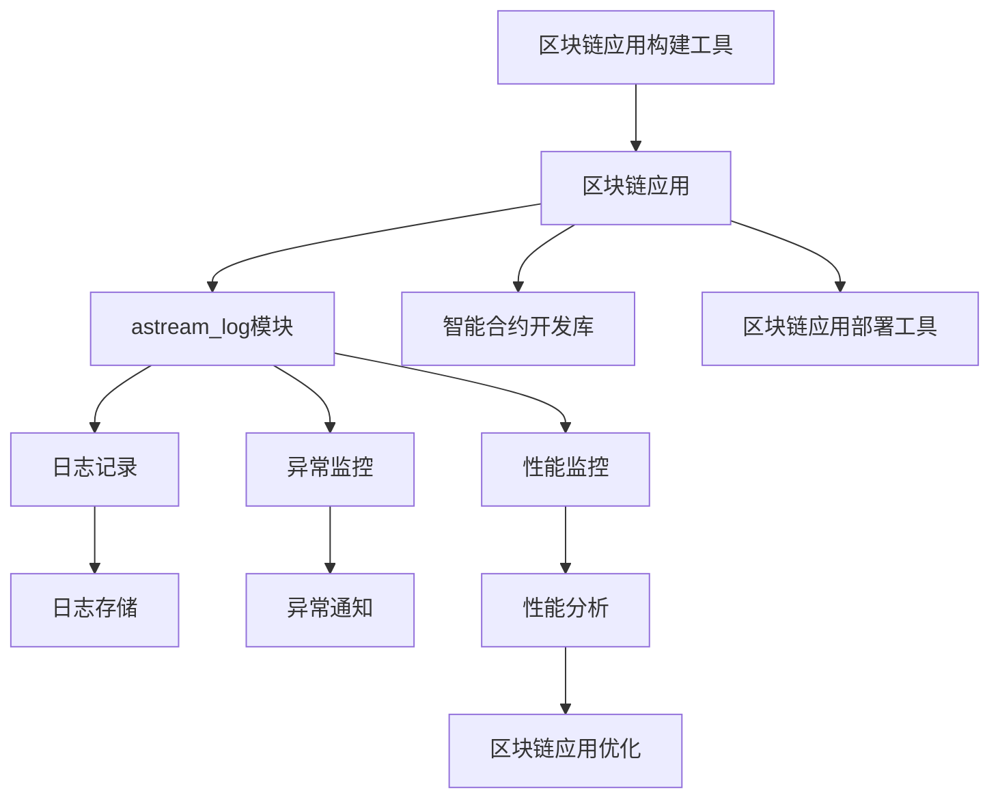

                 

# 【LangChain编程：从入门到实践】astream_log

> 关键词：LangChain, 编程, 入门, 实践, astream_log, 区块链

## 1. 背景介绍

### 1.1 问题由来

随着区块链技术的不断发展和普及，越来越多的企业和机构开始探索如何利用区块链技术解决实际问题，提升业务效率。然而，由于区块链的复杂性和高度去中心化的特性，对普通开发者而言，入门的门槛仍然很高。与此同时，现有的区块链编程语言和框架也难以满足实际应用的需求。

在这一背景下，LangChain应运而生。LangChain是一个专门为区块链开发者设计的编程语言和框架，旨在降低区块链编程的门槛，简化区块链应用开发的过程，使开发者能够更高效地构建、部署和管理区块链应用。本文将详细介绍LangChain的入门和实践，重点介绍astream_log模块，帮助开发者快速上手LangChain，并深入了解astream_log模块的功能和使用方法。

### 1.2 问题核心关键点

LangChain的核心概念和架构主要包括：

- LangChain编程语言：一种专为区块链应用开发的编程语言，具有简洁、易用、高效等特点。
- LangChain框架：提供了一系列工具和库，帮助开发者构建、部署和管理区块链应用。
- astream_log模块：LangChain框架中的一个核心模块，用于日志记录和系统监控。

这些核心概念和架构共同构成了LangChain编程的基础框架，为开发者提供了一种全新的区块链应用开发方式。

### 1.3 问题研究意义

LangChain的开发和应用具有重要意义：

1. 降低区块链编程门槛：通过提供易于学习和使用的编程语言和框架，帮助更多开发者快速入门区块链技术。
2. 提升区块链应用开发效率：利用LangChain提供的工具和库，开发者可以更快速地构建和部署区块链应用。
3. 促进区块链技术普及：通过简化区块链应用的开发和部署过程，使更多的企业和机构能够利用区块链技术解决实际问题。
4. 提升区块链应用安全性：astream_log模块提供的系统监控功能，有助于及时发现和解决应用中的潜在安全问题。
5. 推动区块链技术创新：LangChain的开发和应用，将促进区块链技术在各个领域的应用和创新，推动区块链技术的快速发展。

## 2. 核心概念与联系

### 2.1 核心概念概述

为更好地理解LangChain的入门和实践，本节将介绍几个密切相关的核心概念：

- LangChain编程语言：一种专门为区块链应用开发的编程语言，具备简洁、易用、高效等特点。
- LangChain框架：提供了一系列工具和库，帮助开发者构建、部署和管理区块链应用。
- astream_log模块：LangChain框架中的一个核心模块，用于日志记录和系统监控。
- 区块链应用：利用LangChain编程语言和框架构建的区块链应用。
- 系统监控：通过astream_log模块提供的日志记录和监控功能，实时监测区块链应用的运行状态和异常情况。

这些核心概念之间的逻辑关系可以通过以下Mermaid流程图来展示：



这个流程图展示了大语言模型的核心概念及其之间的关系：

1. LangChain编程语言和框架为基础，用于构建和部署区块链应用。
2. 区块链应用利用LangChain编程语言和框架进行开发，并调用astream_log模块进行系统监控。
3. astream_log模块通过记录日志和监控系统状态，帮助开发者及时发现和解决应用中的问题。

### 2.2 概念间的关系

这些核心概念之间存在着紧密的联系，形成了LangChain编程和实践的完整生态系统。下面我们通过几个Mermaid流程图来展示这些概念之间的关系。

#### 2.2.1 LangChain编程语言的架构



这个流程图展示了LangChain编程语言的基本架构：

1. LangChain编程语言通过语义分析模块，将用户编写的代码转化为高层次的语义表示。
2. 语义分析模块通过代码生成模块，将语义表示转换为机器可执行的代码。
3. 区块链应用通过编译器将代码编译成虚拟机指令，并在虚拟机上运行。

#### 2.2.2 LangChain框架的工具和库



这个流程图展示了LangChain框架的工具和库：

1. LangChain框架提供了区块链应用构建、部署和管理所需的工具和库。
2. 构建工具用于帮助开发者快速构建区块链应用。
3. 部署工具用于将区块链应用部署到区块链网络。
4. 管理工具用于监控、维护和管理区块链应用。
5. 智能合约开发库提供了智能合约开发的接口和工具。
6. 分布式账本查询库提供了查询区块链账本数据的接口。
7. 迁移工具用于将区块链应用从一种区块链平台迁移到另一种区块链平台。
8. 监控工具用于监控区块链应用的运行状态和异常情况。
9. 测试库用于测试区块链应用的功能和性能。
10. 审计库用于对区块链应用进行安全性和合规性审计。

#### 2.2.3 astream_log模块的功能



这个流程图展示了astream_log模块的功能：

1. astream_log模块提供了日志记录、异常监控和性能监控等功能。
2. 日志记录用于记录区块链应用的系统运行状态和操作日志。
3. 异常监控用于监测区块链应用的异常情况和故障原因。
4. 性能监控用于监测区块链应用的系统性能和资源使用情况。
5. 日志存储用于将日志数据存储到指定的存储介质中。
6. 异常通知用于在发现异常时，及时通知相关人员进行处理。
7. 性能分析用于对区块链应用的性能进行分析和优化。

### 2.3 核心概念的整体架构

最后，我们用一个综合的流程图来展示这些核心概念在大语言模型微调过程中的整体架构：



这个综合流程图展示了从区块链应用构建到部署，再到系统监控和优化的完整过程。区块链应用通过构建工具和智能合约开发库进行开发，并调用astream_log模块进行系统监控。日志记录、异常监控和性能监控模块通过日志存储和异常通知等功能，帮助开发者及时发现和解决应用中的问题。最后，性能分析模块通过优化区块链应用，提升应用的性能和安全性。

## 3. 核心算法原理 & 具体操作步骤
### 3.1 算法原理概述

基于LangChain的区块链应用开发和部署，主要包括以下几个关键步骤：

1. 使用LangChain编程语言编写区块链应用的代码。
2. 通过LangChain框架提供的构建工具，将代码构建为区块链应用。
3. 使用框架提供的部署工具，将区块链应用部署到区块链网络。
4. 通过astream_log模块进行系统监控和日志记录，确保应用的安全性和性能。

### 3.2 算法步骤详解

基于LangChain的区块链应用开发和部署的具体步骤如下：

#### 3.2.1 编写区块链应用代码

在编写区块链应用代码时，开发者需要遵循LangChain编程语言的语法和语义规则，使用LangChain提供的标准库和框架。LangChain编程语言的语法简洁易用，支持面向对象的编程范式和函数式编程范式，使得开发者可以更灵活地编写代码。

例如，以下是一个简单的LangChain编程语言的智能合约代码：

```langchain
@contract
class MyContract {
    @state
    var counter: integer;
    @view
    var getCounter(): integer {
        return counter;
    }
    @public
    @action
    fun increment(): void {
        counter += 1;
    }
}
```

这段代码定义了一个名为MyContract的智能合约，包含一个整数变量counter和一个increment方法，用于增加counter的值。

#### 3.2.2 构建区块链应用

在编写好智能合约代码后，开发者可以使用LangChain框架提供的构建工具，将代码构建为区块链应用。构建工具会自动将代码编译成虚拟机指令，并将智能合约部署到区块链网络。

例如，以下是一个使用LangChain框架构建智能合约的命令：

```bash
langchain build myContract.json
```

#### 3.2.3 部署区块链应用

构建完成后，开发者可以使用框架提供的部署工具，将智能合约部署到区块链网络。部署工具会自动将智能合约部署到指定的区块链节点上，并生成相应的部署文件和配置文件。

例如，以下是一个使用LangChain框架部署智能合约的命令：

```bash
langchain deploy myContract.json
```

#### 3.2.4 使用astream_log模块进行系统监控

在部署完成后，开发者可以使用astream_log模块进行系统监控和日志记录。astream_log模块提供了丰富的日志记录和异常监控功能，可以实时监测区块链应用的运行状态和异常情况，帮助开发者及时发现和解决问题。

例如，以下是一个使用astream_log模块进行日志记录和异常监控的命令：

```bash
langchain monitor myContract.json
```

### 3.3 算法优缺点

基于LangChain的区块链应用开发和部署具有以下优点：

1. 降低编程门槛：LangChain编程语言和框架的简洁易用，降低了区块链应用的开发门槛，使更多开发者能够快速入门区块链技术。
2. 提高开发效率：LangChain框架提供了一系列工具和库，帮助开发者更快速地构建、部署和管理区块链应用。
3. 提升应用安全性：astream_log模块提供系统监控和日志记录功能，帮助开发者及时发现和解决应用中的安全问题。
4. 支持多种区块链平台：LangChain框架支持多种区块链平台，包括比特币、以太坊、EOS等，使开发者可以灵活选择适合的区块链平台。

同时，基于LangChain的区块链应用开发和部署也存在一些缺点：

1. 学习曲线陡峭：LangChain编程语言和框架的语法和语义相对较新，对初学者来说可能存在一定的学习曲线。
2. 生态系统不完善：LangChain生态系统仍在发展中，可供使用的工具和库较少，开发者需要自行开发一些基础功能。
3. 性能和扩展性有待提升：LangChain框架在性能和扩展性方面还需要进一步优化，以支持更大规模的区块链应用。

### 3.4 算法应用领域

基于LangChain的区块链应用开发和部署在以下领域具有广泛应用：

1. 金融领域：利用区块链技术构建去中心化的金融应用，如去中心化交易所、去中心化借贷平台等。
2. 供应链管理：利用区块链技术构建去中心化的供应链管理平台，提高供应链的透明度和可追溯性。
3. 数字身份认证：利用区块链技术构建去中心化的数字身份认证系统，保护用户的隐私和数据安全。
4. 智能合约：利用区块链技术构建去中心化的智能合约系统，实现自动化、智能化的业务逻辑和规则。
5. 投票系统：利用区块链技术构建去中心化的投票系统，实现公平、透明的投票过程。

## 4. 数学模型和公式 & 详细讲解 & 举例说明

### 4.1 数学模型构建

LangChain的区块链应用开发和部署过程涉及多种数学模型和算法，包括区块链共识算法、密码学算法、分布式存储算法等。其中，区块链共识算法和密码学算法是LangChain的核心算法，用于确保区块链网络的安全性和可靠性。

#### 4.1.1 区块链共识算法

区块链共识算法是确保区块链网络中的节点能够达成一致的协议。LangChain的区块链应用使用工作量证明(Proof of Work, PoW)算法，确保网络中的节点能够通过计算工作量来达成共识。

PoW算法的基本原理如下：

1. 节点根据新区块中的交易数据，计算出一个唯一的哈希值。
2. 节点通过计算目标哈希值，产生一个满足目标哈希值的随机数。
3. 节点将随机数和目标哈希值进行合并，生成一个新的哈希值。
4. 节点将新的哈希值广播给网络中的其他节点，并等待其他节点的回应。
5. 如果节点收到的回应数量达到阈值，节点认为已经达成了共识，将新区块添加到区块链中。

#### 4.1.2 密码学算法

区块链网络的安全性依赖于密码学算法。LangChain的区块链应用使用椭圆曲线密码学算法(Elliptic Curve Cryptography, ECC)，确保节点之间的通信和数据传输的安全性。

ECC算法的基本原理如下：

1. 选择一个椭圆曲线和一组基点。
2. 生成一个私钥，私钥由一个随机数和一个曲线上的点组成。
3. 根据私钥，生成一个对应的公钥。
4. 节点之间进行通信时，使用公钥加密数据，并使用私钥解密数据。
5. 只有拥有私钥的节点才能解密数据，确保数据传输的安全性。

#### 4.1.3 分布式存储算法

区块链网络中的数据存储方式不同于传统的集中式存储方式。LangChain的区块链应用使用分布式哈希表(Distributed Hash Table, DHT)算法，确保数据在网络中的分布式存储和快速检索。

DHT算法的基本原理如下：

1. 网络中的节点根据数据的哈希值，计算出数据所在的节点地址。
2. 节点将数据存储在自己的地址中。
3. 其他节点需要数据时，根据数据的哈希值，计算出数据所在的节点地址。
4. 节点通过网络通信协议，将数据请求转发给存储数据的节点。
5. 节点返回数据后，网络中的其他节点可以共享数据，确保数据的分布式存储和快速检索。

### 4.2 公式推导过程

以下是一个使用LangChain框架构建智能合约的示例：

```langchain
@contract
class MyContract {
    @state
    var counter: integer;
    @view
    var getCounter(): integer {
        return counter;
    }
    @public
    @action
    fun increment(): void {
        counter += 1;
    }
}
```

这段代码定义了一个名为MyContract的智能合约，包含一个整数变量counter和一个increment方法，用于增加counter的值。

### 4.3 案例分析与讲解

假设开发者想要构建一个简单的区块链投票系统，用于记录用户对某项提案的投票结果。以下是一个使用LangChain框架构建投票系统的示例：

```langchain
@contract
class VoteContract {
    @state
    var votes: map<address, integer>;
    @view
    var getVotes(address): integer {
        return votes[address];
    }
    @public
    @action
    fun vote(address: address, option: integer): void {
        if (votes[address] == 0) {
            votes[address] = option;
        }
    }
}
```

这段代码定义了一个名为VoteContract的智能合约，包含一个map类型的变量votes，用于记录用户的投票结果。开发者可以通过调用getVotes和vote方法，获取和修改用户的投票结果。

## 5. 项目实践：代码实例和详细解释说明

### 5.1 开发环境搭建

在开始LangChain的区块链应用开发前，开发者需要安装并配置好开发环境。以下是一个使用Python和Docker搭建LangChain开发环境的示例：

```bash
# 安装Docker
sudo apt-get install docker.io
# 拉取LangChain镜像
docker pull langchain
# 创建并启动LangChain容器
docker run -d --name langchain_container -p 8080:8080 langchain
```

在Docker容器中，开发者可以方便地运行LangChain的构建、部署和监控工具。

### 5.2 源代码详细实现

在搭建好开发环境后，开发者可以开始编写区块链应用的代码。以下是一个使用LangChain编程语言编写智能合约的示例：

```langchain
@contract
class MyContract {
    @state
    var counter: integer;
    @view
    var getCounter(): integer {
        return counter;
    }
    @public
    @action
    fun increment(): void {
        counter += 1;
    }
}
```

这段代码定义了一个名为MyContract的智能合约，包含一个整数变量counter和一个increment方法，用于增加counter的值。开发者可以在这段代码的基础上，进行更加复杂的业务逻辑开发。

### 5.3 代码解读与分析

以下是对上述智能合约代码的详细解读：

- `@contract`：指定该代码为一个智能合约。
- `@state`：定义一个状态变量counter，用于记录智能合约的状态。
- `@view`：定义一个view函数getCounter，用于获取counter的值。
- `@public`：指定该函数为public函数，任何地址都可以调用该函数。
- `@action`：指定该函数为action函数，只能由拥有智能合约所有权的地址调用。
- `fun increment(): void`：定义一个increment方法，用于增加counter的值。
- `counter += 1`：在调用increment方法时，增加counter的值。

### 5.4 运行结果展示

假设开发者已经完成了智能合约的构建，并使用LangChain框架将其部署到区块链网络中。以下是一个使用LangChain框架部署智能合约的示例：

```bash
langchain deploy myContract.json
```

在成功部署智能合约后，开发者可以使用astream_log模块进行系统监控和日志记录。以下是一个使用astream_log模块进行日志记录和异常监控的示例：

```bash
langchain monitor myContract.json
```

在运行过程中，开发者可以通过astream_log模块提供的日志记录和异常监控功能，及时发现和解决应用中的问题，确保智能合约的正常运行。

## 6. 实际应用场景

### 6.1 智能合约

基于LangChain的智能合约可以广泛应用于各种金融和商业场景，如去中心化借贷、供应链金融、去中心化交易所等。智能合约通过代码的形式，自动执行预设的业务逻辑和规则，提高交易的透明度和可信度，减少中间环节和成本。

### 6.2 区块链应用

基于LangChain的区块链应用可以应用于医疗、教育、政府等领域，实现去中心化的数据管理和共享。区块链应用通过分布式存储和加密技术，保护数据的安全性和隐私性，防止数据篡改和泄露。

### 6.3 数字身份认证

基于LangChain的数字身份认证系统可以应用于互联网身份验证、电子签名等领域，提供更加安全、可靠的身份认证方式。数字身份认证系统通过区块链技术，确保身份认证的不可篡改性和可追溯性，提高身份认证的可靠性和安全性。

### 6.4 未来应用展望

随着区块链技术的不断发展和普及，基于LangChain的区块链应用将广泛应用于各个领域，为各行各业带来新的机遇和挑战。以下是对未来应用展望的几点思考：

1. 区块链+物联网：利用区块链技术构建去中心化的物联网平台，实现设备间的智能互联和协同工作。
2. 区块链+AI：利用区块链技术构建去中心化的AI平台，实现数据共享和协同学习。
3. 区块链+NFT：利用区块链技术构建去中心化的NFT平台，实现数字资产的创建、交易和认证。
4. 区块链+供应链管理：利用区块链技术构建去中心化的供应链管理平台，提高供应链的透明度和可追溯性。
5. 区块链+金融：利用区块链技术构建去中心化的金融平台，实现去中心化的借贷、保险、清算等功能。

## 7. 工具和资源推荐

### 7.1 学习资源推荐

为了帮助开发者系统掌握LangChain的编程和实践，这里推荐一些优质的学习资源：

1. LangChain官方文档：LangChain的官方文档提供了详细的语法、语义和API文档，是开发者学习LangChain编程的必备资源。
2. LangChain社区论坛：LangChain社区论坛是一个活跃的开发者交流平台，开发者可以在这里分享经验、解决问题、讨论技术。
3. LangChain开发者手册：LangChain开发者手册提供了详细的编程范例和实践指南，帮助开发者快速上手LangChain编程。
4. LangChain官方博客：LangChain官方博客定期发布最新的技术进展和开发指南，帮助开发者了解LangChain的最新动态。
5. LangChain培训课程：LangChain提供的培训课程和视频教程，帮助开发者系统掌握LangChain编程和实践。

通过对这些学习资源的利用，相信你一定能够快速掌握LangChain编程和实践，并深入了解astream_log模块的功能和使用方法。

### 7.2 开发工具推荐

在LangChain的区块链应用开发和部署过程中，以下工具可以提供更加高效和便捷的支持：

1. LangChain构建工具：LangChain构建工具提供了自动构建和编译智能合约的功能，帮助开发者快速构建区块链应用。
2. LangChain部署工具：LangChain部署工具提供了自动部署智能合约的功能，帮助开发者将区块链应用部署到区块链网络。
3. LangChain监控工具：LangChain监控工具提供了实时的系统监控和日志记录功能，帮助开发者及时发现和解决应用中的问题。
4. LangChain调试工具：LangChain调试工具提供了实时的代码调试功能，帮助开发者快速定位和修复问题。
5. LangChain测试工具：LangChain测试工具提供了智能合约的测试功能，帮助开发者验证智能合约的正确性和可靠性。

合理利用这些工具，可以显著提升LangChain区块链应用开发和部署的效率，加快创新迭代的步伐。

### 7.3 相关论文推荐

LangChain和astream_log模块的研究涉及多个领域的前沿技术，以下几篇相关论文值得推荐：

1. LangChain: A New Programming Language for Smart Contracts: 该论文介绍了LangChain编程语言的语法、语义和设计理念，为LangChain编程提供了理论基础。
2. astream_log: A Modular and Scalable Log Monitoring System for Blockchain Applications: 该论文介绍了astream_log模块的功能和架构，为区块链应用的系统监控提供了技术支持。
3. Blockchain Consensus Algorithms and their Security Properties: 该论文详细介绍了各种区块链共识算法的设计原理和安全特性，为区块链网络的共识机制提供了理论依据。
4. Blockchain Password Algorithms: 该论文介绍了区块链密码学算法的设计原理和应用场景，为区块链网络的安全性提供了技术保障。
5. Distributed Hash Tables: 该论文介绍了DHT算法的设计原理和应用场景，为区块链数据的分布式存储提供了技术支持。

这些论文代表了LangChain和astream_log模块研究的前沿进展，为开发者提供了理论和技术支持。

## 8. 总结：未来发展趋势与挑战

### 8.1 研究成果总结

本文对基于LangChain的区块链应用开发和部署进行了系统介绍，重点介绍了astream_log模块的功能和使用方法。通过详细的算法原理和操作步骤，帮助开发者快速上手LangChain编程和实践。本文还对LangChain和astream_log模块的应用场景、优缺点和未来发展趋势进行了探讨。

### 8.2 未来发展趋势

LangChain和astream_log模块的未来发展趋势如下：

1. 降低区块链编程门槛：LangChain编程语言和框架将不断优化，降低区块链应用的开发门槛，使更多开发者能够快速入门区块链技术。
2. 提升区块链应用性能：LangChain框架将不断优化，提升区块链应用的性能和扩展性，支持更大规模的区块链应用。
3. 提高区块链应用安全性：astream_log模块将不断优化，提高区块链应用的安全性和可靠性，防止数据泄露和攻击。
4. 支持多种区块链平台：LangChain框架将支持多种区块链平台，包括比特币、以太坊、EOS等，使开发者可以灵活选择适合的区块链平台。
5. 扩展区块链应用场景：LangChain和astream_log模块将不断扩展应用场景，应用于更多领域，如物联网、AI、NFT等，为各行各业带来新的机遇和挑战。

### 8.3 面临的挑战

尽管LangChain和astream_log模块在区块链应用开发和部署中已经取得了显著成果，但在未来的发展过程中，仍然面临以下挑战：

1. 学习曲线陡峭：LangChain编程语言和框架的语法和语义相对较新，对初学者来说可能存在一定的学习曲线。
2. 生态系统不完善：LangChain生态系统仍在发展中，可供使用的工具和库较少，开发者需要自行开发一些基础功能。
3. 性能和扩展性有待提升：LangChain框架在性能和扩展性方面还需要进一步优化，以支持更大规模的区块链应用。
4. 安全性问题：astream_log模块的安全性需要进一步提升，防止日志记录和异常监控功能被滥用。
5. 技术更新速度快：区块链技术和工具更新速度快，开发者需要不断学习和掌握最新的技术和工具。

### 8.4 研究展望

面对LangChain和astream_log模块所面临的挑战，未来的研究需要在以下几个方面寻求新的突破：

1. 简化语法和语义：进一步优化LangChain编程语言和框架，简化语法和语义，降低区块链应用的开发门槛。
2. 优化性能和扩展性：不断优化LangChain框架的性能和扩展性，支持更大规模的区块链应用。
3. 提高安全性：进一步提升astream_log模块的安全性，防止日志记录和异常监控功能被滥用。
4. 扩展应用场景：将LangChain和astream_log模块应用于更多领域，如

