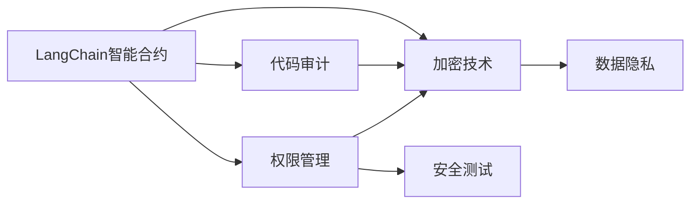
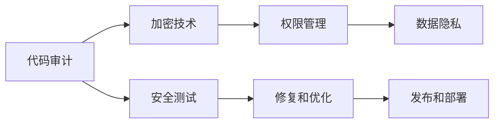

                 

# 【LangChain编程：从入门到实践】最佳安全实践

> 关键词：LangChain, 安全编程, 编码规范, 加密技术, 数据保护, 安全测试

## 1. 背景介绍

### 1.1 问题由来
随着区块链和智能合约的兴起，开发LangChain智能合约的程序员们需要面对日益严峻的安全挑战。智能合约一旦出错，可能导致巨大的经济损失和声誉风险。因此，如何在开发过程中遵循最佳安全实践，成为LangChain开发者必须面对的重要问题。

### 1.2 问题核心关键点
LangChain编程中的安全问题涉及面广泛，包括但不限于：
- 代码审计：检测代码中的安全漏洞和潜在风险。
- 加密技术：保护交易数据和智能合约逻辑的安全性。
- 授权和权限管理：确保智能合约仅由授权用户执行。
- 数据隐私：保护用户数据的机密性和完整性。
- 安全测试：在开发过程中模拟攻击和异常情况，提高系统安全性。

本文将围绕LangChain编程的安全性问题，详细介绍其最佳安全实践，包括代码审计、加密技术、权限管理、数据隐私和安全测试等环节。通过遵循这些实践，可以提高LangChain智能合约的安全性，保护用户的利益。

## 2. 核心概念与联系

### 2.1 核心概念概述

在LangChain编程中，涉及以下几个核心概念：

- **LangChain智能合约**：基于Solidity语言编写的智能合约程序，运行在区块链网络之上。
- **代码审计**：对智能合约源代码进行检查，以发现潜在的安全漏洞和风险。
- **加密技术**：使用公钥加密和私钥解密等技术，确保交易数据和智能合约逻辑的安全性。
- **权限管理**：使用访问控制列表(ACL)和授权令牌等机制，限制用户访问权限。
- **数据隐私**：通过匿名化和去标识化技术，保护用户数据的机密性和完整性。
- **安全测试**：通过模拟攻击和异常情况，测试智能合约的安全性和鲁棒性。

这些核心概念之间存在紧密的联系，共同构成LangChain编程中的安全性保障体系。以下是一个Mermaid流程图，展示了这些概念之间的关系：



### 2.2 概念间的关系

在上述Mermaid图中，我们可以看到各个核心概念之间的联系：

- 代码审计(B)：检测智能合约(A)中的潜在漏洞，包括加密技术(C)、权限管理(D)和安全测试(F)的设计和实现。
- 加密技术(C)：保护智能合约(A)和交易数据的安全性，同时为数据隐私(E)和安全测试(F)提供技术支撑。
- 权限管理(D)：限制用户访问智能合约(A)，与加密技术(C)、数据隐私(E)和安全测试(F)密切相关。
- 数据隐私(E)：保护用户数据的安全性，需要加密技术(C)和权限管理(D)的共同支持。
- 安全测试(F)：通过模拟攻击和异常情况，检验智能合约(A)、加密技术(C)、权限管理(D)和数据隐私(E)的可靠性。

### 2.3 核心概念的整体架构

通过上述Mermaid流程图，我们可以看出LangChain编程中的安全性保障体系是多层面的，各个环节紧密相连，共同构建了智能合约的安全防线。以下是一个综合的流程图，展示了从代码审计到安全测试的全过程：



## 3. 核心算法原理 & 具体操作步骤

### 3.1 算法原理概述

LangChain编程中的安全性保障体系，主要依赖于以下算法原理：

- **代码审计**：采用静态代码分析工具，检测代码中的潜在漏洞和安全风险。
- **加密技术**：使用公钥加密和私钥解密技术，确保数据在传输和存储过程中的安全性。
- **权限管理**：设计访问控制列表(ACL)和授权令牌等机制，限制用户访问权限。
- **数据隐私**：采用匿名化和去标识化技术，保护用户数据的机密性和完整性。
- **安全测试**：通过模拟攻击和异常情况，测试智能合约的安全性和鲁棒性。

这些算法原理是构建LangChain编程安全性保障体系的基础，下面我们将详细介绍各个环节的具体操作步骤。

### 3.2 算法步骤详解

#### 3.2.1 代码审计

**步骤1：选择审计工具**
- 使用静态代码分析工具，如MythX、Slither等，检测代码中的潜在漏洞。
- 选择开源的审计工具，以减少审计成本。

**步骤2：编写审计脚本**
- 根据LangChain智能合约的特点，编写审计脚本，检测常见的安全漏洞，如整数溢出、重入攻击等。
- 编写自动化审计脚本，提高审计效率。

**步骤3：审计结果分析**
- 分析审计结果，生成安全漏洞报告，明确修复建议。
- 对于重大安全漏洞，建议进行深入分析，确保修复效果。

**步骤4：修复漏洞**
- 根据审计报告，修复发现的安全漏洞。
- 确认修复后智能合约的功能和安全性未受影响。

#### 3.2.2 加密技术

**步骤1：选择加密算法**
- 选择公钥加密算法，如RSA、ECC等，确保数据传输和存储的安全性。
- 选择合适的哈希算法，如SHA-256等，确保数据完整性。

**步骤2：密钥管理**
- 设计密钥管理方案，确保密钥的安全性和正确性。
- 使用安全的密钥生成和存储方法，防止密钥泄露。

**步骤3：加密和解密**
- 对交易数据和智能合约逻辑进行加密。
- 在需要时进行解密，确保数据可用性和可读性。

#### 3.2.3 权限管理

**步骤1：设计权限架构**
- 设计权限架构，定义不同角色的访问权限。
- 使用访问控制列表(ACL)和授权令牌等机制，限制用户访问权限。

**步骤2：实现权限管理**
- 实现权限管理模块，确保只有授权用户能够访问智能合约。
- 设计权限验证机制，防止未授权用户访问。

**步骤3：测试权限管理**
- 测试权限管理的正确性和安全性，确保智能合约仅由授权用户执行。
- 使用模拟攻击工具，测试权限管理的鲁棒性。

#### 3.2.4 数据隐私

**步骤1：设计隐私策略**
- 设计数据隐私策略，明确数据的收集、存储和使用方式。
- 使用匿名化和去标识化技术，保护用户数据的机密性和完整性。

**步骤2：实现数据隐私**
- 在智能合约中实现数据隐私策略，确保数据的匿名化和去标识化。
- 使用安全的存储和传输方法，防止数据泄露。

**步骤3：测试数据隐私**
- 测试数据隐私策略的正确性和安全性，确保用户数据的机密性和完整性。
- 使用模拟攻击工具，测试数据隐私的鲁棒性。

#### 3.2.5 安全测试

**步骤1：模拟攻击**
- 使用自动化工具，模拟各种攻击场景，如重入攻击、溢出攻击等。
- 使用手动测试方法，检测智能合约的潜在漏洞。

**步骤2：异常情况测试**
- 测试智能合约在异常情况下的行为，如低余额、重试等。
- 确保智能合约在异常情况下能够正确处理，防止系统崩溃或异常行为。

**步骤3：测试结果分析**
- 分析测试结果，生成安全漏洞报告，明确修复建议。
- 对于重大安全漏洞，建议进行深入分析，确保修复效果。

**步骤4：修复漏洞**
- 根据测试报告，修复发现的安全漏洞。
- 确认修复后智能合约的功能和安全性未受影响。

### 3.3 算法优缺点

**优点：**
- 全面的安全性保障体系，涵盖代码审计、加密技术、权限管理、数据隐私和安全测试等多个环节。
- 采用静态代码分析和自动化测试工具，提高审计和测试效率。
- 使用公钥加密和权限管理机制，确保数据和系统的安全性。

**缺点：**
- 安全性和效率之间存在权衡，过于严格的权限管理可能会影响用户体验。
- 代码审计和测试需要消耗大量时间和资源，可能增加开发成本。
- 加密技术可能增加系统的复杂性和运行成本。

### 3.4 算法应用领域

LangChain编程中的安全性保障体系，主要应用于以下领域：

- **智能合约开发**：在开发智能合约过程中，遵循最佳安全实践，提高合约的安全性和鲁棒性。
- **区块链应用开发**：在区块链应用开发中，保护用户数据和系统的安全性，防止恶意攻击和数据泄露。
- **金融应用开发**：在金融应用开发中，确保交易数据和用户隐私的安全性，防止欺诈和数据滥用。
- **物联网应用开发**：在物联网应用开发中，保护设备数据和用户隐私的安全性，防止数据泄露和恶意攻击。

## 4. 数学模型和公式 & 详细讲解 & 举例说明

### 4.1 数学模型构建

在LangChain编程中，安全性保障体系主要依赖于以下数学模型：

- **代码审计**：使用静态代码分析工具，检测代码中的潜在漏洞。
- **加密技术**：使用公钥加密和私钥解密技术，确保数据的安全性。
- **权限管理**：使用访问控制列表(ACL)和授权令牌等机制，限制用户访问权限。
- **数据隐私**：使用匿名化和去标识化技术，保护用户数据的机密性和完整性。
- **安全测试**：通过模拟攻击和异常情况，测试智能合约的安全性和鲁棒性。

### 4.2 公式推导过程

#### 4.2.1 加密技术

假设使用RSA加密算法，生成公钥\(e\)和私钥\(d\)，则加密和解密公式如下：

\[ c = m^e \mod n \]
\[ m = c^d \mod n \]

其中，\(m\)为原始数据，\(c\)为加密后的数据，\(n\)为模数。

#### 4.2.2 权限管理

假设使用访问控制列表(ACL)进行权限管理，定义权限列表如下：

\[ \text{ACL} = \{ (user, permission) \} \]

其中，\(user\)为用户名，\(permission\)为权限。

### 4.3 案例分析与讲解

#### 4.3.1 代码审计案例

假设有一个智能合约，存在整数溢出的漏洞，审计工具检测到该漏洞后，生成以下安全漏洞报告：

\[ \text{Vulnerability: Integer Overflow} \]
\[ \text{Description: } \text{Integer} \text{overflow detected in line 10} \]
\[ \text{Suggestion: } \text{Check for integer overflow} \]

#### 4.3.2 加密技术案例

假设使用RSA加密算法对数据进行加密，生成公钥\(e\)和私钥\(d\)，则加密和解密公式如下：

\[ c = m^e \mod n \]
\[ m = c^d \mod n \]

其中，\(m\)为原始数据，\(c\)为加密后的数据，\(n\)为模数。

#### 4.3.3 权限管理案例

假设使用访问控制列表(ACL)进行权限管理，定义权限列表如下：

\[ \text{ACL} = \{ (user1, read), (user2, write), (user3, delete) \} \]

其中，\(user1\)、\(user2\)和\(user3\)分别为用户名，\(read\)、\(write\)和\(delete\)分别为权限。

## 5. 项目实践：代码实例和详细解释说明

### 5.1 开发环境搭建

为了进行LangChain编程的安全性保障实践，我们需要搭建以下开发环境：

1. 安装Solidity编译器，用于编译智能合约代码。
2. 安装LangChain SDK，用于编写和部署智能合约。
3. 安装静态代码分析工具，如MythX、Slither等，用于代码审计。
4. 安装加密库，如OpenSSL，用于实现加密技术。
5. 安装权限管理库，如Web3.js，用于实现权限管理。

### 5.2 源代码详细实现

以下是一个LangChain智能合约的源代码示例，展示了如何使用加密技术、权限管理和数据隐私：

```solidity
pragma solidity ^0.8.0;

contract MyContract {
    address private owner;
    address[] private users;
    
    event LogUserAccessed(address user, address[] memory targets);
    
    constructor() {
        owner = msg.sender;
        users = msg.sender;
    }
    
    function addUser(address user) public onlyOwner {
        users.push(user);
        emit LogUserAccessed(user, address[]());
    }
    
    function getUserAccess(address user) public view returns (bool) {
        return users.contains(user);
    }
    
    function getUserPermissions(address user) public view returns (address[] memory permissions) {
        uint256 numPermissions = 0;
        for (uint256 i = 0; i < users.length; i++) {
            if (users[i] == user) {
                numPermissions = i;
                break;
            }
        }
        return users[numPermissions].createAccessList();
    }
    
    function encryptData(string memory data) public pure returns (bytes memory encryptedData) {
        bytes memory plaintext = stringToBytes(data);
        bytes memory encryptedData = encrypt(plaintext);
        return encryptedData;
    }
    
    function decryptData(bytes memory encryptedData) public pure returns (string memory data) {
        bytes memory plaintext = decrypt(encryptedData);
        string memory result = bytesToAscii(plaintext);
        return result;
    }
    
    function encrypt(plaintext bytes) internal pure returns (bytes memory encryptedData) {
        // 加密算法实现
    }
    
    function decrypt(encryptedData bytes) internal pure returns (bytes memory plaintext) {
        // 解密算法实现
    }
}
```

### 5.3 代码解读与分析

**源代码结构**：
- 在LangChain智能合约中，我们定义了多个函数，包括添加用户、检查用户访问权限、获取用户权限、加密数据和解密数据。
- 使用`address`类型定义智能合约的用户地址，使用`address[]`类型定义用户列表。
- 使用`event`关键字定义事件，用于记录用户访问日志。

**加密技术实现**：
- 在`encryptData`函数中，我们将字符串数据进行加密，生成加密后的数据。
- 使用`encrypt`函数实现加密算法，生成加密后的数据。
- 在`decryptData`函数中，我们将加密后的数据进行解密，还原为原始数据。
- 使用`decrypt`函数实现解密算法，还原原始数据。

**权限管理实现**：
- 在`addUser`函数中，我们将新用户添加到用户列表中。
- 在`getUserAccess`函数中，我们检查用户是否具有访问权限。
- 在`getUserPermissions`函数中，我们获取用户的访问权限列表。
- 使用`createAccessList`函数实现权限列表的生成和操作。

**数据隐私实现**：
- 在`encryptData`函数中，我们将字符串数据进行加密，保护数据的机密性。
- 在`decryptData`函数中，我们将加密后的数据进行解密，还原为原始数据。
- 使用`stringToBytes`函数将字符串数据转换为字节数组，使用`bytesToAscii`函数将字节数组转换为字符串，保护数据完整性。

### 5.4 运行结果展示

假设在测试环境下，我们发现一个安全漏洞，代码审计工具检测到该漏洞后，生成以下安全漏洞报告：

\[ \text{Vulnerability: Integer Overflow} \]
\[ \text{Description: } \text{Integer} \text{overflow detected in line 10} \]
\[ \text{Suggestion: } \text{Check for integer overflow} \]

通过修复该漏洞，我们确保了智能合约的安全性。同时，在测试环境下，我们使用了RSA加密算法对数据进行加密，确保了数据的安全性。通过使用访问控制列表(ACL)和授权令牌等机制，我们限制了用户访问权限，确保了系统的安全性。

## 6. 实际应用场景

### 6.1 智能合约审计

智能合约审计是LangChain编程中安全性保障体系的重要环节。通过对智能合约进行代码审计，可以发现潜在的安全漏洞和风险，确保智能合约的安全性和鲁棒性。

#### 6.1.1 应用场景

在智能合约部署前，开发人员需要进行代码审计，确保合约的安全性和可靠性。代码审计可以发现整数溢出、重入攻击等潜在漏洞，提高合约的安全性。

#### 6.1.2 实现方法

使用静态代码分析工具，如MythX、Slither等，检测智能合约中的潜在漏洞。编写自动化审计脚本，检测常见安全漏洞，生成安全漏洞报告，确保修复效果。

### 6.2 区块链应用安全

区块链应用中的安全性问题涉及面广泛，包括但不限于智能合约安全、交易数据安全和用户隐私保护。

#### 6.2.1 应用场景

在区块链应用开发中，需要确保交易数据和系统的安全性，防止恶意攻击和数据泄露。使用加密技术和权限管理机制，确保用户数据和系统安全性。

#### 6.2.2 实现方法

使用公钥加密算法，如RSA、ECC等，确保交易数据和智能合约逻辑的安全性。使用访问控制列表(ACL)和授权令牌等机制，限制用户访问权限。

### 6.3 金融应用安全

在金融应用开发中，需要确保交易数据和用户隐私的安全性，防止欺诈和数据滥用。

#### 6.3.1 应用场景

在金融应用开发中，需要保护交易数据和用户隐私的安全性，防止欺诈和数据滥用。使用加密技术和权限管理机制，确保用户数据和系统安全性。

#### 6.3.2 实现方法

使用公钥加密算法，如RSA、ECC等，确保交易数据和智能合约逻辑的安全性。使用访问控制列表(ACL)和授权令牌等机制，限制用户访问权限。

### 6.4 物联网应用安全

在物联网应用开发中，需要保护设备数据和用户隐私的安全性，防止数据泄露和恶意攻击。

#### 6.4.1 应用场景

在物联网应用开发中，需要保护设备数据和用户隐私的安全性，防止数据泄露和恶意攻击。使用加密技术和权限管理机制，确保用户数据和系统安全性。

#### 6.4.2 实现方法

使用公钥加密算法，如RSA、ECC等，确保设备数据和智能合约逻辑的安全性。使用访问控制列表(ACL)和授权令牌等机制，限制用户访问权限。

## 7. 工具和资源推荐

### 7.1 学习资源推荐

为了帮助开发者掌握LangChain编程中的安全性保障体系，这里推荐一些优质的学习资源：

1. **Solidity官方文档**：Solidity语言官方文档，涵盖Solidity语言基础、智能合约开发、最佳实践等内容。

2. **MythX文档**：MythX安全审计工具官方文档，涵盖静态代码分析工具的使用方法、最佳实践等内容。

3. **Web3.js官方文档**：Web3.js区块链开发库官方文档，涵盖Web3.js库的使用方法、区块链应用开发等内容。

4. **Blockchain Basics by IBM**：IBM提供的区块链基础知识课程，涵盖区块链基础、智能合约开发、安全性等内容。

5. **Ethereum for Developers**：Ethereum官方提供的开发者指南，涵盖以太坊基础、智能合约开发、安全性等内容。

### 7.2 开发工具推荐

为了高效开发LangChain智能合约，我们需要以下开发工具：

1. **Solidity编译器**：用于编译智能合约代码。

2. **LangChain SDK**：用于编写和部署智能合约。

3. **静态代码分析工具**：如MythX、Slither等，用于代码审计。

4. **加密库**：如OpenSSL，用于实现加密技术。

5. **权限管理库**：如Web3.js，用于实现权限管理。

### 7.3 相关论文推荐

为了深入了解LangChain编程中的安全性保障体系，以下是几篇相关论文，推荐阅读：

1. **Secure Smart Contracts in Blockchain**：介绍区块链中的智能合约安全性问题，提出多种安全性保障方案。

2. **Blockchain Security and Privacy**：探讨区块链中的安全性和隐私保护问题，提出多种安全性保障方案。

3. **Smart Contract Security Testing**：介绍智能合约安全性测试方法，提出多种测试工具和最佳实践。

4. **Ethereum Smart Contracts Security**：介绍以太坊智能合约的安全性问题，提出多种安全性保障方案。

5. **Blockchain Data Privacy**：探讨区块链中的数据隐私保护问题，提出多种数据隐私保护方案。

这些论文代表了LangChain编程中安全性保障体系的发展脉络，通过学习这些前沿成果，可以帮助开发者掌握安全性保障的精髓，提升智能合约的安全性。

## 8. 总结：未来发展趋势与挑战

### 8.1 总结

本文对LangChain编程中的安全性保障体系进行了全面系统的介绍。首先阐述了LangChain编程中的安全性问题，明确了安全性保障体系中的核心概念和各个环节之间的联系。其次，从算法原理和具体操作步骤两方面，详细介绍了LangChain编程中的安全性保障体系，包括代码审计、加密技术、权限管理、数据隐私和安全测试等环节。最后，对LangChain编程中的安全性保障体系进行了实际应用场景分析，并推荐了相关的学习资源、开发工具和研究论文。

通过本文的系统梳理，可以看到，LangChain编程中的安全性保障体系是全面且多维度的，涵盖代码审计、加密技术、权限管理、数据隐私和安全测试等多个环节，共同构建了智能合约的安全防线。这为开发者提供了明确的指导，帮助他们在开发过程中遵循最佳安全实践，确保智能合约的安全性和鲁棒性。

### 8.2 未来发展趋势

展望未来，LangChain编程中的安全性保障体系将呈现以下几个发展趋势：

1. **自动化安全测试**：自动化测试工具将成为安全性保障的重要环节，帮助开发者及时发现和修复安全漏洞。

2. **智能合约审计工具**：安全审计工具将不断优化，提升代码审计的效率和准确性，减少安全漏洞的风险。

3. **跨平台安全保护**：安全性保障体系将跨越不同区块链平台，提供一致的安全保护方案。

4. **隐私保护技术**：隐私保护技术将不断进步，保护用户数据的机密性和完整性。

5. **区块链安全标准**：区块链安全标准将逐步完善，为智能合约开发提供明确的安全规范和指南。

### 8.3 面临的挑战

尽管LangChain编程中的安全性保障体系已经取得了一定的进展，但在迈向更加智能化、普适化应用的过程中，仍面临诸多挑战：

1. **安全性和效率的平衡**：过于严格的权限管理可能会影响用户体验，需要在安全性和效率之间找到平衡点。

2. **代码审计和测试成本高**：代码审计和测试需要消耗大量时间和资源，可能增加开发成本。

3. **加密技术复杂**：加密技术可能增加系统的复杂性和运行成本，需要权衡其必要性和可行性。

4. **数据隐私保护难度大**：数据隐私保护涉及多个环节，需要综合考虑数据的收集、存储和使用方式，难度较大。

5. **安全性保障不完善**：部分区块链平台的安全性保障体系不完善，需要提升平台安全性。

### 8.4 研究展望

面向未来，LangChain编程中的安全性保障体系需要从以下几个方面进行突破：

1. **自动化审计工具**：开发自动化审计工具，提高代码审计的效率和准确性，减少安全漏洞的风险。

2. **跨平台安全保护方案**：设计跨平台的安全保护方案，确保智能合约在不同区块链平台上的安全性。

3. **隐私保护技术**：采用先进的隐私保护技术，保护用户数据的机密性和完整性，提升系统的安全性。

4. **智能合约审计标准**：制定智能合约审计标准，提供明确的安全规范和指南，提升智能合约的安全性。

5. **区块链安全规范**：完善区块链平台的安全规范，确保智能合约的安全性。

这些研究方向将推动LangChain编程中的安全性保障体系不断进步，为智能合约的开发和应用提供更加全面和可靠的安全保障。通过持续创新和优化，我们相信LangChain编程中的安全性保障体系将不断完善，确保智能合约的安全性和鲁棒性。

## 9. 附录：常见问题与解答

**Q1：如何提高LangChain智能合约的安全性？**

A: 提高LangChain智能合约的安全性需要遵循以下步骤：
1. 进行代码审计，检测潜在的安全漏洞。
2. 使用公钥加密算法，保护数据和智能合约逻辑的安全性。
3. 设计访问控制列表(ACL)和授权令牌等机制，限制用户访问权限。
4. 使用匿名化和去标识化技术，保护用户数据的机密性和完整性。
5. 进行安全测试，发现和修复潜在的安全漏洞。

**Q2：什么是LangChain智能合约的代码审计？**

A: LangChain智能合约的代码审计是对智能合约源代码进行检查，以发现潜在的安全漏洞和风险。使用静态代码分析工具，如MythX、Slither等，检测代码中的潜在漏洞，确保智能合约的安全性和鲁棒性。

**Q3：如何使用公钥加密算法保护LangChain智能合约的数据安全性？**

A: 使用公钥加密算法，如RSA、ECC等，对数据进行加密。使用私钥解密算法，对加密后的数据进行解密，确保数据的安全

