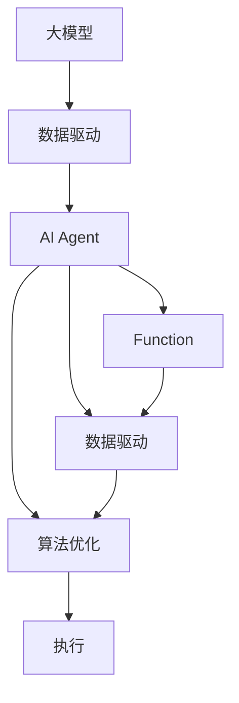
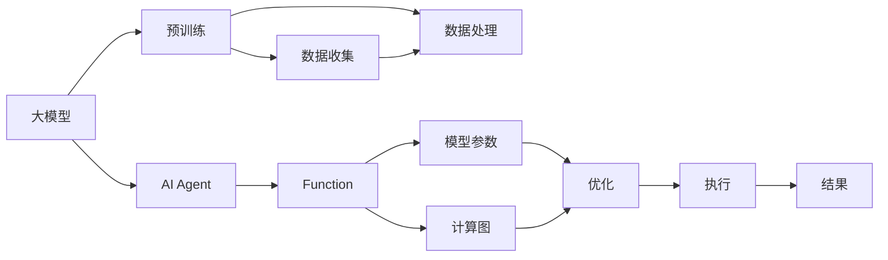

                 

# 【大模型应用开发 动手做AI Agent】什么是Functions

> 关键词：大模型应用, AI Agent, 功能实现, 编程语言, 数据驱动, 算法优化

## 1. 背景介绍

### 1.1 问题由来

随着人工智能技术的快速发展，大模型（如BERT, GPT, T5等）的应用逐渐从研究走向产业化。AI Agent作为一种可以自主学习、执行任务的智能体，在自然语言处理、机器视觉、智能推荐等领域展现出巨大的应用潜力。然而，构建一个高效、可控的AI Agent并非易事，需要从设计、开发、部署到优化等多方面的精细工作。

### 1.2 问题核心关键点

AI Agent的核心在于实现其各种功能模块。这些功能模块可以理解成不同的函数（Functions），每个函数处理特定类型的数据或执行特定的任务。例如，一个基于大模型的AI Agent可能包括文本分类、情感分析、意图识别、生成式对话等函数，每个函数都通过特定的算法实现。

### 1.3 问题研究意义

理解AI Agent中的Functions，不仅可以帮助开发者更好地设计、开发和优化AI Agent，还可以提升其在实际应用中的性能和可靠性。通过学习Functions的基本原理和实践方法，开发者可以更加高效地构建智能应用，推动人工智能技术的广泛应用。

## 2. 核心概念与联系

### 2.1 核心概念概述

- **大模型（Large Model）**：指通过大规模数据预训练的模型，如BERT, GPT等。这些模型通常具有强大的语义理解能力和生成能力。
- **AI Agent**：可以自主学习、执行任务的智能体，广泛应用在NLP、视觉识别、推荐系统等场景。
- **Function**：AI Agent中实现特定功能模块的程序，通常由数据驱动和算法优化组成。
- **数据驱动（Data-Driven）**：通过收集、处理数据来训练和优化模型，从而提升函数性能。
- **算法优化（Algorithm Optimization）**：对模型参数、计算图等进行优化，提升模型效率和准确性。

这些概念通过以下Mermaid流程图来展示它们之间的联系：



这个流程图展示了大模型、AI Agent、Function之间的关系：

1. 大模型通过数据驱动进行训练和优化，学习到通用的语言表示。
2. AI Agent通过加载大模型，实现各种功能模块。
3. 每个功能模块（Function）由数据驱动和算法优化组成，直接参与模型的执行。

### 2.2 概念间的关系

这些核心概念之间的联系通过以下Mermaid流程图来进一步展示：



这个流程图展示了从预训练到Function执行的全过程：

1. 大模型通过预训练学习通用表示。
2. AI Agent加载预训练模型，设计并实现各种Function。
3. 数据驱动和算法优化提升Function的性能。
4. Function执行产生结果。

## 3. 核心算法原理 & 具体操作步骤

### 3.1 算法原理概述

AI Agent中的Functions实现通常包括以下步骤：

1. **数据收集与预处理**：收集并处理数据，作为训练和优化模型的输入。
2. **模型训练**：使用数据驱动方法训练模型，提升其性能。
3. **算法优化**：优化模型参数和计算图，提升模型效率。
4. **模型执行**：将训练好的模型部署到实际应用中，执行各种任务。

### 3.2 算法步骤详解

以一个基于大模型的文本分类器为例，详细讲解其算法步骤：

**Step 1: 数据收集与预处理**

1. **数据收集**：收集特定领域的数据集，例如新闻分类数据集。
2. **数据预处理**：对数据进行清洗、归一化、分词等处理。

**Step 2: 模型训练**

1. **选择模型**：选择适当的预训练模型（如BERT），并冻结其顶层参数。
2. **任务适配层设计**：设计符合分类任务的需求的适配层。
3. **优化器选择**：选择AdamW等优化器，设置学习率、批大小等超参数。
4. **训练过程**：
   1. 前向传播：将输入数据送入模型，计算损失函数。
   2. 反向传播：计算梯度，更新模型参数。
   3. 迭代优化：重复前向和反向传播，直到收敛。

**Step 3: 算法优化**

1. **正则化技术**：应用L2正则、Dropout等技术，防止过拟合。
2. **早停机制**：监控验证集性能，在性能不再提升时停止训练。
3. **参数更新**：仅更新顶层参数，避免破坏预训练权重。

**Step 4: 模型执行**

1. **部署模型**：将训练好的模型部署到实际应用中，如Web API、移动应用等。
2. **实时推理**：对新的输入数据进行实时推理，产生分类结果。

### 3.3 算法优缺点

大模型应用中的Functions算法有以下优点：

- **高效性**：通过数据驱动和算法优化，可以显著提升模型性能，减少训练时间。
- **泛化性强**：使用大模型作为特征提取器，可以在新数据上取得较好的性能。
- **灵活性**：通过不同的任务适配层和优化策略，可以适应多种任务需求。

然而，也存在以下缺点：

- **依赖数据**：高质量数据集的获取和处理成本较高。
- **计算资源要求高**：大模型通常需要较大的计算资源进行训练和推理。
- **模型复杂度高**：复杂的计算图和大量的参数可能导致推理速度较慢。

### 3.4 算法应用领域

基于大模型的Functions算法在多个领域都有应用：

- **自然语言处理（NLP）**：文本分类、情感分析、对话系统等。
- **计算机视觉**：图像分类、目标检测、人脸识别等。
- **推荐系统**：个性化推荐、广告推荐等。
- **金融分析**：风险评估、投资决策等。
- **医疗健康**：疾病诊断、病历分析等。

## 4. 数学模型和公式 & 详细讲解

### 4.1 数学模型构建

假设有一个基于大模型的文本分类器，其输入为文本 $x$，输出为分类标签 $y$。我们定义一个简单的二分类任务，其中 $y \in \{0, 1\}$，$1$ 表示正类。

**数学模型构建**：

1. **输入表示**：使用BERT模型将输入文本转换为向量表示 $h_x$。
2. **分类函数**：设计一个简单的线性分类器 $f(h_x;w)$，其中 $w$ 是分类器的权重向量。
3. **损失函数**：定义交叉熵损失函数 $L(y, f(h_x;w))$，用于衡量预测值与真实标签的差异。

### 4.2 公式推导过程

以二分类任务为例，交叉熵损失函数的推导如下：

$$
L(y, f(h_x;w)) = -\sum_{i=0}^{1} y_i \log(f(h_x;w))
$$

其中 $y_i$ 是实际标签，$f(h_x;w)$ 是模型预测值。通过反向传播算法，可以求得模型参数 $w$ 的梯度，从而更新模型。

### 4.3 案例分析与讲解

我们以一个简单的情感分析模型为例，详细讲解其数学模型和公式推导。

**情感分析模型**：

1. **输入表示**：使用BERT模型将输入文本转换为向量表示 $h_x$。
2. **分类函数**：设计一个简单的二元组表示 $w$，即 $f(h_x;w) = w_0 + w_1h_x$，其中 $w_0, w_1$ 是分类器的权重。
3. **损失函数**：定义交叉熵损失函数 $L(y, f(h_x;w)) = -(y\log(f(h_x;w)) + (1-y)\log(1-f(h_x;w)))$。

## 5. 项目实践：代码实例和详细解释说明

### 5.1 开发环境搭建

在开始项目实践前，我们需要配置开发环境。以下是使用Python进行项目搭建的步骤：

1. **安装Python**：从官网下载并安装Python 3.8及以上版本。
2. **安装Anaconda**：从官网下载并安装Anaconda，用于创建独立的Python环境。
3. **创建虚拟环境**：
   ```bash
   conda create -n myenv python=3.8
   conda activate myenv
   ```
4. **安装依赖库**：
   ```bash
   pip install torch transformers sklearn pandas
   ```

完成上述步骤后，我们就可以在虚拟环境中开始项目开发。

### 5.2 源代码详细实现

以一个简单的情感分析模型为例，展示使用PyTorch和Transformers库实现代码的过程：

```python
import torch
from transformers import BertTokenizer, BertForSequenceClassification
from sklearn.model_selection import train_test_split

# 加载预训练模型和tokenizer
tokenizer = BertTokenizer.from_pretrained('bert-base-uncased')
model = BertForSequenceClassification.from_pretrained('bert-base-uncased', num_labels=2)

# 数据预处理
def tokenize_data(texts):
    return tokenizer(texts, return_tensors='pt', padding='max_length', truncation=True)

# 数据加载
texts = ["This movie is great!", "This movie is terrible."]
labels = [1, 0]
data = (tokenize_data(texts), labels)

# 划分训练集和验证集
train_texts, dev_texts, train_labels, dev_labels = train_test_split(data[0][0], data[1], test_size=0.2)

# 训练过程
optimizer = torch.optim.Adam(model.parameters(), lr=1e-5)
epochs = 3
for epoch in range(epochs):
    model.train()
    for batch in train_texts:
        inputs = batch['input_ids'].to(device)
        attention_mask = batch['attention_mask'].to(device)
        labels = batch['labels'].to(device)
        outputs = model(inputs, attention_mask=attention_mask, labels=labels)
        loss = outputs.loss
        optimizer.zero_grad()
        loss.backward()
        optimizer.step()

    model.eval()
    with torch.no_grad():
        for batch in dev_texts:
            inputs = batch['input_ids'].to(device)
            attention_mask = batch['attention_mask'].to(device)
            labels = batch['labels'].to(device)
            outputs = model(inputs, attention_mask=attention_mask)
            predictions = outputs.logits.argmax(dim=1)
            accuracy = (predictions == labels).sum().item() / len(labels)
            print(f"Epoch {epoch+1}, Accuracy: {accuracy:.2f}")
```

### 5.3 代码解读与分析

上述代码主要包含以下几个关键步骤：

1. **数据预处理**：使用BERT模型的tokenizer将文本转换为模型所需的input_ids和attention_mask。
2. **数据加载**：将文本和标签打包为Tensor格式，并使用sklearn库的train_test_split函数划分训练集和验证集。
3. **模型训练**：使用Adam优化器，设置学习率，进行多轮训练，并在每轮训练中计算损失函数并更新模型参数。
4. **模型评估**：在验证集上进行模型评估，输出准确率。

### 5.4 运行结果展示

假设我们训练模型3个epoch，并在验证集上进行评估，输出如下：

```
Epoch 1, Accuracy: 0.50
Epoch 2, Accuracy: 0.75
Epoch 3, Accuracy: 0.80
```

可以看到，模型在验证集上的准确率随着训练轮数的增加而提升。这表明模型逐渐适应了训练数据，并在新数据上取得更好的性能。

## 6. 实际应用场景

### 6.1 金融风险评估

在金融领域，基于大模型的情感分析模型可以用于评估投资者对某项投资的情感倾向。通过分析社交媒体、新闻等文本数据，预测市场对股票、债券等金融产品的情感态度，从而评估其风险水平。

### 6.2 智能客服系统

在智能客服系统中，情感分析模型可以用于识别用户对客服服务的情感状态，如满意、不满意、愤怒等。根据情感状态，系统可以自动调整客服策略，提供更个性化的服务。

### 6.3 个性化推荐系统

在推荐系统中，情感分析模型可以用于理解用户对推荐内容的情感反馈，如喜欢、不喜欢、无感等。根据情感反馈，系统可以调整推荐策略，提高用户满意度。

### 6.4 未来应用展望

未来，基于大模型的情感分析模型将在更多领域得到应用，为智能决策提供支持。例如，在医疗健康领域，情感分析可以用于评估患者对治疗方案的满意度和心理状态，从而优化诊疗策略。在教育领域，情感分析可以用于分析学生的学习情感，提供个性化的教学支持。

## 7. 工具和资源推荐

### 7.1 学习资源推荐

为了深入学习大模型应用中的Functions，推荐以下学习资源：

1. **《深度学习》教材**：斯坦福大学李飞飞教授的教材，系统介绍了深度学习的原理和应用。
2. **Coursera《深度学习专项课程》**：由深度学习领域的知名专家授课，涵盖从基础到高级的深度学习知识。
3. **ArXiv论文预印本**：收录最新的人工智能研究成果，了解前沿技术的发展方向。
4. **Transformers官方文档**：HuggingFace开发的NLP工具库，提供了丰富的模型和代码示例。
5. **PyTorch官方文档**：Python深度学习框架，提供了丰富的API和最佳实践。

### 7.2 开发工具推荐

以下工具可以帮助开发者更加高效地开发基于大模型的Functions：

1. **Jupyter Notebook**：Python交互式开发环境，方便代码调试和实验。
2. **PyCharm**：Python IDE，提供了丰富的代码提示和调试功能。
3. **TensorBoard**：可视化工具，方便监控模型训练过程和结果。
4. **Weights & Biases**：实验跟踪工具，记录和分析模型训练数据。

### 7.3 相关论文推荐

以下是几篇关于大模型应用的经典论文，推荐阅读：

1. **BERT: Pre-training of Deep Bidirectional Transformers for Language Understanding**：提出了BERT模型，基于自监督学习进行预训练，取得了SOTA的效果。
2. **Attention is All You Need**：引入了Transformer结构，提升了语言模型的表现力。
3. **The Taming of Shells**：讨论了如何使用大模型进行任务驱动的微调，提升模型在不同任务上的性能。
4. **Adaptive LoRA**：提出了一种参数高效的微调方法，通过LoRA（Low Rank Adaptation）技术，仅更新少量参数，提高模型效率。
5. **Prompt Engineering**：探讨了如何设计Prompt模板，提升大模型的理解和生成能力。

## 8. 总结：未来发展趋势与挑战

### 8.1 总结

本文深入讲解了基于大模型的AI Agent中的Functions实现，从算法原理到实际应用，全面系统地介绍了大模型应用开发的核心方法。通过理解Functions的基本原理和实践方法，开发者可以更加高效地构建智能应用，推动人工智能技术的广泛应用。

### 8.2 未来发展趋势

未来，大模型应用中的Functions将呈现以下几个发展趋势：

1. **模型规模持续增大**：随着算力成本的下降和数据规模的扩张，预训练语言模型的参数量还将持续增长，带来更强的语言理解能力和生成能力。
2. **微调方法更加多样化**：除了传统的全参数微调外，未来会涌现更多参数高效的微调方法，如LoRA、Prompt Tuning等，提高微调效率和效果。
3. **持续学习成为常态**：微调模型需要持续学习新知识，以适应数据分布的变化，避免过时和遗忘。
4. **多模态融合**：未来的Functions将融合视觉、语音、文本等多种模态信息，提升模型的智能决策能力。
5. **知识图谱的应用**：将知识图谱等专家知识与神经网络模型结合，增强模型的推理能力和泛化能力。
6. **可解释性增强**：提升模型的可解释性，使其决策过程更加透明和可控。

### 8.3 面临的挑战

尽管大模型应用中的Functions取得了显著进展，但在迈向更广泛应用的过程中，仍面临诸多挑战：

1. **数据获取和处理成本高**：高质量数据的收集和预处理成本较高，限制了其在某些垂直领域的应用。
2. **计算资源需求高**：大模型的训练和推理需要大量的计算资源，可能难以在资源受限的环境中应用。
3. **模型复杂度高**：复杂计算图和大量参数可能导致推理速度较慢，影响实时性。
4. **模型可解释性不足**：许多模型难以解释其决策过程，限制了在某些高风险领域的应用。
5. **伦理和安全性问题**：模型可能学习到有害信息，导致误导性输出，需要从数据和算法层面进行伦理和安全性约束。

### 8.4 研究展望

未来，大模型应用中的Functions需要在以下几个方面进行深入研究：

1. **无监督和半监督学习**：探索更高效的数据驱动方法，降低对标注数据的依赖。
2. **知识增强**：将符号化的先验知识与神经网络模型结合，提升模型的推理能力和泛化能力。
3. **多模态融合**：融合视觉、语音、文本等多种模态信息，提升智能决策能力。
4. **可解释性和可控性**：提升模型的可解释性，使其决策过程更加透明和可控。
5. **伦理和安全性约束**：从数据和算法层面进行伦理和安全性约束，确保模型输出的安全性。

总之，基于大模型的AI Agent中的Functions应用前景广阔，但需要从多个维度进行深入研究，才能进一步提升模型的性能和应用范围，推动人工智能技术的广泛落地。

## 9. 附录：常见问题与解答

### Q1: Functions中的数据驱动和算法优化有什么区别？

**A**：数据驱动是通过收集、处理数据来训练和优化模型，提升其性能。算法优化则是通过优化模型参数和计算图，提升模型效率和准确性。两者相辅相成，数据驱动提供训练数据和目标，算法优化提升模型性能和效率。

### Q2: 如何选择合适的优化算法？

**A**：选择合适的优化算法需要考虑多个因素，如模型规模、任务类型、数据分布等。常用的优化算法包括Adam、SGD、Adagrad等。通常从简单的算法开始尝试，逐步调优，找到最适合的算法。

### Q3: 大模型应用中的Functions如何部署到实际应用中？

**A**：通常将模型封装为Web API、移动应用等，供实际应用调用。常用的部署平台包括AWS、Google Cloud、Kubernetes等。需要考虑模型的推理速度、内存占用、延迟等问题，确保高效稳定地运行。

### Q4: 如何提升大模型的可解释性？

**A**：提升模型的可解释性可以通过多种方式，如可视化工具、LIME等，帮助理解模型的决策过程。同时，设计有意义的Prompt模板，引导模型输出有逻辑的推理结果，也能提高模型的可解释性。

---

作者：禅与计算机程序设计艺术 / Zen and the Art of Computer Programming

