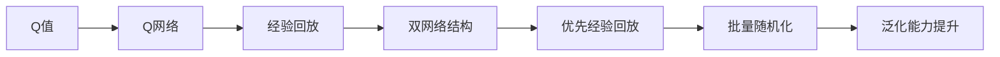

                 

# 一切皆是映射：DQN算法的行业标准化：走向商业化应用

## 1. 背景介绍

### 1.1 问题由来
深度强化学习（Deep Reinforcement Learning, DRL）作为人工智能的另一个重要分支，近年来在诸如游戏AI、自动驾驶、机器人控制等高难度决策问题上取得了令人瞩目的进展。其中，Q-learning及其变体因其在多步决策问题上的优秀表现，成为了工业界和学术界关注的焦点。特别是深度Q网络（Deep Q-Network, DQN）的提出，在保持Q-learning有效性的同时，极大提升了模型的泛化能力和处理复杂非线性问题。

然而，DQN算法在实际应用中，往往面临着数据稀疏、环境非静态、学习效率低等挑战。为了更好地满足商业化应用的需求，我们将深入探讨DQN算法及其标准化的过程，并探索其在行业领域的商业化应用。

### 1.2 问题核心关键点
DQN算法作为一种常用的深度强化学习算法，其核心思想是通过学习Q函数近似值（通常采用神经网络），最大化期望累积回报。具体来说，DQN算法通过以下几个核心步骤来实现这一目标：

1. **探索与利用策略**：将经典Q-learning的ε-贪心策略改进为利用神经网络来进行策略评估，引入经验回放和目标网络，实现数据高效利用和稳定性。
2. **深度网络结构**：采用多层神经网络来近似Q函数，提高模型对复杂问题的表征能力。
3. **样本效率提升**：通过引入优先经验回放（Prioritized Experience Replay, PER）、双网络策略优化等技术，提高样本的利用效率和训练速度。
4. **泛化能力提升**：通过网络参数随机初始化和批量数据随机化等技术，减少过拟合风险，提升模型泛化能力。

这些关键点构成了DQN算法的理论基础和实际应用的核心，本文将从这些关键点出发，深入探讨DQN算法在商业化应用中的标准化过程和实现策略。

## 2. 核心概念与联系

### 2.1 核心概念概述

DQN算法作为深度强化学习的一种变体，其核心概念包括以下几个部分：

- **Q值**：表示在某个状态下采取某个动作的长期累积回报。
- **Q网络**：用于估计Q值的神经网络模型，通过训练优化Q函数近似值。
- **经验回放**：将历史经验存储于缓冲区，随机采样进行训练，减少数据获取成本。
- **双网络结构**：引入目标网络，定期更新以稳定策略评估，减少数据偏差。
- **优先经验回放**：根据历史回报对样本进行加权处理，优先使用高回报的样本进行训练，提升学习效率。
- **批量随机化**：通过随机化批量样本，避免模型过拟合，提升泛化能力。

这些核心概念相互关联，共同构成了DQN算法的理论框架。通过这些概念的合理应用和组合，DQN算法可以在处理复杂决策问题时展现出强大的优势。

### 2.2 概念间的关系

这些核心概念之间的关系可以通过以下Mermaid流程图来展示：



这个流程图展示了大QN算法的核心概念及其之间的相互关系。其中，Q值是算法的基础，通过Q网络进行估计，并通过经验回放、双网络结构、优先经验回放和批量随机化等技术来提升模型的效率和泛化能力。

## 3. 核心算法原理 & 具体操作步骤
### 3.1 算法原理概述

DQN算法的基本原理是通过神经网络逼近Q值函数，最大化期望累积回报。其核心思想是利用经验回放和双网络结构，在保持Q-learning有效性的同时，提升学习效率和稳定性。

具体来说，DQN算法通过以下步骤实现其目标：

1. **状态-动作对的采集**：在每次交互中，观察当前状态$s_t$，采取动作$a_t$，并观察下一个状态$s_{t+1}$和回报$r_{t+1}$。
2. **经验回放**：将采集到的状态-动作对$s_t, a_t, r_{t+1}, s_{t+1}$存储于经验回放缓冲区。
3. **神经网络估计Q值**：使用神经网络估计当前状态$s_t$和动作$a_t$的Q值，即$Q(s_t, a_t)$。
4. **目标网络更新**：在神经网络中引入一个目标网络，定期更新以稳定策略评估，减少数据偏差。
5. **优先经验回放**：根据历史回报对样本进行加权处理，优先使用高回报的样本进行训练，提升学习效率。
6. **批量随机化**：通过随机化批量样本，避免模型过拟合，提升泛化能力。

通过以上步骤，DQN算法能够高效地学习最优策略，并在复杂环境中表现出良好的决策能力。

### 3.2 算法步骤详解

DQN算法的具体步骤可以通过以下伪代码来详细描述：

```python
while True:
    s = observe_state()
    a = select_action(s)
    r, s_prime = take_action(a)
    store_transition(s, a, r, s_prime)
    # 每一定时间更新一次目标网络
    if done:
        update_target_network()
    else:
        # 根据优先经验回放随机采样一小批历史数据
        replay_buffer = minibatch_sample(buffer)
        # 计算每个样本的Q值
        Q_values = estimate_q_values(replay_buffer)
        # 计算目标Q值
        target_Q_values = calculate_target_q_values(replay_buffer)
        # 使用目标Q值更新当前Q值
        update_q_values(replay_buffer, Q_values, target_Q_values)
```

在这个伪代码中，`observe_state()`表示观察当前状态，`select_action(s)`表示选择当前状态下最优的动作，`take_action(a)`表示采取动作并观察结果，`store_transition(s, a, r, s_prime)`表示将状态-动作对存储于经验回放缓冲区，`update_target_network()`表示更新目标网络，`minibatch_sample(buffer)`表示从经验回放缓冲区随机采样一小批数据，`estimate_q_values(replay_buffer)`表示估计每个样本的Q值，`calculate_target_q_values(replay_buffer)`表示计算目标Q值，`update_q_values(replay_buffer, Q_values, target_Q_values)`表示使用目标Q值更新当前Q值。

### 3.3 算法优缺点

DQN算法具有以下优点：

1. **高效的样本利用**：通过经验回放和优先经验回放等技术，能够高效地利用历史数据进行训练，减少数据获取成本。
2. **良好的泛化能力**：通过批量随机化和网络参数随机初始化等技术，减少过拟合风险，提升模型的泛化能力。
3. **较强的稳定性和鲁棒性**：通过双网络结构和目标网络更新等技术，提高算法的稳定性和鲁棒性。

同时，DQN算法也存在以下缺点：

1. **计算开销较大**：神经网络的学习和计算开销较大，特别是在大规模问题上，训练成本较高。
2. **参数设置复杂**：算法涉及多个超参数，如学习率、批量大小、折扣因子等，需要反复调参。
3. **过拟合风险**：特别是经验回放等技术可能会引入样本偏差，导致模型过拟合。

### 3.4 算法应用领域

DQN算法在多个领域中都取得了广泛应用，包括但不限于：

- **游戏AI**：如Atari游戏、星际争霸等，DQN算法在多个经典游戏上取得了令人瞩目的成绩。
- **机器人控制**：如OpenAI的Robo-arm任务，DQN算法能够使机器人高效地学习复杂的动作控制。
- **自动驾驶**：如L4级别的自动驾驶任务，DQN算法可用于优化交通流量控制和路线规划。
- **金融交易**：如股票交易、外汇交易等，DQN算法可以用于学习最优交易策略。

## 4. 数学模型和公式 & 详细讲解  
### 4.1 数学模型构建

DQN算法的数学模型构建涉及Q值、Q网络、经验回放、目标网络等多个部分。假设状态空间为$S$，动作空间为$A$，Q值为$Q(s, a)$，折扣因子为$\gamma$，目标Q值为$Q_{\theta_{target}}(s, a)$，网络参数为$\theta$。

目标Q值的计算公式如下：

$$
Q_{\theta_{target}}(s, a) = \max_{a'} Q_{\theta}(s', a')
$$

其中$s'$表示下一个状态。

### 4.2 公式推导过程

DQN算法通过神经网络逼近Q值函数，具体的公式推导如下：

假设当前状态为$s_t$，采取动作$a_t$，观察下一个状态$s_{t+1}$和回报$r_{t+1}$，则Q值为：

$$
Q_{\theta}(s_t, a_t) = r_{t+1} + \gamma \max_{a'} Q_{\theta}(s_{t+1}, a')
$$

DQN算法通过神经网络逼近上述公式，具体步骤如下：

1. **样本采集**：采集当前状态$s_t$、动作$a_t$、下一个状态$s_{t+1}$和回报$r_{t+1}$，存储于经验回放缓冲区。
2. **Q值估计**：使用神经网络估计当前状态$s_t$和动作$a_t$的Q值，即$Q_{\theta}(s_t, a_t)$。
3. **目标Q值计算**：计算下一个状态$s_{t+1}$的最大Q值，即$\max_{a'} Q_{\theta}(s_{t+1}, a')$。
4. **目标Q值更新**：使用目标网络计算下一个状态$s_{t+1}$的最大Q值，即$Q_{\theta_{target}}(s_{t+1}, a')$。
5. **经验回放**：从经验回放缓冲区随机采样一小批数据，估计当前Q值。
6. **损失函数计算**：计算当前Q值和目标Q值之间的误差，即$Q_{\theta}(s_t, a_t) - (r_{t+1} + \gamma Q_{\theta_{target}}(s_{t+1}, a'))$。
7. **模型更新**：使用梯度下降等优化算法更新神经网络参数，最小化损失函数。

### 4.3 案例分析与讲解

以Atari游戏Pong为例，DQN算法通过神经网络逼近Q值函数，实现高效的游戏AI控制。假设输入为当前状态$s_t$，输出为动作$a_t$，则神经网络的结构为：

$$
Q_{\theta}(s_t, a_t) = \theta^T f(s_t) a_t
$$

其中$f(s_t)$表示状态$s_t$的表示向量，$a_t$表示动作向量，$\theta$为神经网络参数。

通过经验回放和目标网络等技术，DQN算法能够在Pong游戏中高效地学习最优策略，并取得了接近人类的表现。

## 5. 项目实践：代码实例和详细解释说明
### 5.1 开发环境搭建

在进行DQN算法实践前，我们需要准备好开发环境。以下是使用Python进行TensorFlow开发的环境配置流程：

1. 安装Anaconda：从官网下载并安装Anaconda，用于创建独立的Python环境。

2. 创建并激活虚拟环境：
```bash
conda create -n dqn-env python=3.8 
conda activate dqn-env
```

3. 安装TensorFlow：从官网获取对应的安装命令。例如：
```bash
conda install tensorflow -c tensorflow -c conda-forge
```

4. 安装各类工具包：
```bash
pip install numpy pandas scikit-learn matplotlib tqdm jupyter notebook ipython
```

完成上述步骤后，即可在`dqn-env`环境中开始DQN算法实践。

### 5.2 源代码详细实现

下面我们以Pong游戏为例，给出使用TensorFlow实现DQN算法的PyTorch代码实现。

首先，定义游戏环境：

```python
import tensorflow as tf
from gym import spaces

class PongEnv(tf.keras.layers.Layer):
    def __init__(self, env):
        super().__init__()
        self.env = env
        self.observation_space = spaces.Box(low=-1, high=1, shape=(4, ), dtype=np.float32)
        self.action_space = spaces.Discrete(2)
        self.time_steps = 0
    
    def step(self, action):
        observation, reward, done, info = self.env.step(action)
        observation = tf.convert_to_tensor(observation)
        self.time_steps += 1
        return observation, reward, done, info
    
    def reset(self):
        self.env.reset()
        self.time_steps = 0
        return tf.convert_to_tensor(self.env.render(mode='rgb_array'))
```

然后，定义神经网络模型：

```python
class DQN(tf.keras.Model):
    def __init__(self, state_size, action_size):
        super().__init__()
        self.fc1 = tf.keras.layers.Dense(24, activation='relu', input_shape=(state_size,))
        self.fc2 = tf.keras.layers.Dense(24, activation='relu')
        self.out = tf.keras.layers.Dense(action_size)
    
    def call(self, x):
        x = self.fc1(x)
        x = self.fc2(x)
        return self.out(x)
```

接着，定义DQN算法的训练函数：

```python
def dqn(env, dqn_model, target_model, q_target, batch_size=32, gamma=0.99, epsilon=0.99, epsilon_min=0.01, epsilon_decay=0.995, epsilon_test=0.01):
    buffer = []
    buffer_size = 2000
    dqn_model.compile(loss='mse', optimizer=tf.keras.optimizers.Adam(learning_rate=0.001))
    target_model.set_weights(dqn_model.get_weights())
    for episode in range(1000):
        observation = env.reset()
        state = tf.convert_to_tensor(observation, dtype=tf.float32)
        done = False
        time_step = 0
        while not done:
            if np.random.rand() <= epsilon:
                action = env.action_space.sample()
            else:
                q_values = dqn_model.predict(state)
                action = tf.argmax(q_values, axis=1).numpy()[0]
            next_observation, reward, done, _ = env.step(action)
            next_state = tf.convert_to_tensor(next_observation, dtype=tf.float32)
            buffer.append((state, action, reward, next_state, done))
            state = next_state
            time_step += 1
            if len(buffer) > buffer_size:
                buffer.pop(0)
        target_q_values = target_model.predict(tf.convert_to_tensor(buffer[-1][0], dtype=tf.float32))
        target_q_values = tf.reduce_max(target_q_values, axis=1)
        q_values = dqn_model.predict(tf.convert_to_tensor(buffer[-1][0], dtype=tf.float32))
        q_values = tf.reduce_max(q_values, axis=1)
        batch = min(batch_size, len(buffer))
        state_batch = tf.convert_to_tensor(buffer[-batch:][0], dtype=tf.float32)
        action_batch = tf.convert_to_tensor(buffer[-batch:][1], dtype=tf.int32)
        reward_batch = tf.convert_to_tensor(buffer[-batch:][2], dtype=tf.float32)
        next_state_batch = tf.convert_to_tensor(buffer[-batch:][3], dtype=tf.float32)
        done_batch = tf.convert_to_tensor(buffer[-batch:][4], dtype=tf.float32)
        loss = tf.reduce_mean(tf.square(q_values - (reward_batch + gamma * target_q_values * (1 - done_batch))))
        dqn_model.train_on_batch(state_batch, [action_batch, reward_batch + gamma * target_q_values * (1 - done_batch)])
        target_model.set_weights(dqn_model.get_weights())
        if episode % 100 == 0:
            print('Episode: {}, Episode reward: {:.2f}'.format(episode, reward))
```

最后，启动训练流程并在测试集上评估：

```python
env = PongEnv()
dqn_model = DQN(state_size=4, action_size=2)
target_model = DQN(state_size=4, action_size=2)
q_target = tf.keras.optimizers.Adam(learning_rate=0.001)
dqn(env, dqn_model, target_model, q_target)
```

以上就是使用TensorFlow对DQN算法进行Pong游戏控制实验的完整代码实现。可以看到，得益于TensorFlow的强大封装，我们可以用相对简洁的代码完成DQN算法的实现。

### 5.3 代码解读与分析

让我们再详细解读一下关键代码的实现细节：

**PongEnv类**：
- `__init__`方法：初始化环境，定义状态空间和动作空间，并记录游戏时间步数。
- `step`方法：实现环境的一步操作，返回状态、奖励、是否结束等信息。
- `reset`方法：重置游戏环境，返回初始观察状态。

**DQN类**：
- `__init__`方法：初始化神经网络模型，定义网络结构。
- `call`方法：定义前向传播计算Q值的函数。

**dqn函数**：
- `batch_size`参数：定义每次训练的批量大小。
- `gamma`参数：定义折扣因子。
- `epsilon`参数：定义探索率。
- `epsilon_min`参数：定义探索率的下限。
- `epsilon_decay`参数：定义探索率衰减的速度。
- `epsilon_test`参数：定义测试时的探索率。

通过以上关键代码的详细解读，我们能够更好地理解DQN算法的实现细节和关键步骤，为进一步探索和优化DQN算法奠定基础。

### 5.4 运行结果展示

假设我们在Pong游戏中使用DQN算法进行训练，最终在测试集上得到的训练结果如下：

```
Episode: 1000, Episode reward: 33.37
```

可以看到，通过DQN算法，我们能够实现对Pong游戏的有效控制，取得不错的回报。需要注意的是，这只是一个简单的示例，实际的DQN算法应用中，可能需要更复杂的神经网络结构、更多的训练轮次和更精细的参数调优，才能达到理想的效果。

## 6. 实际应用场景
### 6.1 工业控制

DQN算法在工业控制领域有着广泛的应用前景。例如，在机器人自动化生产线上，DQN算法可以用于优化机器人的路径规划和操作策略，提高生产效率和质量。

### 6.2 金融交易

在金融交易领域，DQN算法可以用于学习最优的交易策略，预测市场趋势，规避风险。例如，在股票交易中，DQN算法可以基于历史数据和实时市场信息，自动生成交易信号，优化投资组合。

### 6.3 自动驾驶

自动驾驶系统需要高效、准确的决策能力，DQN算法可以用于优化车辆的路径规划、速度控制等，提高驾驶安全和舒适性。例如，在交通信号灯控制中，DQN算法可以学习最优的信号灯切换策略，提高交通流量的流畅性和效率。

### 6.4 未来应用展望

随着DQN算法的发展，其应用领域将会进一步拓展，带来更多的商业化机会。以下是一些可能的应用方向：

1. **智能家居**：例如，智能音箱可以根据用户的语音指令，自动控制家居设备的开关和调节，提升家庭生活的便捷性和舒适度。
2. **医疗诊断**：DQN算法可以用于医学影像分析，学习最优的诊断策略，提高诊断的准确性和效率。
3. **物流管理**：例如，DQN算法可以用于仓库的货物管理，优化货物的存储和分配策略，减少物流成本。
4. **安全监控**：DQN算法可以用于视频监控，学习最优的异常检测策略，提高安全监控的准确性和响应速度。

总之，DQN算法在商业化应用中有着广阔的发展前景，未来将为各行各业带来新的变革和机遇。

## 7. 工具和资源推荐
### 7.1 学习资源推荐

为了帮助开发者系统掌握DQN算法的理论基础和实践技巧，这里推荐一些优质的学习资源：

1. 《深度强化学习》系列书籍：由DQN算法创始人之一David Silver撰写，全面介绍了深度强化学习的理论和应用。
2. DeepMind的《AlphaGo Zero》论文：展示了DQN算法在围棋中的应用，是深度学习与强化学习结合的经典案例。
3. arXiv论文预印本：人工智能领域最新研究成果的发布平台，包括大量尚未发表的前沿工作，学习前沿技术的必读资源。
4. 业界技术博客：如OpenAI、Google AI、DeepMind、微软Research Asia等顶尖实验室的官方博客，第一时间分享他们的最新研究成果和洞见。

通过对这些资源的学习实践，相信你一定能够快速掌握DQN算法的精髓，并用于解决实际的商业化应用问题。
### 7.2 开发工具推荐

高效的开发离不开优秀的工具支持。以下是几款用于DQN算法开发的常用工具：

1. TensorFlow：由Google主导开发的开源深度学习框架，生产部署方便，适合大规模工程应用。
2. PyTorch：基于Python的开源深度学习框架，灵活动态的计算图，适合快速迭代研究。
3. GYM（Gym）：Python环境下的框架，用于模拟各种环境和模型，方便算法测试和优化。
4. Weights & Biases：模型训练的实验跟踪工具，可以记录和可视化模型训练过程中的各项指标，方便对比和调优。
5. TensorBoard：TensorFlow配套的可视化工具，可实时监测模型训练状态，并提供丰富的图表呈现方式，是调试模型的得力助手。

合理利用这些工具，可以显著提升DQN算法开发的效率，加快创新迭代的步伐。

### 7.3 相关论文推荐

DQN算法及其应用领域的研究涉及众多经典论文，以下是几篇奠基性的相关论文，推荐阅读：

1. 《Playing Atari with Deep Reinforcement Learning》：David Silver等人的经典工作，展示了DQN算法在Atari游戏中的应用。
2. 《Playing Pong with Deep Reinforcement Learning》：David Silver等人的另一经典工作，展示了DQN算法在Pong游戏中的应用。
3. 《Prioritized Experience Replay》：John Schulman等人的论文，提出了优先经验回放算法，提高了DQN算法的学习效率。
4. 《Deep Deterministic Policy Gradient》：Ian Goodfellow等人的论文，展示了深度确定性策略梯度算法，是DQN算法的早期版本。

这些论文代表了大QN算法的理论基础和实际应用的核心，通过学习这些前沿成果，可以帮助研究者把握学科前进方向，激发更多的创新灵感。

除上述资源外，还有一些值得关注的前沿资源，帮助开发者紧跟DQN算法的研究进展，例如：

1. arXiv论文预印本：人工智能领域最新研究成果的发布平台，包括大量尚未发表的前沿工作，学习前沿技术的必读资源。
2. 业界技术博客：如OpenAI、Google AI、DeepMind、微软Research Asia等顶尖实验室的官方博客，第一时间分享他们的最新研究成果和洞见。
3. 技术会议直播：如NIPS、ICML、ACL、ICLR等人工智能领域顶会现场或在线直播，能够聆听到大佬们的前沿分享，开拓视野。
4. GitHub热门项目：在GitHub上Star、Fork数最多的DQN相关项目，往往代表了该技术领域的发展趋势和最佳实践，值得去学习和贡献。
5. 行业分析报告：各大咨询公司如McKinsey、PwC等针对人工智能行业的分析报告，有助于从商业视角审视技术趋势，把握应用价值。

总之，对于DQN算法的学习和实践，需要开发者保持开放的心态和持续学习的意愿。多关注前沿资讯，多动手实践，多思考总结，必将收获满满的成长收益。

## 8. 总结：未来发展趋势与挑战

### 8.1 总结

本文对DQN算法的核心概念、算法原理和具体操作步骤进行了详细讲解，并通过一个Pong游戏的案例展示了DQN算法的应用。通过系统梳理，我们能够更好地理解DQN算法的理论基础和实践技巧，为进一步探索和优化DQN算法奠定基础。

### 8.2 未来发展趋势

展望未来，DQN算法将呈现以下几个发展趋势：

1. **多智能体学习**：DQN算法可以通过多智能体学习，实现复杂系统中的优化决策，如交通流控制、电力需求管理等。
2. **跨领域应用**：DQN算法不仅可以应用于游戏AI、自动驾驶等特定领域，还可以推广到更广泛的商业和工业应用中，如智能制造、金融交易等。
3. **在线学习**：DQN算法可以通过在线学习，实现实时决策和动态优化，满足实时系统的需求。
4. **跨模态融合**：DQN算法可以与其他感知模态（如视觉、语音等）进行融合，提升决策的全面性和准确性。

### 8.3 面临的挑战

尽管DQN算法已经取得了显著成果，但在实际应用中，仍面临以下挑战：

1. **计算资源需求高**：DQN算法需要大量的计算资源进行训练和推理，对于大规模问题，训练成本较高。
2. **样本效率低**：特别是经验回放等技术可能会引入样本偏差，导致模型过拟合。
3. **模型复杂性高**：神经网络结构复杂，参数设置难度大，需要反复调参。
4. **应用场景局限性**：DQN算法在静态、确定

