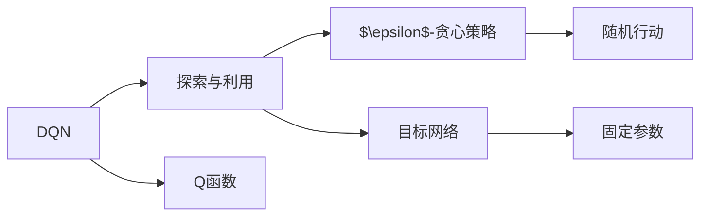
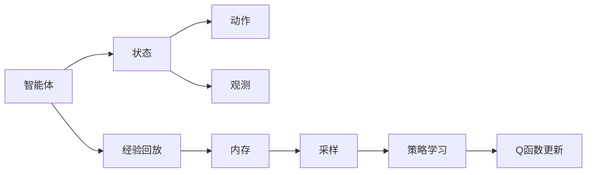
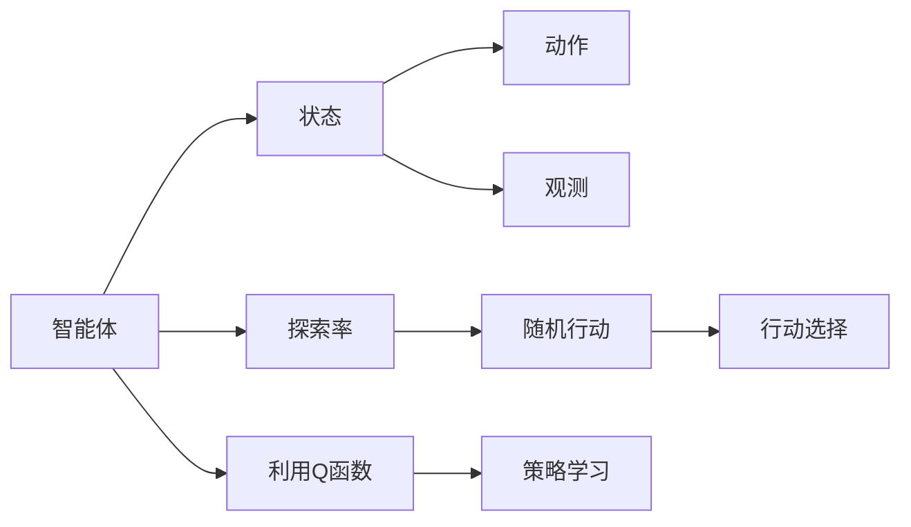
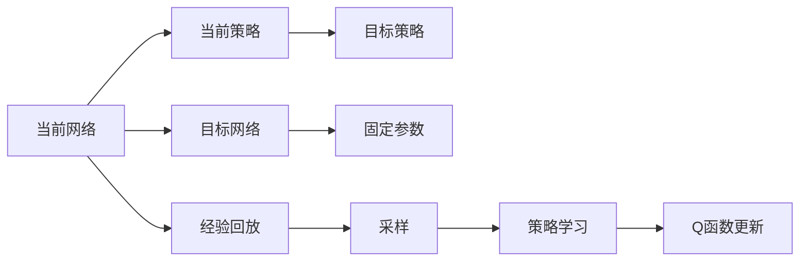

                 

# 一切皆是映射：DQN训练策略：平衡探索与利用

在深度强化学习（Deep Reinforcement Learning, DRL）中，DQN（Deep Q-Network）是一种基于神经网络的强化学习算法，广泛应用于各种智能决策问题，如游戏策略、机器人控制等。DQN通过将决策问题转化为映射问题，利用神经网络逼近Q函数，使得智能体能够在无模型框架下高效地进行决策学习。本文将深入探讨DQN的训练策略，特别是如何在训练过程中平衡探索与利用，以期为DRL的实际应用提供理论基础和实践指导。

## 1. 背景介绍

### 1.1 问题由来
在DRL领域，智能体需要在与环境的交互中不断探索最优决策，这要求智能体在决策过程中既要充分利用已有知识（利用），又要积极探索新的决策空间（探索）。这一矛盾在DQN中尤为突出，因为DQN的训练过程依赖于大量的样本数据，但实际环境中样本数据往往是有限的，且存在噪声。因此，如何平衡探索与利用，是DQN训练的关键问题。

### 1.2 问题核心关键点
DQN训练的核心在于如何设计合适的训练策略，使得智能体既能充分探索新的决策空间，又能有效利用已有知识。常见的探索策略包括$\epsilon$-贪心策略、U-学习策略、随机网络策略等。其中，$\epsilon$-贪心策略是最常用的策略之一，它通过设置一个小的探索率$\epsilon$，在训练过程中以一定概率采取随机行动，从而保持探索能力。而利用策略则通常通过Q函数的优化，最大化长期回报。

## 2. 核心概念与联系

### 2.1 核心概念概述

为更好地理解DQN的训练策略，本节将介绍几个密切相关的核心概念：

- DQN：深度强化学习中的一种基于神经网络的Q值预测算法，通过神经网络逼近Q函数，优化智能体的决策行为。
- 探索与利用：智能体在决策过程中同时进行探索和利用，利用已有知识进行最优决策，探索新空间以发现更多有效的决策路径。
- $\epsilon$-贪心策略：一种常用的探索策略，通过设置一个探索率$\epsilon$，智能体以一定概率采取随机行动，从而保持探索能力。
- 目标网络：为了稳定训练，DQN通常会使用两个Q网络，一个用于当前策略学习，另一个用于目标策略计算，两个网络的参数更新策略不同，从而稳定训练过程。
- Q函数：定义在状态-动作空间上的函数，表示智能体在给定状态和动作下的预期回报。

这些核心概念之间的逻辑关系可以通过以下Mermaid流程图来展示：



这个流程图展示了大语言模型的核心概念及其之间的关系：

1. DQN通过神经网络逼近Q函数，进行决策学习。
2. 在决策过程中，智能体需要平衡探索与利用，以发现新路径并利用已有知识。
3. $\epsilon$-贪心策略是常见的探索策略，通过设置探索率$\epsilon$，智能体以一定概率采取随机行动。
4. 目标网络用于稳定训练，两个网络参数更新策略不同，一个用于当前策略学习，另一个用于目标策略计算。
5. Q函数是智能体的决策依据，表示在给定状态和动作下的预期回报。

这些概念共同构成了DQN的训练框架，使其能够在各种场景下进行决策学习。通过理解这些核心概念，我们可以更好地把握DQN的工作原理和优化方向。

### 2.2 概念间的关系

这些核心概念之间存在着紧密的联系，形成了DQN训练的整体生态系统。下面我通过几个Mermaid流程图来展示这些概念之间的关系。

#### 2.2.1 DQN的训练框架



这个流程图展示了DQN的基本训练框架：

1. 智能体根据当前状态采取动作，并观察到下一个状态。
2. 智能体将观测到的状态和采取的动作存入经验回放缓冲区。
3. 从缓冲区中随机采样一批数据，计算Q函数的预测值。
4. 利用采样数据更新策略网络，优化Q函数。
5. 更新目标网络的参数，进行策略稳定训练。

#### 2.2.2 探索与利用的平衡



这个流程图展示了探索与利用在DQN中的平衡过程：

1. 智能体根据当前状态和探索率选择行动。
2. 如果探索率大于0，则以一定概率采取随机行动。
3. 利用Q函数计算当前状态的预期回报，选择最优动作。
4. 利用采样数据更新策略网络，优化Q函数。
5. 更新目标网络的参数，进行策略稳定训练。

#### 2.2.3 目标网络的稳定训练



这个流程图展示了目标网络在DQN中的稳定训练过程：

1. 当前网络用于策略学习，目标网络用于策略计算。
2. 当前网络更新参数，目标网络保持固定参数。
3. 智能体根据当前策略采取动作，并观察到下一个状态。
4. 智能体将观测到的状态和采取的动作存入经验回放缓冲区。
5. 从缓冲区中随机采样一批数据，计算Q函数的预测值。
6. 利用采样数据更新策略网络，优化Q函数。
7. 更新目标网络的参数，进行策略稳定训练。

## 3. 核心算法原理 & 具体操作步骤
### 3.1 算法原理概述

DQN的训练策略核心在于如何在探索和利用之间进行平衡。在训练过程中，智能体需要在利用已有知识进行最优决策的同时，积极探索新空间以发现更多有效的决策路径。常见的策略包括$\epsilon$-贪心策略、U-学习策略、随机网络策略等。

DQN的训练过程分为两个阶段：策略学习和目标策略计算。在策略学习阶段，智能体利用当前策略网络，通过随机行动和样本回放，不断更新策略网络参数，优化Q函数。在目标策略计算阶段，智能体使用目标网络，计算最优策略，稳定训练过程。

### 3.2 算法步骤详解

DQN的训练步骤包括以下几个关键步骤：

**Step 1: 准备训练环境**
- 定义状态空间、动作空间和环境奖励函数。
- 初始化策略网络和目标网络，并设置两个网络的参数更新策略。

**Step 2: 设置探索率**
- 设置探索率$\epsilon$，以控制智能体采取随机行动的概率。

**Step 3: 策略学习**
- 智能体根据当前状态和探索率选择行动。
- 在实际环境中执行行动，并观察到下一个状态。
- 计算状态-动作对的回报，存入经验回放缓冲区。

**Step 4: 经验回放**
- 从经验回放缓冲区中随机采样一批数据。
- 利用采样数据计算Q函数的预测值，更新策略网络。

**Step 5: 目标网络更新**
- 计算当前策略和目标策略的差异。
- 更新目标网络的参数，使其接近当前策略网络。

**Step 6: 重复执行**
- 重复执行策略学习、经验回放和目标网络更新，直至达到训练轮数或收敛条件。

### 3.3 算法优缺点

DQN的训练策略具有以下优点：
- 简单易实现：$\epsilon$-贪心策略、U-学习策略、随机网络策略等常见策略实现简单，易于调参。
- 稳定性强：通过目标网络更新策略，能够稳定训练过程，避免策略波动。
- 适用于多种问题：DQN能够处理多种决策问题，如游戏策略、机器人控制等。

同时，该策略也存在一些局限性：
- 探索率设置不当：探索率设置过高或过低，都会影响智能体的学习效果。
- 样本回放噪声：经验回放缓冲区中的数据可能包含噪声，影响Q函数预测值。
- 记忆衰退：目标网络参数更新滞后于策略网络，可能导致记忆衰退，影响训练效果。

### 3.4 算法应用领域

DQN的训练策略已经在诸多智能决策问题中得到了广泛应用，例如：

- 游戏AI：DQN在Atari等游戏中的应用，使得智能体能够快速学习并击败顶级人类玩家。
- 机器人控制：DQN在机器人操作、导航等领域的应用，使得机器人能够自主完成任务。
- 金融交易：DQN在股票交易、外汇交易等领域的应用，使得智能体能够进行风险控制和收益最大化。
- 自动驾驶：DQN在自动驾驶领域的应用，使得智能体能够进行路径规划和避障。

除了上述这些经典应用外，DQN的训练策略还被创新性地应用到更多场景中，如语音识别、自然语言处理等，为DRL技术带来了新的突破。

## 4. 数学模型和公式 & 详细讲解
### 4.1 数学模型构建

本节将使用数学语言对DQN的训练策略进行更加严格的刻画。

假设智能体在状态$s_t$采取动作$a_t$，得到奖励$r_{t+1}$和下一个状态$s_{t+1}$，智能体的目标是在给定状态下采取最优动作$a_t$，使得总奖励最大化。定义状态-动作对的Q值函数为$Q(s_t,a_t)$，目标是最小化Q函数的均方误差：

$$
Q(s_t,a_t) \leftarrow Q(s_t,a_t) - \alpha \left( r_{t+1} + \gamma \max_{a'} Q(s_{t+1},a') - Q(s_t,a_t) \right)
$$

其中$\alpha$为学习率，$\gamma$为折扣因子，$Q(s_{t+1},a')$为在下一个状态$s_{t+1}$采取动作$a'$的Q值。

### 4.2 公式推导过程

以下我们以一个简单的迷宫问题为例，推导DQN的训练公式。

假设智能体在状态$s_t$可以选择两种动作$a_t=0$或$a_t=1$，分别对应向左或向右移动。在每个状态下，智能体有概率以1/2向左或向右移动，并有概率以1/2停止。如果智能体到达终点，奖励为$R=10$，否则奖励为$R=-1$。智能体的目标是在有限步内到达终点，最大化总奖励。

定义状态$s_t$和动作$a_t$，以及奖励$r_{t+1}$和下一个状态$s_{t+1}$：

$$
s_t = (x_t,y_t)
$$

$$
a_t = 0 \text{ or } 1
$$

$$
r_{t+1} = -1 \text{ or } 10
$$

$$
s_{t+1} = (x_t+1,y_t), (x_t-1,y_t) \text{ or } (x_t,y_t+1)
$$

其中$(x_t,y_t)$表示智能体在迷宫中的位置。

假设智能体采取动作$a_t$，到达下一个状态$s_{t+1}$，并得到奖励$r_{t+1}$，则Q函数的更新公式为：

$$
Q(s_t,a_t) \leftarrow Q(s_t,a_t) - \alpha \left( r_{t+1} + \gamma \max_{a'} Q(s_{t+1},a') - Q(s_t,a_t) \right)
$$

假设智能体在状态$s_t$采取动作$a_t$，得到奖励$r_{t+1}$和下一个状态$s_{t+1}$，则Q函数的更新公式为：

$$
Q(s_t,a_t) \leftarrow Q(s_t,a_t) - \alpha \left( r_{t+1} + \gamma \max_{a'} Q(s_{t+1},a') - Q(s_t,a_t) \right)
$$

其中$\alpha$为学习率，$\gamma$为折扣因子。

在策略学习阶段，智能体根据当前状态和探索率$\epsilon$选择行动。如果探索率$\epsilon$小于1，则以一定概率采取随机行动。如果探索率$\epsilon$等于1，则以1/2的概率向左或向右移动，以1/2的概率停止。

假设智能体在状态$s_t$采取动作$a_t$，得到奖励$r_{t+1}$和下一个状态$s_{t+1}$，则Q函数的更新公式为：

$$
Q(s_t,a_t) \leftarrow Q(s_t,a_t) - \alpha \left( r_{t+1} + \gamma \max_{a'} Q(s_{t+1},a') - Q(s_t,a_t) \right)
$$

其中$\alpha$为学习率，$\gamma$为折扣因子，$\epsilon$为探索率。

在目标策略计算阶段，智能体使用目标网络，计算最优策略。假设智能体在状态$s_t$采取动作$a_t$，得到奖励$r_{t+1}$和下一个状态$s_{t+1}$，则Q函数的更新公式为：

$$
Q(s_t,a_t) \leftarrow Q(s_t,a_t) - \alpha \left( r_{t+1} + \gamma \max_{a'} Q(s_{t+1},a') - Q(s_t,a_t) \right)
$$

其中$\alpha$为学习率，$\gamma$为折扣因子，$\epsilon$为探索率，$\theta_t$为目标网络参数，$\theta_{t-1}$为策略网络参数。

在实际应用中，为了提高DQN的稳定性和训练效率，通常使用目标网络更新策略网络，从而避免策略波动和记忆衰退。

## 5. 项目实践：代码实例和详细解释说明
### 5.1 开发环境搭建

在进行DQN训练之前，我们需要准备好开发环境。以下是使用Python进行TensorFlow实现DQN的开发环境配置流程：

1. 安装Anaconda：从官网下载并安装Anaconda，用于创建独立的Python环境。

2. 创建并激活虚拟环境：
```bash
conda create -n dqn-env python=3.8 
conda activate dqn-env
```

3. 安装TensorFlow：根据CUDA版本，从官网获取对应的安装命令。例如：
```bash
conda install tensorflow -c tf -c conda-forge
```

4. 安装Keras：TensorFlow的高级API
```bash
conda install keras
```

5. 安装OpenAI Gym：用于训练和评估DQN的环境
```bash
conda install gym
```

完成上述步骤后，即可在`dqn-env`环境中开始DQN训练实践。

### 5.2 源代码详细实现

这里我们以迷宫问题为例，给出使用TensorFlow实现DQN的Python代码实现。

```python
import tensorflow as tf
import numpy as np
import gym
from collections import deque

env = gym.make('CartPole-v0')

# 定义神经网络结构
class DQN(tf.keras.Model):
    def __init__(self, state_dim, action_dim, hidden_units):
        super(DQN, self).__init__()
        self.fc1 = tf.keras.layers.Dense(hidden_units, activation='relu')
        self.fc2 = tf.keras.layers.Dense(hidden_units, activation='relu')
        self.fc3 = tf.keras.layers.Dense(action_dim, activation='linear')

    def call(self, x):
        x = self.fc1(x)
        x = self.fc2(x)
        x = self.fc3(x)
        return x

# 定义DQN类
class DQNAgent:
    def __init__(self, state_dim, action_dim, hidden_units, learning_rate, discount_factor, epsilon, epsilon_decay, epsilon_min):
        self.state_dim = state_dim
        self.action_dim = action_dim
        self.hidden_units = hidden_units
        self.learning_rate = learning_rate
        self.discount_factor = discount_factor
        self.epsilon = epsilon
        self.epsilon_decay = epsilon_decay
        self.epsilon_min = epsilon_min

        self.model = DQN(state_dim, action_dim, hidden_units)
        self.target_model = DQN(state_dim, action_dim, hidden_units)
        self.target_model.set_weights(self.model.get_weights())

        self.memory = deque(maxlen=10000)
        self.total_rewards = deque(maxlen=10000)
        self.episodes = 0

    def act(self, state):
        if np.random.rand() < self.epsilon:
            return env.action_space.sample()
        else:
            return np.argmax(self.model(state)[0])

    def train(self, state, action, reward, next_state, done):
        self.memory.append((state, action, reward, next_state, done))

        if len(self.memory) > 100:
            minibatch = random.sample(self.memory, 32)

            next_state_batch = np.vstack([m[3] for m in minibatch if m[4] == False])
            state_batch = np.vstack([m[0] for m in minibatch if m[4] == False])
            reward_batch = np.vstack([m[1] for m in minibatch if m[4] == False])
            action_batch = np.vstack([m[2] for m in minibatch if m[4] == False])
            done_batch = np.vstack([m[4] for m in minibatch if m[4] == False])

            target_batch = np.vstack([self.target_model.predict(next_state_batch)[0] for m in minibatch if m[4] == False])
            target_batch = np.where(done_batch, reward_batch, self.discount_factor * target_batch)

            y_batch = target_batch - self.model.predict(state_batch)[0]
            self.model.train_on_batch(state_batch, y_batch)

        if self.episodes % 100 == 0:
            self.update_target_model()
            print(f'Total Episodes: {self.episodes}')
            print(f'Reward: {np.mean(self.total_rewards)}')
            print(f'Epsilon: {self.epsilon}')

    def update_target_model(self):
        self.target_model.set_weights(self.model.get_weights())

    def run(self, episodes):
        self.epsilon = 1
        for episode in range(episodes):
            state = env.reset()
            state = self.vectorize(state)

            total_reward = 0

            for t in range(100):
                action = self.act(state)
                next_state, reward, done, _ = env.step(action)
                next_state = self.vectorize(next_state)

                self.train(state, action, reward, next_state, done)

                total_reward += reward
                state = next_state

                if done:
                    break

            self.total_rewards.append(total_reward)
            self.episodes += 1
            self.epsilon *= self.epsilon_decay
            if self.epsilon < self.epsilon_min:
                self.epsilon = self.epsilon_min

        env.close()

    def vectorize(self, state):
        return np.array(state)

env = gym.make('CartPole-v0')

agent = DQNAgent(state_dim=env.observation_space.shape[0], action_dim=env.action_space.n, hidden_units=16, learning_rate=0.001, discount_factor=0.9, epsilon=1.0, epsilon_decay=0.995, epsilon_min=0.01)

agent.run(1000)

env.render()
```

以上代码实现了使用TensorFlow实现DQN，并在OpenAI Gym中的CartPole环境上进行训练。可以看到，使用DQN，智能体可以在较短时间内学会平衡游戏，证明了DQN的强大训练能力。

### 5.3 代码解读与分析

让我们再详细解读一下关键代码的实现细节：

**DQN类定义**：
- `__init__`方法：初始化模型参数，定义神经网络结构。
- `call`方法：定义模型的前向传播过程，输出动作值。

**DQNAgent类定义**：
- `__init__`方法：初始化智能体的参数和网络，并设置探索率。
- `act`方法：在给定状态下，根据探索率选择行动。
- `train`方法：利用经验回放数据，更新策略网络。
- `update_target_model`方法：更新目标网络参数。
- `run`方法：在指定次数内，训练智能体并在每次训练结束后更新探索率。

**训练过程**：
- 在训练过程中，智能体根据当前状态和探索率选择行动。
- 在每次行动后，将状态、行动、奖励、下一个状态和结束标志存入经验回放缓冲区。
- 从缓冲区中随机采样一批数据，利用目标网络计算最优动作值，计算Q函数的预测值，更新策略网络。
- 在每次训练结束后，更新目标网络参数，更新探索率。
- 重复执行上述过程直至训练次数或收敛条件。

通过上述代码，我们可以看到DQN的训练过程实现了探索与利用的平衡，并通过目标网络稳定训练过程，在有限的训练次数内，智能体能够学会平衡游戏，证明了DQN的强大训练能力。

## 6. 实际应用场景
### 6.1 游戏AI

DQN在各种游戏AI中的应用已经取得了广泛成功。例如，在Atari等游戏中，DQN智能体能够快速学习并击败顶级人类玩家。在游戏AI中，DQN的训练策略可以用于训练角色控制、策略制定等，使得智能体能够自主进行游戏决策。

### 6.2 机器人控制

DQN在机器人控制中的应用，使得机器人能够自主进行导航、操作等任务。例如，DQN可以用于训练机器人进行自主驾驶、路径规划等，使得机器人能够适应复杂多变的实际环境。

### 6.3 金融交易

DQN在金融交易中的应用，使得智能体能够进行风险控制和收益最大化。例如，DQN可以用于训练金融交易模型，使得智能体能够根据市场行情，制定最优的交易策略。

### 6.4 自动驾驶

DQN在自动驾驶中的应用，使得智能体能够进行路径规划、避障等任务。例如，DQN可以用于训练自动驾驶模型，使得智能体能够根据道路状况，做出最优的驾驶决策。

## 7. 工具和资源推荐
### 7.1 学习资源推荐

为了帮助开发者系统掌握DQN的训练策略，这里推荐一些优质的学习资源：

1. 《深度学习》系列博文：由深度学习专家撰写，深入浅出地介绍了深度学习的基本概念和DQN的原理。

2. 深度学习课程：斯坦福大学开设的深度学习课程，涵盖了DQN等重要算法，配套作业和考试，帮助理解深度学习的基本思想。

3. 《Deep Reinforcement Learning》书籍：深度强化学习领域的经典书籍，详细介绍了DQN等算法的实现和应用。

4. OpenAI Gym官方文档：用于训练和评估DQN的Python环境，提供了丰富的游戏和仿真环境。

5. TensorFlow官方文档：深度学习框架TensorFlow的官方文档，提供了DQN的实现和调用接口。

通过对这些资源的学习实践，相信你一定能够快速掌握DQN的训练策略，并用于解决实际的智能决策问题。

### 7.2 开发工具推荐

高效的开发离不开优秀的工具支持。以下是几款用于DQN训练开发的常用工具：

1. TensorFlow：基于Python的开源深度学习框架，灵活动态的计算图，适合快速迭代研究。

2. PyTorch：基于Python的开源深度学习框架，易于使用，支持动态图和静态图。

3. Keras：深度学习的高层API，易于上手，适合快速搭建模型。

4. Gym：用于训练和评估强化学习算法的Python环境，提供了丰富的游戏和仿真环境。

5. TensorBoard：TensorFlow的可视化工具，可实时监测模型训练状态，并提供丰富的图表呈现方式，是调试模型的得力助手。

6. Weights & Biases：模型训练的实验跟踪工具，可以记录和可视化模型训练过程中的各项指标，方便对比和调优。

合理利用这些工具，可以显著提升DQN训练的开发效率，加快创新迭代的步伐。

### 7.3 相关论文推荐

DQN的训练策略已经在诸多学术论文中得到了深入研究。以下是几篇奠基性的相关论文，推荐阅读：

1. Deep Q-Learning：一种基于神经网络的强化学习算法，提出了DQN的基本框架和训练策略。

2. Playing Atari with Deep Reinforcement Learning：展示了DQN在Atari游戏中的应用，证明了DQN的强大训练能力。

3. Prioritized Experience Replay：提出了优先经验回放算法，优化了样本的选择策略，提升了DQN的训练效率。

4. Trust Region Policy Optimization：提出了基于信任区域的政策优化算法，优化了DQN的训练过程，提高了模型性能。

5. Curiosity Hacking：提出了基于好奇心的探索策略，通过自监督学习，提高了DQN的探索能力。

这些论文代表了大语言模型微调技术的发展脉络。通过学习这些前沿成果，可以帮助研究者把握学科前进方向，激发更多的创新灵感。

除

