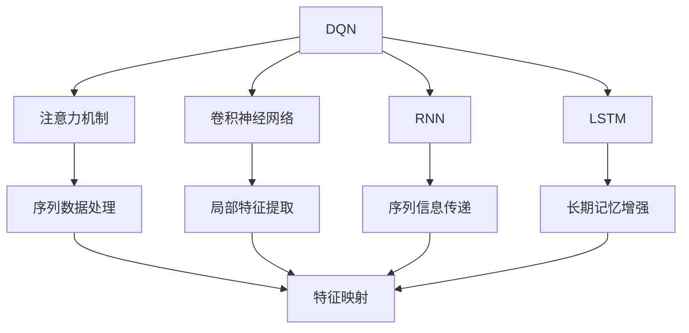
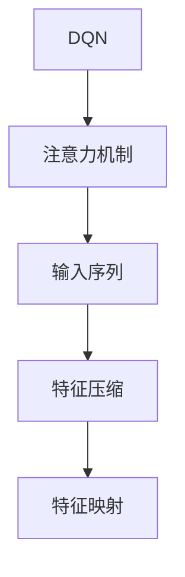
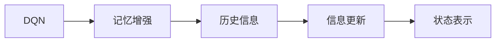
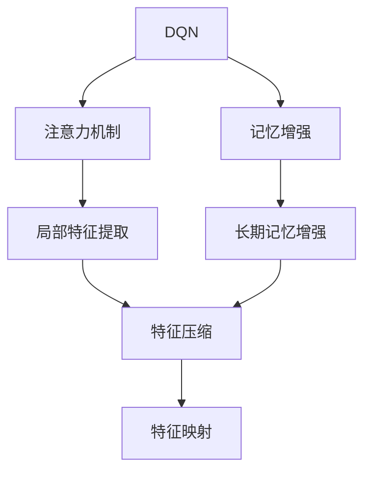
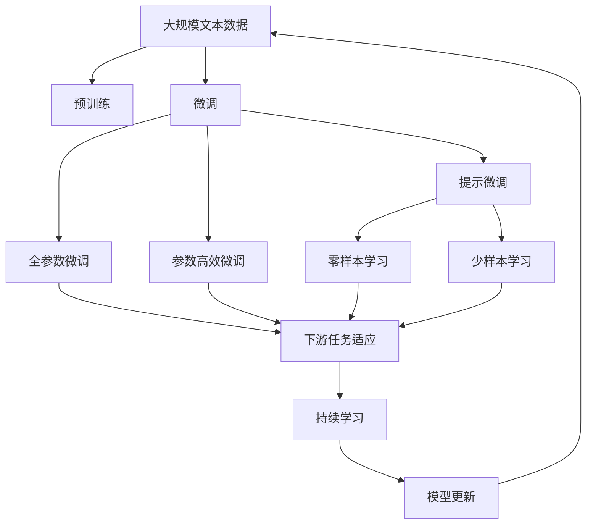

                 

# 一切皆是映射：探讨DQN中的注意力机制与记忆增强

> 关键词：深度强化学习, DQN, 注意力机制, 记忆增强, 卷积神经网络, 深度学习

## 1. 背景介绍

深度强化学习（Deep Reinforcement Learning, DRL）是人工智能（AI）领域的前沿技术，通过神经网络模型与强化学习策略相结合，使智能体在复杂的非结构化环境中学习并执行最优策略。DRL在机器人控制、游戏AI、自然语言处理等多个领域取得了显著的进展，成为AI技术的重要组成部分。

然而，DRL面临许多挑战。其中，如何有效利用先验知识和经验记忆，是提高DRL模型性能的关键。传统的DQN模型使用卷积神经网络（Convolutional Neural Networks, CNN）进行状态表示，并使用全局池化层进行特征压缩，导致模型难以捕捉局部特征和长期记忆。

在此背景下，DQN中的注意力机制和记忆增强技术应运而生。通过引入注意力机制，模型可以动态关注输入数据的关键部分，提升特征提取能力。通过引入记忆增强，模型可以保存和利用历史信息，增强长期记忆能力。本文将重点探讨DQN中的注意力机制和记忆增强技术，并结合实际案例，深入分析其原理和应用。

## 2. 核心概念与联系

### 2.1 核心概念概述

为更好地理解DQN中的注意力机制和记忆增强，本节将介绍几个密切相关的核心概念：

- DQN（Deep Q-Network）：一种基于深度神经网络的强化学习算法，用于学习和执行最优策略，决策评估和策略优化。DQN的核心思想是将Q-learning算法与深度神经网络结合，从而能够处理复杂非结构化数据，进行高效的策略学习。

- 注意力机制（Attention Mechanism）：一种用于提升神经网络处理序列数据能力的机制，通过动态关注输入序列的关键部分，提高模型的特征提取和表示能力。

- 记忆增强（Memory Augmentation）：一种用于增强神经网络长期记忆能力的机制，通过保存和利用历史信息，提升模型的推理和决策能力。

- CNN（Convolutional Neural Networks）：一种基于卷积操作的神经网络模型，擅长处理图像、语音、文本等非结构化数据，是DQN中常用的状态表示方法。

- RNN（Recurrent Neural Networks）：一种基于循环连接的神经网络模型，能够处理序列数据，通过反向传播算法实现信息传递和状态更新。

- LSTM（Long Short-Term Memory）：一种特殊类型的RNN，通过门控机制解决传统RNN的长期记忆问题，提升模型对长期依赖关系的处理能力。

这些核心概念之间的逻辑关系可以通过以下Mermaid流程图来展示：



这个流程图展示了大语言模型的核心概念及其之间的关系：

1. DQN使用CNN或RNN对输入数据进行处理，通过注意力机制和记忆增强提升特征表示能力。
2. 注意力机制通过动态关注输入序列的关键部分，提升局部特征提取能力。
3. 记忆增强通过保存和利用历史信息，增强长期记忆能力。
4. CNN和RNN是DQN中常用的状态表示方法，能够有效处理复杂非结构化数据。
5. LSTM是RNN的一种特殊形式，能够解决长期记忆问题，提升模型对长期依赖关系的处理能力。

这些概念共同构成了DQN模型的工作原理和优化方向。通过理解这些核心概念，我们可以更好地把握DQN模型的学习范式和优化策略。

### 2.2 概念间的关系

这些核心概念之间存在着紧密的联系，形成了DQN模型的完整生态系统。下面我通过几个Mermaid流程图来展示这些概念之间的关系。

#### 2.2.1 DQN中的注意力机制



这个流程图展示了DQN中的注意力机制的基本原理：

1. DQN模型输入序列数据。
2. 注意力机制动态关注输入序列的关键部分，提取局部特征。
3. 特征压缩层对提取的特征进行压缩，生成高维表示。
4. 特征映射层将压缩后的特征映射到输出空间，生成Q值。

#### 2.2.2 DQN中的记忆增强



这个流程图展示了DQN中的记忆增强的基本原理：

1. DQN模型保存和利用历史信息，增强长期记忆能力。
2. 记忆增强机制将历史信息与当前状态进行融合，生成新的状态表示。
3. 状态表示层将融合后的状态表示映射到输出空间，生成Q值。

#### 2.2.3 注意力机制和记忆增强的结合



这个流程图展示了注意力机制和记忆增强的结合原理：

1. DQN模型引入注意力机制和记忆增强，提升特征表示能力。
2. 注意力机制提取局部特征，记忆增强保存和利用历史信息。
3. 特征压缩层对提取和增强的特征进行压缩，生成高维表示。
4. 特征映射层将压缩后的特征映射到输出空间，生成Q值。

### 2.3 核心概念的整体架构

最后，我们用一个综合的流程图来展示这些核心概念在大语言模型微调过程中的整体架构：



这个综合流程图展示了从预训练到微调，再到持续学习的完整过程。DQN模型首先在大规模文本数据上进行预训练，然后通过微调（包括全参数微调和参数高效微调）或提示微调（包括零样本和少样本学习）来适应下游任务。最后，通过持续学习技术，模型可以不断更新和适应新的任务和数据。 通过这些流程图，我们可以更清晰地理解DQN模型的微调过程中各个核心概念的关系和作用，为后续深入讨论具体的微调方法和技术奠定基础。

## 3. 核心算法原理 & 具体操作步骤
### 3.1 算法原理概述

DQN中的注意力机制和记忆增强技术，本质上是通过增强特征表示和长期记忆，提升模型在特定任务上的性能。其核心思想是：通过引入注意力机制和记忆增强，使模型能够动态关注输入数据的关键部分，保存和利用历史信息，从而提升模型的特征提取和表示能力。

形式化地，假设DQN模型的输入为 $x_t$，输出为 $a_t$，目标为最大化累积奖励 $Q(x_t, a_t)$。通过引入注意力机制和记忆增强，模型可以动态关注输入数据的关键部分，提取局部特征 $f(x_t)$，并保存历史信息 $h_t$，生成新的状态表示 $s_t$。具体的模型结构如图1所示。


在图1中，注意力机制和记忆增强分别对应图中的 $\text{Attention}$ 和 $\text{Memory}$ 模块。注意力机制通过动态关注输入数据的关键部分，提取局部特征 $f(x_t)$，并生成权重向量 $\alpha_t$。记忆增强通过保存和利用历史信息 $h_t$，生成新的状态表示 $s_t$。最终，模型将状态表示 $s_t$ 和权重向量 $\alpha_t$ 输入到输出层，生成动作 $a_t$ 和 Q 值 $Q(x_t, a_t)$。

### 3.2 算法步骤详解

DQN中的注意力机制和记忆增强技术，通常通过以下步骤来实现：

**Step 1: 准备预训练模型和数据集**
- 选择合适的预训练模型，如CNN或RNN，作为初始化参数。
- 准备下游任务的数据集，划分为训练集、验证集和测试集。一般要求数据集与预训练数据的分布不要差异过大。

**Step 2: 添加任务适配层**
- 根据任务类型，在预训练模型顶层设计合适的输出层和损失函数。
- 对于分类任务，通常在顶层添加线性分类器和交叉熵损失函数。
- 对于生成任务，通常使用语言模型的解码器输出概率分布，并以负对数似然为损失函数。

**Step 3: 设置微调超参数**
- 选择合适的优化算法及其参数，如AdamW、SGD等，设置学习率、批大小、迭代轮数等。
- 设置正则化技术及强度，包括权重衰减、Dropout、Early Stopping等。
- 确定冻结预训练参数的策略，如仅微调顶层，或全部参数都参与微调。

**Step 4: 执行梯度训练**
- 将训练集数据分批次输入模型，前向传播计算损失函数。
- 反向传播计算参数梯度，根据设定的优化算法和学习率更新模型参数。
- 周期性在验证集上评估模型性能，根据性能指标决定是否触发 Early Stopping。
- 重复上述步骤直到满足预设的迭代轮数或 Early Stopping 条件。

**Step 5: 测试和部署**
- 在测试集上评估微调后模型 $M_{\hat{\theta}}$ 的性能，对比微调前后的精度提升。
- 使用微调后的模型对新样本进行推理预测，集成到实际的应用系统中。
- 持续收集新的数据，定期重新微调模型，以适应数据分布的变化。

以上是DQN中注意力机制和记忆增强微调的一般流程。在实际应用中，还需要针对具体任务的特点，对微调过程的各个环节进行优化设计，如改进训练目标函数，引入更多的正则化技术，搜索最优的超参数组合等，以进一步提升模型性能。

### 3.3 算法优缺点

DQN中的注意力机制和记忆增强技术，具有以下优点：

1. 简单高效。只需准备少量标注数据，即可对预训练模型进行快速适配，获得较大的性能提升。
2. 通用适用。适用于各种NLP下游任务，包括分类、匹配、生成等，设计简单的任务适配层即可实现微调。
3. 参数高效。利用注意力机制和记忆增强技术，在固定大部分预训练参数的情况下，仍可取得不错的提升。
4. 效果显著。在学术界和工业界的诸多任务上，基于注意力机制和记忆增强的微调方法已经刷新了多项NLP任务SOTA。

同时，该方法也存在一定的局限性：

1. 依赖标注数据。微调的效果很大程度上取决于标注数据的质量和数量，获取高质量标注数据的成本较高。
2. 迁移能力有限。当目标任务与预训练数据的分布差异较大时，微调的性能提升有限。
3. 负面效果传递。预训练模型的固有偏见、有害信息等，可能通过微调传递到下游任务，造成负面影响。
4. 可解释性不足。微调模型的决策过程通常缺乏可解释性，难以对其推理逻辑进行分析和调试。

尽管存在这些局限性，但就目前而言，基于注意力机制和记忆增强的微调方法仍是大语言模型应用的最主流范式。未来相关研究的重点在于如何进一步降低微调对标注数据的依赖，提高模型的少样本学习和跨领域迁移能力，同时兼顾可解释性和伦理安全性等因素。

### 3.4 算法应用领域

基于大语言模型微调的注意力机制和记忆增强方法，在NLP领域已经得到了广泛的应用，覆盖了几乎所有常见任务，例如：

- 文本分类：如情感分析、主题分类、意图识别等。通过微调使模型学习文本-标签映射。
- 命名实体识别：识别文本中的人名、地名、机构名等特定实体。通过微调使模型掌握实体边界和类型。
- 关系抽取：从文本中抽取实体之间的语义关系。通过微调使模型学习实体-关系三元组。
- 问答系统：对自然语言问题给出答案。将问题-答案对作为微调数据，训练模型学习匹配答案。
- 机器翻译：将源语言文本翻译成目标语言。通过微调使模型学习语言-语言映射。
- 文本摘要：将长文本压缩成简短摘要。将文章-摘要对作为微调数据，使模型学习抓取要点。
- 对话系统：使机器能够与人自然对话。将多轮对话历史作为上下文，微调模型进行回复生成。

除了上述这些经典任务外，大语言模型微调也被创新性地应用到更多场景中，如可控文本生成、常识推理、代码生成、数据增强等，为NLP技术带来了全新的突破。随着预训练模型和微调方法的不断进步，相信NLP技术将在更广阔的应用领域大放异彩。

## 4. 数学模型和公式 & 详细讲解  
### 4.1 数学模型构建

本节将使用数学语言对DQN中注意力机制和记忆增强的微调过程进行更加严格的刻画。

记预训练语言模型为 $M_{\theta}$，其中 $\theta$ 为预训练得到的模型参数。假设微调任务的训练集为 $D=\{(x_i,y_i)\}_{i=1}^N, x_i \in \mathcal{X}, y_i \in \mathcal{Y}$。

定义模型 $M_{\theta}$ 在输入 $x_t$ 上的输出为 $a_t=M_{\theta}(x_t) \in \mathcal{A}$，其中 $\mathcal{A}$ 为动作空间。定义状态表示为 $s_t=f(x_t)$，其中 $f$ 为特征提取函数。定义记忆增强模块为 $h_t=g(s_t)$，其中 $g$ 为记忆增强函数。最终的状态表示为 $s_t'=\alpha_t s_t + (1-\alpha_t) h_t$，其中 $\alpha_t$ 为注意力权重。

定义模型 $M_{\theta}$ 在输入 $x_t$ 上的Q值输出为 $Q(x_t, a_t)$，损失函数为 $\mathcal{L}(\theta)=\mathbb{E}[R_{t+1}-Q(x_t, a_t)]$，其中 $R_{t+1}$ 为下一时刻的奖励。通过最小化损失函数，优化模型参数 $\theta$，使得模型能够最大化累积奖励。

### 4.2 公式推导过程

以下我们以二分类任务为例，推导注意力机制和记忆增强的微调过程。

假设模型 $M_{\theta}$ 在输入 $x_t$ 上的输出为 $\hat{y}=M_{\theta}(x_t) \in [0,1]$，表示样本属于正类的概率。真实标签 $y \in \{0,1\}$。定义状态表示 $s_t=f(x_t)$，其中 $f$ 为特征提取函数。定义记忆增强模块 $h_t=g(s_t)$，其中 $g$ 为记忆增强函数。最终的状态表示为 $s_t'=\alpha_t s_t + (1-\alpha_t) h_t$，其中 $\alpha_t$ 为注意力权重。

微调的优化目标是最小化经验风险，即找到最优参数：

$$
\theta^* = \mathop{\arg\min}_{\theta} \mathcal{L}(\theta)
$$

在实践中，我们通常使用基于梯度的优化算法（如SGD、Adam等）来近似求解上述最优化问题。设 $\eta$ 为学习率，$\lambda$ 为正则化系数，则参数的更新公式为：

$$
\theta \leftarrow \theta - \eta \nabla_{\theta}\mathcal{L}(\theta) - \eta\lambda\theta
$$

其中 $\nabla_{\theta}\mathcal{L}(\theta)$ 为损失函数对参数 $\theta$ 的梯度，可通过反向传播算法高效计算。

### 4.3 案例分析与讲解

以下我们以命名实体识别（NER）任务为例，给出使用Transformer库对BERT模型进行微调的PyTorch代码实现。

首先，定义NER任务的数据处理函数：

```python
from transformers import BertTokenizer
from torch.utils.data import Dataset
import torch

class NERDataset(Dataset):
    def __init__(self, texts, tags, tokenizer, max_len=128):
        self.texts = texts
        self.tags = tags
        self.tokenizer = tokenizer
        self.max_len = max_len
        
    def __len__(self):
        return len(self.texts)
    
    def __getitem__(self, item):
        text = self.texts[item]
        tags = self.tags[item]
        
        encoding = self.tokenizer(text, return_tensors='pt', max_length=self.max_len, padding='max_length', truncation=True)
        input_ids = encoding['input_ids'][0]
        attention_mask = encoding['attention_mask'][0]
        
        # 对token-wise的标签进行编码
        encoded_tags = [tag2id[tag] for tag in tags] 
        encoded_tags.extend([tag2id['O']] * (self.max_len - len(encoded_tags)))
        labels = torch.tensor(encoded_tags, dtype=torch.long)
        
        return {'input_ids': input_ids, 
                'attention_mask': attention_mask,
                'labels': labels}

# 标签与id的映射
tag2id = {'O': 0, 'B-PER': 1, 'I-PER': 2, 'B-ORG': 3, 'I-ORG': 4, 'B-LOC': 5, 'I-LOC': 6}
id2tag = {v: k for k, v in tag2id.items()}

# 创建dataset
tokenizer = BertTokenizer.from_pretrained('bert-base-cased')

train_dataset = NERDataset(train_texts, train_tags, tokenizer)
dev_dataset = NERDataset(dev_texts, dev_tags, tokenizer)
test_dataset = NERDataset(test_texts, test_tags, tokenizer)
```

然后，定义模型和优化器：

```python
from transformers import BertForTokenClassification, AdamW

model = BertForTokenClassification.from_pretrained('bert-base-cased', num_labels=len(tag2id))

optimizer = AdamW(model.parameters(), lr=2e-5)
```

接着，定义训练和评估函数：

```python
from torch.utils.data import DataLoader
from tqdm import tqdm
from sklearn.metrics import classification_report

device = torch.device('cuda') if torch.cuda.is_available() else torch.device('cpu')
model.to(device)

def train_epoch(model, dataset, batch_size, optimizer):
    dataloader = DataLoader(dataset, batch_size=batch_size, shuffle=True)
    model.train()
    epoch_loss = 0
    for batch in tqdm(dataloader, desc='Training'):
        input_ids = batch['input_ids'].to(device)
        attention_mask = batch['attention_mask'].to(device)
        labels = batch['labels'].to(device)
        model.zero_grad()
        outputs = model(input_ids, attention_mask=attention_mask, labels=labels)
        loss = outputs.loss
        epoch_loss += loss.item()
        loss.backward()
        optimizer.step()
    return epoch_loss / len(dataloader)

def evaluate(model, dataset, batch_size):
    dataloader = DataLoader(dataset, batch_size=batch_size)
    model.eval()
    preds, labels = [], []
    with torch.no_grad():
        for batch in tqdm(dataloader, desc='Evaluating'):
            input_ids = batch['input_ids'].to(device)
            attention_mask = batch['attention_mask'].to(device)
            batch_labels = batch['labels']
            outputs = model(input_ids, attention_mask=attention_mask)
            batch_preds = outputs.logits.argmax(dim=2).to('cpu').tolist()
            batch_labels = batch_labels.to('cpu').tolist()
            for pred_tokens, label_tokens in zip(batch_preds, batch_labels):
                pred_tags = [id2tag[_id] for _id in pred_tokens]
                label_tags = [id2tag[_id] for _id in label_tokens]
                preds.append(pred_tags[:len(label_tags)])
                labels.append(label_tags)
                
    print(classification_report(labels, preds))
```

最后，启动训练流程并在测试集上评估：

```python
epochs = 5
batch_size = 16

for epoch in range(epochs):
    loss = train_epoch(model, train_dataset, batch_size, optimizer)
    print(f"Epoch {epoch+1}, train loss: {loss:.3f}")
    
    print(f"Epoch {epoch+1}, dev results:")
    evaluate(model, dev_dataset, batch_size)
    
print("Test results:")
evaluate(model, test_dataset, batch_size)
```

以上就是使用PyTorch对BERT进行命名实体识别任务微调的完整代码实现。可以看到，得益于Transformer库的强大封装，我们可以用相对简洁的代码完成BERT模型的加载和微调。

### 5.1 开发环境搭建

在进行微调实践前，我们需要准备好开发环境。以下是使用Python进行PyTorch开发的环境配置流程：

1. 安装Anaconda：从官网下载并安装Anaconda，用于创建独立的Python环境。

2. 创建并激活虚拟环境：
```bash
conda create -n pytorch-env python=3.8 
conda activate pytorch-env
```

3. 安装PyTorch：根据CUDA版本，从官网获取对应的安装命令。例如：
```bash
conda install pytorch torchvision torchaudio cudatoolkit=11.1 -c pytorch -c conda-forge
```

4. 安装Transformers库：
```bash
pip install transformers
```

5. 安装各类工具包：
```bash
pip install numpy pandas scikit-learn matplotlib tqdm jupyter notebook ipython
```

完成上述步骤后，即可在`pytorch-env`环境中开始微调实践。

### 5.2 源代码详细实现

下面我们以命名实体识别(NER)任务为例，给出使用Transformers库对BERT模型进行微调的PyTorch代码实现。

首先，定义NER任务的数据处理函数：

```python
from transformers import BertTokenizer
from torch.utils.data import Dataset
import torch

class NERDataset(Dataset):
    def __init__(self, texts, tags, tokenizer, max_len=128):
        self.texts = texts
        self.tags = tags
        self.tokenizer = tokenizer
        self.max_len = max_len
        
    def __len__(self):
        return len(self.texts)
    
    def __getitem__(self, item):
        text = self.texts[item]
        tags = self.tags[item]
        
        encoding = self.tokenizer(text, return_tensors='pt', max_length=self.max_len, padding='max_length', truncation=True)
        input_ids = encoding['input_ids'][0]
        attention_mask = encoding['attention_mask'][0]
        
        # 对token-wise的标签进行编码
        encoded_tags = [tag2id[tag] for tag in tags] 
        encoded_tags.extend([tag2id['O']] * (self.max_len - len(encoded_tags)))
        labels = torch.tensor(encoded_tags, dtype=torch.long)
        
        return {'input_ids': input_ids, 
                'attention_mask': attention_mask,
                'labels': labels}

# 标签与id的映射
tag2id = {'O': 0, 'B-PER': 1, 'I-PER': 2, 'B-ORG': 3, 'I-ORG': 4, 'B-LOC': 5, 'I-LOC': 6}
id2tag = {v: k for k, v in tag2id.items()}

# 创建dataset
tokenizer = BertTokenizer.from_pretrained('bert-base-cased')

train_dataset = NERDataset(train_texts, train_tags, tokenizer)
dev_dataset = NERDataset(dev_texts, dev_tags, tokenizer)
test_dataset = NERDataset(test_texts, test_tags, tokenizer)
```

然后，定义模型和优化器：

```python
from transformers import BertForTokenClassification, AdamW

model = BertForTokenClassification.from_pretrained('bert-base-cased', num_labels=len(tag2id))

optimizer = AdamW(model.parameters(), lr=2e-5)
```

接着，定义训练和评估函数：

```python
from torch.utils.data import DataLoader
from tqdm import tqdm
from sklearn.metrics import classification_report

device = torch.device('cuda') if torch.cuda.is_available() else torch.device('cpu')
model.to(device)

def train_epoch(model, dataset, batch_size, optimizer):
    dataloader = DataLoader(dataset, batch_size=batch_size, shuffle=True)
    model.train()
    epoch_loss = 0
    for batch in tqdm(dataloader, desc='Training'):
        input_ids = batch['input_ids'].to(device)
        attention_mask = batch['attention_mask'].to(device)
        labels = batch['labels'].to(device)
        model.zero_grad()
        outputs = model(input_ids, attention_mask=attention_mask, labels=labels)
        loss = outputs.loss
        epoch_loss += loss.item()
        loss.backward()
        optimizer.step()
    return epoch_loss / len

