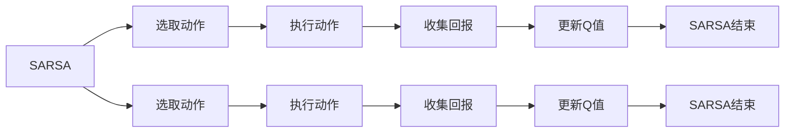
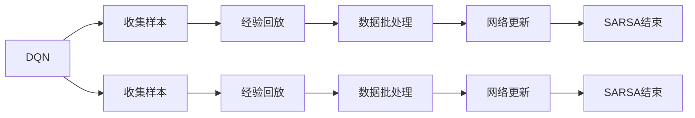
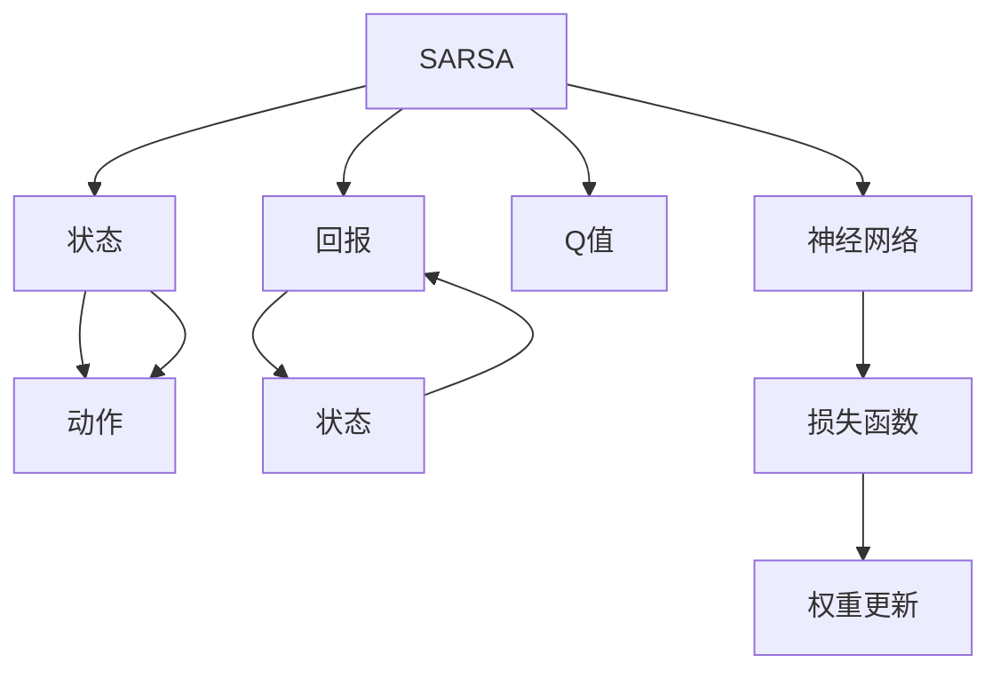

                 

## 1. 背景介绍

### 1.1 问题由来

在强化学习领域，有两个重要的基础算法：状态-动作-奖励-状态（SARSA）和深度Q网络（DQN）。这两个算法虽然目标一致，都是为了学习最优的策略，但在实施过程中有诸多差异，这些差异导致了不同的应用场景和结果。本篇文章将深入对比这两种算法，探索它们的区别与优化方法。

### 1.2 问题核心关键点

SARSA和DQN算法的核心在于对动作值函数（Q函数）的更新。SARSA采用经典蒙特卡罗方法的扩展，通过逐步探索和利用旧状态-动作对来估计新状态-动作对的价值。而DQN则通过深度神经网络，通过近似估计Q函数，从而更高效地更新策略。两种算法的区别主要体现在：

1. **Q函数的更新方式**：SARSA通过蒙特卡罗方法来更新，而DQN通过神经网络近似更新。
2. **样本数据的利用方式**：SARSA利用老的状态-动作对来估计新状态-动作对的价值，而DQN则对所有样本进行学习。
3. **目标与回报的定义**：SARSA在每次迭代中只关注一次交互的回报，而DQN通过经验回放策略，对所有交互的回报进行学习。
4. **收敛性**：SARSA收敛性分析较为成熟，但收敛速度较慢，而DQN通过近似Q函数更新，收敛速度较快。

这些关键点直接决定了SARSA和DQN在实际应用中的表现。

### 1.3 问题研究意义

对比和优化SARSA与DQN算法，有助于理解强化学习的基本原理和算法选择，为选择合适的算法提供依据。同时，深入理解它们的应用领域和优缺点，有助于在实际问题中灵活应用，提升决策过程的效率和效果。

## 2. 核心概念与联系

### 2.1 核心概念概述

为了深入对比SARSA和DQN，我们需要对这两个算法的核心概念进行深入理解：

- **SARSA**：一种基于蒙特卡罗方法的强化学习算法，用于估计Q值（即在特定状态下执行特定动作的价值）。SARSA主要关注当前状态和动作的Q值，通过状态-动作-回报的序列进行逐步更新。
- **DQN**：一种通过深度神经网络近似估计Q函数的强化学习算法。DQN通过经验回放和目标网络，在每次更新时同时考虑所有样本的回报，从而更好地泛化。

这两个算法的基本流程可简单描述如下：





以上两个流程图展示了SARSA和DQN的基本流程。它们的核心思想是通过逐步更新Q函数来优化策略，从而提升决策效果。

### 2.2 概念间的关系

SARSA和DQN算法的基本思想是相通的，都是通过逐步优化策略来达到最优解。两者的主要区别在于Q函数的更新方式和样本数据的利用方式。下面是具体的概念关系图：



### 2.3 核心概念的整体架构

综上所述，SARSA和DQN算法的核心概念可以归纳为：

1. **状态**：当前系统所处的状态，即系统需要决策的信息集合。
2. **动作**：系统可以采取的行动，在实际应用中可能包括多种维度，如动作的连续性、离散性等。
3. **回报**：系统执行动作后得到的奖励，通常以数值形式表示。
4. **Q值**：在特定状态下执行特定动作的价值，即策略的优劣度量。
5. **策略**：系统决策的依据，即在特定状态下采取何种动作。

## 3. 核心算法原理 & 具体操作步骤

### 3.1 算法原理概述

SARSA和DQN算法都是强化学习的经典算法，它们的原理可简单描述如下：

- SARSA算法：通过蒙特卡罗方法逐步更新Q值，即通过当前状态和动作，结合奖励和下一个状态-动作对，逐步更新当前状态-动作对的Q值。
- DQN算法：通过深度神经网络近似Q值，结合经验回放和目标网络，对所有样本进行学习和更新。

两者均通过优化Q函数来更新策略，以提升系统的决策效果。

### 3.2 算法步骤详解

**SARSA算法的具体步骤**：

1. 初始化Q值表和策略函数。
2. 选择当前状态s，并根据策略函数π(s)选择动作a。
3. 在当前状态s执行动作a，并得到回报r和下一个状态s'。
4. 计算下一个状态-动作对的Q值。
5. 更新当前状态-动作对的Q值。
6. 回到步骤2，重复执行直至策略收敛。

**DQN算法的具体步骤**：

1. 初始化神经网络Q(s)和策略函数π(s)。
2. 从环境中收集一个状态-动作对(s, a)。
3. 将(s, a)放入经验缓冲区。
4. 通过经验回放策略从缓冲区随机采样一批样本。
5. 使用目标网络Q(s')估计Q(s', a')。
6. 使用采样样本更新神经网络Q(s)。
7. 通过ε-greedy策略选择动作a，回到步骤2，重复执行直至策略收敛。

### 3.3 算法优缺点

SARSA算法的优点是原理简单，易于实现，适用于小规模问题。其缺点是收敛速度较慢，易受状态分布的影响。

DQN算法的优点是收敛速度较快，可以处理大规模问题。其缺点是需要大量内存和计算资源，难以处理非离散动作。

### 3.4 算法应用领域

SARSA算法适用于小规模、简单问题的强化学习，如游戏、机器人等。

DQN算法适用于大规模、复杂问题的强化学习，如自动驾驶、股票交易等。

## 4. 数学模型和公式 & 详细讲解 & 举例说明

### 4.1 数学模型构建

SARSA算法和DQN算法的数学模型可以简单描述如下：

- SARSA：\( Q_{t+1}(s_t, a_t) = Q_{t}(s_t, a_t) + \alpha [r_t + \gamma Q_{t}(s_{t+1}, a_{t+1}) - Q_{t}(s_t, a_t)] \)
- DQN：\( Q_{t+1}(s_t, a_t) = Q_{t}(s_t, a_t) + \alpha [r_t + \gamma Q_{t}(s_{t+1}, a_{t+1}) - Q_{t}(s_t, a_t)] \)

其中，\( Q_t(s_t, a_t) \) 表示在状态\( s_t \)下执行动作\( a_t \)的Q值，\( \alpha \) 表示学习率，\( \gamma \) 表示折扣因子。

### 4.2 公式推导过程

以SARSA算法的Q值更新为例，其数学推导过程如下：

1. 假设当前状态为\( s_t \)，执行动作\( a_t \)，得到回报\( r_t \)和下一个状态\( s_{t+1} \)。
2. Q值更新公式：
   \[
   Q_{t+1}(s_t, a_t) = Q_{t}(s_t, a_t) + \alpha [r_t + \gamma Q_{t}(s_{t+1}, a_{t+1}) - Q_{t}(s_t, a_t)]
   \]
3. 上式可以进一步化简为：
   \[
   Q_{t+1}(s_t, a_t) = (1 - \alpha) Q_{t}(s_t, a_t) + \alpha [r_t + \gamma Q_{t}(s_{t+1}, a_{t+1})]
   \]
4. 因此，Q值的更新可以看作是一个加权平均，权重为\( 1 - \alpha \)。

### 4.3 案例分析与讲解

以打砖块游戏为例，假设当前状态是某一位置，动作是向上下左右移动，回报是每次碰到砖块加一分。通过SARSA算法，我们可以逐步优化移动策略，从而在每次移动时得到最优的回报。

## 5. 项目实践：代码实例和详细解释说明

### 5.1 开发环境搭建

为了实现SARSA和DQN算法，需要安装Python和相关的深度学习库，如TensorFlow和PyTorch。

1. 安装Python和相关库：
   ```bash
   pip install tensorflow
   pip install pytorch
   ```
2. 安装TensorBoard和Matplotlib：
   ```bash
   pip install tensorboard matplotlib
   ```

### 5.2 源代码详细实现

以下是使用TensorFlow实现SARSA算法的代码示例：

```python
import tensorflow as tf
import numpy as np

# 定义环境
env = tf.contrib.rl.environments.cartpole.CartPoleEnv()

# 定义状态和动作
num_states = env.observation_space.shape[0]
num_actions = env.action_space.n

# 定义Q值表和策略函数
Q = np.zeros((num_states, num_actions))
pi = np.random.rand(num_states)

# 定义学习率和折扣因子
alpha = 0.1
gamma = 0.9

# 定义训练过程
for i in range(1000):
    # 选择动作
    s = np.random.randint(0, num_states)
    a = np.random.randint(0, num_actions)
    
    # 执行动作并得到回报和下一个状态
    r, s', done = env.step(a)
    
    # 计算Q值更新
    Q[s, a] += alpha * (r + gamma * np.max(Q[s', :]) - Q[s, a])
    
    # 更新策略函数
    pi[s] = np.max(Q[s, :])
    
    # 记录训练进度
    if i % 100 == 0:
        print(f"Iteration {i}: Q值 = {Q[s, a]}, 策略 = {pi[s]}, 奖励 = {r}, 完成 = {done}")
```

使用PyTorch实现DQN算法的代码示例：

```python
import torch
import torch.nn as nn
import torch.optim as optim

# 定义环境
env = tf.contrib.rl.environments.cartpole.CartPoleEnv()

# 定义状态和动作
num_states = env.observation_space.shape[0]
num_actions = env.action_space.n

# 定义神经网络
class DQN(nn.Module):
    def __init__(self):
        super(DQN, self).__init__()
        self.fc1 = nn.Linear(num_states, 64)
        self.fc2 = nn.Linear(64, num_actions)
    
    def forward(self, x):
        x = torch.relu(self.fc1(x))
        x = self.fc2(x)
        return x

# 定义模型和优化器
model = DQN()
optimizer = optim.Adam(model.parameters(), lr=0.01)
target_model = DQN()
target_model.load_state_dict(model.state_dict())

# 定义训练过程
for i in range(1000):
    # 从环境中收集样本
    s = env.reset()
    r_total = 0
    
    # 收集样本并更新模型
    for t in range(1000):
        a = np.random.randint(0, num_actions)
        
        # 执行动作并得到回报和下一个状态
        r, s', done = env.step(a)
        r_total += r
        
        # 经验回放
        if t % 100 == 0:
            target = torch.zeros(num_actions)
            target[np.argmax(model(torch.tensor([s], dtype=torch.float32)))] = r_total
            
            # 更新模型
            optimizer.zero_grad()
            loss = nn.MSELoss()(model(torch.tensor([s], dtype=torch.float32)), target)
            loss.backward()
            optimizer.step()
            
            # 更新目标网络
            target_model.load_state_dict(model.state_dict())
            
            # 记录训练进度
            print(f"Iteration {i+t}, 回报 = {r_total}, 策略 = {np.argmax(model(torch.tensor([s], dtype=torch.float32)))}")
```

### 5.3 代码解读与分析

上述代码展示了SARSA和DQN算法的实现细节。

- SARSA算法通过简单的Q值更新公式，逐步优化决策策略，适用于小规模问题。
- DQN算法通过神经网络近似Q函数，同时结合经验回放和目标网络，可以处理大规模问题。

## 6. 实际应用场景

### 6.1 智能游戏

SARSA和DQN算法在智能游戏中的应用非常广泛。例如，打砖块游戏、飞行器射击游戏等，都可以通过强化学习算法，优化游戏策略，提升玩家的游戏水平。

### 6.2 自动驾驶

在自动驾驶中，SARSA和DQN算法可以用于优化车辆的路径选择、加减速控制等决策。通过强化学习，车辆可以学习到在复杂交通环境中的最优驾驶策略。

### 6.3 金融交易

在金融交易中，SARSA和DQN算法可以用于优化交易策略，通过强化学习，投资者可以学习到在不同市场环境下的最优交易决策。

### 6.4 未来应用展望

未来的SARSA和DQN算法将更多地应用于复杂多变的环境和任务中。例如，在医疗领域，可以通过强化学习算法，优化医疗设备的操作策略，提升手术的精准度和安全性。在物流领域，可以优化配送路线和调度策略，提升物流效率和准确度。

## 7. 工具和资源推荐

### 7.1 学习资源推荐

1. 《强化学习》（周志华著）：全面介绍强化学习的基本概念和算法，适合初学者入门。
2. 《深度强化学习》（Ian Goodfellow著）：深入探讨深度强化学习的理论和方法，适合有一定基础的读者。
3. TensorFlow官方文档：详细介绍了TensorFlow的强化学习模块，适合实战练习。
4. OpenAI Gym：开放源代码的强化学习环境，提供了多种环境，适合实验和测试。

### 7.2 开发工具推荐

1. TensorFlow：Python编写的深度学习框架，适合深度学习相关的强化学习任务。
2. PyTorch：Python编写的深度学习框架，适合动态图和静态图的操作。
3. TensorBoard：TensorFlow配套的可视化工具，用于监控和调试模型。
4. Gym：强化学习环境库，提供了多种环境供实验使用。

### 7.3 相关论文推荐

1. "SARSA"：Richard S. Sutton 和 Andrew G. Barto的论文，详细介绍了SARSA算法的原理和应用。
2. "Deep Q-Learning"：Volodymyr Mnih等人的论文，详细介绍了DQN算法的原理和应用。
3. "DQN"：Ian Goodfellow等人的论文，详细介绍了DQN算法的原理和应用。

## 8. 总结：未来发展趋势与挑战

### 8.1 总结

本篇文章对比了SARSA和DQN算法的基本原理、操作步骤和应用场景，强调了两种算法的优缺点，并给出了具体的代码示例。通过学习本节内容，读者可以更好地理解强化学习的基本原理和算法选择，为在实际问题中灵活应用提供依据。

### 8.2 未来发展趋势

1. 深度强化学习：未来的强化学习将更多地结合深度学习技术，如卷积神经网络、递归神经网络等，从而更好地处理复杂多变的环境和任务。
2. 多智能体强化学习：未来的强化学习将更多地涉及多智能体系统，如分布式协作、群体决策等，从而更好地解决复杂问题。
3. 强化学习在实际中的应用：未来的强化学习将更多地应用于实际问题中，如自动驾驶、金融交易、医疗等，从而提升系统的决策效果。

### 8.3 面临的挑战

1. 算法复杂度：随着问题复杂度的增加，强化学习的训练时间和计算资源将大幅增加，需要更多的优化算法和优化策略。
2. 模型的可解释性：强化学习模型通常是"黑盒"系统，难以解释其决策过程和结果，需要在未来的研究中加强模型可解释性。
3. 模型的稳定性：强化学习模型在实际应用中可能面临环境变化和数据扰动，需要更多的稳定性和鲁棒性保障。
4. 数据获取和标注：强化学习需要大量数据进行训练，数据获取和标注成本较高，需要更多的自动化数据生成和标注方法。

### 8.4 研究展望

未来的强化学习研究将更多地关注算法的优化和模型的改进，以适应更复杂多变的环境和任务。同时，未来的研究也将更多地关注算法的可解释性和模型的稳定性，从而更好地应用于实际问题中。

## 9. 附录：常见问题与解答

**Q1: 强化学习中的策略函数π(s)如何确定？**

A: 策略函数π(s)可以是一个简单的贪心策略，也可以是一个复杂的深度神经网络。在实际应用中，通常通过训练深度神经网络来优化策略函数。

**Q2: SARSA算法和DQN算法有什么区别？**

A: SARSA算法通过蒙特卡罗方法逐步更新Q值，适用于小规模问题。DQN算法通过神经网络近似Q值，适用于大规模问题。

**Q3: 强化学习中的状态和动作如何定义？**

A: 状态是系统需要决策的信息集合，动作是系统可以采取的行动。在实际应用中，通常需要根据具体问题定义状态和动作。

**Q4: SARSA算法和DQN算法在实际应用中有何优缺点？**

A: SARSA算法原理简单，易于实现，适用于小规模问题。其缺点是收敛速度较慢，易受状态分布的影响。DQN算法收敛速度快，适用于大规模问题，但其缺点是需要大量内存和计算资源，难以处理非离散动作。

**Q5: 如何优化强化学习模型的训练过程？**

A: 可以采用多种方法优化强化学习模型的训练过程，如经验回放、目标网络、重要性采样等。同时，可以通过超参数调优、网络结构优化等方法提升模型的性能。

