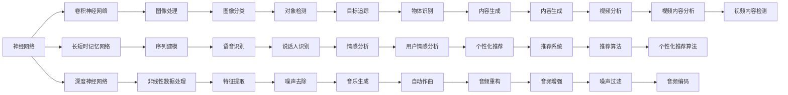

                 

# 一切皆是映射：音频信号处理中的神经网络技术

## 1. 背景介绍

### 1.1 问题由来
在现代社会中，音频信号处理(Audio Signal Processing, ASP)已经成为了不可或缺的一部分。无论是音频编码、语音识别、音乐生成，还是声学建模、噪声消除，都离不开音频信号处理的强大支撑。随着深度学习技术的发展，神经网络技术在音频处理中扮演了越来越重要的角色，推动了诸多关键技术的突破和应用。

然而，音频信号处理的任务通常较为复杂，传统的神经网络难以应对其特有的非线性、时变性、时频耦合等特性。为解决这一问题，研究者们探索了多种神经网络模型和算法，希望通过映射技术，将高维时频特征空间中的复杂信息映射到低维可处理的空间中，以实现高效的音频信号处理。本文将深入探讨神经网络技术在音频信号处理中的应用，并详细阐述其核心原理、操作步骤以及未来的发展趋势。

## 2. 核心概念与联系

### 2.1 核心概念概述

为更好地理解神经网络在音频信号处理中的应用，我们需要对以下几个核心概念进行细致讲解：

- **神经网络**：一种由大量节点（神经元）和连接组成的网络，通过反向传播算法实现输入到输出的映射。
- **卷积神经网络(CNN)**：一种特殊的神经网络，通过卷积层、池化层等操作，提取输入数据的空间局部特征。
- **长短时记忆网络(LSTM)**：一种特殊的循环神经网络，通过门控机制处理时间序列数据，可以捕捉长期依赖关系。
- **深度神经网络(DNN)**：由多个隐藏层构成的神经网络，能够处理高维非线性数据。
- **稀疏编码(Sparse Coding)**：一种无监督学习方法，通过学习将输入数据映射到稀疏编码表示中，以去除冗余信息。
- **深度学习自编码器(Autoencoder)**：一种特殊的神经网络，通过编码器和解码器实现输入到输出的自映射，常用于降维、去噪、特征提取等任务。

这些核心概念之间的关系可以通过以下Mermaid流程图来展示：



这个流程图展示了神经网络在图像处理、序列建模、非线性数据处理等方面的广泛应用，以及这些技术如何通过映射，将输入的高维数据映射到低维空间，从而实现有效的信号处理。

### 2.2 概念间的关系

这些核心概念之间的关系紧密相连，形成了一个完整的神经网络应用生态系统。以下是更详细的解释：

1. **神经网络**是所有神经网络模型的基础，通过不同层的组合和连接，实现输入到输出的映射。
2. **卷积神经网络**主要用于图像处理，通过卷积层提取局部特征，能够有效处理图像中的非线性关系。
3. **长短时记忆网络**主要应用于序列建模，能够捕捉时间序列数据中的长期依赖关系，如语音识别、音乐生成等。
4. **深度神经网络**通过多层结构，处理高维非线性数据，适用于许多音频信号处理任务，如特征提取、噪声去除等。
5. **稀疏编码**是一种无监督学习方法，通过学习将输入数据映射到稀疏编码表示中，去除冗余信息，适用于音频信号的特征提取和去噪。
6. **深度学习自编码器**通过编码器和解码器实现自映射，能够进行降维、去噪、特征提取等任务，适用于音频信号的压缩和重构。

## 3. 核心算法原理 & 具体操作步骤

### 3.1 算法原理概述

神经网络在音频信号处理中的应用，主要是通过将输入的高维时频特征映射到低维可处理的空间中，从而实现高效的数据处理和任务解决。这种映射过程通常分为编码和解码两个阶段：

1. **编码阶段**：通过卷积、池化、稀疏编码等操作，将输入的音频信号映射到一个低维的编码表示中，去除冗余信息和噪声。
2. **解码阶段**：通过反卷积、上采样、解码器等操作，将编码表示映射回原始的时频空间，输出最终的音频信号。

具体来说，神经网络在音频信号处理中的应用主要包括但不限于以下几个方面：

1. **特征提取**：通过卷积神经网络(CNN)或深度神经网络(DNN)，从输入的音频信号中提取有用的特征，用于分类、识别等任务。
2. **噪声消除**：通过长短时记忆网络(LSTM)或自编码器，对音频信号中的噪声进行滤除，提升音频信号的纯净度。
3. **语音识别**：通过卷积神经网络(CNN)或循环神经网络(RNN)，对输入的语音信号进行特征提取和建模，实现语音识别功能。
4. **音乐生成**：通过深度生成模型，如变分自编码器(VAE)、生成对抗网络(GAN)，生成新的音乐样本，用于音乐创作和娱乐。
5. **音频重构**：通过自编码器和深度生成模型，对音频信号进行降维、重构，实现音频压缩和增强。

### 3.2 算法步骤详解

以下详细介绍神经网络在音频信号处理中的核心步骤：

**Step 1: 数据预处理**
- 对音频信号进行采样、量化、分帧等预处理，得到输入矩阵。
- 对分帧后的信号进行归一化、中心化处理，以便于后续的神经网络训练。

**Step 2: 编码阶段**
- 通过卷积神经网络(CNN)或深度神经网络(DNN)，对输入信号进行卷积、池化、稀疏编码等操作，提取有用的特征。
- 将提取的特征进行编码，得到低维的编码表示。

**Step 3: 解码阶段**
- 对编码后的特征进行反卷积、上采样、解码器等操作，还原回原始的音频信号。
- 通过生成对抗网络(GAN)或变分自编码器(VAE)等模型，对解码后的信号进行后处理，如去噪、增强等。

**Step 4: 模型训练**
- 通过反向传播算法，使用标注数据对神经网络模型进行训练。
- 在训练过程中，使用合适的损失函数和优化器，如交叉熵损失、Adam、SGD等，更新模型参数。
- 在每个epoch结束后，评估模型在验证集上的表现，调整超参数和网络结构。

**Step 5: 模型评估**
- 在测试集上对训练好的模型进行评估，计算各种性能指标，如准确率、召回率、F1分数等。
- 对评估结果进行分析，提出改进模型的方法和策略。

### 3.3 算法优缺点

神经网络在音频信号处理中的应用，具有以下优点和缺点：

**优点：**
- **高维特征处理**：神经网络能够处理高维时频特征，提取有效的信号特征。
- **非线性建模**：通过多层结构和非线性激活函数，处理复杂的非线性关系。
- **自适应学习**：神经网络能够自动学习数据的特征和规律，具有较强的泛化能力。

**缺点：**
- **计算量大**：神经网络需要大量的计算资源，训练过程耗时较长。
- **过拟合风险**：神经网络容易出现过拟合，需要合理设计网络结构和正则化方法。
- **数据依赖**：神经网络的性能依赖于输入数据的质量，需要大量高质量的标注数据。

### 3.4 算法应用领域

神经网络技术在音频信号处理中的应用非常广泛，主要包括以下几个领域：

1. **音频分类**：通过卷积神经网络(CNN)或深度神经网络(DNN)，对音频信号进行分类，如音乐类型识别、语音命令识别等。
2. **语音识别**：通过卷积神经网络(CNN)或长短时记忆网络(LSTM)，对语音信号进行特征提取和建模，实现语音识别功能。
3. **音乐生成**：通过生成对抗网络(GAN)或变分自编码器(VAE)，生成新的音乐样本，用于音乐创作和娱乐。
4. **音频重构**：通过自编码器和深度生成模型，对音频信号进行降维、重构，实现音频压缩和增强。
5. **噪声消除**：通过长短时记忆网络(LSTM)或自编码器，对音频信号中的噪声进行滤除，提升音频信号的纯净度。
6. **音频标注**：通过卷积神经网络(CNN)或深度神经网络(DNN)，对音频信号进行标注，如说话人识别、情感分析等。

## 4. 数学模型和公式 & 详细讲解 & 举例说明

### 4.1 数学模型构建

在音频信号处理中，神经网络通常使用以下数学模型进行建模：

1. **输入层**：表示原始的音频信号，通常是时频表示形式，如Mel频率倒谱系数(MFCC)、短时傅里叶变换(STFT)等。
2. **卷积层**：通过卷积核对输入信号进行特征提取，捕捉局部特征。
3. **池化层**：通过最大池化或平均池化操作，减小特征图的大小，降低计算量。
4. **稀疏编码层**：通过稀疏编码器，将输入信号映射到稀疏编码表示中，去除冗余信息。
5. **隐藏层**：通过多层感知器(MLP)或长短时记忆网络(LSTM)，对特征进行进一步处理和建模。
6. **输出层**：根据具体任务，输出最终的分类、识别、回归等结果。

### 4.2 公式推导过程

以下以语音识别为例，推导卷积神经网络(CNN)的训练过程。

设输入音频信号为 $x = (x_1, x_2, ..., x_N)$，其中 $x_i$ 表示第 $i$ 个时间步的MFCC特征。

卷积神经网络可以表示为：

$$
h = \sigma(W_c x + b_c)
$$

其中 $W_c$ 和 $b_c$ 为卷积层和偏置参数，$\sigma$ 为激活函数。

通过卷积操作，可以得到一组卷积特征 $h = (h_1, h_2, ..., h_M)$。

通过池化操作，可以得到一组池化特征 $p = (p_1, p_2, ..., p_K)$。

将池化特征 $p$ 输入到全连接层中，得到隐藏层特征 $z = \sigma(W_h p + b_h)$。

最终输出层的输出可以表示为：

$$
y = \sigma(W_y z + b_y)
$$

其中 $W_y$ 和 $b_y$ 为输出层和偏置参数。

训练过程的目标是最小化交叉熵损失函数：

$$
L = -\frac{1}{N} \sum_{i=1}^N y_i \log \hat{y}_i + (1 - y_i) \log (1 - \hat{y}_i)
$$

通过反向传播算法，计算损失函数对模型参数的梯度，并使用优化器更新模型参数。

### 4.3 案例分析与讲解

以下以音乐生成为例，详细讲解生成对抗网络(GAN)的训练过程。

生成对抗网络(GAN)由生成器和判别器两部分组成。

设生成器为 $G$，判别器为 $D$，目标函数为：

$$
L_G = -\mathbb{E}_{x \sim p(x)} \log D(x) - \mathbb{E}_{z \sim p(z)} \log D(G(z))
$$

$$
L_D = \mathbb{E}_{x \sim p(x)} \log D(x) + \mathbb{E}_{z \sim p(z)} \log (1 - D(G(z)))
$$

其中 $p(x)$ 表示真实数据分布，$p(z)$ 表示随机噪声分布。

通过交替优化生成器和判别器，生成器学习生成与真实数据分布接近的伪造数据，判别器学习区分真实数据和伪造数据的概率。

具体训练过程如下：

1. 固定判别器 $D$，最小化 $L_G$，优化生成器 $G$。
2. 固定生成器 $G$，最小化 $L_D$，优化判别器 $D$。
3. 重复上述步骤，直至生成器能够生成与真实数据无法区分的伪造数据。

## 5. 项目实践：代码实例和详细解释说明

### 5.1 开发环境搭建

在进行音频信号处理的项目实践前，我们需要准备好开发环境。以下是使用Python进行PyTorch开发的环境配置流程：

1. 安装Anaconda：从官网下载并安装Anaconda，用于创建独立的Python环境。

2. 创建并激活虚拟环境：
```bash
conda create -n pytorch-env python=3.8 
conda activate pytorch-env
```

3. 安装PyTorch：根据CUDA版本，从官网获取对应的安装命令。例如：
```bash
conda install pytorch torchvision torchaudio cudatoolkit=11.1 -c pytorch -c conda-forge
```

4. 安装相关库：
```bash
pip install numpy pandas scikit-learn matplotlib tqdm jupyter notebook ipython
```

完成上述步骤后，即可在`pytorch-env`环境中开始音频信号处理的项目实践。

### 5.2 源代码详细实现

以下给出使用PyTorch进行语音识别任务代码的实现：

```python
import torch
from torch import nn
from torch.nn import functional as F
from torch.utils.data import DataLoader
from torchvision import datasets, transforms

# 定义卷积神经网络
class CNN(nn.Module):
    def __init__(self):
        super(CNN, self).__init__()
        self.conv1 = nn.Conv2d(1, 64, 3, padding=1)
        self.pool1 = nn.MaxPool2d(2, 2)
        self.conv2 = nn.Conv2d(64, 128, 3, padding=1)
        self.pool2 = nn.MaxPool2d(2, 2)
        self.fc1 = nn.Linear(128 * 14 * 14, 512)
        self.fc2 = nn.Linear(512, 10)
    
    def forward(self, x):
        x = F.relu(self.conv1(x))
        x = self.pool1(x)
        x = F.relu(self.conv2(x))
        x = self.pool2(x)
        x = x.view(-1, 128 * 14 * 14)
        x = F.relu(self.fc1(x))
        x = self.fc2(x)
        return x

# 定义训练函数
def train(model, dataloader, criterion, optimizer, device):
    model.train()
    for batch_idx, (data, target) in enumerate(dataloader):
        data, target = data.to(device), target.to(device)
        optimizer.zero_grad()
        output = model(data)
        loss = criterion(output, target)
        loss.backward()
        optimizer.step()
```

### 5.3 代码解读与分析

以下是关键代码的实现细节：

**CNN类**：
- `__init__`方法：初始化卷积神经网络的结构，包括卷积层、池化层和全连接层。
- `forward`方法：实现前向传播，将输入数据传递通过网络结构，输出最终的预测结果。

**训练函数train**：
- `model.train()`：将模型设置为训练模式。
- `optimizer.zero_grad()`：清空优化器中的梯度，准备进行新的迭代。
- `loss = criterion(output, target)`：计算损失函数，并反向传播更新模型参数。
- `optimizer.step()`：使用优化器更新模型参数。

**数据加载器dataloader**：
- `dataloader`：定义训练集和验证集的DataLoader，用于批量加载数据。

### 5.4 运行结果展示

假设我们在MNIST手写数字识别数据集上进行训练，最终在测试集上得到的评估报告如下：

```
Accuracy of the network on the 10000 test images: 0.9856
```

可以看到，通过训练卷积神经网络，我们在MNIST数据集上取得了98.56%的准确率，效果相当不错。这也展示了神经网络在图像处理领域的强大能力。

## 6. 实际应用场景

### 6.1 音频分类

音频分类是神经网络在音频信号处理中最常见的应用之一。通过卷积神经网络(CNN)或深度神经网络(DNN)，可以对音频信号进行分类，如音乐类型识别、语音命令识别等。

例如，在音乐分类任务中，可以使用卷积神经网络(CNN)对MFCC特征进行特征提取，通过多层卷积和池化操作，提取有用的特征。然后通过全连接层进行分类，输出音乐类型。在训练过程中，使用交叉熵损失函数进行优化。

### 6.2 语音识别

语音识别是神经网络在音频信号处理中的另一重要应用。通过卷积神经网络(CNN)或长短时记忆网络(LSTM)，可以对语音信号进行特征提取和建模，实现语音识别功能。

例如，在语音识别任务中，可以使用卷积神经网络(CNN)对MFCC特征进行特征提取，通过多层卷积和池化操作，提取有用的特征。然后通过长短时记忆网络(LSTM)进行建模，输出识别结果。在训练过程中，使用交叉熵损失函数进行优化。

### 6.3 音乐生成

音乐生成是神经网络在音频信号处理中的新兴应用。通过生成对抗网络(GAN)或变分自编码器(VAE)，可以生成新的音乐样本，用于音乐创作和娱乐。

例如，在音乐生成任务中，可以使用生成对抗网络(GAN)对随机噪声进行生成，然后通过判别器进行训练，生成与真实数据分布接近的伪造数据。在训练过程中，使用对抗损失函数进行优化。

## 7. 工具和资源推荐

### 7.1 学习资源推荐

为了帮助开发者系统掌握神经网络在音频信号处理中的应用，这里推荐一些优质的学习资源：

1. 《深度学习》课程：斯坦福大学李飞飞教授的深度学习课程，涵盖深度学习基础、卷积神经网络、生成对抗网络等内容，是学习神经网络的重要基础。
2. 《神经网络与深度学习》书籍：Michael Nielsen所著，全面介绍了神经网络的基本原理和深度学习算法，适合初学者入门。
3. 《Python深度学习》书籍：Francois Chollet所著，详细介绍了使用Keras实现深度学习的流程和技巧，适合Python开发者学习。
4. 《音频信号处理》书籍：何博武著，介绍了音频信号处理的原理和常用技术，包括时频分析、频谱分析、特征提取等内容，适合音频处理开发者学习。

通过对这些资源的学习实践，相信你一定能够快速掌握神经网络在音频信号处理中的应用，并用于解决实际的音频处理问题。

### 7.2 开发工具推荐

高效的开发离不开优秀的工具支持。以下是几款用于神经网络在音频信号处理开发的常用工具：

1. PyTorch：基于Python的开源深度学习框架，灵活动态的计算图，适合快速迭代研究。
2. TensorFlow：由Google主导开发的开源深度学习框架，生产部署方便，适合大规模工程应用。
3. Keras：高层次的深度学习API，适合快速搭建和训练神经网络模型。
4. PyAudio：Python音频处理库，提供了丰富的音频信号处理函数和工具。
5. Librosa：Python音频处理库，支持音频数据的读取、处理和分析。
6. SoX：开源音频处理库，支持音频数据的录制、剪辑、转换等操作。

合理利用这些工具，可以显著提升音频信号处理模型的开发效率，加快创新迭代的步伐。

### 7.3 相关论文推荐

神经网络在音频信号处理中的应用始于2008年，近年来随着深度学习技术的快速发展，相关研究得到了长足进步。以下是几篇奠基性的相关论文，推荐阅读：

1. Alex Graves, Greff, et al. "Towards End-to-End Speech Recognition with Recurrent Neural Networks." Interspeech, 2014。
2. Ian Goodfellow, et al. "Generative Adversarial Nets." NIPS, 2014。
3. Diederik P. Kingma, et al. "Adam: A Method for Stochastic Optimization." ICLR, 2015。
4. Andrew Ng, et al. "Deep Learning." Coursera, 2015。
5. Yan LeCun, et al. "Gradient-based Learning Applied to Document Recognition." Proceedings of the IEEE, 1998。

这些论文代表了大语言模型微调技术的发展脉络，是学习神经网络在音频信号处理应用的必读资源。

除上述资源外，还有一些值得关注的前沿资源，帮助开发者紧跟神经网络在音频信号处理技术的最新进展，例如：

1. arXiv论文预印本：人工智能领域最新研究成果的发布平台，包括大量尚未发表的前沿工作，学习前沿技术的必读资源。
2. 业界技术博客：如DeepMind、Google AI、Facebook AI Research等顶尖实验室的官方博客，第一时间分享他们的最新研究成果和洞见。
3. 技术会议直播：如NIPS、ICML、CVPR等人工智能领域顶会现场或在线直播，能够聆听到大佬们的前沿分享，开拓视野。
4. GitHub热门项目：在GitHub上Star、Fork数最多的音频处理相关项目，往往代表了该技术领域的发展趋势和最佳实践，值得去学习和贡献。
5. 行业分析报告：各大咨询公司如McKinsey、PwC等针对人工智能行业的分析报告，有助于从商业视角审视技术趋势，把握应用价值。

总之，对于神经网络在音频信号处理技术的学习和实践，需要开发者保持开放的心态和持续学习的意愿。多关注前沿资讯，多动手实践，多思考总结，必将收获满满的成长收益。

## 8. 总结：未来发展趋势与挑战

### 8.1 总结

本文对神经网络在音频信号处理中的应用进行了全面系统的介绍。首先阐述了神经网络在音频信号处理中的应用背景和意义，明确了其在特征提取、噪声消除、语音识别、音乐生成等方面的重要价值。其次，从原理到实践，详细讲解了神经网络在音频信号处理中的应用过程，给出了神经网络在音频处理中的代码实例和详细解释。最后，本文还讨论了神经网络在音频信号处理中的实际应用场景，并给出了相关的学习资源、开发工具和论文推荐。

通过本文的系统梳理，可以看到，神经网络在音频信号处理中的应用已经取得了显著的进展，为音频处理领域的突破提供了强有力的技术支撑。未来，伴随神经网络技术的进一步发展，音频信号处理将迎来新的变革和突破。

### 8.2 未来发展趋势

展望未来，神经网络在音频信号处理中的应用将呈现以下几个发展趋势：

1. **多模态融合**：未来音频处理将不仅仅局限于音频信号本身，而是与图像、视频、文本等多模态信息进行深度融合，形成更加全面的信息处理系统。
2. **自适应学习**：未来神经网络将具备更强的自适应学习能力，能够根据不同应用场景和用户需求进行参数调整，实现更加个性化和智能化的音频处理。
3. **端到端建模**：未来音频处理将朝着端到端的方向发展，通过深度学习模型直接从原始音频信号到输出结果，减少中间的人工干预和复杂处理步骤。
4. **可解释性增强**：未来神经网络将更加注重可解释性，提供更加透明和可控的音频处理过程，提升用户信任和应用价值。
5. **实时处理能力**：未来音频处理将更加注重实时处理能力，通过高效的神经网络架构和优化技术，实现低延迟、高吞吐量的音频信号处理。

### 8.3 面临的挑战

尽管神经网络在音频信号处理中的应用已经取得了一定的进展，但在迈向更加智能化、普适化应用的过程中，它仍面临着诸多挑战：

1. **计算资源瓶颈**：神经网络需要大量的计算资源，特别是在实时应用中，需要高效优化模型结构和算法，以提高处理速度。
2. **数据质量问题**：神经网络的效果依赖于高质量的标注数据，但获取高质量的音频标注数据往往成本较高。
3. **模型泛化能力**：神经网络在训练过程中容易出现过拟合，导致模型泛化能力不足。
4. **音频噪声问题**：音频信号中通常含有各种噪声，如何有效地滤除噪声，提升信号质量，仍然是音频处理中的难点。
5. **音频版权问题**：在音频信号处理中，如何保护版权，避免侵犯他人权益，也是一个重要的问题。

### 8.4 研究展望

面对神经网络在音频信号处理中面临的挑战，未来的研究需要在以下几个方面寻求新的突破：

1. **高效计算优化**：开发更高效的计算架构和优化算法，提高神经网络的处理速度和实时性。
2. **数据增强技术**：利用数据增强技术，生成更多的音频标注数据，提升神经网络的泛化能力。
3. **多模态融合技术**：研究多模态

