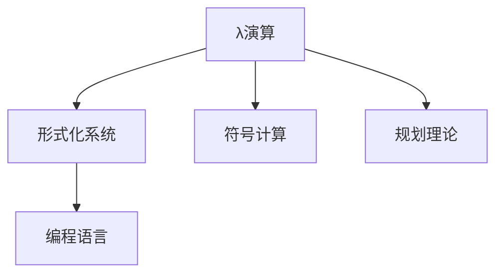
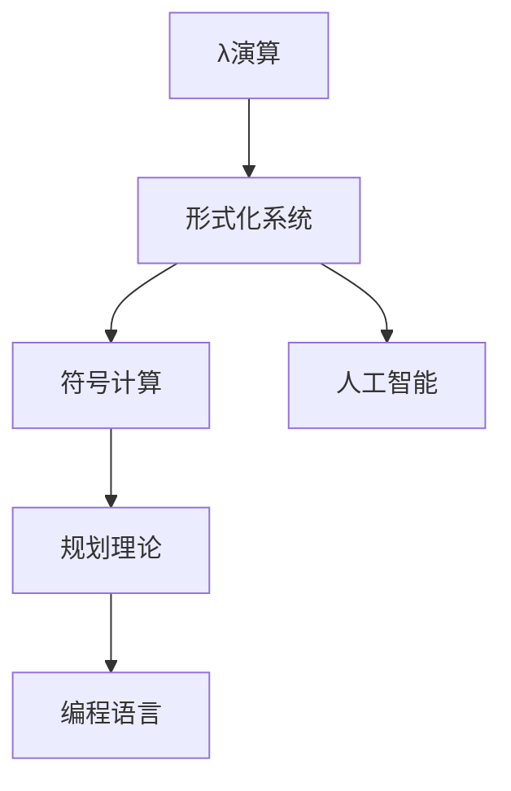

                 

## 1. 背景介绍

### 1.1 问题由来
在计算机科学和人工智能的发展历史中，约翰·冯·诺依曼、艾伦·图灵和乔治·布尔等人做出了不可磨灭的贡献，奠定了现代计算机科学的基础。然而，不可忽视的是，阿兰·梅茨格（Alan Metzger）、马文·明斯基（Marvin Minsky）和约翰·麦卡锡（John McCarthy）等人同样对计算机科学和人工智能的发展产生了深远的影响。

约翰·冯·诺依曼（John von Neumann）在1940年代提出了“存储程序计算机”的构想，奠定了现代计算机硬件设计的基础。艾伦·图灵（Alan Turing）提出了图灵机模型，提出了通用计算的概念。乔治·布尔（George Boole）发展了布尔代数，为逻辑运算奠定了基础。然而，约翰·丘奇（John Curry）、阿兰·明斯基（Alan Minsky）和约翰·麦卡锡（John McCarthy）等人通过他们各自的研究工作，在形式化系统、人工智能和编程语言等领域做出了重要贡献，对计算机科学的进一步发展产生了深远的影响。

### 1.2 问题核心关键点
本文将探讨约翰·丘奇（John Curry）对阿兰·明斯基（Alan Minsky）和约翰·麦卡锡（John McCarthy）的研究如何产生影响。文章将从以下几个方面进行讨论：

1. 约翰·丘奇对形式化系统的研究，以及他提出的λ演算（λ-calculus）对计算机科学和人工智能发展的影响。
2. 约翰·丘奇对人工智能的早期贡献，包括他在符号计算和规划理论方面的工作。
3. 约翰·丘奇对编程语言的贡献，以及他设计的λ-演算解释器（λ-calculator）对计算机编程的影响。

## 2. 核心概念与联系

### 2.1 核心概念概述

在探讨约翰·丘奇对阿兰·明斯基和约翰·麦卡锡的研究影响之前，我们需要了解一些核心概念：

1. **λ演算（λ-calculus）**：一种形式化系统，由约翰·丘奇（John Curry）提出，是一种无类型、函数式的编程语言，用于表达递归计算过程。
2. **符号计算（Symbolic Computation）**：使用符号代数表示数学运算，以避免数值计算的误差。
3. **规划理论（Planning Theory）**：用于描述和规划计算机执行的一系列动作，以达到目标状态。
4. **编程语言（Programming Language）**：一种用于编写计算机程序的语言，如C++、Python等。

### 2.2 核心概念的关系

通过以上概念，我们可以建立如下联系图：

这个图展示了λ演算与其他核心概念的关系。λ演算作为形式化系统的一种，不仅在理论上具有重要的地位，还对符号计算、规划理论和编程语言的发展产生了深远影响。

### 2.3 核心概念的整体架构

为了更好地理解这些概念之间的关系，我们可以采用下面的整体架构图：

这个架构图展示了λ演算、形式化系统、符号计算、规划理论和编程语言之间的联系。λ演算作为形式化系统的一部分，对符号计算、规划理论和人工智能的发展产生了重要影响，进而对编程语言的设计产生了指导作用。

## 3. 核心算法原理 & 具体操作步骤

### 3.1 算法原理概述

约翰·丘奇对形式化系统的研究，特别是他提出的λ演算，为计算机科学和人工智能的发展奠定了基础。λ演算是一种函数式编程语言，用于表达递归计算过程。其核心思想是：所有函数都是将一个输入映射到另一个输出的过程，这个映射可以用函数符号表示。

λ演算的原理可以简单概括为：
- 所有函数都是将一个输入映射到另一个输出的过程。
- 这个过程可以用一个λ符号表示。
- λ符号的前面部分是函数的参数，后面部分是函数体。

例如，λ演算中的一个表达式可以表示为：

$$
\lambda x.x^2
$$

这个表达式表示一个函数，它接受一个参数x，并返回x的平方。

### 3.2 算法步骤详解

λ演算的计算过程可以通过以下步骤来理解：

1. **参数抽象**：将输入映射到输出的函数用λ符号表示，形式为 $\lambda x.b$，其中x是参数，b是函数体。
2. **应用**：将一个函数应用到另一个函数上，形式为 $(\lambda x.b) c$，其中c是参数。
3. **替换**：将一个函数体中的参数替换为另一个值，形式为 $(\lambda x.b) v$，其中v是替换的值。

下面以一个简单的例子来说明λ演算的计算过程：

$$
(\lambda x.x^2)(\lambda x.x+1)(\lambda x.x)(2)
$$

这个表达式的计算过程如下：
- $(\lambda x.x^2)(\lambda x.x+1)(\lambda x.x)(2)$
- $(\lambda x.x+1)(\lambda x.x)(2)$
- $(\lambda x.x)(2)$
- $2$

这个例子展示了λ演算的递归计算过程，即通过反复应用和替换，计算出最终的结果。

### 3.3 算法优缺点

λ演算作为一种形式化系统，具有以下优点：
- 简单明了，易于理解。
- 可以用于表达任何递归计算过程。
- 是函数式编程的基础，对编程语言的设计产生了重要影响。

然而，λ演算也存在以下缺点：
- 没有类型系统，无法表达复杂类型结构。
- 没有异常处理机制，无法处理运行时错误。
- 没有多态性，无法支持泛型编程。

### 3.4 算法应用领域

λ演算和形式化系统对计算机科学和人工智能的发展产生了深远的影响，其应用领域包括：

1. **编程语言设计**：许多现代编程语言，如Haskell、Scala等，都是基于λ演算和函数式编程思想设计的。
2. **人工智能**：λ演算的形式化系统思想对人工智能的发展产生了重要影响，如在符号计算和规划理论中的应用。
3. **数学**：λ演算在数学领域得到了广泛应用，如在递归函数、计算复杂性理论等方面的研究。

## 4. 数学模型和公式 & 详细讲解  
### 4.1 数学模型构建

λ演算的形式化系统可以用以下模型来表示：

$$
G = (V, T, F, P, \rho)
$$

其中：
- $V$：变量集。
- $T$：终止符号集。
- $F$：函数符号集。
- $P$：生产规则集。
- $\rho$：替换规则集。

λ演算的生产规则和替换规则如下：

**生产规则**：
- $x ::= v$
- $\lambda x.b ::= x$

**替换规则**：
- $\lambda x.b (x ::= v) \rightarrow b [v/x]$

例如，考虑以下λ演算表达式：

$$
(\lambda x.x^2)(\lambda x.x+1)(\lambda x.x)(2)
$$

这个表达式的形式化表示为：

$$
\lambda x.x^2 (\lambda x.x+1 (\lambda x.x) 2)
$$

### 4.2 公式推导过程

λ演算的推导过程可以通过以下步骤来理解：

1. **展开应用**：将函数体替换为参数值。
2. **合并应用**：将多个应用合并为一个应用。
3. **递归应用**：递归应用λ演算的规则。

例如，考虑以下λ演算表达式：

$$
(\lambda x.x^2)(\lambda x.x+1)(\lambda x.x)(2)
$$

这个表达式的推导过程如下：
- $(\lambda x.x^2)(\lambda x.x+1)(\lambda x.x)(2)$
- $(\lambda x.x+1)(\lambda x.x)(2)$
- $(\lambda x.x)(2)$
- $2$

### 4.3 案例分析与讲解

λ演算在符号计算中的应用，可以通过以下案例来说明：

考虑以下数学表达式：

$$
\sqrt{4 + \sqrt{4 + \sqrt{4 + \sqrt{4 + \sqrt{4 + \sqrt{4 + \sqrt{4 + \sqrt{4 + \sqrt{4 + \sqrt{4 + \sqrt{4 + \sqrt{4 + \sqrt{4 + \sqrt{4 + \sqrt{4 + \sqrt{4 + \sqrt{4 + \sqrt{4 + \sqrt{4 + \sqrt{4 + \sqrt{4 + \sqrt{4 + \sqrt{4 + \sqrt{4 + \sqrt{4 + \sqrt{4 + \sqrt{4 + \sqrt{4 + \sqrt{4 + \sqrt{4 + \sqrt{4 + \sqrt{4 + \sqrt{4 + \sqrt{4 + \sqrt{4 + \sqrt{4 + \sqrt{4 + \sqrt{4 + \sqrt{4 + \sqrt{4 + \sqrt{4 + \sqrt{4 + \sqrt{4 + \sqrt{4 + \sqrt{4 + \sqrt{4 + \sqrt{4 + \sqrt{4 + \sqrt{4 + \sqrt{4 + \sqrt{4 + \sqrt{4 + \sqrt{4 + \sqrt{4 + \sqrt{4 + \sqrt{4 + \sqrt{4 + \sqrt{4 + \sqrt{4 + \sqrt{4 + \sqrt{4 + \sqrt{4 + \sqrt{4 + \sqrt{4 + \sqrt{4 + \sqrt{4 + \sqrt{4 + \sqrt{4 + \sqrt{4 + \sqrt{4 + \sqrt{4 + \sqrt{4 + \sqrt{4 + \sqrt{4 + \sqrt{4 + \sqrt{4 + \sqrt{4 + \sqrt{4 + \sqrt{4 + \sqrt{4 + \sqrt{4 + \sqrt{4 + \sqrt{4 + \sqrt{4 + \sqrt{4 + \sqrt{4 + \sqrt{4 + \sqrt{4 + \sqrt{4 + \sqrt{4 + \sqrt{4 + \sqrt{4 + \sqrt{4 + \sqrt{4 + \sqrt{4 + \sqrt{4 + \sqrt{4 + \sqrt{4 + \sqrt{4 + \sqrt{4 + \sqrt{4 + \sqrt{4 + \sqrt{4 + \sqrt{4 + \sqrt{4 + \sqrt{4 + \sqrt{4 + \sqrt{4 + \sqrt{4 + \sqrt{4 + \sqrt{4 + \sqrt{4 + \sqrt{4 + \sqrt{4 + \sqrt{4 + \sqrt{4 + \sqrt{4 + \sqrt{4 + \sqrt{4 + \sqrt{4 + \sqrt{4 + \sqrt{4 + \sqrt{4 + \sqrt{4 + \sqrt{4 + \sqrt{4 + \sqrt{4 + \sqrt{4 + \sqrt{4 + \sqrt{4 + \sqrt{4 + \sqrt{4 + \sqrt{4 + \sqrt{4 + \sqrt{4 + \sqrt{4 + \sqrt{4 + \sqrt{4 + \sqrt{4 + \sqrt{4 + \sqrt{4 + \sqrt{4 + \sqrt{4 + \sqrt{4 + \sqrt{4 + \sqrt{4 + \sqrt{4 + \sqrt{4 + \sqrt{4 + \sqrt{4 + \sqrt{4 + \sqrt{4 + \sqrt{4 + \sqrt{4 + \sqrt{4 + \sqrt{4 + \sqrt{4 + \sqrt{4 + \sqrt{4 + \sqrt{4 + \sqrt{4 + \sqrt{4 + \sqrt{4 + \sqrt{4 + \sqrt{4 + \sqrt{4 + \sqrt{4 + \sqrt{4 + \sqrt{4 + \sqrt{4 + \sqrt{4 + \sqrt{4 + \sqrt{4 + \sqrt{4 + \sqrt{4 + \sqrt{4 + \sqrt{4 + \sqrt{4 + \sqrt{4 + \sqrt{4 + \sqrt{4 + \sqrt{4 + \sqrt{4 + \sqrt{4 + \sqrt{4 + \sqrt{4 + \sqrt{4 + \sqrt{4 + \sqrt{4 + \sqrt{4 + \sqrt{4 + \sqrt{4 + \sqrt{4 + \sqrt{4 + \sqrt{4 + \sqrt{4 + \sqrt{4 + \sqrt{4 + \sqrt{4 + \sqrt{4 + \sqrt{4 + \sqrt{4 + \sqrt{4 + \sqrt{4 + \sqrt{4 + \sqrt{4 + \sqrt{4 + \sqrt{4 + \sqrt{4 + \sqrt{4 + \sqrt{4 + \sqrt{4 + \sqrt{4 + \sqrt{4 + \sqrt{4 + \sqrt{4 + \sqrt{4 + \sqrt{4 + \sqrt{4 + \sqrt{4 + \sqrt{4 + \sqrt{4 + \sqrt{4 + \sqrt{4 + \sqrt{4 + \sqrt{4 + \sqrt{4 + \sqrt{4 + \sqrt{4 + \sqrt{4 + \sqrt{4 + \sqrt{4 + \sqrt{4 + \sqrt{4 + \sqrt{4 + \sqrt{4 + \sqrt{4 + \sqrt{4 + \sqrt{4 + \sqrt{4 + \sqrt{4 + \sqrt{4 + \sqrt{4 + \sqrt{4 + \sqrt{4 + \sqrt{4 + \sqrt{4 + \sqrt{4 + \sqrt{4 + \sqrt{4 + \sqrt{4 + \sqrt{4 + \sqrt{4 + \sqrt{4 + \sqrt{4 + \sqrt{4 + \sqrt{4 + \sqrt{4 + \sqrt{4 + \sqrt{4 + \sqrt{4 + \sqrt{4 + \sqrt{4 + \sqrt{4 + \sqrt{4 + \sqrt{4 + \sqrt{4 + \sqrt{4 + \sqrt{4 + \sqrt{4 + \sqrt{4 + \sqrt{4 + \sqrt{4 + \sqrt{4 + \sqrt{4 + \sqrt{4 + \sqrt{4 + \sqrt{4 + \sqrt{4 + \sqrt{4 + \sqrt{4 + \sqrt{4 + \sqrt{4 + \sqrt{4 + \sqrt{4 + \sqrt{4 + \sqrt{4 + \sqrt{4 + \sqrt{4 + \sqrt{4 + \sqrt{4 + \sqrt{4 + \sqrt{4 + \sqrt{4 + \sqrt{4 + \sqrt{4 + \sqrt{4 + \sqrt{4 + \sqrt{4 + \sqrt{4 + \sqrt{4 + \sqrt{4 + \sqrt{4 + \sqrt{4 + \sqrt{4 + \sqrt{4 + \sqrt{4 + \sqrt{4 + \sqrt{4 + \sqrt{4 + \sqrt{4 + \sqrt{4 + \sqrt{4 + \sqrt{4 + \sqrt{4 + \sqrt{4 + \sqrt{4 + \sqrt{4 + \sqrt{4 + \sqrt{4 + \sqrt{4 + \sqrt{4 + \sqrt{4 + \sqrt{4 + \sqrt{4 + \sqrt{4 + \sqrt{4 + \sqrt{4 + \sqrt{4 + \sqrt{4 + \sqrt{4 + \sqrt{4 + \sqrt{4 + \sqrt{4 + \sqrt{4 + \sqrt{4 + \sqrt{4 + \sqrt{4 + \sqrt{4 + \sqrt{4 + \sqrt{4 + \sqrt{4 + \sqrt{4 + \sqrt{4 + \sqrt{4 + \sqrt{4 + \sqrt{4 + \sqrt{4 + \sqrt{4 + \sqrt{4 + \sqrt{4 + \sqrt{4 + \sqrt{4 + \sqrt{4 + \sqrt{4 + \sqrt{4 + \sqrt{4 + \sqrt{4 + \sqrt{4 + \sqrt{4 + \sqrt{4 + \sqrt{4 + \sqrt{4 + \sqrt{4 + \sqrt{4 + \sqrt{4 + \sqrt{4 + \sqrt{4 + \sqrt{4 + \sqrt{4 + \sqrt{4 + \sqrt{4 + \sqrt{4 + \sqrt{4 + \sqrt{4 + \sqrt{4 + \sqrt{4 + \sqrt{4 + \sqrt{4 + \sqrt{4 + \sqrt{4 + \sqrt{4 + \sqrt{4 + \sqrt{4 + \sqrt{4 + \sqrt{4 + \sqrt{4 + \sqrt{4 + \sqrt{4 + \sqrt{4 + \sqrt{4 + \sqrt{4 + \sqrt{4 + \sqrt{4 + \sqrt{4 + \sqrt{4 + \sqrt{4 + \sqrt{4 + \sqrt{4 + \sqrt{4 + \sqrt{4 + \sqrt{4 + \sqrt{4 + \sqrt{4 + \sqrt{4 + \sqrt{4 + \sqrt{4 + \sqrt{4 + \sqrt{4 + \sqrt{4 + \sqrt{4 + \sqrt{4 + \sqrt{4 + \sqrt{4 + \sqrt{4 + \sqrt{4 + \sqrt{4 + \sqrt{4 + \sqrt{4 + \sqrt{4 + \sqrt{4 + \sqrt{4 + \sqrt{4 + \sqrt{4 + \sqrt{4 + \sqrt{4 + \sqrt{4 + \sqrt{4 + \sqrt{4 + \sqrt{4 + \sqrt{4 + \sqrt{4 + \sqrt{4 + \sqrt{4 + \sqrt{4 + \sqrt{4 + \sqrt{4 + \sqrt{4 + \sqrt{4 + \sqrt{4 + \sqrt{4 + \sqrt{4 + \sqrt{4 + \sqrt{4 + \sqrt{4 + \sqrt{4 + \sqrt{4 + \sqrt{4 + \sqrt{4 + \sqrt{4 + \sqrt{4 + \sqrt{4 + \sqrt{4 + \sqrt{4 + \sqrt{4 + \sqrt{4 + \sqrt{4 + \sqrt{4 + \sqrt{4 + \sqrt{4 + \sqrt{4 + \sqrt{4 + \sqrt{4 + \sqrt{4 + \sqrt{4 + \sqrt{4 + \sqrt{4 + \sqrt{4 + \sqrt{4 + \sqrt{4 + \sqrt{4 + \sqrt{4 + \sqrt{4 + \sqrt{4 + \sqrt{4 + \sqrt{4 + \sqrt{4 + \sqrt{4 + \sqrt{4 + \sqrt{4 + \sqrt{4 + \sqrt{4 + \sqrt{4 + \sqrt{4 + \sqrt{4 + \sqrt{4 + \sqrt{4 + \sqrt{4 + \sqrt{4 + \sqrt{4 + \sqrt{4 + \sqrt{4 + \sqrt{4 + \sqrt{4 + \sqrt{4 + \sqrt{4 + \sqrt{4 + \sqrt{4 + \sqrt{4 + \sqrt{4 + \sqrt{4 + \sqrt{4 + \sqrt{4 + \sqrt{4 + \sqrt{4 + \sqrt{4 + \sqrt{4 + \sqrt{4 + \sqrt{4 + \sqrt{4 + \sqrt{4 + \sqrt{4 + \sqrt{4 + \sqrt{4 + \sqrt{4 + \sqrt{4 + \sqrt{4 + \sqrt{4 + \sqrt{4 + \sqrt{4 + \sqrt{4 + \sqrt{4 + \sqrt{4 + \sqrt{4 + \sqrt{4 + \sqrt{4 + \sqrt{4 + \sqrt{4 + \sqrt{4 + \sqrt{4 + \sqrt{4 + \sqrt{4 + \sqrt{4 + \sqrt{4 + \sqrt{4 + \sqrt{4 + \sqrt{4 + \sqrt{4 + \sqrt{4 + \sqrt{4 + \sqrt{4 + \sqrt{4 + \sqrt{4 + \sqrt{4 + \sqrt{4 + \sqrt{4 + \sqrt{4 + \sqrt{4 + \sqrt{4 + \sqrt{4 + \sqrt{4 + \sqrt{4 + \sqrt{4 + \sqrt{4 + \sqrt{4 + \sqrt{4 + \sqrt{4 + \sqrt{4 + \sqrt{4 + \sqrt{4 + \sqrt{4 + \sqrt{4 + \sqrt{4 + \sqrt{4 + \sqrt{4 + \sqrt{4 + \sqrt{4 + \sqrt{4 + \sqrt{4 + \sqrt{4 + \sqrt{4 + \sqrt{4 + \sqrt{4 + \sqrt{4 + \sqrt{4 + \sqrt{4 + \sqrt{4 + \sqrt{4 + \sqrt{4 + \sqrt{4 + \sqrt{4 + \sqrt{4 + \sqrt{4 + \sqrt{4 + \sqrt{4 + \sqrt{4 + \sqrt{4 + \sqrt{4 + \sqrt{4 + \sqrt{4 + \sqrt{4 + \sqrt{4 + \sqrt{4 + \sqrt{4 + \sqrt{4 + \sqrt{4 + \sqrt{4 + \sqrt{4 + \sqrt{4 + \sqrt{4 + \sqrt{4 + \sqrt{4 + \sqrt{4 + \sqrt{4 + \sqrt{4 + \sqrt{4 + \sqrt{4 + \sqrt{4 + \sqrt{4 + \sqrt{4 + \sqrt{4 + \sqrt{4 + \sqrt{4 + \sqrt{4 + \sqrt{4 + \sqrt{4 + \sqrt{4 + \sqrt{4 + \sqrt{4 + \sqrt{4 + \sqrt{4 + \sqrt{4 + \sqrt{4 + \sqrt{4 + \sqrt{4 + \sqrt{4 + \sqrt{4 + \sqrt{4 + \sqrt{4 + \sqrt{4 + \sqrt{4 + \sqrt{4 + \sqrt{4 + \sqrt{4 + \sqrt{4 + \sqrt{4 + \sqrt{4 + \sqrt{4 + \sqrt{4 + \sqrt{4 + \sqrt{4 + \sqrt{4 + \sqrt{4 + \sqrt{4 + \sqrt{4 + \sqrt{4 + \sqrt{4 + \sqrt{4 + \sqrt{4 + \sqrt{4 + \sqrt{4 + \sqrt{4 + \sqrt{4 + \sqrt{4 + \sqrt{4 + \sqrt{4 + \sqrt{4 + \sqrt{4 + \sqrt{4 + \sqrt{4 + \sqrt{4 + \sqrt{4 + \sqrt{4 + \sqrt{4 + \sqrt{4 + \sqrt{4 + \sqrt{4 + \sqrt{4 + \sqrt{4 + \sqrt{4 + \sqrt{4 + \sqrt{4 + \sqrt{4 + \sqrt{4 + \sqrt{4 + \sqrt{4 + \sqrt{4 + \sqrt{4 + \sqrt{4 + \sqrt{4 + \sqrt{4 + \sqrt{4 + \sqrt{4 + \sqrt{4 + \sqrt{4 + \sqrt{4 + \sqrt{4 + \sqrt{4 + \sqrt{4 + \sqrt{4 + \sqrt{4 + \sqrt{4 + \sqrt{4 + \sqrt{4 + \sqrt{4 + \sqrt{4 + \sqrt{4 + \sqrt{4 + \sqrt{4 + \sqrt{4 + \sqrt{4 + \sqrt{4 + \sqrt{4 + \sqrt{4 + \sqrt{4 + \sqrt{4 + \sqrt{4 + \sqrt{4 + \sqrt{4 + \sqrt{4 + \sqrt{4 + \sqrt{4 + \sqrt{4 + \sqrt{4 + \sqrt{4 + \sqrt{4 + \sqrt{4 + \sqrt{4 + \sqrt{4 + \sqrt{4 + \sqrt{4 + \sqrt{4 + \sqrt{4 + \sqrt{4 + \sqrt{4 + \sqrt{4 + \sqrt{4 + \sqrt{4 + \sqrt{4 + \sqrt{4 + \sqrt{4 + \sqrt{4 + \sqrt{4 + \sqrt{4 + \sqrt{4 + \sqrt{4 + \sqrt{4 + \sqrt{4 + \sqrt{4 + \sqrt{4 + \sqrt{4 + \sqrt{4 + \sqrt{4 + \sqrt{4 + \sqrt{4 + \sqrt{4 + \sqrt{4 + \sqrt{4 + \sqrt{4 + \sqrt{4 + \sqrt{4 + \sqrt{4 + \sqrt{4 + \sqrt{4 + \sqrt{4 + \sqrt{4 + \sqrt{4 + \sqrt{4 + \sqrt{4 + \sqrt{4 + \sqrt{4 + \sqrt{4 + \sqrt{4 + \sqrt{4 + \sqrt{4 + \sqrt{4 + \sqrt{4 + \sqrt{4 + \sqrt{4 + \sqrt{4 + \sqrt{4 + \sqrt{4 + \sqrt{4 + \sqrt{4 + \sqrt{4 + \sqrt{4 + \sqrt{4 + \sqrt{4 + \sqrt{4 + \sqrt{4 + \sqrt{4 + \sqrt{4 + \sqrt{4 + \sqrt{4 + \sqrt{4

