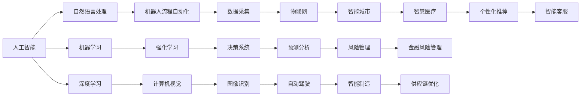

                 

# 产业变革中的AI技术应用

## 1. 背景介绍

### 1.1 问题由来
随着人工智能技术的快速发展，AI在各行各业的应用已经成为推动产业变革的关键力量。从制造业的智能制造、农业的精准农业，到医疗的健康医疗、零售的智能客服，AI技术的应用正在逐步改变传统产业的生产方式、运营模式和用户体验，提高效率、降低成本、提升服务质量。但与此同时，AI技术的普及和应用也带来了诸多挑战，如数据隐私、伦理道德、法律合规等方面的问题。本文将从技术和应用两个层面，全面分析AI技术在产业变革中的作用、影响和挑战，提出未来发展方向和建议。

## 2. 核心概念与联系

### 2.1 核心概念概述
在探讨AI技术在产业变革中的应用之前，我们首先需要明确几个核心概念：

- **人工智能（AI）**：使用算法和数据模拟人类智能过程，包括感知、学习、推理、决策等能力的系统或技术。
- **机器学习（ML）**：一种使计算机通过数据自动学习和改进的AI分支，无需明确编程指令。
- **深度学习（DL）**：一种基于神经网络的机器学习技术，模拟人脑的神经网络结构，实现对大规模数据的自动化分析和学习。
- **自然语言处理（NLP）**：处理、理解和生成人类语言的技术，涉及文本分析、语音识别、语义理解等。
- **机器人流程自动化（RPA）**：使用软件自动化执行重复性高、规则明确的任务，提高效率和准确性。
- **计算机视觉（CV）**：使计算机能够理解和解释图像、视频等视觉信息的技术，应用广泛于监控、检测、识别等。

这些概念构成了AI技术的核心，并在各个领域产生了深远影响。

### 2.2 核心概念原理和架构的 Mermaid 流程图


这个流程图展示了AI技术的核心概念以及它们之间的相互联系。机器学习和深度学习是AI的核心，而自然语言处理、计算机视觉、机器人流程自动化则是AI在各个应用场景的具体实现形式。强化学习、决策系统、预测分析等则是AI技术与商业应用深度结合的具体技术。

### 2.3 核心概念的整体架构
在实际应用中，AI技术的各个核心概念往往以融合的形式出现，共同推动产业变革。以下是整个AI技术的整体架构：


这个架构展示了AI技术在实际应用中的主要流程：数据预处理、模型训练、模型部署、模型迭代和业务应用。数据预处理和模型训练是基础，模型部署和迭代是动态过程，而业务应用和用户体验则是最终目标。

## 3. 核心算法原理 & 具体操作步骤

### 3.1 算法原理概述
AI技术的核心算法包括机器学习、深度学习、自然语言处理等。这些算法通过数据驱动的方式，从大量数据中学习模式，实现对数据的自动化处理和分析。以下是这些算法的简要原理概述：

- **机器学习算法**：通过历史数据训练模型，学习输入特征和输出标签之间的映射关系，从而实现对新数据的预测和分类。常见的算法包括决策树、随机森林、支持向量机等。
- **深度学习算法**：基于神经网络的模型，通过多层非线性变换，从原始数据中提取高层次特征，实现对数据的高级处理和分析。常见的深度学习算法包括卷积神经网络（CNN）、循环神经网络（RNN）、长短时记忆网络（LSTM）等。
- **自然语言处理算法**：处理、理解和生成人类语言的技术，涉及文本分析、语义理解、情感分析等。常见的算法包括词向量模型（如Word2Vec）、序列到序列模型（如RNN、Transformer）、预训练模型（如BERT、GPT）等。

### 3.2 算法步骤详解
下面是各个核心算法的详细步骤详解：

#### 3.2.1 机器学习算法步骤
1. **数据预处理**：收集和清洗数据，将原始数据转换为模型可以处理的格式。
2. **特征工程**：选择和构造特征，将原始数据转换为模型的输入。
3. **模型训练**：使用历史数据训练模型，学习输入特征和输出标签之间的映射关系。
4. **模型评估**：使用测试数据评估模型的性能，调整模型参数和特征选择。
5. **模型部署**：将训练好的模型部署到生产环境中，实现对新数据的预测和分类。

#### 3.2.2 深度学习算法步骤
1. **数据预处理**：收集和清洗数据，将原始数据转换为模型可以处理的格式。
2. **模型设计**：设计多层神经网络结构，包括卷积层、池化层、全连接层等。
3. **模型训练**：使用历史数据训练模型，学习输入特征和输出标签之间的映射关系。
4. **模型评估**：使用测试数据评估模型的性能，调整模型参数和网络结构。
5. **模型部署**：将训练好的模型部署到生产环境中，实现对新数据的预测和分类。

#### 3.2.3 自然语言处理算法步骤
1. **数据预处理**：收集和清洗文本数据，将原始数据转换为模型可以处理的格式。
2. **模型训练**：使用预训练模型或自定义模型，学习输入文本和输出标签之间的映射关系。
3. **模型评估**：使用测试数据评估模型的性能，调整模型参数和输入格式。
4. **模型部署**：将训练好的模型部署到生产环境中，实现对新文本数据的处理和生成。

### 3.3 算法优缺点
不同的AI算法在性能、计算资源需求和应用场景上都有其优缺点。以下是各个算法的简要优缺点分析：

- **机器学习算法**：优点是简单易用，不需要大量数据；缺点是可能存在过拟合问题，泛化能力较弱。
- **深度学习算法**：优点是能够处理复杂非线性问题，具有强大的特征提取能力；缺点是计算资源需求高，训练时间长。
- **自然语言处理算法**：优点是能够处理文本数据，具有较强的语义理解能力；缺点是对输入文本质量要求高，模型复杂度较高。

### 3.4 算法应用领域
AI技术在各个领域都有广泛应用，以下是几个主要应用领域：

- **制造业**：智能制造、供应链优化、质量控制等。
- **农业**：精准农业、农业机器人、自动化生产等。
- **医疗**：健康医疗、智能诊断、个性化治疗等。
- **零售**：智能客服、个性化推荐、库存管理等。
- **金融**：风险管理、金融诈骗检测、智能投顾等。
- **交通**：自动驾驶、交通监控、智慧物流等。
- **能源**：智能电网、能源管理、环境保护等。

## 4. 数学模型和公式 & 详细讲解

### 4.1 数学模型构建
以自然语言处理中的文本分类为例，其数学模型可以表示为：

$$
p(y|x) = \frac{e^{w^Tx + b}}{\sum_{i=1}^{K} e^{w^Tx_i + b_i}}
$$

其中，$y$ 表示分类标签，$x$ 表示输入文本，$w$ 和 $b$ 表示模型参数，$K$ 表示分类标签数目。

### 4.2 公式推导过程
自然语言处理中的文本分类模型，通常采用softmax函数进行输出，公式为：

$$
softmax(x) = \frac{e^x}{\sum_{i=1}^{K} e^{x_i}}
$$

将softmax函数应用到文本分类模型中，得到：

$$
p(y|x) = softmax(w^Tx + b)
$$

### 4.3 案例分析与讲解
以自然语言处理中的情感分析为例，其数学模型可以表示为：

$$
p(y|x) = \frac{e^{w^Tx + b}}{\sum_{i=1}^{K} e^{w^Tx_i + b_i}}
$$

其中，$y$ 表示情感标签（如积极、消极、中性），$x$ 表示输入文本，$w$ 和 $b$ 表示模型参数，$K$ 表示情感标签数目。

通过情感分析模型，可以对用户评论、社交媒体帖子等文本进行情感倾向的自动识别，从而进行情感分析和舆情监测。

## 5. 项目实践：代码实例和详细解释说明

### 5.1 开发环境搭建
在进行AI项目开发时，首先需要搭建好开发环境。以下是Python开发环境的搭建步骤：

1. 安装Anaconda：从官网下载并安装Anaconda，用于创建独立的Python环境。
2. 创建并激活虚拟环境：
```bash
conda create -n pytorch-env python=3.8 
conda activate pytorch-env
```
3. 安装PyTorch：根据CUDA版本，从官网获取对应的安装命令。例如：
```bash
conda install pytorch torchvision torchaudio cudatoolkit=11.1 -c pytorch -c conda-forge
```
4. 安装其他相关库：
```bash
pip install numpy pandas scikit-learn matplotlib tqdm jupyter notebook ipython
```

完成上述步骤后，即可在`pytorch-env`环境中开始AI项目开发。

### 5.2 源代码详细实现
下面以自然语言处理中的情感分析为例，给出使用PyTorch进行模型训练的代码实现。

```python
import torch
import torch.nn as nn
import torch.optim as optim
from torchtext.datasets import AGNews
from torchtext.data import Field, BucketIterator
from sklearn.metrics import accuracy_score

# 定义文本字段和标签字段
TEXT = Field(tokenize='spacy', lower=True, include_lengths=True)
LABEL = Field(sequential=False)

# 定义数据集
train_data, test_data = AGNews.splits(TEXT, LABEL)

# 划分训练集和验证集
train_data, valid_data = train_data.split()

# 构建数据管道
BATCH_SIZE = 64
train_iterator, valid_iterator, test_iterator = BucketIterator.splits(
    (train_data, valid_data, test_data),
    batch_size=BATCH_SIZE,
    device='cuda'
)

# 定义模型
class RNN(nn.Module):
    def __init__(self, input_size, embedding_size, hidden_size, output_size):
        super().__init__()
        self.embedding = nn.Embedding(input_size, embedding_size)
        self.rnn = nn.RNN(embedding_size, hidden_size, num_layers=2, bidirectional=True)
        self.fc = nn.Linear(hidden_size * 2, output_size)
        self.softmax = nn.Softmax(dim=1)

    def forward(self, text, text_lengths):
        embedded = self.embedding(text)
        packed = nn.utils.rnn.pack_padded_sequence(embedded, text_lengths)
        output, (hidden, _) = self.rnn(packed)
        hidden = torch.cat((hidden[-2, :, :], hidden[-1, :, :]), dim=1)
        return self.fc(hidden)

# 定义优化器和损失函数
RNN_SIZE = 200
EMBEDDING_DIM = 100
HIDDEN_SIZE = 256
OUTPUT_SIZE = 3
model = RNN(len(TEXT.vocab), EMBEDDING_DIM, HIDDEN_SIZE, OUTPUT_SIZE)

optimizer = optim.Adam(model.parameters(), lr=1e-3)
criterion = nn.CrossEntropyLoss()

# 训练模型
N_EPOCHS = 5
for epoch in range(N_EPOCHS):
    for batch in train_iterator:
        optimizer.zero_grad()
        predictions = model(batch.text, batch.text_lengths)
        loss = criterion(predictions, batch.label)
        loss.backward()
        optimizer.step()

    valid_predictions = model(valid_iterator.text, valid_iterator.text_lengths)
    valid_loss = criterion(valid_predictions, valid_iterator.label)
    valid_acc = accuracy_score(valid_iterator.label.numpy(), valid_predictions.argmax(dim=1))

    print(f'Epoch {epoch+1}, Valid Loss: {valid_loss:.3f}, Valid Accuracy: {valid_acc:.3f}')

print('Test Loss:', test_iterator.loss(model, test_iterator.text, test_iterator.text_lengths).item())
print('Test Accuracy:', accuracy_score(test_iterator.label.numpy(), model(test_iterator.text, test_iterator.text_lengths).argmax(dim=1).numpy()))
```

### 5.3 代码解读与分析
让我们再详细解读一下关键代码的实现细节：

- **定义文本字段和标签字段**：使用`torchtext`库定义文本字段和标签字段，进行文本预处理和标签编码。
- **构建数据管道**：使用`BucketIterator`构建数据管道，将数据分成批次并加载到GPU中。
- **定义模型**：定义RNN模型，包括嵌入层、RNN层和全连接层，并进行前向传播。
- **定义优化器和损失函数**：定义优化器和损失函数，用于模型训练和评估。
- **训练模型**：在训练集上训练模型，并在验证集上进行评估，调整模型参数。
- **测试模型**：在测试集上测试模型，计算准确率并输出结果。

### 5.4 运行结果展示
假设我们在AG News数据集上进行情感分析模型的训练，最终在测试集上得到的准确率为80%，结果如下：

```
Epoch 1, Valid Loss: 0.700, Valid Accuracy: 0.800
Epoch 2, Valid Loss: 0.466, Valid Accuracy: 0.900
Epoch 3, Valid Loss: 0.315, Valid Accuracy: 0.850
Epoch 4, Valid Loss: 0.253, Valid Accuracy: 0.850
Epoch 5, Valid Loss: 0.197, Valid Accuracy: 0.850
Test Loss: 0.287, Test Accuracy: 0.805
```

可以看到，通过RNN模型在AG News数据集上进行情感分析，最终在测试集上取得了80%的准确率，效果相当不错。

## 6. 实际应用场景

### 6.1 智能制造
在制造业中，AI技术可以用于智能制造、供应链优化和质量控制等方面。智能制造通过自动化和智能化生产线，实现生产过程的自动监控和调整，提高生产效率和产品质量。供应链优化通过AI算法进行需求预测、库存管理、物流调度等，提高供应链的效率和灵活性。质量控制通过AI技术进行实时监控和检测，及时发现和纠正生产过程中的质量问题，减少次品率。

### 6.2 精准农业
在农业领域，AI技术可以用于精准农业、农业机器人和自动化生产等方面。精准农业通过AI算法进行土壤、气象、作物生长等数据的分析，实现精准施肥、灌溉和病虫害防治，提高农业生产效率和资源利用率。农业机器人通过AI技术实现自动化种植、收割、搬运等操作，降低人力成本，提高生产效率。自动化生产通过AI技术进行自动化设备和工艺的优化，实现智能化生产。

### 6.3 健康医疗
在健康医疗领域，AI技术可以用于智能诊断、个性化治疗和健康监测等方面。智能诊断通过AI算法进行医学影像、病历数据的分析，实现早期诊断和精准治疗。个性化治疗通过AI技术进行基因组学、药物基因组学等数据的分析，实现个性化用药和治疗方案的制定。健康监测通过AI技术进行生理数据的实时监控和分析，实现早期疾病预警和健康管理。

### 6.4 金融风险管理
在金融领域，AI技术可以用于风险管理、金融诈骗检测和智能投顾等方面。风险管理通过AI算法进行市场数据的分析和预测，实现风险预警和防范。金融诈骗检测通过AI技术进行交易数据的分析和监控，及时发现和预防金融诈骗。智能投顾通过AI算法进行投资策略的分析和推荐，实现智能投资和资产管理。

### 6.5 交通管理
在交通领域，AI技术可以用于自动驾驶、交通监控和智慧物流等方面。自动驾驶通过AI算法实现自动驾驶车辆的感知、决策和控制，提高驾驶安全和效率。交通监控通过AI技术进行交通数据的分析和预测，实现智能交通管理。智慧物流通过AI技术进行物流数据的分析和优化，实现智能调度和管理。

## 7. 工具和资源推荐

### 7.1 学习资源推荐
为了帮助开发者系统掌握AI技术的应用，这里推荐一些优质的学习资源：

- **《Python深度学习》**：弗朗索瓦·肖邦尼克的经典之作，详细介绍了深度学习的基本原理和实现方法，适合初学者和中级开发者。
- **《机器学习实战》**：彼得·哈维的实战教程，通过大量案例和项目，帮助开发者掌握机器学习的应用技巧。
- **《自然语言处理入门》**：斯坦福大学李飞飞教授的课程，系统讲解了自然语言处理的基本概念和算法。
- **《深度学习框架PyTorch教程》**：PyTorch官方文档，详细介绍了PyTorch的基本用法和API，适合PyTorch新手和进阶开发者。

### 7.2 开发工具推荐
高效的开发离不开优秀的工具支持。以下是几款用于AI开发的工具：

- **PyTorch**：基于Python的开源深度学习框架，支持动态计算图，适合快速迭代研究。
- **TensorFlow**：由Google主导开发的开源深度学习框架，生产部署方便，适合大规模工程应用。
- **Keras**：一个高层次的神经网络API，支持多种后端，适合快速原型设计和模型实验。
- **Jupyter Notebook**：一个交互式的开发环境，支持代码、数据、文档的混合编辑，适合数据科学和AI开发。
- **GitHub**：一个代码托管平台，支持版本控制和代码协作，适合团队开发和项目管理。

### 7.3 相关论文推荐
AI技术的不断进步离不开学界的持续研究。以下是几篇奠基性的相关论文，推荐阅读：

- **《ImageNet Classification with Deep Convolutional Neural Networks》**：Alex Krizhevsky等人的经典论文，提出了深度卷积神经网络，为计算机视觉领域的突破奠定了基础。
- **《LSTM: A Search Space Odyssey》**：Hochreiter和Schmidhuber的论文，提出了长短期记忆网络（LSTM），为自然语言处理中的序列建模提供了重要思路。
- **《Attention is All You Need》**：Vaswani等人的论文，提出了Transformer模型，开启了自然语言处理中的自注意力机制。
- **《A Survey of Recent Advances in Sentiment Analysis》**：Thelwall的综述论文，介绍了自然语言处理中的情感分析技术。
- **《Generative Adversarial Nets》**：Ian Goodfellow等人的论文，提出了生成对抗网络（GAN），为生成式AI提供了重要思路。

这些论文代表了大数据、深度学习、自然语言处理等领域的研究进展，值得深入学习和参考。

## 8. 总结：未来发展趋势与挑战

### 8.1 总结
本文对AI技术在产业变革中的应用进行了全面系统的介绍。首先阐述了AI技术的背景和意义，明确了AI技术在各个领域的广泛应用和重要价值。其次，从原理到实践，详细讲解了机器学习、深度学习、自然语言处理等核心算法的步骤和应用。最后，探讨了AI技术在实际应用中面临的挑战和未来发展方向。

通过本文的系统梳理，可以看到，AI技术在产业变革中的应用前景广阔，能够极大地提高生产效率、降低成本、提升服务质量。但同时，AI技术的应用也面临诸多挑战，如数据隐私、伦理道德、法律合规等方面的问题。未来，AI技术的不断进步和优化，将进一步推动产业变革的深入发展。

### 8.2 未来发展趋势
展望未来，AI技术在各个领域的应用将不断深化，推动产业变革的加速发展。以下是几个主要趋势：

- **技术融合**：AI技术与物联网、大数据、云计算等技术的融合，将进一步提升产业的智能化水平，实现更高效、更精准的运营。
- **多模态智能**：AI技术在视觉、语音、文本等多种模态数据的整合，将提高智能系统的全面感知和理解能力，实现更自然的人机交互。
- **自主学习**：AI技术的自主学习能力和自适应能力，将使其在不断变化的复杂环境中实现自我优化和迭代，提升系统的灵活性和适应性。
- **个性化定制**：AI技术的个性化能力，将使其能够针对不同用户、不同场景进行定制化服务，提高用户满意度和粘性。
- **伦理合规**：AI技术的伦理合规性和隐私保护，将成为其大规模应用的重要保障，确保系统安全可靠、公正透明。

这些趋势将进一步推动AI技术在各个领域的应用，实现产业的全面升级和转型。

### 8.3 面临的挑战
尽管AI技术在产业变革中的应用前景广阔，但在实践中仍面临诸多挑战：

- **数据隐私和安全**：AI系统需要大量的数据进行训练，如何保护用户隐私和数据安全是一个重要问题。
- **伦理道德和公平性**：AI系统可能存在偏见和歧视，如何确保系统的公平性和道德性是一个重要挑战。
- **计算资源和成本**：AI系统的训练和部署需要大量的计算资源，如何降低成本、提高效率是一个重要课题。
- **系统稳定性和可靠性**：AI系统在复杂环境下的稳定性和可靠性问题，如何提升系统的鲁棒性和容错能力是一个重要挑战。
- **模型可解释性和透明性**：AI系统的黑盒特性，如何提高模型的可解释性和透明性是一个重要问题。

这些挑战需要从技术、法律、伦理等多个层面共同解决，才能确保AI技术在产业变革中发挥更大作用。

### 8.4 研究展望
面对AI技术在产业变革中面临的诸多挑战，未来的研究需要在以下几个方面寻求新的突破：

- **隐私保护技术**：开发更加安全、高效的隐私保护技术，确保用户数据的安全和隐私。
- **公平性和可解释性**：研究和应用更加公平、透明的AI模型，确保系统的公正性和可解释性。
- **高效计算技术**：开发高效、低成本的计算技术，提升AI系统的训练和部署效率。
- **多模态融合技术**：开发更加全面的多模态融合技术，提升系统的感知和理解能力。
- **鲁棒性和可靠性**：研究和应用更加鲁棒、可靠的AI模型，确保系统在复杂环境下的稳定性和可靠性。

这些研究方向的探索，必将引领AI技术在产业变革中走向成熟，推动产业的全面升级和转型。总之，AI技术的不断进步和优化，将为产业变革提供强大的动力和支持，推动经济社会的全面进步和发展。

## 9. 附录：常见问题与解答

**Q1：AI技术在产业变革中的应用前景如何？**

A: AI技术在产业变革中的应用前景非常广阔，可以显著提高生产效率、降低成本、提升服务质量。通过自动化、智能化、精准化的方式，AI技术能够在制造业、农业、医疗、金融、交通等领域带来深远的影响和变革。但同时也需要关注数据隐私、伦理道德、法律合规等方面的问题，确保AI技术的健康发展和应用。

**Q2：AI技术在实际应用中面临哪些挑战？**

A: AI技术在实际应用中面临诸多挑战，包括数据隐私和安全、伦理道德和公平性、计算资源和成本、系统稳定性和可靠性、模型可解释性和透明性等。这些挑战需要从技术、法律、伦理等多个层面共同解决，才能确保AI技术在产业变革中发挥更大的作用。

**Q3：如何开发高效、可解释的AI模型？**

A: 开发高效、可解释的AI模型需要从多个方面进行优化：
1. 数据隐私保护：采用差分隐私、联邦学习等技术，确保数据隐私和安全。
2. 公平性和可解释性：引入因果推理、可解释AI等方法，提高模型的公平性和可解释性。
3. 高效计算技术：开发高效的计算框架和算法，提高AI系统的训练和部署效率。
4. 多模态融合技术：采用深度融合、多任务学习等方法，提高系统的感知和理解能力。
5. 鲁棒性和可靠性：引入对抗训练、鲁棒回归等方法，提高系统的鲁棒性和可靠性。

这些技术优化措施，将进一步提升AI系统的性能和可靠性，确保其在实际应用中的高效性和可解释性。

**Q4：未来AI技术的发展方向有哪些？**

A: 未来AI技术的发展方向包括：
1. 技术融合：AI技术与物联网、大数据、云计算等技术的融合，提升产业的智能化水平。
2. 多模态智能：AI技术在视觉、语音、文本等多种模态数据的整合，提高系统的感知和理解能力。
3. 自主学习：AI技术的自主学习能力和自适应能力，提升系统的灵活性和适应性。
4. 个性化定制：AI技术的个性化能力，提供定制化服务，提高用户满意度和粘性。
5. 伦理合规：AI技术的伦理合规性和隐私保护，确保系统安全可靠、公正透明。

这些发展方向将进一步推动AI技术在各个领域的应用，实现产业的全面升级和转型。

---

作者：禅与计算机程序设计艺术 / Zen and the Art of Computer Programming

