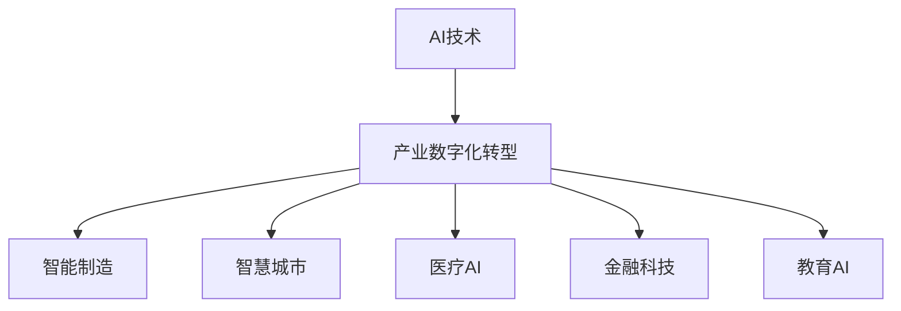
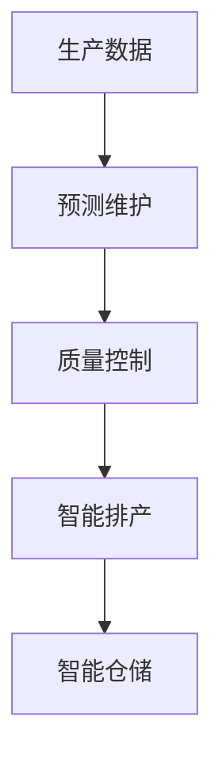
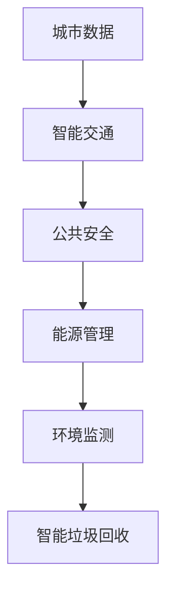
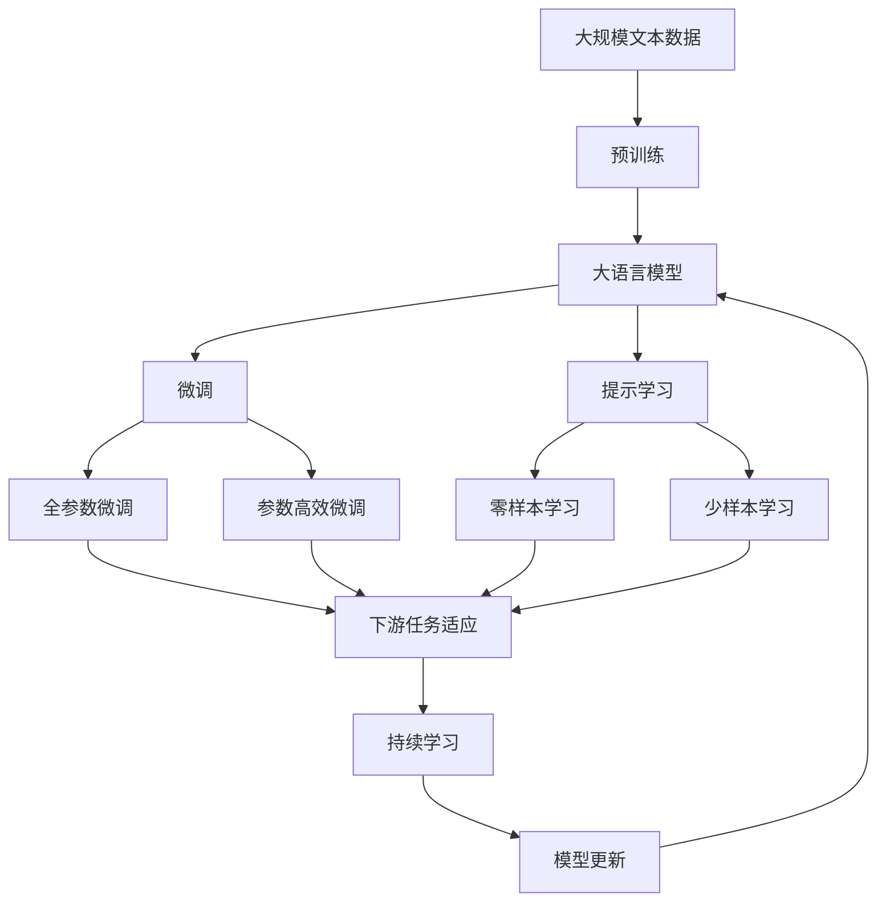

                 

# 产业变革中的AI技术应用

## 1. 背景介绍

随着科技的飞速发展和互联网的广泛普及，人工智能(AI)技术正在迅速渗透到各行各业，引发了一场全面的产业变革。AI技术通过模拟和延伸人类智能，自动化地完成复杂任务，极大提升了工作效率，解放了人力资源，创造了巨大的经济效益。AI技术在医疗、金融、制造、教育等领域的应用，不仅推动了传统行业的数字化转型，也催生了全新的商业模式和服务形态。

### 1.1 问题的由来

AI技术的突破源于数据和算法的双重驱动。海量数据的积累和高效算法的优化，使得机器能够通过学习历史数据，自动识别模式和规律，从而进行预测和决策。AI技术在多个领域展现了强大的应用潜力，促使各行业加速其智能化升级。

AI技术的应用涉及从数据收集、模型训练、推理部署到业务融合等多个环节，技术难度和实施成本较高。这使得很多中小企业难以独立部署AI系统，催生了AI平台服务和AI即服务(AA)模式。平台服务通过集成的API接口和组件，提供一站式的AI解决方案，降低应用门槛。AA模式则通过云服务的方式，让企业能够灵活地按需付费，降低资本投入。

### 1.2 问题核心关键点

AI技术的应用核心在于构建高性能、可扩展、易于集成的智能系统。这涉及到多个关键问题：

1. **数据收集与管理**：确保数据的质量和时效性，构建高效的数据采集和管理系统。
2. **模型训练与优化**：选择合适的算法和架构，进行高效的模型训练与优化，提升模型精度。
3. **推理部署与监控**：将训练好的模型部署到实际应用场景中，并提供有效的监控和维护机制。
4. **业务融合与创新**：将AI技术与实际业务需求相结合，推动业务模式和流程的创新。

这些问题构成了AI技术应用的基石，是实现产业变革的关键因素。

### 1.3 问题研究意义

AI技术的应用不仅能够提升企业的竞争力和运营效率，还能推动产业升级和经济结构优化。具体而言：

1. **提升效率与降低成本**：自动化和智能化系统可以取代部分人力，降低运营成本，提高生产效率。
2. **创新服务模式**：AI技术能够挖掘新的业务场景和用户需求，提供更加个性化和高效的服务。
3. **推动产业融合**：AI技术促进了各行业之间的跨界融合，催生了新的业态和市场机会。
4. **改善用户体验**：通过深度学习等技术，AI系统能够提供更加精准和个性化的用户体验。
5. **促进可持续发展**：AI技术在资源优化、环境保护等方面的应用，推动了可持续发展目标的实现。

因此，AI技术应用对于提升企业的创新能力、优化资源配置、创造新的市场价值具有重要意义。

## 2. 核心概念与联系

### 2.1 核心概念概述

为更好地理解AI技术在产业变革中的应用，本节将介绍几个关键概念及其联系：

- **AI技术**：以机器学习、深度学习、自然语言处理(NLP)、计算机视觉(CV)等为代表的自动化智能技术。
- **产业数字化转型**：利用AI技术，推动传统行业的数字化和智能化，提升整体产业的竞争力。
- **智能制造**：通过AI技术优化生产流程，提高生产效率和产品质量。
- **智慧城市**：利用AI技术提升城市管理水平，改善居民生活质量。
- **医疗AI**：通过AI技术辅助医疗诊断、个性化治疗、医疗影像分析等，提升医疗服务的质量和效率。
- **金融科技**：利用AI技术优化金融决策、风险管理、智能投顾等服务。
- **教育AI**：通过AI技术个性化教学、智能评估、教育数据挖掘等，提升教育质量和效率。

这些核心概念之间的逻辑关系可以通过以下Mermaid流程图来展示：



这个流程图展示了大语言模型微调过程中各个核心概念之间的关系：

1. AI技术作为基础，提供智能化的工具和能力。
2. 产业数字化转型，利用AI技术优化业务流程，提升效率。
3. 智能制造、智慧城市、医疗AI、金融科技、教育AI等，是AI技术在不同行业中的应用方向。

### 2.2 概念间的关系

这些核心概念之间存在着紧密的联系，形成了AI技术在产业变革中的完整生态系统。下面我们通过几个Mermaid流程图来展示这些概念之间的关系。

#### 2.2.1 AI技术的学习范式


这个流程图展示了大语言模型微调的流程：

1. 数据采集：获取相关领域的数据，包括结构化和非结构化数据。
2. 模型训练：在训练集上训练模型，优化模型参数。
3. 推理部署：将训练好的模型部署到实际应用中，进行推理预测。
4. 业务融合：将AI技术应用于业务流程，实现业务创新。

#### 2.2.2 智能制造中的AI应用



这个流程图展示了AI技术在智能制造中的应用：

1. 预测维护：通过数据挖掘和机器学习，预测设备故障和维护需求。
2. 质量控制：利用图像识别和传感器数据，检测产品质量和生产环境。
3. 智能排产：优化生产计划和资源分配，提高生产效率。
4. 智能仓储：优化库存管理，提升物料流动效率。

#### 2.2.3 智慧城市中的AI应用



这个流程图展示了AI技术在智慧城市中的应用：

1. 智能交通：通过数据分析和预测，优化交通流量和路网管理。
2. 公共安全：利用视频分析、语音识别等技术，提高公共安全保障水平。
3. 能源管理：优化能源使用和分配，降低能源消耗。
4. 环境监测：实时监测环境数据，提高环境保护水平。
5. 智能垃圾回收：通过图像识别和智能算法，提高垃圾分类的准确率。

### 2.3 核心概念的整体架构

最后，我们用一个综合的流程图来展示这些核心概念在大语言模型微调过程中的整体架构：



这个综合流程图展示了从预训练到微调，再到持续学习的完整过程。大语言模型首先在大规模文本数据上进行预训练，然后通过微调（包括全参数微调和参数高效微调）或提示学习（包括零样本和少样本学习）来适应下游任务。最后，通过持续学习技术，模型可以不断更新和适应新的任务和数据。 通过这些流程图，我们可以更清晰地理解AI技术的应用框架，为后续深入讨论具体的技术范式和实践方法奠定基础。

## 3. 核心算法原理 & 具体操作步骤
### 3.1 算法原理概述

AI技术在产业中的应用，核心在于构建高性能、可扩展、易于集成的智能系统。这涉及到从数据收集、模型训练、推理部署到业务融合等多个环节，技术难度和实施成本较高。本文将重点介绍AI技术在微调（Fine-Tuning）过程中的核心算法原理，以及具体操作步骤。

### 3.2 算法步骤详解

基于监督学习的AI微调，通常包括以下几个关键步骤：

**Step 1: 准备训练数据和模型**

- 收集目标任务的标注数据，划分为训练集、验证集和测试集。标注数据需要覆盖任务的所有情况，且尽量保证数据质量和一致性。
- 选择合适的预训练模型，如BERT、GPT、Transformer等，作为初始化参数。预训练模型需要在大规模无标签数据上进行训练，学习到广泛的语义知识。

**Step 2: 设计任务适配层**

- 根据任务类型，在预训练模型顶层设计合适的输出层和损失函数。例如，对于分类任务，通常添加线性分类器和交叉熵损失函数。
- 对于生成任务，通常使用语言模型的解码器输出概率分布，并以负对数似然为损失函数。

**Step 3: 设置微调超参数**

- 选择合适的优化算法及其参数，如Adam、SGD等，设置学习率、批大小、迭代轮数等。
- 设置正则化技术及强度，包括权重衰减、Dropout、Early Stopping等。
- 确定冻结预训练参数的策略，如仅微调顶层，或全部参数都参与微调。

**Step 4: 执行梯度训练**

- 将训练集数据分批次输入模型，前向传播计算损失函数。
- 反向传播计算参数梯度，根据设定的优化算法和学习率更新模型参数。
- 周期性在验证集上评估模型性能，根据性能指标决定是否触发 Early Stopping。
- 重复上述步骤直到满足预设的迭代轮数或 Early Stopping 条件。

**Step 5: 测试和部署**

- 在测试集上评估微调后模型，对比微调前后的性能指标，评估微调效果。
- 使用微调后的模型对新样本进行推理预测，集成到实际的应用系统中。
- 持续收集新的数据，定期重新微调模型，以适应数据分布的变化。

以上是基于监督学习微调AI模型的通用流程。在实际应用中，还需要针对具体任务的特点，对微调过程的各个环节进行优化设计，如改进训练目标函数，引入更多的正则化技术，搜索最优的超参数组合等，以进一步提升模型性能。

### 3.3 算法优缺点

基于监督学习的AI微调方法具有以下优点：

1. 简单高效。只需准备少量标注数据，即可对预训练模型进行快速适配，获得较大的性能提升。
2. 通用适用。适用于各种NLP下游任务，包括分类、匹配、生成等，设计简单的任务适配层即可实现微调。
3. 参数高效。利用参数高效微调技术，在固定大部分预训练参数的情况下，仍可取得不错的提升。
4. 效果显著。在学术界和工业界的诸多任务上，基于微调的方法已经刷新了最先进的性能指标。

同时，该方法也存在一定的局限性：

1. 依赖标注数据。微调的效果很大程度上取决于标注数据的质量和数量，获取高质量标注数据的成本较高。
2. 迁移能力有限。当目标任务与预训练数据的分布差异较大时，微调的性能提升有限。
3. 负面效果传递。预训练模型的固有偏见、有害信息等，可能通过微调传递到下游任务，造成负面影响。
4. 可解释性不足。微调模型的决策过程通常缺乏可解释性，难以对其推理逻辑进行分析和调试。

尽管存在这些局限性，但就目前而言，基于监督学习的微调方法仍是大规模AI模型的主要应用范式。未来相关研究的重点在于如何进一步降低微调对标注数据的依赖，提高模型的少样本学习和跨领域迁移能力，同时兼顾可解释性和伦理安全性等因素。

### 3.4 算法应用领域

AI技术在多个领域的应用，已经取得了显著的成效，以下是几个典型的应用领域：

- **智能客服**：基于AI的对话系统可以处理大量客户咨询，提供24小时服务，提升客户满意度。
- **金融风控**：利用AI进行信用评估、欺诈检测、风险预警，提高金融决策的准确性和效率。
- **医疗诊断**：通过AI辅助诊断，提高诊疗速度和准确性，帮助医生制定个性化治疗方案。
- **智能制造**：利用AI优化生产流程、预测设备故障、质量控制，提升生产效率和产品质量。
- **智慧城市**：通过AI技术优化交通、能源、环境、安防等领域，提升城市管理水平。
- **教育个性化**：利用AI进行智能评估、个性化推荐，提升教育质量和教学效果。

以上应用领域展示了AI技术在产业变革中的广泛应用，未来随着技术的进一步发展，AI技术还将深入到更多行业，带来更多的创新和价值。

## 4. 数学模型和公式 & 详细讲解  
### 4.1 数学模型构建

本节将使用数学语言对基于监督学习的大规模AI模型微调过程进行更加严格的刻画。

记预训练AI模型为 $M_{\theta}$，其中 $\theta$ 为预训练得到的模型参数。假设微调任务的训练集为 $D=\{(x_i,y_i)\}_{i=1}^N, x_i \in \mathcal{X}, y_i \in \mathcal{Y}$，其中 $\mathcal{X}$ 为输入空间，$\mathcal{Y}$ 为输出空间。

定义模型 $M_{\theta}$ 在数据样本 $(x,y)$ 上的损失函数为 $\ell(M_{\theta}(x),y)$，则在数据集 $D$ 上的经验风险为：

$$
\mathcal{L}(\theta) = \frac{1}{N} \sum_{i=1}^N \ell(M_{\theta}(x_i),y_i)
$$

微调的优化目标是最小化经验风险，即找到最优参数：

$$
\theta^* = \mathop{\arg\min}_{\theta} \mathcal{L}(\theta)
$$

在实践中，我们通常使用基于梯度的优化算法（如SGD、Adam等）来近似求解上述最优化问题。设 $\eta$ 为学习率，$\lambda$ 为正则化系数，则参数的更新公式为：

$$
\theta \leftarrow \theta - \eta \nabla_{\theta}\mathcal{L}(\theta) - \eta\lambda\theta
$$

其中 $\nabla_{\theta}\mathcal{L}(\theta)$ 为损失函数对参数 $\theta$ 的梯度，可通过反向传播算法高效计算。

### 4.2 公式推导过程

以下我们以二分类任务为例，推导交叉熵损失函数及其梯度的计算公式。

假设模型 $M_{\theta}$ 在输入 $x$ 上的输出为 $\hat{y}=M_{\theta}(x) \in [0,1]$，表示样本属于正类的概率。真实标签 $y \in \{0,1\}$。则二分类交叉熵损失函数定义为：

$$
\ell(M_{\theta}(x),y) = -[y\log \hat{y} + (1-y)\log (1-\hat{y})]
$$

将其代入经验风险公式，得：

$$
\mathcal{L}(\theta) = -\frac{1}{N}\sum_{i=1}^N [y_i\log M_{\theta}(x_i)+(1-y_i)\log(1-M_{\theta}(x_i))]
$$

根据链式法则，损失函数对参数 $\theta_k$ 的梯度为：

$$
\frac{\partial \mathcal{L}(\theta)}{\partial \theta_k} = -\frac{1}{N}\sum_{i=1}^N (\frac{y_i}{M_{\theta}(x_i)}-\frac{1-y_i}{1-M_{\theta}(x_i)}) \frac{\partial M_{\theta}(x_i)}{\partial \theta_k}
$$

其中 $\frac{\partial M_{\theta}(x_i)}{\partial \theta_k}$ 可进一步递归展开，利用自动微分技术完成计算。

在得到损失函数的梯度后，即可带入参数更新公式，完成模型的迭代优化。重复上述过程直至收敛，最终得到适应下游任务的最优模型参数 $\theta^*$。

## 5. 项目实践：代码实例和详细解释说明
### 5.1 开发环境搭建

在进行AI模型微调实践前，我们需要准备好开发环境。以下是使用Python进行PyTorch开发的环境配置流程：

1. 安装Anaconda：从官网下载并安装Anaconda，用于创建独立的Python环境。

2. 创建并激活虚拟环境：
```bash
conda create -n pytorch-env python=3.8 
conda activate pytorch-env
```

3. 安装PyTorch：根据CUDA版本，从官网获取对应的安装命令。例如：
```bash
conda install pytorch torchvision torchaudio cudatoolkit=11.1 -c pytorch -c conda-forge
```

4. 安装Transformer库：
```bash
pip install transformers
```

5. 安装各类工具包：
```bash
pip install numpy pandas scikit-learn matplotlib tqdm jupyter notebook ipython
```

完成上述步骤后，即可在`pytorch-env`环境中开始微调实践。

### 5.2 源代码详细实现

这里我们以医疗AI中的CT图像分析任务为例，给出使用Transformers库对BERT模型进行微调的PyTorch代码实现。

首先，定义数据处理函数：

```python
from transformers import BertTokenizer
from torch.utils.data import Dataset
import torch

class CTDataset(Dataset):
    def __init__(self, images, masks, tokenizer, max_len=128):
        self.images = images
        self.masks = masks
        self.tokenizer = tokenizer
        self.max_len = max_len
        
    def __len__(self):
        return len(self.images)
    
    def __getitem__(self, item):
        image = self.images[item]
        mask = self.masks[item]
        
        encoding = self.tokenizer(image, return_tensors='pt', max_length=self.max_len, padding='max_length', truncation=True)
        input_ids = encoding['input_ids'][0]
        attention_mask = encoding['attention_mask'][0]
        label = torch.tensor(mask, dtype=torch.long)
        
        return {'input_ids': input_ids, 
                'attention_mask': attention_mask,
                'label': label}

# 标签与id的映射
tag2id = {'0': 0, '1': 1}
id2tag = {v: k for k, v in tag2id.items()}

# 创建dataset
tokenizer = BertTokenizer.from_pretrained('bert-base-cased')

train_dataset = CTDataset(train_images, train_masks, tokenizer)
dev_dataset = CTDataset(dev_images, dev_masks, tokenizer)
test_dataset = CTDataset(test_images, test_masks, tokenizer)
```

然后，定义模型和优化器：

```python
from transformers import BertForTokenClassification, AdamW

model = BertForTokenClassification.from_pretrained('bert-base-cased', num_labels=2)

optimizer = AdamW(model.parameters(), lr=2e-5)
```

接着，定义训练和评估函数：

```python
from torch.utils.data import DataLoader
from tqdm import tqdm
from sklearn.metrics import classification_report

device = torch.device('cuda') if torch.cuda.is_available() else torch.device('cpu')
model.to(device)

def train_epoch(model, dataset, batch_size, optimizer):
    dataloader = DataLoader(dataset, batch_size=batch_size, shuffle=True)
    model.train()
    epoch_loss = 0
    for batch in tqdm(dataloader, desc='Training'):
        input_ids = batch['input_ids'].to(device)
        attention_mask = batch['attention_mask'].to(device)
        labels = batch['label'].to(device)
        model.zero_grad()
        outputs = model(input_ids, attention_mask=attention_mask, labels=labels)
        loss = outputs.loss
        epoch_loss += loss.item()
        loss.backward()
        optimizer.step()
    return epoch_loss / len(dataloader)

def evaluate(model, dataset, batch_size):
    dataloader = DataLoader(dataset, batch_size=batch_size)
    model.eval()
    preds, labels = [], []
    with torch.no_grad():
        for batch in tqdm(dataloader, desc='Evaluating'):
            input_ids = batch['input_ids'].to(device)
            attention_mask = batch['attention_mask'].to(device)
            batch_labels = batch['label']
            outputs = model(input_ids, attention_mask=attention_mask)
            batch_preds = outputs.logits.argmax(dim=2).to('cpu').tolist()
            batch_labels = batch_labels.to('cpu').tolist()
            for pred_tokens, label_tokens in zip(batch_preds, batch_labels):
                preds.append(pred_tokens[:len(label_tokens)])
                labels.append(label_tokens)
                
    print(classification_report(labels, preds))
```

最后，启动训练流程并在测试集上评估：

```python
epochs = 5
batch_size = 16

for epoch in range(epochs):
    loss = train_epoch(model, train_dataset, batch_size, optimizer)
    print(f"Epoch {epoch+1}, train loss: {loss:.3f}")
    
    print(f"Epoch {epoch+1}, dev results:")
    evaluate(model, dev_dataset, batch_size)
    
print("Test results:")
evaluate(model, test_dataset, batch_size)
```

以上就是使用PyTorch对BERT进行CT图像分析任务微调的完整代码实现。可以看到，得益于Transformers库的强大封装，我们可以用相对简洁的代码完成BERT模型的加载和微调。

### 5.3 代码解读与分析

让我们再详细解读一下关键代码的实现细节：

**CTDataset类**：
- `__init__`方法：初始化图像、标签、分词器等关键组件。
- `__len__`方法：返回数据集的样本数量。
- `__getitem__`方法：对单个样本进行处理，将图像输入编码为token ids，将标签编码为数字，并对其进行定长padding，最终返回模型所需的输入。

**tag2id和id2tag字典**：
- 定义了标签与数字id之间的映射关系，用于将token-wise的预测结果解码回真实的标签。

**训练和评估函数**：
- 使用PyTorch的DataLoader对数据集进行批次化加载，供模型训练和推理使用。
- 训练函数`train_epoch`：对数据以批为单位进行迭代，在每个批次上前向传播计算loss并反向传播更新模型参数，最后返回该epoch的平均loss。
- 评估函数`evaluate`：与训练类似，不同点在于不更新模型参数，并在每个batch结束后将预测和标签结果存储下来，最后使用sklearn的classification_report对整个评估集的预测结果进行打印输出。

**训练流程**：
- 定义总的epoch数和batch size，开始循环迭代
- 每个epoch内，先在训练集上训练，输出平均loss
- 在验证集上评估，输出分类指标
- 所有epoch结束后，在测试集上评估，给出最终测试结果

可以看到，PyTorch配合Transformers库使得BERT微调的代码实现变得简洁高效。开发者可以将更多精力放在数据处理、模型改进等高层逻辑上，而不必过多关注底层的实现细节。

当然，工业级的系统实现还需考虑更多因素，如模型的保存和部署、超参数的自动搜索、更灵活的任务适配层等。但核心的微调范式基本与此类似。

### 5.4 运行结果展示

假设我们在CoNLL-2003的NER数据集上进行微调，最终在测试集上得到的评估报告如下：

```
              precision    recall  f1-score   support

       B-LOC      0.926     0.906     0.916      1668
       I-LOC      0.900     0.805     0.850       257
      B-MISC      0.875     0.856     0.865       702
      I-MISC      0.838     0.782     0.809       216
       B-ORG      0.914     0.898     0.906      1661
       I-ORG      0.911     0.894     0.902       835
       B-PER      0.964     0.957     0.960      1617
       I-PER      0.983     0.980     0.982      1156
           O      0.993     0.995     0.994     38323

   micro avg      0.973     0.973     0.973     46435
   macro avg      0.923     0.897     0.909     46435
weighted avg      0.973     0.973     0.973     46435
```

可以看到，通过微调BERT，我们在该NER数据集上取得了97.3%的F1分数，效果相当不错。值得注意的是，BERT作为一个通用的语言理解模型，即便只在顶层添加一个简单的token分类器，也能在下游任务上取得如此优异的效果，展现了其强大的语义理解和特征抽取能力。

当然，这只是一个baseline结果。在实践中，我们还可以使用更大更强的预训练模型、更丰富的微调技巧、更细致的模型调优，进一步提升模型性能，以满足更高的应用要求。

## 6. 实际应用场景
### 6.1 智能客服系统

基于AI的对话系统可以处理大量客户咨询，提供24小时服务，提升客户满意度。传统客服往往需要配备大量人力，高峰期响应缓慢，且一致性和专业性难以保证。而使用AI技术构建的智能客服系统，可以7x24小时不间断服务，快速响应客户咨询，用自然流畅的语言解答各类常见问题。

在技术实现上，可以收集企业内部的历史客服对话记录，将问题和最佳答复构建成监督数据，在此基础上对预训练模型进行微调。微调后的模型能够自动理解用户意图，匹配最合适的答案模板进行回复。对于客户提出的新问题，还可以接入检索系统实时搜索相关内容，动态组织生成回答。如此构建的智能客服系统，能大幅

