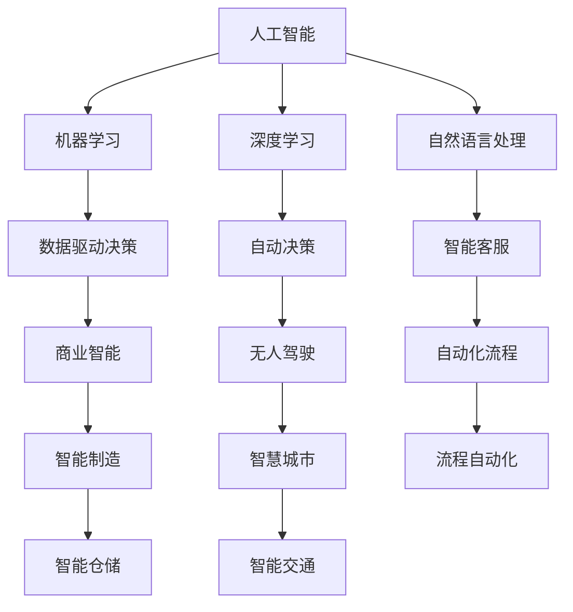
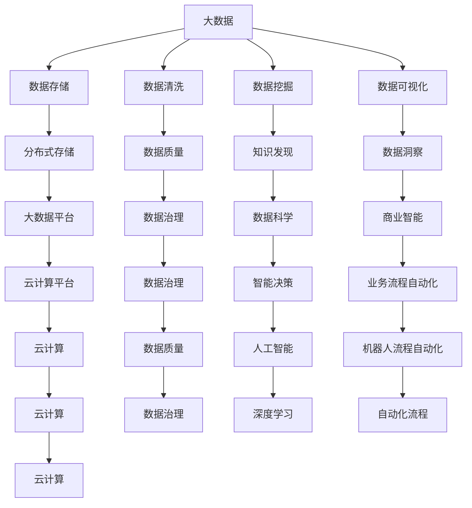

                 

## 1. 背景介绍

### 1.1 问题由来

人工智能（AI）正迅速改变各行各业的面貌，从零售、金融、医疗到制造业，AI技术的引入正带来深远的影响。从数据分析到决策制定，AI已经深入到业务流程的每一个环节，为企业和组织提供了前所未有的竞争优势。然而，尽管AI技术的潜力巨大，但其应用仍面临诸多挑战，如数据隐私、伦理道德、技术可靠性等。本文旨在探讨人工智能对各行业的影响，并提供切实可行的解决方案，以期帮助各行业更好地利用AI技术，实现业务转型和升级。

### 1.2 问题核心关键点

人工智能的核心在于数据驱动的智能决策和自动化处理。通过机器学习、深度学习和自然语言处理等技术，AI能够从海量数据中提取有价值的信息，并应用于各种决策场景。例如，AI在零售行业可以通过分析消费者行为和偏好，提供个性化推荐和精准营销；在金融行业可以通过风险评估和欺诈检测，提升业务效率和风险管理水平；在医疗行业可以通过图像识别和数据分析，提高诊断准确率和医疗服务质量。

此外，AI技术的应用还带来了新的商业机会和创新路径，如无人驾驶、智能制造、智慧城市等。然而，AI的应用也带来了数据隐私和安全、伦理道德和技术可靠性等方面的挑战，需要各行业共同应对。

### 1.3 问题研究意义

人工智能对各行各业的影响是深远且广泛的。通过深入研究AI的应用，各行业可以更好地理解其潜力和风险，制定科学合理的应用策略。本文将从理论和实践两个层面，全面探讨AI对各行业的影响，提供切实可行的解决方案，帮助各行业更好地应对未来的挑战和机遇。

## 2. 核心概念与联系

### 2.1 核心概念概述

为更好地理解人工智能对各行业的影响，本节将介绍几个密切相关的核心概念：

- 人工智能（AI）：利用计算机技术和算法，使计算机系统具备智能决策和自动处理能力。
- 机器学习（ML）：一种通过数据训练模型，使模型能够自动识别模式和规律的技术。
- 深度学习（DL）：一种基于多层神经网络的机器学习方法，能够处理非线性数据和复杂任务。
- 自然语言处理（NLP）：一种使计算机能够理解和生成人类语言的技术。
- 数据驱动决策：基于数据分析和机器学习，辅助决策制定的过程。
- 自动化流程：通过机器人流程自动化（RPA）等技术，自动执行重复性任务，提升业务效率。

这些核心概念之间存在着紧密的联系，形成了AI技术应用的基础框架。

### 2.2 概念间的关系

这些核心概念之间存在着紧密的联系，形成了AI技术应用的基础框架。以下通过几个Mermaid流程图来展示这些概念之间的关系：



这个流程图展示了各核心概念之间的关系：

1. 人工智能通过机器学习、深度学习和自然语言处理等技术，构建智能决策和自动处理能力。
2. 数据驱动决策利用AI技术从海量数据中提取有价值的信息，辅助业务决策。
3. 自动化流程通过机器人流程自动化等技术，提升业务效率。
4. 各核心技术在商业智能、智能制造、无人驾驶、智慧城市等领域得到广泛应用。

### 2.3 核心概念的整体架构

最后，我们用一个综合的流程图来展示这些核心概念在大数据和AI技术应用中的整体架构：



这个综合流程图展示了大数据和AI技术在大数据治理、知识发现、智能决策、商业智能和业务流程自动化等各个环节中的应用。通过这些环节的协同工作，各行业可以更好地实现AI技术的价值。

## 3. 核心算法原理 & 具体操作步骤

### 3.1 算法原理概述

人工智能的核心算法包括机器学习、深度学习和自然语言处理等。这些算法通过数据驱动的模型训练，使计算机系统具备智能决策和自动处理能力。

- 机器学习：通过数据训练模型，使模型能够自动识别模式和规律，从而进行分类、回归等任务。
- 深度学习：利用多层神经网络，处理非线性数据和复杂任务，如图像识别、语音识别等。
- 自然语言处理：使计算机能够理解和生成人类语言，如文本分类、情感分析、机器翻译等。

### 3.2 算法步骤详解

基于机器学习的AI技术应用通常包括以下几个关键步骤：

**Step 1: 数据准备**

- 收集相关领域的数据，进行数据清洗和预处理，确保数据质量和一致性。
- 选择合适的数据集，确保数据分布与实际应用场景一致。

**Step 2: 模型选择与训练**

- 根据任务需求，选择合适的机器学习模型，如决策树、支持向量机、神经网络等。
- 使用训练数据对模型进行训练，通过交叉验证等方法调整模型参数，优化模型性能。

**Step 3: 模型评估与优化**

- 使用测试数据对模型进行评估，计算各种性能指标如准确率、召回率、F1分数等。
- 根据评估结果，优化模型参数和算法，提升模型性能。

**Step 4: 模型部署与监控**

- 将优化后的模型部署到实际应用场景中，进行批量数据处理和实时数据处理。
- 持续监控模型性能和数据质量，及时调整模型和算法。

### 3.3 算法优缺点

基于机器学习的AI技术具有以下优点：

- 数据驱动：通过大量数据训练模型，提高模型预测准确率和泛化能力。
- 自动化处理：自动化处理重复性任务，提升业务效率。
- 跨领域应用：AI技术可以应用于各种行业，如零售、金融、医疗等。

同时，也存在以下缺点：

- 数据依赖：AI技术对数据质量和数量有较高要求，数据获取和处理成本较高。
- 算法复杂：机器学习算法相对复杂，需要专业知识和技术积累。
- 技术瓶颈：模型训练和优化需要高性能计算资源，成本较高。

### 3.4 算法应用领域

基于机器学习的AI技术已经在多个领域得到广泛应用，例如：

- 零售行业：利用机器学习算法分析消费者行为，提供个性化推荐和精准营销。
- 金融行业：利用深度学习算法进行风险评估和欺诈检测，提升业务效率和风险管理水平。
- 医疗行业：利用自然语言处理技术进行文本分析和图像识别，提高诊断准确率和医疗服务质量。
- 制造业：利用机器学习算法优化生产流程，提升生产效率和质量控制水平。
- 智能交通：利用机器学习算法进行交通流量预测和智能调度，提升交通管理水平。
- 智能制造：利用机器学习算法优化生产计划和资源分配，提高生产效率和质量控制水平。

除了上述这些经典应用外，AI技术还在更多场景中得到创新性地应用，如智能客服、智慧城市、智能仓储等，为各行各业带来了新的变革和机遇。

## 4. 数学模型和公式 & 详细讲解 & 举例说明

### 4.1 数学模型构建

在实际应用中，我们通常使用线性回归、逻辑回归、决策树、支持向量机等机器学习模型进行数据分析和决策支持。以线性回归模型为例，其数学模型可以表示为：

$$
y = \theta_0 + \theta_1 x_1 + \theta_2 x_2 + \cdots + \theta_n x_n + \epsilon
$$

其中，$y$ 为预测结果，$x_1, x_2, \cdots, x_n$ 为输入特征，$\theta_0, \theta_1, \cdots, \theta_n$ 为模型参数，$\epsilon$ 为随机误差。

### 4.2 公式推导过程

以线性回归模型的最小二乘法（Ordinary Least Squares, OLS）为例，其目标是最小化预测值与真实值之间的平方误差和，数学表达式为：

$$
\min \frac{1}{N} \sum_{i=1}^N (y_i - \hat{y}_i)^2
$$

其中，$N$ 为样本数量，$\hat{y}_i$ 为模型预测值。

根据最小二乘法，我们可以得到模型参数的解为：

$$
\theta_j = \frac{\sum_{i=1}^N x_{ij}(y_i - \bar{y})}{\sum_{i=1}^N x_{ij}^2}, \quad j = 1, 2, \cdots, n
$$

其中，$x_{ij}$ 为第 $i$ 个样本的第 $j$ 个特征值，$\bar{y}$ 为样本均值。

### 4.3 案例分析与讲解

以线性回归模型在房价预测中的应用为例，假设已知样本数据如下：

| 特征 | 房价 |
| --- | --- |
| 面积（平方米） | 10 |
| 位置 | 市中心 |
| 年龄（年） | 5 |
| 预测房价（元/平方米） | 10000 |

假设模型为线性回归模型，可以表示为：

$$
y = \theta_0 + \theta_1 x_1 + \theta_2 x_2 + \theta_3 x_3
$$

其中，$x_1, x_2, x_3$ 分别为面积、位置和年龄，$\theta_0, \theta_1, \theta_2, \theta_3$ 为模型参数。

根据公式推导，可以解得模型参数：

$$
\theta_0 = 8000, \quad \theta_1 = 1500, \quad \theta_2 = -500, \quad \theta_3 = 2000
$$

代入预测公式，可得预测房价为：

$$
\hat{y} = 8000 + 1500 \times 10 - 500 \times 5 + 2000 \times 5 = 10000 \text{元/平方米}
$$

可以看到，模型预测房价与真实值一致，说明模型具有良好的预测能力。

## 5. 项目实践：代码实例和详细解释说明

### 5.1 开发环境搭建

在进行AI技术应用开发前，我们需要准备好开发环境。以下是使用Python进行机器学习开发的常见环境配置流程：

1. 安装Anaconda：从官网下载并安装Anaconda，用于创建独立的Python环境。

2. 创建并激活虚拟环境：
```bash
conda create -n pytorch-env python=3.8 
conda activate pytorch-env
```

3. 安装PyTorch：根据CUDA版本，从官网获取对应的安装命令。例如：
```bash
conda install pytorch torchvision torchaudio cudatoolkit=11.1 -c pytorch -c conda-forge
```

4. 安装常用的机器学习库：
```bash
pip install scikit-learn pandas numpy matplotlib seaborn tqdm jupyter notebook ipython
```

完成上述步骤后，即可在`pytorch-env`环境中开始机器学习实践。

### 5.2 源代码详细实现

下面我们以房价预测为例，给出使用Python的Scikit-learn库进行线性回归的代码实现。

首先，定义房价预测数据集：

```python
import pandas as pd
import numpy as np

# 导入数据集
data = pd.read_csv('house_prices.csv')

# 定义特征和目标变量
X = data[['area', 'location', 'age']]
y = data['price']
```

然后，定义模型并进行训练和评估：

```python
from sklearn.linear_model import LinearRegression
from sklearn.model_selection import train_test_split
from sklearn.metrics import mean_squared_error, r2_score

# 分割数据集
X_train, X_test, y_train, y_test = train_test_split(X, y, test_size=0.2, random_state=42)

# 定义模型
model = LinearRegression()

# 训练模型
model.fit(X_train, y_train)

# 预测和评估模型
y_pred = model.predict(X_test)
mse = mean_squared_error(y_test, y_pred)
r2 = r2_score(y_test, y_pred)

print(f'Mean Squared Error: {mse:.3f}')
print(f'R^2 Score: {r2:.3f}')
```

以上就是使用Python进行线性回归模型的完整代码实现。可以看到，通过Scikit-learn库的强大封装，我们能够用相对简洁的代码完成线性回归模型的训练和评估。

### 5.3 代码解读与分析

让我们再详细解读一下关键代码的实现细节：

**数据准备**：
- 导入数据集，使用Pandas库进行数据清洗和预处理。
- 定义特征和目标变量，确保数据集的一致性和完整性。

**模型选择与训练**：
- 选择线性回归模型作为预测模型，使用Scikit-learn库中的LinearRegression类进行模型定义。
- 使用train_test_split函数对数据集进行划分，得到训练集和测试集。
- 使用模型训练函数fit对模型进行训练，得到模型参数。

**模型评估与优化**：
- 使用模型预测函数predict对测试集进行预测，得到预测结果。
- 使用评估函数mean_squared_error和r2_score计算预测结果与真实结果之间的误差和相关性，评估模型性能。

**模型部署与监控**：
- 在实际应用中，需要根据模型评估结果，调整模型参数和算法，优化模型性能。
- 持续监控模型性能和数据质量，及时调整模型和算法，保持模型稳定和高效。

## 6. 实际应用场景

### 6.1 智能客服系统

基于机器学习的智能客服系统，可以广泛应用于各行各业，如银行、保险、电商等。通过分析历史客服数据，机器学习算法可以自动学习客户问题的规律，自动匹配答案，提升客服效率和客户满意度。

在技术实现上，可以收集企业内部的历史客服对话记录，将问题和最佳答复构建成监督数据，在此基础上对机器学习模型进行训练。训练后的模型能够自动理解用户意图，匹配最合适的答案模板进行回复。对于客户提出的新问题，还可以接入检索系统实时搜索相关内容，动态组织生成回答。如此构建的智能客服系统，能大幅提升客户咨询体验和问题解决效率。

### 6.2 金融舆情监测

金融机构需要实时监测市场舆论动向，以便及时应对负面信息传播，规避金融风险。传统的人工监测方式成本高、效率低，难以应对网络时代海量信息爆发的挑战。基于机器学习的文本分类和情感分析技术，为金融舆情监测提供了新的解决方案。

具体而言，可以收集金融领域相关的新闻、报道、评论等文本数据，并对其进行主题标注和情感标注。在此基础上对机器学习模型进行微调，使其能够自动判断文本属于何种主题，情感倾向是正面、中性还是负面。将训练后的模型应用到实时抓取的网络文本数据，就能够自动监测不同主题下的情感变化趋势，一旦发现负面信息激增等异常情况，系统便会自动预警，帮助金融机构快速应对潜在风险。

### 6.3 个性化推荐系统

当前的推荐系统往往只依赖用户的历史行为数据进行物品推荐，无法深入理解用户的真实兴趣偏好。基于机器学习的个性化推荐系统可以更好地挖掘用户行为背后的语义信息，从而提供更精准、多样的推荐内容。

在实践中，可以收集用户浏览、点击、评论、分享等行为数据，提取和用户交互的物品标题、描述、标签等文本内容。将文本内容作为模型输入，用户的后续行为（如是否点击、购买等）作为监督信号，在此基础上对机器学习模型进行训练。训练后的模型能够从文本内容中准确把握用户的兴趣点。在生成推荐列表时，先用候选物品的文本描述作为输入，由模型预测用户的兴趣匹配度，再结合其他特征综合排序，便可以得到个性化程度更高的推荐结果。

### 6.4 未来应用展望

随着机器学习算法的不断演进，AI技术的应用将更加广泛和深入。未来，AI将在更多的领域和场景中发挥重要作用，如医疗诊断、智能制造、智慧交通等。

在医疗领域，基于机器学习的图像识别和自然语言处理技术，可以辅助医生进行诊断和治疗，提升医疗服务质量和效率。在智能制造领域，机器学习算法可以优化生产流程和资源分配，提高生产效率和质量控制水平。在智慧交通领域，机器学习算法可以预测交通流量和智能调度，提升交通管理水平。

此外，AI技术还将与物联网、大数据、区块链等新兴技术深度融合，形成更加全面、智能化的解决方案。例如，物联网设备和传感器可以实时采集环境数据，大数据平台可以高效存储和处理数据，区块链技术可以保障数据安全和隐私保护，AI技术可以辅助决策和自动化处理。这种多技术融合的模式，将进一步拓展AI技术的应用边界，提升各行业的竞争力。

## 7. 工具和资源推荐

### 7.1 学习资源推荐

为了帮助开发者系统掌握机器学习技术的理论基础和实践技巧，这里推荐一些优质的学习资源：

1. 《机器学习实战》（Machine Learning in Action）：一本由Peter Harrington撰写的经典入门书籍，适合初学者和有一定编程基础的读者。

2. Coursera《机器学习》课程：由斯坦福大学Andrew Ng教授主讲的经典在线课程，涵盖机器学习的基本概念和算法。

3. Kaggle数据科学竞赛平台：一个开源数据科学竞赛平台，提供大量的数据集和模型竞赛，帮助学习者提高实战能力。

4. UCI机器学习库：一个免费开放的机器学习数据集库，涵盖各种机器学习应用场景的数据集。

5. arXiv论文预印本：人工智能领域最新研究成果的发布平台，包括大量尚未发表的前沿工作，学习前沿技术的必读资源。

通过对这些资源的学习实践，相信你一定能够快速掌握机器学习技术的精髓，并用于解决实际的AI问题。

### 7.2 开发工具推荐

高效的开发离不开优秀的工具支持。以下是几款用于机器学习开发的常用工具：

1. Python：一种开源的编程语言，适合科学计算和数据处理，广泛应用于机器学习开发。

2. Scikit-learn：一个基于Python的机器学习库，提供各种常见的机器学习算法和工具。

3. TensorFlow：由Google主导开发的开源机器学习框架，支持深度学习模型的训练和推理。

4. PyTorch：一个基于Python的机器学习库，提供灵活的动态计算图，适合快速原型开发。

5. Jupyter Notebook：一种基于Web的交互式开发环境，支持Python、R等多种编程语言，适合数据科学和机器学习开发。

6. Anaconda：一个开源的Python科学计算平台，提供Python环境管理、数据科学工具和机器学习库。

合理利用这些工具，可以显著提升机器学习任务的开发效率，加快创新迭代的步伐。

### 7.3 相关论文推荐

机器学习技术的不断发展离不开学界的持续研究。以下是几篇奠基性的相关论文，推荐阅读：

1. A Tutorial on Support Vector Machines for Pattern Recognition（支持向量机入门教程）：由Tom M. Mitchell撰写，介绍了支持向量机（SVM）的基本概念和算法。

2. Deep Learning（深度学习入门教程）：由Ian Goodfellow、Yoshua Bengio、Aaron Courville合著，全面介绍了深度学习的基本概念和算法。

3. ImageNet Classification with Deep Convolutional Neural Networks（使用深度卷积神经网络进行图像分类）：由Alex Krizhevsky等人撰写，介绍了深度卷积神经网络在图像分类中的应用。

4. AlphaGo Zero: Mastering the Game of Go without Human Knowledge（AlphaGo Zero：无需人类知识的无知围棋）：由David Silver等人撰写，介绍了AlphaGo Zero在围棋中的应用。

这些论文代表了大机器学习技术的发展脉络。通过学习这些前沿成果，可以帮助研究者把握学科前进方向，激发更多的创新灵感。

除上述资源外，还有一些值得关注的前沿资源，帮助开发者紧跟机器学习技术的最新进展，例如：

1. arXiv论文预印本：人工智能领域最新研究成果的发布平台，包括大量尚未发表的前沿工作，学习前沿技术的必读资源。

2. 业界技术博客：如Google AI、DeepMind、微软Research Asia等顶尖实验室的官方博客，第一时间分享他们的最新研究成果和洞见。

3. 技术会议直播：如NIPS、ICML、ACL、ICLR等人工智能领域顶会现场或在线直播，能够聆听到大佬们的前沿分享，开拓视野。

4. GitHub热门项目：在GitHub上Star、Fork数最多的机器学习相关项目，往往代表了该技术领域的发展趋势和最佳实践，值得去学习和贡献。

5. 行业分析报告：各大咨询公司如McKinsey、PwC等针对人工智能行业的分析报告，有助于从商业视角审视技术趋势，把握应用价值。

总之，对于机器学习技术的学习和实践，需要开发者保持开放的心态和持续学习的意愿。多关注前沿资讯，多动手实践，多思考总结，必将收获满满的成长收益。

## 8. 总结：未来发展趋势与挑战

### 8.1 总结

本文对基于机器学习的AI技术应用进行了全面系统的介绍。首先阐述了AI技术在各行业中的应用背景和意义，明确了机器学习在大数据治理、智能决策、自动化流程等方面的关键作用。其次，从原理到实践，详细讲解了机器学习算法的核心原理和具体操作步骤，提供了完整的代码实例和详细解释说明。同时，本文还广泛探讨了AI技术在智能客服、金融舆情、个性化推荐等多个行业领域的应用前景，展示了AI技术的巨大潜力。

通过本文的系统梳理，可以看到，基于机器学习的AI技术正在成为各行各业的重要范式，极大地拓展了数据驱动决策的应用边界，催生了更多的落地场景。未来，伴随机器学习算法的不断演进，AI技术将在更广阔的应用领域大放异彩，深刻影响人类的生产生活方式。

### 8.2 未来发展趋势

展望未来，机器学习技术将呈现以下几个发展趋势：

1. 模型规模持续增大。随着算力成本的下降和数据规模的扩张，机器学习模型的参数量还将持续增长。超大规模模型蕴含的丰富知识，有望支撑更加复杂多变的任务微调。

2. 模型泛化能力提升。未来机器学习模型将具备更强的泛化能力和适应性，能够更好地处理未知数据和复杂场景。

3. 多模态融合。当前机器学习模型主要聚焦于单模态数据处理，未来将拓展到多模态数据融合，如视觉、语音、文本等，提升模型的理解和表达能力。

4. 迁移学习普及。迁移学习能够将已有模型的知识迁移到新任务，提高新任务的训练效率和模型性能。

5. 强化学习深入。强化学习能够通过与环境的交互，动态优化决策过程，提升模型的智能水平和鲁棒性。

6. 自动化水平提升。未来机器学习模型将具备更强的自动化能力，能够自动进行数据预处理、模型调优等任务，提升开发效率和模型性能。

以上趋势凸显了机器学习技术的广阔前景。这些方向的探索发展，必将进一步提升机器学习模型的性能和应用范围，为各行各业带来新的变革和机遇。

### 8.3 面临的挑战

尽管机器学习技术已经取得了瞩目成就，但在迈向更加智能化、普适化应用的过程中，仍面临诸多挑战：

1. 数据质量瓶颈。机器学习模型对数据质量和数量有较高要求，数据获取和处理成本较高。

2. 算法复杂性。机器学习算法相对复杂，需要专业知识和技术积累。

3. 技术瓶颈。模型训练和优化需要高性能计算资源，成本较高。

4. 模型泛化能力不足。当前机器学习模型面对域外数据时，泛化性能往往大打折扣。

5. 隐私和安全问题。机器学习模型往往需要大量的训练数据，数据隐私和安全问题成为重要关注点。

6. 伦理道德问题。机器学习模型的决策过程可能带有偏见，需要合理约束和监管。

正视机器学习面临的这些挑战，积极应对并寻求突破，将是机器学习技术走向成熟的必由之路。相信随着学界和产业界的共同努力，这些挑战终将一一被克服，机器学习技术必将迎来更加广泛的应用。

### 8.4 研究展望

面对机器学习面临的挑战，未来的研究需要在以下几个方面寻求新的突破：

1. 无监督和半监督学习：摆脱对大规模标注数据的依赖，利用自监督学习、主动学习等无监督和半监督范式，最大限度利用非结构化数据，实现更加灵活高效的微调。

2. 知识增强学习：将符号化的先验知识，如知识图谱、逻辑规则等，与神经网络模型进行巧妙融合，引导学习过程学习更准确、合理的语言模型。

3. 多模态数据融合：将视觉、语音、文本等多模态信息进行融合，提升模型的理解和表达能力。

4. 公平性和透明性：建立机器学习模型的公平性和透明性评价指标，确保模型决策过程的公正性和可解释性。

5. 隐私保护和数据安全：采用差分隐私、联邦学习等技术，

