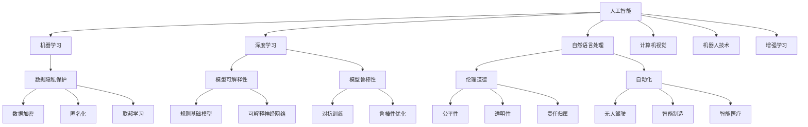
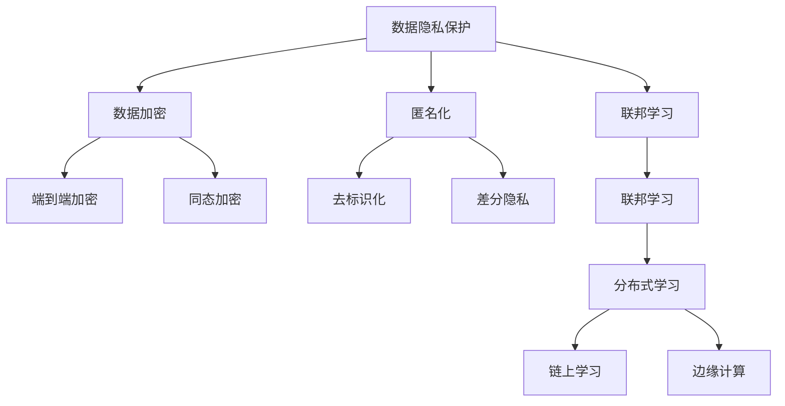
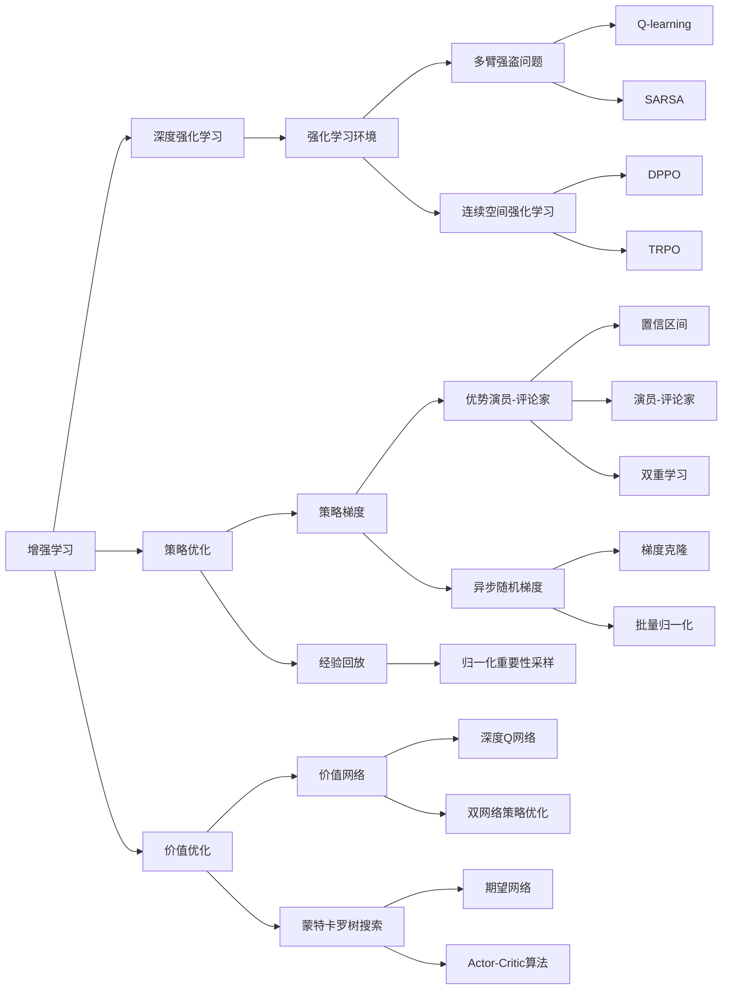

                 

# 人工智能的未来发展方向

## 1. 背景介绍

### 1.1 问题由来
在过去的几十年里，人工智能（AI）技术已经取得了巨大的进步。从机器学习、深度学习、自然语言处理（NLP）到计算机视觉、机器人技术、自动驾驶等，AI已经逐渐渗透到了各个领域，改变了人类的生产、生活和工作方式。然而，AI的发展也面临诸多挑战，如数据隐私保护、模型可解释性、伦理问题等，需要我们在未来不断探索和解决。

### 1.2 问题核心关键点
未来AI的发展方向主要集中在以下几个方面：

- 增强模型可解释性：提升模型的透明度，使人类能够理解模型的决策过程。
- 解决数据隐私保护：在保护用户隐私的前提下，充分利用数据资源。
- 解决模型鲁棒性问题：增强模型对对抗样本、噪声数据的鲁棒性。
- 促进AI与其它技术融合：如与物联网（IoT）、区块链、大数据等技术的融合。
- 增强AI系统的伦理道德：确保AI技术的道德使用，避免伦理问题。
- 促进AI的普及和应用：使AI技术更好地服务于各个行业和领域。

### 1.3 问题研究意义
未来AI的发展方向不仅能够提升AI技术的精度和效率，更能够推动AI在各个领域的应用和普及。这将带来巨大的经济、社会和科学价值，对人类社会的未来产生深远影响。

## 2. 核心概念与联系

### 2.1 核心概念概述

为更好地理解未来AI的发展方向，本节将介绍几个密切相关的核心概念：

- 人工智能（AI）：通过计算机程序模拟人类智能的一种技术，包括机器学习、深度学习、自然语言处理、计算机视觉、机器人技术等。
- 机器学习（ML）：让机器通过数据学习规律，自动完成特定任务的技术。
- 深度学习（DL）：一种特殊的机器学习方法，使用多层神经网络模拟人脑的工作机制。
- 自然语言处理（NLP）：使计算机能够理解、处理和生成人类语言的技术。
- 计算机视觉（CV）：使计算机能够“看”、“识别”和“理解”图像、视频等视觉数据的技术。
- 机器人技术：让机器人能够自主决策和执行任务的技术。
- 增强学习（RL）：一种使智能体在与环境的交互中学习最优策略的技术。
- 数据隐私保护：保护用户数据隐私的技术，包括数据加密、匿名化、联邦学习等。
- 模型可解释性：使模型输出具有可解释性的技术，包括规则基础模型、可解释神经网络等。
- 模型鲁棒性：使模型对对抗样本和噪声数据具有鲁棒性的技术，包括对抗训练、鲁棒性优化等。
- 伦理道德：确保AI技术使用的道德标准，包括公平性、透明性、责任归属等。
- 自动化：自动化技术在各个领域的广泛应用，包括无人驾驶、智能制造、智能医疗等。

这些核心概念之间的逻辑关系可以通过以下Mermaid流程图来展示：



这个流程图展示了一些核心概念之间的联系，以及它们在AI发展中的重要作用。

### 2.2 概念间的关系

这些核心概念之间存在着紧密的联系，形成了未来AI技术的完整生态系统。下面我通过几个Mermaid流程图来展示这些概念之间的关系。

#### 2.2.1 人工智能的子领域


这个流程图展示了人工智能的各个子领域，以及它们之间的联系和相互影响。

#### 2.2.2 数据隐私保护的技术



这个流程图展示了数据隐私保护的各种技术，以及它们在AI中的具体应用。

#### 2.2.3 增强学习的优化方法



这个流程图展示了增强学习的各种优化方法，以及它们在AI中的应用。

### 2.3 核心概念的整体架构

最后，我们用一个综合的流程图来展示这些核心概念在大规模人工智能技术发展中的整体架构：

```mermaid
graph TB
    A[大规模数据] --> B[数据隐私保护]
    A --> C[数据加密]
    A --> D[匿名化]
    A --> E[联邦学习]
    B --> F[端到端加密]
    B --> G[同态加密]
    B --> H[去标识化]
    B --> I[差分隐私]
    C --> J[规则基础模型]
    C --> K[可解释神经网络]
    C --> L[对抗训练]
    C --> M[鲁棒性优化]
    D --> N[公平性]
    D --> O[透明性]
    D --> P[责任归属]
    E --> Q[分布式学习]
    E --> R[链上学习]
    E --> S[边缘计算]
    F --> T[端到端加密]
    F --> U[同态加密]
    F --> V[去标识化]
    F --> W[差分隐私]
    G --> X[端到端加密]
    G --> Y[同态加密]
    G --> Z[去标识化]
    G --> $[差分隐私]
    H --> %[规则基础模型]
    H --> &[可解释神经网络]
    H --> '[对抗训练]
    H --> ][鲁棒性优化]
    I --> _[分布式学习]
    I --> `[链上学习]
    I --> a[边缘计算]
    J --> b[深度强化学习]
    J --> c[策略优化]
    J --> d[价值优化]
    K --> e[深度强化学习]
    K --> f[策略优化]
    K --> g[价值优化]
    L --> h[深度强化学习]
    L --> i[策略优化]
    L --> j[价值优化]
    M --> k[深度强化学习]
    M --> l[策略优化]
    M --> m[价值优化]
    N --> n[深度强化学习]
    N --> o[策略优化]
    N --> p[价值优化]
    O --> q[深度强化学习]
    O --> r[策略优化]
    O --> s[价值优化]
    P --> t[深度强化学习]
    P --> u[策略优化]
    P --> v[价值优化]
    Q --> w[深度强化学习]
    Q --> x[策略优化]
    Q --> y[价值优化]
    R --> z[深度强化学习]
    R --> A[策略优化]
    R --> B[价值优化]
    S --> C[深度强化学习]
    S --> D[策略优化]
    S --> E[价值优化]
    T --> F[深度强化学习]
    T --> G[策略优化]
    T --> H[价值优化]
    U --> I[深度强化学习]
    U --> J[策略优化]
    U --> K[价值优化]
    V --> L[深度强化学习]
    V --> M[策略优化]
    V --> N[价值优化]
    W --> O[深度强化学习]
    W --> P[策略优化]
    W --> Q[价值优化]
    X --> R[深度强化学习]
    X --> S[策略优化]
    X --> T[价值优化]
    Y --> U[深度强化学习]
    Y --> V[策略优化]
    Y --> W[价值优化]
    Z --> X[深度强化学习]
    Z --> Y[策略优化]
    Z --> Z[价值优化]
    $ --> a[深度强化学习]
    $ --> b[策略优化]
    $ --> c[价值优化]
    % --> _[深度强化学习]
    % --> `[策略优化]
    % --> a[价值优化]
    & --> b[深度强化学习]
    & --> c[策略优化]
    & --> d[价值优化]
    _ --> e[深度强化学习]
    _ --> f[策略优化]
    _ --> g[价值优化]
    ' --> h[深度强化学习]
    ' --> i[策略优化]
    ' --> j[价值优化]
    ` --> k[深度强化学习]
    ` --> l[策略优化]
    ` --> m[价值优化]
    a --> n[深度强化学习]
    a --> o[策略优化]
    a --> p[价值优化]
    b --> q[深度强化学习]
    b --> r[策略优化]
    b --> s[价值优化]
    c --> t[深度强化学习]
    c --> u[策略优化]
    c --> v[价值优化]
    d --> w[深度强化学习]
    d --> x[策略优化]
    d --> y[价值优化]
    e --> z[深度强化学习]
    e --> A[策略优化]
    e --> B[价值优化]
    f --> C[深度强化学习]
    f --> D[策略优化]
    f --> E[价值优化]
    g --> F[深度强化学习]
    g --> G[策略优化]
    g --> H[价值优化]
    h --> I[深度强化学习]
    h --> J[策略优化]
    h --> K[价值优化]
    i --> L[深度强化学习]
    i --> M[策略优化]
    i --> N[价值优化]
    j --> O[深度强化学习]
    j --> P[策略优化]
    j --> Q[价值优化]
    k --> R[深度强化学习]
    k --> S[策略优化]
    k --> T[价值优化]
    l --> U[深度强化学习]
    l --> V[策略优化]
    l --> W[价值优化]
    m --> X[深度强化学习]
    m --> Y[策略优化]
    m --> Z[价值优化]
    n --> a[深度强化学习]
    n --> b[策略优化]
    n --> c[价值优化]
    o --> _[深度强化学习]
    o --> `[策略优化]
    o --> a[价值优化]
    p --> b[深度强化学习]
    p --> c[策略优化]
    p --> d[价值优化]
    q --> e[深度强化学习]
    q --> f[策略优化]
    q --> g[价值优化]
    r --> h[深度强化学习]
    r --> i[策略优化]
    r --> j[价值优化]
    s --> k[深度强化学习]
    s --> l[策略优化]
    s --> m[价值优化]
    t --> n[深度强化学习]
    t --> o[策略优化]
    t --> p[价值优化]
    u --> q[深度强化学习]
    u --> r[策略优化]
    u --> s[价值优化]
    v --> t[深度强化学习]
    v --> u[策略优化]
    v --> w[价值优化]
    w --> x[深度强化学习]
    w --> y[策略优化]
    w --> z[价值优化]
    x --> a[深度强化学习]
    x --> b[策略优化]
    x --> c[价值优化]
    y --> _[深度强化学习]
    y --> `[策略优化]
    y --> a[价值优化]
    z --> b[深度强化学习]
    z --> c[策略优化]
    z --> d[价值优化]
    A --> B[深度强化学习]
    A --> C[策略优化]
    A --> D[价值优化]
    B --> E[深度强化学习]
    B --> F[策略优化]
    B --> G[价值优化]
    C --> H[深度强化学习]
    C --> I[策略优化]
    C --> J[价值优化]
    D --> K[深度强化学习]
    D --> L[策略优化]
    D --> M[价值优化]
    E --> N[深度强化学习]
    E --> O[策略优化]
    E --> P[价值优化]
    F --> Q[深度强化学习]
    F --> R[策略优化]
    F --> S[价值优化]
    G --> T[深度强化学习]
    G --> U[策略优化]
    G --> V[价值优化]
    H --> W[深度强化学习]
    H --> X[策略优化]
    H --> Y[价值优化]
    I --> Z[深度强化学习]
    I --> a[策略优化]
    I --> b[价值优化]
    J --> c[深度强化学习]
    J --> d[策略优化]
    J --> e[价值优化]
    K --> f[深度强化学习]
    K --> g[策略优化]
    K --> h[价值优化]
    L --> i[深度强化学习]
    L --> j[策略优化]
    L --> k[价值优化]
    M --> l[深度强化学习]
    M --> m[策略优化]
    M --> n[价值优化]
    N --> o[深度强化学习]
    N --> p[策略优化]
    N --> q[价值优化]
    O --> r[深度强化学习]
    O --> s[策略优化]
    O --> t[价值优化]
    P --> u[深度强化学习]
    P --> v[策略优化]
    P --> w[价值优化]
    Q --> x[深度强化学习]
    Q --> y[策略优化]
    Q --> z[价值优化]
    R --> A[深度强化学习]
    R --> B[策略优化]
    R --> C[价值优化]
    S --> D[深度强化学习]
    S --> E[策略优化]
    S --> F[价值优化]
    T --> G[深度强化学习]
    T --> H[策略优化]
    T --> I[价值优化]
    U --> J[深度强化学习]
    U --> K[策略优化]
    U --> L[价值优化]
    V --> M[深度强化学习]
    V --> N[策略优化]
    V --> O[价值优化]
    W --> P[深度强化学习]
    W --> Q[策略优化]
    W --> R[价值优化]
    X --> S[深度强化学习]
    X --> T[策略优化]
    X --> U[价值优化]
    Y --> V[深度强化学习]
    Y --> W[策略优化]
    Y --> X[价值优化]
    Z --> Y[深度强化学习]
    Z --> a[策略优化]
    Z --> b[价值优化]
    a --> c[深度强化学习]
    a --> d[策略优化]
    a --> e[价值优化]
    b --> f[深度强化学习]
    b --> g[策略优化]
    b --> h[价值优化]
    c --> i[深度强化学习]
    c --> j[策略优化]
    c --> k[价值优化]
    d --> l[深度强化学习]
    d --> m[策略优化]
    d --> n[价值优化]
    e --> o[深度强化学习]
    e --> p[策略优化]
    e --> q[价值优化]
    f --> r[深度强化学习]
    f --> s[策略优化]
    f --> t[价值优化]
    g --> u[深度强化学习]
    g --> v[策略优化]
    g --> w[价值优化]
    h --> x[深度强化学习]
    h --> y[策略优化]
    h --> z[价值优化]
    i --> A[深度强化学习]
    i --> B[策略优化]
    i --> C[价值优化]
    j --> D[深度强化学习]
    j --> E[策略优化]
    j --> F[价值优化]
    k --> G[深度强化学习]
    k --> H[策略优化]
    k --> I[价值优化]
    l --> J[深度强化学习]
    l --> K[策略优化]
    l --> L[价值优化]
    m --> M[深度强化学习]
    m --> N[策略优化]
    m --> O[价值优化]
    n --> P[深度强化学习]
    n --> Q[策略优化]
    n --> R[价值优化]
    o --> S[深度强化学习]
    o --> T[策略优化]
    o --> U[价值优化]
    p --> V[深度强化学习]
    p --> W[策略优化]
    p --> X[价值优化]
    q --> Y[深度强化学习]
    q --> Z[策略优化]
    q --> a[价值优化]
    r --> b[深度强化学习]
    r --> c[策略优化]
    r --> d[价值优化]
    s --> e[深度强化学习]
    s --> f[策略优化]
    s --> g[价值优化]
    t --> h[深度强化学习]
    t --> i[策略优化]
    t --> j[价值优化]
    u --> k[深度强化学习]
    u --> l[策略优化]
    u --> m[价值优化]
    v --> n[深度强化学习]
    v --> o[策略优化]
    v --> p[价值优化]
    w --> q[深度强化学习]
    w --> r[策略优化]
    w --> s[价值优化]
    x --> t[深度强化学习]
    x --> u[策略优化]
    x --> v[价值优化]
    y --> w[深度强化学习]
    y --> x[策略优化]
    y --> y[价值优化]
    z --> z[深度强化学习]
    z --> A[策略优化]
    z --> B[价值优化]
    A --> B[深度强化学习]
    A --> C[策略优化]
    A --> D[价值优化]
    B --> E[深度强化学习]
    B --> F[策略优化]
    B --> G[价值优化]
    C --> H[深度强化学习]
    C --> I[策略优化]
    C --> J[价值优化]
    D --> K[深度强化学习]
    D --> L[策略优化]
    D --> M[价值优化]
    E --> N[深度强化学习]
    E --> O[策略优化]
    E --> P[价值优化]
    F --> Q[深度强化学习]
    F --> R[策略优化]
    F --> S[价值优化]
    G --> T[深度强化学习]
    G --> U[策略优化]
    G --> V[价值优化]
    H --> W[深度强化学习]
    H --> X[策略优化]
    H --> Y[价值优化]
    I --> Z[深度强化学习]
    I --> a[策略优化]
    I --> b[价值优化]
    J --> c[深度强化学习]
    J --> d[策略优化]
    J --> e[价值优化]
    K --> f[深度强化学习]
    K --> g[策略优化]
    K --> h[价值优化]
    L --> i[深度强化学习]
    L --> j[策略优化]
    L --> k[价值优化]
    M --> l[深度强化学习]
    M --> m[策略优化]
    M --> n[价值优化]
    N --> o[深度强化学习]
    N --> p[策略优化]
    N --> q[价值优化]
    O --> r[深度强化学习]
    O --> s[策略优化]
    O --> t[价值优化]
    P --> u[深度强化学习]
    P --> v[策略优化]
    P --> w[价值优化]
    Q --> x[深度强化学习]
    Q --> y[策略优化]
    Q --> z[价值优化]
    R --> A[深度强化学习]
    R --> B[策略优化]
    R --> C[价值优化]
    S --> D[深度强化学习]
    S --> E[策略优化]
    S --> F[价值优化]
    T --> G[深度强化学习]
    T --> H[策略优化]
    T --> I[价值优化]
    U --> J[深度强化学习]
    U --> K[策略优化]
    U --> L[价值优化]
    V --> M[深度强化学习]
    V --> N[策略优化]
    V --> O[价值优化]
    W --> P[深度强化学习]
    W --> Q[策略优化]
    W --> R[价值优化]
    X --> S[深度强化学习]
    X --> T[策略优化]
    X --> U[价值优化]
    Y --> V[深度强化学习]
    Y --> W[策略优化]
    Y --> X[价值优化]
    Z --> Y[深度强化学习]
    Z --> a[策略优化]
    Z --> b[价值优化]
    a --> c[深度强化学习]
    a --> d[策略优化]
    a --> e[价值优化]
    b --> f[深度强化学习]
    b --> g[策略优化]
    b --> h[价值优化]
    c --> i[深度强化学习]
    c --> j[策略优化]
    c --> k[价值优化]
    d --> l[深度强化学习]
    d --> m[策略优化]
    d --> n[价值优化]
    e --> o[深度强化学习]
    e --> p[策略优化]
    e --> q[价值优化]
    f --> r[深度强化学习]
    f --> s[策略优化]
    f --> t[价值优化]
    g --> u[深度强化学习]
    g --> v[策略优化]
    g --> w[价值优化]
    h --> x[深度强化学习]
    h --> y[策略优化]
    h --> z[价值优化]
    i --> A[深度强化学习]
    i --> B[策略优化]
    i --> C[价值优化]
    j --> D[深度强化学习]
    j --> E[策略优化]
    j --> F[价值优化]
    k --> G[深度强化学习]
    k --> H[策略优化]
    k --> I[价值优化]
    l --> J[深度强化学习]
    l --> K[策略优化]
    l --> L[价值优化]
    m --> M[深度强化学习]
    m --> N[策略优化]
    m --> O[价值优化]
    n --> P[深度强化学习]
    n --> Q[策略优化]
    n --> R[价值优化]
    o --> S[深度强化学习]
    o --> T[策略优化]
    o --> U[价值优化]
    p --> V[深度强化学习]
    p --> W[策略优化]
    p --> X[价值优化]
    q --> Y[深度强化学习]
    q --> Z[策略优化]
    q --> a[价值优化]
    r --> b[深度强化学习]
    r --> c[策略优化]
    r --> d[价值优化]
    s --> e[深度强化学习]
    s --> f[策略优化]
    s --> g[价值优化]
    t --> h[深度强化学习]
    t --> i[策略优化]
    t --> j[价值优化]
    u --> k[深度强化学习]
    u --> l[策略优化]
    u --> m[价值优化]
    v --> n[深度强化学习]
    v --> o[策略优化]
    v --> p[价值优化]
    w --> q[深度强化学习]
    w --> r[策略优化]
    w --> s[价值优化]
    x --> t[深度强化学习]
    x --> u[策略优化]
    x --> v[价值优化]
    y --> w[深度强化学习]
    y --> x[策略优化]
    y --> y[价值优化]
    z --> z[深度强化学习]
    z --> A[策略优化]
    z --> B[价值优化]
    A --> B[深度强化学习]
    A --> C[策略优化]
    A --> D[价值优化]
    B --> E[深度强化学习]
    B --> F[策略优化]
    B --> G[价值优化]
    C --> H[深度强化学习]
    C --> I[策略优化]
    C --> J[价值优化]
    D --> K[深度强化学习]
    D --> L[策略优化]
    D

