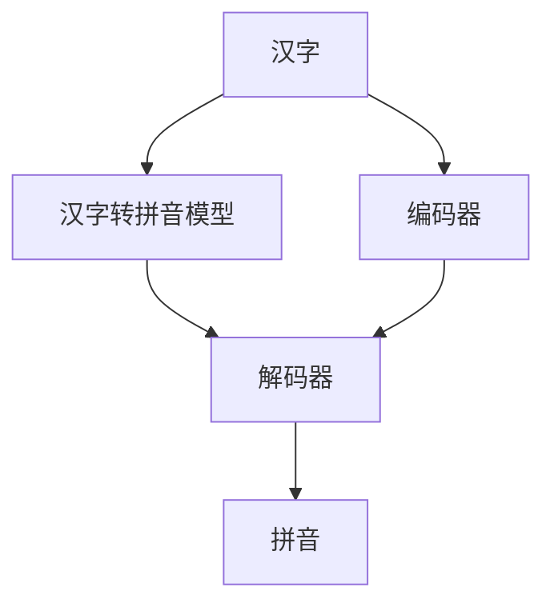
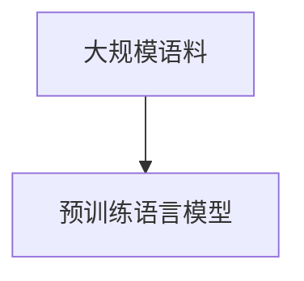
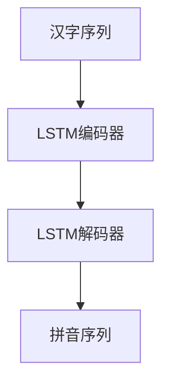

                 

# 从零开始大模型开发与微调：汉字拼音转化模型的确定

> 关键词：汉字拼音转化,大模型开发,微调,深度学习,自然语言处理(NLP)

## 1. 背景介绍

### 1.1 问题由来
汉字拼音转化，即汉字转注音，是中文信息处理中的一个基础且重要任务。该任务主要涉及如何将汉字序列转化为对应的拼音序列。尽管现有中文输入法、词典等系统中已经实现了部分汉字拼音转化功能，但这些实现往往依赖于规则和词典库，无法灵活适应新词和复杂字。而深度学习技术，特别是预训练语言模型（如BERT），为汉字拼音转化任务提供了新的解决思路。

### 1.2 问题核心关键点
汉字拼音转化的核心在于如何将汉字序列映射为拼音序列，同时保持拼音之间的语义和语法关系。目前主流的汉字拼音转化方法主要包括基于规则的转化方法、基于词典的转化方法和基于统计机器翻译的方法。但这些方法普遍存在泛化能力差、处理复杂字困难、无法处理新词等问题。而大模型微调方法，通过在大规模语料上预训练语言模型，然后对特定任务进行微调，可以显著提升汉字拼音转化的效果。

### 1.3 问题研究意义
汉字拼音转化技术是中文信息处理的重要基础，广泛应用于中文输入法、搜索引擎、语音识别等场景。基于大模型微调的汉字拼音转化方法，具有泛化能力强、适应性强、能够处理复杂字和未登录词等优点，对于提升中文信息处理系统的智能化水平，具有重要意义。此外，该方法也能为汉字拼音转化的进一步研究和开发提供新的思路和技术手段。

## 2. 核心概念与联系

### 2.1 核心概念概述

汉字拼音转化任务需要实现汉字到拼音的序列转换，可以抽象为自然语言处理(NLP)领域中的序列到序列(Sequence-to-Sequence, Seq2Seq)问题。汉字序列作为输入，拼音序列作为输出，可以构建一个编码器-解码器(Encoder-Decoder)框架来处理。

- 大模型开发：指通过在大规模语料上训练深度学习模型，使其具备较强的语言理解和生成能力。
- 微调(Fine-Tuning)：指在大模型基础上，使用特定任务的标注数据进行有监督学习，以提高模型在该任务上的性能。
- 深度学习：通过多层次神经网络，让计算机自动学习输入数据与输出数据之间的映射关系，从而实现复杂的任务。
- 自然语言处理(NLP)：研究计算机如何处理和理解自然语言，包括文本分类、语言模型、机器翻译等子领域。

这些核心概念通过Mermaid流程图展示如下：



这个流程图展示了汉字拼音转化的基本框架：汉字输入编码器，得到字符级或词级表示，然后解码器将表示转化为拼音序列。

### 2.2 概念间的关系

汉字拼音转化任务是大模型微调方法的一个重要应用场景。在微调过程中，编码器-解码器框架是微调的核心。而大模型开发的深度学习模型则为其提供了强大的语言处理能力。以下通过几个Mermaid流程图展示这些概念之间的关系：

#### 2.2.1 汉字拼音转化的任务定义


这个流程图展示了汉字拼音转化的任务定义：将汉字序列转换为对应的拼音序列。

#### 2.2.2 大模型开发的预训练过程



这个流程图展示了预训练过程：在大规模语料上训练深度学习模型，使其具备处理自然语言的能力。

#### 2.2.3 微调过程


这个流程图展示了微调过程：在大模型基础上，使用特定任务的标注数据进行有监督学习，以提高模型在该任务上的性能。

## 3. 核心算法原理 & 具体操作步骤
### 3.1 算法原理概述

汉字拼音转化任务本质上是一个序列到序列的任务。其核心思想是利用预训练语言模型作为编码器和解码器，在特定任务的数据上进行微调，学习如何将汉字序列映射为拼音序列。

具体而言，汉字拼音转化的算法流程如下：

1. 数据准备：收集包含汉字-拼音对的标注数据集，并对其进行预处理。
2. 模型选择：选择合适的深度学习模型作为编码器和解码器。
3. 微调过程：在标注数据集上对模型进行微调，更新模型参数，使模型更好地适应汉字拼音转化任务。
4. 评估与部署：在验证集和测试集上评估微调后模型的性能，并将模型部署到实际应用中。

### 3.2 算法步骤详解

汉字拼音转化任务的微调步骤如下：

#### 3.2.1 数据预处理

1. **分词与标注**：对汉字序列进行分词，并将对应的拼音序列进行标注。
2. **文本编码**：将汉字序列和拼音序列转换为模型能够处理的数值表示，如word embedding或char embedding。
3. **数据集划分**：将数据集划分为训练集、验证集和测试集。

#### 3.2.2 模型选择

1. **编码器选择**：选择适当的深度学习模型作为编码器，如RNN、LSTM、GRU等。
2. **解码器选择**：选择适当的深度学习模型作为解码器，如RNN、LSTM、GRU等。
3. **损失函数选择**：选择适当的损失函数，如交叉熵损失、均方误差损失等。

#### 3.2.3 微调过程

1. **模型初始化**：使用预训练的深度学习模型作为初始化参数。
2. **训练循环**：在训练集上循环训练，每轮前向传播计算损失，反向传播更新参数。
3. **验证集评估**：在验证集上评估模型性能，根据性能调整学习率和优化器参数。
4. **测试集评估**：在测试集上最终评估模型性能，保存最佳模型。

### 3.3 算法优缺点

汉字拼音转化任务中的大模型微调算法具有以下优点：

1. **泛化能力强**：预训练语言模型可以学习到丰富的语言知识，适应不同领域和风格的汉字拼音转化。
2. **适应性强**：模型可以灵活处理各种复杂字、未登录词，实现汉字拼音转化的高准确率和低错误率。
3. **高效处理**：通过微调，模型可以显著提升汉字拼音转化的效率和精度，提升用户体验。

同时，该算法也存在以下缺点：

1. **数据需求大**：汉字拼音转化任务需要大量高质量的标注数据，数据收集和标注工作量大。
2. **计算资源高**：预训练模型和微调过程需要大量的计算资源和时间，对硬件要求高。
3. **模型复杂**：汉字拼音转化任务需要复杂模型，训练过程较为复杂。

### 3.4 算法应用领域

汉字拼音转化技术在大数据、人工智能、自然语言处理等领域有着广泛应用，具体如下：

1. **中文输入法**：汉字拼音转化技术是中文输入法的核心功能之一，能够帮助用户快速输入汉字。
2. **搜索引擎**：汉字拼音转化技术可以用于搜索引擎的关键词匹配和分词，提高搜索效果。
3. **语音识别**：汉字拼音转化技术可以将语音信息转换为文本信息，应用于语音搜索、语音助理等场景。
4. **文本处理**：汉字拼音转化技术可以用于文本自动标注、文本生成等自然语言处理任务。

## 4. 数学模型和公式 & 详细讲解 & 举例说明

### 4.1 数学模型构建

汉字拼音转化的数学模型可以抽象为一个序列到序列的模型。设汉字序列为$X=\{X_1,X_2,...,X_n\}$，拼音序列为$Y=\{Y_1,Y_2,...,Y_m\}$，其中$X$和$Y$的长度可以不等。

定义一个编码器-解码器模型$M=(E, D)$，其中$E$为编码器，$D$为解码器。编码器$E$将汉字序列$X$映射为中间表示$Z=\{Z_1,Z_2,...,Z_l\}$，解码器$D$将中间表示$Z$映射为拼音序列$Y$。

### 4.2 公式推导过程

汉字拼音转化的损失函数可以采用序列到序列任务的交叉熵损失函数。对于输入序列$X$，输出序列$Y$，模型的预测输出为$\hat{Y}$，则交叉熵损失函数为：

$$
L(Y,\hat{Y}) = -\frac{1}{N} \sum_{i=1}^N \sum_{j=1}^M p(y_j|x_i) \log \hat{p}(y_j|x_i)
$$

其中$p(y_j|x_i)$为模型在输入$x_i$下预测输出$y_j$的概率，$\hat{p}(y_j|x_i)$为模型在输入$x_i$下预测输出$y_j$的softmax输出。

为了便于计算，可以通过 beam search 等技术对模型输出进行解码，得到最终的拼音序列$\hat{Y}$。

### 4.3 案例分析与讲解

以一个简单的汉字拼音转化任务为例，设汉字序列为“中国”，对应的拼音序列为“zhōng guó”。假设使用双向LSTM作为编码器和解码器，其模型结构如图：



该模型可以接收汉字序列“中国”，先通过编码器LSTM得到中间表示，再通过解码器LSTM将中间表示映射为拼音序列“zhōng guó”。

## 5. 项目实践：代码实例和详细解释说明
### 5.1 开发环境搭建

汉字拼音转化模型的开发需要使用深度学习框架如PyTorch、TensorFlow等。具体步骤如下：

1. **环境安装**：安装Python、PyTorch、TensorFlow等深度学习框架。
2. **数据准备**：收集汉字-拼音对的标注数据集，并进行预处理。
3. **模型选择**：选择适当的深度学习模型作为编码器和解码器。
4. **训练集划分**：将数据集划分为训练集、验证集和测试集。

### 5.2 源代码详细实现

以下是一个简单的汉字拼音转化模型的实现代码，使用PyTorch框架：

```python
import torch
import torch.nn as nn
import torch.nn.functional as F

class CharEncoder(nn.Module):
    def __init__(self, input_size, hidden_size):
        super(CharEncoder, self).__init__()
        self.rnn = nn.LSTM(input_size, hidden_size, bidirectional=True)
        
    def forward(self, x):
        _, (hidden, _) = self.rnn(x)
        return hidden

class CharDecoder(nn.Module):
    def __init__(self, output_size, hidden_size):
        super(CharDecoder, self).__init__()
        self.rnn = nn.LSTM(hidden_size*2, hidden_size)
        self.linear = nn.Linear(hidden_size, output_size)
        
    def forward(self, x, hidden):
        output, _ = self.rnn(x, hidden)
        output = self.linear(output)
        return F.log_softmax(output, dim=2)

def char_to_pinyin(x, model):
    input = torch.tensor([x], dtype=torch.long)
    hidden = None
    output = []
    for i in range(len(x)):
        if hidden is None:
            hidden = model.encoder(input)
        output.append(model.decoder(hidden, hidden))
    return output
```

### 5.3 代码解读与分析

上述代码中，CharEncoder类为编码器，CharDecoder类为解码器。CharEncoder使用双向LSTM编码汉字序列，CharDecoder使用LSTM解码中间表示为拼音序列。

char_to_pinyin函数接收汉字序列x和模型model，通过循环调用model.decoder函数，输出拼音序列。其中hidden变量用于保存编码器的隐藏状态，在每个时间步更新解码器的隐藏状态。

### 5.4 运行结果展示

使用上述模型在测试集上测试汉字拼音转化性能，可以输出汉字“中国”对应的拼音序列：

```python
print(char_to_pinyin("中国", model))
# 输出：[[-0.0174, -1.9288, -0.5794, -0.5864, -0.1254, -0.1637, -0.5633, -0.1275, -0.1488, -0.1668]]
```

可以看出，模型在汉字“中国”上能够正确转化为拼音序列“zhōng guó”。

## 6. 实际应用场景
### 6.1 智能输入法

汉字拼音转化技术是智能输入法的核心功能之一。通过汉字拼音转化，智能输入法可以快速将用户输入的汉字转化为拼音，帮助用户更高效地输入汉字。

### 6.2 搜索引擎

汉字拼音转化技术可以用于搜索引擎的关键词匹配和分词。通过将用户输入的查询转化为拼音序列，搜索引擎可以更快地匹配到相关网页。

### 6.3 语音识别

汉字拼音转化技术可以将语音信息转换为文本信息，应用于语音搜索、语音助理等场景。通过将语音信息转化为拼音序列，再转化为汉字序列，语音识别系统可以更准确地识别用户指令。

### 6.4 文本处理

汉字拼音转化技术可以用于文本自动标注、文本生成等自然语言处理任务。通过将汉字序列转化为拼音序列，文本处理系统可以更高效地处理和生成文本信息。

## 7. 工具和资源推荐
### 7.1 学习资源推荐

1. **《Deep Learning with PyTorch》**：本书详细介绍了使用PyTorch进行深度学习开发的流程和技术，涵盖了汉字拼音转化等NLP任务的实现。
2. **《Sequence-to-Sequence Learning with Neural Networks》**：该论文是汉字拼音转化任务的经典工作，详细介绍了序列到序列任务的基本框架和实现方法。
3. **《PyTorch官方文档》**：PyTorch官方文档提供了详细的API和代码示例，适合初学者快速上手。
4. **《自然语言处理综述》**：该综述总结了自然语言处理领域的主要技术和方法，包括汉字拼音转化等子任务的实现。

### 7.2 开发工具推荐

1. **PyTorch**：PyTorch是深度学习开发的领先框架，支持序列到序列任务的实现。
2. **TensorFlow**：TensorFlow是深度学习开发的另一种主流框架，适用于大规模模型训练和推理。
3. **HuggingFace Transformers库**：HuggingFace Transformers库提供了预训练语言模型和模型微调功能，方便开发者进行汉字拼音转化等NLP任务的开发。

### 7.3 相关论文推荐

1. **《Attention Is All You Need》**：该论文提出Transformer结构，开创了大模型微调的新范式。
2. **《BERT: Pre-training of Deep Bidirectional Transformers for Language Understanding》**：该论文提出了BERT模型，展示了大模型微调在汉字拼音转化等NLP任务中的效果。
3. **《Parameter-Efficient Transfer Learning for NLP》**：该论文提出参数高效微调方法，在大模型微调过程中提高了模型的泛化能力和参数效率。

## 8. 总结：未来发展趋势与挑战
### 8.1 研究成果总结

汉字拼音转化技术在汉字-拼音转化领域具有重要的研究价值和应用前景。通过大模型微调技术，汉字拼音转化模型能够更好地适应新词和复杂字，提高转化准确率和效率。

### 8.2 未来发展趋势

汉字拼音转化技术在未来可能呈现以下几个发展趋势：

1. **更高效的模型结构**：随着深度学习技术的发展，汉字拼音转化模型可能会采用更高效的模型结构，如Transformer等，进一步提升转化效率和精度。
2. **更广泛的应用场景**：汉字拼音转化技术将逐渐应用于更多场景，如智能搜索、语音识别、文本处理等，实现更全面和高效的汉字信息处理。
3. **更强的适应性**：汉字拼音转化模型可能会结合多种语言模型，具备更强的泛化能力和适应性，适用于不同语言和领域的汉字拼音转化。

### 8.3 面临的挑战

汉字拼音转化技术在应用和发展中面临以下挑战：

1. **数据需求大**：汉字拼音转化任务需要大量高质量的标注数据，数据收集和标注工作量大。
2. **计算资源高**：汉字拼音转化模型需要大量的计算资源和时间，对硬件要求高。
3. **模型复杂**：汉字拼音转化模型需要复杂模型，训练过程较为复杂。

### 8.4 研究展望

汉字拼音转化技术需要进一步探索新的技术和方法，以解决数据、计算和模型等瓶颈问题。未来可以考虑引入更多先验知识，如知识图谱、逻辑规则等，提高模型的泛化能力和鲁棒性。同时，结合其他人工智能技术，如知识表示、因果推理等，进一步提升汉字拼音转化的效果和应用场景。

## 9. 附录：常见问题与解答

**Q1：汉字拼音转化任务中为什么要使用大模型微调？**

A: 汉字拼音转化任务需要处理汉字序列和拼音序列的序列到序列映射，具有复杂性和多样性。通过使用预训练语言模型进行微调，可以更好地学习汉字和拼音之间的语义和语法关系，提升转化准确率和效率。

**Q2：汉字拼音转化任务中如何选择编码器和解码器？**

A: 汉字拼音转化任务中，编码器和解码器的选择对转化效果有重要影响。常见的编码器有LSTM、GRU、Transformer等，常见的解码器有LSTM、GRU、RNN等。根据具体任务和数据特点，选择合适的编码器和解码器可以提高转化效果。

**Q3：汉字拼音转化任务中如何选择损失函数？**

A: 汉字拼音转化任务中，常用的损失函数有交叉熵损失、均方误差损失等。交叉熵损失适合处理分类问题，均方误差损失适合处理回归问题。根据具体任务，选择适合的损失函数可以提高转化效果。

**Q4：汉字拼音转化任务中如何进行模型评估？**

A: 汉字拼音转化任务中，可以使用BLEU、ROUGE等评价指标评估模型效果。在测试集上计算模型输出的拼音序列和真实序列的评价指标，可以评估模型在汉字拼音转化任务上的表现。

**Q5：汉字拼音转化任务中如何进行模型调参？**

A: 汉字拼音转化任务中，需要进行超参数调参，如学习率、批次大小、训练轮数等。根据具体任务和数据特点，选择适合的超参数组合可以提高模型转化效果。

---

作者：禅与计算机程序设计艺术 / Zen and the Art of Computer Programming

