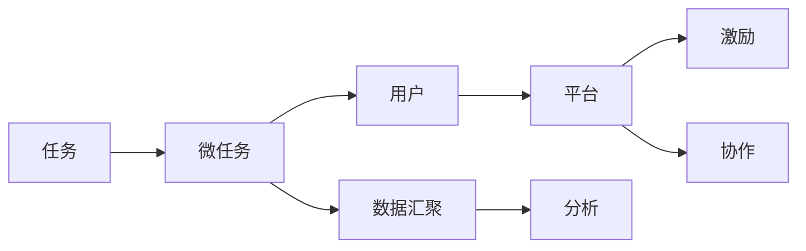

                 

# 众包：汇聚微光，点亮科技未来

## 1. 背景介绍

随着信息技术的迅猛发展，人类社会的生产、生活和科技研究方式都发生了巨大的变革。众包(Crowdsourcing)作为一种新型的生产模式和组织形式，将分散在全球的众多微小资源聚合起来，共同完成某一复杂任务，从而大大提高了生产效率，降低了成本，加速了科技创新。众包不仅在科技研究和商业应用中大放异彩，而且在社会治理、公益事业等多个领域也显示出巨大的潜力。本文将系统性地介绍众包的原理、机制和实际应用，探讨其对科技未来发展的影响，并展望其在未来的发展趋势和挑战。

## 2. 核心概念与联系

### 2.1 核心概念概述

为全面理解众包的原理和机制，本节将介绍几个关键概念：

- **众包**：指的是将原本由个人或专业团队完成的任务，通过互联网平台公开征集，动员大量用户参与，共同完成的任务。
- **微任务**：众包平台上的任务通常被拆分成小的、独立的任务单元，便于用户逐一完成。
- **激励机制**：为吸引用户参与，众包平台通常会设计一定的奖励或激励机制，如现金、虚拟货币、积分等。
- **平台协作**：众包平台通常会提供一些协作工具，如即时通讯、评论、协作编辑等，帮助用户高效完成任务。

这些概念共同构成了众包的基本框架，通过将复杂的任务拆解为多个小任务，再通过互联网平台动员用户参与，可以在极短的时间内完成大规模的、高度复杂的任务。

### 2.2 核心概念的联系

众包的实现离不开多个核心概念之间的紧密联系：

1. **微任务的拆解与分配**：众包的核心是将复杂任务拆解为多个小的、独立的任务，再通过平台分配给用户完成。
2. **用户参与与激励**：众包平台通过合理的激励机制，鼓励更多用户参与，形成正反馈循环，保证任务的顺利完成。
3. **平台协作与沟通**：众包平台提供的协作工具，使得用户在完成任务时能够高效沟通和协作，共同解决遇到的问题。
4. **数据汇聚与分析**：通过众包平台汇聚的大量数据，可以用于数据分析、模型训练等科研应用，提升任务的完成质量。

通过这些联系，众包得以在多个领域内发挥其独特优势，显著提升任务完成效率和质量，推动科技研究和社会进步。

### 2.3 核心概念的整体架构

我们通过一个Mermaid流程图来展示众包的核心概念及其整体架构：



这个流程图展示了众包的基本流程：

1. 任务被拆解为微任务。
2. 平台将微任务分配给用户。
3. 用户通过平台参与任务完成，并得到相应激励。
4. 用户之间通过平台协作工具进行沟通。
5. 数据通过平台汇聚，用于进一步分析和建模。

众包通过这些流程将大量分散的资源聚合起来，共同完成复杂的任务，展示了其强大的组织能力和效率提升潜力。

## 3. 核心算法原理 & 具体操作步骤

### 3.1 算法原理概述

众包的算法原理主要基于任务拆解、用户分配和激励机制的设计。为了系统地描述众包算法的原理，我们将其分为三个核心部分：

1. **任务拆解算法**：将复杂任务拆解为可操作的小任务单元，确保每个微任务具有明确的完成标准和时间要求。
2. **用户分配算法**：根据用户的能力、信誉和参与度等因素，合理分配任务，保证任务的高效完成。
3. **激励机制设计**：通过设计合理的激励机制，激励用户积极参与任务，并保持高质量的完成任务。

### 3.2 算法步骤详解

以下是众包算法步骤的详细解释：

**Step 1: 任务定义与拆解**
- 确定任务的目标和要求。
- 将任务拆解为多个独立的小任务，每个任务有明确的完成标准和时间要求。
- 定义任务之间的依赖关系，确保任务的逻辑连贯性和完整性。

**Step 2: 用户注册与筛选**
- 用户在平台上注册，提供基本信息和专业技能。
- 平台根据用户的背景、经验和信誉进行筛选，确保用户的可靠性。
- 对用户进行初步的培训和测试，确保其具备完成任务的能力。

**Step 3: 任务发布与分配**
- 将任务发布到平台上，明确任务目标、要求和报酬。
- 根据用户的能力和可用时间，动态分配任务。
- 设定任务的截止时间，确保任务按时完成。

**Step 4: 任务执行与协作**
- 用户接收到任务后，开始执行任务。
- 用户之间可以通过平台提供的协作工具进行沟通和协作。
- 平台提供实时进度跟踪，帮助用户监控任务进度。

**Step 5: 任务审核与评价**
- 平台对完成任务的用户进行审核，确保任务的完成质量和准确性。
- 用户对其他用户的任务完成情况进行评价，形成信誉系统。
- 根据评价结果调整用户的任务分配，提升任务完成效率。

**Step 6: 任务反馈与迭代**
- 收集任务完成的反馈信息，用于进一步优化任务拆解和分配。
- 分析数据，优化激励机制，提高用户参与度。
- 对任务进行迭代，不断改进任务的拆解和分配方法。

### 3.3 算法优缺点

众包算法的优点包括：

1. **高效完成任务**：通过将任务拆解为微任务，并动态分配给用户，可以显著提高任务的完成效率。
2. **降低成本**：利用大量低成本的用户资源，降低了完成任务的总体成本。
3. **鼓励创新**：众包平台通常会鼓励用户提出新思路和方法，推动创新。
4. **数据丰富**：众包过程中产生的大量数据可以用于科研分析和模型训练。

然而，众包算法也存在一些缺点：

1. **质量难以保证**：由于参与用户的水平参差不齐，任务完成的准确性和质量难以保证。
2. **激励机制复杂**：设计合理的激励机制需要考虑多方面因素，如任务难度、用户表现等。
3. **用户管理困难**：需要建立有效的用户管理体系，以确保任务分配的公平和透明。
4. **数据隐私问题**：平台需要确保用户数据的隐私和安全，防止数据泄露和滥用。

### 3.4 算法应用领域

众包算法不仅在科技研究和商业应用中大放异彩，而且在社会治理、公益事业等多个领域也显示出巨大的潜力。以下是众包算法的主要应用领域：

- **科学研究**：在基因组学、天文学、社会科学等领域，通过众包平台收集大量数据，推动科研创新。
- **软件开发**：在开源社区，通过众包平台征集代码修复、功能扩展等任务，加速软件迭代。
- **智能制造**：在制造业，通过众包平台征集设计、测试等任务，推动智能制造和个性化生产。
- **社会治理**：在政府服务中，通过众包平台征集城市管理、公共安全等任务，提升社会治理效率。
- **公益事业**：在环境保护、灾害救援等领域，通过众包平台征集志愿者和数据收集任务，推动公益事业发展。

## 4. 数学模型和公式 & 详细讲解 & 举例说明

### 4.1 数学模型构建

众包算法的数学模型通常包括以下几个部分：

- **任务拆解模型**：将复杂任务拆解为多个微任务，每个微任务有明确的完成标准和时间要求。
- **用户分配模型**：根据用户的能力和信誉，合理分配任务，确保任务的高效完成。
- **激励机制模型**：设计合理的激励机制，激励用户积极参与任务，并保持高质量的完成任务。

### 4.2 公式推导过程

**任务拆解模型**：假设复杂任务A可以拆解为n个微任务{A1, A2, ..., An}，每个微任务Ai有明确的完成标准Ti和截止时间Tj。

**用户分配模型**：假设用户U有背景信息B、经验E和信誉R，平台根据这些信息，将任务A分配给用户U。

**激励机制模型**：假设任务的奖励为P，用户完成微任务Ai后得到奖励Ri，平台根据用户完成任务的质量和效率，给出相应的奖励Ri。

### 4.3 案例分析与讲解

以社交媒体情感分析为例，通过众包平台征集用户对社交媒体帖子进行情感标注，并根据标注质量给予奖励。

**任务拆解**：将社交媒体帖子拆解为句子级别的任务，每个任务有明确的情感标签（如正面、负面、中性）。

**用户分配**：根据用户的语言学背景、情感分析经验，合理分配任务。

**激励机制**：对标注质量高的用户给予额外奖励，如现金、积分等，并公开标注结果，形成用户之间的竞争机制。

## 5. 项目实践：代码实例和详细解释说明

### 5.1 开发环境搭建

在进行众包项目开发前，我们需要准备好开发环境。以下是使用Python进行开发的环境配置流程：

1. 安装Anaconda：从官网下载并安装Anaconda，用于创建独立的Python环境。

2. 创建并激活虚拟环境：
```bash
conda create -n crowd-sourcing python=3.8 
conda activate crowd-sourcing
```

3. 安装必要的库：
```bash
pip install flask
pip install gunicorn
pip install psycopg2
```

4. 安装PostgreSQL数据库：
```bash
brew install postgresql
```

5. 创建数据库并配置连接：
```bash
createdb crowd_sourcing
psql -U postgres -d crowd_sourcing -h localhost -p 5432
```

完成上述步骤后，即可在`crowd-sourcing`环境中开始众包项目的开发。

### 5.2 源代码详细实现

接下来，我们将展示一个简单的众包平台代码实现。

**数据库设计**：

```sql
CREATE TABLE tasks (
    task_id SERIAL PRIMARY KEY,
    task_name VARCHAR(255),
    task_description TEXT,
    start_time TIMESTAMP,
    end_time TIMESTAMP,
    reward DECIMAL(10, 2)
);

CREATE TABLE users (
    user_id SERIAL PRIMARY KEY,
    username VARCHAR(255),
    background_info TEXT,
    experience DECIMAL(10, 2),
    reputation DECIMAL(10, 2)
);

CREATE TABLE task_assignments (
    task_id SERIAL PRIMARY KEY,
    user_id INTEGER,
    assign_time TIMESTAMP,
    complete_time TIMESTAMP,
    status TEXT,
    FOREIGN KEY (user_id) REFERENCES users(user_id)
);
```

**API设计**：

```python
from flask import Flask, request, jsonify

app = Flask(__name__)

@app.route('/tasks', methods=['POST'])
def create_task():
    task_data = request.json
    # 创建任务并存储到数据库
    task = {
        'task_id': generate_task_id(),
        'task_name': task_data['name'],
        'task_description': task_data['description'],
        'start_time': task_data['start_time'],
        'end_time': task_data['end_time'],
        'reward': task_data['reward']
    }
    db.execute('INSERT INTO tasks VALUES (%s, %s, %s, %s, %s, %s)', [task['task_id'], task['task_name'], task['task_description'], task['start_time'], task['end_time'], task['reward']])
    db.commit()
    return jsonify({'task_id': task['task_id']})

@app.route('/tasks/<task_id>', methods=['DELETE'])
def delete_task(task_id):
    db.execute('DELETE FROM tasks WHERE task_id = %s', [task_id])
    db.commit()
    return jsonify({'message': 'Task deleted'})

@app.route('/assignments', methods=['POST'])
def assign_task():
    assignment_data = request.json
    # 分配任务并存储到数据库
    assignment = {
        'assignment_id': generate_assignment_id(),
        'task_id': assignment_data['task_id'],
        'user_id': assignment_data['user_id'],
        'assign_time': assignment_data['assign_time'],
        'complete_time': None,
        'status': 'ASSIGNED'
    }
    db.execute('INSERT INTO task_assignments VALUES (%s, %s, %s, %s, %s)', [assignment['assignment_id'], assignment['task_id'], assignment['user_id'], assignment['assign_time'], assignment['status']])
    db.commit()
    return jsonify({'assignment_id': assignment['assignment_id']})

@app.route('/assignments/<assignment_id>', methods=['UPDATE'])
def update_assignment(assignment_id):
    assignment_data = request.json
    # 更新任务状态
    db.execute('UPDATE task_assignments SET complete_time = %s, status = %s WHERE assignment_id = %s', [assignment_data['complete_time'], assignment_data['status'], assignment_id])
    db.commit()
    return jsonify({'message': 'Assignment updated'})

if __name__ == '__main__':
    app.run(debug=True)
```

**代码解读与分析**：

- **数据库设计**：通过SQL语句定义了任务、用户和任务分配三个表，存储了任务的详细信息、用户的基本信息以及任务与用户之间的分配关系。
- **API设计**：定义了创建任务、删除任务、分配任务和更新任务状态的四个API接口，分别对应众包平台的任务管理、任务分配和任务状态更新功能。

**运行结果展示**：

假设我们在众包平台上创建了一个任务，并通过API将其分配给用户，最终任务完成并更新任务状态，API调用结果如下：

```
POST /tasks HTTP/1.1
Host: localhost:5000
Content-Type: application/json

{
    "name": "情感分析任务",
    "description": "对社交媒体帖子进行情感标注",
    "start_time": "2023-01-01 00:00:00",
    "end_time": "2023-01-05 23:59:59",
    "reward": 5.00
}

{
    "task_id": 1
}

POST /assignments HTTP/1.1
Host: localhost:5000
Content-Type: application/json

{
    "task_id": 1,
    "user_id": 1001,
    "assign_time": "2023-01-02 00:00:00"
}

{
    "assignment_id": 1
}

UPDATE /assignments/1 HTTP/1.1
Host: localhost:5000
Content-Type: application/json

{
    "complete_time": "2023-01-02 12:00:00",
    "status": "COMPLETE"
}

{
    "message": "Assignment updated"
}
```

以上代码和结果展示了使用Python和SQLite实现一个简单的众包平台的基本功能。开发者可以进一步扩展此框架，添加更多功能如用户管理、任务评价、激励机制等，构建一个更完整的众包系统。

## 6. 实际应用场景

### 6.1 科学研究

在科学研究中，众包平台可以发挥重要作用。例如，通过众包平台征集用户对基因组数据进行注释和分析，收集大量高质量的注释数据，推动基因组学和生物信息学的研究进展。

### 6.2 智能制造

在智能制造领域，众包平台可以用于产品设计和制造。例如，通过众包平台征集用户对新产品的设计方案进行投票和评论，快速迭代和优化产品设计。

### 6.3 社会治理

在社会治理中，众包平台可以用于城市管理和公共服务。例如，通过众包平台征集用户对城市环境问题的监测和报告，提升城市治理的效率和透明度。

### 6.4 未来应用展望

随着人工智能和大数据技术的不断发展，众包平台的应用前景将更加广阔。未来，众包平台将具备以下特点：

1. **智能化**：通过机器学习和数据分析技术，众包平台将能够智能匹配任务和用户，提升任务完成效率和质量。
2. **全球化**：众包平台将打破地域限制，整合全球用户资源，实现跨地域的协同合作。
3. **多样化**：众包平台将支持更多样化的任务类型和领域，涵盖科研、商业、公益等多个方面。
4. **透明化**：众包平台将提供透明的任务分配和评价机制，确保用户之间的公平竞争。
5. **持续化**：众包平台将实现持续学习和自我优化，不断提升平台的稳定性和用户体验。

## 7. 工具和资源推荐

### 7.1 学习资源推荐

为了帮助开发者系统掌握众包技术的理论基础和实践技巧，这里推荐一些优质的学习资源：

1. 《众包经济学：一个社会科学的视角》一书：详细介绍了众包平台的经济学原理和运行机制，是理解众包的重要参考资料。
2. 《众包设计：用设计思维重新定义工作》一书：提供了众包平台设计的思维方式和实践案例，帮助开发者构建成功的众包平台。
3. Coursera《Crowdsourcing for Computing》课程：由密歇根大学开设的众包课程，涵盖了众包平台的设计、开发和管理等方面。
4. Udemy《Crowdsourcing for IT Professionals》课程：针对IT专业人员设计的众包课程，介绍了众包在软件开发、数据分析等领域的应用。
5. GitHub众包开源项目：收集了众多成功的众包平台开源项目，提供了丰富的学习和实践素材。

通过对这些资源的学习实践，相信你一定能够快速掌握众包的精髓，并用于解决实际的科研和业务问题。

### 7.2 开发工具推荐

高效的开发离不开优秀的工具支持。以下是几款用于众包开发的常用工具：

1. Flask：基于Python的轻量级Web框架，适合快速迭代和原型开发。
2. Gunicorn：基于Python的Web服务器，支持多进程管理，提升Web服务的并发处理能力。
3. PostgreSQL：开源关系型数据库，支持复杂数据模型的存储和管理。
4. SQLAlchemy：基于Python的ORM框架，方便进行数据库操作和模型设计。
5. Pandas：基于Python的数据分析库，支持快速的数据清洗和分析。
6. NumPy：基于Python的科学计算库，支持高效的数值计算和数据处理。

合理利用这些工具，可以显著提升众包平台的开发效率，加快创新迭代的步伐。

### 7.3 相关论文推荐

众包技术的研究始于学界，近年来随着应用的拓展和技术的进步，涌现了大量前沿论文。以下是几篇奠基性的相关论文，推荐阅读：

1. "Crowdsourcing as an Approach to Scalable Online Data Acquisition"（ Crowdsourcing as a Source of Structured Knowledge）：提出了众包平台的基本框架和算法设计，是众包技术的奠基之作。
2. "Crowdsourcing as a Framework for Distributed Computational Problem Solving"：介绍了众包平台在计算任务中的应用，探讨了任务分配和激励机制的优化。
3. "Efficient Crowdsourcing for Complex Tasks"：研究了众包平台在复杂任务中的应用，提出了一系列的优化策略和评估指标。
4. "Crowdsourcing in Practice"：总结了众包平台在实际应用中的经验和挑战，提供了成功案例和改进建议。

这些论文代表了众包技术的发展脉络。通过学习这些前沿成果，可以帮助研究者把握学科前进方向，激发更多的创新灵感。

除上述资源外，还有一些值得关注的前沿资源，帮助开发者紧跟众包技术的最新进展，例如：

1. arXiv论文预印本：人工智能领域最新研究成果的发布平台，包括大量尚未发表的前沿工作，学习前沿技术的必读资源。
2. 业界技术博客：如Amazon、IBM、Microsoft等顶尖公司实验室的官方博客，第一时间分享他们的最新研究成果和洞见。
3. 技术会议直播：如ACM SIGKDD、IEEE ICDCS等人工智能领域顶会现场或在线直播，能够聆听到大佬们的前沿分享，开拓视野。
4. GitHub热门项目：在GitHub上Star、Fork数最多的众包相关项目，往往代表了该技术领域的发展趋势和最佳实践，值得去学习和贡献。
5. 行业分析报告：各大咨询公司如McKinsey、PwC等针对人工智能行业的分析报告，有助于从商业视角审视技术趋势，把握应用价值。

总之，对于众包技术的深入学习和实践，需要开发者保持开放的心态和持续学习的意愿。多关注前沿资讯，多动手实践，多思考总结，必将收获满满的成长收益。

## 8. 总结：未来发展趋势与挑战

### 8.1 总结

本文对众包技术的原理、机制和实际应用进行了全面系统的介绍。首先阐述了众包技术的背景和意义，明确了众包在提升生产效率、降低成本、推动创新等方面的独特价值。其次，从原理到实践，详细讲解了众包算法的核心步骤和操作，给出了众包项目开发的完整代码实例。同时，本文还广泛探讨了众包技术在科研、商业、社会治理等多个领域的应用前景，展示了众包范式的巨大潜力。最后，本文精选了众包技术的各类学习资源，力求为读者提供全方位的技术指引。

通过本文的系统梳理，可以看到，众包技术正在成为社会生产的重要工具，展示了其强大的组织能力和效率提升潜力。未来，随着技术的不断发展，众包平台将具备更强的智能化和全球化能力，为各行各业带来更广泛、更高效的协同合作机会。

### 8.2 未来发展趋势

展望未来，众包技术将呈现以下几个发展趋势：

1. **智能化**：通过机器学习和数据分析技术，众包平台将能够智能匹配任务和用户，提升任务完成效率和质量。
2. **全球化**：众包平台将打破地域限制，整合全球用户资源，实现跨地域的协同合作。
3. **多样化**：众包平台将支持更多样化的任务类型和领域，涵盖科研、商业、公益等多个方面。
4. **透明化**：众包平台将提供透明的任务分配和评价机制，确保用户之间的公平竞争。
5. **持续化**：众包平台将实现持续学习和自我优化，不断提升平台的稳定性和用户体验。

### 8.3 面临的挑战

尽管众包技术已经取得了瞩目成就，但在迈向更加智能化、普适化应用的过程中，它仍面临着诸多挑战：

1. **任务质量难以保证**：由于参与用户的水平参差不齐，任务完成的准确性和质量难以保证。
2. **用户管理困难**：需要建立有效的用户管理体系，以确保任务分配的公平和透明。
3. **激励机制复杂**：设计合理的激励机制需要考虑多方面因素，如任务难度、用户表现等。
4. **数据隐私问题**：平台需要确保用户数据的隐私和安全，防止数据泄露和滥用。

### 8.4 研究展望

面对众包技术面临的这些挑战，未来的研究需要在以下几个方面寻求新的突破：

1. **引入人工智能技术**：通过引入人工智能技术，如自然语言处理、机器学习等，提升众包平台的任务匹配和用户管理能力。
2. **优化激励机制**：设计更加合理的激励机制，如智能任务定价、动态奖励分配等，提高用户参与度和任务完成质量。
3. **加强数据管理**：建立严格的数据管理和隐私保护机制，确保用户数据的隐私和安全。
4. **推广全球合作**：加强全球化合作，整合全球用户资源，提升平台的全球化能力。
5. **提升用户体验**：通过用户界面设计和用户体验优化，提升众包平台的使用便捷性和满意度。

这些研究方向的探索，必将引领众包技术迈向更高的台阶，为构建高效、公平、透明的众包平台奠定基础。面向未来，众包技术还需要与其他人工智能技术进行更深入的融合，如知识表示、因果推理、强化学习等，多路径协同发力，共同推动社会生产力的进步。

## 9. 附录：常见问题与解答

**Q1：众包平台如何确保任务的质量？**

A: 众包平台通常采用以下几种方式确保任务的质量：

1. **用户筛选**：通过筛选用户的背景信息和经验，确保参与用户具备完成任务的能力。
2. **任务拆解**：将复杂任务拆解为多个小任务，每个小任务有明确的完成标准和时间要求，提高任务的可操作性和可评价性。
3. **任务评价**：设计合理的评价机制，对完成任务的用户进行评价，并根据评价结果调整任务分配，保证任务的高质量完成。
4. **质量控制**：引入人工审核机制，对任务完成质量进行严格审核，确保任务完成的标准性和准确性。

**Q2：众包平台如何选择任务分配算法？**

A: 选择任务分配算法需要考虑多方面因素，包括任务类型、用户能力、任务难度等。以下是几种常用的任务分配算法：

1. **随机分配**：随机选择用户分配任务，适用于任务简单、用户能力均匀的情况。
2. **按能力分配**：根据用户的能力和经验，动态分配任务，适用于任务复杂、用户能力有差异的情况。
3. **竞价分配**：用户对任务进行竞价，平台选择出价最高的用户分配任务，适用于需要高准确度、高难度任务的情况。
4. **随机+竞价结合**：随机选择用户，但最终由出价最高的用户完成任务，适用于任务复杂且用户能力有差异的情况。

**Q3：众包平台如何解决用户之间的竞争问题？**

A: 用户之间的竞争是众包平台的重要挑战之一。为避免竞争带来的不公平和效率下降，众包平台可以采取以下几种措施：

1. **任务分解**：将任务拆解为多个子任务，每个子任务分配给不同的用户，避免直接竞争。
2. **任务优先级**：根据任务的优先级和时间要求，合理分配任务，确保重要任务优先完成。
3. **奖励机制**：设计合理的奖励机制，如动态定价、分级奖励等，激励用户积极参与任务，同时减少竞争带来的影响。
4. **用户沟通**：提供用户之间的沟通和协作工具，如即时通讯、协作编辑等，帮助用户共同完成任务，减少竞争带来的负面影响。

**Q4：众包平台如何提高激励机制的公平性和有效性？**

A: 众包平台的激励机制是吸引用户参与的重要因素

