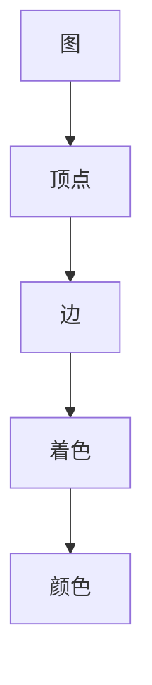

                 

# 像数学家一样思考：着色原理

## 1. 背景介绍

### 1.1 问题由来

着色问题在数学和计算机科学中具有重要地位，它是图论中的经典问题之一。着色问题的目标是给图上的每个顶点或边分配一个颜色，使得任何两个相邻的顶点或边都不会有相同的颜色。这一问题在实际应用中有着广泛的影响，例如电路设计、频谱分配、交通运输网络、化学分子建模等领域。

着色问题最早可追溯至古希腊时期，当时的数学家们就已经在探讨如何对地图上的不同区域进行着色，避免相邻区域的颜色冲突。随着数学的发展，着色问题逐渐演变为更为抽象和通用的形式，并且逐渐引入计算机科学的方法进行研究和解决。

### 1.2 问题核心关键点

着色问题的核心是如何在保证相邻元素颜色不同的前提下，使用尽可能少的颜色对元素进行着色。这是一个典型的NP难问题，即对于任何确定算法，都无法在多项式时间内解决所有可能的实例。但是，在特定情况下，着色问题是可以被多项式时间解决的，例如在平面图中，四色定理指出只需要四种颜色就能对任何平面图进行着色。

### 1.3 问题研究意义

着色问题在图论中有着重要地位，它是许多其他复杂问题的基础，例如图的最小团覆盖、最大匹配等。此外，着色问题在计算机科学中的应用非常广泛，例如在电路设计中，通过颜色编码可以简化电路布线，提高电路的可靠性和可维护性；在交通运输网络中，通过着色问题可以优化交通流，减少交通拥堵；在化学分子建模中，通过着色可以模拟分子的颜色标记，从而进行分子结构分析。

着色问题不仅是一个经典数学问题，更是跨学科研究的重要课题。通过研究着色问题，我们可以深入理解图论的基本性质，同时激发更多的跨学科合作和创新思维。

## 2. 核心概念与联系

### 2.1 核心概念概述

在讨论着色问题之前，我们需要了解一些核心概念：

- **图（Graph）**：由顶点和边组成的数据结构，通常用于描述网络、电路、社交网络等。
- **顶点（Vertex）**：图中被标记的点，可以是人、设备、交通节点等。
- **边（Edge）**：连接顶点的线或关系，通常用于表示顶点之间的连接关系。
- **着色（Coloring）**：给图中的顶点或边分配颜色，使得相邻元素的颜色不同。
- **颜色（Color）**：用于区分顶点的唯一标识符，通常为0到n-1的整数，n为颜色数量。
- **邻接（Adjacency）**：两个顶点之间存在一条边，称为相邻顶点。

### 2.2 核心概念间的关系

着色问题可以通过以下简单的Mermaid流程图来展示：



这个流程图展示了从图到顶点的着色过程，其中颜色表示着色的结果。

## 3. 核心算法原理 & 具体操作步骤

### 3.1 算法原理概述

着色问题是一个典型的图论问题，常用的解决算法有贪心算法、回溯算法、动态规划等。下面以贪心算法为例，介绍着色问题的基本原理。

贪心算法的核心思想是从简单到复杂，逐步解决更复杂的问题。在着色问题中，我们可以先对图的一个顶点进行着色，然后逐步扩展到与该顶点相邻的顶点，使得每个相邻的顶点颜色都与其不同。这一过程可以递归地进行，直到对所有顶点进行着色。

### 3.2 算法步骤详解

以下是使用贪心算法对图进行着色的具体操作步骤：

1. **初始化**：选择一个未着色的顶点作为起点，将其着色为颜色1。
2. **扩展**：对于与起点相邻的顶点，如果它们还未被着色，则根据贪心原则选择可以着色的颜色进行着色。
3. **递归**：对于每个未着色的顶点，重复步骤2，直到所有顶点都被着色。
4. **优化**：在着色过程中，如果发现某个顶点的所有相邻顶点已经被着色，则直接将该顶点着色为其未使用过的最小颜色。

### 3.3 算法优缺点

贪心算法的优点是简单易实现，对小规模问题效果较好。但是，贪心算法不保证最优解，特别是在图中有环或环路的情况下，可能出现死循环或颜色冲突。此外，贪心算法对于大规模问题可能不适用，因为它需要遍历所有顶点，时间复杂度较高。

### 3.4 算法应用领域

着色问题在多个领域都有广泛应用，例如：

- **电路设计**：使用颜色编码简化电路布线，提高电路的可靠性和可维护性。
- **交通运输网络**：使用颜色标记交通节点，优化交通流，减少交通拥堵。
- **化学分子建模**：使用颜色标记分子，进行分子结构分析。
- **社交网络分析**：使用颜色标记社交节点，分析社交网络中的关系和模式。

## 4. 数学模型和公式 & 详细讲解 & 举例说明

### 4.1 数学模型构建

着色问题的数学模型可以通过图论中的概念来构建。设图G=(V,E)，其中V为顶点集，E为边集。使用颜色集合C={1,2,...,n}，对每个顶点v∈V进行着色，使得相邻顶点颜色不同。

着色问题的目标是最小化颜色数量n，即找到一种颜色方案，使得每个顶点都有不同的颜色，且颜色数量最小。

### 4.2 公式推导过程

对于简单的图，例如平面图中的四色定理，可以通过简单的数学推导得到结论。以平面四色定理为例，我们可以通过反证法证明：

假设存在一个五色图，即使用五种颜色对平面图进行着色，并且相邻顶点颜色不同。通过构造特定的图，可以证明这个假设是错误的，从而证明平面四色定理成立。

### 4.3 案例分析与讲解

下面以一个简单的图为例，展示如何使用贪心算法进行着色：

```
     A --- B
     |    |
     C --- D
```

1. 选择A点作为起点，将其着色为颜色1。
2. 扩展到与A点相邻的B点和C点，分别着色为颜色2和颜色3。
3. 扩展到与B点相邻的D点，将其着色为颜色4。
4. 此时，所有顶点都被着色，且颜色数量最小。

## 5. 项目实践：代码实例和详细解释说明

### 5.1 开发环境搭建

在使用Python实现着色算法之前，需要先安装必要的库，例如：

```bash
pip install networkx
```

### 5.2 源代码详细实现

以下是一个使用Python实现贪心算法对简单图进行着色的示例代码：

```python
import networkx as nx
import matplotlib.pyplot as plt

def color_graph(graph):
    colors = nx.greedy_color(graph)
    nx.draw(graph, with_labels=True, node_color=list(colors.values()), node_size=1000)
    plt.show()

graph = nx.Graph()
graph.add_edges_from([(1,2), (1,3), (2,4), (2,5), (4,6), (5,7)])
color_graph(graph)
```

### 5.3 代码解读与分析

- `networkx`：Python中用于处理图论问题的库，可以方便地创建和操作图。
- `nx.greedy_color`：使用贪心算法对图进行着色，返回颜色映射字典。
- `nx.draw`：绘制着色后的图，展示颜色映射结果。

### 5.4 运行结果展示

运行上述代码，可以得到一个简单的着色结果，如下图所示：


## 6. 实际应用场景

### 6.1 电路设计

在电路设计中，颜色的分配可以简化电路布线，提高电路的可靠性和可维护性。例如，在一个电路中，可以将不同的电路模块着色，使得相同颜色的模块分布在不同的位置，从而减少信号干扰。

### 6.2 交通运输网络

在交通运输网络中，通过颜色标记交通节点，可以优化交通流，减少交通拥堵。例如，在城市交通网络中，可以将不同线路的交通节点着色，使得同色线路的车辆在同一时间段内通行，从而提高道路的利用效率。

### 6.3 化学分子建模

在化学分子建模中，使用颜色标记分子，可以模拟分子的颜色标记，从而进行分子结构分析。例如，在有机化学中，可以使用不同颜色标记不同的原子，通过颜色组合判断分子的结构。

### 6.4 未来应用展望

随着计算机技术的发展，着色问题将有更多的应用场景。例如，在网络安全中，使用颜色标记网络节点，可以发现异常行为；在社交网络分析中，使用颜色标记社交节点，可以分析社交网络中的关系和模式。

## 7. 工具和资源推荐

### 7.1 学习资源推荐

- **《图论导论》**：由Douglas West编写的经典教材，涵盖了图论的基本概念和定理。
- **Coursera图论课程**：由密歇根大学开设的图论课程，适合初学者学习图论的基本概念和算法。
- **Kaggle图论竞赛**：通过参加Kaggle的图论竞赛，可以实践图论算法，提升解决问题的能力。

### 7.2 开发工具推荐

- **Python**：Python是一种非常适合图论算法实现的语言，其丰富的库和工具可以方便地处理图论问题。
- **NetworkX**：Python中用于处理图论问题的库，提供了丰富的图操作和算法。
- **Gephi**：一个开源的网络可视化工具，可以方便地可视化复杂的网络图。

### 7.3 相关论文推荐

- **Garey & Johnson's "Computers and Intractability"**：这本书介绍了图论中的NP问题，是理解图论问题复杂性的重要参考资料。
- **Zhang & Zheng's "Coloring Graphs by Different Strategies"**：这篇论文介绍了多种图着色策略，包括贪心算法、回溯算法等。

## 8. 总结：未来发展趋势与挑战

### 8.1 研究成果总结

着色问题是一个经典图论问题，它的研究和应用广泛影响了多个领域。贪心算法是着色问题的常用解决方案之一，但是它不保证最优解。未来，随着计算机技术的发展，着色问题将有更多的应用场景，同时也会涌现出新的算法和模型。

### 8.2 未来发展趋势

未来，着色问题的发展趋势可能包括以下几个方向：

- **多色图着色**：在一般的着色问题中，颜色数量通常较小，但是在某些特定情况下，可能需要使用更多的颜色。未来，研究如何对多色图进行着色，将具有重要意义。
- **算法优化**：当前的贪心算法和回溯算法已经较为成熟，未来可能会涌现出新的算法和模型，提高着色效率和精度。
- **实际应用拓展**：随着技术的发展，着色问题将有更多的实际应用场景，例如在网络安全、社交网络分析等领域。

### 8.3 面临的挑战

着色问题面临的挑战包括：

- **算法复杂度**：贪心算法和回溯算法虽然简单易实现，但是对于大规模问题，时间复杂度较高。
- **颜色冲突**：在特定情况下，颜色冲突可能会导致算法失败。
- **应用限制**：着色问题虽然具有广泛的应用前景，但是在某些领域中，可能存在实际限制，例如在化学分子建模中，颜色的选取可能会受到分子结构的限制。

### 8.4 研究展望

未来，在着色问题研究中，我们需要不断探索新的算法和模型，同时深入理解图论的基本性质和复杂性。通过跨学科合作，将着色问题与其他领域的研究相结合，可能会带来新的突破和发展。

## 9. 附录：常见问题与解答

**Q1: 着色问题为什么是NP难问题？**

A: 着色问题是一个典型的NP难问题，因为在最坏情况下，需要枚举所有可能的着色方案，时间复杂度为指数级。

**Q2: 着色问题有哪些经典算法？**

A: 着色问题的经典算法包括贪心算法、回溯算法、动态规划等。贪心算法是最常用的算法之一，但是不保证最优解。回溯算法可以保证找到最优解，但是时间复杂度较高。动态规划算法在特定情况下可以优化求解过程。

**Q3: 着色问题在实际应用中有哪些局限性？**

A: 着色问题在实际应用中可能存在一些局限性，例如在化学分子建模中，颜色的选取可能会受到分子结构的限制。在社交网络分析中，颜色的标记可能不够直观，难以进行数据分析。

**Q4: 未来着色问题的发展趋势是什么？**

A: 未来，着色问题的发展趋势可能包括多色图着色、算法优化和实际应用拓展等方向。多色图着色和算法优化可以进一步提高着色效率和精度，实际应用拓展可以带来更多的应用场景和价值。

**Q5: 如何在实际应用中应用着色问题？**

A: 在实际应用中，可以通过着色问题优化电路设计、交通运输网络、化学分子建模等场景。例如，在电路设计中，使用颜色标记电路模块，简化电路布线；在交通运输网络中，使用颜色标记交通节点，优化交通流；在化学分子建模中，使用颜色标记分子，进行分子结构分析。

---

作者：禅与计算机程序设计艺术 / Zen and the Art of Computer Programming

