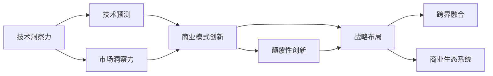
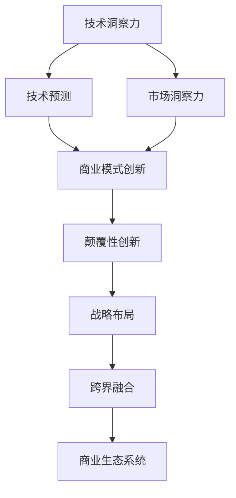

                 

## 1. 背景介绍

在当今快速发展的科技浪潮中，技术的洞察力成为了企业实现颠覆性创新的关键驱动力。技术的进步为各行各业带来了新的机遇和挑战，创业公司如何利用这些技术洞察力，打破现有市场格局，创造全新的商业模式，是摆在我们面前的重要课题。

### 1.1 问题由来

随着人工智能（AI）、大数据、云计算等新兴技术的不断成熟和普及，它们在商业领域的应用越来越广泛。这些技术的突破性应用不仅改变了企业的运营方式，也重新定义了许多行业的商业模式。如何把握技术发展的趋势，将其转化为商业创新，是创业公司面临的重大挑战。

### 1.2 问题核心关键点

技术的洞察力源于对现有技术、市场需求的深入理解，以及对未来技术发展的预测。企业利用这些洞察力，结合自身核心竞争力，实现从0到1的创新，往往能够颠覆传统市场格局，创造出全新的价值。关键点包括：

- **技术洞察力**：通过分析行业现状、竞争对手、客户需求，以及对新技术的掌握，形成对技术发展趋势的深刻理解。
- **商业模式创新**：在把握技术洞察力的基础上，设计创新的商业模式，实现技术的商业化应用。
- **战略布局**：制定合理的企业战略，在市场竞争中占据有利位置，持续推动技术创新和商业增长。
- **跨界融合**：跨行业合作，融合不同领域的创新资源，提升技术的市场适应性和应用潜力。
- **生态系统建设**：构建开放、协作的生态系统，吸引多方参与，共同推动技术的广泛应用。

### 1.3 问题研究意义

在技术快速变革的时代，拥有技术洞察力的创业公司能够快速抓住市场机遇，抢占竞争高地。这不仅能带来丰厚的商业回报，还能推动行业整体的技术进步和市场创新。因此，掌握技术洞察力，进行颠覆性创新，对于企业长期发展和行业进步具有重要的意义。

## 2. 核心概念与联系

### 2.1 核心概念概述

为了深入探讨利用技术洞察力进行颠覆性创新的过程，我们需要理解一些核心概念及其相互关系：

- **技术洞察力（Technical Insight）**：通过对现有技术的深入分析和未来趋势的预测，形成对技术发展方向和应用场景的深刻理解。
- **技术预测（Technology Forecasting）**：基于对现有技术的理解和对市场需求的洞察，预测未来技术的发展趋势和应用方向。
- **商业模式（Business Model）**：企业的收入来源、成本结构和客户价值主张，是技术创新的核心驱动力。
- **颠覆性创新（Disruptive Innovation）**：通过引入新技术或新方法，打破现有市场格局，创造全新的市场和价值。
- **市场洞察力（Market Insight）**：对市场环境的深入分析，包括客户需求、竞争对手状况、市场趋势等，是技术洞察力的补充。
- **商业生态系统（Business Ecosystem）**：由多个主体（包括企业、合作伙伴、客户等）组成的合作网络，促进技术的广泛应用和商业价值的最大化。

这些核心概念通过以下Mermaid流程图展示它们之间的联系：

### 2.2 概念间的关系

这些核心概念之间存在着紧密的联系，形成了技术洞察力指导商业创新的整体生态系统。具体关系如下：

- **技术洞察力**是基础，通过对技术发展趋势的理解，形成对未来技术的预测。
- **技术预测**进一步细化技术洞察力的应用，指导商业模式的设计和优化。
- **市场洞察力**补充技术洞察力的不足之处，提供更全面的市场信息。
- **商业模式创新**结合技术预测和市场洞察力，形成新的商业价值主张。
- **颠覆性创新**在商业模式创新的基础上，利用新技术打破现有市场格局。
- **战略布局**确保企业在市场竞争中保持优势，持续推动技术创新和商业增长。
- **跨界融合**促进不同领域的合作，提升技术的市场适应性和应用潜力。
- **商业生态系统**构建开放、协作的合作网络，实现技术的广泛应用和商业价值的最大化。

### 2.3 核心概念的整体架构

下面通过一个综合的流程图展示这些核心概念在技术洞察力指导商业创新中的整体架构：

## 3. 核心算法原理 & 具体操作步骤

### 3.1 算法原理概述

利用技术洞察力进行颠覆性创新的核心算法原理包括以下几个步骤：

1. **技术洞察力获取**：通过对现有技术的深入分析和未来趋势的预测，形成对技术发展方向和应用场景的深刻理解。
2. **市场洞察力获取**：对市场环境的深入分析，包括客户需求、竞争对手状况、市场趋势等。
3. **技术预测**：基于对现有技术的理解和对市场需求的洞察，预测未来技术的发展趋势和应用方向。
4. **商业模式创新**：在把握技术洞察力的基础上，设计创新的商业模式，实现技术的商业化应用。
5. **战略布局**：制定合理的企业战略，在市场竞争中占据有利位置，持续推动技术创新和商业增长。
6. **跨界融合**：跨行业合作，融合不同领域的创新资源，提升技术的市场适应性和应用潜力。
7. **商业生态系统建设**：构建开放、协作的生态系统，吸引多方参与，共同推动技术的广泛应用。

### 3.2 算法步骤详解

以下是对上述算法的详细步骤详解：

#### 3.2.1 技术洞察力的获取

技术洞察力主要通过以下步骤获取：

1. **文献分析**：阅读最新技术论文、专利申请，了解前沿技术进展。
2. **行业报告**：分析行业报告，了解技术发展趋势和市场需求。
3. **技术实验**：通过实验验证假设，形成对技术的深刻理解。
4. **专家访谈**：与行业专家进行交流，获取技术应用的实际案例和经验。

#### 3.2.2 市场洞察力的获取

市场洞察力主要通过以下步骤获取：

1. **客户调研**：通过问卷、访谈等方式了解客户需求和痛点。
2. **竞争对手分析**：研究竞争对手的产品和市场策略，评估其优势和不足。
3. **市场趋势分析**：利用大数据和人工智能工具，分析市场趋势和变化。
4. **用户行为分析**：通过数据分析工具，了解用户行为模式和偏好。

#### 3.2.3 技术预测

技术预测主要通过以下步骤进行：

1. **模型构建**：构建基于历史数据和未来趋势的预测模型，如时间序列模型、机器学习模型等。
2. **数据准备**：收集和整理数据，确保数据质量和完整性。
3. **模型训练**：使用训练数据训练预测模型，形成对未来技术的预测。
4. **结果验证**：对预测结果进行验证，确保预测的准确性和可靠性。

#### 3.2.4 商业模式创新

商业模式创新主要通过以下步骤实现：

1. **价值主张设计**：基于技术洞察力和市场洞察力，设计新的价值主张，满足客户需求。
2. **收入模型设计**：设计创新的收入模型，实现盈利。
3. **成本结构优化**：优化成本结构，降低运营成本。
4. **客户关系管理**：建立良好的客户关系，提升客户满意度。

#### 3.2.5 战略布局

战略布局主要通过以下步骤进行：

1. **市场定位**：明确企业的市场定位和竞争策略。
2. **资源配置**：合理配置资源，确保战略目标的实现。
3. **风险管理**：制定风险管理计划，降低战略实施过程中的风险。
4. **绩效评估**：定期评估战略实施效果，及时调整策略。

#### 3.2.6 跨界融合

跨界融合主要通过以下步骤实现：

1. **合作伙伴选择**：选择适合的合作伙伴，共同开发新技术。
2. **技术整合**：将不同领域的技术进行整合，形成新的技术解决方案。
3. **市场协同**：通过市场协同，提升技术的市场适应性和应用潜力。
4. **价值共享**：与合作伙伴共享技术价值，建立长期合作关系。

#### 3.2.7 商业生态系统建设

商业生态系统建设主要通过以下步骤进行：

1. **开放平台建设**：建设开放平台，吸引多方参与。
2. **合作协议制定**：制定合作协议，确保各方利益。
3. **资源共享**：共享资源，提升生态系统的整体效能。
4. **生态系统治理**：建立生态系统治理机制，确保系统健康发展。

### 3.3 算法优缺点

#### 3.3.1 优点

1. **技术前瞻性**：通过对技术发展趋势的深刻理解，可以提前布局，抢占市场先机。
2. **创新性**：结合技术洞察力和市场洞察力，设计创新的商业模式，实现技术的商业化应用。
3. **风险控制**：通过战略布局和风险管理，降低商业创新过程中的风险。
4. **合作共赢**：通过跨界融合和商业生态系统建设，实现多方共赢。

#### 3.3.2 缺点

1. **资源投入高**：需要大量的资金、人力和技术资源进行技术洞察和市场调研。
2. **风险不确定**：技术发展的不确定性和市场需求的变化，可能导致创新失败。
3. **跨界合作难度**：跨行业合作需要协调不同领域的技术和资源，存在较高的沟通和协调成本。
4. **生态系统复杂性**：构建和维护商业生态系统，需要复杂的管理和治理机制。

### 3.4 算法应用领域

基于技术洞察力的颠覆性创新方法，适用于以下多个领域：

- **人工智能**：通过AI技术洞察力，设计新的智能应用和商业模式，如智能客服、智能制造等。
- **大数据**：利用大数据洞察力，提供新的数据产品和解决方案，如数据分析平台、数据可视化工具等。
- **云计算**：基于云计算洞察力，推出新的云服务和生态系统，如云安全、云存储等。
- **物联网**：通过物联网技术洞察力，开发新的智能设备和服务，如智能家居、智慧城市等。
- **区块链**：利用区块链技术洞察力，设计新的分布式应用和商业模式，如供应链金融、数字身份等。

## 4. 数学模型和公式 & 详细讲解 & 举例说明

### 4.1 数学模型构建

为了更好地理解基于技术洞察力的创新方法，我们将使用数学模型进行详细的讲解和分析。

假设我们有一个初创公司A，希望利用技术洞察力B进行颠覆性创新。其核心算法步骤如下：

1. **技术洞察力获取**：通过对现有技术的深入分析和未来趋势的预测，形成对技术发展方向和应用场景的深刻理解。
2. **市场洞察力获取**：对市场环境的深入分析，包括客户需求、竞争对手状况、市场趋势等。
3. **技术预测**：基于对现有技术的理解和对市场需求的洞察，预测未来技术的发展趋势和应用方向。
4. **商业模式创新**：在把握技术洞察力的基础上，设计创新的商业模式，实现技术的商业化应用。
5. **战略布局**：制定合理的企业战略，在市场竞争中占据有利位置，持续推动技术创新和商业增长。
6. **跨界融合**：跨行业合作，融合不同领域的创新资源，提升技术的市场适应性和应用潜力。
7. **商业生态系统建设**：构建开放、协作的生态系统，吸引多方参与，共同推动技术的广泛应用。

### 4.2 公式推导过程

以下是每个步骤的公式推导过程：

#### 4.2.1 技术洞察力获取

1. **文献分析**：
   $$
   \text{洞察力}_{A} = f(\text{文献}_{A})
   $$
   其中，$\text{洞察力}_{A}$为技术洞察力，$\text{文献}_{A}$为分析的文献集合。

2. **行业报告**：
   $$
   \text{洞察力}_{A} = g(\text{报告}_{A})
   $$
   其中，$\text{洞察力}_{A}$为技术洞察力，$\text{报告}_{A}$为行业报告集合。

3. **技术实验**：
   $$
   \text{洞察力}_{A} = h(\text{实验}_{A})
   $$
   其中，$\text{洞察力}_{A}$为技术洞察力，$\text{实验}_{A}$为技术实验集合。

4. **专家访谈**：
   $$
   \text{洞察力}_{A} = i(\text{访谈}_{A})
   $$
   其中，$\text{洞察力}_{A}$为技术洞察力，$\text{访谈}_{A}$为专家访谈集合。

#### 4.2.2 市场洞察力获取

1. **客户调研**：
   $$
   \text{洞察力}_{M} = j(\text{调研}_{M})
   $$
   其中，$\text{洞察力}_{M}$为市场洞察力，$\text{调研}_{M}$为客户调研集合。

2. **竞争对手分析**：
   $$
   \text{洞察力}_{M} = k(\text{竞争}_{M})
   $$
   其中，$\text{洞察力}_{M}$为市场洞察力，$\text{竞争}_{M}$为竞争对手分析集合。

3. **市场趋势分析**：
   $$
   \text{洞察力}_{M} = l(\text{趋势}_{M})
   $$
   其中，$\text{洞察力}_{M}$为市场洞察力，$\text{趋势}_{M}$为市场趋势分析集合。

4. **用户行为分析**：
   $$
   \text{洞察力}_{M} = m(\text{行为}_{M})
   $$
   其中，$\text{洞察力}_{M}$为市场洞察力，$\text{行为}_{M}$为用户行为分析集合。

#### 4.2.3 技术预测

1. **模型构建**：
   $$
   \text{预测}_{T} = \text{Model}(\text{数据}_{T})
   $$
   其中，$\text{预测}_{T}$为技术预测结果，$\text{Model}$为预测模型，$\text{数据}_{T}$为数据集合。

2. **数据准备**：
   $$
   \text{数据}_{T} = \text{Preprocess}(\text{原始数据}_{T})
   $$
   其中，$\text{数据}_{T}$为处理后的数据，$\text{原始数据}_{T}$为原始数据集合。

3. **模型训练**：
   $$
   \text{Model} = \text{Train}(\text{数据}_{T})
   $$
   其中，$\text{Model}$为训练后的预测模型。

4. **结果验证**：
   $$
   \text{验证}_{T} = \text{Evaluate}(\text{预测}_{T}, \text{真实数据}_{T})
   $$
   其中，$\text{验证}_{T}$为预测结果的验证结果，$\text{真实数据}_{T}$为真实数据集合。

#### 4.2.4 商业模式创新

1. **价值主张设计**：
   $$
   \text{价值主张}_{C} = \text{设计}_{C}(\text{洞察力}_{A}, \text{洞察力}_{M})
   $$
   其中，$\text{价值主张}_{C}$为设计的价值主张，$\text{洞察力}_{A}$为技术洞察力，$\text{洞察力}_{M}$为市场洞察力。

2. **收入模型设计**：
   $$
   \text{收入模型}_{C} = \text{设计}_{C}(\text{价值主张}_{C})
   $$
   其中，$\text{收入模型}_{C}$为设计的收入模型，$\text{价值主张}_{C}$为设计的价值主张。

3. **成本结构优化**：
   $$
   \text{成本结构}_{C} = \text{优化}_{C}(\text{收入模型}_{C})
   $$
   其中，$\text{成本结构}_{C}$为优化的成本结构，$\text{收入模型}_{C}$为设计的收入模型。

4. **客户关系管理**：
   $$
   \text{关系管理}_{C} = \text{管理}_{C}(\text{客户}_{C})
   $$
   其中，$\text{关系管理}_{C}$为客户关系管理策略，$\text{客户}_{C}$为客户集合。

#### 4.2.5 战略布局

1. **市场定位**：
   $$
   \text{定位}_{S} = \text{定位}_{S}(\text{洞察力}_{A}, \text{洞察力}_{M})
   $$
   其中，$\text{定位}_{S}$为市场定位策略，$\text{洞察力}_{A}$为技术洞察力，$\text{洞察力}_{M}$为市场洞察力。

2. **资源配置**：
   $$
   \text{配置}_{S} = \text{配置}_{S}(\text{定位}_{S})
   $$
   其中，$\text{配置}_{S}$为资源配置策略，$\text{定位}_{S}$为市场定位策略。

3. **风险管理**：
   $$
   \text{管理}_{S} = \text{管理}_{S}(\text{风险}_{S})
   $$
   其中，$\text{管理}_{S}$为风险管理策略，$\text{风险}_{S}$为风险集合。

4. **绩效评估**：
   $$
   \text{评估}_{S} = \text{评估}_{S}(\text{配置}_{S})
   $$
   其中，$\text{评估}_{S}$为绩效评估策略，$\text{配置}_{S}$为资源配置策略。

#### 4.2.6 跨界融合

1. **合作伙伴选择**：
   $$
   \text{选择}_{F} = \text{选择}_{F}(\text{洞察力}_{A}, \text{洞察力}_{M})
   $$
   其中，$\text{选择}_{F}$为合作伙伴选择策略，$\text{洞察力}_{A}$为技术洞察力，$\text{洞察力}_{M}$为市场洞察力。

2. **技术整合**：
   $$
   \text{整合}_{F} = \text{整合}_{F}(\text{技术}_{F}, \text{选择}_{F})
   $$
   其中，$\text{整合}_{F}$为技术整合策略，$\text{技术}_{F}$为整合的技术，$\text{选择}_{F}$为合作伙伴选择策略。

3. **市场协同**：
   $$
   \text{协同}_{F} = \text{协同}_{F}(\text{整合}_{F})
   $$
   其中，$\text{协同}_{F}$为市场协同策略，$\text{整合}_{F}$为技术整合策略。

4. **价值共享**：
   $$
   \text{共享}_{F} = \text{共享}_{F}(\text{协同}_{F})
   $$
   其中，$\text{共享}_{F}$为价值共享策略，$\text{协同}_{F}$为市场协同策略。

#### 4.2.7 商业生态系统建设

1. **开放平台建设**：
   $$
   \text{平台}_{E} = \text{构建}_{E}(\text{洞察力}_{A}, \text{洞察力}_{M})
   $$
   其中，$\text{平台}_{E}$为开放平台，$\text{洞察力}_{A}$为技术洞察力，$\text{洞察力}_{M}$为市场洞察力。

2. **合作协议制定**：
   $$
   \text{协议}_{E} = \text{制定}_{E}(\text{平台}_{E})
   $$
   其中，$\text{协议}_{E}$为合作协议，$\text{平台}_{E}$为开放平台。

3. **资源共享**：
   $$
   \text{共享}_{E} = \text{共享}_{E}(\text{平台}_{E})
   $$
   其中，$\text{共享}_{E}$为资源共享策略，$\text{平台}_{E}$为开放平台。

4. **生态系统治理**：
   $$
   \text{治理}_{E} = \text{治理}_{E}(\text{共享}_{E})
   $$
   其中，$\text{治理}_{E}$为生态系统治理策略，$\text{共享}_{E}$为资源共享策略。

### 4.3 案例分析与讲解

下面以一家利用技术洞察力进行颠覆性创新的初创公司为例，详细讲解其创新过程：

#### 案例背景

假设有家公司A，其主要业务是金融数据分析和咨询。通过对现有技术的深入分析和对市场需求的洞察，公司A发现金融数据分析的市场需求正在快速增长，但现有的数据分析工具存在数据处理速度慢、用户体验差等问题。公司A决定利用技术洞察力进行颠覆性创新，开发新一代的金融数据分析平台。

#### 技术洞察力获取

1. **文献分析**：公司A阅读了最新发表的金融数据分析相关的研究论文，了解到深度学习在金融数据分析中的应用前景。
2. **行业报告**：公司A分析了金融数据分析行业的报告，了解到市场需求正在快速增长，但现有工具存在不足。
3. **技术实验**：公司A进行了初步的深度学习实验，验证了深度学习在金融数据分析中的可行性。
4. **专家访谈**：公司A与金融数据分析领域的专家进行交流，获取了相关的应用案例和经验。

#### 市场洞察力获取

1. **客户调研**：公司A对大量金融机构进行了调研，了解客户的需求和痛点，发现用户对数据分析速度和用户体验有较高要求。
2. **竞争对手分析**：公司A分析了竞争对手的产品和市场策略，发现现有工具存在数据处理速度慢、用户体验差等问题。
3. **市场趋势分析**：公司A利用大数据和人工智能工具，分析了金融数据分析市场的趋势，发现市场对高效、易用的数据分析工具需求旺盛。
4. **用户行为分析**：公司A通过数据分析工具，了解了用户的行为模式和偏好，发现用户对数据分析的速度和精度有较高要求。

#### 技术预测

1. **模型构建**：公司A构建了基于深度学习的金融数据分析预测模型。
2. **数据准备**：公司A收集并处理了大量金融数据，为模型训练提供数据支持。
3. **模型训练**：公司A使用训练数据对模型进行训练，优化模型的预测准确性。
4. **结果验证**：公司A在验证数据集上对模型进行验证，确保预测结果的准确性。

#### 商业模式创新

1. **价值主张设计**：公司A基于技术洞察力和市场洞察力，设计了高效、易用的金融数据分析价值主张。
2. **收入模型设计**：公司A设计了基于订阅模式的收入模型，按月收取订阅费用。
3. **成本结构优化**：公司A优化了成本结构，将重点放在模型训练和平台开发上。
4. **客户关系管理**：公司A建立了良好的客户关系，提供优质的客户服务，提升客户满意度。

#### 战略布局

1. **市场定位**：公司A将市场定位为金融数据分析工具的领导者，提供高效、易用的数据分析平台。
2. **资源配置**：公司A合理配置资源，重点投入在模型训练和平台开发上。
3. **风险管理**：公司A制定了风险管理计划，确保项目按时按预算完成。
4. **绩效评估**：公司A定期评估项目进展和效果，确保项目目标的实现。

#### 跨界融合

1. **合作伙伴选择**：公司A选择了金融数据分析领域的知名公司作为合作伙伴，共同开发新平台。
2. **技术整合**：公司A将深度学习技术与金融数据分析的需求相结合，开发了高效的数据处理和分析算法。
3. **市场协同**：公司A与合作伙伴共同推广新平台，提升市场适应性。
4. **价值共享**：公司A与合作伙伴共享新平台的技术优势，建立长期合作关系。

#### 商业生态系统建设

1. **开放平台建设**：公司A构建了开放平台，吸引金融机构的参与和合作。
2. **合作协议制定**：公司A制定了合作协议，明确各方职责和利益。
3. **资源共享**：公司A共享了技术资源，提升生态系统的整体效能。
4. **生态系统治理**：公司A建立了生态系统治理机制，确保生态系统的健康发展。

### 4.4 数学模型和公式总结

通过对上述各步骤的数学模型和公式的详细讲解，我们可以更深入地理解基于技术洞察力的颠覆性创新过程。总结如下：

1. **技术洞察力获取**：
   $$
   \text{洞察力}_{A} = f(\text{文献}_{A}) + g(\text{报告}_{A}) + h(\text{实验}_{A}) + i(\text{访谈}_{A})
   $$

2. **市场洞察力获取**：
   $$
   \text{洞察力}_{M} = j(\text{调研}_{M}) + k(\text{竞争}_{M}) + l(\text{趋势}_{M}) + m(\text{行为}_{M})
   $$

3. **技术预测**：
   $$
   \text{预测}_{T} = \text{Model}(\text{数据}_{T}) + \text{验证}_{T}
   $$

4. **商业模式创新**：
   $$
   \text{价值主张}_{C} = \text{设计}_{C}(\text{洞察力}_{A}, \text{洞察力}_{M}) + \text{收入模型}_{C} + \text{成本结构}_{C} + \text{关系管理}_{C}
   $$

5. **战略布局**：

