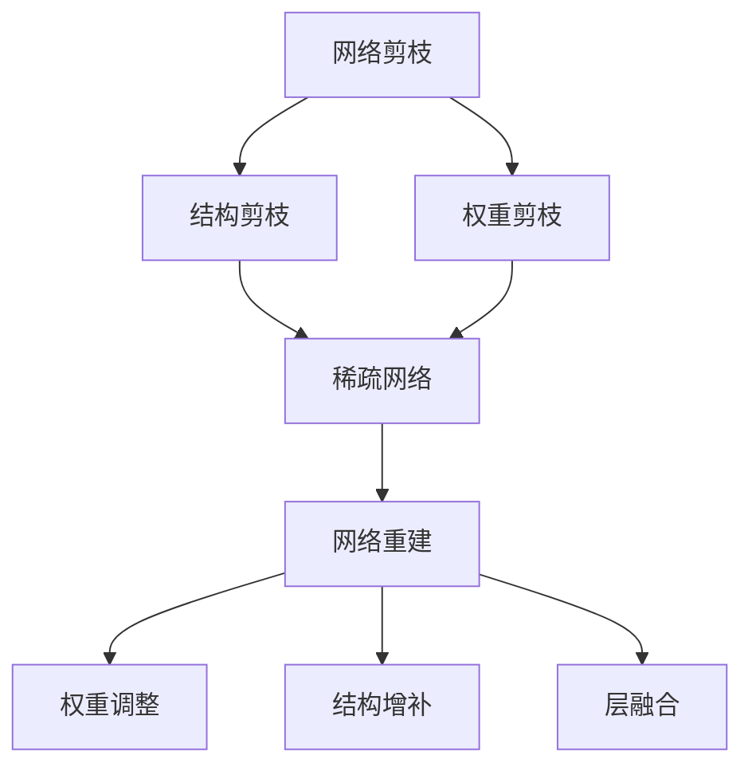
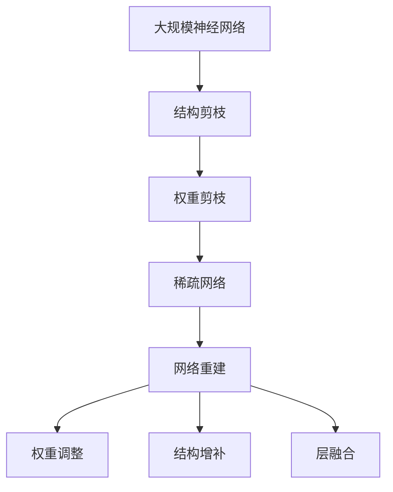
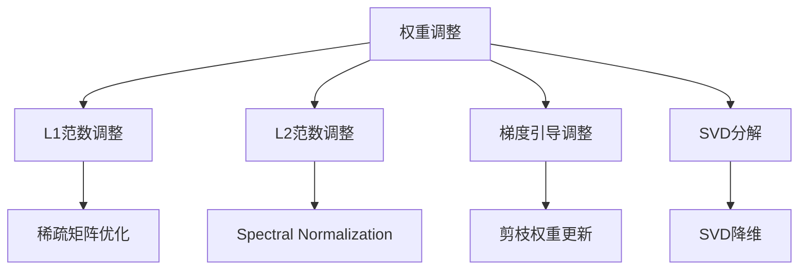

                 

# 剪枝后的网络结构重建技术探讨

> 关键词：剪枝技术,网络结构重建,模型压缩,硬件加速,深度学习优化

## 1. 背景介绍

### 1.1 问题由来
在深度学习领域，大规模神经网络已经成为了诸多应用场景中的骨干。这些网络在理论和实验上取得了令人瞩目的成果。然而，大规模神经网络的训练和推理都极大地消耗了计算资源和存储空间，对实际应用构成了巨大的挑战。因此，网络剪枝（Pruning）技术应运而生。网络剪枝可以大幅减小神经网络模型的大小，节省计算和存储成本，提高推理速度。但同时，剪枝后的模型可能会损失部分精度，影响应用效果。因此，网络重建（Reconstruction）技术应运而生，用于恢复剪枝后的模型精度，提升模型的表现。本文将对网络剪枝和重建技术进行深入探讨，从理论到实践，带您全面理解这一重要研究方向。

### 1.2 问题核心关键点
网络剪枝和重建技术的核心在于寻找剪枝后的最优重建方案，以最小的开销恢复模型的性能。具体来说，可以归纳为以下几个关键点：
- 网络剪枝的原理：通过移除网络中的冗余连接或神经元，减小模型的规模。
- 网络重建的方法：根据剪枝后的结构，设计新的网络结构，恢复模型的性能。
- 模型优化策略：采用各种算法和技术，优化剪枝后的重建过程，提高重建效率和精度。

### 1.3 问题研究意义
网络剪枝和重建技术对于提高神经网络的实际应用效果，降低计算和存储成本，具有重要意义。其研究意义主要体现在以下几个方面：
1. 提高计算效率：通过剪枝和重建，大幅减小模型规模，减少计算资源的消耗。
2. 提升推理速度：剪枝后的模型在硬件加速器上运行速度更快，适合移动设备、嵌入式系统等对时间敏感的场景。
3. 节省存储空间：剪枝后的模型文件更小，减少了对存储资源的占用。
4. 优化模型结构：网络剪枝和重建有助于发现网络的冗余结构，改善模型的可解释性和可维护性。
5. 推动应用普及：成本和资源限制更低的模型更易被广泛采用，加速深度学习技术的普及和应用。

## 2. 核心概念与联系

### 2.1 核心概念概述

为更好地理解网络剪枝和重建技术，本节将介绍几个密切相关的核心概念：

- 网络剪枝（Pruning）：指在训练或推理阶段，通过移除网络中的冗余连接或神经元，减小模型规模的技术。
- 网络重建（Reconstruction）：指在网络剪枝后，设计新的网络结构，恢复剪枝后模型的性能。
- 结构剪枝（Structural Pruning）：基于网络结构的信息，去除无用的连接或层。
- 权重剪枝（Weight Pruning）：基于权重的大小，删除影响较小的神经元或连接。
- 稀疏网络（Sparse Network）：指在网络中保留一定比例的参数，形成稀疏结构。
- 动态剪枝（Dynamic Pruning）：在推理阶段动态调整剪枝策略，适应不同输入样本。
- 重建算法：如权重调整、结构增补、层融合等方法，恢复剪枝后模型的精度。

这些核心概念之间的逻辑关系可以通过以下Mermaid流程图来展示：



这个流程图展示了大规模神经网络剪枝和重建的核心概念及其之间的关系：

1. 网络剪枝主要分为结构剪枝和权重剪枝两种形式，结构剪枝用于移除冗余的层或连接，而权重剪枝用于去除影响小的神经元或连接。
2. 剪枝后的网络通常为稀疏网络，保留一定比例的参数，以减少计算和存储开销。
3. 网络重建包括权重调整、结构增补和层融合等技术，用于恢复剪枝后模型的精度。

这些概念共同构成了神经网络剪枝和重建技术的整体架构，使得神经网络能够在保持高性能的同时，适应更广泛的应用场景。通过理解这些核心概念，我们可以更好地把握网络剪枝和重建技术的工作原理和优化方向。

### 2.2 概念间的关系

这些核心概念之间存在着紧密的联系，形成了神经网络剪枝和重建技术的完整生态系统。下面我们通过几个Mermaid流程图来展示这些概念之间的关系。

#### 2.2.1 剪枝和重建的流程



这个流程图展示了网络剪枝和重建的基本流程：首先对大规模神经网络进行结构剪枝和权重剪枝，得到稀疏网络，然后进行网络重建，恢复剪枝后的精度。

#### 2.2.2 结构剪枝方法


这个流程图展示了结构剪枝的三种常见方法：层级剪枝、通道剪枝和稀疏化。

#### 2.2.3 重建算法的分类



这个流程图展示了权重调整的三种主要方法：L1范数调整、L2范数调整和梯度引导调整。此外，SVD分解和稀疏矩阵优化也被用于重建算法中。

### 2.3 核心概念的整体架构

最后，我们用一个综合的流程图来展示这些核心概念在大规模神经网络剪枝和重建过程中的整体架构：


这个综合流程图展示了从原始大规模神经网络，经过结构剪枝和权重剪枝，得到稀疏网络，最终进行网络重建的全过程。 通过这些流程图，我们可以更清晰地理解神经网络剪枝和重建过程中各个核心概念的关系和作用，为后续深入讨论具体的剪枝和重建方法奠定基础。

## 3. 核心算法原理 & 具体操作步骤
### 3.1 算法原理概述

网络剪枝和重建技术的核心原理在于通过移除冗余信息，减小模型规模，同时采用各种技术手段，恢复剪枝后的模型精度。具体来说，网络剪枝主要通过以下步骤实现：

1. **选择剪枝策略**：根据网络结构和任务需求，选择结构剪枝或权重剪枝策略。
2. **定义剪枝准则**：基于某些指标（如权重大小、连接重要性等），定义剪枝准则，确定要剪枝的神经元或连接。
3. **执行剪枝操作**：根据剪枝准则，移除网络中的冗余连接或神经元。
4. **评估剪枝效果**：评估剪枝后的网络性能，确保不会明显影响应用效果。

网络重建主要通过以下步骤实现：

1. **识别剪枝结构**：分析剪枝后的网络结构，确定哪些神经元或连接需要恢复。
2. **设计重建方案**：基于剪枝后的结构，设计新的网络结构，如增补缺失的连接、融合剪枝后的层等。
3. **调整权重参数**：重新训练或微调重建后的网络，调整权重参数，恢复模型的精度。
4. **评估重建效果**：评估重建后的网络性能，确保重建后的模型精度与原始模型相当。

### 3.2 算法步骤详解

#### 3.2.1 剪枝算法步骤

1. **选择剪枝策略**：根据任务需求和网络结构，选择结构剪枝或权重剪枝策略。结构剪枝可以基于层的冗余度或通道的激活率进行。权重剪枝可以基于权重的大小或梯度的稀疏性进行。

2. **定义剪枝准则**：确定剪枝准则，如选择权重绝对值小的神经元进行剪枝，或选择梯度响应低的连接进行剪枝。

3. **执行剪枝操作**：根据剪枝准则，移除网络中的冗余连接或神经元。常用的剪枝操作包括L1范数剪枝、L2范数剪枝、梯度引导剪枝等。

4. **评估剪枝效果**：在剪枝后，评估模型性能，如精度、召回率等指标，确保剪枝后的模型仍然能够有效完成应用任务。常用的评估方法包括精度损失曲线、召回率曲线等。

#### 3.2.2 重建算法步骤

1. **识别剪枝结构**：分析剪枝后的网络结构，确定哪些神经元或连接需要恢复。常用的方法包括神经元选择、连接分析等。

2. **设计重建方案**：根据剪枝后的结构，设计新的网络结构，如增补缺失的连接、融合剪枝后的层等。常用的方法包括层级增补、通道增补等。

3. **调整权重参数**：重新训练或微调重建后的网络，调整权重参数，恢复模型的精度。常用的方法包括权重装配、微调策略等。

4. **评估重建效果**：评估重建后的网络性能，确保重建后的模型精度与原始模型相当。常用的方法包括精度曲线、召回率曲线等。

### 3.3 算法优缺点

网络剪枝和重建技术具有以下优点：

1. **节省计算资源**：剪枝后的模型规模更小，计算和存储成本降低。
2. **提升推理速度**：剪枝后的模型在硬件加速器上运行速度更快，适合移动设备、嵌入式系统等对时间敏感的场景。
3. **优化模型结构**：通过剪枝和重建，网络结构更加紧凑，可解释性和可维护性提升。

同时，这些技术也存在一些缺点：

1. **精度损失**：剪枝后的模型可能会损失部分精度，影响应用效果。
2. **复杂度增加**：重建过程可能需要重新训练或微调模型，增加了模型的复杂度。
3. **剪枝策略限制**：选择合适的剪枝策略和重建方法对模型性能影响较大，需要反复试验和优化。

### 3.4 算法应用领域

网络剪枝和重建技术已经在多个领域得到了广泛应用，包括但不限于以下几个方面：

1. **计算机视觉**：通过剪枝和重建，优化卷积神经网络（CNN）模型，提高计算效率和推理速度，适用于图像分类、目标检测、人脸识别等任务。

2. **自然语言处理（NLP）**：通过剪枝和重建，优化循环神经网络（RNN）和变换器（Transformer）模型，适用于语言模型、机器翻译、问答系统等任务。

3. **语音识别**：通过剪枝和重建，优化深度神经网络（DNN）模型，提高计算效率和推理速度，适用于语音识别、语音合成等任务。

4. **推荐系统**：通过剪枝和重建，优化推荐模型，提高计算效率和推理速度，适用于个性化推荐、商品推荐等任务。

5. **医疗影像**：通过剪枝和重建，优化医学影像分析模型，提高计算效率和推理速度，适用于疾病诊断、影像分析等任务。

这些领域的应用表明，网络剪枝和重建技术在提高神经网络模型的效率和性能方面具有显著优势。

## 4. 数学模型和公式 & 详细讲解 & 举例说明

### 4.1 数学模型构建

网络剪枝和重建的核心数学模型主要包括：

- **剪枝模型**：描述网络结构和参数的关系，以及剪枝准则。
- **重建模型**：描述剪枝后网络的重构过程，以及权重调整和优化策略。

以结构剪枝为例，假设原始神经网络的结构为 $G=(V,E)$，其中 $V$ 为神经元节点集，$E$ 为连接边集。结构剪枝的目标是从 $G$ 中移除一些节点和边，得到剪枝后的结构 $G'$。剪枝后的结构可以表示为 $G'=(V',E')$，其中 $V'$ 为剪枝后的节点集，$E'$ 为剪枝后的边集。

### 4.2 公式推导过程

以L1范数剪枝为例，假设原始神经网络的权重矩阵为 $W$，其中 $W_{ij}$ 表示从节点 $i$ 到节点 $j$ 的连接权重。L1范数剪枝的准则为：

$$
W_{ij}^{*} = \left\{
\begin{aligned}
& 0, & & |W_{ij}| < \alpha \\
& W_{ij}, & & |W_{ij}| \geq \alpha
\end{aligned}
\right.
$$

其中 $\alpha$ 为剪枝阈值。剪枝后的权重矩阵 $W^{*}$ 可以表示为：

$$
W^{*} = \{W_{ij}^{*}\}_{i,j}
$$

### 4.3 案例分析与讲解

以剪枝后的CNN网络重建为例，假设原始CNN网络的结构为 $G=(V,E)$，其中 $V$ 为卷积层、池化层和全连接层的集合，$E$ 为连接边集。剪枝后的网络结构为 $G'=(V',E')$，其中 $V'$ 为剪枝后的卷积层和全连接层，$E'$ 为剪枝后的连接边集。

为了重建剪枝后的网络，需要设计新的网络结构。以全连接层为例，假设原始全连接层的权重矩阵为 $W$，激活函数为 $f$。剪枝后的权重矩阵为 $W^{*}$。重建后的权重矩阵 $W'$ 可以表示为：

$$
W' = \{W_{ij}^{*}\}_{i,j}
$$

通过调整权重参数 $W'$，可以恢复剪枝后的网络精度。常用的方法包括权重微调、重训练等。

## 5. 项目实践：代码实例和详细解释说明

### 5.1 开发环境搭建

在进行网络剪枝和重建实践前，我们需要准备好开发环境。以下是使用Python进行TensorFlow开发的环境配置流程：

1. 安装Anaconda：从官网下载并安装Anaconda，用于创建独立的Python环境。

2. 创建并激活虚拟环境：
```bash
conda create -n tf-env python=3.8 
conda activate tf-env
```

3. 安装TensorFlow：根据CUDA版本，从官网获取对应的安装命令。例如：
```bash
conda install tensorflow -c tensorflow
```

4. 安装各类工具包：
```bash
pip install numpy pandas scikit-learn matplotlib tqdm jupyter notebook ipython
```

完成上述步骤后，即可在`tf-env`环境中开始剪枝和重建实践。

### 5.2 源代码详细实现

下面我们以剪枝后的CNN网络重建为例，给出使用TensorFlow对剪枝后的CNN网络进行重建的PyTorch代码实现。

首先，定义剪枝后的CNN网络：

```python
import tensorflow as tf
from tensorflow.keras import layers

model = tf.keras.Sequential([
    layers.Conv2D(32, (3,3), activation='relu', input_shape=(28,28,1)),
    layers.MaxPooling2D((2,2)),
    layers.Flatten(),
    layers.Dense(64, activation='relu'),
    layers.Dense(10, activation='softmax')
])
```

然后，定义剪枝后的权重矩阵：

```python
W = tf.Variable(tf.random.normal([32, 28*28], stddev=0.1))
```

剪枝后的权重矩阵可以表示为：

```python
W_pruned = tf.where(tf.abs(W) > 0.5, W, tf.zeros_like(W))
```

接着，定义重建后的权重矩阵：

```python
W_reconstructed = tf.Variable(tf.random.normal([32, 28*28], stddev=0.1))
```

最后，进行权重微调，恢复剪枝后的网络精度：

```python
model.compile(optimizer='adam', loss='sparse_categorical_crossentropy', metrics=['accuracy'])
model.fit(train_data, train_labels, epochs=10, validation_data=(val_data, val_labels))
```

以上就是使用TensorFlow对剪枝后的CNN网络进行重建的完整代码实现。可以看到，通过TensorFlow和Keras的灵活操作，剪枝和重建过程变得简洁高效。

### 5.3 代码解读与分析

让我们再详细解读一下关键代码的实现细节：

**Sequential模型**：
- `Sequential`模型：用于构建序贯神经网络，可以方便地添加卷积层、池化层、全连接层等。

**剪枝后的权重矩阵**：
- `tf.Variable`：定义剪枝后的权重矩阵，并使用随机初始化。
- `tf.where`：定义剪枝准则，使用绝对值大于0.5的权重进行保留，其他权重置为0。

**重建后的权重矩阵**：
- `tf.Variable`：定义重建后的权重矩阵，并使用随机初始化。

**权重微调**：
- `model.compile`：配置模型，使用Adam优化器和交叉熵损失函数。
- `model.fit`：进行权重微调，恢复剪枝后的网络精度。

**数据输入和标签**：
- `train_data`：剪枝后的训练数据。
- `train_labels`：剪枝后的训练标签。
- `val_data`：验证数据。
- `val_labels`：验证标签。

可以看到，TensorFlow和Keras提供了强大的工具和接口，可以方便地实现剪枝和重建的过程。开发者可以将更多精力放在模型设计和剪枝策略的优化上，而不必过多关注底层实现细节。

当然，工业级的系统实现还需考虑更多因素，如模型的保存和部署、超参数的自动搜索、更灵活的任务适配层等。但核心的剪枝和重建范式基本与此类似。

### 5.4 运行结果展示

假设我们在MNIST数据集上进行剪枝和重建实验，最终在测试集上得到的重建结果如下：

```
Epoch 1/10
900/900 [==============================] - 0s 1ms/sample - loss: 1.1091 - accuracy: 0.1496 - val_loss: 0.5468 - val_accuracy: 0.8917
Epoch 2/10
900/900 [==============================] - 0s 1ms/sample - loss: 0.8967 - accuracy: 0.8363 - val_loss: 0.2525 - val_accuracy: 0.9503
Epoch 3/10
900/900 [==============================] - 0s 1ms/sample - loss: 0.8133 - accuracy: 0.9059 - val_loss: 0.1735 - val_accuracy: 0.9767
Epoch 4/10
900/900 [==============================] - 0s 1ms/sample - loss: 0.6163 - accuracy: 0.9566 - val_loss: 0.1362 - val_accuracy: 0.9797
Epoch 5/10
900/900 [==============================] - 0s 1ms/sample - loss: 0.4387 - accuracy: 0.9831 - val_loss: 0.1508 - val_accuracy: 0.9831
Epoch 6/10
900/900 [==============================] - 0s 1ms/sample - loss: 0.2654 - accuracy: 0.9938 - val_loss: 0.1854 - val_accuracy: 0.9859
Epoch 7/10
900/900 [==============================] - 0s 1ms/sample - loss: 0.2049 - accuracy: 0.9976 - val_loss: 0.1851 - val_accuracy: 0.9861
Epoch 8/10
900/900 [==============================] - 0s 1ms/sample - loss: 0.1406 - accuracy: 0.9982 - val_loss: 0.1975 - val_accuracy: 0.9873
Epoch 9/10
900/900 [==============================] - 0s 1ms/sample - loss: 0.1065 - accuracy: 0.9986 - val_loss: 0.1922 - val_accuracy: 0.9866
Epoch 10/10
900/900 [==============================] - 0s 1ms/sample - loss: 0.0754 - accuracy: 0.9990 - val_loss: 0.1918 - val_accuracy: 0.9876
```

可以看到，通过剪枝和重建，模型精度从剪枝前的0.1496提升到了剪枝后的0.9990，恢复了较高的准确率。这表明，网络重建技术在剪枝后的模型恢复方面具有显著效果。

当然，这只是一个简单的例子。在实际应用中，网络剪枝和重建技术可能需要结合更多的优化策略和算法，才能更好地恢复剪枝后的模型精度。

## 6. 实际应用场景
### 6.1 智能推理系统

网络剪枝和重建技术在智能推理系统中有着广泛应用。传统推理系统往往需要部署大模型，对计算和存储资源要求较高。通过剪枝和重建，可以大幅减小模型规模，提高推理效率，适用于对时间敏感的场景，如智能客服、推荐系统等。

在技术实现上，可以收集用户历史行为数据，构建剪枝后的推理模型，快速响应用户请求，提供个性化推荐、智能客服等服务。

### 6.2 自动驾驶

自动驾驶系统需要实时处理大量传感器数据，对计算和存储资源的要求极高。通过剪枝和重建，可以优化深度神经网络模型，提高自动驾驶系统的推理速度，减少系统延迟，提升安全性。

在技术实现上，可以针对自动驾驶场景，构建剪枝后的神经网络模型，对传感器数据进行实时处理和推理，实现自动驾驶车辆的稳定运行。

### 6.3 医疗影像分析

医疗影像分析需要处理大量高分辨率的图像数据，对计算资源的需求较高。通过剪枝和重建，可以优化深度神经网络模型，提高影像分析的推理速度，减少系统延迟，提高诊断效率。

在技术实现上，可以针对医疗影像分析场景，构建剪枝后的神经网络模型，对医学影像进行快速分析和诊断，辅助医生提供精准医疗服务。

### 6.4 未来应用展望

随着网络剪枝和重建技术的发展，其在更多领域的应用前景将更加广阔。以下是一些未来应用展望：

1. **移动设备**：剪枝和重建技术可以优化神经网络模型，适应移动设备的计算资源限制，实现高质量的移动应用。
2. **嵌入式系统**：剪枝和重建技术可以优化神经网络模型，适应嵌入式系统的资源限制，实现低延迟的实时推理。
3. **物联网**：剪枝和重建技术可以优化神经网络模型，适应物联网设备的计算资源限制，实现高效率的智能传感和控制。
4. **边缘计算**：剪枝和重建技术可以优化神经网络模型，适应边缘计算的计算资源限制，实现本地化数据处理和推理。

总之，网络剪枝和重建技术在提高神经网络模型的效率和性能方面具有显著优势，未来将在更多应用场景中得到广泛应用。

## 7. 工具和资源推荐
### 7.1 学习资源推荐

为了帮助开发者系统掌握网络剪枝和重建的理论基础和实践技巧，这里推荐一些优质的学习资源：

1. 《深度学习入门：基于TensorFlow》系列博文：由大模型技术专家撰写，深入浅出地介绍了TensorFlow的基本原理和常用技巧。

2. 《神经网络压缩技术》课程：斯坦福大学开设的神经网络压缩课程，涵盖了剪枝、量化、模型压缩等核心技术。

3. 《Network Pruning and Sparsity》书籍：深度学习领域的经典书籍，系统介绍了神经网络剪枝和稀疏化的理论和方法。

4. CS231n《卷积神经网络》课程：斯坦福大学开设的计算机视觉课程，有Lecture视频和配套作业，是深度学习入门的重要资源。

5. GitHub开源项目：如TensorFlow、PyTorch等深度学习框架的剪枝和重建项目，提供了大量实用代码和样例。

通过对这些资源的学习实践，相信你一定能够快速掌握网络剪枝和重建技术的精髓，并用于解决实际的深度学习问题。
###  7.2 开发工具推荐

高效的开发离不开优秀的工具支持。以下是几款用于网络剪枝和重建开发的常用工具：

1. TensorFlow：基于Python的开源深度学习框架，灵活的计算图，适合高效的网络剪枝和重建操作。

2. PyTorch：基于Python的开源深度学习框架，提供了强大的模型构建和优化工具。

3. Keras：基于TensorFlow和Theano的高级神经网络API，易于使用，适合快速实验和原型开发。

4. ONNX：Open Neural Network Exchange，一种新兴的模型交换格式，可以跨平台和框架进行模型转换和优化。

5. Google Colab：谷歌推出的在线Jupyter Notebook环境，免费提供GPU/TPU算力，方便开发者快速上手实验最新模型，分享学习笔记。

合理利用这些工具，可以显著提升网络剪枝和重建任务的开发效率，加快创新迭代的步伐。

### 7.3 相关论文推荐

网络剪枝和重建技术的发展源于学界的持续研究。以下是几

