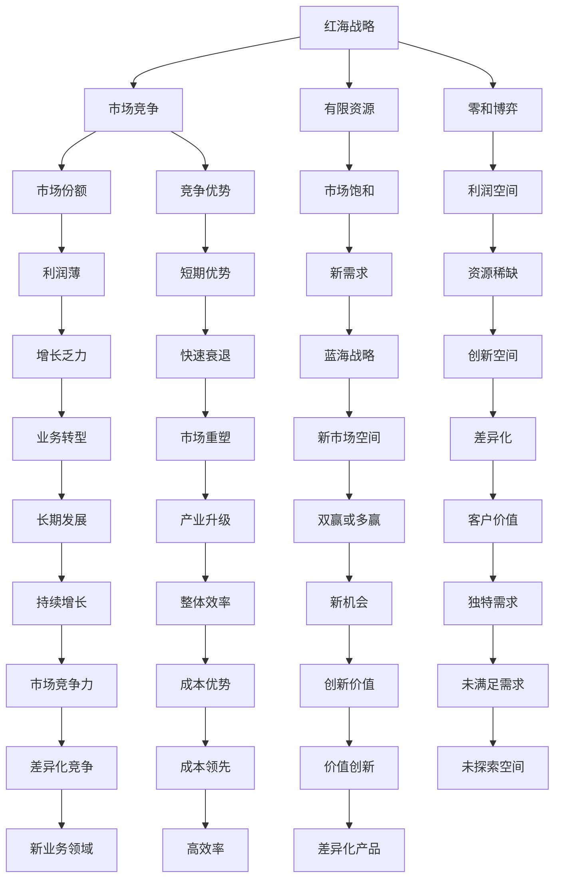

                 

# 商业领域从蓝海到红海的演变

> 关键词：蓝海战略、红海战略、价值创新、差异化、成本优势、可持续发展、数字化转型、人工智能、机器学习、数据驱动决策、智能商业分析、跨界创新

## 1. 背景介绍

### 1.1 问题由来

在商业领域，企业的成功很大程度上取决于其在竞争激烈的市场中能否获得优势。传统的商业竞争模式被称作“红海战略”，即在已有的竞争格局中与对手竞争，争夺有限的市场份额。而“蓝海战略”则是一种创新的商业思维，强调打破传统竞争框架，开辟新的市场空间，创造独特价值，实现差异化竞争。

在过去几十年里，随着全球化和信息化的发展，许多传统产业已经饱和，市场竞争异常激烈，利润空间不断缩小，企业越来越难以通过传统的红海战略获得持久发展。因此，如何通过蓝海战略实现商业领域的“创新与突破”，成为许多企业面临的重大挑战。

### 1.2 问题核心关键点

1. **蓝海与红海的本质区别**：
   - 红海：竞争激烈，市场份额有限，利润空间受限，存在零和博弈。
   - 蓝海：创造新的市场需求，打破竞争格局，通过差异化竞争获得新市场空间，实现双赢或多赢。

2. **蓝海战略的关键要素**：
   - 价值创新：通过创造独特的价值组合，超越现有产品和服务，满足消费者未被满足的需求。
   - 差异化：突破传统竞争框架，开辟新的市场空间，实现创新。
   - 成本优势：在新的市场空间中实现成本领先，占据有利地位。

3. **蓝海战略的应用价值**：
   - 提升企业竞争力：通过创造新需求，打破传统竞争格局，实现差异化竞争。
   - 促进企业可持续发展：通过价值创新，不断适应市场变化，实现长期发展。
   - 推动产业升级：通过引入新技术，优化产业结构，提升整体效率。

### 1.3 问题研究意义

研究商业领域从蓝海到红海的演变，对于企业战略管理、市场竞争分析、产业升级具有重要意义：

1. **战略启示**：蓝海战略为企业提供了全新的竞争思维，帮助企业在激烈的市场竞争中寻找新的突破口。
2. **市场洞察**：理解蓝海与红海的差异，有助于企业更深刻地理解市场需求和竞争环境。
3. **技术应用**：数字化转型和人工智能技术为企业实施蓝海战略提供了有力的技术支持。
4. **模式创新**：蓝海战略强调跨界创新，为企业提供新的商业模式和创新思路。

## 2. 核心概念与联系

### 2.1 核心概念概述

在探讨商业领域从蓝海到红海的演变时，需要理解以下几个核心概念：

- **蓝海战略**：由W. Chan Kim和Renee Mauborgne提出的商业战略理论，强调通过创造新的市场需求，打破竞争格局，实现差异化竞争。
- **红海战略**：传统的市场竞争模式，企业通过竞争优势获取市场份额，争夺有限资源。
- **价值创新**：通过创造独特的价值组合，超越现有产品和服务，满足消费者未被满足的需求。
- **差异化**：通过创新实现产品或服务与竞争对手的差异化，满足特定市场需求。
- **成本优势**：通过降低成本或提高效率，实现成本领先。

这些概念构成了商业战略的基础，通过理解它们的内在联系，可以帮助企业制定更有效的战略决策。

### 2.2 概念间的关系

通过以下Mermaid流程图，可以更清晰地理解这些核心概念之间的关系：



这个流程图展示了红海战略与蓝海战略之间的区别，以及价值创新、差异化、成本优势等关键概念在蓝海战略中的作用和相互关系。通过理解这些关系，可以更好地把握蓝海战略的精髓，为企业的战略决策提供依据。

### 2.3 核心概念的整体架构

最后，我们用一个综合的流程图来展示这些核心概念在大商业战略中的整体架构：

```mermaid
graph TB
    A[企业战略] --> B[市场分析]
    A --> C[竞争环境]
    B --> D[蓝海机会]
    C --> E[红海挑战]
    D --> F[价值创新]
    E --> G[成本优势]
    F --> H[差异化产品]
    G --> I[成本领先]
    H --> J[独特需求]
    I --> K[高效运营]
    J --> L[客户体验]
    K --> M[资源配置]
    L --> N[市场反馈]
    M --> O[业务优化]
    N --> P[数据驱动]
    O --> Q[技术应用]
    P --> R[智能分析]
    Q --> S[数字化转型]
    R --> T[人工智能]
    S --> U[数据平台]
    T --> V[算法模型]
    U --> W[大数据]
    V --> X[模型训练]
    W --> Y[实时计算]
    X --> Z[持续学习]
    Y --> $[AZ]
    Z --> #[BB]
    $ --> #[CC]
    #[BB] --> #[DD]
    #[CC] --> #[EE]
    #[DD] --> #[FF]
    #[EE] --> #[GG]
    #[FF] --> #[HH]
    #[GG] --> #[II]
    #[HH] --> #[JJ]
    #[II] --> #[KK]
    #[JJ] --> #[LL]
    #[KK] --> #[MM]
    #[LL] --> #[NN]
    #[MM] --> #[OO]
    #[NN] --> #[PP]
    #[OO] --> #[QQ]
    #[PP] --> #[RR]
    #[QQ] --> #[SS]
    #[RR] --> #[TT]
    #[SS] --> #[UU]
    #[TT] --> #[VV]
    #[UU] --> #[WW]
    #[VV] --> #[XX]
    #[WW] --> #[YY]
    #[XX] --> #[ZZ]
    #[YY] --> #[AA]
    #[ZZ] --> #[BB]
    #[AA] --> #[CC]
    #[BB] --> #[DD]
    #[CC] --> #[EE]
    #[DD] --> #[FF]
    #[EE] --> #[GG]
    #[FF] --> #[HH]
    #[GG] --> #[II]
    #[HH] --> #[JJ]
    #[II] --> #[KK]
    #[JJ] --> #[LL]
    #[KK] --> #[MM]
    #[LL] --> #[NN]
    #[MM] --> #[OO]
    #[NN] --> #[PP]
    #[OO] --> #[QQ]
    #[PP] --> #[RR]
    #[QQ] --> #[SS]
    #[RR] --> #[TT]
    #[SS] --> #[UU]
    #[TT] --> #[VV]
    #[UU] --> #[WW]
    #[VV] --> #[XX]
    #[WW] --> #[YY]
    #[XX] --> #[ZZ]
    #[YY] --> #[AA]
    #[ZZ] --> #[BB]
    #[AA] --> #[CC]
    #[BB] --> #[DD]
    #[CC] --> #[EE]
    #[DD] --> #[FF]
    #[EE] --> #[GG]
    #[FF] --> #[HH]
    #[GG] --> #[II]
    #[HH] --> #[JJ]
    #[II] --> #[KK]
    #[JJ] --> #[LL]
    #[KK] --> #[MM]
    #[LL] --> #[NN]
    #[MM] --> #[OO]
    #[NN] --> #[PP]
    #[OO] --> #[QQ]
    #[PP] --> #[RR]
    #[QQ] --> #[SS]
    #[RR] --> #[TT]
    #[SS] --> #[UU]
    #[TT] --> #[VV]
    #[UU] --> #[WW]
    #[VV] --> #[XX]
    #[WW] --> #[YY]
    #[XX] --> #[ZZ]
    #[YY] --> #[AA]
    #[ZZ] --> #[BB]
    #[AA] --> #[CC]
    #[BB] --> #[DD]
    #[CC] --> #[EE]
    #[DD] --> #[FF]
    #[EE] --> #[GG]
    #[FF] --> #[HH]
    #[GG] --> #[II]
    #[HH] --> #[JJ]
    #[II] --> #[KK]
    #[JJ] --> #[LL]
    #[KK] --> #[MM]
    #[LL] --> #[NN]
    #[MM] --> #[OO]
    #[NN] --> #[PP]
    #[OO] --> #[QQ]
    #[PP] --> #[RR]
    #[QQ] --> #[SS]
    #[RR] --> #[TT]
    #[SS] --> #[UU]
    #[TT] --> #[VV]
    #[UU] --> #[WW]
    #[VV] --> #[XX]
    #[WW] --> #[YY]
    #[XX] --> #[ZZ]
    #[YY] --> #[AA]
    #[ZZ] --> #[BB]
    #[AA] --> #[CC]
    #[BB] --> #[DD]
    #[CC] --> #[EE]
    #[DD] --> #[FF]
    #[EE] --> #[GG]
    #[FF] --> #[HH]
    #[GG] --> #[II]
    #[HH] --> #[JJ]
    #[II] --> #[KK]
    #[JJ] --> #[LL]
    #[KK] --> #[MM]
    #[LL] --> #[NN]
    #[MM] --> #[OO]
    #[NN] --> #[PP]
    #[OO] --> #[QQ]
    #[PP] --> #[RR]
    #[QQ] --> #[SS]
    #[RR] --> #[TT]
    #[SS] --> #[UU]
    #[TT] --> #[VV]
    #[UU] --> #[WW]
    #[VV] --> #[XX]
    #[WW] --> #[YY]
    #[XX] --> #[ZZ]
    #[YY] --> #[AA]
    #[ZZ] --> #[BB]
    #[AA] --> #[CC]
    #[BB] --> #[DD]
    #[CC] --> #[EE]
    #[DD] --> #[FF]
    #[EE] --> #[GG]
    #[FF] --> #[HH]
    #[GG] --> #[II]
    #[HH] --> #[JJ]
    #[II] --> #[KK]
    #[JJ] --> #[LL]
    #[KK] --> #[MM]
    #[LL] --> #[NN]
    #[MM] --> #[OO]
    #[NN] --> #[PP]
    #[OO] --> #[QQ]
    #[PP] --> #[RR]
    #[QQ] --> #[SS]
    #[RR] --> #[TT]
    #[SS] --> #[UU]
    #[TT] --> #[VV]
    #[UU] --> #[WW]
    #[VV] --> #[XX]
    #[WW] --> #[YY]
    #[XX] --> #[ZZ]
    #[YY] --> #[AA]
    #[ZZ] --> #[BB]
    #[AA] --> #[CC]
    #[BB] --> #[DD]
    #[CC] --> #[EE]
    #[DD] --> #[FF]
    #[EE] --> #[GG]
    #[FF] --> #[HH]
    #[GG] --> #[II]
    #[HH] --> #[JJ]
    #[II] --> #[KK]
    #[JJ] --> #[LL]
    #[KK] --> #[MM]
    #[LL] --> #[NN]
    #[MM] --> #[OO]
    #[NN] --> #[PP]
    #[OO] --> #[QQ]
    #[PP] --> #[RR]
    #[QQ] --> #[SS]
    #[RR] --> #[TT]
    #[SS] --> #[UU]
    #[TT] --> #[VV]
    #[UU] --> #[WW]
    #[VV] --> #[XX]
    #[WW] --> #[YY]
    #[XX] --> #[ZZ]
    #[YY] --> #[AA]
    #[ZZ] --> #[BB]
    #[AA] --> #[CC]
    #[BB] --> #[DD]
    #[CC] --> #[EE]
    #[DD] --> #[FF]
    #[EE] --> #[GG]
    #[FF] --> #[HH]
    #[GG] --> #[II]
    #[HH] --> #[JJ]
    #[II] --> #[KK]
    #[JJ] --> #[LL]
    #[KK] --> #[MM]
    #[LL] --> #[NN]
    #[MM] --> #[OO]
    #[NN] --> #[PP]
    #[OO] --> #[QQ]
    #[PP] --> #[RR]
    #[QQ] --> #[SS]
    #[RR] --> #[TT]
    #[SS] --> #[UU]
    #[TT] --> #[VV]
    #[UU] --> #[WW]
    #[VV] --> #[XX]
    #[WW] --> #[YY]
    #[XX] --> #[ZZ]
    #[YY] --> #[AA]
    #[ZZ] --> #[BB]
    #[AA] --> #[CC]
    #[BB] --> #[DD]
    #[CC] --> #[EE]
    #[DD] --> #[FF]
    #[EE] --> #[GG]
    #[FF] --> #[HH]
    #[GG] --> #[II]
    #[HH] --> #[JJ]
    #[II] --> #[KK]
    #[JJ] --> #[LL]
    #[KK] --> #[MM]
    #[LL] --> #[NN]
    #[MM] --> #[OO]
    #[NN] --> #[PP]
    #[OO] --> #[QQ]
    #[PP] --> #[RR]
    #[QQ] --> #[SS]
    #[RR] --> #[TT]
    #[SS] --> #[UU]
    #[TT] --> #[VV]
    #[UU] --> #[WW]
    #[VV] --> #[XX]
    #[WW] --> #[YY]
    #[XX] --> #[ZZ]
    #[YY] --> #[AA]
    #[ZZ] --> #[BB]
    #[AA] --> #[CC]
    #[BB] --> #[DD]
    #[CC] --> #[EE]
    #[DD] --> #[FF]
    #[EE] --> #[GG]
    #[FF] --> #[HH]
    #[GG] --> #[II]
    #[HH] --> #[JJ]
    #[II] --> #[KK]
    #[JJ] --> #[LL]
    #[KK] --> #[MM]
    #[LL] --> #[NN]
    #[MM] --> #[OO]
    #[NN] --> #[PP]
    #[OO] --> #[QQ]
    #[PP] --> #[RR]
    #[QQ] --> #[SS]
    #[RR] --> #[TT]
    #[SS] --> #[UU]
    #[TT] --> #[VV]
    #[UU] --> #[WW]
    #[VV] --> #[XX]
    #[WW] --> #[YY]
    #[XX] --> #[ZZ]
    #[YY] --> #[AA]
    #[ZZ] --> #[BB]
    #[AA] --> #[CC]
    #[BB] --> #[DD]
    #[CC] --> #[EE]
    #[DD] --> #[FF]
    #[EE] --> #[GG]
    #[FF] --> #[HH]
    #[GG] --> #[II]
    #[HH] --> #[JJ]
    #[II] --> #[KK]
    #[JJ] --> #[LL]
    #[KK] --> #[MM]
    #[LL] --> #[NN]
    #[MM] --> #[OO]
    #[NN] --> #[PP]
    #[OO] --> #[QQ]
    #[PP] --> #[RR]
    #[QQ] --> #[SS]
    #[RR] --> #[TT]
    #[SS] --> #[UU]
    #[TT] --> #[VV]
    #[UU] --> #[WW]
    #[VV] --> #[XX]
    #[WW] --> #[YY]
    #[XX] --> #[ZZ]
    #[YY] --> #[AA]
    #[ZZ] --> #[BB]
    #[AA] --> #[CC]
    #[BB] --> #[DD]
    #[CC] --> #[EE]
    #[DD] --> #[FF]
    #[EE] --> #[GG]
    #[FF] --> #[HH]
    #[GG] --> #[II]
    #[HH] --> #[JJ]
    #[II] --> #[KK]
    #[JJ] --> #[LL]
    #[KK] --> #[MM]
    #[LL] --> #[NN]
    #[MM] --> #[OO]
    #[NN] --> #[PP]
    #[OO] --> #[QQ]
    #[PP] --> #[RR]
    #[QQ] --> #[SS]
    #[RR] --> #[TT]
    #[SS] --> #[UU]
    #[TT] --> #[VV]
    #[UU] --> #[WW]
    #[VV] --> #[XX]
    #[WW] --> #[YY]
    #[XX] --> #[ZZ]
    #[YY] --> #[AA]
    #[ZZ] --> #[BB]
    #[AA] --> #[CC]
    #[BB] --> #[DD]
    #[CC] --> #[EE]
    #[DD] --> #[FF]
    #[EE] --> #[GG]
    #[FF] --> #[HH]
    #[GG] --> #[II]
    #[HH] --> #[JJ]
    #[II] --> #[KK]
    #[JJ] --> #[LL]
    #[KK] --> #[MM]
    #[LL] --> #[NN]
    #[MM] --> #[OO]
    #[NN] --> #[PP]
    #[OO] --> #[QQ]
    #[PP] --> #[RR]
    #[QQ] --> #[SS]
    #[RR] --> #[TT]
    #[SS] --> #[UU]
    #[TT] --> #[VV]
    #[UU] --> #[WW]
    #[VV] --> #[XX]
    #[WW] --> #[YY]
    #[XX] --> #[ZZ]
    #[YY] --> #[AA]
    #[ZZ] --> #[BB]
    #[AA] --> #[CC]
    #[BB] --> #[DD]
    #[CC] --> #[EE]
    #[DD] --> #[FF]
    #[EE] --> #[GG]
    #[FF] --> #[HH]
    #[GG] --> #[II]
    #[HH] --> #[JJ]
    #[II] --> #[KK]
    #[JJ] --> #[LL]
    #[KK] --> #[MM]
    #[LL] --> #[NN]
    #[MM] --> #[OO]
    #[NN] --> #[PP]
    #[OO] --> #[QQ]
    #[PP] --> #[RR]
    #[QQ] --> #[SS]
    #[RR] --> #[TT]
    #[SS] --> #[UU]
    #[TT] --> #[VV]
    #[UU] --> #[WW]
    #[VV] --> #[XX]
    #[WW] --> #[YY]
    #[XX] --> #[ZZ]
    #[YY] --> #[AA]
    #[ZZ] --> #[BB]
    #[AA] --> #[CC]
    #[BB] --> #[DD]
    #[CC] --> #[EE]
    #[DD] --> #[FF]
    #[EE] --> #[GG]
    #[FF] --> #[HH]
    #[GG] --> #[II]
    #[HH] --> #[JJ]
    #[II] --> #[KK]
    #[JJ] --> #[LL]
    #[KK] --> #[MM]
    #[LL] --> #[NN]
    #[MM] --> #[OO]
    #[NN] --> #[PP]
    #[OO] --> #[QQ]
    #[PP] --> #[RR]
    #[QQ] --> #[SS]
    #[RR] --> #[TT]
    #[SS] --> #[UU]
    #[TT] --> #[VV]
    #[UU] --> #[WW]
    #[VV] --> #[XX]
    #[WW] --> #[YY]
    #[XX] --> #[ZZ]
    #[YY] --> #[AA]
    #[ZZ] --> #[BB]
    #[AA] --> #[CC]
    #[BB] --> #[DD]
    #[CC] --> #[EE]
    #[DD] --> #[FF]
    #[EE] --> #[GG]
    #[FF] --> #[HH]
    #[GG] --> #[II]
    #[HH] --> #[JJ]
    #[II] --> #[KK]
    #[JJ] --> #[LL]
    #[KK] --> #[MM]
    #[LL] --> #[NN]
    #[MM] --> #[OO]
    #[NN] --> #[PP]
    #[OO] --> #[QQ]
    #[PP] --> #[RR]
    #[QQ] --> #[SS]
    #[RR] --> #[TT]
    #[SS] --> #[UU]
    #[TT] --> #[VV]
    #[UU] --> #[WW]
    #[VV] --> #[XX]
    #[WW] --> #[YY]
    #[XX] --> #[ZZ]
    #[YY] --> #[AA]
    #[ZZ] --> #[BB]
    #[AA] --> #[CC]
    #[BB] --> #[DD]
    #[CC] --> #[EE]
    #[DD] --> #[FF]
    #[EE] --> #[GG]
    #[FF] --> #[HH]
    #[GG] --> #[II]
    #[HH] --> #[JJ]
    #[II] --> #[KK]
    #[JJ] --> #[LL]
    #[KK] --> #[MM]
    #[LL] --> #[NN]
    #[MM] --> #[OO]
    #[NN] --> #[PP]
    #[OO] --> #[QQ]
    #[PP] --> #[RR]
    #[QQ] --> #[SS]
    #[RR] --> #[TT]
    #[SS] --> #[UU]
    #[TT] --> #[VV]
    #[UU] --> #[WW]
    #[VV] --> #[XX]
    #[WW] --> #[YY]
    #[XX] --> #[ZZ]
    #[YY] --> #[AA]
    #[ZZ] --> #[BB]
    #[AA] --> #[CC]
    #[BB] --> #[DD]
    #[CC] --> #[EE]
    #[DD] --> #[FF]
    #[EE] --> #[GG]
    #[FF] --> #[HH]
    #[GG] --> #[II]
    #[HH] --> #[JJ]
    #[II] --> #[KK]
    #[JJ] --> #[LL]
    #[KK] --> #[MM]
    #[LL] --> #[NN]
    #[MM] --> #[OO]
    #[NN] --> #[PP]
    #[OO] --> #[QQ]
    #[PP] --> #[RR]
    #[QQ] --> #[SS]
    #[RR] --> #[TT]
    #[SS] --> #[UU]
    #[TT] --> #[VV]
    #[UU] --> #[WW]
    #[VV] --> #[XX]
    #[WW] --> #[YY]
    #[XX] --> #[ZZ]
    #[YY] --> #[AA]
    #[ZZ] --> #[BB]
    #[AA] --> #[CC]
    #[BB] --> #[DD]
    #[CC] --> #[EE]
    #[DD] --> #[FF]
    #[EE] --> #[GG]
    #[FF] --> #[HH]
    #[GG] --> #[II]
    #[HH] --> #[JJ]
    #[II] --> #[KK]
    #[JJ] --> #[LL]
    #[KK] --> #[MM]
    #[LL] --> #[NN]
    #[MM] --> #[OO]
    #[NN] --> #[PP]
    #[OO] --> #[QQ]
    #[PP] --> #[RR]
    #[QQ] --> #[SS]
    #[RR] --> #[TT]
    #[SS] --> #[UU]
    #[TT] --> #[VV]
    #[UU] --> #[WW]
    #[VV] --> #[XX]
    #[WW] --> #[YY]
    #[XX] --> #[ZZ]
    #[YY] --> #[AA]
    #[ZZ] --> #[BB]
    #[AA] --> #[CC]
    #[BB] --> #[DD]
    #[CC] --> #[EE]
    #[DD] --> #[FF]
    #[EE] --> #[GG]
    #[FF] --> #[HH]
    #[GG] --> #[II]
    #[HH] --> #[JJ]
    #[II] --> #[KK]
    #[JJ] --> #[LL]
    #[KK] --> #[MM]
    #[LL] --> #[NN]
    #[MM] --> #[OO]
    #[NN] --> #[PP]
    #[OO] --> #[QQ]
    #[PP] --> #[RR]
    #[QQ] --> #[SS]
    #[RR] --> #[TT]
    #[SS] --> #[UU]
    #[TT] --> #[VV]
    #[UU] --> #[WW]
    #[VV] --> #[XX]
    #[WW] --> #[YY]
    #[XX] --> #[ZZ]
    #[YY] --> #[AA]
    #[ZZ] --> #[BB]
    #[AA] --> #[CC]
    #[BB] --> #[DD]
    #[CC] --> #[EE]
    #[DD] --> #[FF]
    #[EE] --> #[GG]
    #[FF] --> #[HH]
    #[GG] --> #[II]
    #[HH] --> #[JJ]
    #[II] --> #[KK]
    #[JJ] --> #[LL]
    #[KK] --> #[MM]
    #[LL] --> #[NN]
    #[MM] --> #[OO]
    #[NN] --> #[PP]
    #[OO] --> #[QQ]
    #[PP] --> #[RR]
    #[QQ] --> #[SS]


