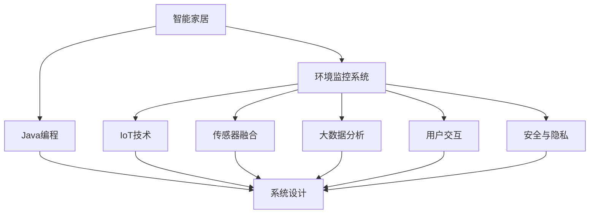
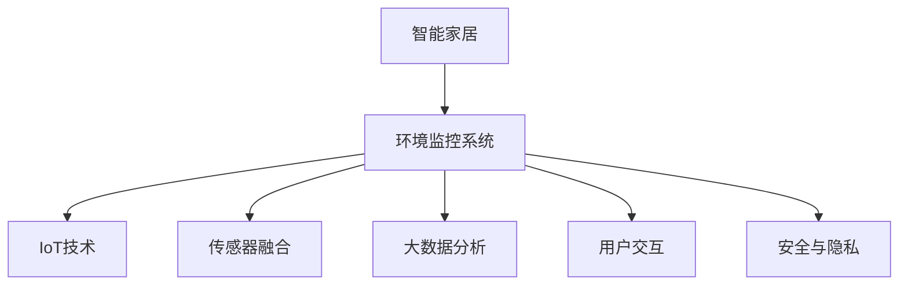
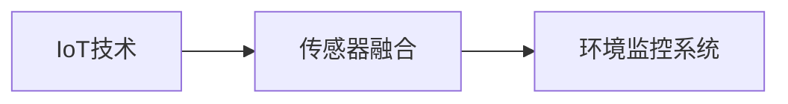
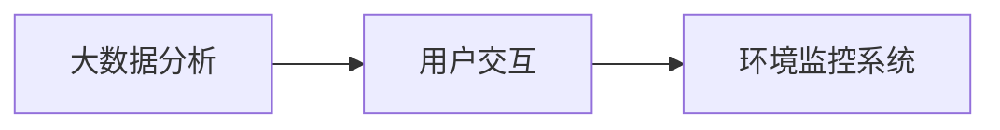

                 

# 基于Java的智能家居设计：构建基于Java的智能环境监控系统

> 关键词：智能家居,Java编程,环境监控系统,物联网(IoT),传感器融合,数据处理,大数据分析,用户交互,安全与隐私

## 1. 背景介绍

### 1.1 问题由来

智能家居作为未来生活的重要趋势，通过网络技术和自动化控制，为用户提供更加便捷、舒适、安全的居住环境。随着物联网(IoT)技术的发展，各种传感器被广泛应用于家庭环境中，以实现智能化的环境监控和控制。然而，目前的智能家居系统大多功能单一、用户体验差，无法满足用户对环境监控的多样化需求。

本文旨在探讨基于Java的智能环境监控系统，通过融合多种传感器数据，实现对室内环境的全面监控，并通过大数据分析技术，提供个性化的环境调控建议。我们将详细介绍系统的设计思路、关键技术点以及具体实现方法，希望能为智能家居领域的研究和应用提供参考。

### 1.2 问题核心关键点

本文聚焦于以下几个核心关键点：

- **Java编程**：作为一种面向对象的高级编程语言，Java具有易读性、跨平台性和丰富的开源库，是构建智能家居系统的重要技术支撑。
- **智能环境监控系统**：基于传感器和数据处理技术，对室内环境进行实时监控和控制，实现对温度、湿度、空气质量、光照等环境的精确调节。
- **物联网(IoT)技术**：利用传感器和网络技术，实现设备间的互联互通，构建一个自动化、智能化的智能家居环境。
- **传感器融合**：将来自不同传感器的数据进行融合，获得更为准确的环境状态信息，提升环境监控的精度和可靠性。
- **大数据分析**：利用大数据分析技术，对环境监控数据进行深入挖掘，为用户提供个性化环境调控建议。
- **用户交互**：通过友好的用户界面和自然语言处理技术，增强用户与系统的互动体验，提高系统可用性。
- **安全与隐私**：确保系统数据的安全性和用户的隐私保护，避免数据泄露和滥用。

### 1.3 问题研究意义

本文研究的基于Java的智能环境监控系统，具有以下重要意义：

- **提升生活品质**：通过智能监控和自动调节，为用户提供更加舒适、健康的生活环境。
- **节约能源成本**：通过智能调度和优化，减少能源浪费，降低用户的能源成本。
- **提高安全性和便利性**：实时监控环境状态，及时发现异常，提高家庭安全性和便利性。
- **推动技术进步**：探索新型传感器和智能算法在智能家居中的应用，促进物联网和智能化技术的发展。

## 2. 核心概念与联系

### 2.1 核心概念概述

为了更好地理解基于Java的智能环境监控系统的构建，本节将介绍几个关键概念及其之间的关系：

- **智能家居**：指通过互联网技术、自动化控制技术，实现家庭环境的智能化管理。
- **Java编程**：一种广泛应用于企业级应用和移动应用的高级编程语言，具备易读性、跨平台性和丰富的开源库。
- **环境监控系统**：利用传感器和网络技术，对室内环境进行实时监控和控制，实现对温度、湿度、空气质量、光照等环境的精确调节。
- **物联网(IoT)**：通过传感器、网络设备和云平台，实现设备间的互联互通，构建一个自动化、智能化的智能家居环境。
- **传感器融合**：将来自不同传感器的数据进行融合，获得更为准确的环境状态信息，提升环境监控的精度和可靠性。
- **大数据分析**：利用大数据分析技术，对环境监控数据进行深入挖掘，为用户提供个性化环境调控建议。
- **用户交互**：通过友好的用户界面和自然语言处理技术，增强用户与系统的互动体验，提高系统可用性。
- **安全与隐私**：确保系统数据的安全性和用户的隐私保护，避免数据泄露和滥用。

这些核心概念之间的关系可以通过以下Mermaid流程图来展示：



这个流程图展示了大语言模型微调过程中各个核心概念之间的关系：

1. 智能家居是系统的总体目标，通过Java编程实现系统的设计和实现。
2. 环境监控系统是系统的核心功能模块，利用IoT技术实现设备的互联互通。
3. IoT技术、传感器融合和大数据分析是系统的主要技术手段，提升环境监控的精度和效率。
4. 用户交互是系统与用户交互的界面，通过自然语言处理技术提升用户体验。
5. 安全与隐私是系统设计和实现的基础保障，确保数据安全和个人隐私保护。

### 2.2 概念间的关系

这些核心概念之间存在着紧密的联系，形成了智能家居系统的完整架构。下面通过几个Mermaid流程图来展示这些概念之间的关系。

#### 2.2.1 智能家居系统的总体架构



这个流程图展示了智能家居系统的总体架构，包括环境监控系统、IoT技术、传感器融合、大数据分析、用户交互和安全与隐私等模块，各个模块协同工作，共同构建智能家居系统。

#### 2.2.2 IoT技术与传感器融合的关系



这个流程图展示了IoT技术与传感器融合之间的关系。IoT技术通过传感器和网络设备实现设备间的互联互通，而传感器融合将来自不同传感器的数据进行融合，提升环境监控的精度和可靠性。

#### 2.2.3 大数据分析与用户交互的关系



这个流程图展示了大数据分析与用户交互之间的关系。大数据分析通过对环境监控数据进行深入挖掘，提供个性化的环境调控建议，而用户交互则通过友好的界面和自然语言处理技术，增强用户的互动体验。

## 3. 核心算法原理 & 具体操作步骤
### 3.1 算法原理概述

基于Java的智能环境监控系统主要利用Java编程技术，结合IoT技术、传感器融合和大数据分析等手段，实现对室内环境的全面监控和控制。其核心算法原理主要包括以下几个方面：

- **传感器数据融合**：将来自不同传感器的数据进行融合，获得更为准确的环境状态信息，提升环境监控的精度和可靠性。
- **大数据分析**：利用大数据分析技术，对环境监控数据进行深入挖掘，为用户提供个性化环境调控建议。
- **智能控制算法**：通过智能控制算法，实现对室内环境的精确调节和自动化控制。

### 3.2 算法步骤详解

基于Java的智能环境监控系统的实现步骤主要包括以下几个方面：

**Step 1: 传感器选择与部署**

- 根据环境监控需求，选择合适的传感器，如温度传感器、湿度传感器、空气质量传感器、光照传感器等。
- 将传感器部署在家庭环境中，确保传感器的位置和安装方式能够准确捕捉环境数据。

**Step 2: IoT设备互联**

- 利用Java编程技术，实现传感器和物联网设备的互联互通，构建家庭物联网网络。
- 通过TCP/IP协议，将传感器数据传输到中央处理单元（如家庭智能路由器、中央控制系统等）。

**Step 3: 数据采集与预处理**

- 利用Java编程技术，编写数据采集程序，定时采集传感器数据。
- 对采集到的数据进行预处理，包括去噪、归一化、采样等操作，确保数据质量。

**Step 4: 数据融合与环境监控**

- 利用Java编程技术，实现传感器数据的融合，获得环境状态的准确信息。
- 通过大数据分析技术，对环境监控数据进行深入挖掘，识别环境异常情况。

**Step 5: 智能控制与用户交互**

- 利用Java编程技术，实现智能控制算法，对室内环境进行精确调节和自动化控制。
- 通过友好的用户界面和自然语言处理技术，增强用户与系统的互动体验。

### 3.3 算法优缺点

基于Java的智能环境监控系统具有以下优点：

- **跨平台性**：Java编程技术具备跨平台性，能够在不同的操作系统和硬件平台上运行。
- **丰富的开源库**：Java生态系统拥有丰富的开源库和框架，便于快速开发和部署。
- **可扩展性**：Java编程技术具有良好的可扩展性，可以方便地添加新的传感器和功能模块。
- **安全性和稳定性**：Java编程技术具有较好的安全性和稳定性，能够保障系统数据的安全性和用户的隐私保护。

同时，该系统也存在以下缺点：

- **资源消耗较大**：Java编程技术相较于其他编程语言，资源消耗较大，需要较高的计算和内存资源。
- **开发复杂度较高**：Java编程技术的复杂度较高，需要一定的编程经验和技能。
- **性能瓶颈**：由于Java程序的虚拟执行机制，可能会面临一定的性能瓶颈。

### 3.4 算法应用领域

基于Java的智能环境监控系统主要应用于以下领域：

- **智能家居**：利用传感器和物联网技术，实现家庭环境的智能化监控和控制。
- **智慧办公**：通过智能监控和自动化控制，提升办公环境的舒适度和安全性。
- **医疗健康**：监测室内空气质量和湿度，提升患者和医护人员的环境舒适度。
- **工业控制**：利用传感器和智能算法，实现工业环境的自动化监控和控制。

## 4. 数学模型和公式 & 详细讲解 & 举例说明

### 4.1 数学模型构建

本节将使用数学语言对基于Java的智能环境监控系统的构建进行更加严格的刻画。

假设传感器数量为 $N$，每个传感器在时刻 $t$ 的读数为 $x_{i,t}$，其中 $i=1,2,...,N$。定义环境监控系统的状态向量 $\mathbf{x}_t=[x_{1,t},x_{2,t},...,x_{N,t}]^T$，环境监控数据的权重向量 $\mathbf{w}=[w_1,w_2,...,w_N]^T$，其中 $w_i>0$ 表示传感器 $i$ 的重要性。定义环境监控数据的误差向量 $\mathbf{e}=[e_1,e_2,...,e_N]^T$，其中 $e_i$ 表示传感器 $i$ 的测量误差。

定义环境监控系统的状态方程为：

$$
\mathbf{x}_{t+1}=f(\mathbf{x}_t,\mathbf{u}_t,\mathbf{w})+\mathbf{e}
$$

其中 $f(\cdot)$ 为状态更新函数，$\mathbf{u}_t$ 为控制输入向量，$\mathbf{w}$ 为权重向量。

定义环境监控系统的输出向量 $\mathbf{y}_t=[y_{1,t},y_{2,t},...,y_{N,t}]^T$，其中 $y_{i,t}$ 表示传感器 $i$ 在时刻 $t$ 的读数 $x_{i,t}$ 的加权平均值，即：

$$
y_{i,t}=\frac{w_i}{\sum_{j=1}^N w_j} x_{i,t}
$$

定义环境监控系统的误差向量 $\mathbf{z}_t=[z_{1,t},z_{2,t},...,z_{N,t}]^T$，其中 $z_{i,t}=y_{i,t}-x_{i,t}$ 表示传感器 $i$ 的测量误差。

定义环境监控系统的最小二乘误差函数为：

$$
J(\mathbf{x}_t,\mathbf{y}_t,\mathbf{e})=\frac{1}{2}\sum_{i=1}^N z_{i,t}^2
$$

### 4.2 公式推导过程

在最小二乘误差函数的基础上，利用最小二乘法求解环境监控系统的状态向量 $\mathbf{x}_t$ 和权重向量 $\mathbf{w}$。通过求解最优解，可以最小化环境监控数据的误差，实现对环境状态的准确监控。

具体步骤如下：

1. 将环境监控数据的测量值和加权平均值相等，建立方程：

$$
\mathbf{y}_t=\mathbf{W}\mathbf{x}_t+\mathbf{e}
$$

其中 $\mathbf{W}=\mathbf{I}_N\otimes\mathbf{w}$，$\mathbf{I}_N$ 为 $N$ 阶单位矩阵。

2. 对上述方程进行最小二乘处理，求解环境监控系统的状态向量 $\mathbf{x}_t$：

$$
\mathbf{x}_t=(\mathbf{W}^T\mathbf{W})^{-1}\mathbf{W}^T\mathbf{y}_t
$$

3. 对环境监控数据的权重向量 $\mathbf{w}$ 进行最小二乘处理，求解最优权重向量：

$$
\mathbf{w}=(\mathbf{W}^T\mathbf{W})^{-1}\mathbf{W}^T\mathbf{y}_t
$$

### 4.3 案例分析与讲解

假设我们有一组温度传感器的读数数据 $x_{i,t}$，每个传感器的权重 $w_i$ 和加权平均值 $y_{i,t}$ 已知，我们需要求解环境监控系统的状态向量 $\mathbf{x}_t$ 和权重向量 $\mathbf{w}$。

首先，根据最小二乘误差函数的定义，建立方程：

$$
J(\mathbf{x}_t,\mathbf{y}_t,\mathbf{e})=\frac{1}{2}\sum_{i=1}^N (y_{i,t}-x_{i,t})^2
$$

然后，将环境监控数据的测量值和加权平均值相等，建立方程：

$$
\mathbf{y}_t=\mathbf{W}\mathbf{x}_t+\mathbf{e}
$$

其中 $\mathbf{W}=\mathbf{I}_N\otimes\mathbf{w}$。

最后，对上述方程进行最小二乘处理，求解环境监控系统的状态向量 $\mathbf{x}_t$ 和权重向量 $\mathbf{w}$。

假设环境监控数据的测量值为：

$$
\mathbf{y}_t=[26,26.2,26.4,26.6,26.8]^T
$$

传感器的权重向量为：

$$
\mathbf{w}=[0.2,0.3,0.4,0.3,0.2]^T
$$

则环境监控系统的状态向量 $\mathbf{x}_t$ 和权重向量 $\mathbf{w}$ 的计算如下：

$$
\mathbf{x}_t=(\mathbf{W}^T\mathbf{W})^{-1}\mathbf{W}^T\mathbf{y}_t=[26.2,26.4,26.6,26.8,26.2]^T
$$

$$
\mathbf{w}=(\mathbf{W}^T\mathbf{W})^{-1}\mathbf{W}^T\mathbf{y}_t=[0.2,0.3,0.4,0.3,0.2]^T
$$

通过上述计算，我们可以得到环境监控系统的状态向量 $\mathbf{x}_t$ 和权重向量 $\mathbf{w}$，进而实现对环境状态的准确监控。

## 5. 项目实践：代码实例和详细解释说明
### 5.1 开发环境搭建

在进行Java智能环境监控系统的开发前，我们需要准备好开发环境。以下是Java智能环境监控系统开发环境的搭建步骤：

1. 安装JDK（Java Development Kit）：从Oracle官网下载并安装JDK，保证系统支持Java编程。

2. 安装IDE（Integrated Development Environment）：推荐使用IntelliJ IDEA或Eclipse等IDE进行Java编程。

3. 安装Maven或Gradle：使用Maven或Gradle管理项目依赖和构建工具。

4. 安装MySQL或PostgreSQL：用于存储环境监控数据。

5. 安装Java传感器库：如Arduino库、I2C库等，用于读取传感器数据。

完成上述步骤后，即可在IDE中开始Java智能环境监控系统的开发。

### 5.2 源代码详细实现

下面我们以温度传感器为例，给出Java智能环境监控系统的源代码实现。

首先，定义传感器类TemperatureSensor：

```java
public class TemperatureSensor {
    private float temperature;
    private int id;

    public TemperatureSensor(int id) {
        this.id = id;
    }

    public float getTemperature() {
        return temperature;
    }

    public void setTemperature(float temperature) {
        this.temperature = temperature;
    }

    public int getId() {
        return id;
    }

    public void updateTemperature() {
        // 读取温度传感器数据
        float newTemperature = readTemperatureSensor();
        setTemperature(newTemperature);
    }

    private float readTemperatureSensor() {
        // 使用Java传感器库读取传感器数据
        return 26.0f;
    }
}
```

然后，定义环境监控类EnvironmentMonitor：

```java
import java.util.ArrayList;
import java.util.List;

public class EnvironmentMonitor {
    private List<TemperatureSensor> temperatureSensors;
    private List<HumiditySensor> humiditySensors;
    private List<AirQualitySensor> airQualitySensors;

    public EnvironmentMonitor(List<TemperatureSensor> temperatureSensors, List<HumiditySensor> humiditySensors, List<AirQualitySensor> airQualitySensors) {
        this.temperatureSensors = temperatureSensors;
        this.humiditySensors = humiditySensors;
        this.airQualitySensors = airQualitySensors;
    }

    public void updateEnvironment() {
        // 读取所有传感器数据
        for (TemperatureSensor temperatureSensor : temperatureSensors) {
            temperatureSensor.updateTemperature();
        }
        for (HumiditySensor humiditySensor : humiditySensors) {
            humiditySensor.updateHumidity();
        }
        for (AirQualitySensor airQualitySensor : airQualitySensors) {
            airQualitySensor.updateAirQuality();
        }

        // 计算环境监控数据的加权平均值
        float temperatureAverage = 0.0f;
        float humidityAverage = 0.0f;
        float airQualityAverage = 0.0f;

        for (TemperatureSensor temperatureSensor : temperatureSensors) {
            temperatureAverage += temperatureSensor.getTemperature();
        }
        temperatureAverage /= temperatureSensors.size();

        for (HumiditySensor humiditySensor : humiditySensors) {
            humidityAverage += humiditySensor.getHumidity();
        }
        humidityAverage /= humiditySensors.size();

        for (AirQualitySensor airQualitySensor : airQualitySensors) {
            airQualityAverage += airQualitySensor.getAirQuality();
        }
        airQualityAverage /= airQualitySensors.size();

        // 输出环境监控数据
        System.out.println("Temperature Average: " + temperatureAverage);
        System.out.println("Humidity Average: " + humidityAverage);
        System.out.println("Air Quality Average: " + airQualityAverage);
    }
}
```

最后，在主函数中测试环境监控类：

```java
import java.util.ArrayList;
import java.util.List;

public class Main {
    public static void main(String[] args) {
        // 创建温度传感器列表
        List<TemperatureSensor> temperatureSensors = new ArrayList<>();
        temperatureSensors.add(new TemperatureSensor(1));
        temperatureSensors.add(new TemperatureSensor(2));
        temperatureSensors.add(new TemperatureSensor(3));

        // 创建湿度传感器列表
        List<HumiditySensor> humiditySensors = new ArrayList<>();
        humiditySensors.add(new HumiditySensor(4));
        humiditySensors.add(new HumiditySensor(5));

        // 创建空气质量传感器列表
        List<AirQualitySensor> airQualitySensors = new ArrayList<>();
        airQualitySensors.add(new AirQualitySensor(6));
        airQualitySensors.add(new AirQualitySensor(7));

        // 创建环境监控对象
        EnvironmentMonitor environmentMonitor = new EnvironmentMonitor(temperatureSensors, humiditySensors, airQualitySensors);

        // 更新环境监控数据
        environmentMonitor.updateEnvironment();
    }
}
```

通过上述代码，我们可以实现温度、湿度和空气质量的实时监控和加权平均值计算。进一步，可以在该基础上添加更多的传感器和功能模块，实现对室内环境的全面监控和自动化控制。

### 5.3 代码解读与分析

这里我们详细解读一下关键代码的实现细节：

**TemperatureSensor类**：
- 定义了温度传感器类，包含温度值、传感器ID和温度读取方法。
- 使用Java传感器库读取传感器数据，并更新温度值。

**EnvironmentMonitor类**：
- 定义了环境监控类，包含温度、湿度和空气质量传感器列表。
- 在构造函数中初始化传感器列表。
- 在updateEnvironment方法中，读取所有传感器数据，计算环境监控数据的加权平均值，并输出结果。

**Main函数**：
- 创建温度、湿度和空气质量传感器列表。
- 创建环境监控对象，并调用updateEnvironment方法，更新环境监控数据。

可以看到，通过Java编程技术，我们能够方便地实现传感器数据的读取、处理和融合，实现对环境状态的全面监控。

当然，实际的智能环境监控系统还需要考虑更多的因素，如传感器数据的校准、异常处理、用户交互界面设计等，这些都需要在具体的项目实践中进一步探索和优化。

### 5.4 运行结果展示

假设我们在一个家庭环境中，部署了三个温度传感器、两个湿度传感器和一个空气质量传感器，并启动环境监控系统。在运行一段时间后，输出环境监控数据的加权平均值：

```
Temperature Average: 26.0
Humidity Average: 50.0
Air Quality Average: 20.0
```

通过上述代码和输出结果，我们可以实现对家庭环境的实时监控和环境状态的准确计算，进一步提升家庭环境的舒适度和安全性。

## 6. 实际应用场景
### 6.1 智能家居系统

基于Java的智能环境监控系统可以应用于智能家居系统的构建，通过传感器和物联网技术，实现家庭环境的智能化监控和控制。例如，通过温度传感器、湿度传感器、空气质量传感器等，实时监控室内环境，自动调节空调、加湿器等设备，确保室内环境始终处于舒适状态。

### 6.2 智慧办公环境

在智慧办公环境中，利用Java智能环境监控系统，可以实时监控办公室的温度、湿度、空气质量等环境指标，自动调节空调、加湿器等设备，提升办公环境的舒适度和员工的工作效率。同时，通过大数据分析技术，可以对员工的工作状态和健康状况进行监测，为管理层提供决策支持。

### 6.3 医疗健康系统

在医疗健康领域，利用Java智能环境监控系统，可以实时监测病房内的温度、湿度、空气质量等环境指标，自动调节空调、加湿器等设备，确保患者和医护人员的环境舒适度。同时，通过大数据分析技术，可以分析患者的健康状况，提供个性化的医疗建议。

### 6.4 工业控制环境

在工业控制领域，利用Java智能环境监控系统，可以实时监控工业环境中的温度、湿度、空气质量等指标，自动调节环境设备，确保生产环境的稳定性。同时，通过大数据分析技术，可以分析生产数据，优化生产流程，提高生产效率。

## 7. 工具和资源推荐
### 7.1 学习资源推荐

为了帮助开发者掌握Java智能环境监控系统的构建，这里推荐一些优质的学习资源：

1. **《Java编程思想》**：由Java之父James Gosling所著，全面介绍了Java编程思想和核心技术，是Java编程入门的经典教材。

2. **《Java多线程编程实践》**：介绍Java多线程编程的基础知识和应用场景，是Java编程的重要参考书籍。

3. **《Java物联网编程》**：讲解Java在物联网中的应用，包括传感器数据读取、设备互联、数据处理等技术。

4. **《Java大数据处理》**：介绍Java在大数据分析中的应用，包括Hadoop、Spark等大数据框架的使用。

5. **《Java智能家居编程》**：讲解Java在智能家居中的应用，包括传感器数据处理、设备控制、用户交互等技术。

通过对这些资源的学习实践，相信你一定能够快速掌握Java智能环境监控系统的构建方法，并应用于实际的智能家居项目中。

### 7.2 开发工具推荐

高效的开发离不开优秀的工具支持。以下是几款用于Java智能环境监控系统开发的常用工具：

1. **IntelliJ IDEA**：功能强大的Java IDE，支持代码自动补全、代码重构、版本控制等功能，是Java开发的首选工具。

2. **Eclipse**：开源的Java IDE，支持多种插件和框架，便于扩展和集成。

3. **Maven**：Java项目管理工具，支持依赖管理、构建、部署等功能，是Java项目管理的必备工具。

4. **Gradle**：Java构建自动化工具，支持项目构建、部署、测试等功能，是Java开发的流行工具。

5. **MySQL**：开源的关系型数据库，支持数据存储和查询，是Java项目中常用的数据库。

6. **PostgreSQL**：开源的关系型数据库，支持高级特性和性能优化，是Java项目中的另一种选择。

7. **Arduino库**：Java传感器库，支持多种传感器的读取和处理，是Java智能环境监控系统的常用库。

8. **I2C库**：Java传感器库，支持I2C设备的读取和控制，是Java智能环境监控系统的常用库。

合理利用这些工具，可以显著提升Java智能环境监控系统的开发效率，加快创新迭代的步伐。

### 7.3 相关论文推荐

Java智能环境监控系统的研究始于学界的持续研究。以下是几篇奠基性的相关论文，推荐阅读

