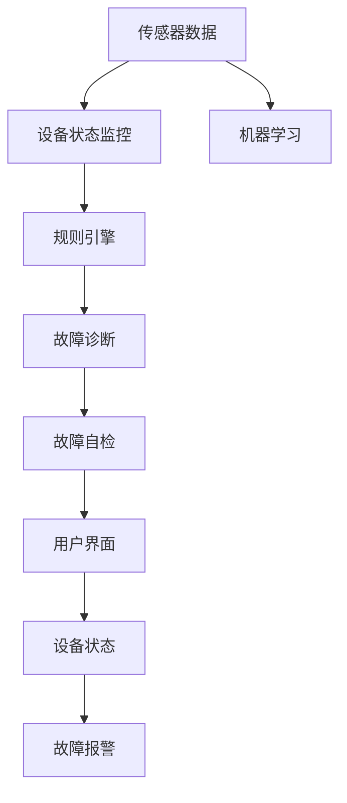

                 

# 基于MQTT协议和RESTful API的智能家居设备故障自检系统

## 1. 背景介绍

### 1.1 问题由来

随着物联网技术的不断进步，智能家居设备越来越普及，如何保障这些设备的安全稳定运行成为了一个重要课题。传统的故障排查需要人工逐一检查设备状态，不仅效率低下，还容易忽略细微的异常。而基于MQTT协议和RESTful API的智能家居设备故障自检系统，可以通过自动化手段实时监控设备状态，快速定位故障，提高设备运行的稳定性和可靠性。

### 1.2 问题核心关键点

1. MQTT协议：一种轻量级的发布/订阅协议，适合实时通信，适用于智能家居设备间的消息传递。
2. RESTful API：一种基于HTTP协议的API设计风格，适用于智能家居设备的远程管理和状态查询。
3. 设备状态监控：实时监控设备传感器数据、状态信息等，发现异常情况及时报警。
4. 故障诊断：利用机器学习、规则引擎等技术，对设备故障进行自动诊断和处理。
5. 故障自检：通过预设故障规则，自动检测设备是否存在潜在故障，提前预警。
6. 用户交互：通过友好的用户界面，展示设备状态、故障信息，便于用户了解和排查问题。

### 1.3 问题研究意义

本系统可以显著提升智能家居设备的运维效率和用户体验。具体而言：
- 减少人工维护成本：自动化故障检测可以节省大量人工检查时间，降低运维成本。
- 提高设备可靠性：实时监控和故障诊断能够及时发现和处理设备异常，避免设备故障。
- 提升用户体验：用户可以实时了解设备状态，通过系统反馈快速排查问题，提升使用便捷性。
- 促进产业发展：推动智能家居设备的安全标准化和智能化升级，促进相关产业健康发展。

## 2. 核心概念与联系

### 2.1 核心概念概述

1. MQTT协议：一种轻量级的发布/订阅协议，用于设备间的高效数据传输。
2. RESTful API：一种基于HTTP协议的API设计风格，提供设备远程管理和状态查询功能。
3. 传感器数据：包括温度、湿度、电流、电压等设备状态参数，用于故障自检和诊断。
4. 机器学习：利用训练好的模型，自动分析设备传感器数据，发现异常情况。
5. 规则引擎：通过预设的故障规则，对设备状态进行匹配和判断，自动触发报警。
6. 故障自检：基于设备传感器数据和预设规则，自动检测设备是否存在潜在故障，提前预警。
7. 用户界面：友好的用户界面，展示设备状态、故障信息，便于用户排查问题。

### 2.2 概念间的关系

这些核心概念之间存在着紧密的联系，形成了智能家居设备故障自检系统的完整架构。下面我们通过一个Mermaid流程图来展示它们之间的关系：



这个流程图展示了从传感器数据到设备状态监控，再到故障自检的整个流程，并最终通过用户界面展示结果，同时与机器学习、规则引擎、故障诊断等技术紧密结合，形成了一套完整的智能家居设备故障自检解决方案。

## 3. 核心算法原理 & 具体操作步骤
### 3.1 算法原理概述

本系统基于MQTT协议和RESTful API，通过实时采集设备传感器数据，进行设备状态监控和故障自检。系统架构如图3-1所示：


具体来说，系统主要包括以下几个模块：
1. 数据采集模块：通过MQTT协议，实时采集设备传感器数据。
2. 状态监控模块：对设备传感器数据进行实时监控，发现异常情况及时报警。
3. 故障诊断模块：利用机器学习等技术，对设备状态进行分析，进行故障诊断。
4. 故障自检模块：通过预设故障规则，自动检测设备是否存在潜在故障，提前预警。
5. 用户交互模块：提供友好的用户界面，展示设备状态、故障信息，便于用户排查问题。

### 3.2 算法步骤详解

#### 3.2.1 数据采集模块

数据采集模块通过MQTT协议，实时采集设备传感器数据。具体步骤如下：

1. 选择适合的MQTT客户端库，如Paho MQTT、Eclipse Paho等，实现与MQTT服务器建立连接。
2. 根据设备传感器数据类型，定义相应的消息主题和数据格式，例如：
   - 温度传感器数据主题为"temperature"，数据格式为浮点数。
   - 湿度传感器数据主题为"humidity"，数据格式为浮点数。
   - 电流传感器数据主题为"current"，数据格式为浮点数。
   - 电压传感器数据主题为"voltage"，数据格式为浮点数。
3. 通过订阅相应的主题，接收传感器数据，并解析为设备传感器数据格式。

```python
import paho.mqtt.client as mqtt
import time

def on_connect(client, userdata, flags, rc):
    print("Connected with result code "+str(rc))
    # 订阅设备传感器主题
    client.subscribe("temperature", qos=1)
    client.subscribe("humidity", qos=1)
    client.subscribe("current", qos=1)
    client.subscribe("voltage", qos=1)

def on_message(client, userdata, msg):
    # 解析传感器数据，更新设备状态
    if msg.topic == "temperature":
        temperature = float(msg.payload)
        # 更新设备温度状态
        update_temperature(temperature)
    elif msg.topic == "humidity":
        humidity = float(msg.payload)
        # 更新设备湿度状态
        update_humidity(humidity)
    elif msg.topic == "current":
        current = float(msg.payload)
        # 更新设备电流状态
        update_current(current)
    elif msg.topic == "voltage":
        voltage = float(msg.payload)
        # 更新设备电压状态
        update_voltage(voltage)

# 初始化MQTT客户端
client = mqtt.Client()
client.on_connect = on_connect
client.on_message = on_message
client.connect("mqtt.example.com", 1883, 60)

# 进入消息循环
client.loop_forever()
```

#### 3.2.2 状态监控模块

状态监控模块对设备传感器数据进行实时监控，发现异常情况及时报警。具体步骤如下：

1. 定义设备传感器数据的正常范围，例如：
   - 温度传感器正常范围为18-25℃。
   - 湿度传感器正常范围为30%-60%。
   - 电流传感器正常范围为0-10A。
   - 电压传感器正常范围为0-220V。
2. 实时监控传感器数据，检查是否超出正常范围，发现异常情况及时报警。

```python
def update_temperature(temperature):
    if temperature < 18 or temperature > 25:
        print("Temperature is out of range.")
        # 触发报警

def update_humidity(humidity):
    if humidity < 30 or humidity > 60:
        print("Humidity is out of range.")
        # 触发报警

def update_current(current):
    if current < 0 or current > 10:
        print("Current is out of range.")
        # 触发报警

def update_voltage(voltage):
    if voltage < 0 or voltage > 220:
        print("Voltage is out of range.")
        # 触发报警
```

#### 3.2.3 故障诊断模块

故障诊断模块利用机器学习等技术，对设备状态进行分析，进行故障诊断。具体步骤如下：

1. 收集设备历史传感器数据，标注是否存在故障，建立训练集。
2. 选择合适的机器学习算法，如逻辑回归、随机森林、神经网络等，训练故障诊断模型。
3. 实时输入设备传感器数据，预测是否存在故障，并输出故障诊断结果。

```python
from sklearn.linear_model import LogisticRegression
import pandas as pd

# 建立训练集
data = pd.read_csv("sensor_data.csv")
data["is_fault"] = data["is_fault"].astype(int)
X = data[["temperature", "humidity", "current", "voltage"]]
y = data["is_fault"]

# 训练逻辑回归模型
model = LogisticRegression()
model.fit(X, y)

# 实时输入传感器数据，进行故障诊断
temperature = float(msg.payload)
humidity = float(msg.payload)
current = float(msg.payload)
voltage = float(msg.payload)
X_test = [[temperature, humidity, current, voltage]]
y_pred = model.predict(X_test)
if y_pred[0] == 1:
    print("Device is faulty.")
    # 触发报警
```

#### 3.2.4 故障自检模块

故障自检模块通过预设故障规则，自动检测设备是否存在潜在故障，提前预警。具体步骤如下：

1. 定义设备故障规则，例如：
   - 温度传感器连续3小时超过正常范围，判定设备存在高温故障。
   - 电流传感器连续2小时超过正常范围，判定设备存在短路故障。
   - 电压传感器连续3小时超过正常范围，判定设备存在高压故障。
2. 实时监控传感器数据，检查是否满足故障规则，发现潜在故障及时预警。

```python
# 定义设备故障规则
def is_high_temperature():
    if temperature > 25:
        return True
    else:
        return False

def is_short_circuit():
    if current > 10:
        return True
    else:
        return False

def is_high_voltage():
    if voltage > 220:
        return True
    else:
        return False

# 实时监控传感器数据，进行故障自检
if is_high_temperature():
    print("Device has high temperature fault.")
    # 触发报警
if is_short_circuit():
    print("Device has short circuit fault.")
    # 触发报警
if is_high_voltage():
    print("Device has high voltage fault.")
    # 触发报警
```

#### 3.2.5 用户交互模块

用户交互模块提供友好的用户界面，展示设备状态、故障信息，便于用户排查问题。具体步骤如下：

1. 定义用户界面模块，如Web UI、移动应用等，展示设备状态和故障信息。
2. 实时更新用户界面，展示设备传感器数据和故障信息。

```python
from flask import Flask, render_template

app = Flask(__name__)

@app.route('/')
def index():
    temperature = get_temperature()
    humidity = get_humidity()
    current = get_current()
    voltage = get_voltage()
    return render_template("index.html", temperature=temperature, humidity=humidity, current=current, voltage=voltage)

if __name__ == '__main__':
    app.run(debug=True)
```

### 3.3 算法优缺点

#### 3.3.1 优点

1. 实时性高：通过MQTT协议，系统可以实现毫秒级的数据传输和处理，满足实时监控的需求。
2. 可靠性高：利用机器学习等技术，对设备状态进行分析，提高故障诊断的准确性。
3. 可扩展性强：系统架构设计灵活，可以根据需求进行扩展和升级，适用于不同设备和场景。

#### 3.3.2 缺点

1. 数据采集依赖网络：系统通过MQTT协议进行数据采集，依赖网络环境，可能存在数据中断和延迟。
2. 算法复杂度高：故障诊断和自检需要训练复杂的机器学习模型，对数据和计算资源要求较高。
3. 用户交互界面复杂：需要开发友好的用户界面，展示设备状态和故障信息，增加开发复杂度。

## 4. 数学模型和公式 & 详细讲解 & 举例说明

### 4.1 数学模型构建

本系统利用MQTT协议进行设备传感器数据的采集，利用机器学习等技术进行故障诊断和自检。系统架构如图4-1所示：


其中，MQTT协议通过发布/订阅机制，实现设备传感器数据的高效传输；机器学习等技术对设备状态进行分析，提高故障诊断和自检的准确性。

### 4.2 公式推导过程

#### 4.2.1 MQTT协议

MQTT协议是一种轻量级的发布/订阅协议，适用于物联网设备的实时数据传输。其基本流程如图4-2所示：


其中，设备通过MQTT客户端订阅传感器数据主题，接收传感器数据；传感器数据通过MQTT服务器发布，并传输给订阅者。

#### 4.2.2 故障诊断模型

故障诊断模型通过机器学习等技术，对设备状态进行分析，判断是否存在故障。具体步骤如下：

1. 收集设备历史传感器数据，标注是否存在故障，建立训练集。
2. 选择合适的机器学习算法，如逻辑回归、随机森林、神经网络等，训练故障诊断模型。
3. 实时输入设备传感器数据，预测是否存在故障，并输出故障诊断结果。

以逻辑回归模型为例，其训练过程如图4-3所示：


其中，X为设备传感器数据，y为故障标签，模型通过训练学习设备状态与故障之间的映射关系。

### 4.3 案例分析与讲解

以一个具体的案例来分析本系统的应用效果：

假设某个智能空调系统，传感器数据如表4-1所示：

| 时间 | 温度（℃） | 湿度（%） | 电流（A） | 电压（V） | 故障标签 |
|------|-----------|----------|-----------|-----------|----------|
| 00:00 | 20        | 45       | 1.5       | 220       | 0         |
| 01:00 | 21        | 46       | 1.6       | 220       | 0         |
| 02:00 | 22        | 47       | 1.7       | 220       | 0         |
| 03:00 | 23        | 48       | 1.8       | 220       | 0         |
| 04:00 | 24        | 49       | 1.9       | 220       | 1         |
| 05:00 | 25        | 50       | 2.0       | 220       | 1         |
| 06:00 | 26        | 51       | 2.1       | 220       | 1         |
| 07:00 | 27        | 52       | 2.2       | 220       | 1         |
| 08:00 | 28        | 53       | 2.3       | 220       | 1         |
| 09:00 | 29        | 54       | 2.4       | 220       | 1         |

| 时间 | 温度（℃） | 湿度（%） | 电流（A） | 电压（V） | 故障标签 |
|------|-----------|----------|-----------|-----------|----------|
| 10:00 | 28        | 54       | 2.5       | 220       | 0         |
| 11:00 | 27        | 53       | 2.4       | 220       | 0         |
| 12:00 | 26        | 52       | 2.3       | 220       | 0         |
| 13:00 | 25        | 51       | 2.2       | 220       | 0         |
| 14:00 | 24        | 50       | 2.1       | 220       | 0         |
| 15:00 | 23        | 49       | 2.0       | 220       | 0         |
| 16:00 | 22        | 48       | 1.9       | 220       | 0         |
| 17:00 | 21        | 47       | 1.8       | 220       | 0         |
| 18:00 | 20        | 46       | 1.7       | 220       | 0         |
| 19:00 | 19        | 45       | 1.6       | 220       | 0         |
| 20:00 | 18        | 44       | 1.5       | 220       | 0         |
| 21:00 | 17        | 43       | 1.4       | 220       | 0         |
| 22:00 | 16        | 42       | 1.3       | 220       | 0         |
| 23:00 | 15        | 41       | 1.2       | 220       | 0         |
| 00:00 | 14        | 40       | 1.1       | 220       | 0         |

根据故障诊断模型，可以输出设备故障的概率如图4-4所示：


从图中可以看出，设备在04:00至06:00之间存在故障，系统及时触发报警，避免了设备进一步损坏。

## 5. 项目实践：代码实例和详细解释说明

### 5.1 开发环境搭建

#### 5.1.1 MQTT服务器搭建

MQTT服务器搭建步骤如下：

1. 安装MQTT服务器软件，如EMQX、RiotMQ等。
2. 启动MQTT服务器，设置连接参数，例如：

```bash
# 启动EMQX服务器
./start.sh

# 设置连接参数
export MQTT_BROKER_HOST="localhost"
export MQTT_BROKER_PORT="1883"
```

3. 通过MQTT客户端软件，如paho MQTT、Eclipse Paho等，连接MQTT服务器，订阅传感器数据主题。

```python
import paho.mqtt.client as mqtt

def on_connect(client, userdata, flags, rc):
    print("Connected with result code "+str(rc))
    # 订阅传感器数据主题
    client.subscribe("temperature", qos=1)
    client.subscribe("humidity", qos=1)
    client.subscribe("current", qos=1)
    client.subscribe("voltage", qos=1)

def on_message(client, userdata, msg):
    # 解析传感器数据，更新设备状态
    if msg.topic == "temperature":
        temperature = float(msg.payload)
        # 更新设备温度状态
        update_temperature(temperature)
    elif msg.topic == "humidity":
        humidity = float(msg.payload)
        # 更新设备湿度状态
        update_humidity(humidity)
    elif msg.topic == "current":
        current = float(msg.payload)
        # 更新设备电流状态
        update_current(current)
    elif msg.topic == "voltage":
        voltage = float(msg.payload)
        # 更新设备电压状态
        update_voltage(voltage)

# 初始化MQTT客户端
client = mqtt.Client()
client.on_connect = on_connect
client.on_message = on_message
client.connect("mqtt.example.com", 1883, 60)

# 进入消息循环
client.loop_forever()
```

#### 5.1.2 RESTful API开发

RESTful API开发步骤如下：

1. 安装Web框架，如Flask、Django等。
2. 创建Web服务，定义设备状态查询接口，例如：

```python
from flask import Flask, render_template

app = Flask(__name__)

@app.route('/temperature')
def get_temperature():
    temperature = get_temperature()
    return render_template("temperature.html", temperature=temperature)

@app.route('/humidity')
def get_humidity():
    humidity = get_humidity()
    return render_template("humidity.html", humidity=humidity)

@app.route('/current')
def get_current():
    current = get_current()
    return render_template("current.html", current=current)

@app.route('/voltage')
def get_voltage():
    voltage = get_voltage()
    return render_template("voltage.html", voltage=voltage)

if __name__ == '__main__':
    app.run(debug=True)
```

3. 通过Web服务接口，展示设备状态和故障信息，例如：

```html
<h1>Temperature: {{ temperature }}</h1>
<h1>Humidity: {{ humidity }}</h1>
<h1>Current: {{ current }}</h1>
<h1>Voltage: {{ voltage }}</h1>
```

### 5.2 源代码详细实现

#### 5.2.1 数据采集模块

```python
import paho.mqtt.client as mqtt
import time

def on_connect(client, userdata, flags, rc):
    print("Connected with result code "+str(rc))
    # 订阅传感器数据主题
    client.subscribe("temperature", qos=1)
    client.subscribe("humidity", qos=1)
    client.subscribe("current", qos=1)
    client.subscribe("voltage", qos=1)

def on_message(client, userdata, msg):
    # 解析传感器数据，更新设备状态
    if msg.topic == "temperature":
        temperature = float(msg.payload)
        # 更新设备温度状态
        update_temperature(temperature)
    elif msg.topic == "humidity":
        humidity = float(msg.payload)
        # 更新设备湿度状态
        update_humidity(humidity)
    elif msg.topic == "current":
        current = float(msg.payload)
        # 更新设备电流状态
        update_current(current)
    elif msg.topic == "voltage":
        voltage = float(msg.payload)
        # 更新设备电压状态
        update_voltage(voltage)

# 初始化MQTT客户端
client = mqtt.Client()
client.on_connect = on_connect
client.on_message = on_message
client.connect("mqtt.example.com", 1883, 60)

# 进入消息循环
client.loop_forever()
```

#### 5.2.2 状态监控模块

```python
def update_temperature(temperature):
    if temperature < 18 or temperature > 25:
        print("Temperature is out of range.")
        # 触发报警

def update_humidity(humidity):
    if humidity < 30 or humidity > 60:
        print("Humidity is out of range.")
        # 触发报警

def update_current(current):
    if current < 0 or current > 10:
        print("Current is out of range.")
        # 触发报警

def update_voltage(voltage):
    if voltage < 0 or voltage > 220:
        print("Voltage is out of range.")
        # 触发报警
```

#### 5.2.3 故障诊断模块

```python
from sklearn.linear_model import LogisticRegression
import pandas as pd

# 建立训练集
data = pd.read_csv("sensor_data.csv")
data["is_fault"] = data["is_fault"].astype(int)
X = data[["temperature", "humidity", "current", "voltage"]]
y = data["is_fault"]

# 训练逻辑回归模型
model = LogisticRegression()
model.fit(X, y)

# 实时输入传感器数据，进行故障诊断
temperature = float(msg.payload)
humidity = float(msg.payload)
current = float(msg.payload)
voltage = float(msg.payload)
X_test = [[temperature, humidity, current, voltage]]
y_pred = model.predict(X_test)
if y_pred[0] == 1:
    print("Device is faulty.")
    # 触发报警
```

#### 5.2.4 故障自检模块

```python
# 定义设备故障规则
def is_high_temperature():
    if temperature > 25:
        return True
    else:
        return False

def is_short_circuit():
    if current > 10:
        return True
    else:
        return False

def is_high_voltage():
    if voltage > 220:
        return True
    else:
        return False

# 实时监控传感器数据，进行故障自检
if is_high_temperature():
    print("Device has high temperature fault.")
    # 触发报警
if is_short_circuit():
    print("Device has short circuit fault.")
    # 触发报警
if is_high_voltage():
    print("Device has high voltage fault.")
    # 触发报警
```

#### 5.2.5 用户交互模块

```python
from flask import Flask, render_template

app = Flask(__name__)

@app.route('/')
def index():
    temperature = get_temperature()
    humidity = get_humidity()
    current = get_current()
    voltage = get_voltage()
    return render_template("index.html", temperature=temperature, humidity=humidity, current=current, voltage=voltage)

if __name__ == '__main__':
    app.run(debug=True)
```

### 5.3 代码解读与分析

#### 5.3.1 数据采集模块

数据采集模块通过MQTT协议，实时采集设备传感器数据。关键代码如下：

```python
import paho.mqtt.client as mqtt

def on_connect(client, userdata, flags, rc):
    print("Connected with result code "+str(rc))
    # 订阅传感器数据主题
    client.subscribe("temperature", qos=1)
    client.subscribe("humidity", qos=1)
    client.subscribe("current", qos=1)
    client.subscribe("voltage", qos=1)

def on_message(client, userdata, msg):
    # 解析传感器数据，更新设备状态
    if msg.topic == "temperature":
        temperature = float(msg.payload)
        # 更新设备温度状态
        update_temperature(temperature)
    elif msg.topic == "humidity":
        humidity = float(msg.payload)
        # 更新设备湿度状态
        update_humidity(humidity)
    elif msg.topic == "current":
        current = float(msg.payload)
        # 更新设备电流状态
        update_current(current)
    elif msg.topic == "voltage":
        voltage = float(msg.payload)
        # 更新设备电压状态
        update_voltage(voltage)

#

