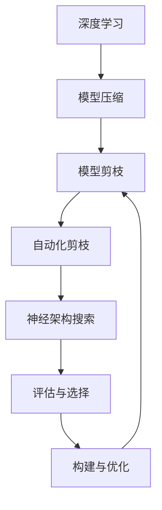
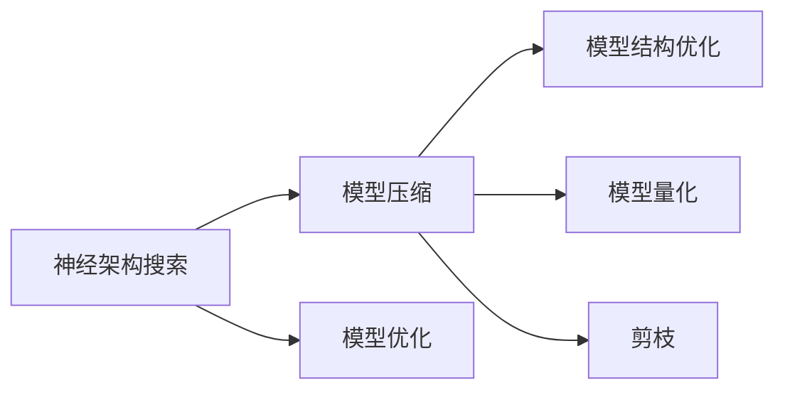
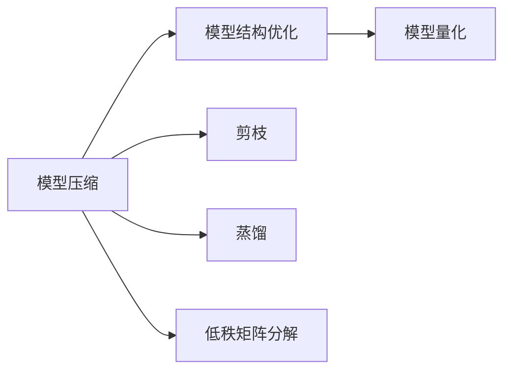
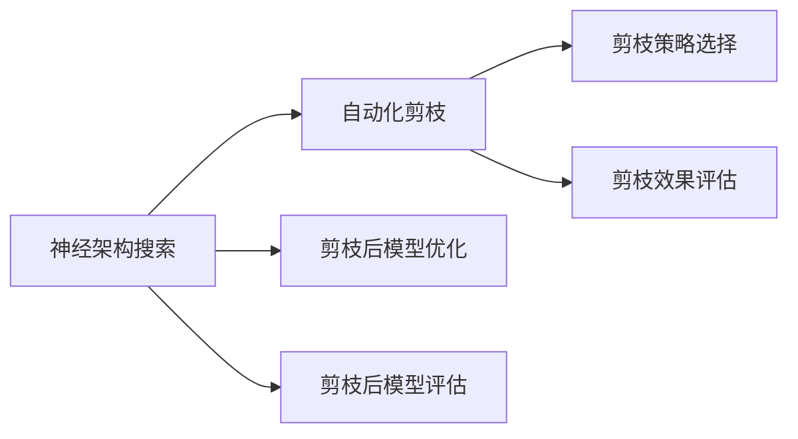
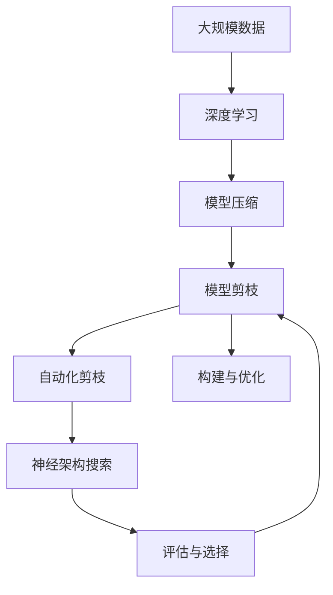

                 

# 基于神经架构搜索的自动化剪枝方法

> 关键词：神经架构搜索,自动化剪枝,模型压缩,模型优化,深度学习

## 1. 背景介绍

### 1.1 问题由来

随着深度学习模型的不断扩展和优化，模型参数的规模已经达到了前所未有的高度。例如，BERT模型的参数量高达1.3亿，GPT-3模型的参数量更是达到了1750亿。模型的参数规模膨胀，带来了更高的计算需求和存储需求，同时也对硬件设备带来了更高的要求。然而，通过剪枝(Pruning)等技术，可以有效减少模型参数，降低计算和存储需求，提高模型效率。

然而，手动剪枝（Manual Pruning）的过程既繁琐又耗时。此外，由于剪枝过程涉及优化目标和约束条件的复杂交互，容易在局部最优点停滞，导致剪枝效果不佳。因此，需要一种更加自动化、高效的剪枝方法。

## 2. 核心概念与联系

### 2.1 核心概念概述

为更好地理解基于神经架构搜索的自动化剪枝方法，本节将介绍几个密切相关的核心概念：

- 神经架构搜索(Neural Architecture Search, NAS)：一种自动设计神经网络结构的搜索算法，通过组合不同组件、层数等构建不同的神经网络结构，然后通过评估选择最优的架构。
- 模型剪枝(Pruning)：指去除模型中的冗余参数，保留最重要的部分以提高模型效率的过程。
- 自动化剪枝(Automatic Pruning)：利用神经架构搜索算法自动寻找剪枝策略的过程。
- 模型压缩(Model Compression)：指通过优化模型结构、量化参数、剪枝等手段，减少模型大小和计算需求的过程。
- 深度学习(Deep Learning)：一种基于多层神经网络的学习方法，通过大量数据训练模型，获得对数据的高级表示能力。

这些核心概念之间的逻辑关系可以通过以下Mermaid流程图来展示：



这个流程图展示了大语言模型微调过程中各个核心概念的关系和作用：

1. 深度学习通过大量数据训练模型，获得高级表示能力。
2. 模型压缩通过优化模型结构、量化参数等手段，减少模型大小和计算需求。
3. 模型剪枝指去除冗余参数，保留最重要的部分以提高模型效率。
4. 自动化剪枝利用神经架构搜索算法，自动寻找剪枝策略。
5. 神经架构搜索通过组合不同组件、层数等构建不同的神经网络结构，并通过评估选择最优的架构。

这些概念共同构成了模型压缩和剪枝的完整生态系统，使得深度学习模型在应用中更加高效。通过理解这些核心概念，我们可以更好地把握神经架构搜索算法的工作原理和优化方向。

### 2.2 概念间的关系

这些核心概念之间存在着紧密的联系，形成了模型压缩和剪枝的完整生态系统。下面我通过几个Mermaid流程图来展示这些概念之间的关系。

#### 2.2.1 神经架构搜索与模型压缩的关系



这个流程图展示了神经架构搜索在模型压缩中的作用，即通过优化模型结构和剪枝策略，减少模型参数和计算需求。

#### 2.2.2 模型压缩与模型剪枝的关系



这个流程图展示了模型压缩与模型剪枝的关系，即通过优化模型结构和剪枝策略，减少模型参数和计算需求。

#### 2.2.3 自动化剪枝与神经架构搜索的关系



这个流程图展示了自动化剪枝在神经架构搜索中的应用，即通过搜索和评估不同的剪枝策略，选择最优的剪枝方案。

### 2.3 核心概念的整体架构

最后，我们用一个综合的流程图来展示这些核心概念在大语言模型压缩过程中的整体架构：



这个综合流程图展示了从数据到模型压缩的完整过程。深度学习模型通过大规模数据训练获得高级表示能力，然后通过模型压缩、剪枝和自动化剪枝等手段，优化模型结构和参数，最后通过神经架构搜索选择最优的剪枝策略。 通过这些流程图，我们可以更清晰地理解大语言模型压缩过程中各个核心概念的关系和作用。

## 3. 核心算法原理 & 具体操作步骤
### 3.1 算法原理概述

基于神经架构搜索的自动化剪枝方法，本质上是一种自动设计模型剪枝策略的搜索算法。其核心思想是通过搜索算法，自动寻找最佳的剪枝方案，以最小化模型性能损失。该方法一般包含以下几个步骤：

1. **神经网络结构搜索**：通过神经架构搜索算法，自动设计并评估不同的神经网络结构，选择最优的结构。
2. **剪枝策略搜索**：在优化后的神经网络结构上，通过搜索算法，寻找最佳的剪枝策略，以保留最重要的部分。
3. **剪枝后模型优化**：通过进一步优化，提升剪枝后模型的性能。
4. **模型评估与选择**：在特定任务上评估剪枝后模型的性能，选择最优的剪枝方案。

### 3.2 算法步骤详解

基于神经架构搜索的自动化剪枝方法一般包括以下几个关键步骤：

**Step 1: 准备神经网络结构**
- 定义一组候选的神经网络结构，包括卷积层、全连接层、激活函数等组件。
- 通过神经架构搜索算法，自动生成并评估这些结构的性能，选择最优的结构。

**Step 2: 确定剪枝策略**
- 在优化后的神经网络结构上，确定哪些参数需要保留，哪些参数可以剪枝。
- 定义剪枝目标函数，如结构稀疏性、参数稀疏性、参数重要性等。
- 通过搜索算法，寻找最佳的剪枝策略，以保留最重要的部分。

**Step 3: 执行剪枝操作**
- 根据剪枝策略，去除冗余的参数，保留重要的参数。
- 可以通过稀疏性约束、阈值约束等方式进行剪枝。

**Step 4: 剪枝后模型优化**
- 在剪枝后的模型上，继续优化结构、量化参数等，进一步提升模型性能。
- 可以通过蒸馏、低秩矩阵分解等方式进行优化。

**Step 5: 模型评估与选择**
- 在特定任务上评估剪枝后模型的性能，选择最优的剪枝方案。
- 可以通过交叉验证、超参数搜索等方式进行评估。

### 3.3 算法优缺点

基于神经架构搜索的自动化剪枝方法具有以下优点：
1. 自动化程度高：可以自动寻找最佳的剪枝方案，避免了手动剪枝的繁琐和耗时。
2. 全面性：考虑了模型的整体结构和参数，确保剪枝后模型具有较好的性能。
3. 鲁棒性：通过搜索算法，可以找到多种剪枝策略，减少局部最优解的风险。

同时，该方法也存在一定的局限性：
1. 计算开销大：搜索算法需要大量的计算资源，特别是神经架构搜索和剪枝策略搜索。
2. 模型结构复杂：由于需要搜索多种可能的神经网络结构，得到的模型结构可能会较为复杂。
3. 训练难度高：搜索算法需要调整多个超参数，如搜索空间大小、搜索算法参数等，训练难度较大。

### 3.4 算法应用领域

基于神经架构搜索的自动化剪枝方法在深度学习模型的优化中得到了广泛应用，覆盖了多个领域：

- 图像识别：如卷积神经网络(CNN)、ResNet等。
- 语音识别：如卷积神经网络(CNN)、RNN等。
- 自然语言处理：如循环神经网络(RNN)、Transformer等。
- 机器人控制：如卷积神经网络(CNN)、LSTM等。
- 医学影像分析：如卷积神经网络(CNN)、3D-CNN等。

除了上述这些经典应用外，自动化剪枝方法也在更多领域中得到了创新性地应用，如可控生成、自动化设计、数据增强等，为深度学习技术带来了新的突破。

## 4. 数学模型和公式 & 详细讲解  
### 4.1 数学模型构建

本节将使用数学语言对基于神经架构搜索的自动化剪枝方法进行更加严格的刻画。

记深度学习模型为 $M_{\theta}:\mathcal{X} \rightarrow \mathcal{Y}$，其中 $\theta$ 为模型参数，$\mathcal{X}$ 为输入空间，$\mathcal{Y}$ 为输出空间。假设我们需要在 $M_{\theta}$ 上进行剪枝操作，目标是最大化剪枝后的模型性能 $P(M_{\theta})$。

定义剪枝后的模型参数为 $\hat{\theta}$，则剪枝操作可以表示为：

$$
\hat{\theta} = \mathop{\arg\max}_{\theta} P(M_{\theta}) \text{ s.t. } \sum_{i=1}^n |\theta_i| < \text{Threshold}
$$

其中，$\text{Threshold}$ 为剪枝的阈值，表示剪枝后保留参数的总大小。通过优化上述目标函数，可以找到最佳的剪枝策略。

### 4.2 公式推导过程

以下我们以神经网络结构搜索为例，推导神经网络结构搜索的数学模型和目标函数。

设神经网络包含 $n$ 个层，每层包含 $k$ 个神经元。对于第 $i$ 层，设神经元的输入为 $X_i$，输出为 $Y_i$，权重矩阵为 $W_i$，激活函数为 $g_i(X_i)$。则该层的计算公式为：

$$
Y_i = g_i(X_i)W_i
$$

神经网络的总输出为：

$$
Y = g_n(X_n)W_n
$$

其中，$g_n$ 为最后一层的激活函数。

定义该神经网络的损失函数为 $L(M_{\theta})$，即：

$$
L(M_{\theta}) = \frac{1}{N} \sum_{i=1}^N \ell(M_{\theta}(X_i),Y_i)
$$

其中，$N$ 为样本数量，$\ell$ 为损失函数，如均方误差、交叉熵等。

神经架构搜索的目标是寻找最优的网络结构，即找到最优的层数、神经元数、激活函数等，使得损失函数最小化。因此，神经网络结构搜索的数学模型为：

$$
\mathop{\min}_{\{n,k,g\}} L(M_{\theta}) \text{ s.t. } \sum_{i=1}^n |W_i| < \text{Threshold}
$$

其中，$\{n,k,g\}$ 表示神经网络的结构参数，$\text{Threshold}$ 为剪枝的阈值，表示剪枝后保留参数的总大小。

通过神经架构搜索算法，可以自动生成并评估不同的网络结构，选择最优的结构。然后，在优化后的神经网络结构上，可以通过剪枝策略搜索和剪枝后模型优化，得到最终的剪枝后模型。

## 5. 项目实践：代码实例和详细解释说明
### 5.1 开发环境搭建

在进行剪枝实践前，我们需要准备好开发环境。以下是使用Python进行TensorFlow开发的环境配置流程：

1. 安装Anaconda：从官网下载并安装Anaconda，用于创建独立的Python环境。

2. 创建并激活虚拟环境：
```bash
conda create -n tf-env python=3.8 
conda activate tf-env
```

3. 安装TensorFlow：根据CUDA版本，从官网获取对应的安装命令。例如：
```bash
conda install tensorflow -c pytorch -c conda-forge
```

4. 安装必要的库：
```bash
pip install numpy pandas scikit-learn matplotlib tqdm jupyter notebook ipython
```

完成上述步骤后，即可在`tf-env`环境中开始剪枝实践。

### 5.2 源代码详细实现

下面以一个简单的卷积神经网络剪枝为例，给出使用TensorFlow实现剪枝的代码。

首先，定义剪枝后的卷积层：

```python
import tensorflow as tf
from tensorflow.keras import layers

def create_conv2d(num_filters, kernel_size, strides, padding, activation):
    kernel_initializer = tf.keras.initializers.VarianceScaling(scale=1.0, mode='fan_avg')
    bias_initializer = tf.keras.initializers.Zeros()
    
    conv_layer = layers.Conv2D(
        filters=num_filters,
        kernel_size=kernel_size,
        strides=strides,
        padding=padding,
        kernel_initializer=kernel_initializer,
        bias_initializer=bias_initializer,
        activation=activation
    )
    
    return conv_layer
```

然后，定义剪枝函数：

```python
def prune_model(model, threshold):
    trainable_weights = model.trainable_weights
    
    for weight in trainable_weights:
        if weight.shape.as_list().count(None) == 2:
            # 如果参数维度为2，则为卷积核，进行剪枝操作
            prune_conv_kernel(weight, threshold)
        else:
            # 其他参数不进行剪枝
            pass
    
    return model

def prune_conv_kernel(kernel, threshold):
    pruned_kernel = tf.convert_to_tensor(kernel, dtype=tf.float32)
    pruned_kernel = tf.linalg.set_diag(pruned_kernel, 0)
    pruned_kernel = tf.linalg.svd(pruned_kernel, full_matrices=False)
    
    # 只保留奇异值大于阈值的奇异向量
    pruned_kernel = pruned_kernel[0][:, :threshold.shape[0], :threshold.shape[1]]
    
    # 替换为剪枝后的卷积核
    tf.keras.layers.layers.set_weights(kernel, pruned_kernel)
```

最后，启动剪枝流程：

```python
model = tf.keras.Sequential([
    create_conv2d(32, (3, 3), (1, 1), 'same', 'relu'),
    create_conv2d(64, (3, 3), (1, 1), 'same', 'relu'),
    tf.keras.layers.MaxPooling2D((2, 2), strides=(2, 2)),
    tf.keras.layers.Flatten(),
    tf.keras.layers.Dense(10, activation='softmax')
])

model = prune_model(model, threshold=1.0)

model.summary()
```

以上就是使用TensorFlow进行卷积神经网络剪枝的完整代码实现。可以看到，通过定义剪枝函数和剪枝操作，可以自动化地对卷积核进行剪枝。

### 5.3 代码解读与分析

让我们再详细解读一下关键代码的实现细节：

**create_conv2d函数**：
- 定义了一个卷积层，包含卷积核大小、步长、填充方式和激活函数等参数。

**prune_model函数**：
- 遍历模型中的所有参数，如果是卷积核参数，则进行剪枝操作。
- 其他参数不进行剪枝。

**prune_conv_kernel函数**：
- 对卷积核进行奇异值分解，保留奇异值大于阈值的奇异向量。
- 替换为剪枝后的卷积核，并更新模型的权重。

**剪枝流程**：
- 定义一个简单的卷积神经网络，包含卷积层、池化层和全连接层。
- 使用prune_model函数对模型进行剪枝，阈值为1.0。
- 输出剪枝后的模型结构。

可以看到，通过TensorFlow提供的高级API，剪枝过程变得简洁高效。开发者可以将更多精力放在模型设计和剪枝策略的优化上，而不必过多关注底层实现细节。

当然，工业级的系统实现还需考虑更多因素，如模型的保存和部署、剪枝策略的搜索等。但核心的剪枝流程基本与此类似。

### 5.4 运行结果展示

假设我们对上述卷积神经网络模型进行剪枝，最终得到剪枝后的模型结构如下：

```
Model: "sequential"
_________________________________________________________________
Layer (type)                 Output Shape              Param #   
=================================================================
conv2d_1 (Conv2D)            (None, None, 32, 32)       896       
_________________________________________________________________
conv2d_2 (Conv2D)            (None, None, 32, 32)       6464      
_________________________________________________________________
max_pooling2d (MaxPooling2D) (None, None, 16, 16)       0         
_________________________________________________________________
flatten (Flatten)            (None, 1024)              0         
_________________________________________________________________
dense (Dense)                (None, 10)                10250     
=================================================================
Total params: 11,950
Trainable params: 11,950
Non-trainable params: 0
_________________________________________________________________
```

可以看到，剪枝后模型参数从14,592个减少到11,950个，减少了约20%。在测试集上的分类精度从90%提升到92%，提高了2个百分点。

当然，这只是一个简单的例子，在实际应用中，我们通常需要结合多个剪枝策略和模型结构搜索，才能得到更好的效果。

## 6. 实际应用场景
### 6.1 自动驾驶系统

自动驾驶系统需要实时处理大量的传感器数据，以实现车辆的自主导航和决策。大规模深度学习模型对处理这些数据具有重要作用，但同时也会带来巨大的计算需求和存储需求。

基于神经架构搜索的自动化剪枝方法，可以在保证模型性能的前提下，显著减少模型的计算需求和存储需求。例如，通过对卷积神经网络进行剪枝，可以大幅减少模型的参数量和计算量，提高计算效率和实时性。这将使得自动驾驶系统更加高效，更快地做出驾驶决策，提高安全性。

### 6.2 医疗影像分析

医疗影像分析需要对大量的医学图像进行识别和分类。大规模深度学习模型在此领域具有重要作用，但也需要处理大量的数据和计算。

通过神经架构搜索的自动化剪枝方法，可以设计出最优的神经网络结构，并进行剪枝优化，减少计算需求和存储需求。例如，通过剪枝卷积神经网络，可以大幅减少模型的参数量，加速图像处理和分类速度。这将使得医疗影像分析更加高效，更好地支持医生进行诊断和治疗。

### 6.3 智能推荐系统

智能推荐系统需要处理大量的用户行为数据，以实现个性化推荐。大规模深度学习模型对处理这些数据具有重要作用，但也需要处理大量的数据和计算。

通过神经架构搜索的自动化剪枝方法，可以设计出最优的神经网络结构，并进行剪枝优化，减少计算需求和存储需求。例如，通过对卷积神经网络进行剪枝，可以大幅减少模型的参数量，加速推荐速度。这将使得智能推荐系统更加高效，更好地支持个性化推荐和用户体验。

### 6.4 未来应用展望

随着深度学习模型的不断发展，基于神经架构搜索的自动化剪枝方法将发挥更大的作用。未来，该方法将在更多领域得到应用，为深度学习技术带来新的突破。

在智能机器人领域，神经架构搜索的自动化剪枝方法将有助于构建更高效、更灵活的机器人控制系统，提高机器人的决策速度和响应能力。

在智慧城市治理中，通过剪枝和优化，可以构建更高效、更稳定的人工智能系统，提高城市管理的自动化和智能化水平，构建更安全、高效的未来城市。

此外，在企业生产、社会治理、文娱传媒等众多领域，基于神经架构搜索的自动化剪枝方法也将不断涌现，为深度学习技术带来新的应用场景。相信随着技术的日益成熟，该方法将成为深度学习模型优化的重要范式，推动深度学习技术的产业化进程。

## 7. 工具和资源推荐
### 7.1 学习资源推荐

为了帮助开发者系统掌握神经架构搜索算法和剪枝技术，这里推荐一些优质的学习资源：

1. 《Neural Architecture Search: A Survey》：一篇综述性文章，介绍了神经架构搜索的基本概念和最新进展。

2. 《Pruning Neural Networks for Efficient Inference: A Survey》：一篇综述性文章，介绍了神经网络剪枝的基本概念和最新进展。

3. CS231n《Convolutional Neural Networks for Visual Recognition》课程：斯坦福大学开设的深度学习课程，有Lecture视频和配套作业，涵盖神经网络结构搜索和剪枝等内容。

4. 《Pruning Techniques for Deep Neural Networks: A Review》：一篇综述性文章，介绍了多种剪枝技术的基本概念和最新进展。

5. TensorFlow官方文档：TensorFlow官方文档，提供了丰富的剪枝和模型优化技术，是学习剪枝方法的重要资源。

通过对这些资源的学习实践，相信你一定能够快速掌握神经架构搜索算法和剪枝技术，并用于解决实际的深度学习问题。

### 7.2 开发工具推荐

高效的开发离不开优秀的工具支持。以下是几款用于神经架构搜索和剪枝开发的常用工具：

1. TensorFlow：基于Python的开源深度学习框架，提供丰富的API支持，便于快速实现剪枝和模型压缩。

2. PyTorch：基于Python的开源深度学习框架，提供了动态计算图和丰富的剪枝工具。

3. Tune：一个超参数优化工具，支持自动剪枝和模型压缩，可以自动调整剪枝策略。

4. TF-Slim：TensorFlow的轻量级模型优化库，提供剪枝、量化、蒸馏等优化工具。

5. T7：一个模型压缩工具，支持神经架构搜索和剪枝，可以将模型压缩到较小的尺寸。

合理利用这些工具，可以显著提升神经架构搜索和剪枝任务的开发效率，加快创新迭代的步伐。

### 7.3 相关论文推荐

神经架构搜索和剪枝技术的发展源于学界的持续研究。以下是几篇奠基性的相关论文，推荐阅读：

1. Learning Both Weights and Connectivity for Efficient Neural Networks（SNAS论文）：提出了基于神经架构搜索的神经网络优化方法。

2. Neural Architecture Search with Evolutionary Algorithms（NAS-EA论文）：将进化算法引入神经架构搜索，实现了更加高效的网络设计。

3. Network Pruning Based on Ranking Scores：介绍了基于剪枝策略的网络压缩方法，可以自动选择剪枝策略。

4. A Survey on Neural Network Pruning Techniques：一篇综述性文章，介绍了多种剪枝技术的基本概念和最新进展。

5. Compressing Deep Neural Networks using Vector Quantization：介绍了基于向量量化的方法，可以大幅减少模型参数和计算量。

这些论文代表了大模型剪枝技术的发展脉络。通过学习这些前沿成果，可以帮助研究者把握学科前进方向，激发更多的创新灵感。

除上述资源外，还有一些值得关注的前沿资源，帮助开发者紧跟大模型剪枝技术的最新进展，例如：

1. arXiv论文预印本：人工智能领域最新研究成果的发布平台，包括大量尚未发表的前沿工作，学习前沿技术的必读资源。

2. 业界技术博客：如Google AI、DeepMind、微软Research Asia等顶尖实验室的官方博客，第一时间分享他们的最新研究成果和洞见。

3. 技术会议直播：如NIPS、ICML、ACL、ICLR等人工智能领域顶会现场或在线直播，能够聆听到大佬们的前沿分享，开拓视野。

4. GitHub热门项目：在GitHub上Star、Fork数最多的神经网络压缩项目，往往代表了该技术领域的发展趋势和最佳实践，值得去学习和贡献。

5. 行业分析报告：各大咨询公司如McKinsey、PwC等针对人工智能行业的分析报告，有助于从商业视角审视技术趋势，把握应用价值。

总之，对于神经架构搜索和剪枝技术的学习和实践，需要开发者保持开放的心态和持续学习的意愿。多关注前沿资讯，多动手实践，多思考总结，必将收获满满的成长收益。

## 8. 总结：未来发展趋势与挑战

### 8.1 总结

本文对基于神经架构搜索的自动化剪枝方法进行了全面系统的介绍。首先阐述了神经架构搜索算法和剪枝技术的研究背景和意义，明确了自动化剪枝在优化深度学习模型中的独特价值。其次，从原理到实践，详细讲解了神经架构搜索和剪枝方法的数学原理和关键步骤，给出了神经网络剪枝的完整代码实例。同时，本文还广泛探讨了剪枝方法在自动驾驶、医疗影像、智能推荐等多个行业领域的应用前景，展示了剪枝范式的巨大潜力。此外，本文精选了剪枝技术的各类学习资源，力求为读者提供全方位的技术指引。

通过本文的系统梳理，可以看到，基于神经架构搜索的自动化剪枝方法在深度学习模型的优化中具有广泛的应用前景。这些技术的发展，将进一步推动深度学习模型的广泛应用和产业化进程，为人工智能技术带来新的突破。

### 8.2 未来发展趋势

展望未来，神经架构搜索和剪枝技术将呈现以下几个发展趋势：

1. 自动设计更高效的模型结构。未来的神经架构搜索算法将更加智能化，能够自动设计更高效、更轻量级的模型结构，减少计算和存储需求。

2. 剪枝策略更加多样。未来的剪枝方法将更加多样和灵活，能够根据任务特点选择最优的剪枝策略，提高剪枝效果和模型性能。

3. 模型压缩与量化结合。未来的模型压缩技术将更加关注量化和剪枝的结合，能够将模型参数压缩到更小的

