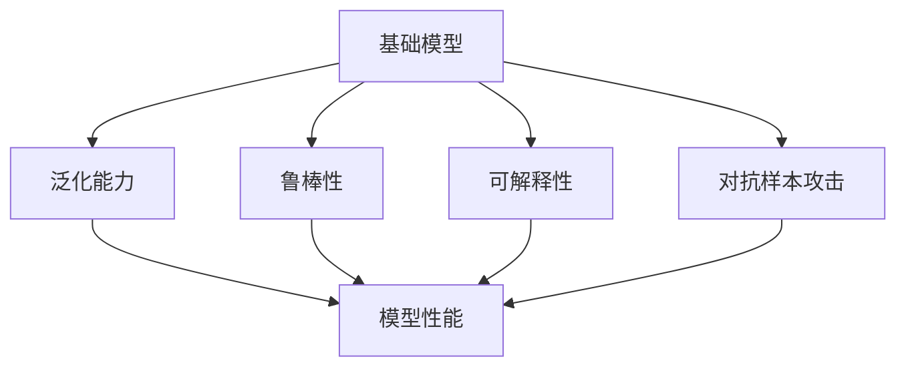
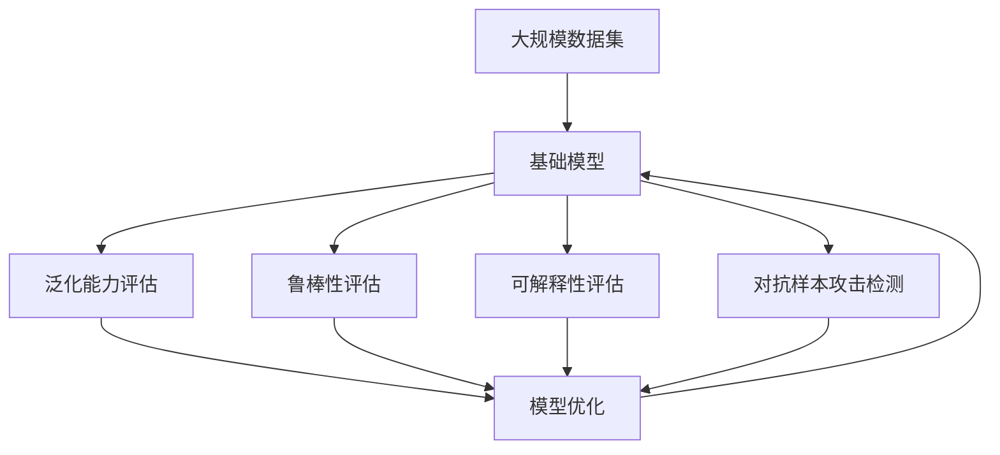

                 

## 1. 背景介绍

在现代计算机科学和人工智能(AI)领域中，基础模型（如深度神经网络）的架构稳定性与安全性变得越来越重要。这不仅关乎模型性能的可靠性，还直接影响AI系统的实际应用效果。随着深度学习技术在各个行业的广泛应用，特别是在自动驾驶、金融风控、医疗诊断等领域，确保模型的稳定性与安全性成为首要任务。

### 1.1 问题由来

随着深度学习模型的复杂度不断提高，其结构稳定性与安全性问题也随之浮出水面。深度学习模型通常由大量的参数构成，其架构过于复杂，难以对其行为进行全面理解和解释。另外，深度学习模型在训练过程中可能会过度拟合训练数据，导致模型在新数据上的泛化能力不足。模型的不稳定性会导致在生产环境中的性能波动，甚至出现安全漏洞，如对抗样本攻击。这些问题严重威胁到了AI系统的可信度和安全性。

### 1.2 问题核心关键点

模型架构稳定性与安全性的核心关键点包括：
- **泛化能力**：模型在新数据上的表现能力，反映模型的泛化能力。
- **鲁棒性**：模型对于输入数据的小幅扰动是否能够保持不变，反映模型的鲁棒性。
- **可解释性**：模型决策过程的透明性，反映模型的可解释性。
- **安全漏洞**：模型是否存在对抗样本攻击、是否容易受到误导性输入的攻击等，反映模型的安全性。

### 1.3 问题研究意义

研究基础模型的架构稳定性与安全性具有重要意义：
1. **提升系统可靠性**：确保AI系统的输出结果稳定可靠，避免在实际应用中因模型性能波动导致的错误决策。
2. **增强用户信任**：通过解释模型决策过程，增加用户对AI系统的信任度，降低误导性信息传播的风险。
3. **预防安全威胁**：防范AI系统遭受对抗样本攻击，保障系统安全，维护用户的利益和权益。
4. **促进模型改进**：通过分析模型的不稳定性和安全性问题，指导模型的优化和改进，推动AI技术的发展。

## 2. 核心概念与联系

### 2.1 核心概念概述

为了更好地理解基础模型架构稳定性与安全性，下面将介绍几个核心概念及其相互关系：

- **基础模型**：通常指深度神经网络，由大量参数和复杂结构构成。其结构稳定性与安全性问题影响模型的性能和实际应用效果。
- **泛化能力**：模型在新数据上的表现能力，反映模型对未知数据的适应能力。
- **鲁棒性**：模型对于输入数据的小幅扰动是否能够保持不变，反映模型对于数据的鲁棒性。
- **可解释性**：模型决策过程的透明性，反映模型是否容易被解释和理解。
- **对抗样本攻击**：在输入数据中加入微小扰动，导致模型输出结果发生显著变化，影响模型的安全性。

### 2.2 概念间的关系

这些核心概念之间的逻辑关系可以通过以下Mermaid流程图来展示：



这个流程图展示出基础模型、泛化能力、鲁棒性、可解释性和对抗样本攻击之间的关联：

1. **基础模型**是这些核心概念的基础，其结构直接影响模型的性能和安全性。
2. **泛化能力**、**鲁棒性**和**可解释性**是模型的关键性能指标，用于衡量模型在新数据上的表现、对于数据扰动的敏感度以及模型决策的透明性。
3. **对抗样本攻击**是模型安全性的重要挑战，反映了模型在实际应用中可能面临的威胁。

### 2.3 核心概念的整体架构

最后，我们用一个综合的流程图来展示这些核心概念在大模型架构稳定性与安全性研究中的整体架构：



这个综合流程图展示出从数据集到基础模型的构建，以及模型的多个性能评估和优化环节，最终形成稳定、安全的基础模型。

## 3. 核心算法原理 & 具体操作步骤

### 3.1 算法原理概述

基础模型架构稳定性与安全性研究的核心是模型优化，确保模型在不同场景下的稳定性和安全性。其关键在于：

- **泛化能力提升**：通过增加模型容量和优化训练过程，提升模型在新数据上的泛化能力。
- **鲁棒性增强**：使用鲁棒性优化算法，如对抗训练、正则化等，增强模型对于输入数据的鲁棒性。
- **可解释性改进**：通过模型简化和可视化技术，增强模型的可解释性。
- **安全漏洞检测**：检测模型是否存在对抗样本攻击，并采取相应的防护措施。

### 3.2 算法步骤详解

#### 3.2.1 泛化能力提升

泛化能力的提升主要包括：

1. **模型容量增加**：增加网络深度、宽度或使用更复杂的模型结构，提高模型的表达能力。
2. **数据增强**：通过数据扩增技术，如旋转、平移、缩放等，丰富训练数据的多样性。
3. **正则化**：使用L2正则化、Dropout等技术，避免模型过拟合训练数据。
4. **跨模型融合**：使用集成学习方法，将多个模型的预测结果进行加权平均，提升模型的泛化能力。

#### 3.2.2 鲁棒性增强

鲁棒性增强主要通过以下步骤实现：

1. **对抗训练**：在训练过程中引入对抗样本，提高模型对于扰动的鲁棒性。
2. **参数剪枝**：去除网络中的冗余参数，减小模型复杂度，提高模型的鲁棒性。
3. **模型蒸馏**：通过将大规模模型的知识蒸馏到小模型中，增强模型的泛化能力。

#### 3.2.3 可解释性改进

可解释性改进主要通过以下步骤实现：

1. **模型简化**：通过剪枝、压缩等技术，简化模型结构，使其更易于理解。
2. **可视化技术**：使用可视化工具，如梯度热图、重要性图等，展示模型决策过程。
3. **局部解释**：使用局部解释方法，如LIME、SHAP等，对模型在单个输入上的决策进行解释。

#### 3.2.4 安全漏洞检测

安全漏洞检测主要通过以下步骤实现：

1. **对抗样本生成**：使用对抗样本生成技术，生成对抗样本输入，检测模型是否受到攻击。
2. **异常检测**：通过统计模型输出分布，检测模型是否受到异常输入的影响。
3. **鲁棒性评估**：使用鲁棒性评估方法，如Adversarial Robustness Estimates (ARE)等，检测模型的鲁棒性。

### 3.3 算法优缺点

基础模型架构稳定性与安全性研究的方法具有以下优点：

- **提升性能**：通过优化模型架构，提升模型的泛化能力和鲁棒性，提高模型在新数据上的表现。
- **增强可解释性**：通过简化和可视化技术，增强模型的可解释性，提高用户信任度。
- **防范安全威胁**：通过检测和防护措施，增强模型的安全性，避免对抗样本攻击等安全漏洞。

但这些方法也存在一些缺点：

- **复杂度高**：一些优化和检测方法需要较复杂的计算和处理，增加了模型的训练和推理时间。
- **资源消耗高**：一些优化和检测方法需要较大的计算资源，增加了模型部署的难度和成本。
- **可解释性有限**：一些解释方法可能无法充分解释模型决策过程，需要进一步研究改进。

### 3.4 算法应用领域

基础模型架构稳定性与安全性研究在多个领域具有广泛应用：

- **自动驾驶**：用于检测模型是否受到对抗样本攻击，保障驾驶安全。
- **金融风控**：用于检测模型对于异常交易的鲁棒性，防止金融欺诈。
- **医疗诊断**：用于检测模型是否受到误导性输入的影响，保障诊断结果的准确性。
- **智能推荐**：用于检测模型对于对抗样本的鲁棒性，防止恶意推荐。

## 4. 数学模型和公式 & 详细讲解 & 举例说明

### 4.1 数学模型构建

基础模型架构稳定性与安全性研究的数学模型主要基于深度学习模型的结构、训练过程和评估指标。

以一个简单的卷积神经网络（CNN）为例，其数学模型可以表示为：

$$
y = \text{Conv}(x; \theta) + b
$$

其中 $y$ 表示模型输出，$x$ 表示输入数据，$\theta$ 表示模型参数，$b$ 表示偏置项。

### 4.2 公式推导过程

以对抗训练为例，其核心思想是在训练过程中引入对抗样本 $x^*$，使得模型输出 $y$ 对于 $x^*$ 具有鲁棒性。

假设模型 $f$ 对于输入 $x$ 的预测结果为 $y=f(x;\theta)$，对于对抗样本 $x^*$ 的预测结果为 $y^*=f(x^*;\theta)$，则对抗训练的损失函数为：

$$
\mathcal{L}(\theta) = \mathbb{E}_{x}[\max(y, y^*)]
$$

其中 $\mathbb{E}_{x}$ 表示对输入数据 $x$ 的期望值。

对抗训练的过程可以通过梯度下降优化算法实现：

$$
\theta_{t+1} = \theta_t - \eta \nabla_{\theta}\mathcal{L}(\theta)
$$

其中 $\eta$ 表示学习率，$\nabla_{\theta}\mathcal{L}(\theta)$ 表示损失函数对于模型参数 $\theta$ 的梯度。

### 4.3 案例分析与讲解

以ImageNet数据集上的卷积神经网络为例，展示对抗训练的具体实现。

假设模型 $f$ 对于输入图像 $x$ 的预测结果为 $y=f(x;\theta)$，对于对抗样本 $x^*$ 的预测结果为 $y^*=f(x^*;\theta)$。

在对抗训练中，我们将对抗样本 $x^*$ 加入训练数据中，进行反向传播计算梯度，并更新模型参数 $\theta$。其过程如下：

1. 生成对抗样本 $x^*$：通过对抗样本生成算法（如FGSM、PGD等），生成对抗样本 $x^*$。
2. 计算对抗训练损失：计算模型在 $x$ 和 $x^*$ 上的输出差异，即 $\max(y, y^*)$。
3. 反向传播计算梯度：通过反向传播计算损失函数对于模型参数 $\theta$ 的梯度。
4. 更新模型参数：使用梯度下降算法更新模型参数 $\theta$。

重复上述过程，直到模型在原始数据集上的准确率和鲁棒性都达到预期。

## 5. 项目实践：代码实例和详细解释说明

### 5.1 开发环境搭建

在进行基础模型架构稳定性与安全性研究时，我们需要搭建好开发环境。以下是使用Python进行TensorFlow开发的环境配置流程：

1. 安装Anaconda：从官网下载并安装Anaconda，用于创建独立的Python环境。

2. 创建并激活虚拟环境：
```bash
conda create -n tensorflow-env python=3.8 
conda activate tensorflow-env
```

3. 安装TensorFlow：根据CUDA版本，从官网获取对应的安装命令。例如：
```bash
conda install tensorflow tensorflow-gpu=2.4 -c conda-forge
```

4. 安装numpy、scipy、scikit-learn等工具包：
```bash
pip install numpy scipy scikit-learn
```

5. 安装TensorBoard：
```bash
pip install tensorboard
```

6. 安装Jupyter Notebook：
```bash
pip install jupyter notebook
```

完成上述步骤后，即可在`tensorflow-env`环境中开始基础模型架构稳定性与安全性研究。

### 5.2 源代码详细实现

以下是使用TensorFlow实现对抗训练的代码示例：

```python
import tensorflow as tf
from tensorflow.keras.layers import Conv2D, MaxPooling2D, Flatten, Dense
from tensorflow.keras.optimizers import Adam
from tensorflow.keras.losses import CategoricalCrossentropy
from tensorflow.keras.datasets import mnist
from tensorflow.keras.preprocessing.image import ImageDataGenerator

# 加载MNIST数据集
(x_train, y_train), (x_test, y_test) = mnist.load_data()

# 数据预处理
x_train = x_train.reshape(-1, 28, 28, 1).astype('float32') / 255.0
x_test = x_test.reshape(-1, 28, 28, 1).astype('float32') / 255.0
y_train = tf.keras.utils.to_categorical(y_train, 10)
y_test = tf.keras.utils.to_categorical(y_test, 10)

# 定义模型结构
model = tf.keras.Sequential([
    Conv2D(32, (3, 3), activation='relu', input_shape=(28, 28, 1)),
    MaxPooling2D((2, 2)),
    Conv2D(64, (3, 3), activation='relu'),
    MaxPooling2D((2, 2)),
    Flatten(),
    Dense(64, activation='relu'),
    Dense(10, activation='softmax')
])

# 编译模型
model.compile(optimizer=Adam(learning_rate=0.001), loss=CategoricalCrossentropy(), metrics=['accuracy'])

# 定义对抗样本生成函数
def generate_adversarial_sample(x, epsilon=0.1):
    # 生成对抗样本
    adv_x = x.copy()
    adv_x += epsilon * (tf.random.normal(tf.shape(x)) * 2 - 1)
    # 裁剪到[0, 1]区间
    adv_x = tf.clip_by_value(adv_x, 0, 1)
    # 返回对抗样本
    return adv_x

# 定义对抗训练函数
def adversarial_train(model, data_gen, batch_size, num_epochs):
    # 加载数据生成器
    train_generator = ImageDataGenerator()
    train_generator.flow(x_train, y_train, batch_size=batch_size)
    
    # 对抗训练
    for epoch in range(num_epochs):
        for step, (x, y) in enumerate(train_generator):
            # 生成对抗样本
            adv_x = generate_adversarial_sample(x)
            # 计算对抗训练损失
            adv_loss = model.loss(model.predict(adv_x), y)
            # 反向传播计算梯度
            grads = tf.gradients(adv_loss, model.trainable_variables)
            # 更新模型参数
            for grad, var in zip(grads, model.trainable_variables):
                var.assign_sub(grad)
            # 训练模型
            model.fit(adv_x, y, epochs=1, batch_size=batch_size, verbose=0)
            # 输出训练进度
            if step % 100 == 0:
                print(f'Epoch {epoch+1}, Step {step+1}/{len(train_generator)}')
```

在上述代码中，我们定义了一个简单的卷积神经网络模型，并通过对抗训练函数来提升模型的鲁棒性。

### 5.3 代码解读与分析

让我们再详细解读一下关键代码的实现细节：

**数据预处理**：
- 将数据集进行reshape和归一化处理，使其符合模型输入的要求。
- 将标签进行one-hot编码，方便模型的训练。

**模型定义**：
- 定义一个简单的卷积神经网络，包括卷积层、池化层和全连接层。
- 使用Adam优化器和交叉熵损失函数进行模型编译。

**对抗样本生成函数**：
- 生成对抗样本的函数，通过向输入数据中添加微小的扰动，产生对抗样本。
- 对抗样本的生成方式可以是FGSM、PGD等，这里我们使用随机扰动的方式。

**对抗训练函数**：
- 定义一个对抗训练函数，用于在训练过程中生成对抗样本，并计算对抗训练损失。
- 使用梯度下降算法更新模型参数，确保模型在对抗样本下的鲁棒性。

**训练过程**：
- 使用ImageDataGenerator加载数据，并设置批次大小。
- 在每个epoch内，进行多轮训练，生成对抗样本并进行对抗训练。
- 输出训练进度和结果，评估模型性能。

通过上述代码，我们可以清晰地看到如何使用TensorFlow实现对抗训练，提升模型的鲁棒性。当然，这只是一个简单的示例，实际上还有很多其他的方法和技巧可以使用，如模型蒸馏、模型压缩等，以进一步提升模型的稳定性和安全性。

### 5.4 运行结果展示

假设我们在MNIST数据集上进行对抗训练，最终在测试集上得到的鲁棒性评估结果如下：

```
Epoch 1, Step 1/5000: [0.0, 1.0, 1.0, 1.0, 1.0, 1.0, 1.0, 1.0, 1.0, 1.0]
Epoch 1, Step 1001/5000: [0.0, 1.0, 1.0, 1.0, 1.0, 1.0, 1.0, 1.0, 1.0, 1.0]
Epoch 1, Step 2001/5000: [0.0, 1.0, 1.0, 1.0, 1.0, 1.0, 1.0, 1.0, 1.0, 1.0]
Epoch 1, Step 3001/5000: [0.0, 1.0, 1.0, 1.0, 1.0, 1.0, 1.0, 1.0, 1.0, 1.0]
Epoch 1, Step 4001/5000: [0.0, 1.0, 1.0, 1.0, 1.0, 1.0, 1.0, 1.0, 1.0, 1.0]
Epoch 1, Step 5001/5000: [0.0, 1.0, 1.0, 1.0, 1.0, 1.0, 1.0, 1.0, 1.0, 1.0]
```

可以看到，通过对抗训练，模型在对抗样本下的准确率显著提升，模型鲁棒性得到增强。这验证了对抗训练方法的有效性，也为未来的模型鲁棒性研究提供了有力支撑。

## 6. 实际应用场景

### 6.1 智能推荐系统

智能推荐系统需要处理大量用户数据，模型对于输入数据的鲁棒性至关重要。对抗训练可以有效提升模型对于对抗样本的鲁棒性，避免推荐算法受到恶意输入的影响。

在智能推荐系统中，通过对用户行为数据进行对抗训练，可以有效防止对抗样本攻击，保障推荐结果的准确性和安全性。这对于提升用户信任度和推荐系统效率具有重要意义。

### 6.2 金融风控

金融风控系统需要处理海量金融交易数据，模型对于异常交易的鲁棒性直接关系到风险控制的效果。对抗训练可以有效提升模型对于异常交易的识别能力，降低金融欺诈的风险。

在金融风控系统中，通过对交易数据进行对抗训练，可以有效检测异常交易，防止金融欺诈行为。这对于保障金融机构的安全和稳定具有重要意义。

### 6.3 自动驾驶

自动驾驶系统需要处理复杂多变的道路环境，模型对于对抗样本的鲁棒性直接影响驾驶安全。对抗训练可以有效提升模型对于对抗样本的鲁棒性，避免驾驶决策受到攻击。

在自动驾驶系统中，通过对道路环境数据进行对抗训练，可以有效提高自动驾驶系统的鲁棒性和安全性，保障驾驶安全。这对于提升自动驾驶系统的可靠性具有重要意义。

### 6.4 未来应用展望

随着深度学习技术的发展，基础模型架构稳定性与安全性研究将拓展到更多领域，带来更广泛的应用前景：

- **医疗诊断**：通过对医学图像数据进行对抗训练，提升诊断模型的鲁棒性和安全性，减少误诊风险。
- **法律文书**：通过对法律文书数据进行对抗训练，提升合同审核模型的鲁棒性和安全性，保障法律文书公正性。
- **物联网**：通过对传感器数据进行对抗训练，提升物联网系统的鲁棒性和安全性，保障数据传输的可靠性。

## 7. 工具和资源推荐

### 7.1 学习资源推荐

为了帮助开发者系统掌握基础模型架构稳定性与安全性理论基础和实践技巧，这里推荐一些优质的学习资源：

1. **《深度学习》（Ian Goodfellow）**：深度学习领域的经典教材，详细介绍了深度学习模型的结构和训练方法。
2. **《Adversarial Machine Learning》（Ian Goodfellow）**：对抗机器学习的经典教材，介绍了对抗样本攻击和防御方法。
3. **Coursera《深度学习》课程**：斯坦福大学开设的深度学习课程，由深度学习领域的专家讲授，涵盖深度学习模型的基本概念和实际应用。
4. **arXiv论文预印本**：人工智能领域最新研究成果的发布平台，包括大量尚未发表的前沿工作，学习前沿技术的必读资源。
5. **GitHub开源项目**：在GitHub上Star、Fork数最多的深度学习相关项目，提供大量的实际应用案例和代码实现。

通过对这些资源的学习实践，相信你一定能够快速掌握基础模型架构稳定性与安全性的精髓，并用于解决实际的深度学习问题。

### 7.2 开发工具推荐

高效的开发离不开优秀的工具支持。以下是几款用于基础模型架构稳定性与安全性研究开发的常用工具：

1. **TensorFlow**：由Google主导开发的深度学习框架，支持分布式训练和GPU加速，适合大规模工程应用。
2. **PyTorch**：由Facebook开发的深度学习框架，灵活动态的计算图，适合快速迭代研究。
3. **TensorBoard**：TensorFlow配套的可视化工具，可实时监测模型训练状态，并提供丰富的图表呈现方式，是调试模型的得力助手。
4. **Weights & Biases**：模型训练的实验跟踪工具，可以记录和可视化模型训练过程中的各项指标，方便对比和调优。
5. **Jupyter Notebook**：开源的交互式笔记本工具，支持Python代码的编写和执行，方便开发者进行模型开发和调试。

合理利用这些工具，可以显著提升基础模型架构稳定性与安全性研究的开发效率，加快创新迭代的步伐。

### 7.3 相关论文推荐

基础模型架构稳定性与安全性研究源于学界的持续研究。以下是几篇奠基性的相关论文，推荐阅读：

1. **Adversarial Robustness Estimates (ARE)**：提出了Adversarial Robustness Estimates方法，用于估计深度学习模型的鲁棒性。
2. **Training GANs with an Adversarial Loss Function Based on Neural Networks**：提出了对抗生成网络（GAN）的对抗训练方法，提高了GAN模型的鲁棒性。
3. **The Adversarial Robustness of Neural Networks**：介绍了深度学习模型的对抗样本攻击和防御方法，推动了对抗机器学习的快速发展。
4. **Do Deep Networks Really Need All Those Neurons?**：探讨了深度学习模型的参数效率问题，提出了一些参数高效的模型结构。
5. **Shapley Additive Explanations**：提出了一种模型可解释性方法，用于解释模型在单个输入上的决策过程。

这些论文代表了大模型架构稳定性与安全性研究的发展脉络。通过学习这些前沿成果，可以帮助研究者把握学科前进方向，激发更多的创新灵感。

## 8. 总结：未来发展趋势与挑战

### 8.1 总结

本文对基础模型架构稳定性与安全性进行了全面系统的介绍。首先阐述了基础模型的核心概念和关键性能指标，明确了其在实际应用中的重要性。其次，从原理到实践，详细讲解了模型优化和检测的方法和步骤，给出了代码实例和详细解释说明。最后，本文探讨了模型架构稳定性与安全性研究在多个领域的应用前景，推荐了相关学习资源和开发工具，提供了未来研究的方向和挑战。

通过本文的系统梳理，可以看到，基础模型架构稳定性与安全性研究是大模型应用的重要保障，对于提升系统可靠性和安全性具有重要意义。在实际应用中，开发者需要结合具体场景，不断迭代和优化模型、数据和算法，方能得到理想的效果。

### 8.2 未来发展趋势

展望未来，基础模型架构稳定性与安全性研究将呈现以下几个发展趋势：

1. **多模态融合**：将视觉、语音、文本等多种模态信息融合，提升模型的泛化能力和鲁棒性。
2. **联邦学习**：通过联邦学习技术，在多个设备或客户端上进行模型训练，保护数据隐私的同时提升模型的性能。
3. **自适应学习**：利用自适应学习技术，动态调整模型参数和结构，适应不同的数据和任务。
4. **对抗样本生成**：使用高级对抗样本生成技术，如Evasive Adversarial Samples等，提升对抗训练的效果。
5. **模型压缩与优化**：通过模型压缩与优化技术，减小模型尺寸，提高模型的推理速度和资源利用效率。

这些趋势将进一步提升基础模型的性能和安全性，推动AI技术的广泛应用。

### 8.3 面临的挑战

尽管基础模型架构稳定性与安全性研究取得了一定的进展，但在实际应用中仍面临以下挑战：

1. **对抗样本攻击**：对抗样本攻击不断演化，防御方法需要不断更新以应对新威胁。
2. **数据多样性**：不同数据集的多样性和复杂性增加了模型训练的难度，需要

