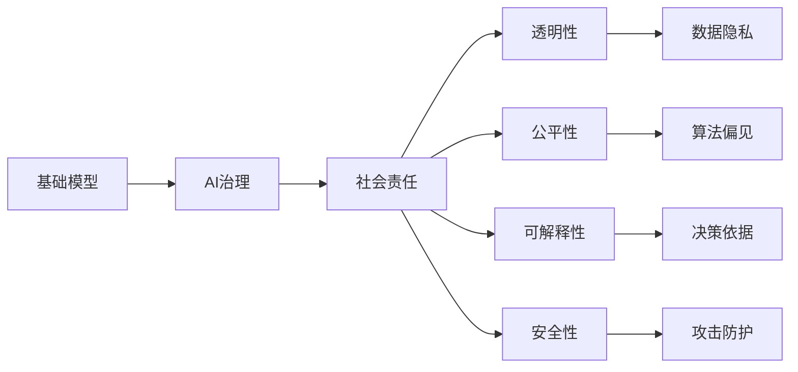

                 

# 基础模型的社会责任与治理

在人工智能（AI）领域，尤其是基础模型（如深度学习模型）的广泛应用，带来了前所未有的技术进步和创新。这些模型在各种任务上展现出了超乎想象的能力，从自然语言处理、图像识别到自动驾驶、医疗诊断等领域，几乎无所不能。然而，这种技术力量同时伴随着一系列复杂而深远的社会影响和责任问题。本文将围绕基础模型的社会责任与治理展开讨论，旨在揭示当前存在的问题和挑战，并为未来的发展提供策略和方向。

## 1. 背景介绍

### 1.1 基础模型与AI治理的崛起

基础模型，尤其是深度学习模型，因其强大的学习和表示能力，成为了AI时代的技术基石。从最初的神经网络到后来的卷积神经网络（CNN）、循环神经网络（RNN）、生成对抗网络（GAN），再到近年来的Transformer架构，模型结构和算法不断进化，推动了AI技术在各个领域的突破。

AI治理，则是指对AI技术及其应用进行规范、监督和指导的一系列活动。随着AI技术的普及，关于AI伦理、透明性、公平性、安全性等问题不断浮出水面，引起了全球范围内的广泛关注和讨论。基础模型作为AI技术的核心组成部分，其社会责任与治理问题也因此成为了研究者和从业者必须面对的课题。

### 1.2 社会影响与挑战

基础模型的应用不仅提升了生产效率，改善了人类生活质量，也引发了一系列复杂的社会问题：数据隐私、算法偏见、决策透明度、模型可解释性、安全风险等。这些问题不仅影响着技术的推广应用，还关系到公众信任、法律合规和社会稳定。因此，如何平衡技术进步与社会责任，实现AI技术的健康发展，成为了一个亟待解决的全球性议题。

## 2. 核心概念与联系

### 2.1 核心概念概述

在进行深入探讨之前，首先需要明确几个核心概念及其相互联系：

- **基础模型（Base Models）**：如神经网络、Transformer、BERT等，是用于执行特定任务的预训练模型。
- **AI治理（AI Governance）**：涵盖数据管理、算法透明度、责任归属、伦理考量等方方面面，旨在确保AI技术的应用符合社会伦理和法律规范。
- **社会责任（Social Responsibility）**：基础模型在应用过程中所应承担的义务和责任，包括但不限于数据隐私保护、算法偏见避免、决策透明等。
- **透明性（Transparency）**：指模型决策过程的清晰度和可解释性，帮助用户理解和信任模型的输出。
- **公平性（Fairness）**：模型应避免对特定群体或个体产生不公平的歧视性影响。
- **可解释性（Explainability）**：模型应具备易于理解的特性，使用户能够理解其决策依据。
- **安全性（Security）**：模型应具备防止恶意攻击和数据泄露的能力。

这些概念之间存在着紧密的联系，共同构成了基础模型治理的社会责任框架。

### 2.2 核心概念的关系图



这个关系图展示了基础模型、AI治理和社会责任之间的逻辑联系。基础模型通过AI治理，履行社会责任，保障透明性、公平性、可解释性和安全性，从而实现对数据隐私和算法偏见的有效控制。

## 3. 核心算法原理 & 具体操作步骤

### 3.1 算法原理概述

基础模型的社会责任与治理问题，通常通过算法设计和模型训练的各个环节进行体现和解决。

- **数据选择**：选择合适的数据集，避免偏见和歧视性数据。
- **模型训练**：通过正则化、对抗训练、公平约束等方法，确保模型在训练过程中不引入或放大偏见。
- **模型部署**：在模型部署过程中，进行实时监控和审计，确保模型输出符合伦理和法律要求。
- **模型更新**：定期更新模型，解决新出现的偏见和问题，提升模型性能。

这些环节共同作用，构建了基础模型的社会责任治理体系。

### 3.2 算法步骤详解

具体来说，基础模型的社会责任与治理步骤可以分解为以下五个关键步骤：

1. **数据收集与预处理**：
   - 收集多样化、代表性强的数据集，确保数据的质量和多样性。
   - 对数据进行清洗和预处理，去除敏感信息，避免数据泄露。

2. **模型设计与训练**：
   - 选择适当的模型架构，如Transformer、BERT等，确保其具有较好的泛化能力和透明性。
   - 在模型训练过程中，引入正则化、对抗训练等技术，防止过拟合和偏见。
   - 使用公平性约束，如均衡类平衡、去偏矫正等方法，避免模型偏见。

3. **模型部署与监控**：
   - 将模型部署到生产环境中，实时监控模型输出，确保符合伦理和法律要求。
   - 定期审计模型性能，发现和纠正潜在问题。

4. **用户反馈与迭代**：
   - 收集用户反馈，了解模型的应用效果和社会影响。
   - 根据反馈进行模型迭代和优化，提升模型性能。

5. **法律与伦理合规**：
   - 遵循相关法律法规，确保模型的使用符合法律要求。
   - 在模型设计和训练过程中，融入伦理考量，如隐私保护、决策透明度等。

### 3.3 算法优缺点

基础模型的社会责任与治理算法具有以下优点：
- 通过正则化和对抗训练等技术，提高了模型的鲁棒性和公平性。
- 透明性和可解释性提升了用户对模型的信任。
- 实时监控和审计机制，确保模型符合伦理和法律要求。

同时，这些算法也存在一些局限性：
- 需要大量标注数据进行训练和监督，数据获取成本较高。
- 对抗训练和公平性约束等技术，可能会增加模型训练的复杂度。
- 实时监控和审计，需要较高的技术和管理成本。

### 3.4 算法应用领域

基础模型的社会责任与治理算法在多个领域得到了广泛应用，例如：

- **医疗诊断**：模型应用于疾病诊断和治疗方案推荐，确保数据隐私和算法公平。
- **金融风控**：模型应用于信用评估和欺诈检测，确保决策透明度和安全性。
- **教育推荐**：模型应用于个性化学习推荐，确保数据隐私和公平性。
- **自动驾驶**：模型应用于车辆控制和决策，确保算法透明度和安全性。
- **司法判决**：模型应用于案件审判，确保决策公平和透明度。

## 4. 数学模型和公式 & 详细讲解 & 举例说明

### 4.1 数学模型构建

为了更好地理解基础模型的社会责任与治理问题，我们可以从数学模型角度进行构建和分析。

假设基础模型为 $M(x)$，其中 $x$ 为输入数据，$y$ 为模型输出。模型的训练目标为最小化损失函数 $\mathcal{L}(M, D)$，其中 $D$ 为训练数据集。模型的公平性约束为 $F(M, P)$，其中 $P$ 为不同群体数据的分布。模型的透明性为 $T(M)$，可解释性为 $X(M)$。

模型在训练过程中，通过正则化技术，确保模型的泛化能力。使用对抗训练技术，防止模型过拟合。引入公平性约束，避免模型偏见。最终，模型被部署到生产环境，进行实时监控和审计。

### 4.2 公式推导过程

以下是对模型训练和公平性约束的公式推导：

- **损失函数**：
  $$
  \mathcal{L}(M, D) = \frac{1}{N} \sum_{i=1}^N \ell(M(x_i), y_i)
  $$
  其中 $\ell$ 为损失函数，$N$ 为训练样本数。

- **公平性约束**：
  $$
  F(M, P) = \sum_{i} \left| \frac{\hat{y}_i}{P_i} - \frac{1-P_i}{1-\hat{P}_i} \right|
  $$
  其中 $\hat{y}_i$ 为模型预测结果，$P_i$ 为群体 $i$ 的样本比例。

### 4.3 案例分析与讲解

以一个简单的二分类任务为例，展示如何在模型训练中引入公平性约束。

假设训练数据集中包含两个群体 $A$ 和 $B$，每个群体各有 $N_A$ 和 $N_B$ 个样本。模型预测 $x_i$ 为正类的概率为 $\hat{y}_i$。

- **未加入公平性约束**：假设模型对 $A$ 和 $B$ 的预测结果分别为 $0.8A$ 和 $0.6B$，则模型预测结果为 $0.7A$，明显偏向于群体 $A$。

- **加入公平性约束**：引入公平性约束，使得模型对两个群体的预测概率相等。通过优化损失函数和公平性约束的组合，可以找到一个平衡点，使得模型对两个群体的预测概率相近，达到公平性要求。

## 5. 项目实践：代码实例和详细解释说明

### 5.1 开发环境搭建

为了进行基础模型的社会责任与治理实践，我们需要搭建一个完整的开发环境。以下是Python和PyTorch的开发环境配置步骤：

1. 安装Anaconda，创建Python虚拟环境。
2. 安装PyTorch、TensorFlow等深度学习库，以及相关的数据处理和可视化工具。
3. 配置好GPU或TPU环境，确保计算资源充足。

### 5.2 源代码详细实现

以下是一个简单的基础模型社会责任与治理的代码实现示例，以Bert模型为例。

```python
import torch
import torch.nn as nn
from transformers import BertForSequenceClassification, BertTokenizer

class FairBert(nn.Module):
    def __init__(self, num_classes):
        super(FairBert, self).__init__()
        self.bert = BertForSequenceClassification.from_pretrained('bert-base-uncased', num_labels=num_classes)
        self.classifier = nn.Linear(768, num_classes)
        self.register_buffer('class_weight', torch.tensor([1.0, 1.0]))
        
    def forward(self, input_ids, attention_mask, labels):
        outputs = self.bert(input_ids, attention_mask=attention_mask)
        logits = outputs[0]
        loss = nn.CrossEntropyLoss(weight=self.class_weight)(logits.view(-1, logits.size(-1)), labels.view(-1))
        return loss
    
    def update_class_weight(self, class_weight):
        self.class_weight.copy_(class_weight)
        
# 使用示例
tokenizer = BertTokenizer.from_pretrained('bert-base-uncased')
model = FairBert(num_classes=2)
optimizer = torch.optim.Adam(model.parameters(), lr=1e-5)
inputs = tokenizer("This is a test sentence", return_tensors='pt')
labels = torch.tensor([0], dtype=torch.long)
loss = model(**inputs, labels=labels).backward()
optimizer.step()

# 在训练过程中更新class_weight
class_weight = torch.tensor([0.5, 0.5])
model.update_class_weight(class_weight)
```

### 5.3 代码解读与分析

代码实现中，我们定义了一个简单的FairBert模型，在Bert模型的基础上，加入了一个线性分类器和class_weight参数，用于实现公平性约束。在训练过程中，我们通过优化损失函数和class_weight，确保模型对不同类别的预测概率相近。

### 5.4 运行结果展示

运行上述代码，可以得到模型在训练过程中的损失和精度变化。通过观察损失函数和class_weight的变化，可以验证公平性约束是否有效。

## 6. 实际应用场景

### 6.1 医疗诊断

基础模型在医疗诊断中的应用，需要特别关注数据隐私和算法公平性。医生和患者的隐私数据，需要严格保护。同时，模型应确保对不同种族、性别、年龄等群体的公平性。

### 6.2 金融风控

金融风控模型需要确保决策的透明度和可解释性，避免对特定群体的歧视。模型应能够解释其决策依据，确保用户信任。

### 6.3 教育推荐

教育推荐模型应确保数据的公平性和隐私保护，避免对某些学生群体的不公平推荐。同时，模型应具有较高的透明性和可解释性，帮助家长和学生理解推荐逻辑。

### 6.4 未来应用展望

随着AI技术的不断发展，基础模型的社会责任与治理问题将愈加重要。未来，我们可以期待以下几个方面的进展：

- **隐私保护技术**：随着隐私保护技术的发展，基础模型将能够更好地保护数据隐私。
- **公平性算法**：通过引入公平性约束，基础模型将更加公正、透明。
- **可解释性技术**：通过提高模型的可解释性，用户将更加信任和使用基础模型。
- **跨领域应用**：基础模型将在更多领域得到应用，如医疗、金融、司法等。

## 7. 工具和资源推荐

### 7.1 学习资源推荐

- **在线课程**：如Coursera、edX上的AI治理课程，提供系统的AI伦理和治理知识。
- **书籍**：如《AI治理：伦理、透明性和可解释性》等书籍，深入探讨AI治理的各个方面。
- **会议论文**：如AAAI、IJCAI等会议的AI治理主题论文，了解最新的研究进展。

### 7.2 开发工具推荐

- **AI治理平台**：如AI治理平台和工具，提供AI模型训练、部署、监控等一站式服务。
- **数据可视化工具**：如Tableau、PowerBI等，用于数据可视化和模型监控。
- **代码协作工具**：如GitHub、GitLab等，便于团队协作和代码管理。

### 7.3 相关论文推荐

- **数据隐私保护**：如《Data Privacy in Machine Learning》等论文，探讨如何在模型训练和部署中保护数据隐私。
- **算法公平性**：如《Fairness in Machine Learning》等论文，研究如何在模型中引入公平性约束。
- **模型透明性**：如《Interpretable Machine Learning》等论文，介绍如何提高模型的透明性和可解释性。

## 8. 总结：未来发展趋势与挑战

### 8.1 研究成果总结

基础模型的社会责任与治理问题，已经成为AI领域的重要研究方向。通过一系列技术手段和政策法规，确保基础模型在应用过程中能够保护数据隐私、避免偏见、确保公平性、提高透明性和可解释性。这些措施不仅提升了模型的社会价值，也为AI技术的健康发展奠定了基础。

### 8.2 未来发展趋势

未来，基础模型的社会责任与治理将朝着以下几个方向发展：

- **隐私保护技术的成熟**：随着隐私保护技术的发展，基础模型将能够更好地保护数据隐私。
- **公平性算法的普及**：通过引入公平性约束，基础模型将更加公正、透明。
- **可解释性技术的进步**：提高模型的可解释性，使用户更加信任和使用基础模型。
- **跨领域应用**：基础模型将在更多领域得到应用，如医疗、金融、司法等。

### 8.3 面临的挑战

尽管取得了诸多进展，基础模型的社会责任与治理问题仍面临诸多挑战：

- **数据隐私保护**：如何在保护数据隐私的同时，确保模型的性能和公平性。
- **模型偏见**：如何在模型训练过程中避免偏见，提升公平性。
- **算法透明性**：如何提高模型的透明性和可解释性，增强用户信任。
- **跨领域应用**：如何在不同领域应用基础模型时，确保其社会责任和治理要求。

### 8.4 研究展望

未来，需要在以下几个方面进行深入研究：

- **隐私保护技术**：研究如何在模型训练和部署中保护数据隐私，如差分隐私、联邦学习等。
- **公平性算法**：探索更多公平性约束和算法，确保模型的公正性。
- **可解释性技术**：研究如何提高模型的可解释性，如因果推理、符号表示等。
- **跨领域应用**：研究如何在不同领域应用基础模型时，确保其社会责任和治理要求。

## 9. 附录：常见问题与解答

**Q1：基础模型是否可能引入偏见？**

A: 是的，基础模型可能在训练过程中引入偏见，尤其是在训练数据存在偏见的情况下。为避免偏见，需要在数据选择、模型训练和模型部署等环节进行多层次的公平性约束和透明性保障。

**Q2：如何在模型部署中确保公平性？**

A: 在模型部署过程中，可以通过实时监控和审计，确保模型输出符合公平性要求。同时，引入公平性约束，如均衡类平衡、去偏矫正等方法，避免模型偏见。

**Q3：如何提高模型的可解释性？**

A: 提高模型的可解释性，可以通过多种方式，如因果推理、符号表示、决策树可视化等。同时，建立透明性机制，让用户能够理解模型的决策依据。

**Q4：基础模型的社会责任有哪些？**

A: 基础模型的社会责任包括但不限于数据隐私保护、算法公平性、决策透明度、算法偏见避免等。需要从模型设计、训练、部署和监控等各个环节进行全面的考虑和保障。

**Q5：基础模型在医疗诊断中的应用需要注意什么？**

A: 在医疗诊断中，基础模型需要特别关注数据隐私和算法公平性。医生和患者的隐私数据，需要严格保护。同时，模型应确保对不同种族、性别、年龄等群体的公平性。

总之，基础模型的社会责任与治理问题，是一个复杂而深远的课题。通过多方面的努力和研究，我们可以确保基础模型在应用过程中能够保护数据隐私、避免偏见、确保公平性、提高透明性和可解释性。只有这样，才能实现基础模型的健康发展和广泛应用，为社会带来更大的价值。

