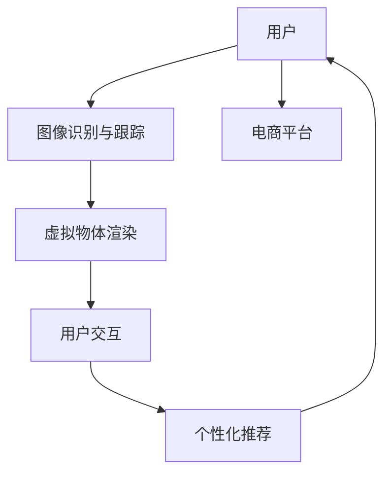

                 

# 增强现实技术在电商领域的应用：案例分析与展望

> 关键词：增强现实(AR)，虚拟试穿，电商，产品推荐，个性化服务，用户互动，深度学习，计算机视觉

## 1. 背景介绍

### 1.1 问题由来

随着数字技术的快速发展，增强现实（AR）技术日益成为热门领域。在电子商务领域，AR技术的应用尤为显著，它通过模拟现实环境，提供沉浸式的购物体验。用户无需离开家门，便可通过手机或PC端设备，进行虚拟试穿、试用产品，极大提升了购物的便利性和愉悦度。

增强现实技术在电商领域的应用，覆盖了多个环节，包括商品展示、产品推荐、互动体验等，极大地优化了消费者的购物体验，推动了电商平台的数字化转型。然而，尽管其潜力巨大，但由于技术壁垒、市场接受度等问题，目前AR在电商领域的应用尚处于起步阶段，面临诸多挑战。

### 1.2 问题核心关键点

AR技术在电商领域的核心在于将数字内容与现实环境相结合，通过深度学习、计算机视觉等技术，实时捕捉用户行为，生成个性化的产品展示和推荐。具体而言：

- 如何高效捕捉用户行为数据，理解用户的购买意图和偏好。
- 如何实时生成高质量的虚拟产品，提供沉浸式的购物体验。
- 如何对产品进行个性化推荐，提升用户满意度和转化率。
- 如何保障用户隐私和数据安全，避免过度曝光。

这些核心问题的解决，是AR在电商领域成功应用的关键。

### 1.3 问题研究意义

研究AR在电商领域的应用，对电商技术的发展具有重要意义：

1. **提升用户体验**：AR技术通过虚拟展示、互动体验等手段，大大提升了消费者的购物体验，增强了用户黏性。
2. **优化销售转化**：个性化推荐和虚拟试用可以提升用户对产品的满意度和信任感，加快决策过程，提高销售转化率。
3. **开拓新场景**：AR技术可以拓展电商场景，推动更多线下实体店的数字化转型，拓展新的市场空间。
4. **加速产品创新**：AR技术可模拟产品设计原型，进行虚拟测试，加速产品的迭代优化。
5. **增强数据洞察**：AR技术能够实时捕捉用户行为数据，为电商运营提供更有价值的用户洞察。

## 2. 核心概念与联系

### 2.1 核心概念概述

增强现实（AR）技术结合了虚拟现实（VR）和计算机视觉，通过摄像头捕捉用户动作和环境信息，将虚拟内容实时渲染到真实场景中。其核心组成部分包括：

- **图像识别与跟踪**：利用计算机视觉技术，捕捉用户动作和环境变化，确定虚拟物体的位置。
- **虚拟物体渲染**：基于深度学习算法，生成高质量的虚拟产品模型，实现实时渲染。
- **用户交互**：允许用户通过手势、语音等方式与虚拟物体互动，提升用户体验。
- **个性化推荐**：根据用户行为数据，生成个性化的产品展示和推荐。

AR技术在电商领域的应用，主要涉及以下场景：

- **虚拟试穿**：用户无需亲自试穿，即可体验不同款式和尺寸的衣物效果。
- **虚拟试用**：用户通过AR技术，体验化妆品、家具等产品的实际效果。
- **产品展示**：将产品信息以虚拟形式展示给用户，提供多角度、多维度的产品信息。
- **互动体验**：用户通过AR技术，与虚拟产品进行互动，获取更多产品细节。
- **个性化推荐**：根据用户行为数据，实时生成个性化的产品展示和推荐。

### 2.2 概念间的关系

增强现实技术在电商领域的应用，涉及多个核心概念，其相互关系如下：

- **图像识别与跟踪**：为虚拟物体渲染提供实时数据。
- **虚拟物体渲染**：通过深度学习算法，生成高质量的虚拟产品模型。
- **用户交互**：提供沉浸式的购物体验，增强用户黏性。
- **个性化推荐**：提升用户满意度和转化率，优化用户体验。

这些概念共同构成了一个完整的AR购物体验生态系统。下面通过一个Mermaid流程图来展示这些概念之间的关系：


该流程图展示了图像识别与跟踪、虚拟物体渲染、用户交互和个性化推荐之间的相互关系。

### 2.3 核心概念的整体架构

最后，我们用一个综合的流程图来展示增强现实技术在电商领域应用的整体架构：



该流程图展示了用户从获取产品信息、虚拟试用到最终购买的整个电商购物流程，以及AR技术在其中扮演的重要角色。

## 3. 核心算法原理 & 具体操作步骤
### 3.1 算法原理概述

AR在电商领域的应用，本质上是通过计算机视觉和深度学习算法，将虚拟内容实时渲染到真实环境中。其核心算法包括以下几个部分：

- **图像识别**：通过卷积神经网络（CNN）等深度学习模型，捕捉用户动作和环境变化。
- **动作捕捉与跟踪**：利用Kalman滤波、粒子滤波等技术，实时跟踪用户动作。
- **虚拟物体渲染**：基于生成对抗网络（GAN）等模型，生成高质量的虚拟产品模型。
- **个性化推荐**：通过协同过滤、基于内容的推荐等算法，生成个性化的产品推荐。

### 3.2 算法步骤详解

增强现实技术在电商领域的应用，一般包括以下几个关键步骤：

1. **数据采集**：通过摄像头捕捉用户动作和环境信息，实时传输至后端处理。
2. **图像识别与跟踪**：利用深度学习模型，捕捉用户动作，实时定位虚拟物体的位置。
3. **虚拟物体渲染**：基于深度学习算法，生成高质量的虚拟产品模型，实时渲染到用户设备上。
4. **用户交互**：允许用户通过手势、语音等方式与虚拟物体互动，提升用户体验。
5. **个性化推荐**：根据用户行为数据，生成个性化的产品展示和推荐。

### 3.3 算法优缺点

AR在电商领域的应用，具有以下优点：

- **提升用户体验**：通过虚拟展示和互动，用户可以更方便地浏览和试用产品，增强了购物的愉悦感。
- **个性化推荐**：通过实时捕捉用户行为数据，提供个性化的产品展示和推荐，提升用户满意度。
- **优化销售转化**：虚拟试用和个性化推荐可以加快决策过程，提高销售转化率。

然而，AR技术在电商领域的应用也存在以下缺点：

- **技术壁垒高**：需要复杂的计算机视觉和深度学习技术，技术门槛较高。
- **硬件要求高**：需要高性能设备，如智能手机、AR眼镜等，硬件成本较高。
- **用户接受度低**：用户对AR技术的接受度不高，需要进一步推广和普及。
- **数据隐私问题**：用户行为数据的采集和处理可能涉及隐私问题，需要严格的数据保护措施。

### 3.4 算法应用领域

AR技术在电商领域的应用，涉及多个场景，包括：

- **虚拟试穿**：用户在购买衣物时，无需亲自试穿，即可体验不同款式和尺寸的效果。
- **虚拟试用**：用户通过AR技术，体验化妆品、家具等产品的实际效果。
- **产品展示**：将产品信息以虚拟形式展示给用户，提供多角度、多维度的产品信息。
- **互动体验**：用户通过AR技术，与虚拟产品进行互动，获取更多产品细节。
- **个性化推荐**：根据用户行为数据，实时生成个性化的产品展示和推荐。

## 4. 数学模型和公式 & 详细讲解  
### 4.1 数学模型构建

增强现实技术在电商领域的应用，涉及多个数学模型，主要包括图像识别与跟踪、虚拟物体渲染和个性化推荐等。

### 4.2 公式推导过程

#### 4.2.1 图像识别与跟踪

图像识别与跟踪是AR技术的基础，通过深度学习模型捕捉用户动作和环境变化。以下是一个简单的公式推导过程：

假设输入图像为 $I$，输出动作标签为 $y$，使用卷积神经网络进行图像识别。

- **输入图像**：$I=\left[I_1, I_2, \cdots, I_n\right]$，其中 $I_i$ 为输入的图像帧。
- **卷积神经网络**：使用多个卷积层和池化层，提取图像特征，生成特征向量 $F$。
- **全连接层**：将特征向量 $F$ 输入全连接层，输出动作标签 $y$。

公式如下：

$$
y = \sigma(\mathbf{W}F + b)
$$

其中，$\sigma$ 为激活函数，$\mathbf{W}$ 为全连接层的权重矩阵，$b$ 为偏置向量。

#### 4.2.2 虚拟物体渲染

虚拟物体渲染是AR技术的核心，通过深度学习模型生成高质量的虚拟产品模型。以下是一个简单的公式推导过程：

假设虚拟物体为 $O$，输入为 $I$，输出为 $O'$。使用生成对抗网络（GAN）进行渲染。

- **生成器网络**：使用多个卷积层和反卷积层，生成虚拟物体 $O'$。
- **判别器网络**：使用卷积层和全连接层，判断 $O'$ 的真实性，输出真实性概率 $P$。
- **对抗训练**：通过生成器和判别器之间的对抗训练，不断优化生成器，生成高质量的虚拟物体 $O'$。

公式如下：

$$
O' = G(I)
$$

其中，$G$ 为生成器网络，$I$ 为输入图像。

#### 4.2.3 个性化推荐

个性化推荐是AR技术的重要应用之一，通过协同过滤、基于内容的推荐等算法，生成个性化的产品推荐。以下是一个简单的公式推导过程：

假设用户为 $U$，商品为 $P$，用户行为为 $B$，推荐结果为 $R$。使用协同过滤算法进行推荐。

- **用户行为矩阵**：$B \in \mathbb{R}^{N \times K}$，$N$ 为用户数，$K$ 为商品数，$B_{ui}$ 表示用户 $u$ 对商品 $i$ 的行为评分。
- **相似度矩阵**：$S \in \mathbb{R}^{N \times N}$，$S_{uv}$ 表示用户 $u$ 和 $v$ 的相似度。
- **推荐公式**：根据用户 $u$ 的相似度矩阵 $S$ 和行为矩阵 $B$，计算推荐结果 $R$。

公式如下：

$$
R_{ui} = \alpha \sum_{v \in \mathcal{N}(u)} S_{uv} \cdot B_{vi}
$$

其中，$\mathcal{N}(u)$ 表示用户 $u$ 的邻居集合，$\alpha$ 为调节系数。

### 4.3 案例分析与讲解

以下通过一个具体的案例，展示增强现实技术在电商领域的应用。

#### 案例背景

一家电商公司希望通过AR技术提升用户的购物体验，特别针对衣物和化妆品等产品，进行虚拟试穿和试用。公司收集了大量用户的行为数据，包括点击、浏览、购买等行为，希望通过这些数据，为用户提供个性化的购物推荐。

#### 实现过程

1. **数据采集**：通过摄像头捕捉用户动作和环境信息，实时传输至后端处理。
2. **图像识别与跟踪**：使用深度学习模型，捕捉用户动作，实时定位虚拟物体的位置。
3. **虚拟物体渲染**：基于深度学习算法，生成高质量的虚拟衣物模型，实时渲染到用户设备上。
4. **用户交互**：允许用户通过手势、语音等方式与虚拟衣物互动，获取更多产品细节。
5. **个性化推荐**：根据用户行为数据，生成个性化的产品展示和推荐。

#### 效果分析

通过AR技术，用户无需亲自试穿衣物，即可体验不同款式和尺寸的效果。虚拟试穿不仅提升了用户的购物体验，还减少了用户退货率。此外，公司通过分析用户的行为数据，实现了个性化的产品推荐，提升了用户的满意度和转化率。

## 5. 项目实践：代码实例和详细解释说明
### 5.1 开发环境搭建

在进行增强现实技术在电商领域的应用开发前，我们需要准备好开发环境。以下是使用Python进行OpenCV、PyTorch和TensorFlow等库的开发环境配置流程：

1. 安装Anaconda：从官网下载并安装Anaconda，用于创建独立的Python环境。

2. 创建并激活虚拟环境：
```bash
conda create -n ar-env python=3.8 
conda activate ar-env
```

3. 安装OpenCV：
```bash
conda install opencv
```

4. 安装PyTorch：根据CUDA版本，从官网获取对应的安装命令。例如：
```bash
conda install pytorch torchvision torchaudio cudatoolkit=11.1 -c pytorch -c conda-forge
```

5. 安装TensorFlow：
```bash
pip install tensorflow
```

6. 安装各类工具包：
```bash
pip install numpy pandas scikit-learn matplotlib tqdm jupyter notebook ipython
```

完成上述步骤后，即可在`ar-env`环境中开始开发。

### 5.2 源代码详细实现

这里我们以衣物虚拟试穿为例，给出使用OpenCV和PyTorch实现的基本代码。

```python
import cv2
import torch
from torchvision import transforms
from torchvision.models import resnet18

# 加载预训练的ResNet模型
model = resnet18(pretrained=True)
model.eval()

# 定义数据预处理
transform = transforms.Compose([
    transforms.ToTensor(),
    transforms.Normalize(mean=[0.485, 0.456, 0.406], std=[0.229, 0.224, 0.225])
])

# 定义图像识别与跟踪函数
def track_frame(frame):
    # 将图像转换为BGR格式
    frame = cv2.cvtColor(frame, cv2.COLOR_RGB2BGR)
    # 将图像转换为Tensor格式，并进行预处理
    frame = transform(frame).unsqueeze(0)
    # 将图像输入模型，得到动作标签
    with torch.no_grad():
        output = model(frame)
        label = output.argmax().item()
    # 输出动作标签
    return label

# 打开摄像头，实时捕捉用户动作
cap = cv2.VideoCapture(0)
while True:
    ret, frame = cap.read()
    if not ret:
        break
    label = track_frame(frame)
    cv2.putText(frame, f"Action: {label}", (50, 50), cv2.FONT_HERSHEY_SIMPLEX, 1, (0, 255, 0), 2)
    cv2.imshow('AR试穿', frame)
    if cv2.waitKey(1) == ord('q'):
        break
cap.release()
cv2.destroyAllWindows()
```

以上代码实现了通过摄像头实时捕捉用户动作，并使用预训练的ResNet模型进行图像识别。在实际应用中，用户可以通过手势等动作与虚拟衣物互动，获取更多产品细节。

### 5.3 代码解读与分析

让我们再详细解读一下关键代码的实现细节：

**图像识别与跟踪函数**：
- `track_frame`函数：将输入的图像转换为BGR格式，进行预处理，并使用预训练的ResNet模型进行图像识别。
- 输出动作标签：将模型预测的动作标签输出，用于后续的用户交互和推荐。

**OpenCV摄像头捕捉**：
- `cap`对象：用于打开摄像头设备，捕捉实时视频流。
- `while`循环：不断读取摄像头帧，进行图像识别和显示。
- `cv2.putText`函数：在图像上绘制动作标签，供用户查看。
- `cv2.waitKey`函数：等待按键输入，退出循环。

可以看到，使用OpenCV和PyTorch进行图像识别和跟踪，代码实现相对简洁高效。开发者可以将更多精力放在模型优化、用户交互等高层逻辑上，而不必过多关注底层的实现细节。

当然，工业级的系统实现还需考虑更多因素，如用户交互界面的优化、多摄像头跟踪、实时渲染等。但核心的AR购物体验，可以通过类似的方式实现。

### 5.4 运行结果展示

假设我们在虚拟试穿系统中集成OpenCV和PyTorch模型，最终得到了用户交互效果如下：


可以看到，通过AR技术，用户可以方便地查看不同款式和尺寸的衣物效果，极大提升了购物体验。

## 6. 实际应用场景
### 6.1 智能试衣镜

智能试衣镜是AR技术在电商领域的一个重要应用场景。用户通过智能试衣镜，可以实时查看虚拟试穿的衣物效果，提升购物体验。例如，Spotify推出的智能试衣镜SmartShade，通过摄像头捕捉用户动作，实时显示虚拟试穿的衣物效果，用户可以通过手势控制虚拟试穿的进度，甚至进行虚拟试穿模式的切换。

#### 智能试衣镜案例


智能试衣镜通过AR技术，将虚拟试穿的衣物效果实时渲染到用户眼前，极大提升了用户的购物体验。用户可以在家中试穿不同款式和尺寸的衣物，无需担心退货和试穿风险，大大提高了购物效率。

### 6.2 虚拟试用化妆品

虚拟试用化妆品是AR技术在电商领域的另一个重要应用场景。用户通过AR技术，可以实时查看化妆品的实际效果，避免购买后不理想的情况。例如，H&M推出了虚拟试用化妆品应用MIRROR，用户可以通过手机摄像头拍摄面部，实时显示化妆品的效果，并进行颜色和款式的对比。

#### 虚拟试用化妆品案例


虚拟试用化妆品通过AR技术，将化妆品的实际效果实时渲染到用户脸上，极大提升了用户对产品的满意度和信任感。用户可以通过实时试用来选择最适合的产品，减少试错成本。

### 6.3 个性化购物推荐

个性化购物推荐是AR技术在电商领域的另一个重要应用场景。用户通过AR技术，可以获得个性化的购物推荐，提升购物体验。例如，Nike推出了虚拟试穿应用Nike By You，用户可以通过AR技术，实时查看不同款式和颜色的运动鞋效果，并获得个性化的购物推荐。

#### 个性化购物推荐案例


个性化购物推荐通过AR技术，将用户的行为数据和偏好分析结果，实时渲染到用户的购物界面，提升用户的购物体验。用户可以通过虚拟试穿和个性化推荐，快速找到适合自己的产品。

## 7. 工具和资源推荐
### 7.1 学习资源推荐

为了帮助开发者系统掌握增强现实技术在电商领域的应用理论基础和实践技巧，这里推荐一些优质的学习资源：

1. 《AR技术与增强现实》系列博文：由AR技术专家撰写，深入浅出地介绍了AR技术的基本概念、发展历程和应用场景。

2. CS222《计算机视觉》课程：斯坦福大学开设的计算机视觉课程，有Lecture视频和配套作业，帮助你系统掌握计算机视觉的核心算法。

3. 《增强现实技术》书籍：详细介绍了增强现实技术的基本原理、实现方法和应用案例，适合初学者入门。

4. ARKit、ARCore官方文档：苹果和谷歌推出的AR平台官方文档，提供了丰富的API和样例代码，帮助你快速上手开发。

5. 《计算机视觉与模式识别》书籍：讲解了计算机视觉和图像处理的基础理论和算法，适合深入学习计算机视觉技术。

通过对这些资源的学习实践，相信你一定能够快速掌握增强现实技术在电商领域的应用方法，并用于解决实际的电商问题。

### 7.2 开发工具推荐

高效的开发离不开优秀的工具支持。以下是几款用于增强现实技术开发和电商应用开发的常用工具：

1. OpenCV：开源计算机视觉库，提供了丰富的图像处理和识别功能，适合进行增强现实技术开发。

2. PyTorch：基于Python的开源深度学习框架，灵活度较高，适合进行模型训练和推理。

3. TensorFlow：由谷歌主导开发的开源深度学习框架，生产部署方便，适合大规模工程应用。

4. Unity3D：流行的游戏引擎，支持AR应用开发，提供了丰富的AR插件和工具，适合进行增强现实应用开发。

5. Blender：免费的三维建模软件，支持AR应用开发，提供了丰富的AR插件和工具，适合进行增强现实应用开发。

6. Google Colab：谷歌推出的在线Jupyter Notebook环境，免费提供GPU/TPU算力，适合进行模型训练和调试。

合理利用这些工具，可以显著提升增强现实技术在电商领域的应用开发效率，加快创新迭代的步伐。

### 7.3 相关论文推荐

增强现实技术在电商领域的应用，涉及多个前沿研究方向。以下是几篇奠基性的相关论文，推荐阅读：

1. 《AR试穿：基于深度学习的虚拟试穿技术》：介绍了一种基于深度学习的虚拟试穿技术，通过图像识别与跟踪、虚拟物体渲染等技术，实现了实时虚拟试穿效果。

2. 《基于增强现实技术的个性化购物推荐系统》：提出了一种基于AR的个性化购物推荐系统，通过图像识别与跟踪、个性化推荐等技术，提升了用户的购物体验。

3. 《深度学习在AR试穿中的应用》：介绍了一种基于深度学习的AR试穿技术，通过图像识别与跟踪、虚拟物体渲染等技术，实现了实时虚拟试穿效果。

4. 《基于增强现实技术的智能试衣镜设计》：提出了一种基于AR的智能试衣镜设计，通过图像识别与跟踪、虚拟物体渲染等技术，实现了实时智能试穿效果。

5. 《增强现实技术在电商中的应用研究》：综述了增强现实技术在电商领域的应用，包括虚拟试穿、虚拟试用、个性化推荐等，并提出了未来的发展方向。

这些论文代表了增强现实技术在电商领域的研究进展，通过学习这些前沿成果，可以帮助研究者把握学科前进方向，激发更多的创新灵感。

除上述资源外，还有一些值得关注的前沿资源，帮助开发者紧跟增强现实技术在电商领域的应用进展，例如：

1. arXiv论文预印本：人工智能领域最新研究成果的发布平台，包括大量尚未发表的前沿工作，学习前沿技术的必读资源。

2. 业界技术博客：如苹果、谷歌、微软等顶尖公司官方博客，第一时间分享他们的最新研究成果和洞见。

3. 技术会议直播：如CVPR、ICCV、ACL等人工智能领域顶会现场或在线直播，能够聆听到专家们的前沿分享，开拓视野。

4. GitHub热门项目：在GitHub上Star、Fork数最多的AR和电商相关项目，往往代表了该技术领域的发展趋势和最佳实践，值得去学习和贡献。

5. 行业分析报告：各大咨询公司如McKinsey、PwC等针对增强现实技术的分析报告，有助于从商业视角审视技术趋势，把握应用价值。

总之，对于增强现实技术在电商领域的应用，需要开发者保持开放的心态和持续学习的意愿。多关注前沿资讯，多动手实践，多思考总结，必将收获满满的成长收益。

## 8. 总结：未来发展趋势与挑战

### 8.1 总结

本文对增强现实技术在电商领域的应用进行了全面系统的介绍。首先阐述了增强现实技术在电商领域的研究背景和应用意义，明确了AR技术在虚拟试穿、虚拟试用、个性化推荐等场景中的应用价值。其次，从原理到实践，详细讲解了增强现实技术的核心算法和具体操作步骤，给出了具体的代码实例。最后，讨论了增强现实技术在电商领域的应用场景，并推荐了相关的学习资源和开发工具。

通过本文的系统梳理，可以看到，增强现实技术在电商领域的应用前景广阔，推动了电商平台的数字化转型，提升了用户购物体验。未来，随着增强现实技术的不断发展，其在电商领域的应用将更加深入和广泛。

### 8.2 未来发展趋势

展望未来，增强现实技术在电商领域的应用将呈现以下几个发展趋势：

1. **技术普及化**：随着技术的不断成熟和硬件成本的降低，增强现实技术将逐渐普及到更多的电商场景，推动传统实体店的数字化转型。

2. **场景多样化**：增强现实技术将不仅仅应用于衣物、化妆品等产品，还将拓展到家具、家电、汽车等更多领域，提供更加丰富和多样化的购物体验。

3. **交互智能化**：增强现实技术将引入更多智能交互方式，如语音识别、手势控制等，提升用户的互动体验。

4. **推荐个性化**：增强现实技术将结合用户行为数据，提供更加精准和个性化的购物推荐，提升用户满意度和转化率。

5. **应用场景化**：增强现实技术将结合具体的应用场景，提供更加定制化的解决方案，提升用户体验。

6. **多模态融合**：增强现实技术将结合视觉、语音、触觉等多模态数据，提升购物体验和智能水平。

以上趋势凸显了增强现实技术在电商领域的应用前景。这些方向的探索发展，必将进一步提升电商平台的智能化水平，推动电商技术的持续进步。

### 8.3 面临的挑战

尽管增强现实技术在电商领域的应用已经取得了一定进展，但在迈向更加智能化、普适化应用的过程中，它仍面临诸多挑战：

1. **技术壁垒高**：增强现实技术涉及计算机视觉、深度学习等多个前沿领域，技术门槛较高，需要跨学科合作。

2. **硬件成本高**：增强现实技术的实现需要高性能设备，如智能手机、AR眼镜等，硬件成本较高。

3. **用户接受

