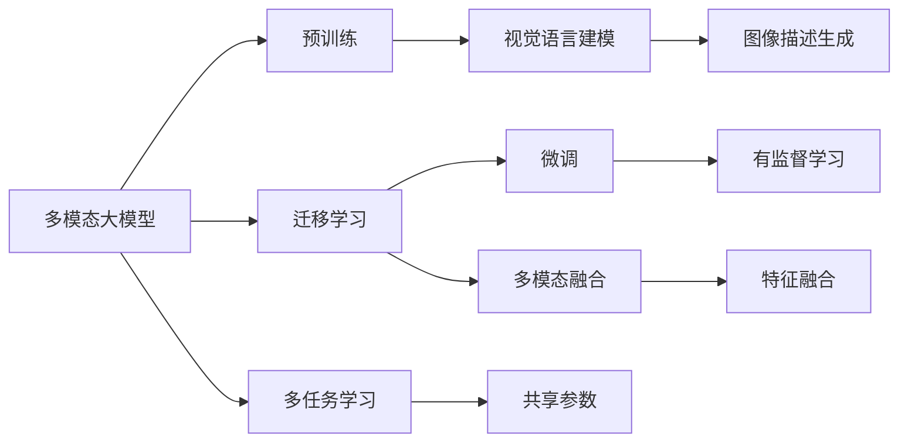
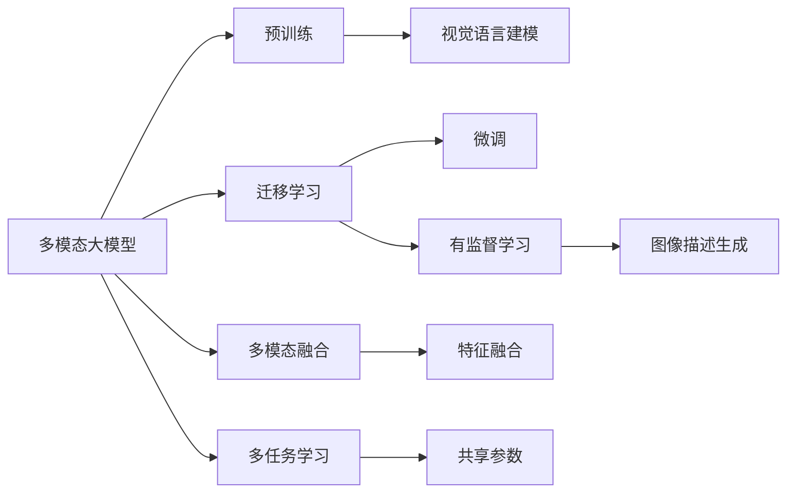
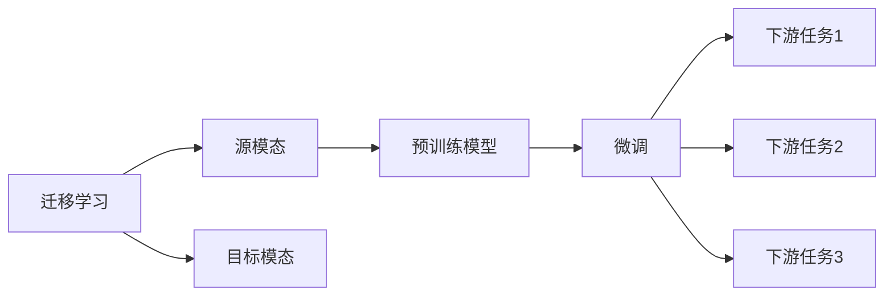
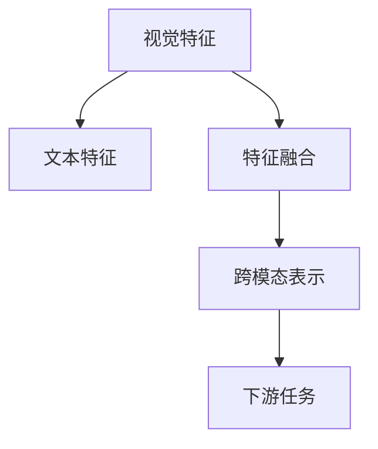
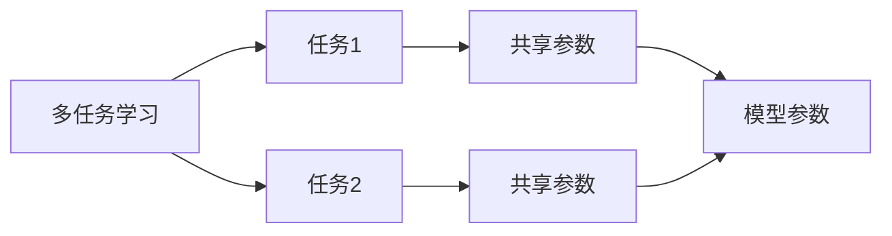
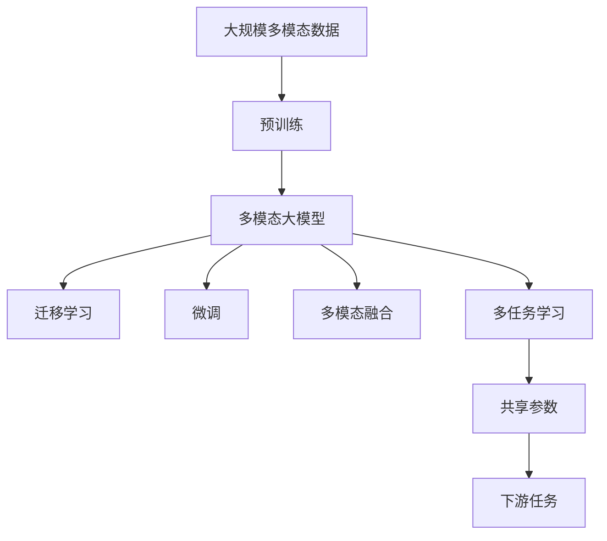

                 

# 多模态大模型：技术原理与实战 方法论介绍

> 关键词：多模态,大模型,预训练,迁移学习,Transformer,BERT,多模态学习,多任务学习,微调,跨模态融合

## 1. 背景介绍

### 1.1 问题由来
近年来，随着深度学习技术的飞速发展，多模态大模型在自然语言处理(NLP)、计算机视觉(CV)、语音处理(Speech)等多个领域取得了突破性进展。多模态大模型通过结合不同类型的数据（如图像、文本、音频等）进行预训练，能够学习到跨模态的共同表征，具备强大的语义理解和生成能力。这些模型在各种多模态任务上展示了卓越的性能，包括图像描述、视觉问答、视频分析等，极大地推动了人工智能技术的发展。

然而，由于多模态数据在形式、结构和语义上存在较大差异，如何将不同模态的信息有效融合，构建泛化能力强、应用广泛的多模态模型，成为了当前人工智能领域的重要研究课题。本文将深入探讨多模态大模型的技术原理和实战方法，为读者提供系统的理论和方法论指导。

### 1.2 问题核心关键点
多模态大模型的核心在于如何高效融合不同模态的信息，学习跨模态的共同表征。常见的方法包括：

- 预训练：在大规模多模态数据上进行无监督学习，学习跨模态的共同表示。
- 迁移学习：利用预训练模型在不同模态间的知识迁移，提升模型在特定多模态任务上的性能。
- 微调：在预训练模型的基础上，使用下游任务的有标签数据进行有监督学习，优化模型在特定任务上的性能。
- 多模态融合：通过融合不同模态的特征，构建跨模态的表示，提升模型的泛化能力。
- 多任务学习：通过学习多个相关任务，共享模型参数，提升模型的多任务表现能力。

本文将详细讲解这些核心技术，并通过实际案例展示其在多模态应用中的实践。

### 1.3 问题研究意义
研究多模态大模型，对于拓展人工智能模型的应用边界，提升多模态任务的性能，加速人工智能技术在各个领域的应用，具有重要意义：

1. 降低应用开发成本。多模态大模型通过预训练获得通用特征，显著减少了从头开发所需的成本和人力投入。
2. 提升模型效果。多模态大模型能够有效融合不同模态的信息，提升模型在多模态任务上的表现。
3. 加速开发进度。利用预训练模型的通用特征，可以快速适配多模态应用场景，缩短开发周期。
4. 带来技术创新。多模态大模型促进了对跨模态学习、知识图谱等前沿技术的研究，催生了新的研究方向。
5. 赋能产业升级。多模态大模型为传统行业数字化转型提供了新的技术路径，推动了智能应用的发展。

## 2. 核心概念与联系

### 2.1 核心概念概述

为更好地理解多模态大模型的技术原理和实战方法，本节将介绍几个密切相关的核心概念：

- 多模态大模型(Multimodal Large Model)：以Transformer、BERT等模型为代表的大规模多模态预训练模型。通过在图像、文本、音频等多种类型的数据上进行预训练，学习到跨模态的通用表示。
- 预训练(Pre-training)：指在大规模多模态数据上进行无监督学习，学习通用的跨模态表示。常见的预训练任务包括视觉语言建模、视觉描述生成等。
- 迁移学习(Transfer Learning)：指将一个模态的预训练模型应用于另一个不同但相关的模态的学习范式。多模态大模型通过预训练-微调过程实现跨模态知识的迁移。
- 微调(Fine-Tuning)：指在预训练模型的基础上，使用下游任务的少量标注数据，通过有监督学习优化模型在特定任务上的性能。通常只调整顶层或部分模态的参数。
- 多模态融合(Multimodal Fusion)：指通过融合不同模态的信息，构建跨模态的表示，提升模型的泛化能力。
- 多任务学习(Multi-task Learning)：指同时学习多个相关任务，共享模型参数，提升模型的多任务表现能力。
- 对抗训练(Adversarial Training)：指加入对抗样本，提高模型鲁棒性，防止过拟合。
- 多模态对抗学习(Multimodal Adversarial Learning)：指在多模态数据中引入对抗样本，增强模型的鲁棒性和泛化能力。

这些核心概念之间的逻辑关系可以通过以下Mermaid流程图来展示：



这个流程图展示了大模型学习过程的主要阶段，从预训练到微调、多模态融合、多任务学习等多个环节，构建了完整的多模态大模型框架。

### 2.2 概念间的关系

这些核心概念之间存在着紧密的联系，构成了多模态大模型的整体学习框架。下面我们通过几个Mermaid流程图来展示这些概念之间的关系。

#### 2.2.1 多模态大模型的学习范式



这个流程图展示了多模态大模型学习的主要范式，包括预训练、迁移学习、微调、多模态融合和多任务学习等环节。

#### 2.2.2 迁移学习与微调的关系



这个流程图展示了迁移学习的基本原理，以及它与微调的关系。迁移学习涉及源模态和目标模态，预训练模型在源模态上学习，然后通过微调适应各种下游任务（目标模态）。

#### 2.2.3 多模态融合方法



这个流程图展示了多模态融合的基本流程，从不同模态的特征提取，到跨模态的表示构建，再到下游任务的预测。

#### 2.2.4 多任务学习范式



这个流程图展示了多任务学习的基本范式，通过共享模型参数，提升多个相关任务的表现。

### 2.3 核心概念的整体架构

最后，我们用一个综合的流程图来展示这些核心概念在大模型学习过程中的整体架构：



这个综合流程图展示了从预训练到迁移学习、微调、多模态融合和多任务学习完整的过程。多模态大模型首先在大规模多模态数据上进行预训练，然后通过迁移学习、微调、多模态融合和多任务学习，适应不同下游任务，构建跨模态的表示。

## 3. 核心算法原理 & 具体操作步骤
### 3.1 算法原理概述

多模态大模型的核心算法原理主要基于Transformer架构和自监督学习任务，通过在多种类型的数据上进行预训练，学习到跨模态的通用表示。

以Transformer为例，其基本结构包括编码器-解码器两部分，用于处理不同模态的输入。编码器由多个自注意力层和前馈神经网络层构成，用于提取输入特征。解码器同样由多个自注意力层和前馈神经网络层构成，用于生成输出。

预训练过程中，Transformer模型在图像、文本、音频等多种类型的数据上进行无监督学习，学习到跨模态的表示。常见的预训练任务包括视觉语言建模、视觉描述生成、音频描述生成等。这些预训练任务通过最大化任务相关的损失函数，使得模型学习到跨模态的共同表示。

迁移学习和微调过程，则是在预训练模型的基础上，利用下游任务的有标签数据进行有监督学习，优化模型在特定任务上的性能。通过微调，模型能够适应特定的数据分布和任务需求，提升模型的泛化能力和表现。

多模态融合方法，主要通过特征提取和融合操作，将不同模态的特征信息融合到跨模态的表示中。常见的融合方法包括拼接、加权拼接、注意力机制等。

多任务学习则通过共享模型参数，同时学习多个相关任务，提升模型的多任务表现能力。

### 3.2 算法步骤详解

以下是多模态大模型的核心算法步骤：

**Step 1: 准备预训练数据集和模型**

- 准备多种类型的数据集，包括图像、文本、音频等。
- 选择合适的预训练模型，如Transformer、BERT等。
- 对数据集进行预处理，如数据增强、数据标准化等。

**Step 2: 预训练模型**

- 在预训练数据集上进行无监督学习，学习跨模态的表示。
- 通过最大化预训练任务的相关损失函数，优化模型参数。
- 保存预训练模型的参数作为初始化参数。

**Step 3: 微调模型**

- 准备下游任务的数据集，划分为训练集、验证集和测试集。
- 添加下游任务的适配层，如分类层、解码器等。
- 设置微调的超参数，如学习率、批大小等。
- 在训练集上进行有监督学习，优化模型在特定任务上的性能。
- 在验证集上评估模型性能，避免过拟合。
- 在测试集上评估模型性能，比较微调前后效果。

**Step 4: 多模态融合**

- 提取不同模态的特征信息。
- 将不同模态的特征信息进行拼接、加权拼接或注意力融合。
- 将融合后的特征信息输入到预训练模型或下游任务模型中。

**Step 5: 多任务学习**

- 准备多个相关任务的数据集，划分为训练集、验证集和测试集。
- 使用共享参数的多任务学习框架。
- 在训练集上进行有监督学习，优化多个任务的表现。
- 在验证集上评估多个任务的表现，避免过拟合。
- 在测试集上评估多个任务的表现，比较多任务学习的效果。

### 3.3 算法优缺点

多模态大模型的优点包括：

- 能够学习跨模态的共同表示，提升模型在多模态任务上的表现。
- 通过预训练和微调过程，利用大量无标签和有标签数据，提升模型的泛化能力和性能。
- 利用多模态融合和多任务学习，提升模型的多任务表现能力。

多模态大模型的缺点包括：

- 需要大规模数据和计算资源进行预训练，成本较高。
- 多模态数据在形式和结构上存在较大差异，融合难度较大。
- 多任务学习需要共享参数，可能影响各任务的表现。

尽管存在这些局限性，多模态大模型仍是大规模多模态应用中的重要范式，通过不断优化预训练任务、多模态融合方法、多任务学习策略，能够进一步提升模型的性能和应用效果。

### 3.4 算法应用领域

多模态大模型在多个领域中得到了广泛应用，包括但不限于：

- 医学影像分析：通过融合医学影像、文本病历等数据，进行疾病诊断和治疗方案推荐。
- 自动驾驶：结合图像、雷达、激光雷达等多种传感器数据，进行场景理解和驾驶决策。
- 视频分析：结合视频帧、音频、文本等多模态信息，进行行为分析和事件检测。
- 智能交互：通过结合语音、文本、图像等多种信息，进行人机交互和自然语言理解。
- 增强现实：结合图像、音频、文本等多种信息，提供沉浸式的虚拟体验。

这些应用场景展示了多模态大模型在实际应用中的巨大潜力，为各行各业带来了新的技术突破。

## 4. 数学模型和公式 & 详细讲解  
### 4.1 数学模型构建

多模态大模型的数学模型构建，主要基于Transformer架构和自监督学习任务。以视觉语言建模为例，其基本模型结构如图：

```
Encoder Decoder
  |    |    |
  V    V    V
  |    |    |
  Attn Attn
  |    |    |
  |    |    |
  |    |    |
  |    |    |
  |    |    |
  |    |    |
  |    |    |
  |    |    |
  |    |    |
  |    |    |
  |    |    |
  |    |    |
  |    |    |
  |    |    |
  |    |    |
  |    |    |
  |    |    |
  |    |    |
  |    |    |
  |    |    |
  |    |    |
  |    |    |
  |    |    |
  |    |    |
  |    |    |
  |    |    |
  |    |    |
  |    |    |
  |    |    |
  |    |    |
  |    |    |
  |    |    |
  |    |    |
  |    |    |
  |    |    |
  |    |    |
  |    |    |
  |    |    |
  |    |    |
  |    |    |
  |    |    |
  |    |    |
  |    |    |
  |    |    |
  |    |    |
  |    |    |
  |    |    |
  |    |    |
  |    |    |
  |    |    |
  |    |    |
  |    |    |
  |    |    |
  |    |    |
  |    |    |
  |    |    |
  |    |    |
  |    |    |
  |    |    |
  |    |    |
  |    |    |
  |    |    |
  |    |    |
  |    |    |
  |    |    |
  |    |    |
  |    |    |
  |    |    |
  |    |    |
  |    |    |
  |    |    |
  |    |    |
  |    |    |
  |    |    |
  |    |    |
  |    |    |
  |    |    |
  |    |    |
  |    |    |
  |    |    |
  |    |    |
  |    |    |
  |    |    |
  |    |    |
  |    |    |
  |    |    |
  |    |    |
  |    |    |
  |    |    |
  |    |    |
  |    |    |
  |    |    |
  |    |    |
  |    |    |
  |    |    |
  |    |    |
  |    |    |
  |    |    |
  |    |    |
  |    |    |
  |    |    |
  |    |    |
  |    |    |
  |    |    |
  |    |    |
  |    |    |
  |    |    |
  |    |    |
  |    |    |
  |    |    |
  |    |    |
  |    |    |
  |    |    |
  |    |    |
  |    |    |
  |    |    |
  |    |    |
  |    |    |
  |    |    |
  |    |    |
  |    |    |
  |    |    |
  |    |    |
  |    |    |
  |    |    |
  |    |    |
  |    |    |
  |    |    |
  |    |    |
  |    |    |
  |    |    |
  |    |    |
  |    |    |
  |    |    |
  |    |    |
  |    |    |
  |    |    |
  |    |    |
  |    |    |
  |    |    |
  |    |    |
  |    |    |
  |    |    |
  |    |    |
  |    |    |
  |    |    |
  |    |    |
  |    |    |
  |    |    |
  |    |    |
  |    |    |
  |    |    |
  |    |    |
  |    |    |
  |    |    |
  |    |    |
  |    |    |
  |    |    |
  |    |    |
  |    |    |
  |    |    |
  |    |    |
  |    |    |
  |    |    |
  |    |    |
  |    |    |
  |    |    |
  |    |    |
  |    |    |
  |    |    |
  |    |    |
  |    |    |
  |    |    |
  |    |    |
  |    |    |
  |    |    |
  |    |    |
  |    |    |
  |    |    |
  |    |    |
  |    |    |
  |    |    |
  |    |    |
  |    |    |
  |    |    |
  |    |    |
  |    |    |
  |    |    |
  |    |    |
  |    |    |
  |    |    |
  |    |    |
  |    |    |
  |    |    |
  |    |    |
  |    |    |
  |    |    |
  |    |    |
  |    |    |
  |    |    |
  |    |    |
  |    |    |
  |    |    |
  |    |    |
  |    |    |
  |    |    |
  |    |    |
  |    |    |
  |    |    |
  |    |    |
  |    |    |
  |    |    |
  |    |    |
  |    |    |
  |    |    |
  |    |    |
  |    |    |
  |    |    |
  |    |    |
  |    |    |
  |    |    |
  |    |    |
  |    |    |
  |    |    |
  |    |    |
  |    |    |
  |    |    |
  |    |    |
  |    |    |
  |    |    |
  |    |    |
  |    |    |
  |    |    |
  |    |    |
  |    |    |
  |    |    |
  |    |    |
  |    |    |
  |    |    |
  |    |    |
  |    |    |
  |    |    |
  |    |    |
  |    |    |
  |    |    |
  |    |    |
  |    |    |
  |    |    |
  |    |    |
  |    |    |
  |    |    |
  |    |    |
  |    |    |
  |    |    |
  |    |    |
  |    |    |
  |    |    |
  |    |    |
  |    |    |
  |    |    |
  |    |    |
  |    |    |
  |    |    |
  |    |    |
  |    |    |
  |    |    |
  |    |    |
  |    |    |
  |    |    |
  |    |    |
  |    |    |
  |    |    |
  |    |    |
  |    |    |
  |    |    |
  |    |    |
  |    |    |
  |    |    |
  |    |    |
  |    |    |
  |    |    |
  |    |    |
  |    |    |
  |    |    |
  |    |    |
  |    |    |
  |    |    |
  |    |    |
  |    |    |
  |    |    |
  |    |    |
  |    |    |
  |    |    |
  |    |    |
  |    |    |
  |    |    |
  |    |    |
  |    |    |
  |    |    |
  |    |    |
  |    |    |
  |    |    |
  |    |    |
  |    |    |
  |    |    |
  |    |    |
  |    |    |
  |    |    |
  |    |    |
  |    |    |
  |    |    |
  |    |    |
  |    |    |
  |    |    |
  |    |    |
  |    |    |
  |    |    |
  |    |    |
  |    |    |
  |    |    |
  |    |    |
  |    |    |
  |    |    |
  |    |    |
  |    |    |
  |    |    |
  |    |    |
  |    |    |
  |    |    |
  |    |    |
  |    |    |
  |    |    |
  |    |    |
  |    |    |
  |    |    |
  |    |    |
  |    |    |
  |    |    |
  |    |    |
  |    |    |
  |    |    |
  |    |    |
  |    |    |
  |    |    |
  |    |    |
  |    |    |
  |    |    |
  |    |    |
  |    |    |
  |    |    |
  |    |    |
  |    |    |
  |    |    |
  |    |    |
  |    |    |
  |    |    |
  |    |    |
  |    |    |
  |    |    |
  |    |    |
  |    |    |
  |    |    |
  |    |    |
  |    |    |
  |    |    |
  |    |    |
  |    |    |
  |    |    |
  |    |    |
  |    |    |
  |    |    |
  |    |    |
  |    |    |
  |    |    |
  |    |    |
  |    |    |
  |    |    |
  |    |    |
  |    |    |
  |    |    |
  |    |    |
  |    |    |
  |    |    |
  |    |    |
  |    |    |
  |    |    |
  |    |    |
  |    |    |
  |    |    |
  |    |    |
  |    |    |
  |    |    |
  |    |    |
  |    |    |
  |    |    |
  |    |    |
  |    |    |
  |    |    |
  |    |    |
  |    |    |
  |    |    |
  |    |    |
  |    |    |
  |    |    |
  |    |    |
  |    |    |
  |    |    |
  |    |    |
  |    |    |
  |    |    |
  |    |    |
  |    |    |
  |    |    |
  |    |    |
  |    |    |
  |    |    |
  |    |    |
  |    |    |
  |    |    |
  |    |    |
  |    |    |
  |    |    |
  |    |    |
  |    |    |
  |    |    |
  |    |    |
  |    |    |
  |    |    |
  |    |    |
  |    |    |
  |    |    |
  |    |    |
  |    |    |
  |    |    |
  |    |    |
  |    |    |
  |    |    |
  |    |    |
  |    |    |
  |    |    |
  |    |    |
  |    |    |
  |    |    |
  |    |    |
  |    |    |
  |    |    |
  |    |    |
  |    |    |
  |    |    |
  |    |    |
  |    |    |
  |    |    |
  |    |    |
  |    |    |
  |    |    |
  |    |    |
  |    |    |
  |    |    |
  |    |    |
  |    |    |
  |    |    |
  |    |    |


