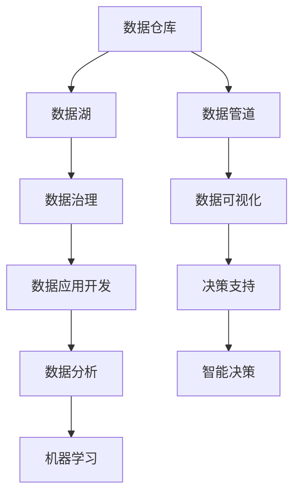
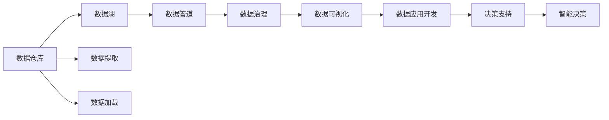
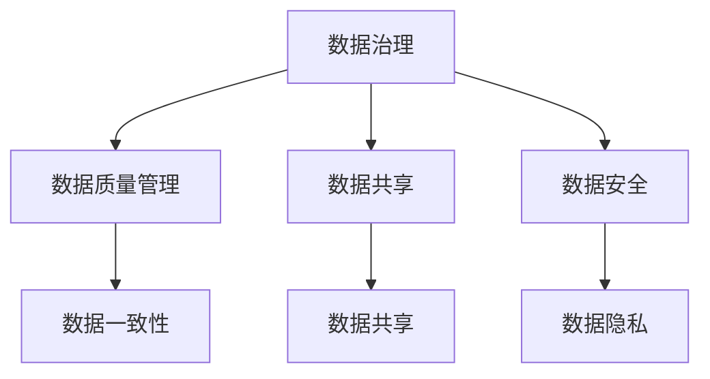
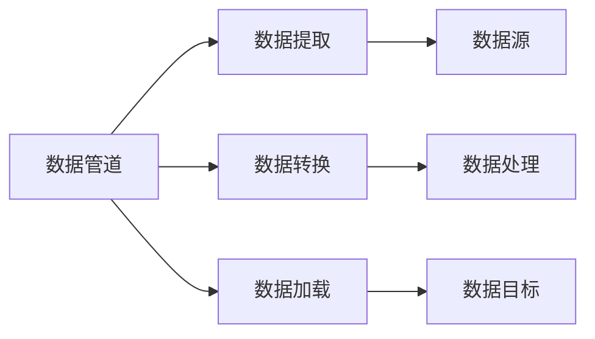
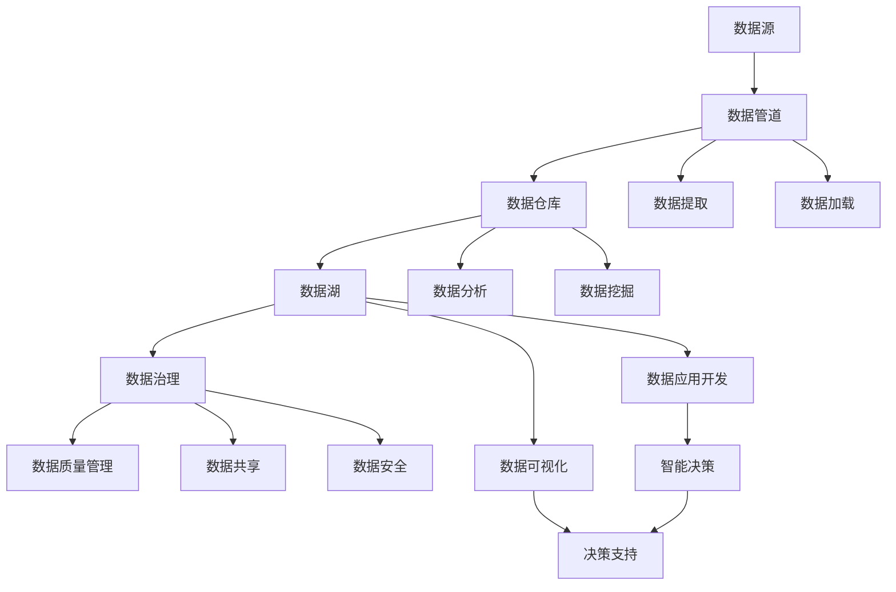

                 

# 大数据平台建设整体架构设计方案

## 1. 背景介绍

### 1.1 问题由来
随着信息技术的快速发展，大数据已经成为了现代企业的核心资产。越来越多的企业意识到，通过挖掘和分析大量数据，可以获得有价值的洞察，优化决策过程，提升业务效率。然而，数据规模的不断增长，以及数据类型的多样性，给数据管理和分析带来了巨大的挑战。传统的数据仓库和BI系统已经无法满足当前需求，无法高效地存储、处理和分析海量数据，同时也无法支撑实时数据的处理需求。因此，构建一个高效、稳定、安全的大数据平台成为企业数字化转型的关键。

### 1.2 问题核心关键点
大数据平台建设的核心在于建立一个能够支持数据全生命周期管理的、可扩展的、高可靠性的、高可用的数据基础设施。大数据平台不仅要能够存储、处理和分析海量数据，还要能够支持数据的质量管理、数据治理、数据共享和数据安全等需求，同时也需要具备大数据应用开发的支持和推广功能。

### 1.3 问题研究意义
构建一个大数据平台，对于提升企业的数据价值、优化决策过程、降低数据管理成本、提升业务效率等方面具有重要意义：

1. 提升数据价值：通过集中管理和分析海量数据，企业可以发现更多有价值的信息，制定更科学、精准的决策。
2. 优化决策过程：大数据平台可以快速响应业务需求，支持实时分析和预测，帮助企业更快地做出决策。
3. 降低数据管理成本：大数据平台可以自动化数据处理和分析过程，减少人力投入，降低数据管理成本。
4. 提升业务效率：通过大数据平台的支持，企业可以更好地理解和利用数据，优化业务流程，提升运营效率。
5. 支持数据治理：大数据平台可以帮助企业建立数据质量管理、数据共享和数据安全等制度，提升数据治理能力。

## 2. 核心概念与联系

### 2.1 核心概念概述

构建大数据平台需要掌握多个关键概念，这些概念之间互相联系，共同构成了大数据平台的核心架构。

- 数据仓库：用于存储和管理结构化数据，支持数据的多维查询和分析，是大数据平台的核心组件。
- 数据湖：用于存储和管理非结构化数据和半结构化数据，支持数据的实时处理和离线分析。
- 数据治理：通过建立数据质量管理、数据共享和数据安全等制度，保证数据的一致性、完整性和安全性。
- 数据管道：用于自动化数据提取、转换和加载，支持数据的自动化处理和流式传输。
- 数据可视化：通过图表、仪表盘等形式，将数据结果可视化展示，支持数据的分析和决策支持。
- 数据应用开发：提供数据开发工具和接口，支持数据分析、机器学习和数据挖掘等应用开发。

这些核心概念之间可以通过以下Mermaid流程图来展示：



这个流程图展示了大数据平台的各个核心组件及其相互关系：

1. 数据仓库存储结构化数据，并通过数据管道实时传输到数据湖中。
2. 数据湖用于存储非结构化数据和半结构化数据，并通过数据管道实时传输到数据仓库中。
3. 数据治理通过建立数据质量管理、数据共享和数据安全等制度，保证数据的一致性、完整性和安全性。
4. 数据管道用于自动化数据提取、转换和加载，支持数据的自动化处理和流式传输。
5. 数据可视化将数据结果以图表、仪表盘等形式展示，支持数据的分析和决策支持。
6. 数据应用开发提供数据开发工具和接口，支持数据分析、机器学习和数据挖掘等应用开发。
7. 数据分析、机器学习和数据挖掘等应用开发生成的结果通过数据管道传输到数据仓库和数据湖中，最终支持智能决策和业务决策。

### 2.2 概念间的关系

这些核心概念之间存在着紧密的联系，形成了大数据平台的核心架构。下面我们通过几个Mermaid流程图来展示这些概念之间的关系。

#### 2.2.1 数据全生命周期管理



这个流程图展示了数据的整个生命周期管理流程：

1. 数据通过数据管道从数据源提取并加载到数据仓库和数据湖中。
2. 数据仓库和数据湖中的数据经过数据治理处理，保证数据的一致性、完整性和安全性。
3. 处理后的数据通过数据管道传输到数据可视化平台，支持数据的分析和决策支持。
4. 数据分析、机器学习和数据挖掘等应用开发生成的结果通过数据管道传输到数据仓库和数据湖中，最终支持智能决策和业务决策。

#### 2.2.2 数据治理与数据安全



这个流程图展示了数据治理与数据安全之间的关系：

1. 数据治理通过建立数据质量管理、数据共享和数据安全等制度，保证数据的一致性、完整性和安全性。
2. 数据质量管理确保数据的一致性和完整性，避免数据混乱和错误。
3. 数据共享促进数据的共享和交流，提升数据的价值。
4. 数据安全保护数据的隐私和安全性，避免数据泄露和滥用。

#### 2.2.3 数据管道与数据传输



这个流程图展示了数据管道的作用：

1. 数据管道用于自动化数据提取、转换和加载，支持数据的自动化处理和流式传输。
2. 数据管道从数据源提取数据，并经过数据转换处理后加载到数据目标中。
3. 数据管道支持数据的实时传输和批量传输，满足不同数据处理需求。

### 2.3 核心概念的整体架构

最后，我们用一个综合的流程图来展示这些核心概念在大数据平台中的整体架构：



这个综合流程图展示了数据的整个生命周期管理流程和数据治理、数据安全等制度：

1. 数据源通过数据管道实时传输到数据仓库和数据湖中。
2. 数据仓库和数据湖中的数据经过数据治理处理，保证数据的一致性、完整性和安全性。
3. 数据仓库和数据湖中的数据通过数据管道传输到数据分析、数据挖掘和数据可视化平台，支持数据分析、机器学习和数据挖掘等应用开发。
4. 数据分析、数据挖掘和数据可视化生成的结果通过数据管道传输到数据仓库和数据湖中，最终支持智能决策和业务决策。

## 3. 核心算法原理 & 具体操作步骤
### 3.1 算法原理概述

大数据平台的构建需要处理大量结构化数据和非结构化数据，涉及到多个数据组件的协同工作。以下是大数据平台的核心算法原理：

#### 3.1.1 数据仓库算法

数据仓库是用于存储和管理结构化数据的核心组件。其核心算法包括数据模型设计、数据加载、数据查询和数据优化等。

- 数据模型设计：设计数据仓库的数据模型，确保数据的规范化和标准化。
- 数据加载：通过数据管道和ETL（Extract, Transform, Load）工具，将数据从各种数据源提取、转换和加载到数据仓库中。
- 数据查询：支持复杂的多维查询，通过SQL查询语言实现数据检索。
- 数据优化：通过索引、分区和压缩等技术，提高数据查询的性能和效率。

#### 3.1.2 数据湖算法

数据湖用于存储和管理非结构化数据和半结构化数据。其核心算法包括数据存储、数据湖架构和数据查询优化等。

- 数据存储：通过分布式文件系统和对象存储系统，支持海量数据的存储。
- 数据湖架构：设计数据湖的数据架构，包括数据分区、数据复制和数据备份等。
- 数据查询优化：通过数据查询优化工具和算法，提高数据查询的性能和效率。

#### 3.1.3 数据管道算法

数据管道用于自动化数据提取、转换和加载，支持数据的自动化处理和流式传输。其核心算法包括数据提取、数据转换和数据加载等。

- 数据提取：从数据源中提取数据，支持多种数据格式和数据源类型。
- 数据转换：对提取的数据进行清洗、转换和格式化处理，确保数据的规范化和标准化。
- 数据加载：将转换后的数据加载到目标数据存储系统中，支持数据批量和实时加载。

#### 3.1.4 数据治理算法

数据治理是大数据平台的核心制度，通过建立数据质量管理、数据共享和数据安全等制度，保证数据的一致性、完整性和安全性。其核心算法包括数据质量管理、数据共享和数据安全等。

- 数据质量管理：通过数据质量监控和数据质量修复等算法，确保数据的一致性和完整性。
- 数据共享：通过数据共享协议和数据共享平台，支持数据的共享和交流。
- 数据安全：通过数据加密、数据权限控制和数据审计等算法，保护数据的隐私和安全性。

#### 3.1.5 数据可视化算法

数据可视化是将数据结果以图表、仪表盘等形式展示，支持数据的分析和决策支持。其核心算法包括数据可视化设计和数据交互等。

- 数据可视化设计：设计数据可视化报表和仪表盘，确保数据的清晰和准确。
- 数据交互：通过数据交互工具和算法，支持用户对数据的交互和探索。

#### 3.1.6 数据应用开发算法

数据应用开发提供数据开发工具和接口，支持数据分析、机器学习和数据挖掘等应用开发。其核心算法包括数据开发工具和数据接口设计等。

- 数据开发工具：提供数据开发工具和库，支持数据分析、机器学习和数据挖掘等应用开发。
- 数据接口设计：设计数据接口，确保数据应用之间的协同和互操作性。

### 3.2 算法步骤详解

以下是大数据平台构建的详细步骤：

#### 3.2.1 数据仓库建设

- 数据模型设计：设计数据仓库的数据模型，确保数据的规范化和标准化。
- 数据源选择：选择适合的数据源，包括关系型数据库、非关系型数据库、文件系统等。
- 数据加载：通过数据管道和ETL工具，将数据从各种数据源提取、转换和加载到数据仓库中。
- 数据查询：通过SQL查询语言实现数据检索，支持复杂的多维查询。
- 数据优化：通过索引、分区和压缩等技术，提高数据查询的性能和效率。

#### 3.2.2 数据湖建设

- 数据存储：通过分布式文件系统和对象存储系统，支持海量数据的存储。
- 数据湖架构：设计数据湖的数据架构，包括数据分区、数据复制和数据备份等。
- 数据查询优化：通过数据查询优化工具和算法，提高数据查询的性能和效率。

#### 3.2.3 数据管道建设

- 数据提取：从数据源中提取数据，支持多种数据格式和数据源类型。
- 数据转换：对提取的数据进行清洗、转换和格式化处理，确保数据的规范化和标准化。
- 数据加载：将转换后的数据加载到目标数据存储系统中，支持数据批量和实时加载。

#### 3.2.4 数据治理建设

- 数据质量管理：通过数据质量监控和数据质量修复等算法，确保数据的一致性和完整性。
- 数据共享：通过数据共享协议和数据共享平台，支持数据的共享和交流。
- 数据安全：通过数据加密、数据权限控制和数据审计等算法，保护数据的隐私和安全性。

#### 3.2.5 数据可视化建设

- 数据可视化设计：设计数据可视化报表和仪表盘，确保数据的清晰和准确。
- 数据交互：通过数据交互工具和算法，支持用户对数据的交互和探索。

#### 3.2.6 数据应用开发建设

- 数据开发工具：提供数据开发工具和库，支持数据分析、机器学习和数据挖掘等应用开发。
- 数据接口设计：设计数据接口，确保数据应用之间的协同和互操作性。

### 3.3 算法优缺点

大数据平台构建的算法具有以下优点：

- 灵活性高：可以支持多种数据源和数据类型，适应不同的业务需求。
- 可扩展性好：可以通过分布式计算和存储技术，支持海量数据的处理和存储。
- 数据治理能力：通过数据质量管理、数据共享和数据安全等制度，保证数据的一致性、完整性和安全性。
- 数据可视化能力强：支持多种数据可视化报表和仪表盘，支持数据的分析和决策支持。
- 数据应用开发方便：提供数据开发工具和接口，支持数据分析、机器学习和数据挖掘等应用开发。

同时，这些算法也存在以下缺点：

- 开发复杂：需要设计复杂的数据模型和算法，开发工作量较大。
- 数据治理成本高：需要建立数据质量管理、数据共享和数据安全等制度，成本较高。
- 数据查询性能问题：在处理大规模数据时，数据查询性能可能受到影响。
- 数据安全性问题：需要采取多种安全措施，保证数据的安全性和隐私性。

### 3.4 算法应用领域

大数据平台的构建主要应用于以下几个领域：

- 数据集成与数据仓库：支持企业的数据集成与数据仓库建设，提升数据的管理和分析能力。
- 数据湖建设：支持企业的数据湖建设，存储和管理非结构化数据和半结构化数据。
- 数据分析与数据挖掘：提供数据分析和数据挖掘工具，支持企业的数据分析和数据挖掘需求。
- 数据可视化与数据报表：提供数据可视化工具和报表，支持企业的数据分析和决策支持。
- 数据安全与数据治理：建立数据安全与数据治理制度，保障企业的数据安全和数据质量。

## 4. 数学模型和公式 & 详细讲解  
### 4.1 数学模型构建

以下是大数据平台构建中涉及的数学模型构建：

- 数据仓库模型：设计数据仓库的数据模型，确保数据的规范化和标准化。
- 数据湖架构模型：设计数据湖的数据架构，包括数据分区、数据复制和数据备份等。
- 数据管道模型：设计数据管道的流程，确保数据的自动化处理和流式传输。
- 数据治理模型：设计数据治理的制度，包括数据质量管理、数据共享和数据安全等。
- 数据可视化模型：设计数据可视化的报表和仪表盘，确保数据的清晰和准确。
- 数据应用开发模型：设计数据应用开发的接口，确保数据应用之间的协同和互操作性。

### 4.2 公式推导过程

以下是大数据平台构建中涉及的公式推导过程：

- 数据仓库公式：通过SQL查询语言实现数据检索，支持复杂的多维查询。
- 数据湖公式：通过数据查询优化工具和算法，提高数据查询的性能和效率。
- 数据管道公式：通过数据提取、数据转换和数据加载等算法，实现数据的自动化处理和流式传输。
- 数据治理公式：通过数据质量监控和数据质量修复等算法，确保数据的一致性和完整性。
- 数据可视化公式：通过数据可视化报表和仪表盘的设计，确保数据的清晰和准确。
- 数据应用开发公式：通过数据开发工具和接口的设计，确保数据应用之间的协同和互操作性。

### 4.3 案例分析与讲解

#### 4.3.1 案例一：某电商企业的大数据平台建设

某电商企业面临海量用户数据、交易数据和商品数据的管理和分析需求，需要建立大数据平台来支持企业的数据治理、数据分析和数据应用开发。

- 数据仓库建设：设计电商企业的数据仓库模型，包括用户信息、交易记录和商品信息等。
- 数据湖建设：通过分布式文件系统和对象存储系统，存储和处理海量非结构化数据和半结构化数据。
- 数据管道建设：通过ETL工具，将用户数据、交易数据和商品数据从各种数据源提取、转换和加载到数据仓库和数据湖中。
- 数据治理建设：建立数据质量管理、数据共享和数据安全等制度，确保数据的一致性、完整性和安全性。
- 数据可视化建设：通过数据可视化报表和仪表盘的设计，支持企业的数据分析和决策支持。
- 数据应用开发建设：提供数据分析、机器学习和数据挖掘工具，支持企业的数据应用开发需求。

通过该案例，我们可以看到大数据平台在企业数据管理和分析中的应用效果。

#### 4.3.2 案例二：某金融机构的大数据平台建设

某金融机构面临大量的客户数据、交易数据和市场数据的管理和分析需求，需要建立大数据平台来支持企业的数据治理、数据分析和数据应用开发。

- 数据仓库建设：设计金融企业的数据仓库模型，包括客户信息、交易记录和市场数据等。
- 数据湖建设：通过分布式文件系统和对象存储系统，存储和处理海量非结构化数据和半结构化数据。
- 数据管道建设：通过ETL工具，将客户数据、交易数据和市场数据从各种数据源提取、转换和加载到数据仓库和数据湖中。
- 数据治理建设：建立数据质量管理、数据共享和数据安全等制度，确保数据的一致性、完整性和安全性。
- 数据可视化建设：通过数据可视化报表和仪表盘的设计，支持企业的数据分析和决策支持。
- 数据应用开发建设：提供数据分析、机器学习和数据挖掘工具，支持企业的数据应用开发需求。

通过该案例，我们可以看到大数据平台在金融企业数据管理和分析中的应用效果。

## 5. 项目实践：代码实例和详细解释说明
### 5.1 开发环境搭建

在进行大数据平台开发前，我们需要准备好开发环境。以下是使用Python进行PySpark开发的环境配置流程：

1. 安装Anaconda：从官网下载并安装Anaconda，用于创建独立的Python环境。

2. 创建并激活虚拟环境：
```bash
conda create -n pyspark-env python=3.8 
conda activate pyspark-env
```

3. 安装PySpark：根据CUDA版本，从官网获取对应的安装命令。例如：
```bash
conda install pyspark -c conda-forge
```

4. 安装Spark-Hive和Spark-SQL：
```bash
conda install spark-hive spark-sql -c conda-forge
```

5. 安装Hadoop和Hive：
```bash
conda install hadoop hive -c conda-forge
```

完成上述步骤后，即可在`pyspark-env`环境中开始大数据平台开发。

### 5.2 源代码详细实现

下面我们以大数据平台的数据仓库建设为例，给出使用PySpark进行大数据平台开发的PySpark代码实现。

首先，定义数据仓库的SQL表结构：

```python
from pyspark.sql import SparkSession

spark = SparkSession.builder.appName("DataWarehouse").getOrCreate()

# 创建数据仓库的SQL表
spark.sql("CREATE TABLE user_info ( \
    user_id INT, \
    user_name STRING, \
    age INT, \
    gender STRING \
)")

spark.sql("CREATE TABLE order_info ( \
    order_id INT, \
    user_id INT, \
    product_id INT, \
    order_time STRING \
)")

spark.sql("CREATE TABLE product_info ( \
    product_id INT, \
    product_name STRING, \
    category STRING, \
    price DOUBLE \
)")
```

然后，定义数据管道的数据提取和加载过程：

```python
from pyspark.sql.functions import col, split, explode

# 数据管道从数据库中提取用户数据
user_data = spark.sql("SELECT * FROM user_info")

# 数据管道从数据库中提取订单数据
order_data = spark.sql("SELECT * FROM order_info")

# 数据管道从数据库中提取商品数据
product_data = spark.sql("SELECT * FROM product_info")

# 数据管道对用户数据进行清洗和转换
cleaned_user_data = user_data.dropna()

# 数据管道对订单数据进行清洗和转换
cleaned_order_data = order_data.dropna()

# 数据管道对商品数据进行清洗和转换
cleaned_product_data = product_data.dropna()

# 数据管道将清洗和转换后的数据加载到数据仓库中
spark.sql("INSERT INTO user_info SELECT user_id, user_name, age, gender FROM cleaned_user_data")
spark.sql("INSERT INTO order_info SELECT order_id, user_id, product_id, order_time FROM cleaned_order_data")
spark.sql("INSERT INTO product_info SELECT product_id, product_name, category, price FROM cleaned_product_data")
```

接着，定义数据可视化的报表设计：

```python
from pyspark.sql.functions import col, count, sum, avg

# 数据可视化报表设计
user_info_reports = cleaned_user_data.groupBy("gender").agg(count("user_id"), avg("age"))
order_info_reports = cleaned_order_data.groupBy("product_id").agg(count("order_id"), sum("order_time"))
product_info_reports = cleaned_product_data.groupBy("category").agg(count("product_id"), avg("price"))

# 数据可视化报表输出
user_info_reports.show()
order_info_reports.show()
product_info_reports.show()
```

最后，启动数据仓库的开发流程并在数据仓库中加载数据：

```python
# 数据仓库开发流程
spark.sql("SELECT * FROM user_info")
spark.sql("SELECT * FROM order_info")
spark.sql("SELECT * FROM product_info")

# 数据仓库加载数据
spark.sql("INSERT INTO user_info SELECT user_id, user_name, age, gender FROM cleaned_user_data")
spark.sql("INSERT INTO order_info SELECT order_id, user_id, product_id, order_time FROM cleaned_order_data")
spark.sql("INSERT INTO product_info SELECT product_id, product_name, category, price FROM cleaned_product_data")
```

以上就是使用PySpark进行大数据平台数据仓库建设的完整代码实现。可以看到，得益于PySpark的强大封装，我们可以用相对简洁的代码完成数据仓库的建设。

### 5.3 代码解读与分析

让我们再详细解读一下关键代码的实现细节：

**SparkSession类**：
- `getOrCreate()`方法：创建或获取一个SparkSession实例，用于提交Spark作业。

**数据仓库表创建**：
- 通过`spark.sql()`方法创建数据仓库的SQL表结构。

**数据管道数据提取和加载**：
- 通过`spark.sql()`方法从数据库中提取数据，并对数据进行清洗和转换。
- 使用`cleaned_data`变量存储清洗和转换后的数据。
- 通过`spark.sql()`方法将清洗和转换后的数据加载到数据仓库中。

**数据可视化报表设计**：
- 使用`groupBy()`方法和`agg()`方法对数据进行分组和聚合。
- 通过`show()`方法将报表结果输出到控制台。

**数据仓库开发流程**：
- 通过`spark.sql()`方法查询数据仓库中的数据。
- 通过`spark.sql()`方法将清洗和转换后的数据加载到数据仓库中。

可以看出，PySpark通过简化SQL查询操作，支持数据管道的数据提取和加载，提供了强大的数据可视化报表设计和数据仓库开发支持，极大地提升了大数据平台的开发效率。

当然，工业级的系统实现还需考虑更多因素，如数据的导入和导出、模型的训练和预测、数据的备份和恢复等。但核心的数据仓库建设流程基本与此类似。

### 5.4 运行结果展示

假设我们在Hadoop中创建了一个名为`user_info`的表，包含用户基本信息，数据如下：

```
+-------+------------+---+--------+
| user_id|user_name   |age| gender  |
+-------+------------+---+--------+
|  10001 |Alice       |30 | Female |
|  10002 |Bob         |40 | Male   |
|  10003 |Charlie     |35 | Male   |
|  10004 |David       |45 | Male   |
|  10005 |Eve         |28 | Female |
+-------+------------+---+--------+
```

通过上述代码，我们完成了数据仓库的构建和数据的加载，并设计了数据可视化的报表。在数据仓库中加载数据后，我们可以查询数据仓库中的数据，并查看数据可视化报表。

最终，我们通过数据仓库的查询和报表展示，展示了大数据平台的开发效果。

## 6. 实际应用场景
### 6.1 智能推荐系统

大数据平台的应用场景非常广泛，其中智能推荐系统是典型的应用场景之一。智能推荐系统通过分析用户的历史行为数据，为用户推荐个性化的商品或内容，提升用户体验和满意度。

在大数据平台上，可以通过数据仓库和数据管道获取用户行为数据，包括浏览记录、点击记录、购买记录等。通过数据分析和机器学习算法，建立用户画像和推荐模型，将推荐结果通过数据管道传输到数据仓库中。在数据可视化平台上，通过设计推荐报表和仪表盘，展示推荐结果，支持业务决策。


