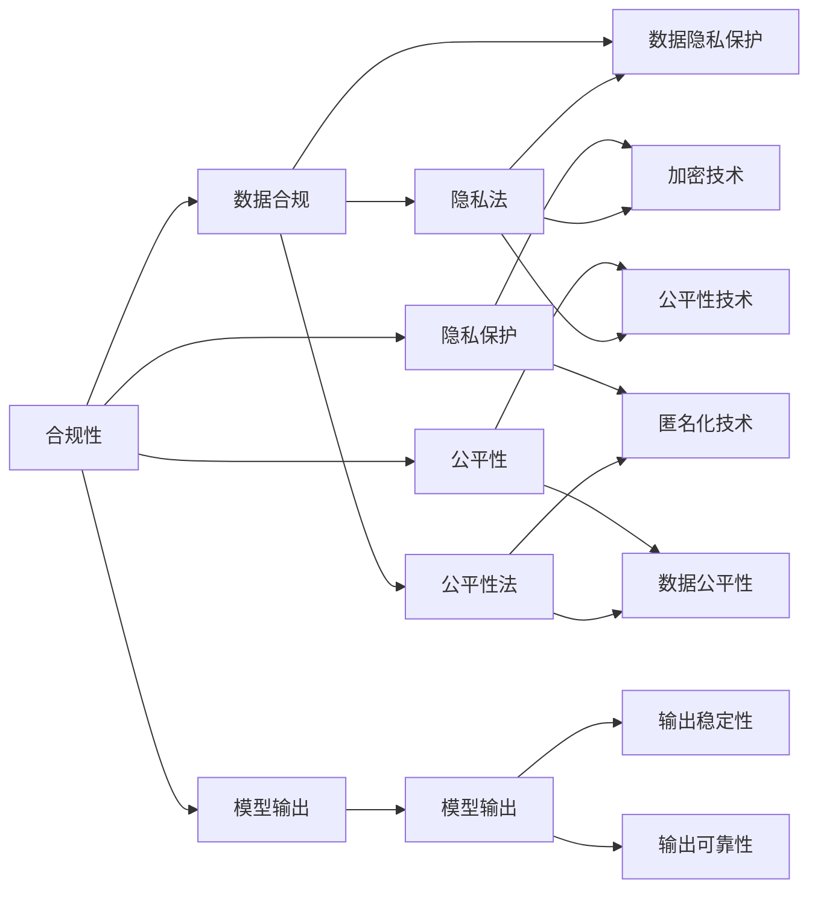
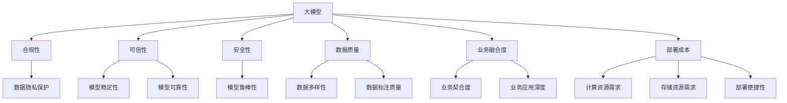

                 

## 1. 背景介绍

### 1.1 问题由来

近年来，大模型在多个领域的应用已取得显著进展。然而，将大模型从研究实验室推向产业应用并非易事。实际落地过程中，大模型面临诸多挑战，如合规可信问题、模型安全性、数据质量、业务深度融合以及部署成本等。这些问题的有效解决是大模型产业落地的关键。本文将围绕这五大问题展开深入探讨，提供有针对性的解决策略，以促进大模型技术的规模化应用。

### 1.2 问题核心关键点

当前，大模型产业落地所面临的五大核心问题是：

1. **合规可信问题**：模型训练、使用和输出的合规性，以及模型的可信赖性。
2. **模型安全问题**：模型对抗攻击的鲁棒性，以及模型私隐保护。
3. **数据质量问题**：模型训练数据的多样性、质量和分布，确保模型的泛化能力。
4. **业务深度融合问题**：模型与业务需求的契合度，以及模型在业务场景中的应用深度。
5. **部署成本问题**：模型的计算资源需求、存储需求以及部署的便捷性。

这些问题的有效解决，将直接关系到大模型技术的实际应用效果和落地效率。

## 2. 核心概念与联系

### 2.1 核心概念概述

为更好地理解这五大问题的解决策略，本节将介绍几个关键概念：

- **合规性**：指模型遵守法律法规和伦理规范的程度，包括数据隐私、公平性等。
- **可信性**：指模型输出的稳定性和可靠性，避免由于模型训练、数据偏差等问题导致的错误输出。
- **安全性**：指模型在面对对抗攻击和恶意输入时，能够保持正常工作的能力。
- **数据质量**：指用于训练模型的数据的丰富性和多样性，以及数据的标注质量和分布情况。
- **业务融合度**：指模型与具体业务场景的契合程度，以及模型在业务中的应用深度和广度。
- **部署成本**：指模型在实际部署过程中所需的计算资源、存储资源和部署难度。

### 2.2 概念间的关系

这些核心概念之间的关系可以通过以下Mermaid流程图来展示：

这个流程图展示了合规性、可信性、安全性、数据质量、业务融合度和部署成本之间的关系。合规性涉及数据隐私和公平性，安全性关注模型对抗攻击的鲁棒性，数据质量关注数据的多样性和标注质量，业务融合度关注模型与具体业务场景的契合度，部署成本则关注模型的资源需求和部署便捷性。

### 2.3 核心概念的整体架构

最后，我们用一个综合的流程图来展示这些核心概念在大模型产业落地过程中的整体架构：

这个综合流程图展示了从大模型到最终产业落地的整体架构，涵盖了合规性、可信性、安全性、数据质量、业务融合度和部署成本的各个方面。通过这个架构，我们可以更清晰地理解大模型产业落地的复杂性和系统性。

## 3. 核心算法原理 & 具体操作步骤

### 3.1 算法原理概述

解决大模型产业落地问题的算法原理，主要围绕模型的合规性、可信性、安全性、数据质量、业务融合度和部署成本进行设计。具体而言：

- **合规性**：通过法律合规性检查、数据隐私保护等技术，确保模型符合法律法规要求。
- **可信性**：通过模型稳定性、可靠性等指标评估，确保模型输出的稳定性和可靠性。
- **安全性**：通过对抗攻击检测、模型鲁棒性提升等技术，提高模型对对抗攻击的鲁棒性。
- **数据质量**：通过数据清洗、数据增强等技术，提高训练数据的多样性和标注质量。
- **业务融合度**：通过模型微调、特征工程等技术，增强模型与具体业务场景的契合度。
- **部署成本**：通过模型压缩、模型优化等技术，降低模型的计算和存储需求。

### 3.2 算法步骤详解

以下是解决上述五大问题的详细步骤：

#### 3.2.1 合规性

1. **数据合规性检查**：
   - 使用隐私保护技术（如差分隐私、联邦学习）对训练数据进行处理，确保数据隐私。
   - 定期进行合规性审计，检查数据使用和处理是否符合法律法规。

2. **隐私保护**：
   - 使用加密技术（如同态加密、差分隐私）保护数据隐私。
   - 采用匿名化技术（如数据脱敏、混淆技术）对数据进行处理。

#### 3.2.2 可信性

1. **模型稳定性**：
   - 使用正则化技术（如L2正则、Dropout）防止过拟合。
   - 进行充分的数据增强，提高模型泛化能力。

2. **模型可靠性**：
   - 进行充分的数据清洗，去除异常数据和噪声。
   - 使用对抗训练技术（如FGM、PGD）提高模型鲁棒性。

#### 3.2.3 安全性

1. **对抗攻击检测**：
   - 使用对抗样本检测技术（如QAT、RobustNet）识别和防御对抗攻击。
   - 定期更新模型，应对新的攻击技术。

2. **模型鲁棒性提升**：
   - 使用对抗训练技术（如PGD、FGM）提高模型对对抗攻击的鲁棒性。
   - 引入模型对抗训练方法（如Gradient Masking、AdvProp）增强模型鲁棒性。

#### 3.2.4 数据质量

1. **数据清洗**：
   - 使用数据清洗技术（如缺失值处理、异常值检测）对数据进行清洗。
   - 去除重复和冗余数据，提高数据质量。

2. **数据增强**：
   - 使用数据增强技术（如数据回译、数据扩增）提高训练数据的多样性。
   - 引入数据生成技术（如GAN、VAE）生成更多样化的训练数据。

#### 3.2.5 业务融合度

1. **模型微调**：
   - 根据具体业务需求，对模型进行微调，增强模型在特定任务上的表现。
   - 使用特征工程（如特征提取、特征选择）优化模型输入特征。

2. **业务场景适配**：
   - 对模型进行业务场景适配，确保模型在实际应用中的性能和效果。
   - 引入业务规则，增强模型对业务逻辑的契合度。

#### 3.2.6 部署成本

1. **模型压缩**：
   - 使用模型压缩技术（如知识蒸馏、剪枝）减小模型参数量。
   - 引入量化加速技术（如整数量化、混合精度训练）降低计算资源需求。

2. **部署优化**：
   - 使用模型并行技术（如TPU、GPU）提高模型推理速度。
   - 使用模型服务化封装技术（如RESTful API、Docker容器）简化部署过程。

### 3.3 算法优缺点

解决大模型产业落地问题的算法具备以下优点：

- **系统性**：覆盖了模型从训练到部署的各个环节，确保模型合规、可信、安全和高效。
- **灵活性**：能够根据不同业务场景进行定制化优化，提高模型应用效果。
- **可扩展性**：随着技术发展，算法可以不断更新和改进，以适应新的挑战。

同时，算法也存在以下缺点：

- **复杂性**：算法涉及多个环节和技术，需要综合考虑多个因素，实施难度较大。
- **成本高**：一些技术（如隐私保护、对抗攻击检测）需要高成本的硬件支持和专业知识。
- **实施周期长**：实施过程中需要进行多次迭代和优化，耗时较长。

### 3.4 算法应用领域

这些算法原则上适用于多个领域，包括医疗、金融、电商、客服等。每个领域的应用场景和需求不同，但算法的基本框架和核心思想相同。

## 4. 数学模型和公式 & 详细讲解  
### 4.1 数学模型构建

#### 4.1.1 数据合规性

假设训练数据集为 $D=\{(x_i,y_i)\}_{i=1}^N$，其中 $x_i$ 为输入，$y_i$ 为标签。数据合规性检查可以表示为以下数学模型：

$$
\min_{x_i} \sum_{i=1}^N \ell(x_i, y_i) + \lambda \sum_{i=1}^N \alpha_i \Omega(x_i)
$$

其中 $\ell$ 为损失函数，$\alpha_i$ 为正则化系数，$\Omega(x_i)$ 为合规性检查函数，$\lambda$ 为正则化系数。

#### 4.1.2 隐私保护

使用差分隐私技术（DP）对数据进行隐私保护。DP隐私保护可以表示为以下数学模型：

$$
\min_{\epsilon} \sum_{i=1}^N \ell(x_i, y_i) + \epsilon \cdot \Omega(x_i)
$$

其中 $\epsilon$ 为隐私预算，$\Omega(x_i)$ 为隐私保护函数。

#### 4.1.3 模型稳定性

使用正则化技术（L2正则）对模型进行稳定性优化。正则化可以表示为以下数学模型：

$$
\min_{\theta} \sum_{i=1}^N \ell(x_i, M_{\theta}(x_i)) + \lambda \sum_{k=1}^d \theta_k^2
$$

其中 $\theta$ 为模型参数，$d$ 为模型参数总数，$\lambda$ 为正则化系数。

#### 4.1.4 模型可靠性

使用对抗训练技术（PGD）对模型进行可靠性优化。对抗训练可以表示为以下数学模型：

$$
\min_{\theta} \sum_{i=1}^N \ell(x_i, M_{\theta}(x_i)) + \lambda \sum_{k=1}^d \theta_k^2
$$

其中 $\theta$ 为模型参数，$d$ 为模型参数总数，$\lambda$ 为正则化系数。

#### 4.1.5 数据质量

使用数据增强技术（数据回译）对数据进行质量优化。数据增强可以表示为以下数学模型：

$$
\min_{x_i} \sum_{i=1}^N \ell(x_i, y_i) + \lambda \sum_{i=1}^N \Omega(x_i)
$$

其中 $\ell$ 为损失函数，$\alpha_i$ 为正则化系数，$\Omega(x_i)$ 为数据质量检查函数，$\lambda$ 为正则化系数。

#### 4.1.6 业务融合度

使用模型微调技术对模型进行融合度优化。模型微调可以表示为以下数学模型：

$$
\min_{\theta} \sum_{i=1}^N \ell(x_i, M_{\theta}(x_i)) + \lambda \sum_{k=1}^d \theta_k^2
$$

其中 $\theta$ 为模型参数，$d$ 为模型参数总数，$\lambda$ 为正则化系数。

#### 4.1.7 部署成本

使用模型压缩技术对模型进行成本优化。模型压缩可以表示为以下数学模型：

$$
\min_{\theta} \sum_{i=1}^N \ell(x_i, M_{\theta}(x_i)) + \lambda \sum_{k=1}^d \theta_k^2
$$

其中 $\theta$ 为模型参数，$d$ 为模型参数总数，$\lambda$ 为正则化系数。

### 4.2 公式推导过程

以下对每个数学模型的推导过程进行详细讲解：

#### 4.2.1 数据合规性

1. **隐私保护**：
   - 使用差分隐私技术（DP）对数据进行隐私保护。隐私保护可以表示为：

   $$
   \min_{\epsilon} \sum_{i=1}^N \ell(x_i, y_i) + \epsilon \cdot \Omega(x_i)
   $$

   其中 $\epsilon$ 为隐私预算，$\Omega(x_i)$ 为隐私保护函数。

   推导过程：假设训练数据集为 $D=\{(x_i,y_i)\}_{i=1}^N$，其中 $x_i$ 为输入，$y_i$ 为标签。隐私保护目标函数为：

   $$
   \min_{\epsilon} \sum_{i=1}^N \ell(x_i, y_i) + \epsilon \cdot \Omega(x_i)
   $$

   其中 $\ell(x_i, y_i)$ 为损失函数，$\Omega(x_i)$ 为隐私保护函数，$\epsilon$ 为隐私预算。

2. **合规性检查**：
   - 使用合规性检查技术对数据进行合规性检查。合规性检查可以表示为：

   $$
   \min_{x_i} \sum_{i=1}^N \ell(x_i, y_i) + \lambda \sum_{i=1}^N \alpha_i \Omega(x_i)
   $$

   其中 $\ell$ 为损失函数，$\alpha_i$ 为正则化系数，$\Omega(x_i)$ 为合规性检查函数，$\lambda$ 为正则化系数。

   推导过程：假设训练数据集为 $D=\{(x_i,y_i)\}_{i=1}^N$，其中 $x_i$ 为输入，$y_i$ 为标签。合规性检查目标函数为：

   $$
   \min_{x_i} \sum_{i=1}^N \ell(x_i, y_i) + \lambda \sum_{i=1}^N \alpha_i \Omega(x_i)
   $$

   其中 $\ell(x_i, y_i)$ 为损失函数，$\alpha_i$ 为正则化系数，$\Omega(x_i)$ 为合规性检查函数，$\lambda$ 为正则化系数。

#### 4.2.2 隐私保护

1. **隐私保护**：
   - 使用差分隐私技术（DP）对数据进行隐私保护。隐私保护可以表示为：

   $$
   \min_{\epsilon} \sum_{i=1}^N \ell(x_i, y_i) + \epsilon \cdot \Omega(x_i)
   $$

   其中 $\epsilon$ 为隐私预算，$\Omega(x_i)$ 为隐私保护函数。

   推导过程：假设训练数据集为 $D=\{(x_i,y_i)\}_{i=1}^N$，其中 $x_i$ 为输入，$y_i$ 为标签。隐私保护目标函数为：

   $$
   \min_{\epsilon} \sum_{i=1}^N \ell(x_i, y_i) + \epsilon \cdot \Omega(x_i)
   $$

   其中 $\ell(x_i, y_i)$ 为损失函数，$\epsilon$ 为隐私预算，$\Omega(x_i)$ 为隐私保护函数。

2. **合规性检查**：
   - 使用合规性检查技术对数据进行合规性检查。合规性检查可以表示为：

   $$
   \min_{x_i} \sum_{i=1}^N \ell(x_i, y_i) + \lambda \sum_{i=1}^N \alpha_i \Omega(x_i)
   $$

   其中 $\ell$ 为损失函数，$\alpha_i$ 为正则化系数，$\Omega(x_i)$ 为合规性检查函数，$\lambda$ 为正则化系数。

   推导过程：假设训练数据集为 $D=\{(x_i,y_i)\}_{i=1}^N$，其中 $x_i$ 为输入，$y_i$ 为标签。合规性检查目标函数为：

   $$
   \min_{x_i} \sum_{i=1}^N \ell(x_i, y_i) + \lambda \sum_{i=1}^N \alpha_i \Omega(x_i)
   $$

   其中 $\ell(x_i, y_i)$ 为损失函数，$\alpha_i$ 为正则化系数，$\Omega(x_i)$ 为合规性检查函数，$\lambda$ 为正则化系数。

#### 4.2.3 模型稳定性

1. **模型稳定性**：
   - 使用正则化技术（L2正则）对模型进行稳定性优化。正则化可以表示为：

   $$
   \min_{\theta} \sum_{i=1}^N \ell(x_i, M_{\theta}(x_i)) + \lambda \sum_{k=1}^d \theta_k^2
   $$

   其中 $\theta$ 为模型参数，$d$ 为模型参数总数，$\lambda$ 为正则化系数。

   推导过程：假设训练数据集为 $D=\{(x_i,y_i)\}_{i=1}^N$，其中 $x_i$ 为输入，$y_i$ 为标签。模型稳定性目标函数为：

   $$
   \min_{\theta} \sum_{i=1}^N \ell(x_i, M_{\theta}(x_i)) + \lambda \sum_{k=1}^d \theta_k^2
   $$

   其中 $\ell(x_i, y_i)$ 为损失函数，$\theta$ 为模型参数，$d$ 为模型参数总数，$\lambda$ 为正则化系数。

2. **模型可靠性**：
   - 使用对抗训练技术（PGD）对模型进行可靠性优化。对抗训练可以表示为：

   $$
   \min_{\theta} \sum_{i=1}^N \ell(x_i, M_{\theta}(x_i)) + \lambda \sum_{k=1}^d \theta_k^2
   $$

   其中 $\theta$ 为模型参数，$d$ 为模型参数总数，$\lambda$ 为正则化系数。

   推导过程：假设训练数据集为 $D=\{(x_i,y_i)\}_{i=1}^N$，其中 $x_i$ 为输入，$y_i$ 为标签。模型可靠性目标函数为：

   $$
   \min_{\theta} \sum_{i=1}^N \ell(x_i, M_{\theta}(x_i)) + \lambda \sum_{k=1}^d \theta_k^2
   $$

   其中 $\ell(x_i, y_i)$ 为损失函数，$\theta$ 为模型参数，$d$ 为模型参数总数，$\lambda$ 为正则化系数。

#### 4.2.4 数据质量

1. **数据清洗**：
   - 使用数据清洗技术（如缺失值处理、异常值检测）对数据进行清洗。数据清洗可以表示为：

   $$
   \min_{x_i} \sum_{i=1}^N \ell(x_i, y_i) + \lambda \sum_{i=1}^N \Omega(x_i)
   $$

   其中 $\ell$ 为损失函数，$\alpha_i$ 为正则化系数，$\Omega(x_i)$ 为数据质量检查函数，$\lambda$ 为正则化系数。

   推导过程：假设训练数据集为 $D=\{(x_i,y_i)\}_{i=1}^N$，其中 $x_i$ 为输入，$y_i$ 为标签。数据清洗目标函数为：

   $$
   \min_{x_i} \sum_{i=1}^N \ell(x_i, y_i) + \lambda \sum_{i=1}^N \Omega(x_i)
   $$

   其中 $\ell(x_i, y_i)$ 为损失函数，$\alpha_i$ 为正则化系数，$\Omega(x_i)$ 为数据质量检查函数，$\lambda$ 为正则化系数。

2. **数据增强**：
   - 使用数据增强技术（如数据回译、数据扩增）对数据进行质量优化。数据增强可以表示为：

   $$
   \min_{x_i} \sum_{i=1}^N \ell(x_i, y_i) + \lambda \sum_{i=1}^N \Omega(x_i)
   $$

   其中 $\ell$ 为损失函数，$\alpha_i$ 为正则化系数，$\Omega(x_i)$ 为数据质量检查函数，$\lambda$ 为正则化系数。

   推导过程：假设训练数据集为 $D=\{(x_i,y_i)\}_{i=1}^N$，其中 $x_i$ 为输入，$y_i$ 为标签。数据增强目标函数为：

   $$
   \min_{x_i} \sum_{i=1}^N \ell(x_i, y_i) + \lambda \sum_{i=1}^N \Omega(x_i)
   $$

   其中 $\ell(x_i, y_i)$ 为损失函数，$\alpha_i$ 为正则化系数，$\Omega(x_i)$ 为数据质量检查函数，$\lambda$ 为正则化系数。

#### 4.2.5 业务融合度

1. **模型微调**：
   - 使用模型微调技术对模型进行融合度优化。模型微调可以表示为：

   $$
   \min_{\theta} \sum_{i=1}^N \ell(x_i, M_{\theta}(x_i)) + \lambda \sum_{k=1}^d \theta_k^2
   $$

   其中 $\theta$ 为模型参数，$d$ 为模型参数总数，$\lambda$ 为正则化系数。

   推导过程：假设训练数据集为 $D=\{(x_i,y_i)\}_{i=1}^N$，其中 $x_i$ 为输入，$y_i$ 为标签。模型微调目标函数为：

   $$
   \min_{\theta} \sum_{i=1}^N \ell(x_i, M_{\theta}(x_i)) + \lambda \sum_{k=1}^d \theta_k^2
   $$

   其中 $\ell(x_i, y_i)$ 为损失函数，$\theta$ 为模型参数，$d$ 为模型参数总数，$\lambda$ 为正则化系数。

2. **业务场景适配**：
   - 使用业务场景适配技术对模型进行适配。业务场景适配可以表示为：

   $$
   \min_{\theta} \sum_{i=1}^N \ell(x_i, M_{\theta}(x_i)) + \lambda \sum_{k=1}^d \theta_k^2
   $$

   其中 $\theta$ 为模型参数，$d$ 为模型参数总数，$\lambda$ 为正则化系数。

   推导过程：假设训练数据集为 $D=\{(x_i,y_i)\}_{i=1}^N$，其中 $x_i$ 为输入，$y_i$ 为标签。业务场景适配目标函数为：

   $$
   \min_{\theta} \sum_{i=1}^N \ell(x_i, M_{\theta}(x_i)) + \lambda \sum_{k=1}^d \theta_k^2
   $$

   其中 $\ell(x_i, y_i)$ 为损失函数，$\theta$ 为模型参数，$d$ 为模型参数总数，$\lambda$ 为正则化系数。

#### 4.2.6 部署成本

1. **模型压缩**：
   - 使用模型压缩技术对模型进行成本优化。模型压缩可以表示为：

   $$
   \min_{\theta} \sum_{i=1}^N \ell(x_i, M_{\theta}(x_i)) + \lambda \sum_{k=1}^d \theta_k^2
   $$

   其中 $\theta$ 为模型参数，$d$ 为模型参数总数，$\lambda$ 为正则化系数。

   推导过程：假设训练数据集为 $D=\{(x_i,y_i)\}_{i=1}^N$，其中 $x_i$ 为输入，$y_i

