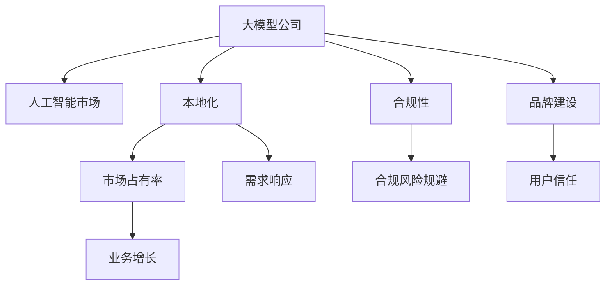
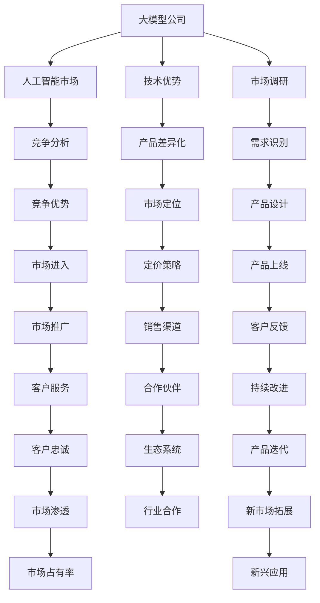
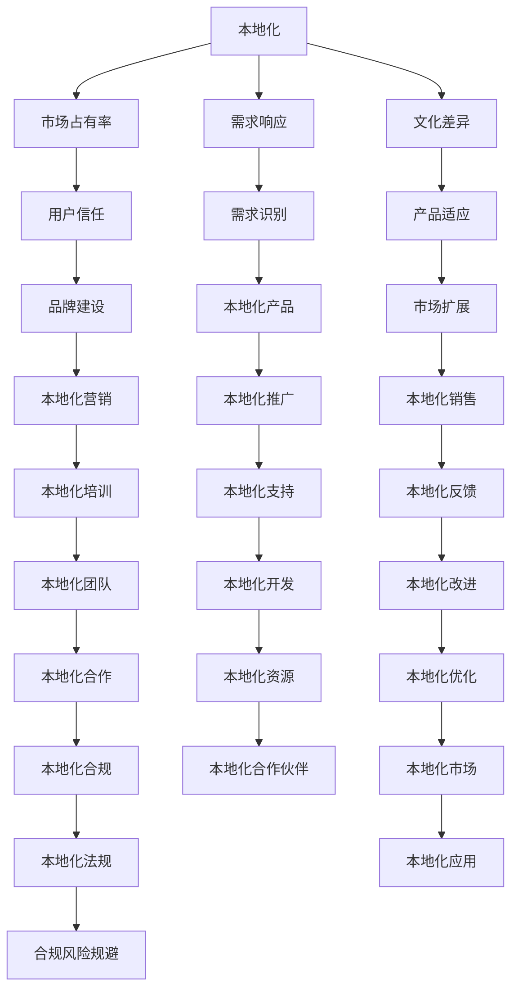

                 

## 1. 背景介绍

### 1.1 问题由来
中国作为全球最大的人工智能市场，伴随着经济发展和数字化转型的加速，对于大模型公司的需求日益增加。然而，与美国市场相比，中国在人工智能技术和应用层面上还存在一定差距。大模型公司如何在中国市场获得竞争优势，成为摆在他们面前的重大挑战。

### 1.2 问题核心关键点
1. **技术壁垒与市场竞争**：中国市场竞争激烈，许多本地公司和国际巨头都在争相布局大模型市场，对技术要求非常高。
2. **政策法规与伦理问题**：中国政府对于AI技术的监管较为严格，需要符合合规性要求。同时，社会对于AI伦理的关注度也在提升，公司需要在技术应用中体现社会责任感。
3. **数据来源与隐私保护**：中国数据隐私保护法律严格，公司在获取和利用数据时需要格外谨慎。
4. **本地化定制需求**：中国市场的需求具有高度的本地化特征，大模型公司需要针对本地市场特点进行定制开发。
5. **用户信任与品牌建设**：中国用户对于AI技术的接受度和信任度仍有提升空间，品牌建设显得尤为重要。

### 1.3 问题研究意义
研究大模型公司在中国市场策略，对于提升公司的市场竞争力、满足本地化需求、构建用户信任具有重要意义：

1. **市场占有率提升**：通过优化技术策略和市场布局，大模型公司可以更有效地在中国市场立足。
2. **需求响应能力增强**：了解本地市场需求，快速迭代产品，增强用户黏性和市场竞争力。
3. **合规风险规避**：通过遵守法律法规，规避合规风险，提升公司品牌形象。
4. **品牌价值提升**：构建良好的品牌形象，增强用户信任，提升市场份额。
5. **业务增长加速**：合理策略将加速公司的业务增长和市场拓展。

## 2. 核心概念与联系

### 2.1 核心概念概述

为了更好地理解大模型公司在中国市场的策略，本节将介绍几个关键概念：

- **大模型公司**：指那些提供深度学习大模型服务的公司，如OpenAI、Google、微软、阿里云、腾讯AI等。
- **人工智能市场**：指人工智能技术应用、解决方案及服务等市场，包括计算机视觉、语音识别、自然语言处理等。
- **本地化**：指产品或服务针对特定地区或国家文化、语言、法律、习惯等的调整和优化。
- **合规性**：指符合国家法律法规和行业标准，确保技术应用的合法性和安全性。
- **品牌建设**：指通过市场推广、客户服务、技术创新等方式，提升品牌知名度和美誉度。

这些核心概念之间的逻辑关系可以通过以下Mermaid流程图来展示：



这个流程图展示了大模型公司在人工智能市场面临的核心挑战和应对策略：

1. 大模型公司通过本地化和合规性策略提升市场占有率和需求响应能力。
2. 品牌建设提升用户信任和业务增长。
3. 合规性规避风险，确保合法合规。

### 2.2 概念间的关系

这些核心概念之间存在着紧密的联系，形成了大模型公司在中国市场策略的整体框架。下面我通过几个Mermaid流程图来展示这些概念之间的关系。

#### 2.2.1 大模型公司的市场策略



这个流程图展示了大模型公司在人工智能市场的主要策略流程：

1. 大模型公司基于技术优势和市场调研，设计差异化产品并进行市场定位。
2. 识别市场需求，进行产品设计和市场推广。
3. 进入市场后，持续改进产品以提升市场占有率和客户忠诚度。
4. 构建生态系统和行业合作，开拓新市场。

#### 2.2.2 本地化策略



这个流程图展示了大模型公司本地化策略的实施过程：

1. 基于文化差异和市场需求识别，开发适应本地市场的本地化产品。
2. 通过本地化营销和培训，提升用户信任和品牌建设。
3. 在本地化资源和合规性保障下，进行本地化推广和销售。
4. 持续改进本地化产品和服务，优化本地化市场。

#### 2.2.3 合规性策略

```mermaid
graph TB
    A[合规性] --> B[合规风险规避]
    A --> C[法律法规]
    A --> D[行业标准]
    B --> E[业务增长]
    C --> F[合规评估]
    D --> G[合规检测]
    E --> H[业务合规]
    F --> I[合规优化]
    G --> J[合规验证]
    H --> K[合规培训]
    I --> L[合规策略]
    J --> M[合规执行]
    K --> N[合规宣传]
    L --> O[合规报告]
    M --> P[合规审核]
    N --> Q[合规团队]
    O --> R[合规监控]
    P --> S[合规改进]
    Q --> T[合规人员]
    R --> U[合规审计]
    S --> V[合规记录]
    T --> W[合规沟通]
    U --> X[合规评估]
    V --> Y[合规文档]
    W --> Z[合规反馈]
    X --> AA[合规更新]
    Y --> BB[合规教育]
    Z --> CC[合规改进]
    AA --> DD[合规实施]
    BB --> EE[合规培训]
    CC --> FF[合规系统]
    DD --> GG[合规记录]
    EE --> HH[合规流程]
    FF --> II[合规评估]
    GG --> JJ[合规审核]
    HH --> KK[合规监控]
    II --> LL[合规改进]
    JJ --> MM[合规审核]
    KK --> NN[合规报告]
    LL --> oo[合规更新]
    MM --> pp[合规系统]
    NN --> qq[合规教育]
    oo --> rr[合规流程]
    pp --> ss[合规评估]
    qq --> tt[合规监控]
    rr --> uu[合规改进]
    ss --> vv[合规审核]
    tt --> ww[合规报告]
    uu --> xx[合规记录]
    ww --> yy[合规反馈]
    xx --> zz[合规文档]
    yy --> aa[合规教育]
    zz --> bb[合规流程]
    aa --> cc[合规评估]
    bb --> dd[合规监控]
    cc --> ee[合规改进]
    dd --> ff[合规审核]
    ee --> gg[合规报告]
    ff --> hh[合规系统]
    gg --> ii[合规记录]
    hh --> jj[合规流程]
    ii --> kk[合规评估]
    jj --> ll[合规监控]
    kk --> mm[合规改进]
    ll --> nn[合规审核]
    mm --> oo[合规报告]
    nn --> pp[合规系统]
    oo --> qq[合规记录]
    pp --> rr[合规流程]
    qq --> ss[合规评估]
    rr --> tt[合规监控]
    ss --> uu[合规改进]
    tt --> vv[合规审核]
    uu --> ww[合规报告]
    vv --> xx[合规系统]
    ww --> yy[合规记录]
    xx --> zz[合规流程]
    yy --> aa[合规评估]
    zz --> bb[合规监控]
    aa --> cc[合规改进]
    bb --> dd[合规审核]
    cc --> ee[合规报告]
    dd --> ff[合规系统]
    ee --> gg[合规记录]
    ff --> hh[合规流程]
    gg --> ii[合规评估]
    hh --> jj[合规监控]
    ii --> kk[合规改进]
    jj --> ll[合规审核]
    kk --> mm[合规报告]
    ll --> nn[合规系统]
    mm --> oo[合规记录]
    nn --> pp[合规流程]
    oo --> qq[合规评估]
    pp --> rr[合规监控]
    qq --> ss[合规改进]
    rr --> tt[合规审核]
    ss --> uu[合规报告]
    tt --> vv[合规系统]
    uu --> ww[合规记录]
    vv --> xx[合规流程]
    ww --> yy[合规评估]
    xx --> zz[合规监控]
    yy --> aa[合规改进]
    zz --> bb[合规审核]
    aa --> cc[合规报告]
    bb --> dd[合规系统]
    cc --> ee[合规记录]
    dd --> ff[合规流程]
    ee --> gg[合规评估]
    ff --> hh[合规监控]
    gg --> ii[合规改进]
    hh --> jj[合规审核]
    ii --> kk[合规报告]
    jj --> ll[合规系统]
    kk --> mm[合规记录]
    ll --> nn[合规流程]
    mm --> oo[合规评估]
    nn --> pp[合规监控]
    oo --> qq[合规改进]
    pp --> rr[合规审核]
    qq --> ss[合规报告]
    rr --> tt[合规系统]
    ss --> uu[合规记录]
    tt --> vv[合规流程]
    uu --> ww[合规评估]
    vv --> xx[合规监控]
    ww --> yy[合规改进]
    xx --> zz[合规审核]
    yy --> aa[合规报告]
    zz --> bb[合规系统]
    aa --> cc[合规记录]
    bb --> dd[合规流程]
    cc --> ee[合规评估]
    dd --> ff[合规监控]
    ee --> gg[合规改进]
    ff --> hh[合规审核]
    gg --> ii[合规报告]
    hh --> jj[合规系统]
    ii --> kk[合规记录]
    jj --> ll[合规流程]
    kk --> mm[合规评估]
    ll --> nn[合规监控]
    mm --> oo[合规改进]
    nn --> pp[合规审核]
    oo --> qq[合规报告]
    pp --> rr[合规系统]
    qq --> ss[合规记录]
    rr --> tt[合规流程]
    ss --> uu[合规评估]
    tt --> vv[合规监控]
    uu --> ww[合规改进]
    vv --> xx[合规审核]
    ww --> yy[合规报告]
    xx --> zz[合规系统]
    yy --> aa[合规记录]
    zz --> bb[合规流程]
    aa --> cc[合规评估]
    bb --> dd[合规监控]
    cc --> ee[合规改进]
    dd --> ff[合规审核]
    ee --> gg[合规报告]
    ff --> hh[合规系统]
    gg --> ii[合规记录]
    hh --> jj[合规流程]
    ii --> kk[合规评估]
    jj --> ll[合规监控]
    kk --> mm[合规改进]
    ll --> nn[合规审核]
    mm --> oo[合规报告]
    nn --> pp[合规系统]
    oo --> qq[合规记录]
    pp --> rr[合规流程]
    qq --> ss[合规评估]
    rr --> tt[合规监控]
    ss --> uu[合规改进]
    tt --> vv[合规审核]
    uu --> ww[合规报告]
    vv --> xx[合规系统]
    ww --> yy[合规记录]
    xx --> zz[合规流程]
    yy --> aa[合规评估]
    zz --> bb[合规监控]
    aa --> cc[合规改进]
    bb --> dd[合规审核]
    cc --> ee[合规报告]
    dd --> ff[合规系统]
    ee --> gg[合规记录]
    ff --> hh[合规流程]
    gg --> ii[合规评估]
    hh --> jj[合规监控]
    ii --> kk[合规改进]
    jj --> ll[合规审核]
    kk --> mm[合规报告]
    ll --> nn[合规系统]
    mm --> oo[合规记录]
    nn --> pp[合规流程]
    oo --> qq[合规评估]
    pp --> rr[合规监控]
    qq --> ss[合规改进]
    rr --> tt[合规审核]
    ss --> uu[合规报告]
    tt --> vv[合规系统]
    uu --> ww[合规记录]
    vv --> xx[合规流程]
    ww --> yy[合规评估]
    xx --> zz[合规监控]
    yy --> aa[合规改进]
    zz --> bb[合规审核]
    aa --> cc[合规报告]
    bb --> dd[合规系统]
    cc --> ee[合规记录]
    dd --> ff[合规流程]
    ee --> gg[合规评估]
    ff --> hh[合规监控]
    gg --> ii[合规改进]
    hh --> jj[合规审核]
    ii --> kk[合规报告]
    jj --> ll[合规系统]
    kk --> mm[合规记录]
    ll --> nn[合规流程]
    mm --> oo[合规评估]
    nn --> pp[合规监控]
    oo --> qq[合规改进]
    pp --> rr[合规审核]
    qq --> ss[合规报告]
    rr --> tt[合规系统]
    ss --> uu[合规记录]
    tt --> vv[合规流程]
    uu --> ww[合规评估]
    vv --> xx[合规监控]
    ww --> yy[合规改进]
    xx --> zz[合规审核]
    yy --> aa[合规报告]
    zz --> bb[合规系统]
    aa --> cc[合规记录]
    bb --> dd[合规流程]
    cc --> ee[合规评估]
    dd --> ff[合规监控]
    ee --> gg[合规改进]
    ff --> hh[合规审核]
    gg --> ii[合规报告]
    hh --> jj[合规系统]
    ii --> kk[合规记录]
    jj --> ll[合规流程]
    kk --> mm[合规评估]
    ll --> nn[合规监控]
    mm --> oo[合规改进]
    nn --> pp[合规审核]
    oo --> qq[合规报告]
    pp --> rr[合规系统]
    qq --> ss[合规记录]
    rr --> tt[合规流程]
    ss --> uu[合规评估]
    tt --> vv[合规监控]
    uu --> ww[合规改进]
    vv --> xx[合规审核]
    ww --> yy[合规报告]
    xx --> zz[合规系统]
    yy --> aa[合规记录]
    zz --> bb[合规流程]
    aa --> cc[合规评估]
    bb --> dd[合规监控]
    cc --> ee[合规改进]
    dd --> ff[合规审核]
    ee --> gg[合规报告]
    ff --> hh[合规系统]
    gg --> ii[合规记录]
    hh --> jj[合规流程]
    ii --> kk[合规评估]
    jj --> ll[合规监控]
    kk --> mm[合规改进]
    ll --> nn[合规审核]
    mm --> oo[合规报告]
    nn --> pp[合规系统]
    oo --> qq[合规记录]
    pp --> rr[合规流程]
    qq --> ss[合规评估]
    rr --> tt[合规监控]
    ss --> uu[合规改进]
    tt --> vv[合规审核]
    uu --> ww[合规报告]
    vv --> xx[合规系统]
    ww --> yy[合规记录]
    xx --> zz[合规流程]
    yy --> aa[合规评估]
    zz --> bb[合规监控]
    aa --> cc[合规改进]
    bb --> dd[合规审核]
    cc --> ee[合规报告]
    dd --> ff[合规系统]
    ee --> gg[合规记录]
    ff --> hh[合规流程]
    gg --> ii[合规评估]
    hh --> jj[合规监控]
    ii --> kk[合规改进]
    jj --> ll[合规审核]
    kk --> mm[合规报告]
    ll --> nn[合规系统]
    mm --> oo[合规记录]
    nn --> pp[合规流程]
    oo --> qq[合规评估]
    pp --> rr[合规监控]
    qq --> ss[合规改进]
    rr --> tt[合规审核]
    ss --> uu[合规报告]
    tt --> vv[合规系统]
    uu --> ww[合规记录]
    vv --> xx[合规流程]
    ww --> yy[合规评估]
    xx --> zz[合规监控]
    yy --> aa[合规改进]
    zz --> bb[合规审核]
    aa --> cc[合规报告]
    bb --> dd[合规系统]
    cc --> ee[合规记录]
    dd --> ff[合规流程]
    ee --> gg[合规评估]
    ff --> hh[合规监控]
    gg --> ii[合规改进]
    hh --> jj[合规审核]
    ii --> kk[合规报告]
    jj --> ll[合规系统]
    kk --> mm[合规记录]
    ll --> nn[合规流程]
    mm --> oo[合规评估]
    nn --> pp[合规监控]
    oo --> qq[合规改进]
    pp --> rr[合规审核]
    qq --> ss[合规报告]
    rr --> tt[合规系统]
    ss --> uu[合规记录]
    tt --> vv[合规流程]
    uu --> ww[合规评估]
    vv --> xx[合规监控]
    ww --> yy[合规改进]
    xx --> zz[合规审核]
    yy --> aa[合规报告]
    zz --> bb[合规系统]
    aa --> cc[合规记录]
    bb --> dd[合规流程]
    cc --> ee[合规评估]
    dd --> ff[合规监控]
    ee --> gg[合规改进]
    ff --> hh[合规审核]
    gg --> ii[合规报告]
    hh --> jj[合规系统]
    ii --> kk[合规记录]
    jj --> ll[合规流程]
    kk --> mm[合规评估]
    ll --> nn[合规监控]
    mm --> oo[合规改进]
    nn --> pp[合规审核]
    oo --> qq[合规报告]
    pp --> rr[合规系统]
    qq --> ss[合规记录]
    rr --> tt[合规流程]
    ss --> uu[合规评估]
    tt --> vv[合规监控]
    uu --> ww[合规改进]
    vv --> xx[合规审核]
    ww --> yy[合规报告]
    xx --> zz[合规系统]
    yy --> aa[合规记录]
    zz --> bb[合规流程]
    aa --> cc[合规评估]
    bb --> dd[合规监控]
    cc --> ee[合规改进]
    dd --> ff[合规审核]
    ee --> gg[合规报告]
    ff --> hh[合规系统]
    gg --> ii[合规记录]
    hh --> jj[合规流程]
    ii --> kk[合规评估]
    jj --> ll[合规监控]
    kk --> mm[合规改进]
    ll --> nn[合规审核]
    mm --> oo[合规报告]
    nn --> pp[合规系统]
    oo --> qq[合规记录]
    pp --> rr[合规流程]
    qq --> ss[合规评估]
    rr --> tt[合规监控]
    ss --> uu[合规改进]
    tt --> vv[合规审核]
    uu --> ww[合规报告]
    vv --> xx[合规系统]
    ww --> yy[合规记录]
    xx --> zz[合规流程]
    yy --> aa[合规评估]
    zz --> bb[合规监控]
    aa --> cc[合规改进]
    bb --> dd[合规审核]
    cc --> ee[合规报告]
    dd --> ff[合规系统]
    ee --> gg[合规记录]
    ff --> hh[合规流程]
    gg --> ii[合规评估]
    hh --> jj[合规监控]
    ii --> kk[合规改进]
    jj --> ll[合规审核]
    kk --> mm[合规报告]
    ll --> nn[合规系统]
    mm --> oo[合规记录]
    nn --> pp[合规流程]
    oo --> qq[合规评估]
    pp --> rr[合规监控]
    qq --> ss[合规改进]
    rr --> tt[合规审核]
    ss --> uu[合规报告]
    tt --> vv[合规系统]
    uu --> ww[合规记录]
    vv --> xx[合规流程]
    ww --> yy[合规评估]
    xx --> zz[合规监控]
    yy --> aa[合规改进]
    zz --> bb[合规审核]
    aa --> cc[合规报告]
    bb --> dd[合规系统]
    cc --> ee[合规记录]
    dd --> ff[合规流程]
    ee --> gg[合规评估]
    ff --> hh[合规监控]
    gg --> ii[合规改进]
    hh --> jj[合规审核]
    ii --> kk[合规报告]
    jj --> ll[合规系统]
    kk --> mm[合规记录]
    ll --> nn[合规流程]
    mm --> oo[合规评估]
    nn --> pp[合规监控]
    oo --> qq[合规改进]
    pp --> rr[合规审核]
    qq --> ss[合规报告]
    rr --> tt[合规系统]
    ss --> uu[合规记录]
    tt --> vv[合规流程]
    uu --> ww[合规评估]
    vv --> xx[合规监控]
    ww --> yy[合规改进]
    xx --> zz[合规审核]
    yy --> aa[合规报告]
    zz --> bb[合规系统]
    aa --> cc[合规记录]
    bb --> dd[合规流程]
    cc --> ee[合规评估]
    dd --> ff[合规监控]
    ee --> gg[合规改进]
    ff --> hh[合规审核]
    gg --> ii[合规报告]
    hh --> jj[合规系统]
    ii --> kk[合规记录]
    jj --> ll[合规流程]
    kk --> mm[合规评估]
    ll --> nn[合规监控]
    mm --> oo[合规改进]
    nn --> pp[合规审核]
    oo --> qq[合规报告]
    pp --> rr[合规系统]
    qq --> ss[合规记录]
    rr --> tt[合规流程]
    ss --> uu[合规评估]
    tt --> vv[合规监控]
    uu --> ww[合规改进]
    vv --> xx[合规审核]
    ww --> yy[合规报告]
    xx --> zz[合规系统]
    yy --> aa[合规记录]
    zz --> bb[合规流程]
    aa --> cc[合规评估]
    bb --> dd[合规监控]
    cc --> ee[合规改进]
    dd --> ff[合规审核]
    ee --> gg[合规报告]
    ff --> hh[合规系统]
    gg --> ii[合规记录]
    hh --> jj[合规流程]
    ii --> kk[合规评估]
    jj --> ll[合规监控]
    kk --> mm[合规改进]
    ll --> nn[合规审核]
    mm --> oo[合规报告]
    nn --> pp[合规系统]
    oo --> qq[合规记录]
    pp --> rr[合规流程]
    qq --> ss[合规评估]
    rr --> tt[合规监控]
    ss --> uu[合规改进]
    tt --> vv[合规审核]
    uu --> ww[合规报告]
    vv --> xx[合规系统]
    ww --> yy[合规记录]
    xx --> zz[合规流程]
    yy --> aa[合规评估]
    zz --> bb[合规监控]
    aa --> cc[合规改进]
    bb --> dd[合规审核]
    cc --> ee[合规报告]
    dd --> ff[合规系统]
    ee --> gg[合规记录]
    ff --> hh[合规流程]
    gg --> ii[合规评估]
    hh --> jj[合规监控]
    ii --> kk[合规改进]
    jj --> ll[合规审核]
    kk --> mm[合规报告]
    ll --> nn[合规系统]
    mm --> oo[合规记录]
    nn --> pp[合规流程]
    oo --> qq[合规评估]
    pp --> rr[合规监控]
    qq --> ss[合规改进]
    rr --> tt[合规审核]
    ss --> uu[合规报告]
    tt --> vv[合规系统]
    uu --> ww[合规记录]
    vv --> xx[合规流程]
    ww --> yy[合规评估]
    xx --> zz[合规监控]
    yy --> aa[合规改进]
    zz --> bb[合规审核]
    aa --> cc[合规报告]
    bb --> dd[合规系统]
    cc --> ee[合规记录]
    dd --> ff[合规流程]
    ee --> gg[合规评估]
    ff --> hh[合规监控]
    gg --> ii[合规改进]
    hh --> jj[合规审核]
    ii --> kk[合规报告]
    jj --> ll[合规系统]
    kk --> mm[合规记录]
    ll --> nn[合规流程]
    mm --> oo[合规评估]
    nn --> pp[合规监控]
    oo --> qq[合规改进]
    pp --> rr[合规审核]
    qq --> ss[合规报告]
    rr --> tt[合规系统]
    ss --> uu[合规记录]
    tt --> vv[合规流程]
    uu --> ww[合规评估]
    vv --> xx[合规监控]
    ww --> yy[

