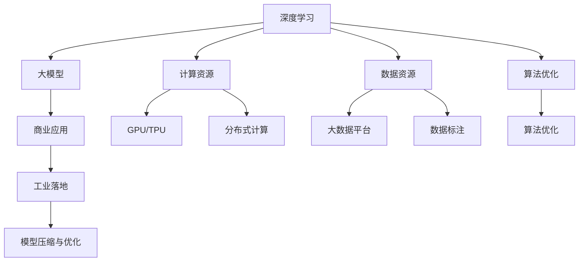
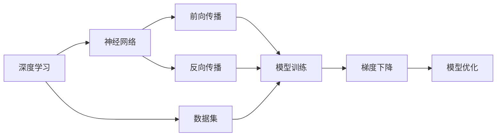

                 

# 大模型：从理论到实践的商业应用

> 关键词：大模型, 深度学习, 人工智能商业应用, 商业案例, 产业落地

## 1. 背景介绍

### 1.1 问题由来
人工智能（AI）正以前所未有的速度改变我们的世界。从自动驾驶到智能推荐，从医疗诊断到金融风险管理，AI技术的应用几乎无处不在。而在所有这些应用中，一个不可或缺的底层技术便是大模型（Large Models）。

大模型，即具有巨大参数量和计算能力的深度学习模型，其设计和训练需要大量资源。近年来，随着计算能力和数据量的提升，大模型技术已经取得了显著的进展，并在多个领域展现出强大的应用潜力。然而，大模型理论基础深厚，实现复杂，将大模型成功落地到商业应用中，仍面临着诸多挑战。

### 1.2 问题核心关键点
大模型在商业应用中的核心关键点在于如何平衡模型的性能、成本、可扩展性和用户体验。大模型的理论突破通常以学术论文的形式出现，但如何将这些理论应用于商业实践，需要充分考虑实际应用场景和市场需求。以下列出了大模型在商业应用中的几个核心要点：

1. **模型性能**：大模型的首要目标是在特定任务上获得最优的预测准确性。这需要精确的模型架构设计和合理的超参数设置。
2. **计算成本**：大模型的训练和推理成本极高，因此需要优化计算过程，降低硬件要求，从而降低成本。
3. **可扩展性**：商业应用中，模型需要能够处理大规模的输入数据，并具备较强的横向和纵向扩展能力。
4. **用户体验**：模型的输出需要符合业务逻辑，能够提供直观、易于理解的结果，从而提升用户满意度。

### 1.3 问题研究意义
研究大模型在商业应用中的落地，对于推动人工智能技术的产业化和商业化具有重要意义：

1. **加速技术转化**：将大模型的研究成果转化为商业产品，可以显著加快人工智能技术的市场化进程。
2. **降低应用门槛**：通过预训练大模型，可以大幅降低企业进入AI领域的门槛，推动更多行业应用人工智能技术。
3. **提升竞争力**：大模型技术的应用能够为企业带来显著的业务增长和市场竞争优势。
4. **优化资源配置**：合理配置计算资源和数据资源，最大化AI投资回报。
5. **促进跨行业应用**：大模型技术具有通用性，可以在不同行业间进行迁移和复用，促进技术跨行业融合。

## 2. 核心概念与联系

### 2.1 核心概念概述

为了更好地理解大模型在商业应用中的实践，本节将介绍几个密切相关的核心概念：

- **深度学习（Deep Learning）**：一种基于神经网络结构的机器学习技术，通过多层次的抽象表示，从原始数据中学习到复杂的特征。
- **大模型（Large Models）**：指具有大量参数和复杂结构的深度学习模型，如BERT、GPT-3等。
- **商业应用（Commercial Applications）**：将人工智能技术应用于具体商业场景和业务流程中，如金融、医疗、零售等。
- **工业落地（Industrial Deployment）**：将大模型技术部署到实际的生产环境中，实现业务价值。
- **模型压缩与优化（Model Compression and Optimization）**：通过技术手段减少大模型的参数量和计算复杂度，从而降低资源消耗，提升推理速度。

这些概念之间的联系可以通过以下Mermaid流程图来展示：



这个流程图展示了大模型从理论到实践的完整生态系统：

1. 深度学习提供了大模型的理论基础。
2. 大模型在商业应用中具有广泛的应用前景。
3. 工业落地是实现商业价值的关键步骤。
4. 模型压缩与优化是大模型工业落地的技术保障。
5. 计算资源和数据资源是大模型训练和推理的基本要求。
6. 算法优化是提升大模型性能和效率的重要手段。

### 2.2 概念间的关系

这些核心概念之间存在着紧密的联系，形成了大模型在商业应用中的完整生态系统。下面我们通过几个Mermaid流程图来展示这些概念之间的关系。

#### 2.2.1 大模型的理论基础



这个流程图展示了深度学习的核心概念和算法流程：

1. 深度学习基于神经网络结构。
2. 神经网络通过前向传播和反向传播进行训练。
3. 训练过程使用梯度下降等优化算法。
4. 模型优化是提升模型性能的关键步骤。
5. 数据集是大模型训练的基础。

#### 2.2.2 商业应用的场景

```mermaid
graph LR
    A[大模型] --> B[金融]
    A --> C[医疗]
    A --> D[零售]
    A --> E[制造业]
    A --> F[智能客服]
    A --> G[物流]
    B --> H[信用评估]
    C --> I[疾病诊断]
    D --> J[个性化推荐]
    E --> K[生产优化]
    F --> L[智能对话]
    G --> M[货物追踪]
    H --> N[风险预测]
    I --> O[治疗方案]
    J --> P[商品推荐]
    K --> Q[质量控制]
    L --> R[客户服务]
    M --> S[货物管理]
    N --> T[欺诈检测]
    O --> U[药物研发]
    P --> V[内容推荐]
    Q --> W[质量监控]
    R --> X[智能客服]
    S --> Y[货物跟踪]
    T --> Z[异常检测]
    U --> AA[药物发现]
    V --> AB[内容定制]
    W --> AC[质量分析]
    X --> AD[智能对话]
    Y --> AE[货物管理]
    Z --> AF[异常分析]
    AA --> AG[药物研发]
    AB --> AH[内容生成]
    AC --> AI[质量改进]
    AD --> AJ[智能交互]
    AE --> AK[货物监控]
    AF --> AL[异常预警]
    AG --> AM[药物研发]
    AH --> AN[内容生成]
    AI --> AO[质量提升]
    AJ --> AP[智能问答]
    AK --> AQ[货物管理]
    AL --> AR[异常处理]
    AM --> AS[药物研发]
    AN --> AO[内容优化]
    AO --> AQ[质量优化]
    AP --> AR[智能回答]
    AQ --> AR[货物管理]
    AR --> AS[异常管理]
    AS --> AQ[异常处理]
    AT --> AQ[异常检测]
    AU --> AV[药物发现]
    AV --> AO[内容定制]
    AW --> AX[质量监控]
    AX --> AY[质量分析]
    AY --> AQ[质量改进]
    AZ --> AB[内容生成]
    BB --> AB[内容生成]
    BC --> AB[内容定制]
    BD --> AB[内容优化]
    BE --> AB[内容优化]
    BF --> AB[内容生成]
    BG --> AB[内容生成]
    BH --> AB[内容生成]
    BI --> AB[内容生成]
    BK --> AB[内容生成]
    BL --> AB[内容生成]
    BM --> AB[内容生成]
    BN --> AB[内容生成]
    BO --> AB[内容生成]
    BP --> AB[内容生成]
    BQ --> AB[内容生成]
    BR --> AB[内容生成]
    BS --> AB[内容生成]
    BT --> AB[内容生成]
    BU --> AB[内容生成]
    BV --> AB[内容生成]
    BW --> AB[内容生成]
    BX --> AB[内容生成]
    BY --> AB[内容生成]
    BZ --> AB[内容生成]
    CA --> AB[内容生成]
    CB --> AB[内容生成]
    CC --> AB[内容生成]
    CD --> AB[内容生成]
    CE --> AB[内容生成]
    CF --> AB[内容生成]
    CG --> AB[内容生成]
    CH --> AB[内容生成]
    CI --> AB[内容生成]
    CK --> AB[内容生成]
    CL --> AB[内容生成]
    CM --> AB[内容生成]
    CN --> AB[内容生成]
    CO --> AB[内容生成]
    CP --> AB[内容生成]
    CQ --> AB[内容生成]
    CR --> AB[内容生成]
    CS --> AB[内容生成]
    CT --> AB[内容生成]
    CU --> AB[内容生成]
    CV --> AB[内容生成]
    CW --> AB[内容生成]
    CX --> AB[内容生成]
    CY --> AB[内容生成]
    CZ --> AB[内容生成]
    DA --> AB[内容生成]
    DB --> AB[内容生成]
    DC --> AB[内容生成]
    DD --> AB[内容生成]
    DE --> AB[内容生成]
    DF --> AB[内容生成]
    DG --> AB[内容生成]
    DH --> AB[内容生成]
    DI --> AB[内容生成]
    DK --> AB[内容生成]
    DL --> AB[内容生成]
    DM --> AB[内容生成]
    DN --> AB[内容生成]
    DO --> AB[内容生成]
    DP --> AB[内容生成]
    DQ --> AB[内容生成]
    DR --> AB[内容生成]
    DS --> AB[内容生成]
    DT --> AB[内容生成]
    DU --> AB[内容生成]
    DV --> AB[内容生成]
    DW --> AB[内容生成]
    DX --> AB[内容生成]
    DY --> AB[内容生成]
    DZ --> AB[内容生成]
    EA --> AB[内容生成]
    EB --> AB[内容生成]
    EC --> AB[内容生成]
    ED --> AB[内容生成]
    EE --> AB[内容生成]
    EF --> AB[内容生成]
    EG --> AB[内容生成]
    EH --> AB[内容生成]
    EI --> AB[内容生成]
    EK --> AB[内容生成]
    EL --> AB[内容生成]
    EM --> AB[内容生成]
    EN --> AB[内容生成]
    EO --> AB[内容生成]
    EP --> AB[内容生成]
    EQ --> AB[内容生成]
    ER --> AB[内容生成]
    ES --> AB[内容生成]
    ET --> AB[内容生成]
    EU --> AB[内容生成]
    EV --> AB[内容生成]
    EW --> AB[内容生成]
    EX --> AB[内容生成]
    EY --> AB[内容生成]
    EZ --> AB[内容生成]
    FA --> AB[内容生成]
    FB --> AB[内容生成]
    FC --> AB[内容生成]
    FD --> AB[内容生成]
    FE --> AB[内容生成]
    FF --> AB[内容生成]
    FG --> AB[内容生成]
    FH --> AB[内容生成]
    FI --> AB[内容生成]
    FK --> AB[内容生成]
    FL --> AB[内容生成]
    FM --> AB[内容生成]
    FN --> AB[内容生成]
    FO --> AB[内容生成]
    FP --> AB[内容生成]
    FQ --> AB[内容生成]
    FR --> AB[内容生成]
    FS --> AB[内容生成]
    FT --> AB[内容生成]
    FU --> AB[内容生成]
    FV --> AB[内容生成]
    FW --> AB[内容生成]
    FX --> AB[内容生成]
    FY --> AB[内容生成]
    FZ --> AB[内容生成]
    GA --> AB[内容生成]
    GB --> AB[内容生成]
    GC --> AB[内容生成]
    GD --> AB[内容生成]
    GE --> AB[内容生成]
    GF --> AB[内容生成]
    GG --> AB[内容生成]
    GH --> AB[内容生成]
    GI --> AB[内容生成]
    GK --> AB[内容生成]
    GL --> AB[内容生成]
    GM --> AB[内容生成]
    GN --> AB[内容生成]
    GO --> AB[内容生成]
    GP --> AB[内容生成]
    GQ --> AB[内容生成]
    GR --> AB[内容生成]
    GS --> AB[内容生成]
    GT --> AB[内容生成]
    GU --> AB[内容生成]
    GV --> AB[内容生成]
    GW --> AB[内容生成]
    GX --> AB[内容生成]
    GY --> AB[内容生成]
    GZ --> AB[内容生成]
    HA --> AB[内容生成]
    HB --> AB[内容生成]
    HC --> AB[内容生成]
    HD --> AB[内容生成]
    HE --> AB[内容生成]
    HF --> AB[内容生成]
    HG --> AB[内容生成]
    HH --> AB[内容生成]
    HI --> AB[内容生成]
    HK --> AB[内容生成]
    HL --> AB[内容生成]
    HM --> AB[内容生成]
    HN --> AB[内容生成]
    HO --> AB[内容生成]
    HP --> AB[内容生成]
    HQ --> AB[内容生成]
    HR --> AB[内容生成]
    HS --> AB[内容生成]
    HT --> AB[内容生成]
    HU --> AB[内容生成]
    HV --> AB[内容生成]
    HW --> AB[内容生成]
    HX --> AB[内容生成]
    HY --> AB[内容生成]
    HZ --> AB[内容生成]
    IA --> AB[内容生成]
    IB --> AB[内容生成]
    IC --> AB[内容生成]
    ID --> AB[内容生成]
    IE --> AB[内容生成]
    IF --> AB[内容生成]
    IG --> AB[内容生成]
    IH --> AB[内容生成]
    II --> AB[内容生成]
    IK --> AB[内容生成]
    IL --> AB[内容生成]
    IM --> AB[内容生成]
    IN --> AB[内容生成]
    IO --> AB[内容生成]
    IP --> AB[内容生成]
    IQ --> AB[内容生成]
    IR --> AB[内容生成]
    IS --> AB[内容生成]
    IT --> AB[内容生成]
    IU --> AB[内容生成]
    IV --> AB[内容生成]
    IW --> AB[内容生成]
    IX --> AB[内容生成]
    IY --> AB[内容生成]
    IZ --> AB[内容生成]
    JA --> AB[内容生成]
    JB --> AB[内容生成]
    JC --> AB[内容生成]
    JD --> AB[内容生成]
    JE --> AB[内容生成]
    JF --> AB[内容生成]
    JG --> AB[内容生成]
    JH --> AB[内容生成]
    JI --> AB[内容生成]
    JK --> AB[内容生成]
    JL --> AB[内容生成]
    JM --> AB[内容生成]
    JN --> AB[内容生成]
    JO --> AB[内容生成]
    JP --> AB[内容生成]
    JQ --> AB[内容生成]
    JR --> AB[内容生成]
    JS --> AB[内容生成]
    JT --> AB[内容生成]
    JU --> AB[内容生成]
    JV --> AB[内容生成]
    JW --> AB[内容生成]
    JX --> AB[内容生成]
    JY --> AB[内容生成]
    JZ --> AB[内容生成]
    KA --> AB[内容生成]
    KB --> AB[内容生成]
    KC --> AB[内容生成]
    KD --> AB[内容生成]
    KE --> AB[内容生成]
    KF --> AB[内容生成]
    KG --> AB[内容生成]
    KH --> AB[内容生成]
    KI --> AB[内容生成]
    KK --> AB[内容生成]
    KL --> AB[内容生成]
    KM --> AB[内容生成]
    KN --> AB[内容生成]
    KO --> AB[内容生成]
    KP --> AB[内容生成]
    KQ --> AB[内容生成]
    KR --> AB[内容生成]
    KS --> AB[内容生成]
    KT --> AB[内容生成]
    KU --> AB[内容生成]
    KV --> AB[内容生成]
    KW --> AB[内容生成]
    KX --> AB[内容生成]
    KY --> AB[内容生成]
    KZ --> AB[内容生成]
    LA --> AB[内容生成]
    LB --> AB[内容生成]
    LC --> AB[内容生成]
    LD --> AB[内容生成]
    LE --> AB[内容生成]
    LF --> AB[内容生成]
    LG --> AB[内容生成]
    LH --> AB[内容生成]
    LI --> AB[内容生成]
    LK --> AB[内容生成]
    LL --> AB[内容生成]
    LM --> AB[内容生成]
    LN --> AB[内容生成]
    LO --> AB[内容生成]
    LP --> AB[内容生成]
    LQ --> AB[内容生成]
    LR --> AB[内容生成]
    LS --> AB[内容生成]
    LT --> AB[内容生成]
    LU --> AB[内容生成]
    LV --> AB[内容生成]
    LW --> AB[内容生成]
    LX --> AB[内容生成]
    LY --> AB[内容生成]
    LZ --> AB[内容生成]
    MA --> AB[内容生成]
    MB --> AB[内容生成]
    MC --> AB[内容生成]
    MD --> AB[内容生成]
    ME --> AB[内容生成]
    MF --> AB[内容生成]
    MG --> AB[内容生成]
    MH --> AB[内容生成]
    MI --> AB[内容生成]
    MK --> AB[内容生成]
    ML --> AB[内容生成]
    MM --> AB[内容生成]
    MN --> AB[内容生成]
    MO --> AB[内容生成]
    MP --> AB[内容生成]
    MQ --> AB[内容生成]
    MR --> AB[内容生成]
    MS --> AB[内容生成]
    MT --> AB[内容生成]
    MU --> AB[内容生成]
    MV --> AB[内容生成]
    MW --> AB[内容生成]
    MX --> AB[内容生成]
    MY --> AB[内容生成]
    MZ --> AB[内容生成]
    NA --> AB[内容生成]
    NB --> AB[内容生成]
    NC --> AB[内容生成]
    ND --> AB[内容生成]
    NE --> AB[内容生成]
    NF --> AB[内容生成]
    NG --> AB[内容生成]
    NH --> AB[内容生成]
    NI --> AB[内容生成]
    NK --> AB[内容生成]
    NL --> AB[内容生成]
    NM --> AB[内容生成]
    NN --> AB[内容生成]
    NO --> AB[内容生成]
    NP --> AB[内容生成]
    NQ --> AB[内容生成]
    NR --> AB[内容生成]
    NS --> AB[内容生成]
    NT --> AB[内容生成]
    NU --> AB[内容生成]
    NV --> AB[内容生成]
    NW --> AB[内容生成]
    NX --> AB[内容生成]
    NY --> AB[内容生成]
    NZ --> AB[内容生成]
    OA --> AB[内容生成]
    OB --> AB[内容生成]
    OC --> AB[内容生成]
    OD --> AB[内容生成]
    OE --> AB[内容生成]
    OF --> AB[内容生成]
    OG --> AB[内容生成]
    OH --> AB[内容生成]
    OI --> AB[内容生成]
    OK --> AB[内容生成]
    OL --> AB[内容生成]
    OM --> AB[内容生成]
    ON --> AB[内容生成]
    OO --> AB[内容生成]
    OP --> AB[内容生成]
    OQ --> AB[内容生成]
    OR --> AB[内容生成]
    OS --> AB[内容生成]
    OT --> AB[内容生成]
    OU --> AB[内容生成]
    OV --> AB[内容生成]
    OW --> AB[内容生成]
    OX --> AB[内容生成]
    OY --> AB[内容生成]
    OZ --> AB[内容生成]
    PA --> AB[内容生成]
    PB --> AB[内容生成]
    PC --> AB[内容生成]
    PD --> AB[内容生成]
    PE --> AB[内容生成]
    PF --> AB[内容生成]
    PG --> AB[内容生成]
    PH --> AB[内容生成]
    PI --> AB[内容生成]
    PK --> AB[内容生成]
    PL --> AB[内容生成]
    PM --> AB[内容生成]
    PN --> AB[内容生成]
    PO --> AB[内容生成]
    PP --> AB[内容生成]
    PQ --> AB[内容生成]
    PR --> AB[内容生成]
    PS --> AB[内容生成]
    PT --> AB[内容生成]
    PU --> AB[内容生成]
    PV --> AB[内容生成]
    PW --> AB[内容生成]
    PX --> AB[内容生成]
    PY --> AB[内容生成]
    PZ --> AB[内容生成]
    QA --> AB[内容生成]
    QB --> AB[内容生成]
    QC --> AB[内容生成]
    QD --> AB[内容生成]
    QE --> AB[内容生成]
    QF --> AB[内容生成]
    QG --> AB[内容生成]
    QH --> AB[内容生成]
    QI --> AB[内容生成]
    QK --> AB[内容生成]
    QL --> AB[内容生成]
    QM --> AB[内容生成]
    QN --> AB[内容生成]
    QO --> AB[内容生成]
    QP --> AB[内容生成]
    QQ --> AB[内容生成]
    QR --> AB[内容生成]
    QS --> AB[内容生成]
    QT --> AB[内容生成]
    QU --> AB[内容生成]
    QV --> AB[内容生成]
    QW --> AB[内容生成]
    QX --> AB[内容生成]
    QY --> AB[内容生成]
    QZ --> AB[内容生成]
    RA --> AB[内容生成]
    RB --> AB[内容生成]
    RC --> AB[内容生成]
    RD --> AB[内容生成]
    RE --> AB[内容生成]
    RF --> AB[内容生成]
    RG --> AB[内容生成]
    RH --> AB[内容生成]
    RI --> AB[内容生成]
    RK --> AB[内容生成]
    RL --> AB[内容生成]
    RM --> AB[内容生成]
    RN --> AB[内容生成]
    RO --> AB[内容生成]
    RP --> AB[内容生成]
    RQ --> AB[内容生成]
    RR --> AB[内容生成]
    RS --> AB[内容生成]
    RT --> AB[内容生成]
    RU --> AB[内容生成]
    RV --> AB[内容生成]
    RW --> AB[内容生成]
    RX --> AB[内容生成]
    RY --> AB[内容生成]
    RZ --> AB[内容生成]
    SA --> AB[内容生成]
    SB --> AB[内容生成]
    SC --> AB[内容生成]
    SD --> AB[内容生成]
    SE --> AB[内容生成]
    SF --> AB[内容生成]
    SG --> AB[内容生成]
    SH --> AB[内容生成]
    SI --> AB[内容生成]
    SK --> AB[内容生成]
    SL --> AB[内容生成]
    SM --> AB[内容生成]
    SN --> AB[内容生成]
    SO --> AB[内容生成]
    SP --> AB[内容生成]
    SQ --> AB[内容生成]
    SR --> AB[内容生成]
    SS --> AB[内容生成]
    ST --> AB[内容生成]
    SU --> AB[内容生成]
    SV --> AB[内容生成]
    SW --> AB[内容生成]
    SX --> AB[内容生成]
    SY --> AB[内容生成]
    SZ --> AB[内容生成]
    TA --> AB[内容生成]
    TB --> AB[内容生成]
    TC --> AB[内容生成]
    TD --> AB[内容生成]
    TE --> AB[内容生成]
    TF --> AB[内容生成]
    TG --> AB[内容生成]
    TH --> AB[内容生成]
    TI --> AB[内容生成]
    TJ --> AB[内容生成]
    TL --> AB[内容生成]
    TM --> AB[内容生成]
    TN --> AB[内容生成]
    TO --> AB[内容生成]
    TP --> AB[内容生成]
    TQ --> AB[内容生成]
    TR --> AB[内容生成]
    TS --> AB[内容生成]
    TT --> AB[内容生成]
    TU --> AB[内容生成]
    TV --> AB[内容生成]
    TW --> AB[内容生成]
    TX --> AB[内容生成]
    TY --> AB[内容生成]
    TZ --> AB[内容生成]
    UA --> AB[内容生成]
    UB --> AB[内容生成]
    UC --> AB[内容生成]
    UD --> AB[内容生成]
    UE --> AB[内容生成]
    UF --> AB[内容生成]
    UG --> AB[内容生成]
    UH --> AB[内容生成]
    UI --> AB[内容生成]
    UJ --> AB[内容生成]
    UK --> AB[内容生成]
    UL --> AB[内容生成]
    UM --> AB[内容生成]
    UN --> AB[内容生成]
    UO --> AB[内容生成]
    UP --> AB[内容生成]
    UQ --> AB[内容生成]
    UR --> AB[内容生成]
    US --> AB[内容生成]
    UT --> AB[内容生成]
    UU --> AB[内容生成]
    UV --> AB[内容生成]
    UW --> AB[内容生成]
    UX --> AB[内容生成]
    UY --> AB[内容生成]
    UZ --> AB[内容生成]
    VA --> AB[内容生成]
    VB --> AB[内容生成]
    VC --> AB[内容生成]
    VD --> AB[内容生成]
    VE --> AB[内容生成]
    VF --> AB[内容生成]
    VG --> AB[内容生成

