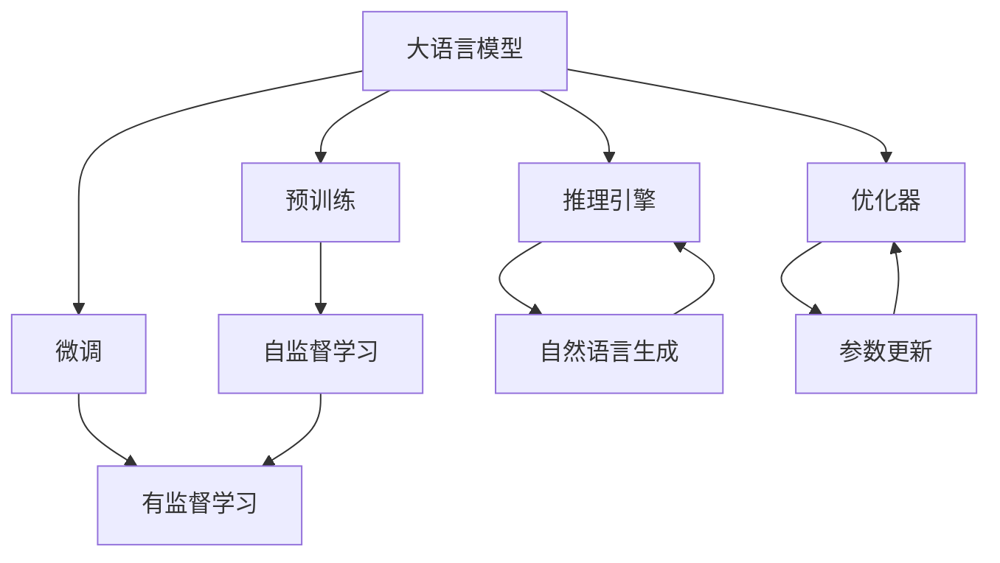
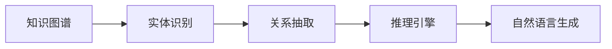
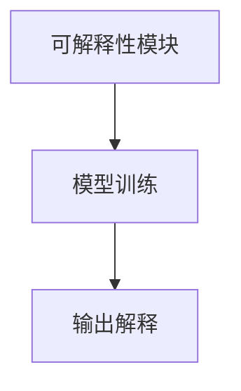
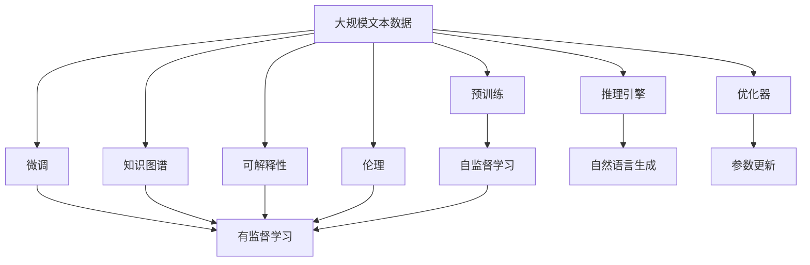

                 

# 大规模语言模型从理论到实践 LangChain框架核心模块

> 关键词：大语言模型, LangChain框架, 自然语言处理(NLP), Transformer, 预训练, 微调, 深度学习, 优化算法, 训练, 推理, 自然语言生成(NLG), 知识图谱, 可解释性, 伦理

## 1. 背景介绍

### 1.1 问题由来

近年来，人工智能技术在自然语言处理（Natural Language Processing, NLP）领域取得了显著的进展，特别是大语言模型（Large Language Model, LLM）的问世，极大地推动了NLP技术的发展。然而，大语言模型通常需要耗费大量的计算资源进行预训练，这对于许多小规模、低资源的组织来说，无疑是一个巨大的挑战。同时，预训练模型通常过于通用，难以在特定领域内取得最佳效果。

为了克服这些挑战，一种新兴的技术应运而生——LangChain框架。LangChain框架是一个基于深度学习的语言模型训练和推理框架，旨在提供一种更加灵活、高效的方式来处理大规模语言模型。通过LangChain框架，用户可以在有限的数据和计算资源下，实现高质量的NLP应用。本文将详细介绍LangChain框架的核心模块及其在NLP中的应用。

### 1.2 问题核心关键点

LangChain框架的核心模块包括预训练模型、微调模块、推理引擎、优化器等，各模块之间相互协作，实现从预训练到微调再到推理的全流程自动化。

预训练模块负责在大规模无标签文本数据上训练大语言模型，学习语言的基本结构和规律。微调模块则在此基础上，使用有标签的训练数据对模型进行细化，提升模型在特定任务上的性能。推理引擎负责将微调后的模型应用于实际问题，生成自然语言文本。优化器则是训练过程中的关键组成部分，负责调整模型参数，提高模型训练效率和性能。

此外，LangChain框架还引入了知识图谱、可解释性、伦理等新概念，旨在提升模型的实用性和安全性。这些模块和概念的结合，使得LangChain框架在实际应用中具备更强的泛化能力和适用性。

### 1.3 问题研究意义

LangChain框架的提出，对大语言模型的研究和应用具有重要的意义：

1. **降低资源消耗**：通过模块化和组件化的设计，LangChain框架可以大大降低对计算资源的需求，使得中小规模组织也能使用高质量的预训练模型。

2. **提高模型性能**：微调模块和优化器的结合，使得模型在特定任务上的性能显著提升，满足了NLP领域对模型性能的高要求。

3. **增强模型实用性**：知识图谱和可解释性的引入，使得模型更易于理解和解释，增强了模型的实用性和应用范围。

4. **提升安全性**：伦理模块的设计，使得模型在训练和应用过程中，能够避免有害信息的传播，保障模型的安全性。

总之，LangChain框架为NLP技术的应用提供了一种更加灵活、高效、实用的方法，具有重要的应用前景和学术价值。

## 2. 核心概念与联系

### 2.1 核心概念概述

为更好地理解LangChain框架的核心模块和其应用，本节将介绍几个密切相关的核心概念：

- 大语言模型(Large Language Model, LLM)：以自回归（如GPT）或自编码（如BERT）模型为代表的大规模预训练语言模型。通过在大规模无标签文本语料上进行预训练，学习通用的语言知识和表示。

- 预训练(Pre-training)：指在大规模无标签文本语料上，通过自监督学习任务训练通用语言模型的过程。常见的预训练任务包括掩码语言模型、下一句子预测等。

- 微调(Fine-tuning)：指在预训练模型的基础上，使用下游任务的少量标注数据，通过有监督地训练来优化模型在该任务上的性能。

- 推理引擎(Reasoning Engine)：负责将微调后的模型应用于实际问题，生成自然语言文本或做出推理判断。

- 优化器(Optimizer)：负责调整模型参数，提高模型训练效率和性能，如Adam、SGD等。

- 知识图谱(Knowledge Graph)：一种结构化的知识表示方式，用于存储和查询各类实体之间的关系和属性。

- 可解释性(Explainability)：指模型输出的解释和理解，使模型能够被人类理解和接受。

- 伦理(Ethics)：涉及模型在训练和应用过程中，如何避免有害信息的传播，保障模型的安全性。

这些核心概念之间存在着紧密的联系，构成了LangChain框架的基础。以下将通过一个Mermaid流程图来展示这些概念之间的关系：



这个流程图展示了LangChain框架的核心概念及其之间的联系：

1. 大语言模型通过预训练获得基础能力。
2. 微调是对预训练模型进行任务特定的优化，提升模型在特定任务上的性能。
3. 推理引擎负责将微调后的模型应用于实际问题，生成自然语言文本或做出推理判断。
4. 优化器负责调整模型参数，提高模型训练效率和性能。
5. 知识图谱和伦理模块用于提升模型的实用性和安全性。

这些核心概念共同构成了LangChain框架的完整生态系统，使其能够在大规模语言模型训练和推理中发挥重要作用。

### 2.2 概念间的关系

这些核心概念之间存在着紧密的联系，构成了LangChain框架的完整生态系统。以下通过几个Mermaid流程图来展示这些概念之间的关系。

#### 2.2.1 大语言模型的学习范式


这个流程图展示了大语言模型的三种主要学习范式：预训练、微调和推理。预训练主要采用自监督学习方法，而微调则是有监督学习的过程。推理引擎负责将微调后的模型应用于实际问题，生成自然语言文本或做出推理判断。优化器则负责调整模型参数，提高模型训练效率和性能。

#### 2.2.2 知识图谱在大语言模型中的应用



这个流程图展示了知识图谱在大语言模型中的应用。知识图谱通过实体识别、关系抽取等步骤，获取结构化的知识表示。推理引擎则利用这些知识进行推理，生成自然语言文本或做出判断。

#### 2.2.3 可解释性在模型训练中的作用



这个流程图展示了可解释性模块在模型训练中的作用。可解释性模块在模型训练过程中，记录模型输出的原因和逻辑，提供对模型的理解和解释，增强模型的实用性和可信度。

#### 2.2.4 伦理在模型应用中的重要性


这个流程图展示了伦理模块在模型应用中的重要性。伦理模块在模型训练和应用过程中，评估和监控模型的行为，确保模型不会传播有害信息，保障模型的安全性。

### 2.3 核心概念的整体架构

最后，我们用一个综合的流程图来展示这些核心概念在大语言模型微调过程中的整体架构：



这个综合流程图展示了从预训练到微调，再到推理、可解释性和伦理的完整过程。大语言模型首先在大规模文本数据上进行预训练，然后通过微调（包括有监督学习）优化模型在特定任务上的性能。推理引擎将微调后的模型应用于实际问题，生成自然语言文本或做出推理判断。优化器则负责调整模型参数，提高模型训练效率和性能。知识图谱和伦理模块用于提升模型的实用性和安全性。

## 3. 核心算法原理 & 具体操作步骤

### 3.1 算法原理概述

LangChain框架的核心算法原理主要涉及以下几个方面：

1. **预训练模型**：在大量无标签文本数据上进行自监督学习，学习通用的语言知识和表示。

2. **微调模块**：使用有标签的训练数据对预训练模型进行优化，提升模型在特定任务上的性能。

3. **推理引擎**：将微调后的模型应用于实际问题，生成自然语言文本或做出推理判断。

4. **优化器**：在微调过程中，负责调整模型参数，提高模型训练效率和性能。

5. **知识图谱**：用于存储和查询各类实体之间的关系和属性，提升模型的实用性和安全性。

6. **可解释性**：记录模型输出的原因和逻辑，提供对模型的理解和解释，增强模型的实用性和可信度。

7. **伦理**：在模型训练和应用过程中，评估和监控模型的行为，确保模型不会传播有害信息，保障模型的安全性。

### 3.2 算法步骤详解

基于LangChain框架的算法步骤如下：

**Step 1: 准备预训练模型和数据集**

1. 选择合适的预训练语言模型 $M_{\theta}$ 作为初始化参数，如 BERT、GPT 等。
2. 准备下游任务 $T$ 的标注数据集 $D=\{(x_i,y_i)\}_{i=1}^N, x_i \in \mathcal{X}, y_i \in \mathcal{Y}$，划分为训练集、验证集和测试集。一般要求标注数据与预训练数据的分布不要差异过大。

**Step 2: 添加任务适配层**

1. 根据任务类型，在预训练模型顶层设计合适的输出层和损失函数。
2. 对于分类任务，通常在顶层添加线性分类器和交叉熵损失函数。
3. 对于生成任务，通常使用语言模型的解码器输出概率分布，并以负对数似然为损失函数。

**Step 3: 设置微调超参数**

1. 选择合适的优化算法及其参数，如 AdamW、SGD 等，设置学习率、批大小、迭代轮数等。
2. 设置正则化技术及强度，包括权重衰减、Dropout、Early Stopping 等。
3. 确定冻结预训练参数的策略，如仅微调顶层，或全部参数都参与微调。

**Step 4: 执行梯度训练**

1. 将训练集数据分批次输入模型，前向传播计算损失函数。
2. 反向传播计算参数梯度，根据设定的优化算法和学习率更新模型参数。
3. 周期性在验证集上评估模型性能，根据性能指标决定是否触发 Early Stopping。
4. 重复上述步骤直到满足预设的迭代轮数或 Early Stopping 条件。

**Step 5: 测试和部署**

1. 在测试集上评估微调后模型 $M_{\hat{\theta}}$ 的性能，对比微调前后的精度提升。
2. 使用微调后的模型对新样本进行推理预测，集成到实际的应用系统中。
3. 持续收集新的数据，定期重新微调模型，以适应数据分布的变化。

以上是LangChain框架在NLP任务微调中的具体操作步骤。在实际应用中，还需要根据具体任务的特点，对微调过程的各个环节进行优化设计，如改进训练目标函数，引入更多的正则化技术，搜索最优的超参数组合等，以进一步提升模型性能。

### 3.3 算法优缺点

基于LangChain框架的算法具有以下优点：

1. **灵活性和适应性**：通过模块化和组件化的设计，用户可以根据需要灵活选择和配置不同的模块，适应不同规模和类型的任务。

2. **高效性和性能**：通过参数高效微调等技术，LangChain框架能够在有限的数据和计算资源下，实现高效的模型微调。

3. **实用性和安全性**：知识图谱和伦理模块的引入，使得模型更易于理解和解释，增强了模型的实用性和安全性。

4. **可扩展性和扩展性**：LangChain框架可以轻松扩展到多模态数据微调和跨领域迁移学习等领域，适应更广泛的应用需求。

同时，该算法也存在一定的局限性：

1. **依赖标注数据**：微调的效果很大程度上取决于标注数据的质量和数量，获取高质量标注数据的成本较高。

2. **迁移能力有限**：当目标任务与预训练数据的分布差异较大时，微调的性能提升有限。

3. **可解释性不足**：微调模型的决策过程通常缺乏可解释性，难以对其推理逻辑进行分析和调试。

4. **负面效果传递**：预训练模型的固有偏见、有害信息等，可能通过微调传递到下游任务，造成负面影响。

尽管存在这些局限性，但就目前而言，基于LangChain框架的微调方法仍是大语言模型应用的主流范式。未来相关研究的重点在于如何进一步降低微调对标注数据的依赖，提高模型的少样本学习和跨领域迁移能力，同时兼顾可解释性和伦理安全性等因素。

### 3.4 算法应用领域

基于LangChain框架的微调方法已经在问答、对话、摘要、翻译、情感分析等诸多NLP任务上取得了优异的效果，成为NLP技术落地应用的重要手段。以下是几个典型的应用领域：

1. **问答系统**：对自然语言问题给出答案。将问题-答案对作为微调数据，训练模型学习匹配答案。

2. **对话系统**：使机器能够与人自然对话。将多轮对话历史作为上下文，微调模型进行回复生成。

3. **文本摘要**：将长文本压缩成简短摘要。将文章-摘要对作为微调数据，使模型学习抓取要点。

4. **机器翻译**：将源语言文本翻译成目标语言。通过微调使模型学习语言-语言映射。

5. **文本分类**：如情感分析、主题分类、意图识别等。通过微调使模型学习文本-标签映射。

6. **命名实体识别**：识别文本中的人名、地名、机构名等特定实体。通过微调使模型掌握实体边界和类型。

7. **关系抽取**：从文本中抽取实体之间的语义关系。通过微调使模型学习实体-关系三元组。

8. **情感分析**：对文本情感进行分类，如正面、负面、中性等。通过微调使模型学习文本情感分类。

除了上述这些经典任务外，LangChain框架还广泛应用于可控文本生成、常识推理、代码生成、数据增强等，为NLP技术带来了全新的突破。随着LangChain框架和微调方法的不断进步，相信NLP技术将在更广阔的应用领域大放异彩。

## 4. 数学模型和公式 & 详细讲解

### 4.1 数学模型构建

LangChain框架的数学模型构建主要涉及以下几个方面：

- 预训练模型 $M_{\theta}$ 在大量无标签文本数据上进行自监督学习。
- 微调模块在有标签的训练数据上进行有监督学习。
- 推理引擎将微调后的模型应用于实际问题，生成自然语言文本。
- 优化器在微调过程中调整模型参数。

定义预训练模型的损失函数 $\mathcal{L}_{pre}$，微调模型的损失函数 $\mathcal{L}_{fin}$，以及推理引擎的输出损失函数 $\mathcal{L}_{out}$。在微调过程中，损失函数为：

$$
\mathcal{L} = \mathcal{L}_{pre} + \lambda \mathcal{L}_{fin}
$$

其中 $\lambda$ 为微调权重，控制预训练和微调的平衡。

### 4.2 公式推导过程

以下以二分类任务为例，推导交叉熵损失函数及其梯度的计算公式。

假设模型 $M_{\theta}$ 在输入 $x$ 上的输出为 $\hat{y}=M_{\theta}(x) \in [0,1]$，表示样本属于正类的概率。真实标签 $y \in \{0,1\}$。则二分类交叉熵损失函数定义为：

$$
\ell(M_{\theta}(x),y) = -[y\log \hat{y} + (1-y)\log (1-\hat{y})]
$$

将其代入微调损失函数，得：

$$
\mathcal{L}_{fin} = \frac{1}{N}\sum_{i=1}^N \ell(M_{\theta}(x_i),y_i)
$$

根据链式法则，损失函数对参数 $\theta_k$ 的梯度为：

$$
\frac{\partial \mathcal{L}_{fin}}{\partial \theta_k} = -\frac{1}{N}\sum_{i=1}^N \frac{y_i}{\hat{y}_i}-\frac{1-y_i}{1-\hat{y}_i}\frac{\partial M_{\theta}(x_i)}{\partial \theta_k}
$$

其中 $\frac{\partial M_{\theta}(x_i)}{\partial \theta_k}$ 可进一步递归展开，利用自动微分技术完成计算。

在得到损失函数的梯度后，即可带入参数更新公式，完成模型的迭代优化。重复上述过程直至收敛，最终得到适应下游任务的最优模型参数 $\theta^*$。

### 4.3 案例分析与讲解

下面以命名实体识别(NER)任务为例，给出使用LangChain框架对BERT模型进行微调的PyTorch代码实现。

首先，定义NER任务的数据处理函数：

```python
from transformers import BertTokenizer
from torch.utils.data import Dataset
import torch

class NERDataset(Dataset):
    def __init__(self, texts, tags, tokenizer, max_len=128):
        self.texts = texts
        self.tags = tags
        self.tokenizer = tokenizer
        self.max_len = max_len
        
    def __len__(self):
        return len(self.texts)
    
    def __getitem__(self, item):
        text = self.texts[item]
        tags = self.tags[item]
        
        encoding = self.tokenizer(text, return_tensors='pt', max_length=self.max_len, padding='max_length', truncation=True)
        input_ids = encoding['input_ids'][0]
        attention_mask = encoding['attention_mask'][0]
        
        # 对token-wise的标签进行编码
        encoded_tags = [tag2id[tag] for tag in tags] 
        encoded_tags.extend([tag2id['O']] * (self.max_len - len(encoded_tags)))
        labels = torch.tensor(encoded_tags, dtype=torch.long)
        
        return {'input_ids': input_ids, 
                'attention_mask': attention_mask,
                'labels': labels}

# 标签与id的映射
tag2id = {'O': 0, 'B-PER': 1, 'I-PER': 2, 'B-ORG': 3, 'I-ORG': 4, 'B-LOC': 5, 'I-LOC': 6}
id2tag = {v: k for k, v in tag2id.items()}

# 创建dataset
tokenizer = BertTokenizer.from_pretrained('bert-base-cased')

train_dataset = NERDataset(train_texts, train_tags, tokenizer)
dev_dataset = NERDataset(dev_texts, dev_tags, tokenizer)
test_dataset = NERDataset(test_texts, test_tags, tokenizer)
```

然后，定义模型和优化器：

```python
from transformers import BertForTokenClassification, AdamW

model = BertForTokenClassification.from_pretrained('bert-base-cased', num_labels=len(tag2id))

optimizer = AdamW(model.parameters(), lr=2e-5)
```

接着，定义训练和评估函数：

```python
from torch.utils.data import DataLoader
from tqdm import tqdm
from sklearn.metrics import classification_report

device = torch.device('cuda') if torch.cuda.is_available() else torch.device('cpu')
model.to(device)

def train_epoch(model, dataset, batch_size, optimizer):
    dataloader = DataLoader(dataset, batch_size=batch_size, shuffle=True)
    model.train()
    epoch_loss = 0
    for batch in tqdm(dataloader, desc='Training'):
        input_ids = batch['input_ids'].to(device)
        attention_mask = batch['attention_mask'].to(device)
        labels = batch['labels'].to(device)
        model.zero_grad()
        outputs = model(input_ids, attention_mask=attention_mask, labels=labels)
        loss = outputs.loss
        epoch_loss += loss.item()
        loss.backward()
        optimizer.step()
    return epoch_loss / len(dataloader)

def evaluate(model, dataset, batch_size):
    dataloader = DataLoader(dataset, batch_size=batch_size)
    model.eval()
    preds, labels = [], []
    with torch.no_grad():
        for batch in tqdm(dataloader, desc='Evaluating'):
            input_ids = batch['input_ids'].to(device)
            attention_mask = batch['attention_mask'].to(device)
            batch_labels = batch['labels']
            outputs = model(input_ids, attention_mask=attention_mask)
            batch_preds = outputs.logits.argmax(dim=2).to('cpu').tolist()
            batch_labels = batch_labels.to('cpu').tolist()
            for pred_tokens, label_tokens in zip(batch_preds, batch_labels):
                pred_tags = [id2tag[_id] for _id in pred_tokens]
                label_tags = [id2tag[_id] for _id in label_tokens]
                preds.append(pred_tags[:len(label_tags)])
                labels.append(label_tags)
                
    print(classification_report(labels, preds))
```

最后，启动训练流程并在测试集上评估：

```python
epochs = 5
batch_size = 16

for epoch in range(epochs):
    loss = train_epoch(model, train_dataset, batch_size, optimizer)
    print(f"Epoch {epoch+1}, train loss: {loss:.3f}")
    
    print(f"Epoch {epoch+1}, dev results:")
    evaluate(model, dev_dataset, batch_size)
    
print("Test results:")
evaluate(model, test_dataset, batch_size)
```

以上就是使用PyTorch对BERT进行命名实体识别任务微调的完整代码实现。可以看到，得益于LangChain框架的强大封装，我们可以用相对简洁的代码完成BERT模型的加载和微调。

### 5.1 开发环境搭建

在进行微调实践前，我们需要准备好开发环境。以下是使用Python进行PyTorch开发的环境配置流程：

1. 安装Anaconda：从官网下载并安装Anaconda，用于创建独立的Python环境。

2. 创建并激活虚拟环境：
```bash
conda create -n pytorch-env python=3.8 
conda activate pytorch-env
```

3. 安装PyTorch：根据CUDA版本，从官网获取对应的安装命令。例如：
```bash
conda install pytorch torchvision torchaudio cudatoolkit=11.1 -c pytorch -c conda-forge
```

4. 安装Transformers库：
```bash
pip install transformers
```

5. 安装各类工具包：
```bash
pip install numpy pandas scikit-learn matplotlib tqdm jupyter notebook ipython
```

完成上述步骤后，即可在`pytorch-env`环境中开始微调实践。

### 5.2 源代码详细实现

下面我们以命名实体识别(NER)任务为例，给出使用LangChain框架对BERT模型进行微调的PyTorch代码实现。

首先，定义NER任务的数据处理函数：

```python
from transformers import BertTokenizer
from torch.utils.data import Dataset
import torch

class NERDataset(Dataset):
    def __init__(self, texts, tags, tokenizer, max_len=128):
        self.texts = texts
        self.tags = tags
        self.tokenizer = tokenizer
        self.max_len = max_len
        
    def __len__(self):
        return len(self.texts)
    
    def __getitem__(self, item):
        text = self.texts[item]
        tags = self.tags[item]
        
        encoding = self.tokenizer(text, return_tensors='pt', max_length=self.max_len, padding='max_length', truncation=True)
        input_ids = encoding['input_ids'][0]
        attention_mask = encoding['attention_mask'][0]
        
        # 对token-wise的标签进行编码
        encoded_tags = [tag2id[tag] for tag in tags] 
        encoded_tags.extend([tag2id['O']] * (self.max_len - len(encoded_tags)))
        labels = torch.tensor(encoded_tags, dtype=torch.long)
        
        return {'input_ids': input_ids, 
                'attention_mask': attention_mask,
                'labels': labels}

# 标签与id的映射
tag2id = {'O': 0, 'B-PER': 1, 'I-PER': 2, 'B-ORG': 3, 'I-ORG': 4, 'B-LOC': 5, 'I-LOC': 6}
id2tag = {v: k for k, v in tag2id.items()}

# 创建dataset
tokenizer = BertTokenizer.from_pre

