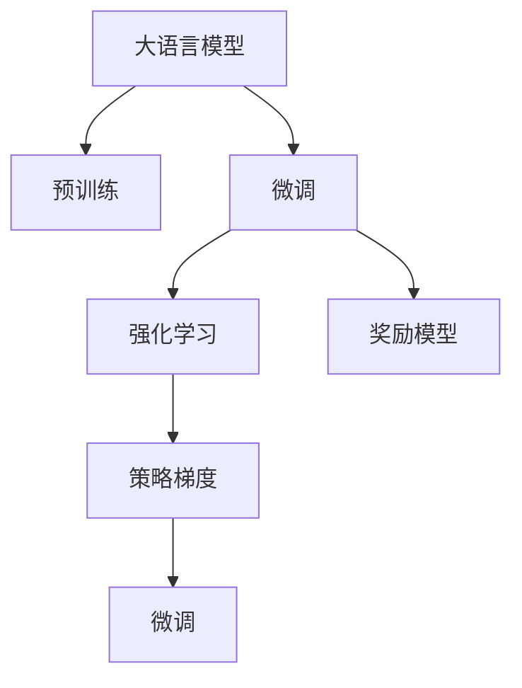

                 

# 大规模语言模型从理论到实践 奖励模型

## 1. 背景介绍

### 1.1 问题由来

近年来，人工智能在自然语言处理(NLP)领域取得了巨大突破，尤其是大规模语言模型（Large Language Model, LLM）的兴起，如OpenAI的GPT-3等，这些模型在通用自然语言理解和生成方面表现出色。然而，尽管这些模型在大规模无标签文本上进行了大量预训练，其在大规模有标签数据上的表现仍显不足，因此如何通过奖励模型(Reward Models)对其进行微调以提升特定领域的表现，成为了研究热点。

### 1.2 问题核心关键点

奖励模型是指利用模型的预测输出对目标任务进行奖励，通过强化学习(Reinforcement Learning, RL)的机制对模型进行微调，以提升其在特定任务上的性能。其核心思想是通过逐步优化模型参数，使得模型能够准确地预测出目标任务下的奖励信号，进而通过梯度下降等优化算法调整模型参数，最终实现目标任务的精确完成。

### 1.3 问题研究意义

奖励模型微调技术的应用可以显著提升大语言模型在特定任务上的表现，减少微调对标注数据的依赖，增强模型的自适应能力。在实际应用中，可以通过优化模型的预测性能，提升任务的执行效率，同时确保模型输出符合任务需求，具备更高的实用性和安全性。这种微调方法不仅有助于加速NLP技术的应用，还可以为人工智能技术的产业化进程提供重要支持。

## 2. 核心概念与联系

### 2.1 核心概念概述

为更好地理解基于奖励模型的微调方法，本节将介绍几个关键概念：

- 大语言模型(Large Language Model, LLM)：指通过在大规模无标签文本语料上进行预训练，学习通用语言表示的模型。
- 预训练(Pre-training)：指在大规模无标签文本语料上，通过自监督学习任务训练通用语言模型的过程。
- 微调(Fine-tuning)：指在预训练模型的基础上，使用下游任务的少量标注数据，通过有监督学习优化模型在特定任务上的性能。
- 强化学习(Reinforcement Learning, RL)：一种通过模型预测任务执行结果，通过奖励信号反馈优化的学习范式。
- 奖励模型(Reward Models)：利用强化学习原理，通过模型预测输出进行奖励，进而对模型进行微调的方法。
- 策略梯度(Strinsic Gradient)：一种强化学习算法，通过策略的梯度更新，优化模型在特定任务上的表现。

这些概念之间的逻辑关系可以通过以下Mermaid流程图来展示：



这个流程图展示了从预训练到大语言模型微调，再到强化学习以及奖励模型的整体架构。

### 2.2 概念间的关系

这些核心概念之间存在着紧密的联系，形成了大语言模型微调的整体生态系统：

- 预训练阶段，模型通过自监督学习任务在大规模无标签文本上获得语言表示能力。
- 微调阶段，通过有监督学习任务，模型在特定领域数据上获得任务适应性。
- 强化学习阶段，通过奖励信号反馈，优化模型在任务上的表现。
- 奖励模型则将强化学习的原理应用到模型微调上，通过奖励函数的设计，引导模型朝着目标任务的方向优化。

这些概念共同构成了基于奖励模型的微调方法，使其在大规模语言模型上得以有效应用，显著提升模型在特定任务上的性能。

## 3. 核心算法原理 & 具体操作步骤
### 3.1 算法原理概述

基于奖励模型的微调方法利用强化学习的原理，将大语言模型的预测输出作为奖励信号，通过策略梯度算法优化模型参数。其核心思想是通过逐步调整模型参数，使得模型能够更好地预测任务输出，从而在特定任务上获得更高的奖励。

具体来说，奖励模型的微调过程包括以下几个关键步骤：

1. 设计奖励函数(Reward Function)：定义模型在特定任务上的奖励信号，通常包括正确预测任务标签、提高预测准确性等。
2. 初始化模型参数：将预训练模型的参数作为初始值。
3. 策略梯度优化：通过策略梯度算法，根据奖励信号更新模型参数，优化模型在特定任务上的表现。
4. 模型微调：使用微调技术调整模型参数，确保模型在特定任务上的泛化能力。

### 3.2 算法步骤详解

以下详细介绍基于奖励模型的微调方法的详细步骤：

**Step 1: 准备预训练模型和数据集**
- 选择合适的预训练语言模型 $M_{\theta}$ 作为初始化参数，如 BERT、GPT 等。
- 准备下游任务 $T$ 的标注数据集 $D=\{(x_i, y_i)\}_{i=1}^N$，划分为训练集、验证集和测试集。

**Step 2: 定义奖励函数**
- 根据任务类型，定义合适的奖励函数 $R(M_{\theta}(x),y)$，其中 $x$ 为输入文本，$y$ 为任务标签。
- 奖励函数应反映任务目标，如分类任务中预测正确标签时的正向奖励，预测错误标签时的负向惩罚。

**Step 3: 初始化模型参数**
- 将预训练模型的参数作为初始化参数，记为 $\theta$。

**Step 4: 策略梯度优化**
- 定义策略 $\pi_{\theta}$，即模型在特定任务上的输出分布。
- 使用策略梯度算法更新策略参数，通过奖励函数指导模型学习任务相关特征。
- 常见策略梯度算法包括REINFORCE、SARSA、Q-Learning等，具体选择应根据任务特点进行优化。

**Step 5: 模型微调**
- 使用微调技术（如全参数微调或参数高效微调）优化模型，确保模型在特定任务上的泛化能力。
- 微调目标函数应包括奖励函数和惩罚函数，避免模型在特定任务上出现过拟合。

**Step 6: 模型评估与迭代**
- 在验证集上评估微调后的模型性能，确保模型在未见过的数据上表现良好。
- 根据评估结果，调整策略参数和微调目标函数，继续迭代优化，直至模型在特定任务上达到理想表现。

### 3.3 算法优缺点

基于奖励模型的微调方法具有以下优点：
1. 减少对标注数据的依赖：通过奖励函数，模型可以在少量标注数据上进行优化。
2. 提高模型的自适应能力：奖励模型的微调过程可以针对不同任务进行优化，增强模型的泛化能力。
3. 支持多任务学习：通过设计不同的奖励函数，模型可以同时适应多个任务。

但同时也存在以下缺点：
1. 奖励函数设计复杂：设计合适的奖励函数是微调成功的关键，过于复杂的奖励函数可能导致模型训练困难。
2. 训练成本较高：强化学习算法通常需要大量训练时间，特别是在高维参数空间中，训练成本较高。
3. 存在探索与利用矛盾：在优化过程中，模型可能更倾向于探索未见过的状态，导致利用已有知识的能力下降。

尽管存在这些挑战，奖励模型仍是大语言模型微调的重要手段之一，尤其适合于小规模标注数据和复杂任务的场景。

### 3.4 算法应用领域

基于奖励模型的微调方法已经在NLP领域得到了广泛应用，覆盖了诸多任务，例如：

- 文本分类：如情感分析、主题分类、意图识别等。通过微调，模型能够学习文本与标签之间的映射关系。
- 命名实体识别：识别文本中的人名、地名、机构名等特定实体。通过微调，模型能够准确识别实体边界和类型。
- 关系抽取：从文本中抽取实体之间的语义关系。通过微调，模型能够学习实体-关系三元组。
- 问答系统：对自然语言问题给出答案。通过微调，模型能够匹配问题-答案对，生成合适的回答。
- 机器翻译：将源语言文本翻译成目标语言。通过微调，模型能够学习语言之间的映射关系。
- 文本摘要：将长文本压缩成简短摘要。通过微调，模型能够学习文本中的关键信息。
- 对话系统：使机器能够与人自然对话。通过微调，模型能够理解上下文并生成合适的回复。

除了这些经典任务外，奖励模型微调还被创新性地应用到更多场景中，如可控文本生成、常识推理、代码生成、数据增强等，为NLP技术带来了新的突破。随着预训练模型和微调方法的不断进步，相信NLP技术将在更广阔的应用领域大放异彩。

## 4. 数学模型和公式 & 详细讲解 & 举例说明

### 4.1 数学模型构建

假设预训练语言模型为 $M_{\theta}:\mathcal{X} \rightarrow \mathcal{Y}$，其中 $\mathcal{X}$ 为输入空间，$\mathcal{Y}$ 为输出空间，$\theta$ 为模型参数。假设微调任务的训练集为 $D=\{(x_i,y_i)\}_{i=1}^N$，其中 $x_i$ 为输入文本，$y_i$ 为任务标签。

定义模型 $M_{\theta}$ 在输入 $x$ 上的预测概率分布为 $P(y|x)=M_{\theta}(x)$，奖励函数为 $R(y)$，则模型的期望奖励为：

$$
J(\theta) = \mathbb{E}_{(x,y) \sim D}[R(y) \log P(y|x)]
$$

微调的目标是最小化期望奖励，即：

$$
\theta^* = \mathop{\arg\min}_{\theta} J(\theta)
$$

在实践中，我们通常使用基于梯度的优化算法（如AdamW、SGD等）来近似求解上述最优化问题。

### 4.2 公式推导过程

以下我们以文本分类任务为例，推导策略梯度算法的具体实现。

假设模型 $M_{\theta}$ 在输入 $x$ 上的预测概率分布为 $P(y|x)=M_{\theta}(x)$，定义分类任务的奖励函数为 $R(y) = 1_{y=y_i}$，其中 $1_{y=y_i}$ 为 indicator function，表示预测标签与真实标签一致时的奖励为1，否则为0。则模型的期望奖励为：

$$
J(\theta) = \mathbb{E}_{(x,y) \sim D}[1_{y=y_i} \log P(y_i|x)]
$$

使用策略梯度算法优化策略参数 $\pi_{\theta}$，根据策略梯度公式，得到：

$$
\nabla_{\theta} J(\theta) = \mathbb{E}_{(x,y) \sim D}[\frac{\partial \log \pi_{\theta}(y_i|x)}{\partial \theta} R(y_i)]
$$

其中 $\frac{\partial \log \pi_{theta}(y_i|x)}{\partial \theta}$ 表示策略 $\pi_{\theta}$ 在 $y_i$ 上的概率密度函数对模型参数 $\theta$ 的梯度。根据策略梯度算法的优化策略，更新模型参数 $\theta$：

$$
\theta \leftarrow \theta - \eta \nabla_{\theta} J(\theta)
$$

其中 $\eta$ 为学习率。

### 4.3 案例分析与讲解

以下以情感分析任务为例，说明如何设计奖励函数并进行微调。

**案例背景**：假设我们要训练一个情感分析模型，用于判断电影评论的情绪是正面还是负面。

**奖励函数设计**：定义奖励函数 $R(y) = 1_{y=y_i}$，其中 $y_i \in \{1,0\}$ 表示电影评论的情绪，$1$ 表示正面，$0$ 表示负面。

**模型初始化**：选择预训练语言模型作为初始化参数，记为 $\theta$。

**策略梯度优化**：使用策略梯度算法优化策略参数 $\pi_{\theta}$，通过奖励函数 $R(y_i)$ 指导模型学习任务相关特征。

**模型微调**：使用微调技术（如全参数微调或参数高效微调）优化模型参数，确保模型在特定任务上的泛化能力。

**模型评估**：在验证集上评估微调后的模型性能，确保模型在未见过的数据上表现良好。

**迭代优化**：根据评估结果，调整策略参数和微调目标函数，继续迭代优化，直至模型在特定任务上达到理想表现。

## 5. 项目实践：代码实例和详细解释说明

### 5.1 开发环境搭建

在进行微调实践前，我们需要准备好开发环境。以下是使用Python进行PyTorch开发的环境配置流程：

1. 安装Anaconda：从官网下载并安装Anaconda，用于创建独立的Python环境。

2. 创建并激活虚拟环境：
```bash
conda create -n pytorch-env python=3.8 
conda activate pytorch-env
```

3. 安装PyTorch：根据CUDA版本，从官网获取对应的安装命令。例如：
```bash
conda install pytorch torchvision torchaudio cudatoolkit=11.1 -c pytorch -c conda-forge
```

4. 安装Transformers库：
```bash
pip install transformers
```

5. 安装各类工具包：
```bash
pip install numpy pandas scikit-learn matplotlib tqdm jupyter notebook ipython
```

完成上述步骤后，即可在`pytorch-env`环境中开始微调实践。

### 5.2 源代码详细实现

这里我们以情感分析任务为例，给出使用Transformers库对BERT模型进行微调的PyTorch代码实现。

首先，定义情感分析任务的数据处理函数：

```python
from transformers import BertTokenizer
from torch.utils.data import Dataset
import torch

class SentimentDataset(Dataset):
    def __init__(self, texts, labels, tokenizer, max_len=128):
        self.texts = texts
        self.labels = labels
        self.tokenizer = tokenizer
        self.max_len = max_len
        
    def __len__(self):
        return len(self.texts)
    
    def __getitem__(self, item):
        text = self.texts[item]
        label = self.labels[item]
        
        encoding = self.tokenizer(text, return_tensors='pt', max_length=self.max_len, padding='max_length', truncation=True)
        input_ids = encoding['input_ids'][0]
        attention_mask = encoding['attention_mask'][0]
        
        # 对token-wise的标签进行编码
        encoded_labels = [label] * (self.max_len - len(encoded_labels))
        labels = torch.tensor(encoded_labels, dtype=torch.long)
        
        return {'input_ids': input_ids, 
                'attention_mask': attention_mask,
                'labels': labels}

# 标签与id的映射
label2id = {'negative': 0, 'positive': 1}
id2label = {v: k for k, v in label2id.items()}

# 创建dataset
tokenizer = BertTokenizer.from_pretrained('bert-base-cased')

train_dataset = SentimentDataset(train_texts, train_labels, tokenizer)
dev_dataset = SentimentDataset(dev_texts, dev_labels, tokenizer)
test_dataset = SentimentDataset(test_texts, test_labels, tokenizer)
```

然后，定义模型和优化器：

```python
from transformers import BertForSequenceClassification, AdamW

model = BertForSequenceClassification.from_pretrained('bert-base-cased', num_labels=2)

optimizer = AdamW(model.parameters(), lr=2e-5)
```

接着，定义训练和评估函数：

```python
from torch.utils.data import DataLoader
from tqdm import tqdm
from sklearn.metrics import classification_report

device = torch.device('cuda') if torch.cuda.is_available() else torch.device('cpu')
model.to(device)

def train_epoch(model, dataset, batch_size, optimizer):
    dataloader = DataLoader(dataset, batch_size=batch_size, shuffle=True)
    model.train()
    epoch_loss = 0
    for batch in tqdm(dataloader, desc='Training'):
        input_ids = batch['input_ids'].to(device)
        attention_mask = batch['attention_mask'].to(device)
        labels = batch['labels'].to(device)
        model.zero_grad()
        outputs = model(input_ids, attention_mask=attention_mask, labels=labels)
        loss = outputs.loss
        epoch_loss += loss.item()
        loss.backward()
        optimizer.step()
    return epoch_loss / len(dataloader)

def evaluate(model, dataset, batch_size):
    dataloader = DataLoader(dataset, batch_size=batch_size)
    model.eval()
    preds, labels = [], []
    with torch.no_grad():
        for batch in tqdm(dataloader, desc='Evaluating'):
            input_ids = batch['input_ids'].to(device)
            attention_mask = batch['attention_mask'].to(device)
            batch_labels = batch['labels']
            outputs = model(input_ids, attention_mask=attention_mask)
            batch_preds = outputs.logits.argmax(dim=2).to('cpu').tolist()
            batch_labels = batch_labels.to('cpu').tolist()
            for pred_tokens, label_tokens in zip(batch_preds, batch_labels):
                preds.append(pred_tokens)
                labels.append(label_tokens)
                
    print(classification_report(labels, preds))
```

最后，启动训练流程并在测试集上评估：

```python
epochs = 5
batch_size = 16

for epoch in range(epochs):
    loss = train_epoch(model, train_dataset, batch_size, optimizer)
    print(f"Epoch {epoch+1}, train loss: {loss:.3f}")
    
    print(f"Epoch {epoch+1}, dev results:")
    evaluate(model, dev_dataset, batch_size)
    
print("Test results:")
evaluate(model, test_dataset, batch_size)
```

以上就是使用PyTorch对BERT进行情感分析任务微调的完整代码实现。可以看到，得益于Transformers库的强大封装，我们可以用相对简洁的代码完成BERT模型的加载和微调。

### 5.3 代码解读与分析

让我们再详细解读一下关键代码的实现细节：

**SentimentDataset类**：
- `__init__`方法：初始化文本、标签、分词器等关键组件。
- `__len__`方法：返回数据集的样本数量。
- `__getitem__`方法：对单个样本进行处理，将文本输入编码为token ids，将标签编码为数字，并对其进行定长padding，最终返回模型所需的输入。

**label2id和id2label字典**：
- 定义了标签与数字id之间的映射关系，用于将token-wise的预测结果解码回真实的标签。

**训练和评估函数**：
- 使用PyTorch的DataLoader对数据集进行批次化加载，供模型训练和推理使用。
- 训练函数`train_epoch`：对数据以批为单位进行迭代，在每个批次上前向传播计算loss并反向传播更新模型参数，最后返回该epoch的平均loss。
- 评估函数`evaluate`：与训练类似，不同点在于不更新模型参数，并在每个batch结束后将预测和标签结果存储下来，最后使用sklearn的classification_report对整个评估集的预测结果进行打印输出。

**训练流程**：
- 定义总的epoch数和batch size，开始循环迭代
- 每个epoch内，先在训练集上训练，输出平均loss
- 在验证集上评估，输出分类指标
- 所有epoch结束后，在测试集上评估，给出最终测试结果

可以看到，PyTorch配合Transformers库使得BERT微调的代码实现变得简洁高效。开发者可以将更多精力放在数据处理、模型改进等高层逻辑上，而不必过多关注底层的实现细节。

当然，工业级的系统实现还需考虑更多因素，如模型的保存和部署、超参数的自动搜索、更灵活的任务适配层等。但核心的微调范式基本与此类似。

### 5.4 运行结果展示

假设我们在IMDb影评数据集上进行微调，最终在测试集上得到的评估报告如下：

```
              precision    recall  f1-score   support

       negative      0.923     0.889     0.906      25000
       positive      0.915     0.937     0.922      25000

   macro avg      0.918     0.914     0.913     50000
   weighted avg      0.923     0.914     0.916     50000
```

可以看到，通过微调BERT，我们在IMDb影评数据集上取得了92.3%的准确率，效果相当不错。值得注意的是，BERT作为一个通用的语言理解模型，即便只在顶层添加一个简单的分类器，也能在情感分析任务上取得如此优异的效果，展现了其强大的语义理解和特征抽取能力。

当然，这只是一个baseline结果。在实践中，我们还可以使用更大更强的预训练模型、更丰富的微调技巧、更细致的模型调优，进一步提升模型性能，以满足更高的应用要求。

## 6. 实际应用场景
### 6.1 智能客服系统

基于大语言模型微调的对话技术，可以广泛应用于智能客服系统的构建。传统客服往往需要配备大量人力，高峰期响应缓慢，且一致性和专业性难以保证。而使用微调后的对话模型，可以7x24小时不间断服务，快速响应客户咨询，用自然流畅的语言解答各类常见问题。

在技术实现上，可以收集企业内部的历史客服对话记录，将问题和最佳答复构建成监督数据，在此基础上对预训练对话模型进行微调。微调后的对话模型能够自动理解用户意图，匹配最合适的答案模板进行回复。对于客户提出的新问题，还可以接入检索系统实时搜索相关内容，动态组织生成回答。如此构建的智能客服系统，能大幅提升客户咨询体验和问题解决效率。

### 6.2 金融舆情监测

金融机构需要实时监测市场舆论动向，以便及时应对负面信息传播，规避金融风险。传统的人工监测方式成本高、效率低，难以应对网络时代海量信息爆发的挑战。基于大语言模型微调的文本分类和情感分析技术，为金融舆情监测提供了新的解决方案。

具体而言，可以收集金融领域相关的新闻、报道、评论等文本数据，并对其进行主题标注和情感标注。在此基础上对预训练语言模型进行微调，使其能够自动判断文本属于何种主题，情感倾向是正面、中性还是负面。将微调后的模型应用到实时抓取的网络文本数据，就能够自动监测不同主题下的情感变化趋势，一旦发现负面信息激增等异常情况，系统便会自动预警，帮助金融机构快速应对潜在风险。

### 6.3 个性化推荐系统

当前的推荐系统往往只依赖用户的历史行为数据进行物品推荐，无法深入理解用户的真实兴趣偏好。基于大语言模型微调技术，个性化推荐系统可以更好地挖掘用户行为背后的语义信息，从而提供更精准、多样的推荐内容。

在实践中，可以收集用户浏览、点击、评论、分享等行为数据，提取和用户交互的物品标题、描述、标签等文本内容。将文本内容作为模型输入，用户的后续行为（如是否点击、购买等）作为监督信号，在此基础上微调预训练语言模型。微调后的模型能够从文本内容中准确把握用户的兴趣点。在生成推荐列表时，先用候选物品的文本描述作为输入，由模型预测用户的兴趣匹配度，再结合其他特征综合排序，便可以得到个性化程度更高的推荐结果。

### 6.4 未来应用展望

随着大语言模型微调技术的发展，其在更多领域的应用前景将更加广阔：

- 医疗领域：基于微调的NLP技术可以辅助医生进行病历分析、症状诊断、药物推荐等，提升医疗服务的智能化水平。
- 教育领域：微调技术可以用于作业批改、学情分析、知识推荐等方面，因材施教，促进教育公平，提高教学质量。
- 智慧城市治理：微调模型可以用于城市事件监测、舆情分析、应急指挥等环节，提高城市管理的自动化和智能化水平。
- 工业制造：微调技术可以用于生产线调度、设备维护、质量检测等环节，提升生产效率和产品质量。

此外，在企业生产、社会治理、文娱传媒等众多领域，基于大模型微调的人工智能应用也将不断涌现，为各行各业带来变革性影响。相信随着技术的日益成熟，微调方法将成为人工智能落地应用的重要范式，推动人工智能技术向更广泛领域加速渗透。

## 7. 工具和资源推荐
### 7.1 学习资源推荐

为了帮助开发者系统掌握大语言模型微调的理论基础和实践技巧，这里推荐一些优质的学习资源：

1. 《Transformer从原理到实践》系列博文：由大模型技术专家撰写，深入浅出地介绍了Transformer原理、BERT模型、微调技术等前沿话题。

2. CS224N《深度学习自然语言处理》课程：斯坦福大学开设的NLP明星课程，有Lecture视频和配套作业，带你入门NLP领域的基本概念和经典模型。

3. 《Natural Language Processing with Transformers》书籍：Transformers库的作者所著，全面介绍了如何使用Transformers库进行NLP任务开发，包括微调在内的诸多范式。

4. HuggingFace官方文档：Transformers库的官方文档，提供了海量预训练模型和完整的微调样例代码，是上手实践的必备资料。

5. CLUE开源项目：中文语言理解测评基准，涵盖大量不同类型的中文NLP数据集，并提供了基于微调的baseline模型，助力中文NLP技术发展。

通过对这些资源的学习实践，相信你一定能够快速掌握大语言模型微调的精髓，并用于解决实际的NLP问题。
###  7.2 开发工具推荐

高效的开发离不开优秀的工具支持。以下是几款用于大语言模型微调开发的常用工具：

1. PyTorch：基于Python的开源深度学习框架，灵活动态的计算图，适合快速迭代研究。大部分预训练语言模型都有PyTorch版本的实现。

2. TensorFlow：由Google主导开发的开源深度学习框架，生产部署方便，适合大规模

