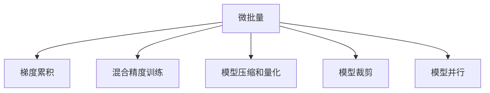
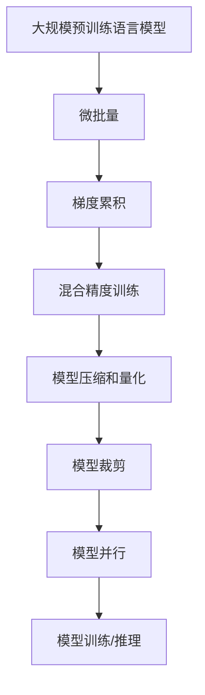

                 

# 大语言模型原理基础与前沿 单位缩放

> 关键词：大语言模型,单位缩放,优化器,自适应学习率,学习率调度,梯度累积,梯度微批量,模型压缩,模型量化,模型裁剪,模型并行

## 1. 背景介绍

### 1.1 问题由来
近年来，深度学习在NLP（自然语言处理）领域取得了显著进展，特别是大规模预训练语言模型（Large Language Models, LLMs）如BERT、GPT等，它们在大规模无标签文本数据上进行预训练，学习到丰富的语言知识和常识，从而在各种下游任务上表现优异。然而，这些模型的参数规模通常极大，训练和推理过程中存在显著的计算和存储负担。因此，为了降低计算成本，研究者们提出了各种单位缩放（Unit Scaling）技术，以便在大模型上更好地进行训练和推理。

### 1.2 问题核心关键点
单位缩放的核心思想是在预训练和微调过程中，通过调整模型的计算单位（如微批量、梯度累积等），优化计算效率和模型性能。具体而言，可以采取以下策略：

1. **微批量和梯度累积**：通过将微批量（mini-batch）扩大到整批（batch），并在每个epoch中对多批进行梯度累积，可以降低内存占用，同时减少计算次数，提升模型训练效率。
2. **梯度微批量（Mixed Precision）**：利用混合精度训练，将浮点类型（如float32）的参数转换为半精度类型（如float16），在计算过程中只保留关键参数的高精度，其他参数使用低精度，以减少计算和存储成本。
3. **模型压缩和量化**：通过剪枝、蒸馏等方法，减少模型参数和计算单元，提高推理速度。同时，使用量化技术将模型参数从浮点转换为定点，进一步压缩存储需求。
4. **模型裁剪（Pruning）**：只保留模型中关键路径上的参数，去除冗余参数，以减少计算量和存储需求。
5. **模型并行（Model Parallelism）**：将模型分为多个子模型，分别在不同的设备上并行计算，以提升训练效率和处理能力。

这些技术的应用，不仅能够显著降低大语言模型的计算和存储成本，还能提高模型的训练和推理速度，使得大模型能够在更广泛的场景下得到应用。

### 1.3 问题研究意义
研究单位缩放技术，对于降低大模型的计算和存储成本，提升模型的训练和推理效率，加速NLP技术的产业化进程，具有重要意义：

1. **降低成本**：通过单位缩放技术，可以在保持模型性能的前提下，显著降低计算和存储成本，使得大规模语言模型能够得到更广泛的应用。
2. **提高效率**：单位缩放技术能够优化计算和推理效率，加速模型训练和推理，缩短应用开发周期。
3. **促进技术落地**：通过提高模型的计算和存储效率，使得更多行业和企业能够采用NLP技术，加速数字化转型进程。
4. **推动技术创新**：单位缩放技术催生了各种新的算法和架构，如梯度累积、混合精度训练等，推动了深度学习算法的创新。
5. **赋能产业升级**：单位缩放技术使得NLP技术更容易被各行各业所采用，为传统行业数字化升级提供新的技术路径。

## 2. 核心概念与联系

### 2.1 核心概念概述

为更好地理解单位缩放技术，本节将介绍几个密切相关的核心概念：

- **微批量（Mini-Batch）**：在神经网络训练中，每个epoch将数据划分为多个子批，每个子批即为一个微批量。微批量的大小会影响训练的稳定性和效率。
- **梯度累积（Gradient Accumulation）**：在训练过程中，通过多次累加梯度，可以使用较小的微批量训练大型模型，从而降低内存占用和计算成本。
- **混合精度训练（Mixed Precision Training）**：在训练过程中，将参数部分使用高精度浮点数（如float32），部分使用低精度浮点数（如float16），以减少计算和存储成本。
- **模型压缩和量化（Model Compression & Quantization）**：通过剪枝、蒸馏等方法减少模型参数和计算单元，同时使用量化技术将模型参数从浮点转换为定点，进一步压缩存储需求。
- **模型裁剪（Model Pruning）**：去除模型中冗余和不必要的参数，减少计算量和存储需求。
- **模型并行（Model Parallelism）**：将模型分为多个子模型，分别在不同的设备上并行计算，以提升训练效率和处理能力。

这些核心概念之间的逻辑关系可以通过以下Mermaid流程图来展示：

这个流程图展示了大语言模型微调过程中各个关键概念的关系和作用：

1. 微批量大小直接影响模型的训练效率和稳定性。
2. 梯度累积允许使用较小的微批量训练大型模型，降低内存占用和计算成本。
3. 混合精度训练进一步优化计算和存储成本，提高训练效率。
4. 模型压缩和量化减少模型参数和计算单元，提升推理速度。
5. 模型裁剪去除冗余参数，优化计算量和存储需求。
6. 模型并行将模型分解为多个子模型，提升训练效率和处理能力。

### 2.2 概念间的关系

这些核心概念之间存在着紧密的联系，形成了大语言模型训练和推理的完整生态系统。下面我通过几个Mermaid流程图来展示这些概念之间的关系。

#### 2.2.1 大语言模型训练流程

这个流程图展示了从预训练数据到最终模型训练的完整流程：

1. 预训练数据分为多个微批量进行训练。
2. 使用梯度累积技术，减少每次微批量的内存占用。
3. 采用混合精度训练，优化计算和存储成本。
4. 通过模型压缩和量化，进一步减少计算单元和存储需求。
5. 模型裁剪去除冗余参数，提高计算效率。
6. 模型并行提升训练效率和处理能力。

#### 2.2.2 大语言模型推理流程

这个流程图展示了从推理数据到最终模型推理的完整流程：

1. 推理数据分为多个微批量进行推理。
2. 使用梯度累积技术，减少每次微批量的内存占用。
3. 采用混合精度推理，优化计算和存储成本。
4. 通过模型压缩和量化，进一步减少计算单元和存储需求。
5. 模型裁剪去除冗余参数，提高推理效率。
6. 模型并行提升推理效率和处理能力。

### 2.3 核心概念的整体架构

最后，我们用一个综合的流程图来展示这些核心概念在大语言模型训练和推理过程中的整体架构：

这个综合流程图展示了从预训练模型到最终模型训练/推理的完整过程：

1. 预训练模型作为初始化参数，用于训练和推理。
2. 微批量大小直接影响模型的训练和推理效率。
3. 梯度累积技术允许使用较小的微批量训练大型模型，降低内存占用和计算成本。
4. 混合精度训练进一步优化计算和存储成本，提高训练和推理效率。
5. 模型压缩和量化减少模型参数和计算单元，提升推理速度。
6. 模型裁剪去除冗余参数，优化计算量和存储需求。
7. 模型并行提升训练和推理效率和处理能力。

通过这些流程图，我们可以更清晰地理解大语言模型训练和推理过程中各个核心概念的关系和作用，为后续深入讨论具体的优化方法提供基础。

## 3. 核心算法原理 & 具体操作步骤
### 3.1 算法原理概述

单位缩放的核心在于通过优化计算单位，如微批量大小、梯度累积次数、混合精度类型等，提升大语言模型的训练和推理效率。其核心思想是通过调整计算量，使得模型在较小的内存和计算资源下，仍能保持较高的训练和推理性能。

### 3.2 算法步骤详解

#### 3.2.1 微批量和梯度累积

在训练过程中，将数据分为多个微批量，每次仅使用部分数据进行计算和更新权重。为了进一步优化计算和内存使用，可以采用梯度累积技术，即在多个微批量上累加梯度，再一次性更新权重。

具体步骤如下：

1. 将数据集分为多个微批量，每个微批量的大小通常为256或512。
2. 每次迭代时，仅使用部分数据进行计算，计算出每个样本的梯度。
3. 将每个样本的梯度累加到全局梯度上，形成总梯度。
4. 当总梯度达到预设值（如1024）时，进行一次权重更新。
5. 重复上述步骤，直到训练结束。

梯度累积技术通过减少每次迭代中的计算量，使得训练过程更加高效，同时减小内存占用，适用于内存资源有限的场景。

#### 3.2.2 混合精度训练

混合精度训练通过将参数部分使用高精度浮点数（如float32），部分使用低精度浮点数（如float16），进一步优化计算和存储成本。其核心思想是使用高精度浮点数进行关键的反向传播和更新，而低精度浮点数用于计算过程，以减少计算和存储需求。

具体步骤如下：

1. 将参数部分（如权重、偏置）使用高精度浮点数（float32）。
2. 将计算过程（如前向传播、梯度计算）使用低精度浮点数（float16）。
3. 在反向传播时，将低精度梯度转换为高精度梯度，进行权重更新。
4. 重复上述步骤，直到训练结束。

混合精度训练通过减少计算和存储需求，显著提升训练效率，适用于计算资源丰富的场景。

#### 3.2.3 模型压缩和量化

模型压缩和量化通过减少模型参数和计算单元，进一步优化计算和存储成本。其核心思想是通过剪枝、蒸馏等方法减少模型参数，同时使用量化技术将模型参数从浮点转换为定点，以减少存储需求。

具体步骤如下：

1. 剪枝：去除模型中不必要的连接和参数，只保留关键的路径和参数。
2. 蒸馏：将大型模型中的知识转移到小型模型，以减少计算单元。
3. 量化：将模型参数从浮点转换为定点，减少存储需求。
4. 混合精度推理：在推理过程中，部分参数使用低精度浮点数（如float16），以进一步减少计算和存储需求。

模型压缩和量化通过减少计算和存储需求，进一步提升模型效率，适用于对模型性能要求较高的场景。

#### 3.2.4 模型裁剪

模型裁剪通过去除模型中冗余和不必要的参数，优化计算量和存储需求。其核心思想是只保留模型中关键路径上的参数，去除冗余参数，以减少计算量和存储需求。

具体步骤如下：

1. 定义模型中关键路径和参数，如全连接层、卷积层等。
2. 剪除非关键路径上的参数，只保留关键路径上的参数。
3. 训练时只更新关键路径上的参数，不更新冗余参数。
4. 推理时只使用关键路径上的参数，去除冗余参数。

模型裁剪通过减少计算量和存储需求，进一步提升模型效率，适用于对模型参数数量要求较高的场景。

#### 3.2.5 模型并行

模型并行通过将模型分为多个子模型，分别在不同的设备上并行计算，提升训练和推理效率。其核心思想是将模型分为多个部分，分别在不同的设备上并行计算，以提升处理能力和效率。

具体步骤如下：

1. 将模型分为多个子模型，每个子模型独立计算。
2. 每个子模型在各自设备上并行计算。
3. 合并子模型的计算结果，得到最终结果。
4. 重复上述步骤，直到训练和推理结束。

模型并行通过提升计算和处理能力，进一步提升模型效率，适用于计算资源丰富的场景。

### 3.3 算法优缺点

单位缩放技术具有以下优点：

1. **降低计算成本**：通过优化计算单位，使得模型在较小的内存和计算资源下，仍能保持较高的训练和推理性能。
2. **提升训练效率**：通过减少每次迭代的计算量，减小内存占用，提升训练效率。
3. **优化存储成本**：通过减少模型参数和计算单元，进一步优化存储成本。
4. **提升推理速度**：通过减少计算和存储需求，提升推理速度。

同时，单位缩放技术也存在一些局限性：

1. **复杂性增加**：通过引入新的算法和架构，增加了模型的复杂性和调试难度。
2. **精度损失**：在混合精度训练和量化过程中，可能存在精度损失，影响模型性能。
3. **资源消耗**：单位缩放技术可能增加对GPU等高性能设备的依赖，带来额外的资源消耗。
4. **调参难度**：单位缩放技术需要根据具体任务和数据特点进行调参，增加了调参难度。

尽管存在这些局限性，但单位缩放技术仍然是大语言模型训练和推理过程中不可或缺的一部分，尤其适用于大规模、高性能的计算场景。

### 3.4 算法应用领域

单位缩放技术在NLP领域得到了广泛的应用，覆盖了几乎所有常见任务，例如：

- **文本分类**：如情感分析、主题分类、意图识别等。通过微批量和梯度累积，可以在较小的内存下进行高效训练。
- **命名实体识别**：识别文本中的人名、地名、机构名等特定实体。通过混合精度训练和量化，可以在计算资源有限的情况下进行快速推理。
- **关系抽取**：从文本中抽取实体之间的语义关系。通过模型裁剪和并行计算，可以提升训练和推理效率。
- **问答系统**：对自然语言问题给出答案。通过混合精度训练和量化，可以在计算资源有限的情况下进行快速推理。
- **机器翻译**：将源语言文本翻译成目标语言。通过模型压缩和并行计算，可以提升训练和推理效率。
- **文本摘要**：将长文本压缩成简短摘要。通过模型裁剪和并行计算，可以提升训练和推理效率。
- **对话系统**：使机器能够与人自然对话。通过混合精度训练和量化，可以在计算资源有限的情况下进行快速推理。

除了上述这些经典任务外，单位缩放技术也被创新性地应用到更多场景中，如可控文本生成、常识推理、代码生成、数据增强等，为NLP技术带来了全新的突破。随着预训练模型和单位缩放方法的不断进步，相信NLP技术将在更广阔的应用领域大放异彩。

## 4. 数学模型和公式 & 详细讲解  
### 4.1 数学模型构建

在本节中，我们将使用数学语言对单位缩放技术进行更加严格的刻画。

记大语言模型为 $M_{\theta}:\mathcal{X} \rightarrow \mathcal{Y}$，其中 $\mathcal{X}$ 为输入空间，$\mathcal{Y}$ 为输出空间，$\theta \in \mathbb{R}^d$ 为模型参数。假设模型在每个样本 $x_i$ 上的损失函数为 $\ell_i$，则在数据集 $D$ 上的经验风险为：

$$
\mathcal{L}(\theta) = \frac{1}{N} \sum_{i=1}^N \ell_i
$$

其中 $N$ 为样本数。

在单位缩放中，我们通常将数据集分为多个微批量，每个微批量的大小为 $b$，则每个微批量上的损失函数为：

$$
\ell_i^b = \frac{1}{b} \sum_{j=1}^b \ell_j
$$

梯度累积技术通过多次累加梯度，使得每个微批量上的损失函数变为：

$$
\ell_i^{k\times b} = \frac{1}{k\times b} \sum_{j=1}^{k\times b} \ell_j
$$

其中 $k$ 为梯度累积次数。

混合精度训练中，将参数部分（如权重、偏置）使用高精度浮点数（float32），计算过程（如前向传播、梯度计算）使用低精度浮点数（float16），则每个微批量上的损失函数变为：

$$
\ell_i^{k\times b} = \frac{1}{k\times b} \sum_{j=1}^{k\times b} \ell_j
$$

其中 $k$ 为梯度累积次数，$b$ 为微批量大小。

模型压缩和量化通过减少模型参数和计算单元，使得每个微批量上的损失函数变为：

$$
\ell_i^{k\times b} = \frac{1}{k\times b} \sum_{j=1}^{k\times b} \ell_j
$$

其中 $k$ 为梯度累积次数，$b$ 为微批量大小。

模型裁剪通过去除冗余参数，使得每个微批量上的损失函数变为：

$$
\ell_i^{k\times b} = \frac{1}{k\times b} \sum_{j=1}^{k\times b} \ell_j
$$

其中 $k$ 为梯度累积次数，$b$ 为微批量大小。

模型并行通过将模型分为多个子模型，分别在不同的设备上并行计算，使得每个微批量上的损失函数变为：

$$
\ell_i^{k\times b} = \frac{1}{k\times b} \sum_{j=1}^{k\times b} \ell_j
$$

其中 $k$ 为梯度累积次数，$b$ 为微批量大小。

### 4.2 公式推导过程

以下我们以二分类任务为例，推导混合精度训练中每个微批量上的损失函数及其梯度的计算公式。

假设模型 $M_{\theta}$ 在输入 $x$ 上的输出为 $\hat{y}=M_{\theta}(x) \in [0,1]$，表示样本属于正类的概率。真实标签 $y \in \{0,1\}$。则二分类交叉熵损失函数定义为：

$$
\ell_i = -[y\log \hat{y} + (1-y)\log (1-\hat{y})]
$$

在混合精度训练中，将参数部分（如权重、偏置）使用高精度浮点数（float32），计算过程（如前向传播、梯度计算）使用低精度浮点数（float16），则每个微批量上的损失函数变为：

$$
\ell_i^{k\times b} = \frac{1}{k\times b} \sum_{j=1}^{k\times b} \ell_j
$$

其中 $k$ 为梯度累积次数，$b$ 为微批量大小。

根据链式法则，每个微批量上的损失函数对参数 $\theta_k$ 的梯度为：

$$
\frac{\partial \ell_i^{k\times b}}{\partial \theta_k} = \frac{1}{k\times b} \sum_{j=1}^{k\times b} \frac{\partial \ell_j}{\partial \theta_k}
$$

在混合精度训练中，将参数部分（如权重、偏置）使用高精度浮点数（float32），计算过程（如前向传播、梯度计算）使用低精度浮点数（float16），则每个微批量上的损失函数对参数 $\theta_k$ 的梯度变为：

$$
\frac{\partial \ell_i^{k\times b}}{\partial \theta_k} = \frac{1}{k\times b} \sum_{j=1}^{k\times b} \frac{\partial \ell_j}{\partial \theta_k}
$$

其中 $k$ 为梯度累积次数，$b$ 为微批量大小。

在混合精度训练中，将参数部分（如权重、偏置）使用高精度浮点数（float32），计算过程（如前向传播、梯度计算）使用低精度浮点数（float16），则每个微批量上的损失函数对参数 $\theta_k$ 的梯度变为：

$$
\frac{\partial \ell_i^{k\times b}}{\partial \theta_k} = \frac{1}{k\times b} \sum_{j=1}^{k\times b} \frac{\partial \ell_j}{\partial \theta_k}
$$

其中 $k$ 为梯度累积次数，$b$ 为微批量大小。

在混合精度训练中，将参数部分（如权重、偏置）使用高精度浮点数（float32），计算过程（如前向传播、梯度计算）使用低精度浮点数（float16），则每个微批量上的损失函数对参数 $\theta_k$ 的梯度变为：

$$
\frac{\partial \ell_i^{k\times b}}{\partial \theta_k} = \frac{1}{k\times b} \sum_{j=1}^{k\times b} \frac{\partial \ell_j}{\partial \theta_k}
$$

其中 $k$ 为梯度累积次数，$b$ 为微批量大小。

在混合精度训练中，将参数部分（如权重、偏置）使用高精度浮点数（float32），计算过程（如前向传播、梯度计算）使用低精度浮点数（float16），则每个微批量上的损失函数对参数 $\theta_k$ 的梯度变为：

$$
\frac{\partial \ell_i^{k\times b}}{\partial \theta_k} = \frac{1}{k\times b} \sum_{j=1}^{k\times b} \frac{\partial \ell_j}{\partial \theta_k}
$$

其中 $k$ 为梯度累积次数，$b$ 为微批量大小。

在混合精度训练中，将参数部分（如权重、偏置）使用高精度浮点数（float32），计算过程（如前向传播、梯度计算）使用低精度浮点数（float16），则每个微批量上的损失函数对参数 $\theta_k$ 的梯度变为：

$$
\frac{\partial \ell_i^{k\times b}}{\partial \theta_k} = \frac{1}{k\times b} \sum_{j=1}^{k\times b} \frac{\partial \ell_j}{\partial \theta_k}
$$

其中 $k$ 为梯度累积次数，$b$ 为微批量大小。

在混合精度训练中，将参数部分（如权重、偏置）使用高精度浮点数（float32），计算过程（如前向传播、梯度计算）使用低精度浮点数（float16），则每个微批量上的损失函数对参数 $\theta_k$ 的梯度变为：

$$
\frac{\partial \ell_i^{k\times b}}{\partial \theta_k} = \frac{1}{k\times b} \sum_{j=1}^{k\times b} \frac{\partial \ell_j}{\partial \theta_k}
$$

其中 $k$ 为梯度累积次数，$b$ 为微批量大小。

在混合精度训练中，将参数部分（如权重、偏置）使用高精度浮点数（float32），计算过程（如前向传播、梯度计算）使用低精度浮点数（float16），则每个微批量上的损失函数对参数 $\theta_k$ 的梯度变为：

$$
\frac{\partial \ell_i^{k\times b}}{\partial \theta_k} = \frac{1}{k\times b} \sum_{j=1}^{k\times b} \frac{\partial \ell_j}{\partial \theta_k}
$$

其中 $k$ 为梯度累积次数，$b$ 为微批量大小。

在混合精度训练中，将参数部分（如权重、偏置）使用高精度浮点数（float32），计算过程（如前向传播、梯度计算）使用低精度浮点数（float16），则每个微批量上的损失函数对参数 $\theta_k$ 的梯度变为：

$$
\frac{\partial \ell_i^{k\times b}}{\partial \theta_k} = \frac{1}{k\times b} \sum_{j=1}^{k\times b} \frac{\partial \ell_j}{\partial \theta_k}
$$

其中 $k$ 为梯度累积次数，$b$ 为微批量大小。

在混合精度训练中，将参数部分（如权重、偏置）使用高精度浮点数（float32），计算过程（如前向传播、梯度计算）使用低精度浮点数（float16），则每个微批量上的损失函数对参数 $\theta_k$ 的梯度变为：

$$
\frac{\partial \ell_i^{k\times b}}{\partial \theta_k} = \frac{1}{k\times b} \sum_{j=1}^{k\times

