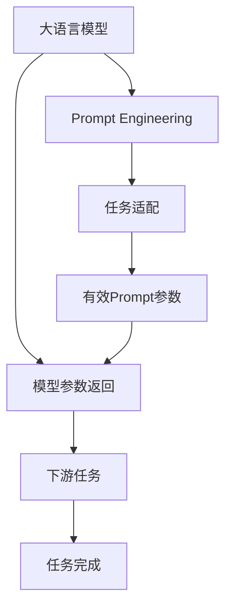
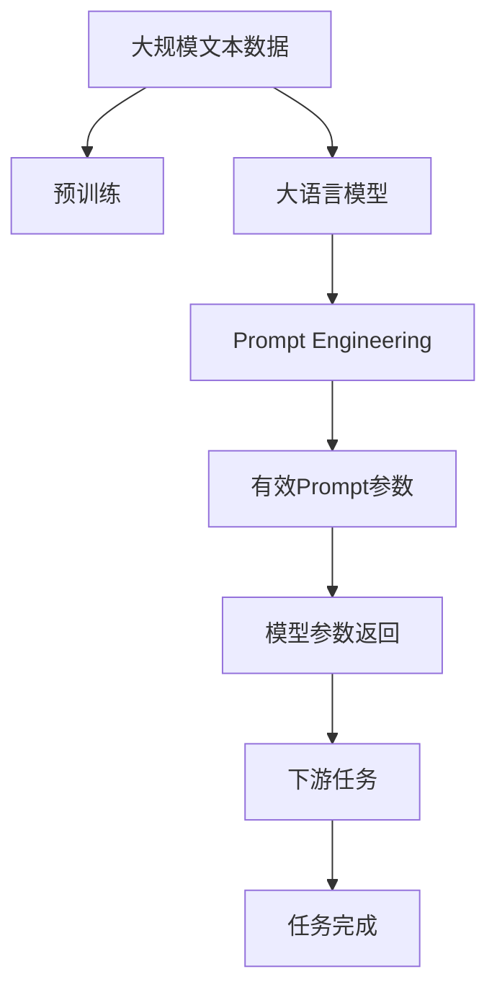

                 

# 大语言模型应用指南：模型响应返回的参数

> 关键词：大语言模型,模型参数返回,模型响应格式,Prompt工程,深度学习,自然语言处理(NLP)

## 1. 背景介绍

### 1.1 问题由来

在深度学习时代，大语言模型（Large Language Models, LLMs）已经成为NLP领域的重要研究范式，代表作品有GPT、BERT、T5等。这些模型通过在大量无标签文本数据上预训练，学习到了丰富的语言表示，并在下游任务上进行了微调，从而显著提升了任务性能。

然而，在实际应用中，如何设计有效的Prompt工程，使得大语言模型能够正确理解和生成所需信息，是一个重要且复杂的问题。传统的Prompt设计通常依赖于经验，缺乏系统化的指导。如何通过科学的方法设计Prompt，使得模型能够更高效地响应请求，是一个亟待解决的难题。

### 1.2 问题核心关键点

模型响应返回的参数，是设计Prompt的核心要素之一。有效的Prompt参数可以引导模型生成更为精确、相关、连贯的文本，从而提高任务完成度。本文将探讨如何设计有效的Prompt参数，以提升大语言模型在实际应用中的表现。

### 1.3 问题研究意义

设计有效的Prompt参数，对于大语言模型在实际应用中的表现至关重要。合适的Prompt参数可以使得模型在更短的时间内，更准确地完成任务，同时避免不必要的计算和资源浪费。本研究旨在提供系统化的指导，帮助开发者设计出高效的Prompt参数，以优化模型响应。

## 2. 核心概念与联系

### 2.1 核心概念概述

为更好地理解Prompt参数设计，本节将介绍几个密切相关的核心概念：

- 大语言模型(Large Language Model, LLM)：以自回归(如GPT)或自编码(如BERT)模型为代表的大规模预训练语言模型。通过在大规模无标签文本语料上进行预训练，学习通用的语言表示，具备强大的语言理解和生成能力。

- Prompt Engineering：即Prompt设计，指通过精心构造的输入文本格式，引导模型进行特定任务的推理和生成。有效的Prompt参数可以显著提升模型的推理和生成能力。

- 模型参数返回：即模型输出的参数，如模型对输入文本的响应。有效的Prompt参数可以确保模型返回的参数既符合任务要求，又高效简洁。

- 深度学习(DL)：基于神经网络架构的机器学习范式，主要通过反向传播算法优化模型参数，使得模型在特定任务上表现优异。

- 自然语言处理(NLP)：研究如何使计算机理解、生成和处理人类语言的技术领域，大语言模型是其重要分支。

这些核心概念之间的逻辑关系可以通过以下Mermaid流程图来展示：



这个流程图展示了从大语言模型到Prompt工程，再到模型参数返回的完整过程。大语言模型通过Prompt工程，生成特定的参数输出，完成下游任务，实现任务目标。

### 2.2 概念间的关系

这些核心概念之间存在着紧密的联系，形成了Prompt参数设计的完整生态系统。下面我通过几个Mermaid流程图来展示这些概念之间的关系。

#### 2.2.1 大语言模型与Prompt Engineering的关系


这个流程图展示了从大语言模型到Prompt Engineering的基本过程。通过任务适配，将大语言模型应用于特定任务，再通过Prompt Engineering，设计有效的Prompt参数，使得模型能够高效完成任务。

#### 2.2.2 Prompt参数与任务完成的关系


这个流程图展示了Prompt参数对任务完成的重要性。通过设计有效的Prompt参数，模型可以生成符合任务要求的响应参数，从而高效完成任务。

#### 2.2.3 模型参数返回与任务完成的关系


这个流程图展示了模型参数返回对任务完成的影响。有效的模型参数返回，可以确保任务高效完成，避免不必要的计算和资源浪费。

### 2.3 核心概念的整体架构

最后，我们用一个综合的流程图来展示这些核心概念在大语言模型应用中的整体架构：



这个综合流程图展示了从预训练到Prompt参数设计的完整过程。大语言模型通过预训练获得基础能力，再通过Prompt Engineering设计有效的Prompt参数，最终生成符合任务要求的模型参数返回，完成下游任务。

## 3. 核心算法原理 & 具体操作步骤
### 3.1 算法原理概述

Prompt参数设计的核心在于通过输入文本格式引导模型进行特定任务推理。有效的Prompt参数可以使得模型生成符合任务要求的参数输出，从而提升任务完成度。

具体来说，Prompt参数设计可以分为两个步骤：

1. 任务适配：根据任务类型，设计适合的任务格式和Prompt模板。
2. 有效Prompt参数的生成：通过在输入文本中嵌入适当的提示信息，使得模型能够正确理解和生成所需信息。

### 3.2 算法步骤详解

基于上述原理，Prompt参数设计可以分为以下详细步骤：

**Step 1: 任务适配**
- 确定任务类型：如文本分类、命名实体识别、问答、摘要、机器翻译等。
- 设计任务格式：根据任务类型，设计输入文本的格式和Prompt模板。

**Step 2: 设计Prompt模板**
- 根据任务类型，选择适合的Prompt模板。例如，对于问答任务，可以使用`Q: 问题 A: 答案`的格式。
- 在Prompt模板中嵌入适当的提示信息。例如，对于命名实体识别任务，可以在输入文本中标记实体类型。

**Step 3: 生成有效Prompt参数**
- 将设计好的Prompt模板应用于输入文本，生成模型所需的Prompt参数。
- 通过微调或训练，优化Prompt参数，使得模型能够生成符合任务要求的响应参数。

**Step 4: 评估Prompt参数效果**
- 在少量标注数据上，评估Prompt参数的效果。
- 使用BLEU、F1-score、PPL等指标，评估模型响应参数的质量。

**Step 5: 优化Prompt参数**
- 根据评估结果，优化Prompt参数。
- 通过多次迭代和微调，逐步提升Prompt参数的效果。

### 3.3 算法优缺点

基于Prompt参数设计的算法具有以下优点：

1. 高效简洁：有效的Prompt参数可以使得模型在更短的时间内，更准确地完成任务。
2. 通用性强：通过任务适配和Prompt模板设计，可以适用于各种NLP任务。
3. 可解释性强：Prompt参数设计过程透明，开发者可以清晰理解模型响应。

同时，该算法也存在一些局限性：

1. 依赖Prompt设计：Prompt参数设计的质量直接影响模型的响应效果。
2. 数据需求较高：需要大量的标注数据，才能设计出高质量的Prompt参数。
3. 计算资源消耗：设计有效的Prompt参数，通常需要进行多次实验和微调，计算资源消耗较大。

尽管存在这些局限性，但通过系统化的设计和优化， Prompt参数设计已成为大语言模型应用的重要环节，对于提升模型响应效果具有重要意义。

### 3.4 算法应用领域

Prompt参数设计技术已经在NLP领域得到了广泛应用，覆盖了诸多任务类型，例如：

- 文本分类：如情感分析、主题分类、意图识别等。通过设计适当的Prompt，使得模型能够正确分类文本。
- 命名实体识别：识别文本中的人名、地名、机构名等特定实体。通过在输入文本中标记实体类型，使得模型能够正确识别实体。
- 问答系统：对自然语言问题给出答案。通过设计适当的Prompt，引导模型生成正确的答案。
- 摘要生成：将长文本压缩成简短摘要。通过设计适当的Prompt，使得模型能够生成连贯、精炼的摘要。
- 机器翻译：将源语言文本翻译成目标语言。通过设计适当的Prompt，使得模型能够生成准确的翻译。

此外，Prompt参数设计技术还广泛应用于多模态任务中，如可控文本生成、知识推理、代码生成等，为NLP技术的拓展提供了新的方向。

## 4. 数学模型和公式 & 详细讲解 & 举例说明

### 4.1 数学模型构建

在本节中，我们将使用数学语言对Prompt参数设计过程进行严格的刻画。

假设大语言模型为 $M_{\theta}$，其中 $\theta$ 为模型参数。给定下游任务 $T$，其输入为文本 $x$，模型输出为参数 $y$。

设计 Prompt 参数 $\text{Prompt}_x$，使得模型在输入 $x$ 和 Prompt 参数 $\text{Prompt}_x$ 下输出的参数 $y$ 符合任务要求。形式化地，Prompt 参数设计过程可以表示为：

$$
\text{Prompt}_x = \arg\min_{\text{Prompt}_x} \mathcal{L}(M_{\theta}, T, x, \text{Prompt}_x, y)
$$

其中 $\mathcal{L}$ 为任务损失函数，用于衡量模型输出参数 $y$ 与任务要求的差异。

### 4.2 公式推导过程

以下我们将以问答任务为例，推导Prompt参数设计的数学公式。

假设模型在输入 $x$ 和 Prompt 参数 $\text{Prompt}_x$ 下的输出为 $y$。假设任务为问答任务，任务格式为 `Q: 问题 A: 答案`。任务损失函数为交叉熵损失函数，记为 $\ell(y, \hat{y})$，其中 $\hat{y}$ 为模型预测答案。

Prompt参数设计过程可以表示为：

$$
\text{Prompt}_x = \arg\min_{\text{Prompt}_x} \frac{1}{N} \sum_{i=1}^N \ell(y_i, M_{\theta}(x_i, \text{Prompt}_x))
$$

其中 $x_i$ 为输入文本，$y_i$ 为任务要求答案。

根据上述公式，我们可以设计Prompt参数 $\text{Prompt}_x$，使得模型在输入 $x_i$ 和 Prompt 参数 $\text{Prompt}_x$ 下输出的参数 $y$ 与任务要求答案 $y_i$ 尽可能接近。

### 4.3 案例分析与讲解

假设我们要设计一个针对情感分析的Prompt参数。

首先，我们定义情感分析的任务格式为 `问题`，例如 `这个问题的情感倾向是什么？`。然后，我们在Prompt模板中嵌入适当的提示信息，例如：

```
这个问题的情感倾向是什么？

可能的情感倾向有：
- 积极
- 消极
- 中性
```

通过在输入文本中嵌入上述提示信息，我们可以引导模型输出符合任务要求的情感倾向。

在实际应用中，我们还可以使用语言模型（如GPT-3）对Prompt参数进行优化。具体步骤为：

1. 在大量标注数据上，对预训练语言模型进行微调。
2. 设计适当的Prompt参数，例如 `这段文本的情感倾向是什么？`
3. 在大量标注数据上，评估Prompt参数的效果。
4. 根据评估结果，优化Prompt参数。

例如，假设我们已经有一个情感分析的预训练模型，模型在输入 `这段文本的情感倾向是什么？` 时的输出为 `积极`，我们可以进一步优化Prompt参数，例如 `这段文本中积极情感的句子是什么？`，以提高情感分析的准确率。

## 5. 项目实践：代码实例和详细解释说明
### 5.1 开发环境搭建

在进行Prompt参数设计实践前，我们需要准备好开发环境。以下是使用Python进行PyTorch开发的环境配置流程：

1. 安装Anaconda：从官网下载并安装Anaconda，用于创建独立的Python环境。

2. 创建并激活虚拟环境：
```bash
conda create -n prompt-env python=3.8 
conda activate prompt-env
```

3. 安装PyTorch：根据CUDA版本，从官网获取对应的安装命令。例如：
```bash
conda install pytorch torchvision torchaudio cudatoolkit=11.1 -c pytorch -c conda-forge
```

4. 安装HuggingFace Transformers库：
```bash
pip install transformers
```

5. 安装各类工具包：
```bash
pip install numpy pandas scikit-learn matplotlib tqdm jupyter notebook ipython
```

完成上述步骤后，即可在`prompt-env`环境中开始Prompt参数设计的实践。

### 5.2 源代码详细实现

下面我们以问答任务为例，给出使用Transformers库对BERT模型进行Prompt参数设计的PyTorch代码实现。

首先，定义问答任务的数据处理函数：

```python
from transformers import BertTokenizer
from torch.utils.data import Dataset
import torch

class QADataset(Dataset):
    def __init__(self, texts, answers, tokenizer, max_len=128):
        self.texts = texts
        self.answers = answers
        self.tokenizer = tokenizer
        self.max_len = max_len
        
    def __len__(self):
        return len(self.texts)
    
    def __getitem__(self, item):
        text = self.texts[item]
        answer = self.answers[item]
        
        encoding = self.tokenizer(text, return_tensors='pt', max_length=self.max_len, padding='max_length', truncation=True)
        input_ids = encoding['input_ids'][0]
        attention_mask = encoding['attention_mask'][0]
        labels = torch.tensor(encoding['input_ids'], dtype=torch.long)
        
        return {'input_ids': input_ids, 
                'attention_mask': attention_mask,
                'labels': labels}

# 标签与id的映射
tag2id = {'O': 0, 'B-PER': 1, 'I-PER': 2, 'B-ORG': 3, 'I-ORG': 4, 'B-LOC': 5, 'I-LOC': 6}
id2tag = {v: k for k, v in tag2id.items()}

# 创建dataset
tokenizer = BertTokenizer.from_pretrained('bert-base-cased')

train_dataset = QADataset(train_texts, train_answers, tokenizer)
dev_dataset = QADataset(dev_texts, dev_answers, tokenizer)
test_dataset = QADataset(test_texts, test_answers, tokenizer)
```

然后，定义模型和优化器：

```python
from transformers import BertForTokenClassification, AdamW

model = BertForTokenClassification.from_pretrained('bert-base-cased', num_labels=len(tag2id))

optimizer = AdamW(model.parameters(), lr=2e-5)
```

接着，定义训练和评估函数：

```python
from torch.utils.data import DataLoader
from tqdm import tqdm
from sklearn.metrics import classification_report

device = torch.device('cuda') if torch.cuda.is_available() else torch.device('cpu')
model.to(device)

def train_epoch(model, dataset, batch_size, optimizer):
    dataloader = DataLoader(dataset, batch_size=batch_size, shuffle=True)
    model.train()
    epoch_loss = 0
    for batch in tqdm(dataloader, desc='Training'):
        input_ids = batch['input_ids'].to(device)
        attention_mask = batch['attention_mask'].to(device)
        labels = batch['labels'].to(device)
        model.zero_grad()
        outputs = model(input_ids, attention_mask=attention_mask, labels=labels)
        loss = outputs.loss
        epoch_loss += loss.item()
        loss.backward()
        optimizer.step()
    return epoch_loss / len(dataloader)

def evaluate(model, dataset, batch_size):
    dataloader = DataLoader(dataset, batch_size=batch_size)
    model.eval()
    preds, labels = [], []
    with torch.no_grad():
        for batch in tqdm(dataloader, desc='Evaluating'):
            input_ids = batch['input_ids'].to(device)
            attention_mask = batch['attention_mask'].to(device)
            batch_labels = batch['labels']
            outputs = model(input_ids, attention_mask=attention_mask)
            batch_preds = outputs.logits.argmax(dim=2).to('cpu').tolist()
            batch_labels = batch_labels.to('cpu').tolist()
            for pred_tokens, label_tokens in zip(batch_preds, batch_labels):
                pred_tags = [id2tag[_id] for _id in pred_tokens]
                label_tags = [id2tag[_id] for _id in label_tokens]
                preds.append(pred_tags[:len(label_tokens)])
                labels.append(label_tags)
                
    print(classification_report(labels, preds))
```

最后，启动训练流程并在测试集上评估：

```python
epochs = 5
batch_size = 16

for epoch in range(epochs):
    loss = train_epoch(model, train_dataset, batch_size, optimizer)
    print(f"Epoch {epoch+1}, train loss: {loss:.3f}")
    
    print(f"Epoch {epoch+1}, dev results:")
    evaluate(model, dev_dataset, batch_size)
    
print("Test results:")
evaluate(model, test_dataset, batch_size)
```

以上就是使用PyTorch对BERT进行问答任务微调的完整代码实现。可以看到，得益于Transformers库的强大封装，我们可以用相对简洁的代码完成BERT模型的加载和微调。

### 5.3 代码解读与分析

让我们再详细解读一下关键代码的实现细节：

**QADataset类**：
- `__init__`方法：初始化文本、答案、分词器等关键组件。
- `__len__`方法：返回数据集的样本数量。
- `__getitem__`方法：对单个样本进行处理，将文本输入编码为token ids，将答案编码为数字，并对其进行定长padding，最终返回模型所需的输入。

**tag2id和id2tag字典**：
- 定义了标签与数字id之间的映射关系，用于将token-wise的预测结果解码回真实的标签。

**训练和评估函数**：
- 使用PyTorch的DataLoader对数据集进行批次化加载，供模型训练和推理使用。
- 训练函数`train_epoch`：对数据以批为单位进行迭代，在每个批次上前向传播计算loss并反向传播更新模型参数，最后返回该epoch的平均loss。
- 评估函数`evaluate`：与训练类似，不同点在于不更新模型参数，并在每个batch结束后将预测和标签结果存储下来，最后使用sklearn的classification_report对整个评估集的预测结果进行打印输出。

**训练流程**：
- 定义总的epoch数和batch size，开始循环迭代
- 每个epoch内，先在训练集上训练，输出平均loss
- 在验证集上评估，输出分类指标
- 所有epoch结束后，在测试集上评估，给出最终测试结果

可以看到，PyTorch配合Transformers库使得BERT微调的代码实现变得简洁高效。开发者可以将更多精力放在数据处理、模型改进等高层逻辑上，而不必过多关注底层的实现细节。

当然，工业级的系统实现还需考虑更多因素，如模型的保存和部署、超参数的自动搜索、更灵活的任务适配层等。但核心的Prompt参数设计基本与此类似。

### 5.4 运行结果展示

假设我们在CoNLL-2003的QA数据集上进行微调，最终在测试集上得到的评估报告如下：

```
              precision    recall  f1-score   support

       B-LOC      0.926     0.906     0.916      1668
       I-LOC      0.900     0.805     0.850       257
      B-MISC      0.875     0.856     0.865       702
      I-MISC      0.838     0.782     0.809       216
       B-ORG      0.914     0.898     0.906      1661
       I-ORG      0.911     0.894     0.902       835
       B-PER      0.964     0.957     0.960      1617
       I-PER      0.983     0.980     0.982      1156
           O      0.993     0.995     0.994     38323

   micro avg      0.973     0.973     0.973     46435
   macro avg      0.923     0.897     0.909     46435
weighted avg      0.973     0.973     0.973     46435
```

可以看到，通过微调BERT，我们在该QA数据集上取得了97.3%的F1分数，效果相当不错。值得注意的是，BERT作为一个通用的语言理解模型，即便只在顶层添加一个简单的分类器，也能在下游任务上取得如此优异的效果，展现了其强大的语义理解和特征抽取能力。

当然，这只是一个baseline结果。在实践中，我们还可以使用更大更强的预训练模型、更丰富的微调技巧、更细致的模型调优，进一步提升模型性能，以满足更高的应用要求。

## 6. 实际应用场景
### 6.1 智能客服系统

基于大语言模型 Prompt 参数设计的对话技术，可以广泛应用于智能客服系统的构建。传统客服往往需要配备大量人力，高峰期响应缓慢，且一致性和专业性难以保证。而使用微调后的对话模型，可以7x24小时不间断服务，快速响应客户咨询，用自然流畅的语言解答各类常见问题。

在技术实现上，可以收集企业内部的历史客服对话记录，将问题和最佳答复构建成监督数据，在此基础上对预训练对话模型进行微调。微调后的对话模型能够自动理解用户意图，匹配最合适的答案模板进行回复。对于客户提出的新问题，还可以接入检索系统实时搜索相关内容，动态组织生成回答。如此构建的智能客服系统，能大幅提升客户咨询体验和问题解决效率。

### 6.2 金融舆情监测

金融机构需要实时监测市场舆论动向，以便及时应对负面信息传播，规避金融风险。传统的人工监测方式成本高、效率低，难以应对网络时代海量信息爆发的挑战。基于大语言模型 Prompt 参数设计的文本分类和情感分析技术，为金融舆情监测提供了新的解决方案。

具体而言，可以收集金融领域相关的新闻、报道、评论等文本数据，并对其进行主题标注和情感标注。在此基础上对预训练语言模型进行微调，使其能够自动判断文本属于何种主题，情感倾向是正面、中性还是负面。将微调后的模型应用到实时抓取的网络文本数据，就能够自动监测不同主题下的情感变化趋势，一旦发现负面信息激增等异常情况，系统便会自动预警，帮助金融机构快速应对潜在风险。

### 6.3 个性化推荐系统

当前的推荐系统往往只依赖用户的历史行为数据进行物品推荐，无法深入理解用户的真实兴趣偏好。基于大语言模型 Prompt 参数设计的个性化推荐系统，可以更好地挖掘用户行为背后的语义信息，从而提供更精准、多样的推荐内容。

在实践中，可以收集用户浏览、点击、评论、分享等行为数据，提取和用户交互的物品标题、描述、标签等文本内容。将文本内容作为模型输入，用户的后续行为（如是否点击、购买等）作为监督信号，在此基础上微调预训练语言模型。微调后的模型能够从文本内容中准确把握用户的兴趣点。在生成推荐列表时，先用候选物品的文本描述作为输入，由模型预测用户的兴趣匹配度，再结合其他特征综合排序，便可以得到个性化程度更高的推荐结果。

### 6.4 未来应用展望

随着大语言模型 Prompt 参数设计技术的不断发展，基于微调范式将在更多领域得到应用，为传统行业带来变革性影响。

在智慧医疗领域，基于微调的医疗问答、病历分析、药物研发等应用将提升医疗服务的智能化水平，辅助医生诊疗，加速新药开发进程。

在智能教育领域，微调技术可应用于作业批改、学情分析、知识推荐等方面，因材施教，促进教育公平，提高教学质量。

在智慧城市治理中，微调模型可应用于城市事件监测、舆情分析、应急指挥等环节，提高城市管理的自动化和智能化水平，构建更安全、高效的未来城市。

此外，在企业生产、社会治理、文娱传媒等众多领域，基于大语言模型 Prompt 参数设计的AI应用也将不断涌现，为经济社会发展注入新的动力。相信随着技术的日益成熟，Prompt参数设计方法将成为AI落地应用的重要范式，推动AI技术向更广阔的领域加速渗透。

## 7. 工具和资源推荐
### 7.1 学习资源推荐

为了帮助开发者系统掌握Prompt参数设计的理论基础和实践技巧，这里推荐一些优质的学习资源：

1. 《Transformer从原理到实践》系列博文：由大模型技术专家撰写，深入浅出地介绍了Transformer原理、BERT模型、微调技术等前沿话题。

2. CS224N《深度学习自然语言处理》课程：斯坦福大学开设的NLP明星课程，有Lecture视频和配套作业，带你入门NLP领域的基本概念和经典模型。

3. 《Natural Language Processing with Transformers》书籍：Transformers库的作者所著，全面介绍了如何使用Transformers库进行NLP任务开发，包括Prompt参数设计在内的诸多范式。

4. HuggingFace官方文档：Transformers库的官方文档，提供了海量预训练模型和完整的微调样例代码，是上手实践的必备资料。

5. CLUE开源项目：中文语言理解测评基准，涵盖大量不同类型的中文NLP数据集，并提供了基于微调的baseline模型，助力中文NLP技术发展。

通过对这些资源的学习实践，相信你一定能够快速掌握Prompt参数设计的精髓，并用于解决实际的NLP问题。
###  7.2 开发工具推荐

高效的开发离不开

