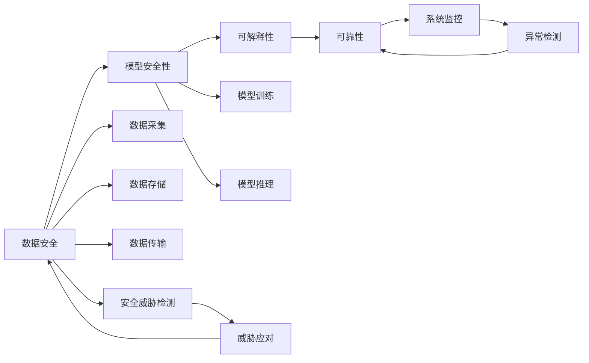
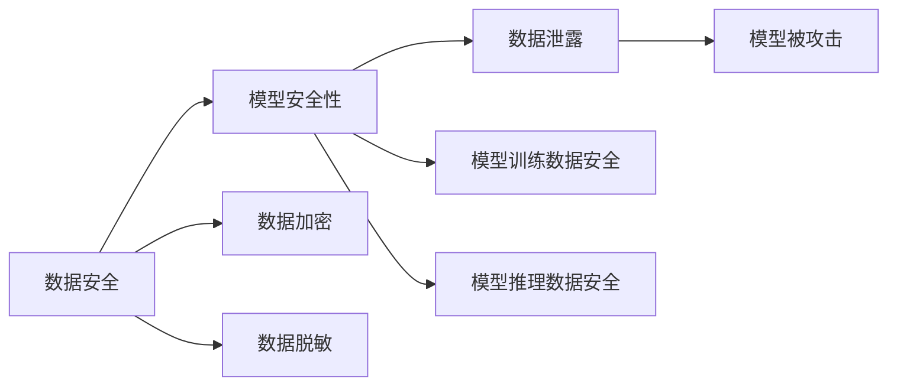
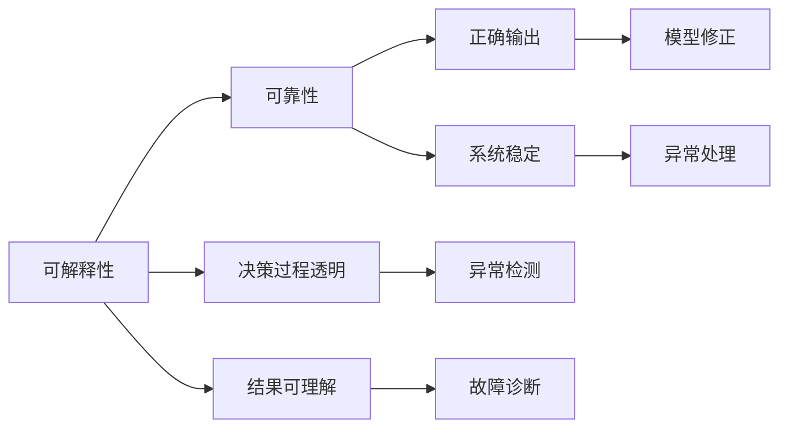
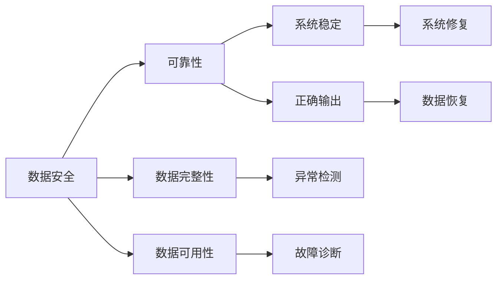
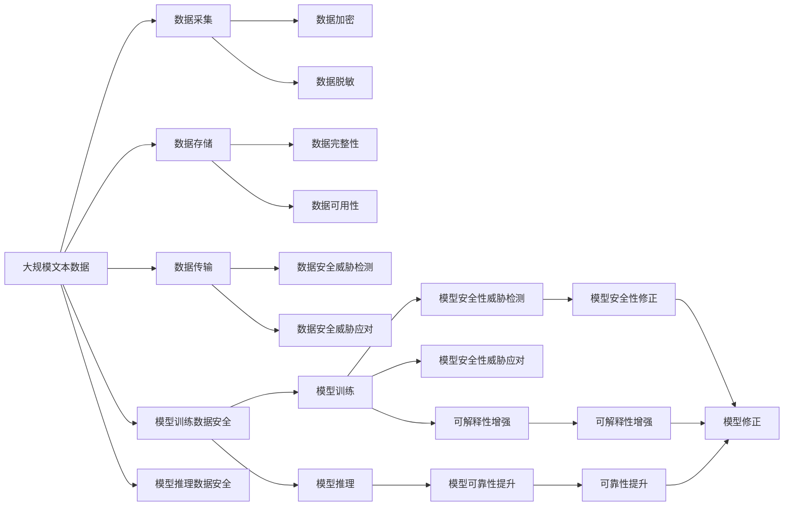

                 

# 安全、可控、可信、可靠的AI技术

> 关键词：人工智能,安全,可控,可信,可靠性

## 1. 背景介绍

### 1.1 问题由来
随着人工智能(AI)技术的快速发展，其在金融、医疗、教育、交通等多个领域的应用已经深入到人们的生活和工作之中。然而，AI技术的广泛应用也带来了诸多挑战，特别是安全性、可控性、可信性和可靠性方面的问题，严重制约了AI技术的进一步普及和落地。

人工智能的安全性、可控性、可信性和可靠性是其在实际应用中必须解决的关键问题。安全性指的是AI系统在面对攻击和恶意行为时，能否保持稳定和不被破坏；可控性指的是AI系统在决策和行为上能否被合理管理和控制；可信性指的是AI系统能否提供真实、可靠的信息和预测；可靠性指的是AI系统能否持续、稳定地执行其功能。

这些问题不仅关系到AI技术的商业应用，也直接影响到社会和国家的安全和稳定。因此，如何构建安全、可控、可信、可靠的AI技术，成为当前AI研究的重要课题。

### 1.2 问题核心关键点
构建安全、可控、可信、可靠的AI技术，涉及多个关键领域和环节：

1. 数据安全：确保数据在采集、存储、传输和处理过程中不被泄露或篡改。
2. 模型安全性：保证AI模型在训练和推理过程中不被攻击或干扰。
3. 可解释性和可控性：使AI系统的决策过程透明、可解释，能够被合理控制和管理。
4. 可靠性：确保AI系统在面对未知数据和突发事件时，能够稳定运行并给出正确的输出。

本文将从数据安全、模型安全性、可解释性和可靠性四个方面，探讨如何构建安全、可控、可信、可靠的AI技术。

### 1.3 问题研究意义
构建安全、可控、可信、可靠的AI技术，对于推动AI技术的健康发展和应用具有重要意义：

1. 增强社会和国家的安全稳定：AI技术在金融、国防、医疗等领域的应用，对于国家安全和社会稳定至关重要。通过构建安全、可控、可信的AI系统，可以避免AI技术的滥用和误用，保障国家安全和社会稳定。
2. 提升商业应用效率和效益：AI技术在商业中的应用可以显著提高企业的效率和效益。通过构建可靠的AI系统，可以确保AI技术的稳定性和持续性，提升商业应用的效果和可靠性。
3. 推动技术创新和进步：构建安全、可控、可信、可靠的AI技术，需要跨学科、跨领域的合作和创新。这将推动AI技术在更多领域的深入应用和创新发展。
4. 增强公众信任和接受度：AI技术的可信性和可靠性将增强公众对其的信任和接受度，促进AI技术的普及和应用。

本文聚焦于构建安全、可控、可信、可靠的AI技术，从数据安全、模型安全性、可解释性和可靠性四个方面进行详细探讨，为AI技术的健康发展和应用提供指导。

## 2. 核心概念与联系

### 2.1 核心概念概述

为更好地理解如何构建安全、可控、可信、可靠的AI技术，本节将介绍几个密切相关的核心概念：

- 数据安全：指在数据处理过程中，确保数据不被泄露、篡改、破坏或非法获取，保障数据的完整性和保密性。
- 模型安全性：指在AI模型训练和推理过程中，确保模型不被攻击、破坏或干扰，保障模型的稳定性和安全性。
- 可解释性：指AI系统的决策过程和结果能够被合理解释和理解，保障系统的透明度和可理解性。
- 可靠性：指AI系统在面对未知数据和突发事件时，能够稳定运行并给出正确的输出，保障系统的稳定性和持续性。

这些核心概念之间存在着紧密的联系，构成了安全、可控、可信、可靠AI技术的整体框架。我们通过以下Mermaid流程图来展示这些核心概念之间的关系：

这个流程图展示了数据安全、模型安全性、可解释性和可靠性之间的逻辑关系：

1. 数据安全是AI系统的基础，数据采集、存储、传输过程中需要确保数据的完整性和保密性。
2. 模型安全性是数据安全的延续，模型在训练和推理过程中需要防止攻击和干扰，保障模型的稳定性和安全性。
3. 可解释性是模型安全性的补充，模型决策过程和结果需要透明、可解释，增强系统的可信性和可控性。
4. 可靠性是可解释性的保证，系统需要在各种情况下保持稳定运行，给出正确的输出。

这些核心概念共同构成了安全、可控、可信、可靠AI技术的核心要素，缺一不可。

### 2.2 概念间的关系

这些核心概念之间存在着紧密的联系，形成了安全、可控、可信、可靠AI技术的完整生态系统。下面我通过几个Mermaid流程图来展示这些核心概念之间的关系。

#### 2.2.1 数据安全与模型安全性

这个流程图展示了数据安全与模型安全性之间的逻辑关系：

1. 数据安全是模型安全性的基础，数据泄露会导致模型被攻击或破坏。
2. 模型安全性是数据安全的延续，模型训练和推理过程中的数据安全也需要保障。
3. 数据加密和脱敏是数据安全的关键手段，用于保护数据不被泄露或篡改。
4. 模型训练和推理过程中的数据安全措施，可以防止模型被攻击和破坏。

#### 2.2.2 可解释性与可靠性

这个流程图展示了可解释性与可靠性之间的逻辑关系：

1. 可解释性是可靠性的基础，决策过程透明和结果可理解有助于保障系统的稳定性和持续性。
2. 可靠性是可解释性的保证，系统的正确输出和稳定运行需要可解释性作为支撑。
3. 决策过程透明和结果可理解，有助于及时发现和处理异常，提升系统的可靠性。
4. 异常检测和故障诊断，可以及时修正模型和处理异常，确保系统可靠性。

#### 2.2.3 数据安全与可靠性

这个流程图展示了数据安全与可靠性之间的逻辑关系：

1. 数据安全是可靠性的基础，数据完整性和可用性保障了系统的稳定性和正确输出。
2. 可靠性是数据安全的延续，系统的稳定运行需要数据安全和完整性作为保障。
3. 数据完整性和可用性的异常检测和故障诊断，可以及时修复和恢复数据，确保系统可靠性。
4. 系统的稳定运行和正确输出，反过来保障了数据的完整性和可用性。

### 2.3 核心概念的整体架构

最后，我们用一个综合的流程图来展示这些核心概念在大语言模型微调过程中的整体架构：

这个综合流程图展示了从数据采集、存储、传输到模型训练、推理，再到模型安全性增强、可靠性提升的全过程，每个环节都需要考虑数据安全、模型安全性和可靠性保障。通过这些流程图，我们可以更清晰地理解构建安全、可控、可信、可靠AI技术的过程和关键点。

## 3. 核心算法原理 & 具体操作步骤
### 3.1 算法原理概述

构建安全、可控、可信、可靠的AI技术，本质上是多学科交叉、多技术融合的结果。从数据安全、模型安全性、可解释性和可靠性四个方面，本文将详细介绍相应的核心算法和具体操作步骤。

### 3.2 算法步骤详解

#### 3.2.1 数据安全

数据安全是AI系统构建的基础，需要从数据采集、存储、传输、处理等环节进行全面保障。以下是数据安全的主要操作步骤：

1. **数据采集安全**：在数据采集阶段，需要对数据来源进行严格审查和认证，防止非法数据接入。采用加密传输方式，保障数据在传输过程中的安全性。
2. **数据存储安全**：在数据存储阶段，需要采用数据加密和备份措施，防止数据泄露和丢失。采用访问控制和权限管理，确保只有授权用户才能访问数据。
3. **数据传输安全**：在数据传输阶段，需要采用加密传输方式，防止数据在传输过程中被窃听或篡改。采用防火墙和入侵检测系统，防止恶意攻击。
4. **数据处理安全**：在数据处理阶段，需要对数据进行去标识化处理，防止数据泄露个人隐私。采用访问控制和权限管理，防止未经授权的数据处理。

#### 3.2.2 模型安全性

模型安全性是AI系统构建的关键环节，需要从模型训练和推理两个环节进行全面保障。以下是模型安全性主要的具体操作步骤：

1. **模型训练安全**：在模型训练阶段，需要采用数据加密和脱敏技术，防止训练数据泄露。采用对抗训练技术，防止模型被攻击或破坏。采用正则化技术和权重衰减，防止模型过拟合。
2. **模型推理安全**：在模型推理阶段，需要采用输入数据的安全检查，防止恶意输入影响模型输出。采用模型监控和异常检测技术，及时发现和应对模型异常。采用梯度压缩和量化技术，提升模型推理效率。

#### 3.2.3 可解释性

可解释性是AI系统构建的重要环节，需要从模型设计、模型训练和模型推理三个环节进行全面保障。以下是可解释性主要的具体操作步骤：

1. **模型设计**：在模型设计阶段，需要采用可解释的模型结构，如决策树、线性模型等。采用可解释的特征工程方法，确保模型的可解释性。
2. **模型训练**：在模型训练阶段，需要采用可解释的优化算法，如L2正则化、Dropout等。采用可解释的损失函数，如交叉熵损失、均方误差损失等。
3. **模型推理**：在模型推理阶段，需要采用可解释的推理机制，如规则推理、因果推理等。采用可解释的输出格式，如文本解释、可视化图形等。

#### 3.2.4 可靠性

可靠性是AI系统构建的最终目标，需要从模型设计、模型训练和模型推理三个环节进行全面保障。以下是可靠性主要的具体操作步骤：

1. **模型设计**：在模型设计阶段，需要采用鲁棒性和稳健性强的模型结构，如卷积神经网络、循环神经网络等。采用多样化的模型训练数据，防止模型过拟合。
2. **模型训练**：在模型训练阶段，需要采用数据增强和对抗训练技术，提升模型的泛化能力和鲁棒性。采用正则化技术和权重衰减，防止模型过拟合。
3. **模型推理**：在模型推理阶段，需要采用模型监控和异常检测技术，及时发现和应对模型异常。采用模型更新和维护机制，确保模型的持续性和稳定性。

### 3.3 算法优缺点

构建安全、可控、可信、可靠的AI技术，具有以下优点：

1. 提升系统的安全性和稳定性：通过数据安全和模型安全性的保障，可以防止数据泄露和模型攻击，提升系统的安全性和稳定性。
2. 增强系统的可控性和可解释性：通过可解释性的保障，可以增强系统的透明度和可控性，使系统决策过程透明、可理解。
3. 提高系统的可靠性和持续性：通过可靠性的保障，可以确保系统在各种情况下稳定运行，给出正确的输出。
4. 推动技术创新和应用普及：构建安全、可控、可信、可靠AI技术，需要跨学科、跨领域的合作和创新，推动AI技术的创新和发展。

同时，构建安全、可控、可信、可靠的AI技术也面临一些挑战：

1. 技术复杂度高：构建安全、可控、可信、可靠AI技术需要跨学科、跨领域的合作，技术复杂度较高，实施难度较大。
2. 成本高：数据安全、模型安全性和可靠性保障需要高成本的技术和资源投入，经济成本较高。
3. 性能影响：部分安全、可控、可信、可靠技术措施可能会影响系统的性能和效率，需要在性能和安全之间进行权衡。

尽管存在这些挑战，但通过跨学科合作和持续技术创新，可以逐步解决这些问题，推动安全、可控、可信、可靠AI技术的健康发展和应用。

### 3.4 算法应用领域

构建安全、可控、可信、可靠的AI技术，已经在金融、医疗、交通、安全等多个领域得到了广泛应用，以下是一些典型的应用案例：

1. **金融领域**：金融机构利用AI技术进行风险评估、欺诈检测、客户画像等，通过数据安全和模型安全性的保障，提升系统的稳定性和安全性，确保金融数据的隐私和安全性。
2. **医疗领域**：医疗机构利用AI技术进行疾病诊断、治疗方案推荐、医疗影像分析等，通过数据安全和模型安全性的保障，提升系统的可解释性和可靠性，确保医疗数据的安全和系统的准确性。
3. **交通领域**：交通管理部门利用AI技术进行交通流量预测、交通异常检测、智能导航等，通过数据安全和模型安全性的保障，提升系统的稳定性和安全性，确保交通数据的隐私和安全性。
4. **安全领域**：安全机构利用AI技术进行网络威胁检测、反欺诈检测、图像识别等，通过数据安全和模型安全性的保障，提升系统的可控性和可解释性，确保安全数据的安全和系统的准确性。

## 4. 数学模型和公式 & 详细讲解 & 举例说明

### 4.1 数学模型构建

构建安全、可控、可信、可靠的AI技术，涉及多个数学模型和公式，以下是几个关键的数学模型和公式：

#### 4.1.1 数据安全模型

数据安全模型主要涉及数据加密和数据脱敏技术，以下是常见的数据加密和数据脱敏模型：

1. **数据加密模型**：
   - 对称加密模型：采用同一个密钥进行加密和解密，速度快但密钥分发和管理复杂。常用的对称加密算法有AES、DES等。
   - 非对称加密模型：采用公钥和私钥进行加密和解密，安全性高但速度较慢。常用的非对称加密算法有RSA、ECC等。
   - 混合加密模型：结合对称加密和非对称加密的优点，通常采用对称加密进行数据加密，非对称加密进行密钥分发和管理。

2. **数据脱敏模型**：
   - 数据掩码模型：将数据中的敏感信息进行掩码处理，防止数据泄露。常用的掩码方法有随机掩码、固定掩码等。
   - 数据替换模型：将数据中的敏感信息进行替换处理，防止数据泄露。常用的替换方法有随机替换、固定替换等。
   - 数据泛化模型：将数据中的敏感信息进行泛化处理，防止数据泄露。常用的泛化方法有数据分组、数据聚合等。

#### 4.1.2 模型安全性模型

模型安全性模型主要涉及对抗训练和正则化技术，以下是常见的模型安全性模型：

1. **对抗训练模型**：
   - 对抗样本生成模型：通过生成对抗样本对模型进行训练，提升模型的鲁棒性和泛化能力。常用的对抗样本生成方法有FGSM、PGD等。
   - 对抗样本检测模型：通过检测对抗样本对模型进行训练，提升模型的鲁棒性和泛化能力。常用的对抗样本检测方法有VAT、MI等。

2. **正则化模型**：
   - L2正则化模型：通过L2范数惩罚模型的权重，防止模型过拟合。
   - Dropout模型：通过随机丢弃神经元，防止模型过拟合。
   - EarlyStopping模型：通过监控验证集性能，防止模型过拟合。

#### 4.1.3 可解释性模型

可解释性模型主要涉及可解释的模型结构和可解释的损失函数，以下是常见的可解释性模型：

1. **可解释的模型结构**：
   - 决策树模型：采用树形结构进行决策，易于理解和解释。
   - 线性模型：采用线性函数进行决策，易于理解和解释。
   - 规则推理模型：采用规则进行推理，易于理解和解释。

2. **可解释的损失函数**：
   - 交叉熵损失函数：用于分类任务，易于理解和解释。
   - 均方误差损失函数：用于回归任务，易于理解和解释。
   - Hinge损失函数：用于二分类任务，易于理解和解释。

#### 4.1.4 可靠性模型

可靠性模型主要涉及模型的鲁棒性和稳健性，以下是常见的可靠性模型：

1. **鲁棒性模型**：
   - 卷积神经网络模型：具有局部连接和权值共享的特性，鲁棒性较强。
   - 循环神经网络模型：具有时间序列信息处理的能力，鲁棒性较强。
   - 对抗训练模型：通过生成对抗样本进行训练，提升模型的鲁棒性。

2. **稳健性模型**：
   - 数据增强模型：通过生成新的数据样本，提升模型的泛化能力。
   - 正则化模型：通过惩罚模型的权重，防止模型过拟合。
   - 对抗训练模型：通过生成对抗样本进行训练，提升模型的鲁棒性。

### 4.2 公式推导过程

#### 4.2.1 数据安全公式推导

数据安全涉及数据加密和数据脱敏技术，以下是常见的数据安全公式推导：

1. **对称加密模型**：
   - 假设明文为 $M$，密钥为 $K$，加密函数为 $E$，解密函数为 $D$，则加密过程为：
   - $C=E(M,K)$
   - 解密过程为：
   - $M=D(C,K)$

2. **非对称加密模型**：
   - 假设公钥为 $K_{pub}$，私钥为 $K_{priv}$，加密函数为 $E$，解密函数为 $D$，则加密过程为：
   - $C=E(M,K_{pub})$
   - 解密过程为：
   - $M=D(C,K_{priv})$

3. **混合加密模型**：
   - 采用对称加密进行数据加密，非对称加密进行密钥分发和管理，具体实现如下：
   - 随机生成对称密钥 $K_{sym}$，使用对称加密进行数据加密：
   - $C=E(M,K_{sym})$
   - 使用非对称加密对对称密钥进行加密，将加密后的密钥发送给接收方：
   - $K_{sym}'=E(K_{sym},K_{pub})$
   - 接收方使用私钥解密对称密钥，并使用对称密钥解密数据：
   - $K_{sym}=D(K_{sym}',K_{priv})$
   - $M=D(C,K_{sym})$

#### 4.2.2 模型安全性公式推导

模型安全性涉及对抗训练和正则化技术，以下是常见的模型安全性公式推导：

1. **对抗样本生成模型**：
   - 假设模型为 $f$，对抗样本为 $\delta$，对抗样本生成函数为 $G$，则对抗样本生成过程为：
   - $\delta=G(f)$

2. **对抗样本检测模型**：
   - 假设对抗样本为 $\delta$，模型为 $f$，对抗样本检测函数为 $D$，则对抗样本检测过程为：
   - $D(\delta)=1$，表示 $\delta$ 为对抗样本；
   - $D(\delta)=0$，表示 $\delta$ 不为对抗样本。

3. **L2正则化模型**：
   - 假设模型为 $f$，正则化系数为 $\lambda$，则L2正则化过程为：
   - $f_{reg}=f+\lambda\|f\|_2^2$

4. **Dropout模型**：
   - 假设神经网络中第 $i$ 个神经元的概率为 $p$，则Dropout过程为：
   - $p_i=\frac{1}{1-p}\left(1-\mathbb{P}(i \text{被保留})\right)$

5. **EarlyStopping模型**：
   - 假设模型为 $f$，训练次数为 $t$，早停阈值为 $\epsilon$，则EarlyStopping过程为：
   - $f_{early}=f$，当 $\|f-\hat{f}\|_2<\epsilon$ 时，停止训练。

#### 4.2.3 可解释性公式推导

可解释性涉及可解释的模型结构和可解释的损失函数，以下是常见的可解释性公式推导：

1. **决策树模型**：
   - 假设决策树为 $T$，输入数据为 $x$，则决策过程为：
   - $f(x)=T(x)$

2. **线性模型**：
   - 假设线性模型为 $f$，特征为 $x$，权重为 $w$，偏置为 $b$，则线性模型过程为：
   - $f(x)=w^Tx+b$

3. **规则推理模型**：
   - 假设规则为 $R$，输入数据为 $x$，则推理过程为：
   - $f(x)=R(x)$

#### 4.2.4 可靠性公式推导

可靠性涉及模型的鲁棒性和稳健性，以下是常见的可靠性公式推导：

1. **卷积神经网络模型**：
   - 假设卷积神经网络为 $f$，输入数据为 $x$，则卷积神经网络过程为：
   - $f(x)=\sum_i K_i*x_i$

2. **循环神经网络模型**：
   - 假设循环神经网络为 $f$，输入数据为 $x$，则循环神经网络过程为：
   - $f(x)=\sum_i K_i*x_i$

3. **对抗训练模型**：
   - 假设对抗训练模型为 $f$，对抗样本为 $\delta$，则对抗训练过程为：
   - $f(x+\delta)=f(x)$

4. **数据增强模型**：
   - 假设数据增强模型为 $f$，原始数据为 $x$，则数据增强过程为：
   - $f(x+\delta)$

5. **正则化模型**：
   - 假设正则化模型为 $f$，正则化系数为 $\lambda$，则正则化过程为：
   - $f_{reg}=f+\lambda\|f\|_2^2$

6. **对抗训练模型**：
   - 假设对抗训练模型为 $f$，对抗样本为 $\delta$，则对抗训练过程为：
   - $f(x+\delta)=f(x)$

### 4.3 案例分析与讲解

下面我们以金融风险评估为例，展示如何构建安全、可控、可信、可靠的AI技术。

#### 4.3.1 数据安全

在金融风险评估中，数据安全至关重要。以下是数据安全的主要操作步骤：

1. **数据采集安全**：在数据采集阶段，需要对数据来源进行严格审查和认证，防止非法数据接入。采用加密传输方式，保障数据在传输过程中的安全性。
2. **数据存储安全**：在数据存储阶段，需要采用数据加密和备份措施，防止数据泄露和丢失。采用访问控制和权限管理，确保只有授权用户才能访问数据。
3. **数据传输安全**：在数据传输阶段，需要采用加密传输方式，防止数据在传输过程中被窃听或篡改。采用防火墙和入侵检测系统，防止恶意攻击。
4. **数据处理安全**：在数据处理阶段，需要对数据进行去标识化处理，防止数据泄露个人隐私。采用访问控制和权限管理，防止未经授权的数据处理。

#### 4.3.2 模型安全性

在金融风险评估中，模型安全性同样至关重要。以下是模型安全性主要的具体操作步骤：

1. **模型训练安全**：在模型训练阶段，需要采用数据加密和脱敏技术，防止训练数据泄露。采用对抗训练技术，防止模型被攻击或破坏。采用正则化技术和权重衰减，防止模型过拟

