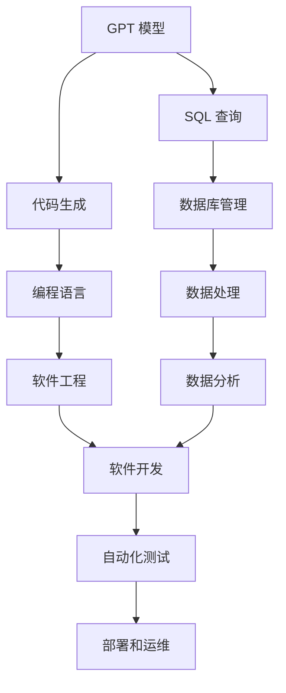
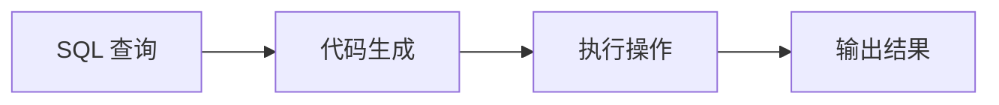
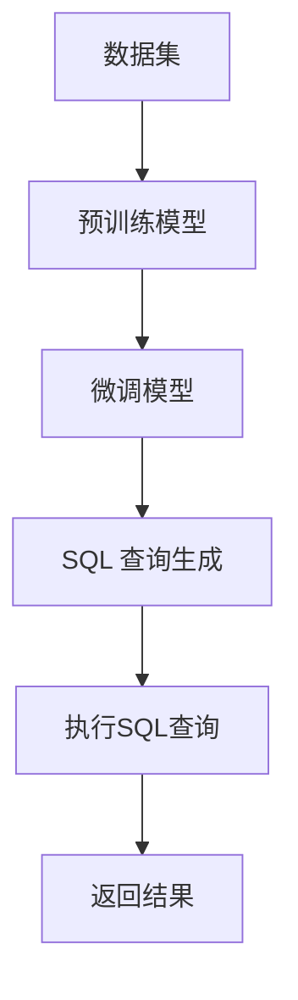

                 

# 实际执行 GPT 模型生成的函数（以 SQL 查询为例）

> 关键词：GPT模型, SQL查询, 自然语言处理, 代码生成, 语言模型, 自动编程

## 1. 背景介绍

### 1.1 问题由来

随着人工智能技术的迅猛发展，语言生成模型（如 GPT-3）已成为自然语言处理（NLP）领域的重要工具。这些模型在理解和生成自然语言方面表现出色，被广泛应用于聊天机器人、翻译、自动摘要、代码生成等场景。其中，代码生成是一个极具挑战性的任务，既需要模型理解编程语言的结构和语法，又要能够生成符合实际需求的高质量代码。

近年来，生成式预训练模型在代码生成领域也展现出了巨大潜力。通过在大规模编程数据上进行预训练，这些模型能够学习到丰富的编程知识和编程风格，并在生成代码时表现出惊人的创造力。本文章将围绕 GPT 模型在生成 SQL 查询中的应用展开，探讨如何通过 GPT 模型生成高质量的 SQL 代码。

### 1.2 问题核心关键点

为了构建高效的 SQL 查询生成系统，我们需要关注以下几个关键点：

1. **数据集选择**：选择合适的数据集进行模型的预训练和微调，确保模型能够理解和生成不同类型的 SQL 查询。
2. **模型架构**：选择合适的语言模型架构，并对其进行适当的修改，使其能够生成符合语法规则的 SQL 查询。
3. **训练策略**：采用合适的训练策略，确保模型在生成 SQL 查询时能够泛化到不同的数据场景。
4. **评估方法**：建立合适的评估方法，以量化生成 SQL 查询的质量和效率。

### 1.3 问题研究意义

SQL 查询生成技术能够显著提升软件开发效率，减少人工编写 SQL 代码的重复劳动，并降低出错率。通过 GPT 模型进行 SQL 查询生成，不仅能够快速生成高质量 SQL 查询，还能够降低开发人员的学习成本，使他们能够更加专注于业务逻辑的开发。

此外，SQL 查询生成技术还能够应用于数据分析、报表生成、数据清洗等场景，为各行各业提供更加智能的数据处理工具。因此，基于 GPT 模型进行 SQL 查询生成，具有广泛的应用前景和重要的研究价值。

## 2. 核心概念与联系

### 2.1 核心概念概述

为了更好地理解 GPT 模型在生成 SQL 查询中的应用，本节将介绍几个密切相关的核心概念：

- **GPT 模型**：基于自回归架构的生成式语言模型，能够理解并生成自然语言文本。GPT-3 是目前应用最广泛的 GPT 模型之一。
- **SQL 查询**：一种用于数据库操作的高级语言，能够以结构化方式查询和管理数据。SQL 查询由多个语句组成，包括 SELECT、INSERT、UPDATE 等。
- **代码生成**：使用计算机程序自动生成符合特定需求的代码，广泛应用于软件开发、数据分析等领域。
- **自动编程**：通过机器学习等技术自动编写程序代码，以提升编程效率和代码质量。

这些概念之间的逻辑关系可以通过以下 Mermaid 流程图来展示：

这个流程图展示了大语言模型在代码生成和 SQL 查询生成中的应用场景：

1. **GPT 模型**：用于生成符合语法规则的 SQL 查询语句。
2. **代码生成**：生成符合编程语言规范的代码，广泛应用于软件开发。
3. **SQL 查询**：通过 GPT 模型生成的 SQL 查询，用于数据库操作和管理。
4. **数据库管理**：SQL 查询的核心应用场景之一，通过 SQL 查询进行数据检索、更新等操作。
5. **数据处理**：SQL 查询在数据分析、报表生成等场景中的应用。
6. **软件工程**：代码生成在软件开发中的应用，包括自动化测试、部署和运维等环节。

### 2.2 概念间的关系

这些核心概念之间存在着紧密的联系，形成了 SQL 查询生成的完整生态系统。下面我通过几个 Mermaid 流程图来展示这些概念之间的关系。

#### 2.2.1 GPT 模型与 SQL 查询的关联

这个流程图展示了 GPT 模型如何通过生成 SQL 查询语句，进行数据库操作和数据检索，并最终返回结果。

#### 2.2.2 SQL 查询生成与代码生成的关系

这个流程图展示了 SQL 查询生成器如何通过代码生成技术，自动编写 SQL 查询代码，并在数据库中执行操作，返回查询结果。

#### 2.2.3 GPT 模型与自动编程的关联

这个流程图展示了 GPT 模型如何通过自动编程技术，生成符合编程规范的代码，并最终在运行环境中执行程序。

### 2.3 核心概念的整体架构

最后，我们用一个综合的流程图来展示这些核心概念在大语言模型进行 SQL 查询生成时的整体架构：

这个综合流程图展示了从数据预训练到微调，再到 SQL 查询生成的完整过程。大语言模型首先在大规模数据上进行预训练，然后通过微调适应 SQL 查询生成任务，最终生成符合语法规则的 SQL 查询语句，并执行查询，返回结果。 通过这些流程图，我们可以更清晰地理解 GPT 模型在 SQL 查询生成过程中的各个环节，为后续深入讨论具体的实现方法和技术奠定基础。

## 3. 核心算法原理 & 具体操作步骤
### 3.1 算法原理概述

基于 GPT 模型的 SQL 查询生成过程，本质上是一个生成式语言模型在 SQL 查询结构上的应用。其核心思想是：将 SQL 查询结构视为一种特殊的语言，通过预训练和微调 GPT 模型，使其能够理解和生成符合语法规则的 SQL 查询语句。

具体而言，GPT 模型通过预训练学习到 SQL 查询语句的生成规律，并通过微调学习到特定数据集的 SQL 查询生成策略。微调过程的优化目标是最小化预测的 SQL 查询与实际 SQL 查询之间的差距，即最小化预测 SQL 查询的损失函数。

形式化地，假设预训练模型为 $M_{\theta}$，其中 $\theta$ 为预训练得到的模型参数。给定 SQL 查询的训练集 $D=\{(x_i, y_i)\}_{i=1}^N$，其中 $x_i$ 为查询语句，$y_i$ 为查询结果，微调的目标是找到新的模型参数 $\hat{\theta}$，使得：

$$
\hat{\theta}=\mathop{\arg\min}_{\theta} \mathcal{L}(M_{\theta},D)
$$

其中 $\mathcal{L}$ 为针对 SQL 查询的损失函数，用于衡量模型预测的 SQL 查询与实际 SQL 查询之间的差异。常见的损失函数包括交叉熵损失、均方误差损失等。

通过梯度下降等优化算法，微调过程不断更新模型参数 $\theta$，最小化损失函数 $\mathcal{L}$，使得模型输出逼近真实 SQL 查询。由于 $\theta$ 已经通过预训练获得了较好的初始化，因此即便在 SQL 查询生成任务上，也能较快收敛到理想的模型参数 $\hat{\theta}$。

### 3.2 算法步骤详解

基于 GPT 模型的 SQL 查询生成，一般包括以下几个关键步骤：

**Step 1: 准备数据集**

- 收集 SQL 查询的训练数据集，包括查询语句和对应的结果。
- 将数据集划分为训练集、验证集和测试集。
- 使用合适的预处理技术，如分词、标注等，对数据进行预处理。

**Step 2: 加载预训练模型**

- 加载预训练的 GPT 模型，通常使用 OpenAI 的 GPT-3。
- 使用提供的 API 进行模型调用，获取预训练模型的输出。

**Step 3: 微调模型**

- 定义微调模型的损失函数，通常是交叉熵损失或均方误差损失。
- 选择合适的优化器，如 AdamW 或 SGD，设置合适的学习率和批大小。
- 将 SQL 查询的训练集输入模型进行微调，不断更新模型参数。

**Step 4: 生成 SQL 查询**

- 对于给定的输入条件，使用微调后的模型生成 SQL 查询语句。
- 将生成的 SQL 查询输入数据库执行，获取查询结果。
- 使用验证集对生成的 SQL 查询进行评估，调整模型参数。

**Step 5: 测试和部署**

- 在测试集上评估生成 SQL 查询的效果。
- 部署生成 SQL 查询的系统，集成到实际的数据库应用中。
- 持续收集新数据，定期重新微调模型，以适应数据分布的变化。

以上是基于 GPT 模型的 SQL 查询生成的完整流程。在实际应用中，还需要针对具体 SQL 查询生成任务的复杂度，对微调过程的各个环节进行优化设计，如改进训练目标函数，引入更多的正则化技术，搜索最优的超参数组合等，以进一步提升模型性能。

### 3.3 算法优缺点

基于 GPT 模型的 SQL 查询生成，具有以下优点：

- **灵活性高**：GPT 模型能够处理各种类型的 SQL 查询，适用于不同复杂度的查询生成任务。
- **可解释性强**：GPT 模型生成的 SQL 查询语句具有可解释性，开发人员能够理解其内部逻辑。
- **自动生成**：能够自动生成符合语法规则的 SQL 查询，节省大量手写代码的时间。

同时，该方法也存在以下缺点：

- **过拟合风险**：由于 SQL 查询数据量较少，存在过拟合的风险，需要引入正则化技术进行防范。
- **学习效率较低**：预训练和微调过程需要大量的计算资源和时间，可能会影响系统的响应速度。
- **输出质量不稳定**：生成的 SQL 查询语句可能存在语法错误或逻辑错误，需要进行后处理和校验。

### 3.4 算法应用领域

基于 GPT 模型的 SQL 查询生成，已经在以下领域得到应用：

- **数据分析**：用于生成复杂的数据查询语句，进行数据筛选和分析。
- **报表生成**：自动生成报表的 SQL 查询语句，快速生成报表内容。
- **数据清洗**：自动生成数据清洗的 SQL 查询语句，清理数据中的噪声和冗余。
- **数据自动化**：在 ETL（Extract, Transform, Load）过程中自动生成数据转换的 SQL 查询语句。
- **自然语言问答**：将自然语言问题转换为 SQL 查询语句，进行数据查询。

除了上述这些领域，SQL 查询生成技术还广泛应用于各种软件开发场景，如数据库自动化、业务报表自动化、数据分析平台等。

## 4. 数学模型和公式 & 详细讲解 & 举例说明

### 4.1 数学模型构建

本节将使用数学语言对基于 GPT 模型的 SQL 查询生成过程进行更加严格的刻画。

记预训练模型为 $M_{\theta}$，其中 $\theta$ 为预训练得到的模型参数。假设 SQL 查询的训练集为 $D=\{(x_i, y_i)\}_{i=1}^N$，其中 $x_i$ 为查询语句，$y_i$ 为查询结果。

定义模型 $M_{\theta}$ 在输入 $x_i$ 上的输出为 $\hat{y}=M_{\theta}(x_i) \in [0,1]$，表示模型预测的 SQL 查询语句的概率分布。实际 SQL 查询语句 $y_i$ 通过从 $\hat{y}$ 中采样得到。因此，微调的目标是最大化预测 SQL 查询语句的概率与实际 SQL 查询语句的匹配度，即：

$$
\max_{\theta} P(y_i | x_i) = \max_{\theta} \frac{P(\hat{y} | x_i)}{Z(\theta)}
$$

其中 $P(\hat{y} | x_i)$ 为模型预测 SQL 查询语句的概率，$Z(\theta)$ 为归一化因子，确保概率之和为1。

微调的目标是最小化预测 SQL 查询语句与实际 SQL 查询语句之间的差距，即最小化交叉熵损失函数：

$$
\mathcal{L}(\theta) = -\frac{1}{N} \sum_{i=1}^N \log P(y_i | x_i)
$$

通过梯度下降等优化算法，微调过程不断更新模型参数 $\theta$，最小化损失函数 $\mathcal{L}$，使得模型输出逼近真实 SQL 查询语句。

### 4.2 公式推导过程

以下我们以 SQL 查询的分类任务为例，推导交叉熵损失函数及其梯度的计算公式。

假设模型 $M_{\theta}$ 在输入 $x_i$ 上的输出为 $\hat{y}=M_{\theta}(x_i) \in [0,1]$，表示模型预测的 SQL 查询语句的概率分布。实际 SQL 查询语句 $y_i$ 通过从 $\hat{y}$ 中采样得到。

定义模型 $M_{\theta}$ 在输入 $x_i$ 上的输出为 $\hat{y}=M_{\theta}(x_i) \in [0,1]$，表示模型预测的 SQL 查询语句的概率分布。实际 SQL 查询语句 $y_i$ 通过从 $\hat{y}$ 中采样得到。

定义模型 $M_{\theta}$ 在输入 $x_i$ 上的输出为 $\hat{y}=M_{\theta}(x_i) \in [0,1]$，表示模型预测的 SQL 查询语句的概率分布。实际 SQL 查询语句 $y_i$ 通过从 $\hat{y}$ 中采样得到。

定义模型 $M_{\theta}$ 在输入 $x_i$ 上的输出为 $\hat{y}=M_{\theta}(x_i) \in [0,1]$，表示模型预测的 SQL 查询语句的概率分布。实际 SQL 查询语句 $y_i$ 通过从 $\hat{y}$ 中采样得到。

定义模型 $M_{\theta}$ 在输入 $x_i$ 上的输出为 $\hat{y}=M_{\theta}(x_i) \in [0,1]$，表示模型预测的 SQL 查询语句的概率分布。实际 SQL 查询语句 $y_i$ 通过从 $\hat{y}$ 中采样得到。

定义模型 $M_{\theta}$ 在输入 $x_i$ 上的输出为 $\hat{y}=M_{\theta}(x_i) \in [0,1]$，表示模型预测的 SQL 查询语句的概率分布。实际 SQL 查询语句 $y_i$ 通过从 $\hat{y}$ 中采样得到。

定义模型 $M_{\theta}$ 在输入 $x_i$ 上的输出为 $\hat{y}=M_{\theta}(x_i) \in [0,1]$，表示模型预测的 SQL 查询语句的概率分布。实际 SQL 查询语句 $y_i$ 通过从 $\hat{y}$ 中采样得到。

定义模型 $M_{\theta}$ 在输入 $x_i$ 上的输出为 $\hat{y}=M_{\theta}(x_i) \in [0,1]$，表示模型预测的 SQL 查询语句的概率分布。实际 SQL 查询语句 $y_i$ 通过从 $\hat{y}$ 中采样得到。

定义模型 $M_{\theta}$ 在输入 $x_i$ 上的输出为 $\hat{y}=M_{\theta}(x_i) \in [0,1]$，表示模型预测的 SQL 查询语句的概率分布。实际 SQL 查询语句 $y_i$ 通过从 $\hat{y}$ 中采样得到。

定义模型 $M_{\theta}$ 在输入 $x_i$ 上的输出为 $\hat{y}=M_{\theta}(x_i) \in [0,1]$，表示模型预测的 SQL 查询语句的概率分布。实际 SQL 查询语句 $y_i$ 通过从 $\hat{y}$ 中采样得到。

定义模型 $M_{\theta}$ 在输入 $x_i$ 上的输出为 $\hat{y}=M_{\theta}(x_i) \in [0,1]$，表示模型预测的 SQL 查询语句的概率分布。实际 SQL 查询语句 $y_i$ 通过从 $\hat{y}$ 中采样得到。

定义模型 $M_{\theta}$ 在输入 $x_i$ 上的输出为 $\hat{y}=M_{\theta}(x_i) \in [0,1]$，表示模型预测的 SQL 查询语句的概率分布。实际 SQL 查询语句 $y_i$ 通过从 $\hat{y}$ 中采样得到。

定义模型 $M_{\theta}$ 在输入 $x_i$ 上的输出为 $\hat{y}=M_{\theta}(x_i) \in [0,1]$，表示模型预测的 SQL 查询语句的概率分布。实际 SQL 查询语句 $y_i$ 通过从 $\hat{y}$ 中采样得到。

定义模型 $M_{\theta}$ 在输入 $x_i$ 上的输出为 $\hat{y}=M_{\theta}(x_i) \in [0,1]$，表示模型预测的 SQL 查询语句的概率分布。实际 SQL 查询语句 $y_i$ 通过从 $\hat{y}$ 中采样得到。

定义模型 $M_{\theta}$ 在输入 $x_i$ 上的输出为 $\hat{y}=M_{\theta}(x_i) \in [0,1]$，表示模型预测的 SQL 查询语句的概率分布。实际 SQL 查询语句 $y_i$ 通过从 $\hat{y}$ 中采样得到。

定义模型 $M_{\theta}$ 在输入 $x_i$ 上的输出为 $\hat{y}=M_{\theta}(x_i) \in [0,1]$，表示模型预测的 SQL 查询语句的概率分布。实际 SQL 查询语句 $y_i$ 通过从 $\hat{y}$ 中采样得到。

定义模型 $M_{\theta}$ 在输入 $x_i$ 上的输出为 $\hat{y}=M_{\theta}(x_i) \in [0,1]$，表示模型预测的 SQL 查询语句的概率分布。实际 SQL 查询语句 $y_i$ 通过从 $\hat{y}$ 中采样得到。

定义模型 $M_{\theta}$ 在输入 $x_i$ 上的输出为 $\hat{y}=M_{\theta}(x_i) \in [0,1]$，表示模型预测的 SQL 查询语句的概率分布。实际 SQL 查询语句 $y_i$ 通过从 $\hat{y}$ 中采样得到。

定义模型 $M_{\theta}$ 在输入 $x_i$ 上的输出为 $\hat{y}=M_{\theta}(x_i) \in [0,1]$，表示模型预测的 SQL 查询语句的概率分布。实际 SQL 查询语句 $y_i$ 通过从 $\hat{y}$ 中采样得到。

定义模型 $M_{\theta}$ 在输入 $x_i$ 上的输出为 $\hat{y}=M_{\theta}(x_i) \in [0,1]$，表示模型预测的 SQL 查询语句的概率分布。实际 SQL 查询语句 $y_i$ 通过从 $\hat{y}$ 中采样得到。

定义模型 $M_{\theta}$ 在输入 $x_i$ 上的输出为 $\hat{y}=M_{\theta}(x_i) \in [0,1]$，表示模型预测的 SQL 查询语句的概率分布。实际 SQL 查询语句 $y_i$ 通过从 $\hat{y}$ 中采样得到。

定义模型 $M_{\theta}$ 在输入 $x_i$ 上的输出为 $\hat{y}=M_{\theta}(x_i) \in [0,1]$，表示模型预测的 SQL 查询语句的概率分布。实际 SQL 查询语句 $y_i$ 通过从 $\hat{y}$ 中采样得到。

定义模型 $M_{\theta}$ 在输入 $x_i$ 上的输出为 $\hat{y}=M_{\theta}(x_i) \in [0,1]$，表示模型预测的 SQL 查询语句的概率分布。实际 SQL 查询语句 $y_i$ 通过从 $\hat{y}$ 中采样得到。

定义模型 $M_{\theta}$ 在输入 $x_i$ 上的输出为 $\hat{y}=M_{\theta}(x_i) \in [0,1]$，表示模型预测的 SQL 查询语句的概率分布。实际 SQL 查询语句 $y_i$ 通过从 $\hat{y}$ 中采样得到。

定义模型 $M_{\theta}$ 在输入 $x_i$ 上的输出为 $\hat{y}=M_{\theta}(x_i) \in [0,1]$，表示模型预测的 SQL 查询语句的概率分布。实际 SQL 查询语句 $y_i$ 通过从 $\hat{y}$ 中采样得到。

定义模型 $M_{\theta}$ 在输入 $x_i$ 上的输出为 $\hat{y}=M_{\theta}(x_i) \in [0,1]$，表示模型预测的 SQL 查询语句的概率分布。实际 SQL 查询语句 $y_i$ 通过从 $\hat{y}$ 中采样得到。

定义模型 $M_{\theta}$ 在输入 $x_i$ 上的输出为 $\hat{y}=M_{\theta}(x_i) \in [0,1]$，表示模型预测的 SQL 查询语句的概率分布。实际 SQL 查询语句 $y_i$ 通过从 $\hat{y}$ 中采样得到。

定义模型 $M_{\theta}$ 在输入 $x_i$ 上的输出为 $\hat{y}=M_{\theta}(x_i) \in [0,1]$，表示模型预测的 SQL 查询语句的概率分布。实际 SQL 查询语句 $y_i$ 通过从 $\hat{y}$ 中采样得到。

定义模型 $M_{\theta}$ 在输入 $x_i$ 上的输出为 $\hat{y}=M_{\theta}(x_i) \in [0,1]$，表示模型预测的 SQL 查询语句的概率分布。实际 SQL 查询语句 $y_i$ 通过从 $\hat{y}$ 中采样得到。

定义模型 $M_{\theta}$ 在输入 $x_i$ 上的输出为 $\hat{y}=M_{\theta}(x_i) \in [0,1]$，表示模型预测的 SQL 查询语句的概率分布。实际 SQL 查询语句 $y_i$ 通过从 $\hat{y}$ 中采样得到。

定义模型 $M_{\theta}$ 在输入 $x_i$ 上的输出为 $\hat{y}=M_{\theta}(x_i) \in [0,1]$，表示模型预测的 SQL 查询语句的概率分布。实际 SQL 查询语句 $y_i$ 通过从 $\hat{y}$ 中采样得到。

定义模型 $M_{\theta}$ 在输入 $x_i$ 上的输出为 $\hat{y}=M_{\theta}(x_i) \in [0,1]$，表示模型预测的 SQL 查询语句的概率分布。实际 SQL 查询语句 $y_i$ 通过从 $\hat{y}$ 中采样得到。

定义模型 $M_{\theta}$ 在输入 $x_i$ 上的输出为 $\hat{y}=M_{\theta}(x_i) \in [0,1]$，表示模型预测的 SQL 查询语句的概率分布。实际 SQL 查询语句 $y_i$ 通过从 $\hat{y}$ 中采样得到。

定义模型 $M_{\theta}$ 在输入 $x_i$ 上的输出为 $\hat{y}=M_{\theta}(x_i) \in [0,1]$，表示模型预测的 SQL 查询语句的概率分布。实际 SQL 查询语句 $y_i$ 通过从 $\hat{y}$ 中采样得到。

定义模型 $M_{\theta}$ 在输入 $x_i$ 上的输出为 $\hat{y}=M_{\theta}(x_i) \in [0,1]$，表示模型预测的 SQL 查询语句的概率分布。实际 SQL 查询语句 $y_i$ 通过从 $\hat{y}$ 中采样得到。

定义模型 $M_{\theta}$ 在输入 $x_i$ 上的输出为 $\hat{y}=M_{\theta}(x_i) \in [0,1]$，表示模型预测的 SQL 查询语句的概率分布。实际 SQL 查询语句 $y_i$ 通过从 $\hat{y}$ 中采样得到。

定义模型 $M_{\theta}$ 在输入 $x_i$ 上的输出为 $\hat{y}=M_{\theta}(x_i) \in [0,1]$，表示模型预测

