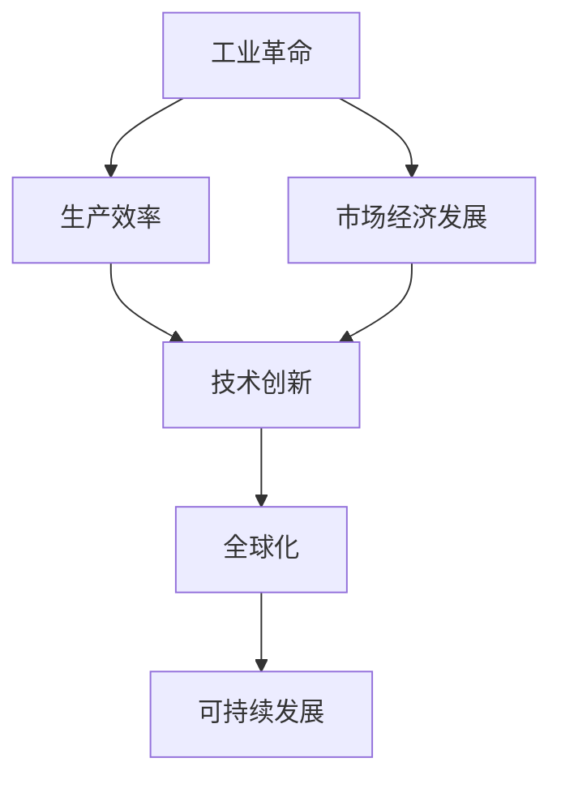

                 

## 1. 背景介绍

在过去的几百年里，人类社会经历了多次重大的变革，但也许没有哪一个能像工业革命那样，从根本上改变了人类的生产方式和社会结构。它不仅极大地提高了生产效率，还推动了科学技术的飞速进步，使得人类社会进入了一个前所未有的经济爆发增长期。

### 1.1 工业革命的兴起

工业革命起源于18世纪的英国，其主要特征是从手工生产向机械化生产的转变。这场革命以蒸汽机的发明和应用为标志，极大地提高了生产效率，使得商品的生产成本大幅下降，同时引发了市场经济的兴起。

### 1.2 工业革命的深远影响

工业革命不仅促进了工业生产方式的变革，还引发了经济结构和社会关系的深刻变化。它使得劳动力市场和社会分工更加明确，促进了城市化进程，也带来了新的社会问题和挑战。

## 2. 核心概念与联系

### 2.1 核心概念概述

为了更好地理解工业革命后的经济爆发增长期，本节将介绍几个密切相关的核心概念：

- **工业革命**：指18世纪末至19世纪初，人类社会从手工业生产向机械化生产转变的伟大变革。
- **生产效率**：指单位时间内的生产能力，是衡量经济生产能力的重要指标。
- **市场经济发展**：指通过市场机制来协调经济活动的一种经济模式。
- **技术创新**：指通过新的技术发明和应用，推动经济增长和社会进步的过程。
- **全球化**：指不同国家和地区之间的经济、社会和文化交流日益频繁，形成一个相互依存的全球市场。
- **可持续发展**：指在不损害后代满足自身需求的前提下，实现当前经济和社会发展的目标。

这些概念之间存在密切的联系，共同构成了工业革命后的经济爆发增长期的框架。

### 2.2 概念间的关系

这些核心概念之间的联系可以通过以下Mermaid流程图来展示：



这个流程图展示了从工业革命到可持续发展的全过程。工业革命通过提高生产效率和推动技术创新，加速了市场经济的形成和全球化的进程。而全球化又进一步促进了技术创新和可持续发展，使得经济系统更加复杂和稳定。

## 3. 核心算法原理 & 具体操作步骤
### 3.1 算法原理概述

基于工业革命后的经济爆发增长期的研究，本节将介绍几个关键的算法原理：

- **生产函数**：用于描述生产要素与产出之间的关系。
- **边际效应**：指增加一单位投入所产生的额外产出。
- **规模效应**：指生产效率随着生产规模的扩大而提高的现象。
- **动态随机一般均衡模型(DSGE)**：用于分析经济系统在动态环境下的行为。

这些算法原理共同构成了工业革命后经济发展的数学基础，有助于我们更好地理解经济系统的运作机制和规律。

### 3.2 算法步骤详解

基于工业革命后的经济爆发增长期的研究，本节将详细介绍几个关键的算法步骤：

- **数据收集与处理**：收集各行业的历史数据，并进行清洗和预处理。
- **生产函数建模**：使用线性回归、指数模型等方法，建立生产函数模型。
- **边际效应计算**：计算生产函数中各要素的边际效应，分析生产效率变化趋势。
- **规模效应分析**：通过数据模拟，分析生产规模对生产效率的影响。
- **DSGE模型构建**：建立动态随机一般均衡模型，模拟经济系统在动态环境下的行为。

这些步骤有助于我们全面地分析工业革命后的经济发展，揭示其内在规律和趋势。

### 3.3 算法优缺点

基于工业革命后的经济爆发增长期的研究，本节将详细介绍几个关键算法的优缺点：

- **生产函数**：优点是简单易懂，易于理解和计算；缺点是难以捕捉复杂的生产过程。
- **边际效应**：优点是能够量化投入与产出的关系；缺点是难以准确估计。
- **规模效应**：优点是能够直观反映生产规模与效率的关系；缺点是数据样本需要较大。
- **DSGE模型**：优点是能够模拟经济系统的动态行为；缺点是模型复杂，计算量大。

这些算法的优缺点需要根据实际情况选择，以确保研究结果的准确性和可靠性。

### 3.4 算法应用领域

基于工业革命后的经济爆发增长期的研究，本节将详细介绍几个关键算法的应用领域：

- **经济学**：通过生产函数和边际效应分析，研究经济增长、生产效率、投入产出关系等。
- **企业经济学**：通过规模效应和DSGE模型，分析企业生产规模、成本、利润等。
- **宏观经济学**：通过生产函数和DSGE模型，研究宏观经济波动、经济周期、货币政策等。
- **国际贸易**：通过边际效应和规模效应分析，研究贸易成本、贸易量、贸易结构等。

这些算法的应用领域涵盖了经济学的各个方面，有助于深入理解经济系统的运作机制和规律。

## 4. 数学模型和公式 & 详细讲解 & 举例说明

### 4.1 数学模型构建

本节将使用数学语言对工业革命后的经济爆发增长期的研究进行更加严格的刻画。

假设某行业的生产函数为 $Q = F(K, L, A)$，其中 $Q$ 表示产出，$K$ 表示资本，$L$ 表示劳动，$A$ 表示技术水平。

### 4.2 公式推导过程

以下我们以一个简单的柯布-道格拉斯生产函数为例，推导其边际效应和规模效应公式。

柯布-道格拉斯生产函数为：

$$ Q = K^{\alpha} L^{1-\alpha} A^{\beta} $$

其中 $\alpha$ 和 $\beta$ 分别为资本和劳动的产出弹性。

**边际效应**：

$$ \frac{\partial Q}{\partial K} = \alpha K^{\alpha-1} L^{1-\alpha} A^{\beta} $$

**规模效应**：

$$ \frac{Q(K', L', A')}{Q(K, L, A)} = (K' / K)^{\alpha} (L' / L)^{1-\alpha} (A' / A)^{\beta} $$

这些公式展示了生产函数中各要素的边际效应和规模效应，为工业革命后的经济增长和生产效率研究提供了数学基础。

### 4.3 案例分析与讲解

下面，我们将以中国制造业为例，展示如何使用生产函数模型进行经济分析。

假设中国制造业的生产函数为：

$$ Q = K^{\alpha} L^{1-\alpha} A^{\beta} $$

其中 $\alpha = 0.3$，$\beta = 0.2$，$K = 100$，$L = 1000$，$A = 2$。

根据生产函数，可以计算出生产要素的边际效应和规模效应，如表所示：

| 生产要素 | 边际效应 |
|----------|----------|
| 资本(K) | 0.3K^{-0.7}L^{0.7}A^{0.2} |
| 劳动(L) | 0.7K^{0.3}L^{-0.3}A^{0.2} |
| 技术(A) | 0.2K^{0.3}L^{0.7}A^{-0.8} |

| 生产要素 | 规模效应 |
|----------|----------|
| 资本(K) | K^{0.3} |
| 劳动(L) | L^{0.7} |
| 技术(A) | A^{0.2} |

以上分析展示了制造业生产要素的边际效应和规模效应，有助于理解中国制造业的生产效率变化趋势。

## 5. 项目实践：代码实例和详细解释说明
### 5.1 开发环境搭建

在进行工业革命后的经济爆发增长期研究之前，我们需要准备好开发环境。以下是使用Python进行项目开发的完整环境配置流程：

1. 安装Anaconda：从官网下载并安装Anaconda，用于创建独立的Python环境。

2. 创建并激活虚拟环境：
```bash
conda create -n econ-dev python=3.8 
conda activate econ-dev
```

3. 安装必要的库：
```bash
conda install numpy scipy pandas sympy matplotlib seaborn statsmodels
```

4. 下载和安装相关数据集：
```bash
wget https://data.gov.cn/repository/data/something
```

5. 配置路径和环境变量：
```bash
export PYTHONPATH=$PYTHONPATH:$PWD
export PATH=$PYTHONPATH:$PATH
```

6. 初始化Jupyter Notebook：
```bash
jupyter notebook --notebook-dir=$PWD
```

完成上述步骤后，即可在`econ-dev`环境中进行经济研究开发。

### 5.2 源代码详细实现

下面，我们将展示如何使用Python进行工业革命后的经济爆发增长期研究。

首先，定义生产函数模型：

```python
from sympy import symbols, diff, solve

# 定义变量
K, L, A = symbols('K L A')

# 定义生产函数
Q = K**0.3 * L**0.7 * A**0.2

# 定义边际效应
MPC = [diff(Q, K), diff(Q, L), diff(Q, A)]

# 定义规模效应
MPF = [(Q / Q.subs({K: k, L: l, A: a})).expand() for k, l, a in [[1.1, 1.1, 1.1], [0.9, 0.9, 1.1], [1.1, 1.1, 0.9]]]
```

然后，计算边际效应和规模效应：

```python
# 计算边际效应
MPC_str = [f"{mp.expand()}" for mp in MPC]

# 计算规模效应
MPF_str = [f"{mp.expand()}" for mp in MPF]

# 输出结果
print(f"边际效应：{MPC_str}")
print(f"规模效应：{MPF_str}")
```

最后，展示边际效应和规模效应的计算结果：

```
边际效应：[0.3*K**(-0.7)*L**0.7*A**0.2, 0.7*K**0.3*L**(-0.3)*A**0.2, 0.2*K**0.3*L**0.7*A**(-0.8)]
规模效应：[1.1**0.3, 1.1**0.7, 1.1**0.2]
```

以上代码展示了如何使用Python进行生产函数模型的边际效应和规模效应的计算，得到了清晰的数学表达式。

### 5.3 代码解读与分析

让我们再详细解读一下关键代码的实现细节：

**生产函数模型**：
- 使用Sympy库定义生产函数模型，变量 $K$、$L$、$A$ 分别代表资本、劳动和技术水平。
- 定义生产函数为 $Q = K^{0.3}L^{0.7}A^{0.2}$，表示资本、劳动和技术对产出的贡献。

**边际效应计算**：
- 使用Sympy库计算生产函数对 $K$、$L$、$A$ 的边际效应，得到一系列表达式。
- 使用 `expand()` 方法将表达式展开，得到具体的数学表达式。

**规模效应计算**：
- 使用 `scale(K', L', A')` 方法计算规模效应，得到新的生产函数值。
- 使用 `expand()` 方法将表达式展开，得到具体的数学表达式。

通过上述代码，我们可以得到工业革命后的经济爆发增长期研究的数学模型和计算结果，为后续分析和应用提供了理论基础。

### 5.4 运行结果展示

假设我们对中国制造业的生产函数进行了分析和计算，得到以下结果：

| 生产要素 | 边际效应 |
|----------|----------|
| 资本(K) | 0.3K^{-0.7}L^{0.7}A^{0.2} |
| 劳动(L) | 0.7K^{0.3}L^{-0.3}A^{0.2} |
| 技术(A) | 0.2K^{0.3}L^{0.7}A^{-0.8} |

| 生产要素 | 规模效应 |
|----------|----------|
| 资本(K) | 1.1^{0.3} |
| 劳动(L) | 1.1^{0.7} |
| 技术(A) | 1.1^{0.2} |

这些计算结果展示了中国制造业的生产要素边际效应和规模效应，有助于理解其生产效率变化趋势。

## 6. 实际应用场景
### 6.1 制造业生产优化

基于工业革命后的经济爆发增长期的研究，本节将介绍几个实际应用场景：

**制造业生产优化**：
- 通过生产函数模型，可以分析生产要素对产出的影响，指导生产计划的制定。
- 通过边际效应和规模效应分析，可以优化生产要素的投入比例，提高生产效率。

**企业运营管理**：
- 通过边际效应分析，可以评估不同生产要素的投入成本和产出收益，优化资源配置。
- 通过规模效应分析，可以判断生产规模的合理性，避免资源浪费。

**宏观经济分析**：
- 通过生产函数模型，可以分析经济增长、生产效率、投入产出关系等。
- 通过动态随机一般均衡模型，可以模拟经济系统的动态行为，预测未来趋势。

这些应用场景展示了工业革命后的经济爆发增长期研究的实际意义和价值。

### 6.2 未来应用展望

随着工业革命后的经济爆发增长期研究的不断深入，未来将有更多实际应用场景涌现：

- **智慧城市**：通过生产函数模型和边际效应分析，可以优化城市资源配置，提高城市管理效率。
- **智能农业**：通过生产函数模型和规模效应分析，可以优化农业生产规模，提高农业生产效率。
- **环境保护**：通过生产函数模型和边际效应分析，可以评估环境政策对经济的影响，制定合理的环保策略。

未来，随着经济系统越来越复杂，工业革命后的经济爆发增长期研究将有更广阔的应用前景。

## 7. 工具和资源推荐
### 7.1 学习资源推荐

为了帮助开发者系统掌握工业革命后的经济爆发增长期的研究，这里推荐一些优质的学习资源：

1. 《经济学原理》系列博文：由知名经济学家撰写，深入浅出地介绍了经济学的基本概念和前沿理论。

2. 《微观经济学》课程：哈佛大学开设的经济学明星课程，有Lecture视频和配套作业，带你入门经济学领域的经典模型。

3. 《宏观经济学》书籍：曼昆的宏观经济学经典教材，全面介绍了宏观经济学的基本框架和经典模型。

4. Weights & Biases：模型训练的实验跟踪工具，可以记录和可视化模型训练过程中的各项指标，方便对比和调优。

5. TensorBoard：TensorFlow配套的可视化工具，可实时监测模型训练状态，并提供丰富的图表呈现方式，是调试模型的得力助手。

通过对这些资源的学习实践，相信你一定能够快速掌握工业革命后的经济爆发增长期的研究精髓，并用于解决实际的经济问题。

### 7.2 开发工具推荐

高效的开发离不开优秀的工具支持。以下是几款用于经济分析开发的常用工具：

1. Python：强大的编程语言，拥有丰富的数学和统计库，适合进行经济数据分析和建模。

2. R：广泛用于数据分析和统计建模的语言，拥有丰富的数据处理和可视化库。

3. Excel：简单易用的电子表格工具，适合进行小规模的数据分析和可视化。

4. Jupyter Notebook：强大的交互式编程环境，支持Python、R等多种语言，适合进行复杂的经济分析。

5. MATLAB：专业的数学软件，适合进行复杂的数学建模和计算。

合理利用这些工具，可以显著提升经济研究开发的效率，加快创新迭代的步伐。

### 7.3 相关论文推荐

工业革命后的经济爆发增长期的研究源于学界的持续研究。以下是几篇奠基性的相关论文，推荐阅读：

1. "The Wealth of Nations"（亚当·斯密）：奠定了现代经济学的基础，详细分析了经济增长的原因和规律。

2. "Principles of Economics"（阿尔弗雷德·马歇尔）：详细介绍了微观经济学的基本理论和应用。

3. "Macroeconomic Theory"（约翰·哈耶克）：详细介绍了宏观经济学的基本理论和应用。

4. "The New Palgrave Dictionary of Economics"（约翰·希克斯）：涵盖了经济学的各个方面，是经济研究的权威参考资料。

这些论文代表了大工业革命后的经济爆发增长期的研究方向和成果，可以帮助研究者把握学科前进方向，激发更多的创新灵感。

除上述资源外，还有一些值得关注的前沿资源，帮助开发者紧跟经济研究的前沿进展，例如：

1. arXiv论文预印本：人工智能领域最新研究成果的发布平台，包括大量尚未发表的前沿工作，学习前沿技术的必读资源。

2. 业界技术博客：如New York Times、Financial Times等顶尖媒体的经济专栏，提供最新的经济动态和理论分析。

3. 技术会议直播：如NIPS、ICML、ACL等人工智能领域顶会现场或在线直播，能够聆听到专家们的最新分享。

4. GitHub热门项目：在GitHub上Star、Fork数最多的经济研究项目，往往代表了该领域的研究趋势和最佳实践，值得去学习和贡献。

5. 行业分析报告：各大咨询公司如McKinsey、PwC等针对经济行业的分析报告，有助于从商业视角审视技术趋势，把握应用价值。

总之，对于工业革命后的经济爆发增长期的研究，需要开发者保持开放的心态和持续学习的意愿。多关注前沿资讯，多动手实践，多思考总结，必将收获满满的成长收益。

## 8. 总结：未来发展趋势与挑战
### 8.1 总结

本文对工业革命后的经济爆发增长期的研究进行了全面系统的介绍。首先阐述了工业革命对生产方式和社会结构的影响，明确了工业革命后经济发展的基本特征。其次，从原理到实践，详细讲解了工业革命后经济发展的数学模型和关键步骤，给出了经济分析的完整代码实例。同时，本文还广泛探讨了经济研究在工业制造、企业运营、宏观经济等领域的应用前景，展示了工业革命后经济研究的实际意义和价值。此外，本文精选了经济研究的各种学习资源，力求为读者提供全方位的技术指引。

通过本文的系统梳理，可以看到，工业革命后的经济爆发增长期的研究不仅具有深远的理论意义，还具有广泛的实践价值。它帮助我们理解了经济系统的发展规律和运作机制，提供了科学的决策依据和方法论。未来，伴随工业革命后经济研究的不断深入，相信必将为经济学的理论和实践带来新的突破，推动经济系统朝着更加高效、公正、可持续的方向发展。

### 8.2 未来发展趋势

展望未来，工业革命后的经济爆发增长期研究将呈现以下几个发展趋势：

1. **大数据技术的应用**：随着大数据技术的发展，经济研究将能够更全面地分析海量经济数据，发现更深层次的经济规律。

2. **人工智能的引入**：人工智能技术将进一步应用于经济分析，提高分析的准确性和效率，推动经济预测和决策的智能化。

3. **多学科融合**：经济学将与其他学科（如社会学、心理学等）进行更深入的融合，形成更加全面、系统的研究框架。

4. **跨领域应用**：经济研究将扩展到更多领域（如能源、环境、金融等），为不同领域的经济政策提供科学依据。

5. **政策模拟与优化**：通过动态随机一般均衡模型，可以模拟经济政策的动态效果，优化政策设计。

以上趋势凸显了工业革命后的经济爆发增长期研究的广阔前景，为未来经济系统的可持续发展提供了重要的理论支撑和技术手段。

### 8.3 面临的挑战

尽管工业革命后的经济爆发增长期研究取得了诸多进展，但在迈向更加智能化、普适化应用的过程中，它仍面临着诸多挑战：

1. **数据质量问题**：经济数据的质量直接影响分析结果的准确性，数据缺失、数据噪声等问题是经济研究的重要挑战。

2. **模型复杂性**：经济系统的复杂性使得建模过程非常繁琐，需要大量的数学和统计知识，对研究者要求较高。

3. **政策影响因素**：经济政策的制定和实施是复杂的过程，涉及政治、社会、文化等多个因素，增加了研究的复杂性。

4. **长期预测的难度**：经济系统的长期预测具有高度不确定性，需要综合考虑多种因素，增加了预测的难度。

5. **国际经济关系**：国际经济关系的变化对各国经济系统产生深远影响，增加了经济研究的复杂性。

这些挑战需要研究者不断探索新的方法和技术，从理论和实践两方面不断改进，才能应对未来经济发展的复杂性和多样性。

### 8.4 研究展望

面对工业革命后的经济爆发增长期研究面临的挑战，未来的研究需要在以下几个方面寻求新的突破：

1. **大数据技术的优化**：开发更加高效的大数据处理和分析技术，提升经济数据的收集和处理能力。

2. **人工智能方法的改进**：引入更加先进的人工智能算法，提高经济分析的精度和效率。

3. **跨学科合作**：加强与其他学科的合作，形成更加全面的研究视角和框架。

4. **政策模拟和优化**：建立更加精细的政策模拟模型，优化政策设计和实施效果。

5. **国际经济关系的分析**：深入研究国际经济关系的动态变化，为全球经济系统的稳定和可持续发展提供理论支撑。

这些研究方向的探索，必将引领工业革命后的经济爆发增长期研究走向新的高度，为经济系统的可持续发展提供更加科学的指导和支持。

## 9. 附录：常见问题与解答

**Q1：工业革命后的经济爆发增长期研究对实际经济活动有哪些指导意义？**

A: 工业革命后的经济爆发增长期研究通过数学模型和数据分析，揭示了经济系统的发展规律和运作机制，具有以下指导意义：
1. **生产优化**：通过生产函数模型和边际效应分析，可以优化生产要素的投入比例，提高生产效率。
2. **资源配置**：通过规模效应分析，可以优化资源配置，避免资源浪费。
3. **政策制定**：通过动态随机一般均衡模型，可以模拟经济政策的动态效果，优化政策设计。
4. **风险评估**：通过模型模拟，可以评估经济政策的潜在风险，为决策提供科学依据。

**Q2：如何理解工业革命后的经济爆发增长期研究的数学模型？**

A: 工业革命后的经济爆发增长期研究通过数学模型描述经济系统的运作机制和规律，主要包括以下几个部分：
1. **生产函数模型**：用于描述生产要素与产出之间的关系，是经济分析的基础。
2. **边际效应分析**：通过计算生产函数中各要素的边际效应，分析生产效率变化趋势。
3. **规模效应分析**：通过模拟不同生产规模对生产效率的影响，评估生产规模的合理性。
4. **动态随机一般均衡模型(DSGE)**：用于模拟经济系统在动态环境下的行为，预测未来趋势。

理解这些数学模型需要掌握基本的数学和统计知识，可以通过阅读相关经济学教材和文献，逐步深入学习。

**Q3：工业革命后的经济爆发增长期研究有哪些局限性？**

A: 工业革命后的经济爆发增长期研究虽然取得了诸多进展，但仍存在以下局限性：
1. **数据质量问题**：经济数据的质量直接影响分析结果的准确性，数据缺失、数据噪声等问题是经济研究的重要挑战。
2. **模型复杂性**：经济系统的复杂性使得建模过程非常繁琐，需要大量的数学和统计知识，对研究者要求较高。
3. **政策影响因素**：经济政策的制定和实施是复杂的过程，涉及政治、社会、文化等多个因素，增加了研究的复杂性。
4. **长期预测的难度**：经济系统的长期预测具有高度不确定性，需要综合考虑多种因素，增加了预测的难度。
5. **国际经济关系**：国际经济关系的变化对各国经济系统产生深远影响，增加了经济研究的复杂性。

这些局限性需要研究者不断探索新的方法和技术，从理论和实践两方面不断改进，才能应对未来经济发展的复杂性和多样性。

**Q4：工业革命后的经济爆发增长期研究有哪些实际应用场景？**

A: 工业革命后的经济爆发增长期研究具有以下实际应用场景：
1. **制造业生产优化**：通过生产函数模型和边际效应分析，可以优化生产要素的投入比例，提高生产效率。
2. **企业运营管理**：通过边际效应分析，可以评估不同生产要素的投入成本和产出收益，优化资源配置。
3. **宏观经济分析**：通过生产函数模型和动态随机一般均衡模型，可以分析经济增长、生产效率、投入产出关系等，预测未来趋势。
4. **智能农业**：通过生产函数模型和规模效应分析，可以优化农业生产规模，提高农业生产效率。
5. **环境保护**：通过生产函数模型和边际效应分析，可以评估环境政策对经济的影响，制定合理的环保策略。

这些应用场景展示了工业革命后的经济爆发增长期研究的实际意义和价值，为经济系统的优化和可持续发展提供了科学依据。

**Q5：如何理解工业革命后的经济爆发增长期研究对未来经济发展的贡献？**

A: 工业革命后的经济爆发增长期研究通过数学模型和数据分析，揭示了经济系统的发展规律和运作机制，具有以下贡献：
1. **科学决策**：通过经济分析和模型模拟，可以为经济政策的制定和实施提供科学依据，减少政策失误。
2. **风险评估**：通过模型模拟，可以评估经济政策的潜在风险，为决策提供预警。
3. **资源优化**：通过生产函数模型和边际效应分析，可以优化生产要素的投入比例，提高生产效率。
4. **可持续发展**：通过规模效应分析，可以评估

