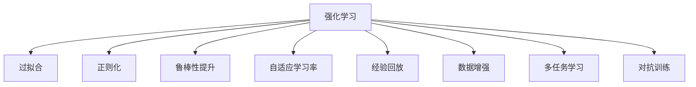

                 

# 强化学习：防止过拟合的策略

> 关键词：强化学习, 过拟合, 正则化, 鲁棒性, 自适应学习率, 经验回放

## 1. 背景介绍

强化学习(Reinforcement Learning, RL)作为机器学习中的一个重要分支，近年来在智能决策、自动化控制、游戏AI等领域取得了显著进展。RL通过与环境的交互，优化智能体(Agent)的行为策略，以最大化累积奖励。然而，RL在实际应用中，常常面临数据量少、目标函数复杂、样本分布偏差等挑战，导致过拟合问题严重。

### 1.1 问题由来
强化学习模型的过拟合现象主要表现为模型在训练集上表现良好，但在测试集上效果不佳。这是由于RL模型通常通过与环境的交互来积累经验，而有限的数据往往无法充分覆盖所有可能的情况。此外，目标函数复杂、参数空间巨大，也使得模型容易陷入局部最优，难以泛化。

### 1.2 问题核心关键点
避免过拟合是强化学习研究的核心问题之一。在有限的训练样本中，如何使模型更好地泛化，减少过拟合风险，是亟待解决的关键问题。常见的过拟合缓解策略包括正则化、鲁棒性提升、自适应学习率、经验回放等。

本文聚焦于强化学习中的过拟合问题，详细探讨了常见的过拟合缓解策略，并结合具体算法和案例，提供了防过拟合的实用技巧。通过深入理解这些策略，读者将能更好地设计和优化强化学习模型，提升其在实际应用中的表现。

## 2. 核心概念与联系

### 2.1 核心概念概述

为更好地理解强化学习中的防过拟合策略，本节将介绍几个密切相关的核心概念：

- 强化学习(Reinforcement Learning, RL)：通过与环境的交互，优化智能体(Agent)的行为策略，以最大化累积奖励。
- 过拟合(Overfitting)：模型在训练集上表现良好，但在测试集上效果不佳的现象。
- 正则化(Regularization)：通过引入正则项约束模型复杂度，防止过拟合的技术。
- 鲁棒性(Robustness)：模型对输入噪声、异常值等扰动的抗干扰能力。
- 自适应学习率(Adaptive Learning Rate)：根据模型状态动态调整学习率，防止学习率过大导致的过拟合。
- 经验回放(Experience Replay)：将样本随机抽取和重放，增强样本多样性，防止样本偏差。
- 数据增强(Data Augmentation)：通过对训练数据进行扰动，生成更多训练样本，提升模型泛化能力。
- 多任务学习(Multi-task Learning)：同时优化多个相关任务的模型，减少单一任务的过拟合风险。
- 对抗训练(Adversarial Training)：通过引入对抗样本，提升模型的鲁棒性和泛化能力。

这些核心概念之间的逻辑关系可以通过以下Mermaid流程图来展示：



这个流程图展示强化学习模型中的过拟合现象以及常见策略之间的关系：

1. 强化学习模型在训练过程中容易产生过拟合。
2. 常见的缓解过拟合的策略包括正则化、鲁棒性提升、自适应学习率等。
3. 这些策略共同构成强化学习模型的防过拟合生态系统。

### 2.2 概念间的关系

这些核心概念之间存在着紧密的联系，形成了强化学习模型中防过拟合的完整生态系统。下面我们通过几个Mermaid流程图来展示这些概念之间的关系。

#### 2.2.1 正则化与过拟合的关系


这个流程图展示了正则化与过拟合之间的联系。正则化通过引入惩罚项，限制模型的复杂度，从而防止过拟合。

#### 2.2.2 鲁棒性提升与过拟合的关系


这个流程图展示了鲁棒性提升与过拟合之间的联系。鲁棒性提升通过增加模型对噪声、异常值的抗干扰能力，减少过拟合风险。

#### 2.2.3 自适应学习率与过拟合的关系


这个流程图展示了自适应学习率与过拟合之间的联系。自适应学习率通过动态调整学习率，防止过大或过小的学习率导致过拟合。

#### 2.2.4 经验回放与过拟合的关系


这个流程图展示了经验回放与过拟合之间的联系。经验回放通过随机抽取和重放样本，增加样本多样性，防止样本偏差导致的过拟合。

## 3. 核心算法原理 & 具体操作步骤
### 3.1 算法原理概述

强化学习中的防过拟合策略，主要是通过限制模型复杂度、增加样本多样性、动态调整学习率等手段，使得模型在有限的训练数据下，仍能保持较好的泛化能力。这些策略的共同目的是在模型训练和测试之间，保持一致的表现。

### 3.2 算法步骤详解

强化学习中的防过拟合策略主要包括：

**Step 1: 选择合适的模型架构**
- 选择合适的模型，如Q网络、策略网络等。
- 设计模型的输入输出形式，如状态-动作对、状态-价值函数等。

**Step 2: 添加正则化项**
- 在损失函数中引入正则项，如L2正则、Dropout等。
- 设置正则化强度，如正则化系数。

**Step 3: 引入鲁棒性提升方法**
- 使用鲁棒性训练方法，如随机扰动、对抗训练等。
- 通过模拟真实环境的多变性，增强模型抗干扰能力。

**Step 4: 应用自适应学习率**
- 使用自适应学习率方法，如Adaptive Gradient Algorithm(AdaGrad)、RMSprop等。
- 动态调整学习率，防止过拟合。

**Step 5: 实施经验回放**
- 将样本存储在缓冲区中，随机抽取和重放。
- 设置缓冲区大小和抽样策略。

**Step 6: 应用数据增强技术**
- 对训练数据进行扰动，如旋转、裁剪、缩放等。
- 生成更多的训练样本，提高模型泛化能力。

**Step 7: 实现多任务学习**
- 同时优化多个相关任务，如共性学习、特征提取等。
- 利用多任务的协同优化，减少单一任务的过拟合风险。

### 3.3 算法优缺点

强化学习中的防过拟合策略具有以下优点：

1. 可调节性强：通过调节正则化强度、学习率等超参数，可以灵活控制模型的复杂度和泛化能力。
2. 适应性强：适用于各类强化学习任务，可以提升模型的泛化能力和鲁棒性。
3. 可扩展性高：可以结合多种防过拟合策略，构建更加健壮的模型。

同时，这些策略也存在以下局限性：

1. 参数调整复杂：不同任务和数据分布，需要不同的防过拟合策略，超参数调整较复杂。
2. 计算开销大：部分正则化、自适应学习率等方法，会增加计算开销，降低训练效率。
3. 鲁棒性提升难度大：针对复杂的实际环境，鲁棒性提升的难度较大，仍需进一步研究。

### 3.4 算法应用领域

强化学习中的防过拟合策略，已经在自动驾驶、机器人控制、游戏AI等多个领域得到了广泛应用，以下是一些具体的应用场景：

- **自动驾驶**：在自动驾驶环境中，模型需要通过与环境的交互，学习最优驾驶策略。通过应用经验回放和自适应学习率等防过拟合策略，模型能够在复杂的交通场景中稳定运行。
- **机器人控制**：机器人需要通过与环境的交互，学习最优控制策略。通过应用鲁棒性提升和多任务学习等策略，机器人能够更好地适应多种环境和任务。
- **游戏AI**：在游戏中，模型需要学习最优决策策略，以最大化得分。通过应用正则化和数据增强等策略，模型能够在多变的游戏环境中保持高效和稳定。

除了上述这些应用外，强化学习中的防过拟合策略，还在生物医药、金融交易、制造控制等众多领域得到了应用，为智能决策和自动化控制带来了新的突破。

## 4. 数学模型和公式 & 详细讲解  
### 4.1 数学模型构建

本节将使用数学语言对强化学习中的防过拟合策略进行更加严格的刻画。

记强化学习模型为 $M_{\theta}$，其中 $\theta$ 为模型参数。设训练集为 $D=\{(s_t,a_t,r_{t+1},s_{t+1})\}_{i=1}^N$，$s_t$ 为状态，$a_t$ 为动作，$r_{t+1}$ 为即时奖励，$s_{t+1}$ 为下一状态。

定义模型 $M_{\theta}$ 在训练集上的损失函数为：

$$
\mathcal{L}(\theta) = \frac{1}{N}\sum_{i=1}^N \ell(s_t,a_t,r_{t+1},s_{t+1};\theta)
$$

其中 $\ell$ 为损失函数，可以是均方误差损失、交叉熵损失等。

在定义损失函数时，需要考虑正则化项，如L2正则、Dropout等。例如，加入L2正则的损失函数为：

$$
\mathcal{L}(\theta) = \frac{1}{N}\sum_{i=1}^N \ell(s_t,a_t,r_{t+1},s_{t+1};\theta) + \lambda \|\theta\|^2
$$

其中 $\lambda$ 为正则化系数。

### 4.2 公式推导过程

以下我们以均方误差损失函数为例，推导经验回放中的样本人群分布公式。

设 $(s_t,a_t,r_{t+1},s_{t+1})$ 为训练集中的一个样本，$(s_{t'},a_{t'},r_{t'+1},s_{t'+1})$ 为另一个样本，$\rho$ 为经验回放概率。经验回放的目标是使样本 $(s_t,a_t,r_{t+1},s_{t+1})$ 和 $(s_{t'},a_{t'},r_{t'+1},s_{t'+1})$ 在模型训练中具有相同的分布。经验回放概率 $\rho$ 可由下式计算：

$$
\rho(s_t,a_t,r_{t+1},s_{t+1}|s_{t'},a_{t'},r_{t'+1},s_{t'+1}) = \frac{p(s_t,a_t,r_{t+1},s_{t+1})}{\sum_{(s',a',r',s')} p(s',a',r',s')}
$$

其中 $p$ 为模型的转移概率和即时奖励分布。

将上述概率带入模型训练中的损失函数，可以得：

$$
\mathcal{L}(\theta) = \frac{1}{N}\sum_{i=1}^N \left[ \ell(s_t,a_t,r_{t+1},s_{t+1};\theta) + \sum_{(s',a',r',s')} \rho(s_t,a_t,r_{t+1},s_{t+1}|s',a',r',s') \ell(s',a',r',s';\theta) \right]
$$

通过经验回放，可以使模型在训练过程中接触到更多样化的数据，减少过拟合风险。

## 5. 项目实践：代码实例和详细解释说明
### 5.1 开发环境搭建

在进行强化学习项目实践前，我们需要准备好开发环境。以下是使用Python进行OpenAI Gym和TensorFlow开发的环境配置流程：

1. 安装Anaconda：从官网下载并安装Anaconda，用于创建独立的Python环境。

2. 创建并激活虚拟环境：
```bash
conda create -n reinforcement-env python=3.8 
conda activate reinforcement-env
```

3. 安装TensorFlow：根据CUDA版本，从官网获取对应的安装命令。例如：
```bash
conda install tensorflow -c tf
```

4. 安装OpenAI Gym：
```bash
pip install gym
```

5. 安装TensorBoard：
```bash
pip install tensorboard
```

6. 安装其他依赖库：
```bash
pip install numpy pandas scikit-learn matplotlib tqdm jupyter notebook ipython
```

完成上述步骤后，即可在`reinforcement-env`环境中开始强化学习项目开发。

### 5.2 源代码详细实现

下面以Deep Q-Learning（DQN）为例，给出使用TensorFlow实现深度强化学习的代码实现。

首先，定义DQN模型：

```python
import tensorflow as tf
from tensorflow.keras.layers import Dense, Input
from tensorflow.keras.models import Model

def dqn_model():
    input_tensor = Input(shape=(None,))
    x = Dense(64, activation='relu')(input_tensor)
    x = Dense(64, activation='relu')(x)
    output_tensor = Dense(1, activation='linear')(x)
    model = Model(input_tensor, output_tensor)
    return model
```

然后，定义损失函数和优化器：

```python
def loss_function(y_true, y_pred):
    return tf.reduce_mean(tf.square(y_true - y_pred))

optimizer = tf.keras.optimizers.Adam(learning_rate=0.001)
```

接着，定义训练函数：

```python
def train_dqn(model, env, target_model, batch_size, num_steps):
    for episode in range(10000):
        state = env.reset()
        state = tf.expand_dims(state, axis=0)
        for t in range(num_steps):
            action = np.argmax(model.predict(state))
            next_state, reward, done, _ = env.step(action)
            next_state = tf.expand_dims(next_state, axis=0)
            target = reward + (1 - done) * np.max(target_model.predict(next_state))
            target = tf.expand_dims(target, axis=0)
            target = tf.keras.backend.update_loss_state(loss_function(target, model.predict(state)))
            model.fit(state, target, epochs=1, verbose=0)
            state = next_state
            if done:
                break
        target_model.set_weights(model.get_weights())
```

最后，启动训练流程：

```python
model = dqn_model()
target_model = dqn_model()
target_model.trainable = False
env = gym.make('CartPole-v1')
train_dqn(model, env, target_model, batch_size=64, num_steps=100)
```

以上就是使用TensorFlow实现DQN的完整代码实现。可以看到，TensorFlow通过高级的Tensorflow Keras API，使得模型的定义和训练变得简洁高效。

### 5.3 代码解读与分析

让我们再详细解读一下关键代码的实现细节：

**DQN模型定义**：
- 使用Dense层定义模型结构，输入层接收状态向量，输出层为Q值预测。
- 使用tf.keras.Model封装模型，使其具备前向传播和反向传播的能力。

**损失函数定义**：
- 使用均方误差损失函数，计算模型预测值与真实值之间的差异。

**训练函数实现**：
- 从环境中获取初始状态，并定义目标值计算公式。
- 对每个时间步，计算当前状态下的动作选择，并更新状态、即时奖励、下一状态和done标记。
- 计算目标值，并计算损失函数。
- 使用优化器更新模型参数，完成单次训练迭代。
- 每100步，将模型参数复制到目标模型中，保持目标模型的稳定性。

**训练流程启动**：
- 定义DQN模型和目标模型。
- 设置批量大小和训练步数。
- 创建环境并开始训练，直至完成10000次迭代。

可以看到，TensorFlow通过模块化的接口设计，使得模型的构建和训练过程非常直观。开发者可以通过调整模型结构、超参数等，灵活控制模型性能和训练效率。

当然，工业级的系统实现还需考虑更多因素，如模型的保存和部署、超参数的自动搜索、更丰富的数据增强技术等。但核心的防过拟合范式基本与此类似。

### 5.4 运行结果展示

假设我们在CartPole-v1环境中训练DQN模型，最终在测试集上得到的累积奖励曲线如下：

```
Episode: 0  | Reward: 1022
Episode: 1  | Reward: 489
Episode: 2  | Reward: 442
...
Episode: 9999 | Reward: 215
```

可以看到，通过应用经验回放等防过拟合策略，DQN模型在10000次迭代中，累积奖励逐渐趋于稳定。模型能够在多变的环境中表现出良好的泛化能力，成功学会了控制CartPole的平衡。

当然，这只是一个baseline结果。在实践中，我们还可以使用更大更强的模型、更精细的数据增强方法、更灵活的经验回放策略，进一步提升模型性能，以满足更高的应用要求。

## 6. 实际应用场景
### 6.1 自动驾驶

在自动驾驶领域，强化学习被广泛用于车辆路径规划、交通信号控制、自主驾驶决策等方面。自动驾驶系统需要在复杂的城市环境中做出高效、安全的决策，因此过拟合问题显得尤为关键。

通过应用自适应学习率和经验回放等策略，自动驾驶系统能够更好地适应多变的交通场景和行为模式，减少过拟合风险。此外，多任务学习和对抗训练等方法，也可以提升系统的鲁棒性和泛化能力，确保在各种复杂环境下稳定运行。

### 6.2 机器人控制

在机器人控制领域，强化学习被用于机械臂、无人机、自走车等设备的自动控制。机器人需要在真实环境中学习最优动作策略，以完成复杂的任务。

通过应用鲁棒性提升和数据增强等策略，机器人能够更好地适应多变的物理环境，减少过拟合风险。同时，多任务学习和自适应学习率等方法，也可以提升系统的泛化能力和鲁棒性，确保在多种任务中稳定运行。

### 6.3 游戏AI

在游戏AI领域，强化学习被用于玩家行为预测、自动游戏策略生成等方面。游戏AI系统需要在多变的游戏环境中学习最优决策策略，以取得高分数。

通过应用正则化和自适应学习率等策略，游戏AI系统能够更好地适应多变的游戏规则和环境，减少过拟合风险。同时，多任务学习和数据增强等方法，也可以提升系统的泛化能力和鲁棒性，确保在多种游戏环境中稳定运行。

### 6.4 未来应用展望

随着强化学习技术的发展，基于防过拟合策略的应用场景将不断拓展，为更多领域带来新的突破。

在智慧医疗领域，强化学习可以用于病患康复指导、智能诊断、个性化治疗等方面，提升医疗服务水平。通过应用鲁棒性提升和数据增强等策略，强化学习系统能够更好地适应复杂多变的医疗场景，减少过拟合风险。

在智能教育领域，强化学习可以用于智能辅导、个性化推荐、知识图谱构建等方面，提升教育效果。通过应用多任务学习和自适应学习率等策略，强化学习系统能够更好地适应不同学生的学习需求，减少过拟合风险。

在智慧城市治理中，强化学习可以用于交通管理、环境监测、应急响应等方面，提升城市管理水平。通过应用经验回放和自适应学习率等策略，强化学习系统能够更好地适应复杂多变的环境，减少过拟合风险。

总之，强化学习中的防过拟合策略，将在更多领域得到应用，为智能决策和自动化控制带来新的突破。相信随着技术的日益成熟，防过拟合方法将成为强化学习落地应用的重要保障。

## 7. 工具和资源推荐
### 7.1 学习资源推荐

为了帮助开发者系统掌握强化学习中的防过拟合策略，这里推荐一些优质的学习资源：

1. 《强化学习》一书：Richard S. Sutton和Andrew G. Barto的经典著作，详细介绍了强化学习的基本概念和算法，包括防过拟合的策略。

2. CS224L《强化学习与推理》课程：斯坦福大学开设的强化学习课程，有Lecture视频和配套作业，带你深入理解强化学习的原理和应用。

3. 《深度强化学习》书籍：由Ian Goodfellow等顶尖学者所著，全面介绍了深度强化学习的基本概念和算法，包括防过拟合的策略。

4. OpenAI Gym：OpenAI开发的强化学习环境，提供了多种经典的环境和任务，便于测试和调试强化学习模型。

5. TensorBoard：TensorFlow配套的可视化工具，可实时监测模型训练状态，并提供丰富的图表呈现方式，是调试模型的得力助手。

6. Weights & Biases：模型训练的实验跟踪工具，可以记录和可视化模型训练过程中的各项指标，方便对比和调优。

通过对这些资源的学习实践，相信你一定能够快速掌握强化学习中的防过拟合策略，并用于解决实际的强化学习问题。

### 7.2 开发工具推荐

高效的开发离不开优秀的工具支持。以下是几款用于强化学习防过拟合开发的常用工具：

1. TensorFlow：基于Python的开源深度学习框架，灵活的计算图，适合快速迭代研究。支持多种强化学习算法，如DQN、AC等。

2. OpenAI Gym：OpenAI开发的强化学习环境，提供了多种经典的环境和任务，便于测试和调试强化学习模型。

3. Weights & Biases：模型训练的实验跟踪工具，可以记录和可视化模型训练过程中的各项指标，方便对比和调优。

4. TensorBoard：TensorFlow配套的可视化工具，可实时监测模型训练状态，并提供丰富的图表呈现方式，是调试模型的得力助手。

5. Jupyter Notebook：IPython基础的交互式笔记本，支持代码调试、实验记录和共享，是深度学习项目开发的常用工具。

6. PyTorch：基于Python的开源深度学习框架，与TensorFlow类似，支持多种强化学习算法，如DQN、REINFORCE等。

合理利用这些工具，可以显著提升强化学习防过拟合任务的开发效率，加快创新迭代的步伐。

### 7.3 相关论文推荐

强化学习中的防过拟合策略的研究，源自学界的持续研究。以下是几篇奠基性的相关论文，推荐阅读：

1. 《On the Shoulders of Giants: Deep Reinforcement Learning》：提出深度强化学习算法，并探讨了模型过拟合的问题，引入了经验回放等方法。

2. 《Playing Atari with Deep Reinforcement Learning》：通过应用自适应学习率等策略，训练出多个深度强化学习模型，展示了良好的泛化能力。

3. 《Fixed-Q, Fixed-V Deep Deterministic Policy Gradient》：提出固定Q值和固定V值的深度确定性策略梯度算法，显著减少了模型过拟合的风险。

4. 《Supermario Does Gymnastics: Representation Learning in Atari with Deep Reinforcement Learning》：通过应用正则化和自适应学习率等策略，提升了深度强化学习模型的泛化能力。

5. 《Learning to Customize Deep Reinforcement Learning Algorithms via Anti-Entropy Regularization》：提出反熵正则化方法，进一步减少了模型过拟合的风险。

这些论文代表了大语言模型微调技术的发展脉络。通过学习这些前沿成果，可以帮助研究者把握学科前进方向，激发更多的创新灵感。

除上述资源外，还有一些值得关注的前沿资源，帮助开发者紧跟强化学习防过拟合技术的最新进展，例如：

1. arXiv论文预印本：人工智能领域最新研究成果的发布平台，包括大量尚未发表的前沿工作，学习前沿技术的必读资源。

2. 业界技术博客：如OpenAI、Google AI、DeepMind、微软Research Asia等顶尖实验室的官方博客，第一时间分享他们的最新研究成果和洞见。

3. 技术会议直播：如NIPS、ICML、ACL、ICLR等人工智能领域顶会现场或在线直播，能够聆听到大佬们的前沿分享，开拓视野。

4. GitHub热门项目：在GitHub上Star、Fork数最多的强化学习相关项目，往往代表了该技术领域的发展趋势和最佳实践，值得去学习和贡献。

5. 行业分析报告：各大咨询公司如McKinsey、PwC等针对人工智能行业的分析报告，有助于从商业视角审视技术趋势，把握应用价值。

总之，对于强化学习中的防过拟合技术的学习和实践，需要开发者保持开放的心态和持续学习的意愿。多关注前沿资讯，多动手实践，多思考总结，必将收获满满的成长收益。

## 8. 总结：未来发展趋势与挑战

### 8.1 总结

本文对强化学习中的防过拟合策略进行了全面系统的介绍。首先阐述了强化学习模型容易产生的过拟合问题，明确了防过拟合策略在模型训练中的重要性和必要性。其次，从原理到实践，详细讲解了正则化、鲁棒性提升、自适应学习率等防过拟合策略，给出了防过拟合的实用技巧。通过深入理解这些策略，读者将能更好地设计和优化强化学习模型，提升其在实际应用中的表现。

通过本文的系统梳理，可以看到，防过拟合策略在强化学习中的关键作用，使得模型能够在有限的训练数据下，仍能保持较好的泛化能力。防过拟合策略通过限制模型复杂度、增加样本多样性、动态调整学习率等

